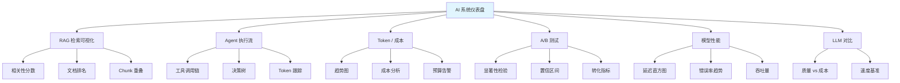
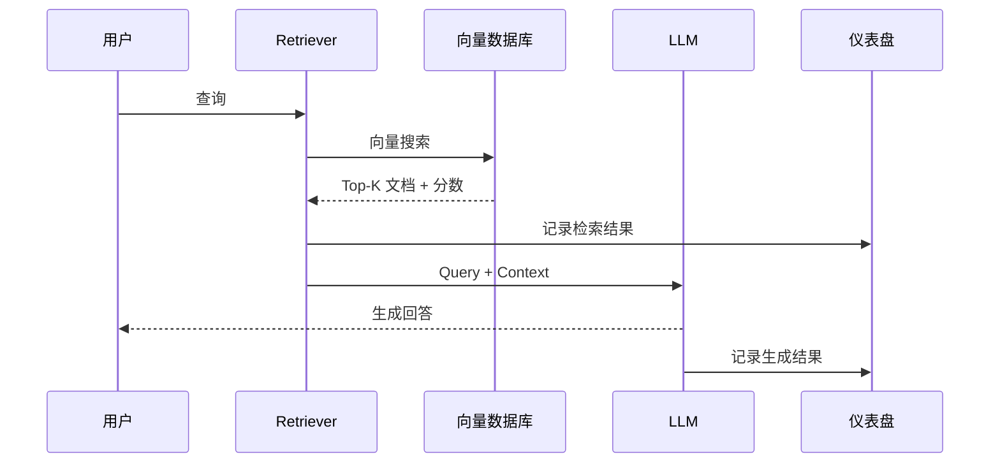
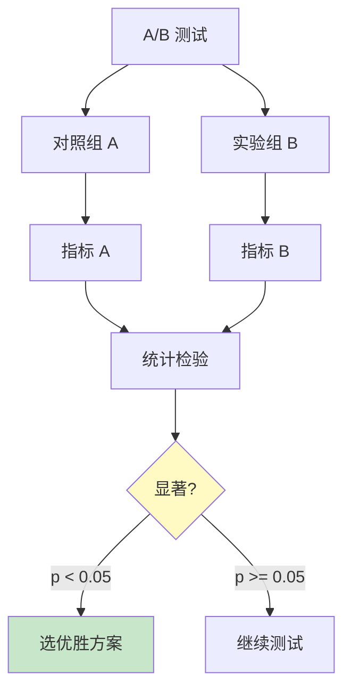
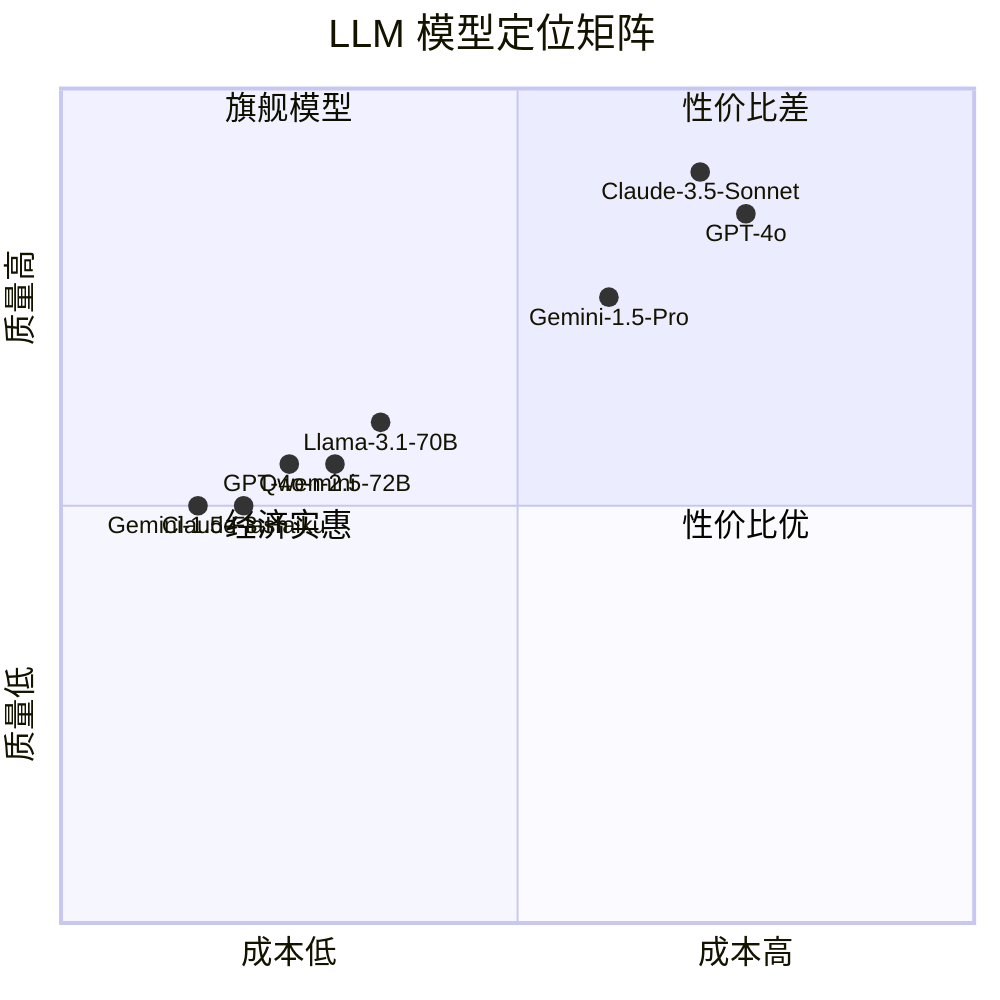

# AI 系统监控仪表盘

> 中文简称：AI 系统监控仪表盘

> **一句话秒懂**: AI 系统仪表盘就是给你 AI 应用的"驾驶舱"——实时看到检索质量、Agent 决策、Token 消耗、A/B 测试、模型性能等一切关键指标。

## 目录

- [仪表盘总览](#仪表盘总览)
- [RAG 检索结果可视化](#rag-检索结果可视化)
- [Agent 执行流可视化](#agent-执行流可视化)
- [Token 用量与成本仪表盘](#token-用量与成本仪表盘)
- [A/B 测试仪表盘](#ab-测试仪表盘)
- [模型性能监控](#模型性能监控)
- [LLM 对比仪表盘](#llm-对比仪表盘)
- [Streamlit 综合仪表盘](#streamlit-综合仪表盘)
- [Gradio 监控面板](#gradio-监控面板)

---

## 仪表盘总览



---

## RAG 检索结果可视化

### 架构图



### 相关性分数分布

```python
import plotly.graph_objects as go
from plotly.subplots import make_subplots
import numpy as np

class RAGVisualizer:
    def __init__(self):
        self.queries = []
        self.retrieval_scores = []
        self.doc_ranks = []

    def log_retrieval(self, query, results):
        self.queries.append(query)
        self.retrieval_scores.append([r["score"] for r in results])
        self.doc_ranks.append([r["doc_id"] for r in results])

    def plot_score_distribution(self):
        fig = make_subplots(
            rows=2, cols=2,
            subplot_titles=[
                "检索分数分布", "Top-K 分数趋势",
                "分数箱线图", "文档命中频率"
            ],
        )

        all_scores = [s for scores in self.retrieval_scores for s in scores]
        fig.add_trace(
            go.Histogram(x=all_scores, nbinsx=30, marker_color="#3498db", name="分数分布"),
            row=1, col=1,
        )

        for i, scores in enumerate(self.retrieval_scores[-10:]):
            fig.add_trace(
                go.Scatter(
                    x=list(range(len(scores))),
                    y=scores,
                    mode="lines+markers",
                    name=f"查询 {i+1}",
                ),
                row=1, col=2,
            )

        fig.add_trace(
            go.Box(
                y=[s for scores in self.retrieval_scores for s in scores],
                name="分数分布",
                marker_color="#e74c3c",
            ),
            row=2, col=1,
        )

        doc_freq = {}
        for ranks in self.doc_ranks:
            for doc_id in ranks[:3]:
                doc_freq[doc_id] = doc_freq.get(doc_id, 0) + 1
        sorted_docs = sorted(doc_freq.items(), key=lambda x: x[1], reverse=True)[:15]
        fig.add_trace(
            go.Bar(
                x=[d[0] for d in sorted_docs],
                y=[d[1] for d in sorted_docs],
                marker_color="#2ecc71",
                name="命中频率",
            ),
            row=2, col=2,
        )

        fig.update_layout(height=800, showlegend=False, title_text="RAG 检索质量仪表盘")
        return fig
```

### 文档排名可视化

```python
import plotly.express as px
import pandas as pd

def visualize_document_ranking(query, results):
    df = pd.DataFrame(results)
    df = df.sort_values("score", ascending=True)

    fig = px.barh(
        df,
        x="score",
        y="doc_title",
        color="score",
        color_continuous_scale="RdYlGn",
        title=f"文档排名 - 查询: '{query}'",
        labels={"score": "相关性分数", "doc_title": "文档"},
    )

    fig.add_vline(
        x=0.7, line_dash="dash", line_color="red",
        annotation_text="高质量阈值",
    )

    fig.update_layout(height=max(400, len(df) * 30))
    return fig
```

### Chunk 重叠可视化

```python
import plotly.graph_objects as go

def visualize_chunk_overlap(chunks, overlap_size=50):
    fig = go.Figure()

    for i, chunk in enumerate(chunks):
        text = chunk["text"]
        start = chunk.get("start_char", 0)
        end = chunk.get("end_char", start + len(text))

        fig.add_trace(go.Bar(
            name=f"Chunk {i+1}",
            x=[end - start],
            y=[f"Chunk {i+1}"],
            orientation="h",
            base=start,
            marker_color=px.colors.qualitative.Set2[i % 8],
            text=f"[{start}:{end}]",
            textposition="inside",
        ))

        if i > 0:
            prev_end = chunks[i-1].get("end_char", 0)
            overlap_start = max(start, prev_end - overlap_size)
            if overlap_start < prev_end:
                fig.add_trace(go.Bar(
                    name=f"重叠 {i}",
                    x=[prev_end - overlap_start],
                    y=[f"Chunk {i+1}"],
                    orientation="h",
                    base=overlap_start,
                    marker_color="rgba(255, 0, 0, 0.3)",
                    showlegend=False,
                ))

    fig.update_layout(
        title="Chunk 切分与重叠可视化",
        xaxis_title="字符位置",
        barmode="overlay",
        height=max(300, len(chunks) * 40),
    )
    return fig
```

---

## Agent 执行流可视化

### 工具调用链

```mermaid
graph TD
    User[用户输入<br/>"帮我查北京天气并订机票"] --> Plan[Agent 规划]
    Plan --> T1[工具1: 天气 API]
    Plan --> T2[工具2: 航班搜索]
    Plan --> T3[工具3: 机票预订]

    T1 -->|"北京 25°C 晴"| Reason[推理: 天气好适合出行]
    Reason --> T2
    T2 -->|"CA1234 800元"| Decide[决策: 价格合理]
    Decide --> T3
    T3 -->|"预订成功"| Final[最终回答]

    style User fill:#e1f5fe
    style Final fill:#c8e6c9
    style Reason fill:#fff9c4
    style Decide fill:#fff9c4
```

### 工具调用链可视化代码

```python
import plotly.graph_objects as go

class AgentFlowVisualizer:
    def __init__(self):
        self.traces = []

    def log_step(self, step_id, step_type, tool_name, input_data, output_data, tokens, duration_ms):
        self.traces.append({
            "step_id": step_id,
            "type": step_type,
            "tool": tool_name,
            "input": input_data,
            "output": output_data,
            "tokens": tokens,
            "duration_ms": duration_ms,
        })

    def plot_execution_flow(self):
        fig = go.Figure()

        colors = {
            "planning": "#3498db",
            "tool_call": "#e74c3c",
            "reasoning": "#f39c12",
            "output": "#2ecc71",
        }

        for i, trace in enumerate(self.traces):
            fig.add_trace(go.Bar(
                name=f"Step {i+1}: {trace['tool']}",
                x=[trace["duration_ms"]],
                y=["执行流"],
                orientation="h",
                base=sum(t["duration_ms"] for t in self.traces[:i]),
                marker_color=colors.get(trace["type"], "#95a5a6"),
                text=f"{trace['tool']}<br>{trace['duration_ms']}ms<br>{trace['tokens']} tokens",
                textposition="inside",
            ))

        fig.update_layout(
            title="Agent 执行时间线",
            xaxis_title="时间 (ms)",
            barmode="overlay",
            height=300,
        )
        return fig

    def plot_token_tracking(self):
        fig = go.Figure()

        steps = [f"Step {i+1}" for i in range(len(self.traces))]
        input_tokens = [t["tokens"].get("input", 0) for t in self.traces]
        output_tokens = [t["tokens"].get("output", 0) for t in self.traces]

        fig.add_trace(go.Bar(name="Input Tokens", x=steps, y=input_tokens, marker_color="#3498db"))
        fig.add_trace(go.Bar(name="Output Tokens", x=steps, y=output_tokens, marker_color="#e74c3c"))

        fig.update_layout(
            title="每步 Token 消耗",
            xaxis_title="执行步骤",
            yaxis_title="Token 数量",
            barmode="stack",
        )
        return fig

    def plot_decision_tree(self):
        node_x, node_y, node_text, node_color = [], [], [], []
        edge_x, edge_y = [], []

        for i, trace in enumerate(self.traces):
            node_x.append(i)
            node_y.append(0)
            node_text.append(f"{trace['tool']}<br>{trace['type']}")
            node_color.append(trace["type"])

            if i > 0:
                edge_x.extend([i - 1, i, None])
                edge_y.extend([0, 0, None])

        fig = go.Figure()
        fig.add_trace(go.Scatter(
            x=edge_x, y=edge_y,
            mode="lines",
            line=dict(width=2, color="#888"),
            hoverinfo="none",
        ))

        color_map = {"planning": "#3498db", "tool_call": "#e74c3c", "reasoning": "#f39c12", "output": "#2ecc71"}
        fig.add_trace(go.Scatter(
            x=node_x, y=node_y,
            mode="markers+text",
            text=node_text,
            textposition="top center",
            marker=dict(
                size=30,
                color=[color_map.get(c, "#95a5a6") for c in node_color],
            ),
            hoverinfo="text",
        ))

        fig.update_layout(
            title="Agent 决策树",
            showlegend=False,
            height=400,
            xaxis=dict(showgrid=False, zeroline=False, showticklabels=False),
            yaxis=dict(showgrid=False, zeroline=False, showticklabels=False),
        )
        return fig
```

---

## Token 用量与成本仪表盘

### 仪表盘布局

```
┌─────────────────────────────────────────────────────────┐
│                  Token 用量与成本仪表盘                    │
├────────────┬────────────┬────────────┬──────────────────┤
│  今日用量   │  本月用量   │  今日成本   │  预算使用率      │
│  1,234,567 │  45,678,901│  ¥123.45   │  ████░░  67%    │
├────────────┴────────────┴────────────┴──────────────────┤
│                                                         │
│  ┌─────────────────────────────────────────────────┐    │
│  │         每日 Token 用量趋势（近30天）              │    │
│  │    █                                           │    │
│  │    █                    █                      │    │
│  │    █        █    █     █   █                   │    │
│  │    █   █    █    █  █  █   █   █               │    │
│  │    █   █    █    █  █  █   █   █    █          │    │
│  └─────────────────────────────────────────────────┘    │
│                                                         │
│  ┌──────────────────┐  ┌──────────────────────────┐     │
│  │ 各模型成本占比    │  │ 每用户成本排名            │     │
│  │ GPT-4o    45%    │  │ 用户A  ¥56.78            │     │
│  │ Claude    30%    │  │ 用户B  ¥34.12            │     │
│  │ Gemini    15%    │  │ 用户C  ¥22.50            │     │
│  │ 其他      10%    │  │                          │     │
│  └──────────────────┘  └──────────────────────────┘     │
└─────────────────────────────────────────────────────────┘
```

### Token 与成本追踪代码

```python
import plotly.graph_objects as go
from plotly.subplots import make_subplots
import pandas as pd
from datetime import datetime, timedelta
import numpy as np

class TokenCostDashboard:
    PRICING = {
        "gpt-4o": {"input": 2.50 / 1_000_000, "output": 10.00 / 1_000_000},
        "gpt-4o-mini": {"input": 0.15 / 1_000_000, "output": 0.60 / 1_000_000},
        "claude-3.5-sonnet": {"input": 3.00 / 1_000_000, "output": 15.00 / 1_000_000},
        "gemini-1.5-pro": {"input": 1.25 / 1_000_000, "output": 5.00 / 1_000_000},
    }

    def __init__(self):
        self.records = []

    def log_usage(self, model, input_tokens, output_tokens, user_id=None, endpoint=None):
        cost = (
            input_tokens * self.PRICING.get(model, {}).get("input", 0)
            + output_tokens * self.PRICING.get(model, {}).get("output", 0)
        )
        self.records.append({
            "timestamp": datetime.now(),
            "model": model,
            "input_tokens": input_tokens,
            "output_tokens": output_tokens,
            "total_tokens": input_tokens + output_tokens,
            "cost": cost,
            "user_id": user_id,
            "endpoint": endpoint,
        })

    def render_dashboard(self):
        df = pd.DataFrame(self.records)
        if df.empty:
            return go.Figure()

        fig = make_subplots(
            rows=3, cols=2,
            specs=[
                [{"type": "indicator"}, {"type": "indicator"}],
                [{"colspan": 2}, None],
                [{"type": "pie"}, {"type": "bar"}],
            ],
            subplot_titles=[
                "今日 Token", "本月成本",
                "每日趋势", "",
                "模型成本占比", "Top 用户成本",
            ],
        )

        today = df[df["timestamp"].dt.date == datetime.now().date()]
        this_month = df[df["timestamp"].dt.month == datetime.now().month]

        fig.add_trace(go.Indicator(
            mode="number",
            value=today["total_tokens"].sum(),
            number={"valueformat": ",.0f"},
        ), row=1, col=1)

        fig.add_trace(go.Indicator(
            mode="number+delta",
            value=this_month["cost"].sum(),
            number={"prefix": "$", "valueformat": ".2f"},
            delta={"reference": this_month["cost"].sum() * 0.8},
        ), row=1, col=2)

        daily = df.groupby(df["timestamp"].dt.date).agg({"total_tokens": "sum", "cost": "sum"}).reset_index()
        fig.add_trace(go.Scatter(
            x=daily["timestamp"], y=daily["total_tokens"],
            fill="tozeroy", mode="lines",
            line_color="#3498db", name="Token 用量",
        ), row=2, col=1)

        fig.add_trace(go.Scatter(
            x=daily["timestamp"], y=daily["cost"],
            fill="tozeroy", mode="lines",
            line_color="#e74c3c", name="成本",
            yaxis="y2",
        ), row=2, col=1)

        model_cost = df.groupby("model")["cost"].sum().reset_index()
        fig.add_trace(go.Pie(
            labels=model_cost["model"],
            values=model_cost["cost"],
        ), row=3, col=1)

        user_cost = df.groupby("user_id")["cost"].sum().nlargest(10).reset_index()
        fig.add_trace(go.Bar(
            x=user_cost["user_id"],
            y=user_cost["cost"],
            marker_color="#2ecc71",
        ), row=3, col=2)

        fig.update_layout(height=1200, title_text="Token 用量与成本仪表盘")
        return fig
```

---

## A/B 测试仪表盘

### 统计学概念



### A/B 测试仪表盘代码

```python
import plotly.graph_objects as go
from plotly.subplots import make_subplots
import numpy as np
from scipy import stats

class ABTestDashboard:
    def __init__(self):
        self.experiments = {}

    def add_experiment(self, name, control_data, treatment_data, metric_name="conversion_rate"):
        control_mean = np.mean(control_data)
        treatment_mean = np.mean(treatment_data)
        control_std = np.std(control_data, ddof=1)
        treatment_std = np.std(treatment_data, ddof=1)

        t_stat, p_value = stats.ttest_ind(control_data, treatment_data)

        se = np.sqrt(control_std**2 / len(control_data) + treatment_std**2 / len(treatment_data))
        ci_95_control = (control_mean - 1.96 * se, control_mean + 1.96 * se)
        ci_95_treatment = (treatment_mean - 1.96 * se, treatment_mean + 1.96 * se)

        effect_size = (treatment_mean - control_mean) / control_mean * 100

        self.experiments[name] = {
            "control_mean": control_mean,
            "treatment_mean": treatment_mean,
            "control_std": control_std,
            "treatment_std": treatment_std,
            "t_stat": t_stat,
            "p_value": p_value,
            "ci_control": ci_95_control,
            "ci_treatment": ci_95_treatment,
            "effect_size": effect_size,
            "significant": p_value < 0.05,
            "metric_name": metric_name,
            "control_n": len(control_data),
            "treatment_n": len(treatment_data),
        }

    def render_dashboard(self):
        fig = make_subplots(
            rows=2, cols=2,
            subplot_titles=[
                "转化率对比（含 95% 置信区间）",
                "效应量与显著性",
                "P 值分布",
                "样本量与统计功效",
            ],
        )

        names = list(self.experiments.keys())

        control_means = [self.experiments[n]["control_mean"] for n in names]
        treatment_means = [self.experiments[n]["treatment_mean"] for n in names]
        control_errors = [
            [self.experiments[n]["control_mean"] - self.experiments[n]["ci_control"][0] for n in names],
            [self.experiments[n]["ci_control"][1] - self.experiments[n]["control_mean"] for n in names],
        ]
        treatment_errors = [
            [self.experiments[n]["treatment_mean"] - self.experiments[n]["ci_treatment"][0] for n in names],
            [self.experiments[n]["ci_treatment"][1] - self.experiments[n]["treatment_mean"] for n in names],
        ]

        fig.add_trace(go.Bar(
            name="对照组 (A)",
            x=names,
            y=control_means,
            error_y=dict(type="data", array=control_errors[1], arrayminus=control_errors[0]),
            marker_color="#3498db",
        ), row=1, col=1)

        fig.add_trace(go.Bar(
            name="实验组 (B)",
            x=names,
            y=treatment_means,
            error_y=dict(type="data", array=treatment_errors[1], arrayminus=treatment_errors[0]),
            marker_color="#e74c3c",
        ), row=1, col=1)

        effect_sizes = [self.experiments[n]["effect_size"] for n in names]
        colors = ["#2ecc71" if self.experiments[n]["significant"] else "#e74c3c" for n in names]
        fig.add_trace(go.Bar(
            name="效应量 (%)",
            x=names,
            y=effect_sizes,
            marker_color=colors,
        ), row=1, col=2)

        p_values = [self.experiments[n]["p_value"] for n in names]
        fig.add_trace(go.Bar(
            name="P 值",
            x=names,
            y=p_values,
            marker_color=["#2ecc71" if p < 0.05 else "#95a5a6" for p in p_values],
        ), row=2, col=1)
        fig.add_hline(y=0.05, line_dash="dash", line_color="red", row=2, col=1)

        fig.add_trace(go.Bar(
            name="对照组样本",
            x=names,
            y=[self.experiments[n]["control_n"] for n in names],
            marker_color="#3498db",
        ), row=2, col=2)
        fig.add_trace(go.Bar(
            name="实验组样本",
            x=names,
            y=[self.experiments[n]["treatment_n"] for n in names],
            marker_color="#e74c3c",
        ), row=2, col=2)

        fig.update_layout(height=800, title_text="A/B 测试仪表盘", barmode="group")
        return fig
```

---

## 模型性能监控

### 延迟直方图 + 错误率趋势

```python
import plotly.graph_objects as go
from plotly.subplots import make_subplots
import numpy as np
import pandas as pd
from datetime import datetime, timedelta

class ModelPerformanceMonitor:
    def __init__(self):
        self.metrics = []

    def log_request(self, model, latency_ms, success, tokens_in=0, tokens_out=0):
        self.metrics.append({
            "timestamp": datetime.now(),
            "model": model,
            "latency_ms": latency_ms,
            "success": success,
            "tokens_in": tokens_in,
            "tokens_out": tokens_out,
        })

    def render_dashboard(self):
        df = pd.DataFrame(self.metrics)
        if df.empty:
            return go.Figure()

        fig = make_subplots(
            rows=3, cols=2,
            specs=[
                [{"colspan": 2}, None],
                [{"type": "histogram"}, {"type": "histogram"}],
                [{"colspan": 2}, None],
            ],
            subplot_titles=[
                "延迟趋势 (P50/P95/P99)",
                "延迟分布直方图",
                "错误率分布",
                "错误率趋势与吞吐量",
            ],
        )

        df.set_index("timestamp", inplace=True)
        hourly = df.resample("1h").agg({
            "latency_ms": ["mean", lambda x: np.percentile(x, 95), lambda x: np.percentile(x, 99)],
            "success": "mean",
            "model": "count",
        })
        hourly.columns = ["mean_latency", "p95", "p99", "success_rate", "request_count"]
        hourly.reset_index(inplace=True)

        fig.add_trace(go.Scatter(
            x=hourly["timestamp"], y=hourly["mean_latency"],
            name="P50", line=dict(color="#2ecc71"),
        ), row=1, col=1)
        fig.add_trace(go.Scatter(
            x=hourly["timestamp"], y=hourly["p95"],
            name="P95", line=dict(color="#f39c12"),
        ), row=1, col=1)
        fig.add_trace(go.Scatter(
            x=hourly["timestamp"], y=hourly["p99"],
            name="P99", line=dict(color="#e74c3c"),
        ), row=1, col=1)

        fig.add_trace(go.Histogram(
            x=df["latency_ms"],
            nbinsx=50,
            marker_color="#3498db",
            name="延迟分布",
        ), row=2, col=1)

        error_rates = (1 - df.resample("1h")["success"].mean()) * 100
        fig.add_trace(go.Histogram(
            x=error_rates.dropna(),
            nbinsx=30,
            marker_color="#e74c3c",
            name="错误率分布",
        ), row=2, col=2)

        fig.add_trace(go.Scatter(
            x=hourly["timestamp"],
            y=(1 - hourly["success_rate"]) * 100,
            name="错误率 (%)",
            line=dict(color="#e74c3c"),
        ), row=3, col=1)

        fig.add_trace(go.Bar(
            x=hourly["timestamp"],
            y=hourly["request_count"],
            name="请求数",
            marker_color="#3498db",
            yaxis="y2",
        ), row=3, col=1)

        fig.update_layout(height=1200, title_text="模型性能监控")
        return fig
```

---

## LLM 对比仪表盘

### 质量 vs 成本权衡



### LLM 对比代码

```python
import plotly.graph_objects as go
from plotly.subplots import make_subplots
import pandas as pd

class LLMComparisonDashboard:
    BENCHMARKS = {
        "gpt-4o": {
            "quality_score": 92, "speed_tps": 85, "cost_per_1m_input": 2.50,
            "cost_per_1m_output": 10.00, "context_window": 128000,
            "arena_elo": 1287, "mt_bench": 9.3,
        },
        "gpt-4o-mini": {
            "quality_score": 78, "speed_tps": 160, "cost_per_1m_input": 0.15,
            "cost_per_1m_output": 0.60, "context_window": 128000,
            "arena_elo": 1153, "mt_bench": 8.2,
        },
        "claude-3.5-sonnet": {
            "quality_score": 94, "speed_tps": 80, "cost_per_1m_input": 3.00,
            "cost_per_1m_output": 15.00, "context_window": 200000,
            "arena_elo": 1302, "mt_bench": 9.4,
        },
        "claude-3-haiku": {
            "quality_score": 72, "speed_tps": 200, "cost_per_1m_input": 0.25,
            "cost_per_1m_output": 1.25, "context_window": 200000,
            "arena_elo": 1108, "mt_bench": 7.8,
        },
        "gemini-1.5-pro": {
            "quality_score": 85, "speed_tps": 90, "cost_per_1m_input": 1.25,
            "cost_per_1m_output": 5.00, "context_window": 2000000,
            "arena_elo": 1235, "mt_bench": 8.9,
        },
        "gemini-1.5-flash": {
            "quality_score": 70, "speed_tps": 250, "cost_per_1m_input": 0.075,
            "cost_per_1m_output": 0.30, "context_window": 1000000,
            "arena_elo": 1085, "mt_bench": 7.5,
        },
        "llama-3.1-70b": {
            "quality_score": 80, "speed_tps": 120, "cost_per_1m_input": 0.60,
            "cost_per_1m_output": 0.80, "context_window": 128000,
            "arena_elo": 1198, "mt_bench": 8.5,
        },
    }

    def render_dashboard(self):
        df = pd.DataFrame(self.BENCHMARKS).T.reset_index()
        df.columns = ["model"] + list(df.columns[1:])

        fig = make_subplots(
            rows=2, cols=2,
            specs=[
                [{"type": "scatter"}, {"type": "bar"}],
                [{"type": "scatter"}, {"type": "bar"}],
            ],
            subplot_titles=[
                "质量 vs 成本权衡",
                "速度基准对比 (tokens/s)",
                "Arena ELO vs MT-Bench",
                "上下文窗口对比",
            ],
        )

        fig.add_trace(go.Scatter(
            x=df["cost_per_1m_input"] + df["cost_per_1m_output"],
            y=df["quality_score"],
            mode="markers+text",
            text=df["model"],
            textposition="top center",
            marker=dict(size=15, color=df["quality_score"], colorscale="RdYlGn", showscale=True),
            name="质量-成本",
        ), row=1, col=1)

        fig.update_xaxes(title_text="成本 ($/1M tokens)", row=1, col=1)
        fig.update_yaxes(title_text="质量分数", row=1, col=1)

        fig.add_trace(go.Bar(
            x=df["model"],
            y=df["speed_tps"],
            marker_color="#3498db",
            name="速度",
        ), row=1, col=2)

        fig.add_trace(go.Scatter(
            x=df["arena_elo"],
            y=df["mt_bench"],
            mode="markers+text",
            text=df["model"],
            textposition="top center",
            marker=dict(size=15, color="#e74c3c"),
            name="ELO vs MT-Bench",
        ), row=2, col=1)

        fig.add_trace(go.Bar(
            x=df["model"],
            y=df["context_window"] / 1000,
            marker_color="#2ecc71",
            name="上下文窗口 (K)",
        ), row=2, col=2)

        fig.update_layout(height=900, title_text="LLM 模型对比仪表盘")
        return fig
```

---

## Streamlit 综合仪表盘

```python
import streamlit as st
import plotly.graph_objects as go
import pandas as pd
from datetime import datetime

st.set_page_config(page_title="AI 系统仪表盘", layout="wide")

st.title("🤖 AI 系统监控仪表盘")

tab1, tab2, tab3, tab4, tab5 = st.tabs([
    "📊 RAG 检索", "🤖 Agent 执行", "💰 Token 成本", "🧪 A/B 测试", "📈 模型性能"
])

with tab1:
    st.header("RAG 检索结果监控")

    col1, col2, col3, col4 = st.columns(4)
    with col1:
        st.metric("平均检索分数", "0.82", delta="+0.03")
    with col2:
        st.metric("Top-3 命中率", "87%", delta="+2%")
    with col3:
        st.metric("检索延迟 P95", "245ms", delta="-12ms")
    with col4:
        st.metric("Chunk 覆盖率", "93%", delta="+1%")

    st.subheader("检索分数分布")
    rag_viz = RAGVisualizer()
    st.plotly_chart(rag_viz.plot_score_distribution(), use_container_width=True)

    st.subheader("最近查询详情")
    queries_df = pd.DataFrame({
        "时间": [datetime.now()] * 5,
        "查询": ["如何使用 RAG?", "向量数据库选型", "Chunk 策略对比", "Embedding 模型推荐", "RAG 优化技巧"],
        "Top-1 分数": [0.95, 0.87, 0.91, 0.83, 0.89],
        "Top-3 平均": [0.88, 0.79, 0.85, 0.78, 0.82],
        "检索耗时(ms)": [120, 230, 180, 95, 150],
    })
    st.dataframe(queries_df, use_container_width=True)

with tab2:
    st.header("Agent 执行流监控")

    col1, col2, col3 = st.columns(3)
    with col1:
        st.metric("平均步骤数", "4.2", delta="-0.3")
    with col2:
        st.metric("平均耗时", "3.5s", delta="-0.8s")
    with col3:
        st.metric("成功率", "94%", delta="+1%")

    agent_viz = AgentFlowVisualizer()
    col_left, col_right = st.columns(2)
    with col_left:
        st.subheader("执行时间线")
        st.plotly_chart(agent_viz.plot_execution_flow(), use_container_width=True)
    with col_right:
        st.subheader("Token 消耗追踪")
        st.plotly_chart(agent_viz.plot_token_tracking(), use_container_width=True)

with tab3:
    st.header("Token 用量与成本")

    cost_dash = TokenCostDashboard()

    col1, col2, col3, col4 = st.columns(4)
    with col1:
        st.metric("今日 Token", "1,234,567", delta="+12%")
    with col2:
        st.metric("今日成本", "$45.67", delta="+8%")
    with col3:
        st.metric("本月累计", "$1,234.56", delta="+15%")
    with col4:
        budget = 2000
        used = 1234.56
        st.metric("预算使用率", f"{used/budget:.1%}", delta=f"${budget-used:.2f} 剩余")

    st.plotly_chart(cost_dash.render_dashboard(), use_container_width=True)

    st.subheader("成本告警")
    alert_df = pd.DataFrame({
        "时间": [datetime.now()],
        "类型": ["预算预警"],
        "详情": ["本月成本已达预算的 62%，预计将于 25 号超出"],
        "状态": ["⚠️ 警告"],
    })
    st.dataframe(alert_df, use_container_width=True)

with tab4:
    st.header("A/B 测试结果")

    ab_dash = ABTestDashboard()
    np.random.seed(42)
    ab_dash.add_experiment(
        "Prompt v2 vs v1",
        np.random.binomial(1, 0.12, 1000).astype(float),
        np.random.binomial(1, 0.15, 1000).astype(float),
    )
    ab_dash.add_experiment(
        "Reranker ON/OFF",
        np.random.binomial(1, 0.18, 800).astype(float),
        np.random.binomial(1, 0.22, 800).astype(float),
    )

    st.plotly_chart(ab_dash.render_dashboard(), use_container_width=True)

with tab5:
    st.header("模型性能监控")

    perf_monitor = ModelPerformanceMonitor()
    st.plotly_chart(perf_monitor.render_dashboard(), use_container_width=True)
```

---

## Gradio 监控面板

```python
import gradio as gr
import plotly.graph_objects as go
import pandas as pd
import numpy as np
from datetime import datetime, timedelta

def create_monitoring_dashboard():
    with gr.Blocks(title="AI 系统监控面板", theme=gr.themes.Soft()) as demo:
        gr.Markdown("# 🤖 AI 系统实时监控面板")

        with gr.Row():
            with gr.Column(scale=1):
                gr.Markdown("### 核心指标")
                token_metric = gr.Number(label="今日 Token 用量", value=1_234_567)
                cost_metric = gr.Number(label="今日成本 ($)", value=45.67)
                latency_metric = gr.Number(label="平均延迟 (ms)", value=320)
                error_metric = gr.Number(label="错误率 (%)", value=1.2)

            with gr.Column(scale=2):
                gr.Markdown("### 每日趋势")
                trend_plot = gr.Plot()

        with gr.Row():
            with gr.Column():
                gr.Markdown("### 模型调用分布")
                model_pie = gr.Plot()
            with gr.Column():
                gr.Markdown("### 延迟分布")
                latency_hist = gr.Plot()

        with gr.Row():
            with gr.Column():
                gr.Markdown("### 最近请求日志")
                log_table = gr.Dataframe(
                    headers=["时间", "模型", "端点", "Token", "延迟(ms)", "状态"],
                    datatype=["str", "str", "str", "number", "number", "str"],
                    row_count=20,
                )

        def update_dashboard():
            dates = [datetime.now() - timedelta(days=i) for i in range(30, 0, -1)]
            tokens = np.random.randint(500_000, 2_000_000, 30)

            trend_fig = go.Figure()
            trend_fig.add_trace(go.Scatter(x=dates, y=tokens, fill="tozeroy", mode="lines", name="Token"))
            trend_fig.update_layout(title="每日 Token 用量", height=300)

            models = ["GPT-4o", "Claude-3.5", "Gemini-Pro", "GPT-4o-mini", "Llama-3"]
            calls = [4520, 3200, 2800, 5600, 1200]
            pie_fig = go.Figure(data=[go.Pie(labels=models, values=calls)])
            pie_fig.update_layout(title="模型调用分布", height=300)

            latencies = np.random.exponential(300, 1000)
            hist_fig = go.Figure(data=[go.Histogram(x=latencies, nbinsx=50)])
            hist_fig.update_layout(title="延迟分布", height=300)

            logs = pd.DataFrame({
                "时间": [datetime.now() - timedelta(minutes=i) for i in range(20)],
                "模型": np.random.choice(models, 20),
                "端点": np.random.choice(["chat", "completion", "embedding", "rag"], 20),
                "Token": np.random.randint(100, 5000, 20),
                "延迟(ms)": np.random.randint(100, 2000, 20),
                "状态": np.random.choice(["✅ 成功", "✅ 成功", "✅ 成功", "❌ 超时"], 20),
            })

            return (
                trend_fig, pie_fig, hist_fig, logs,
                int(np.sum(tokens[-1:])), float(np.sum(tokens[-1:]) * 0.00001),
                int(np.mean(latencies)), float(np.mean(np.random.choice([0, 0, 0, 1], 1000)) * 100),
            )

        demo.load(
            update_dashboard,
            outputs=[trend_plot, model_pie, latency_hist, log_table,
                     token_metric, cost_metric, latency_metric, error_metric],
            every=30,
        )

    return demo

if __name__ == "__main__":
    demo = create_monitoring_dashboard()
    demo.launch(server_port=7860)
```

---

## 仪表盘选型指南

| 工具 | 优势 | 劣势 | 适用场景 |
|------|------|------|----------|
| **Streamlit** | 上手快、Python 原生 | 性能差、定制性有限 | 内部原型、数据分析 |
| **Gradio** | 交互强、ML 生态好 | 复杂布局难 | ML Demo、用户交互 |
| **Plotly Dash** | 灵活、生产级 | 学习曲线陡 | 生产仪表盘 |
| **Grafana** | 专业监控、告警强 | 需配数据库 | 运维监控 |
| **LangSmith** | LLM 专项 | 商业产品 | LLM 应用追踪 |
| **Weights & Biases** | 实验追踪强 | 成本高 | ML 实验管理 |

---

## 参考资料

- [Streamlit 文档](https://docs.streamlit.io/)
- [Gradio 文档](https://www.gradio.app/docs)
- [Plotly Dash](https://dash.plotly.com/)
- [LangSmith](https://docs.smith.langchain.com/)
- [Grafana](https://grafana.com/docs/)
- [Weights & Biases](https://docs.wandb.ai/)

## Related

- [[../../11_模型运维/08_Observability/AI_Observability_Guide_2026|AI 可观测性指南]] — 系统监控指标定义
- [[../../08_模型评估/02_Benchmarks/LLM_Benchmark_Suite_2026|LLM 评估基准]] — 仪表盘数据来源
- [[../../07_模型训练/07_Monitoring/Training_Monitoring_2026|训练监控]] — 训练指标可视化
- [[../../04_计算机视觉/08_Multimodal_Vision/Multimodal_Vision_for_dummy|多模态视觉]] — CV 系统可视化需求
- [[94_可视化/README.md|94_Visualization README]]
- [[前端应用/atlas/README.md|atlas README]]
- [[前端应用/atlas/docs/performance.md|performance]]
