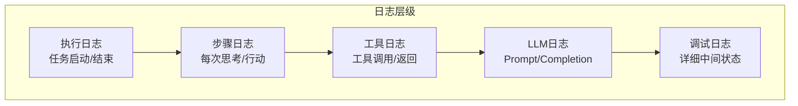

# Agent 可观测性与调试 (Agent Observability & Debugging 2026)

> **一句话理解**: Agent 可观测性是 AI 智能体的"黑匣子"——记录每一次思考、每一个决策、每一次工具调用，让开发者能够回放执行过程、定位问题根因、优化性能瓶颈。

---

## 1. 为什么需要可观测性？

### 1.1 Agent 调试的独特挑战

| 挑战 | 传统软件 | Agent 系统 | 影响 |
|-----|---------|-----------|------|
| **执行路径不确定** | 代码路径固定 | LLM 决策动态变化 | 难以预测执行流程 |
| **输出不确定性** | 相同输入相同输出 | 相同输入可能不同输出 | 难以复现问题 |
| **调试边界模糊** | 代码错误清晰 | 提示词/推理错误难定位 | 根因分析困难 |
| **外部依赖多** | API 调用有限 | 多工具、多模型协作 | 链路追踪复杂 |
| **成本敏感** | 计算成本固定 | Token 消耗动态变化 | 需要实时监控 |

### 1.2 典型调试场景

```
场景1: Agent 无限循环
├── 症状: Agent 在某一步反复执行
├── 传统调试: 查看代码循环条件
├── Agent 调试: 分析每步的 LLM 输出，找出决策逻辑问题
└── 需要: 完整的思考链路追踪

场景2: 工具选择错误
├── 症状: Agent 调用了错误的工具
├── 传统调试: 检查函数调用参数
├── Agent 调试: 分析工具描述、上下文、LLM 推理过程
└── 需要: 工具选择决策日志

场景3: 响应质量差
├── 症状: 最终回答质量不佳
├── 传统调试: 检查算法逻辑
├── Agent 调试: 回放整个执行过程，找出信息丢失点
└── 需要: 全链路数据流追踪
```

---

## 2. 可观测性三大支柱

### 2.1 日志 (Logging)



### 2.2 指标 (Metrics)

| 指标类型 | 具体指标 | 说明 |
|---------|---------|------|
| **执行指标** | 任务成功率、平均步骤数、超时率 | 整体执行效率 |
| **LLM 指标** | Token 消耗、延迟分布、成本 | 模型使用效率 |
| **工具指标** | 调用频率、成功率、平均耗时 | 工具性能 |
| **质量指标** | 用户满意度、错误率、重试率 | 输出质量 |
| **资源指标** | 内存占用、CPU 使用、队列深度 | 系统资源 |

### 2.3 追踪 (Tracing)

```
Trace 结构:

Trace (任务执行)
├── Span 1: 任务解析
│   ├── Event: LLM 调用开始
│   ├── Event: LLM 调用结束
│   └── Attributes: {prompt_tokens: 150, model: "gpt-4"}
│
├── Span 2: 步骤1 - 工具选择
│   ├── Span 2.1: LLM 推理
│   ├── Span 2.2: 工具调用 (search_api)
│   │   ├── Event: 请求发送
│   │   └── Event: 响应接收
│   └── Span 2.3: 结果处理
│
├── Span 3: 步骤2 - 生成回答
│   └── Span 3.1: LLM 生成
│
└── Span 4: 结果返回
```

---

## 3. 日志系统实现

### 3.1 结构化日志设计

```python
from dataclasses import dataclass, field
from typing import Any, Optional
from datetime import datetime
from enum import Enum
import json
import uuid

class LogLevel(Enum):
    DEBUG = "debug"
    INFO = "info"
    WARNING = "warning"
    ERROR = "error"

class LogEventType(Enum):
    # 执行生命周期
    TASK_START = "task_start"
    TASK_END = "task_end"
    TASK_ERROR = "task_error"
    
    # 步骤生命周期
    STEP_START = "step_start"
    STEP_END = "step_end"
    STEP_RETRY = "step_retry"
    
    # LLM 交互
    LLM_CALL_START = "llm_call_start"
    LLM_CALL_END = "llm_call_end"
    LLM_STREAM = "llm_stream"
    
    # 工具交互
    TOOL_CALL_START = "tool_call_start"
    TOOL_CALL_END = "tool_call_end"
    TOOL_ERROR = "tool_error"
    
    # 状态变更
    STATE_UPDATE = "state_update"
    CHECKPOINT = "checkpoint"
    
    # 决策点
    DECISION = "decision"
    PLANNING = "planning"

@dataclass
class AgentLogEvent:
    """Agent 结构化日志事件"""
    
    # 基础字段
    event_id: str = field(default_factory=lambda: str(uuid.uuid4()))
    timestamp: datetime = field(default_factory=datetime.now)
    event_type: LogEventType = LogEventType.STEP_START
    level: LogLevel = LogLevel.INFO
    
    # 上下文字段
    trace_id: str = ""           # 追踪ID (整个任务)
    span_id: str = ""            # 当前Span ID
    parent_span_id: Optional[str] = None
    
    # Agent 上下文
    agent_name: str = ""
    agent_version: str = ""
    task_id: str = ""
    step_index: int = 0
    
    # 事件详情
    message: str = ""
    data: dict = field(default_factory=dict)
    
    # LLM 相关
    model: Optional[str] = None
    prompt_tokens: Optional[int] = None
    completion_tokens: Optional[int] = None
    total_tokens: Optional[int] = None
    latency_ms: Optional[float] = None
    
    # 工具相关
    tool_name: Optional[str] = None
    tool_input: Optional[dict] = None
    tool_output: Optional[Any] = None
    
    # 错误信息
    error_type: Optional[str] = None
    error_message: Optional[str] = None
    error_stacktrace: Optional[str] = None
    
    # 自定义属性
    attributes: dict = field(default_factory=dict)
    
    def to_json(self) -> str:
        """转换为 JSON 字符串"""
        return json.dumps({
            "event_id": self.event_id,
            "timestamp": self.timestamp.isoformat(),
            "event_type": self.event_type.value,
            "level": self.level.value,
            "trace_id": self.trace_id,
            "span_id": self.span_id,
            "parent_span_id": self.parent_span_id,
            "agent_name": self.agent_name,
            "agent_version": self.agent_version,
            "task_id": self.task_id,
            "step_index": self.step_index,
            "message": self.message,
            "data": self.data,
            "model": self.model,
            "prompt_tokens": self.prompt_tokens,
            "completion_tokens": self.completion_tokens,
            "total_tokens": self.total_tokens,
            "latency_ms": self.latency_ms,
            "tool_name": self.tool_name,
            "tool_input": self.tool_input,
            "tool_output": str(self.tool_output) if self.tool_output else None,
            "error_type": self.error_type,
            "error_message": self.error_message,
            "error_stacktrace": self.error_stacktrace,
            "attributes": self.attributes
        }, ensure_ascii=False)


class AgentLogger:
    """Agent 日志记录器"""
    
    def __init__(
        self,
        agent_name: str,
        agent_version: str = "1.0.0",
        output_file: Optional[str] = None,
        log_level: LogLevel = LogLevel.INFO
    ):
        self.agent_name = agent_name
        self.agent_version = agent_version
        self.output_file = output_file
        self.log_level = log_level
        
        self._trace_id = ""
        self._task_id = ""
        self._current_span_id = ""
        self._step_index = 0
    
    def start_task(self, task_id: str, task_input: str) -> str:
        """开始任务，返回 trace_id"""
        import uuid
        self._trace_id = str(uuid.uuid4())
        self._task_id = task_id
        self._step_index = 0
        
        event = AgentLogEvent(
            event_type=LogEventType.TASK_START,
            level=LogLevel.INFO,
            trace_id=self._trace_id,
            task_id=task_id,
            agent_name=self.agent_name,
            agent_version=self.agent_version,
            message=f"Task started: {task_id}",
            data={"input": task_input[:500]}  # 截断长输入
        )
        self._write_log(event)
        
        return self._trace_id
    
    def end_task(self, output: str, success: bool = True):
        """结束任务"""
        event = AgentLogEvent(
            event_type=LogEventType.TASK_END,
            level=LogLevel.INFO if success else LogLevel.ERROR,
            trace_id=self._trace_id,
            task_id=self._task_id,
            agent_name=self.agent_name,
            agent_version=self.agent_version,
            message=f"Task ended: {'success' if success else 'failed'}",
            data={"output": output[:500], "success": success}
        )
        self._write_log(event)
    
    def start_step(self, step_type: str, description: str) -> str:
        """开始步骤，返回 span_id"""
        import uuid
        self._step_index += 1
        span_id = str(uuid.uuid4())
        self._current_span_id = span_id
        
        event = AgentLogEvent(
            event_type=LogEventType.STEP_START,
            level=LogLevel.INFO,
            trace_id=self._trace_id,
            span_id=span_id,
            task_id=self._task_id,
            step_index=self._step_index,
            agent_name=self.agent_name,
            agent_version=self.agent_version,
            message=f"Step {self._step_index}: {step_type}",
            data={"step_type": step_type, "description": description}
        )
        self._write_log(event)
        
        return span_id
    
    def end_step(self, result: dict):
        """结束步骤"""
        event = AgentLogEvent(
            event_type=LogEventType.STEP_END,
            level=LogLevel.INFO,
            trace_id=self._trace_id,
            span_id=self._current_span_id,
            task_id=self._task_id,
            step_index=self._step_index,
            agent_name=self.agent_name,
            agent_version=self.agent_version,
            message=f"Step {self._step_index} completed",
            data={"result": result}
        )
        self._write_log(event)
    
    def log_llm_call(
        self,
        model: str,
        prompt: str,
        completion: str,
        prompt_tokens: int,
        completion_tokens: int,
        latency_ms: float
    ):
        """记录 LLM 调用"""
        event = AgentLogEvent(
            event_type=LogEventType.LLM_CALL_END,
            level=LogLevel.INFO,
            trace_id=self._trace_id,
            span_id=self._current_span_id,
            task_id=self._task_id,
            step_index=self._step_index,
            agent_name=self.agent_name,
            agent_version=self.agent_version,
            model=model,
            prompt_tokens=prompt_tokens,
            completion_tokens=completion_tokens,
            total_tokens=prompt_tokens + completion_tokens,
            latency_ms=latency_ms,
            data={
                "prompt": prompt[:1000],  # 截断
                "completion": completion[:500]
            }
        )
        self._write_log(event)
    
    def log_tool_call(
        self,
        tool_name: str,
        tool_input: dict,
        tool_output: Any,
        latency_ms: float
    ):
        """记录工具调用"""
        event = AgentLogEvent(
            event_type=LogEventType.TOOL_CALL_END,
            level=LogLevel.INFO,
            trace_id=self._trace_id,
            span_id=self._current_span_id,
            task_id=self._task_id,
            step_index=self._step_index,
            agent_name=self.agent_name,
            agent_version=self.agent_version,
            tool_name=tool_name,
            tool_input=tool_input,
            tool_output=tool_output,
            latency_ms=latency_ms,
            data={
                "tool_name": tool_name,
                "latency_ms": latency_ms
            }
        )
        self._write_log(event)
    
    def log_error(
        self,
        error: Exception,
        context: dict = None
    ):
        """记录错误"""
        import traceback
        
        event = AgentLogEvent(
            event_type=LogEventType.TASK_ERROR,
            level=LogLevel.ERROR,
            trace_id=self._trace_id,
            span_id=self._current_span_id,
            task_id=self._task_id,
            step_index=self._step_index,
            agent_name=self.agent_name,
            agent_version=self.agent_version,
            error_type=type(error).__name__,
            error_message=str(error),
            error_stacktrace=traceback.format_exc(),
            data=context or {}
        )
        self._write_log(event)
    
    def log_decision(
        self,
        decision_type: str,
        options: list,
        selected: str,
        reasoning: str
    ):
        """记录决策点"""
        event = AgentLogEvent(
            event_type=LogEventType.DECISION,
            level=LogLevel.INFO,
            trace_id=self._trace_id,
            span_id=self._current_span_id,
            task_id=self._task_id,
            step_index=self._step_index,
            agent_name=self.agent_name,
            agent_version=self.agent_version,
            message=f"Decision: {decision_type}",
            data={
                "decision_type": decision_type,
                "options": options,
                "selected": selected,
                "reasoning": reasoning
            }
        )
        self._write_log(event)
    
    def _write_log(self, event: AgentLogEvent):
        """写入日志"""
        log_line = event.to_json()
        
        # 输出到文件
        if self.output_file:
            with open(self.output_file, 'a') as f:
                f.write(log_line + '\n')
        
        # 输出到控制台
        print(f"[{event.timestamp.isoformat()}] [{event.level.value.upper()}] {event.message}")
```

### 3.2 OpenTelemetry 集成

```python
"""
OpenTelemetry 集成实现

将 Agent 执行追踪集成到标准的可观测性框架中
"""

from opentelemetry import trace
from opentelemetry.sdk.trace import TracerProvider
from opentelemetry.sdk.trace.export import BatchSpanProcessor
from opentelemetry.exporter.otlp.proto.grpc.trace_exporter import OTLPSpanExporter
from opentelemetry.sdk.resources import Resource
import functools

class AgentTracer:
    """基于 OpenTelemetry 的 Agent 追踪器"""
    
    def __init__(
        self,
        service_name: str = "ai-agent",
        otlp_endpoint: str = "http://localhost:4317"
    ):
        # 配置资源
        resource = Resource.create({
            "service.name": service_name,
            "service.version": "1.0.0"
        })
        
        # 配置 TracerProvider
        provider = TracerProvider(resource=resource)
        
        # 配置导出器
        otlp_exporter = OTLPSpanExporter(endpoint=otlp_endpoint)
        provider.add_span_processor(BatchSpanProcessor(otlp_exporter))
        
        # 设置全局 tracer
        trace.set_tracer_provider(provider)
        self.tracer = trace.get_tracer(__name__)
    
    def trace_agent_execution(self, func):
        """装饰器：追踪 Agent 执行"""
        @functools.wraps(func)
        async def wrapper(*args, **kwargs):
            with self.tracer.start_as_current_span(
                f"agent.{func.__name__}",
                attributes={
                    "agent.function": func.__name__,
                    "agent.args_count": len(args),
                }
            ) as span:
                try:
                    result = await func(*args, **kwargs)
                    span.set_attribute("agent.success", True)
                    return result
                except Exception as e:
                    span.set_attribute("agent.success", False)
                    span.set_attribute("agent.error", str(e))
                    span.record_exception(e)
                    raise
        return wrapper
    
    def trace_llm_call(self, model: str, prompt: str, **kwargs):
        """追踪 LLM 调用"""
        return self.tracer.start_as_current_span(
            "llm.call",
            attributes={
                "llm.model": model,
                "llm.prompt_length": len(prompt),
                "llm.temperature": kwargs.get("temperature", 0.7),
                "llm.max_tokens": kwargs.get("max_tokens", 0),
            }
        )
    
    def trace_tool_call(self, tool_name: str, tool_input: dict):
        """追踪工具调用"""
        return self.tracer.start_as_current_span(
            f"tool.{tool_name}",
            attributes={
                "tool.name": tool_name,
                "tool.input_keys": list(tool_input.keys()),
            }
        )


# 使用示例
tracer = AgentTracer(service_name="my-agent")

@tracer.trace_agent_execution
async def run_agent(task: str):
    """运行 Agent"""
    async with tracer.trace_llm_call("gpt-4", task) as span:
        # LLM 调用
        response = await llm.generate(task)
        span.set_attribute("llm.response_length", len(response))
    
    async with tracer.trace_tool_call("search", {"query": task}) as span:
        # 工具调用
        results = await search_tool.run({"query": task})
        span.set_attribute("tool.result_count", len(results))
    
    return results
```

---

## 4. 指标收集系统

### 4.1 Prometheus 指标定义

```python
"""
Prometheus 指标收集实现
"""

from prometheus_client import Counter, Histogram, Gauge, Info
import time
from functools import wraps

# 定义指标

# 计数器
AGENT_TASKS_TOTAL = Counter(
    'agent_tasks_total',
    'Total number of agent tasks',
    ['agent_name', 'status']  # status: success, failure
)

AGENT_STEPS_TOTAL = Counter(
    'agent_steps_total',
    'Total number of agent steps executed',
    ['agent_name', 'step_type']
)

AGENT_TOOL_CALLS_TOTAL = Counter(
    'agent_tool_calls_total',
    'Total number of tool calls',
    ['agent_name', 'tool_name', 'status']
)

AGENT_LLM_CALLS_TOTAL = Counter(
    'agent_llm_calls_total',
    'Total number of LLM calls',
    ['agent_name', 'model']
)

AGENT_TOKENS_TOTAL = Counter(
    'agent_tokens_total',
    'Total tokens consumed',
    ['agent_name', 'model', 'token_type']  # token_type: prompt, completion
)

# 直方图 (延迟)
AGENT_TASK_DURATION = Histogram(
    'agent_task_duration_seconds',
    'Duration of agent tasks',
    ['agent_name'],
    buckets=[0.1, 0.5, 1, 2, 5, 10, 30, 60, 120, 300]
)

AGENT_STEP_DURATION = Histogram(
    'agent_step_duration_seconds',
    'Duration of agent steps',
    ['agent_name', 'step_type'],
    buckets=[0.01, 0.05, 0.1, 0.5, 1, 2, 5, 10]
)

AGENT_TOOL_DURATION = Histogram(
    'agent_tool_duration_seconds',
    'Duration of tool calls',
    ['agent_name', 'tool_name'],
    buckets=[0.01, 0.05, 0.1, 0.5, 1, 2, 5]
)

AGENT_LLM_DURATION = Histogram(
    'agent_llm_duration_seconds',
    'Duration of LLM calls',
    ['agent_name', 'model'],
    buckets=[0.1, 0.5, 1, 2, 5, 10, 30]
)

# 仪表盘 (当前状态)
AGENT_ACTIVE_TASKS = Gauge(
    'agent_active_tasks',
    'Number of currently active tasks',
    ['agent_name']
)

AGENT_QUEUE_DEPTH = Gauge(
    'agent_queue_depth',
    'Number of tasks in queue',
    ['agent_name', 'priority']
)

AGENT_MEMORY_USAGE = Gauge(
    'agent_memory_bytes',
    'Memory usage of agent',
    ['agent_name']
)

# 信息
AGENT_INFO = Info(
    'agent',
    'Agent information'
)


class MetricsCollector:
    """指标收集器"""
    
    def __init__(self, agent_name: str):
        self.agent_name = agent_name
        AGENT_INFO.info({
            'agent_name': agent_name,
            'version': '1.0.0'
        })
    
    def track_task_start(self):
        """追踪任务开始"""
        AGENT_ACTIVE_TASKS.labels(agent_name=self.agent_name).inc()
    
    def track_task_end(self, success: bool, duration: float):
        """追踪任务结束"""
        AGENT_ACTIVE_TASKS.labels(agent_name=self.agent_name).dec()
        
        status = 'success' if success else 'failure'
        AGENT_TASKS_TOTAL.labels(
            agent_name=self.agent_name,
            status=status
        ).inc()
        
        AGENT_TASK_DURATION.labels(
            agent_name=self.agent_name
        ).observe(duration)
    
    def track_step(self, step_type: str, duration: float):
        """追踪步骤"""
        AGENT_STEPS_TOTAL.labels(
            agent_name=self.agent_name,
            step_type=step_type
        ).inc()
        
        AGENT_STEP_DURATION.labels(
            agent_name=self.agent_name,
            step_type=step_type
        ).observe(duration)
    
    def track_llm_call(
        self,
        model: str,
        duration: float,
        prompt_tokens: int,
        completion_tokens: int
    ):
        """追踪 LLM 调用"""
        AGENT_LLM_CALLS_TOTAL.labels(
            agent_name=self.agent_name,
            model=model
        ).inc()
        
        AGENT_LLM_DURATION.labels(
            agent_name=self.agent_name,
            model=model
        ).observe(duration)
        
        AGENT_TOKENS_TOTAL.labels(
            agent_name=self.agent_name,
            model=model,
            token_type='prompt'
        ).inc(prompt_tokens)
        
        AGENT_TOKENS_TOTAL.labels(
            agent_name=self.agent_name,
            model=model,
            token_type='completion'
        ).inc(completion_tokens)
    
    def track_tool_call(
        self,
        tool_name: str,
        duration: float,
        success: bool
    ):
        """追踪工具调用"""
        status = 'success' if success else 'failure'
        AGENT_TOOL_CALLS_TOTAL.labels(
            agent_name=self.agent_name,
            tool_name=tool_name,
            status=status
        ).inc()
        
        AGENT_TOOL_DURATION.labels(
            agent_name=self.agent_name,
            tool_name=tool_name
        ).observe(duration)


def metrics_decorator(agent_name: str):
    """指标收集装饰器"""
    collector = MetricsCollector(agent_name)
    
    def decorator(func):
        @wraps(func)
        async def wrapper(*args, **kwargs):
            collector.track_task_start()
            start_time = time.time()
            
            try:
                result = await func(*args, **kwargs)
                collector.track_task_end(True, time.time() - start_time)
                return result
            except Exception as e:
                collector.track_task_end(False, time.time() - start_time)
                raise
        
        return wrapper
    return decorator
```

### 4.2 自定义仪表板

```yaml
# Grafana Dashboard 配置示例
apiVersion: 1
providers:
  - name: 'Agent Dashboard'
    folder: 'AI'
    type: file
    options:
      path: /var/lib/grafana/dashboards

dashboards:
  - uid: agent-overview
    title: Agent Overview
    panels:
      # 任务成功率
      - title: Task Success Rate
        type: stat
        targets:
          - expr: |
              sum(rate(agent_tasks_total{status="success"}[5m])) 
              / sum(rate(agent_tasks_total[5m]))
        thresholds:
          - value: 0.9
            color: green
          - value: 0.7
            color: yellow
          - value: 0
            color: red
      
      # 平均任务延迟
      - title: Avg Task Duration
        type: gauge
        targets:
          - expr: histogram_quantile(0.5, rate(agent_task_duration_seconds_bucket[5m]))
        thresholds:
          - value: 10
            color: green
          - value: 30
            color: yellow
          - value: 60
            color: red
      
      # Token 消耗速率
      - title: Tokens/sec
        type: graph
        targets:
          - expr: rate(agent_tokens_total[1m])
            legendFormat: "{{token_type}}"
      
      # 工具调用热力图
      - title: Tool Call Heatmap
        type: heatmap
        targets:
          - expr: rate(agent_tool_calls_total[1m])
      
      # 活跃任务数
      - title: Active Tasks
        type: gauge
        targets:
          - expr: agent_active_tasks
```

---

## 5. 调试工具

### 5.1 执行回放器

```python
"""
执行回放器: 重现 Agent 执行过程
"""

from dataclasses import dataclass
from typing import List, Optional
from datetime import datetime
import json

@dataclass
class ReplayStep:
    """回放步骤"""
    step_index: int
    timestamp: datetime
    thought: str              # LLM 思考内容
    action: str               # 采取的行动
    action_input: dict        # 行动输入
    observation: str          # 观察结果
    llm_call: Optional[dict]  # LLM 调用详情
    tool_call: Optional[dict] # 工具调用详情
    duration_ms: float        # 步骤耗时
    tokens_used: int          # Token 消耗

class ExecutionReplayer:
    """执行回放器"""
    
    def __init__(self, log_file: str):
        self.log_file = log_file
        self.events = self._load_events()
    
    def _load_events(self) -> List[dict]:
        """加载日志事件"""
        events = []
        with open(self.log_file) as f:
            for line in f:
                events.append(json.loads(line))
        return events
    
    def replay(self, step_by_step: bool = True) -> List[ReplayStep]:
        """回放执行过程"""
        steps = []
        current_step = None
        
        for event in self.events:
            event_type = event.get('event_type')
            
            if event_type == 'step_start':
                current_step = ReplayStep(
                    step_index=event.get('step_index', 0),
                    timestamp=datetime.fromisoformat(event['timestamp']),
                    thought='',
                    action='',
                    action_input={},
                    observation='',
                    llm_call=None,
                    tool_call=None,
                    duration_ms=0,
                    tokens_used=0
                )
            
            elif event_type == 'llm_call_end' and current_step:
                current_step.llm_call = {
                    'model': event.get('model'),
                    'prompt_tokens': event.get('prompt_tokens'),
                    'completion_tokens': event.get('completion_tokens'),
                    'latency_ms': event.get('latency_ms')
                }
                current_step.tokens_used += event.get('total_tokens', 0)
            
            elif event_type == 'tool_call_end' and current_step:
                current_step.tool_call = {
                    'tool_name': event.get('tool_name'),
                    'tool_input': event.get('tool_input'),
                    'tool_output': str(event.get('tool_output', ''))[:200]
                }
                current_step.action = event.get('tool_name', '')
                current_step.action_input = event.get('tool_input', {})
            
            elif event_type == 'step_end' and current_step:
                current_step.observation = event.get('data', {}).get('result', {}).get('observation', '')
                steps.append(current_step)
                current_step = None
        
        return steps
    
    def print_replay(self, steps: List[ReplayStep]):
        """打印回放结果"""
        print("\n" + "="*60)
        print("AGENT EXECUTION REPLAY")
        print("="*60)
        
        total_tokens = 0
        total_time = 0
        
        for step in steps:
            print(f"\n--- Step {step.step_index} ---")
            print(f"Time: {step.timestamp}")
            print(f"\n💭 Thought:\n  {step.thought[:200]}...")
            
            if step.action:
                print(f"\n🎬 Action: {step.action}")
                print(f"   Input: {step.action_input}")
            
            if step.observation:
                print(f"\n👁️ Observation:\n  {step.observation[:200]}...")
            
            print(f"\n⏱️ Duration: {step.duration_ms:.0f}ms")
            print(f"📊 Tokens: {step.tokens_used}")
            
            total_tokens += step.tokens_used
            total_time += step.duration_ms
        
        print("\n" + "="*60)
        print(f"SUMMARY")
        print(f"  Total Steps: {len(steps)}")
        print(f"  Total Tokens: {total_tokens}")
        print(f"  Total Time: {total_time/1000:.2f}s")
        print("="*60)
    
    def find_issues(self) -> List[dict]:
        """自动发现潜在问题"""
        issues = []
        steps = self.replay(step_by_step=False)
        
        # 检查重复步骤
        actions = [s.action for s in steps if s.action]
        for i, action in enumerate(actions):
            if actions.count(action) > 2:
                issues.append({
                    'type': 'repeated_action',
                    'message': f'Action "{action}" repeated more than twice',
                    'step_index': i
                })
        
        # 检查高 Token 消耗
        for step in steps:
            if step.tokens_used > 5000:
                issues.append({
                    'type': 'high_token_usage',
                    'message': f'Step {step.step_index} used {step.tokens_used} tokens',
                    'step_index': step.step_index
                })
        
        # 检查慢步骤
        for step in steps:
            if step.duration_ms > 10000:
                issues.append({
                    'type': 'slow_step',
                    'message': f'Step {step.step_index} took {step.duration_ms/1000:.1f}s',
                    'step_index': step.step_index
                })
        
        return issues


# 使用示例
# replayer = ExecutionReplayer("agent_logs.jsonl")
# steps = replayer.replay()
# replayer.print_replay(steps)
# issues = replayer.find_issues()
```

### 5.2 思考过程可视化

```python
"""
思考过程可视化: 将 Agent 决策链路可视化
"""

import json
from typing import List, Optional
from dataclasses import dataclass

@dataclass
class ThoughtNode:
    """思考节点"""
    id: str
    content: str
    node_type: str  # thought, action, observation
    parent_id: Optional[str]
    children: List['ThoughtNode']
    metadata: dict

class ThoughtVisualizer:
    """思考过程可视化器"""
    
    def __init__(self):
        self.nodes = {}
        self.root = None
    
    def from_trace(self, trace_data: dict) -> 'ThoughtVisualizer':
        """从追踪数据构建"""
        for event in trace_data.get('events', []):
            self._add_event(event)
        return self
    
    def _add_event(self, event: dict):
        """添加事件"""
        node_id = event.get('span_id')
        parent_id = event.get('parent_span_id')
        event_type = event.get('event_type')
        
        node = ThoughtNode(
            id=node_id,
            content=event.get('message', ''),
            node_type=self._map_event_type(event_type),
            parent_id=parent_id,
            children=[],
            metadata=event
        )
        
        self.nodes[node_id] = node
        
        if parent_id and parent_id in self.nodes:
            self.nodes[parent_id].children.append(node)
        elif not parent_id:
            self.root = node
    
    def _map_event_type(self, event_type: str) -> str:
        """映射事件类型"""
        mapping = {
            'step_start': 'thought',
            'llm_call_end': 'thought',
            'tool_call_start': 'action',
            'tool_call_end': 'observation',
            'step_end': 'observation'
        }
        return mapping.get(event_type, 'thought')
    
    def to_mermaid(self) -> str:
        """转换为 Mermaid 图"""
        lines = ["graph TD"]
        
        def render_node(node: ThoughtNode, depth: int = 0):
            # 节点样式
            styles = {
                'thought': '💭',
                'action': '🎬',
                'observation': '👁️'
            }
            
            icon = styles.get(node.node_type, '')
            label = f"{icon} {node.content[:30]}..."
            node_label = f'N{node.id[:8]}["{label}"]'
            
            lines.append(f"    {node_label}")
            
            for child in node.children:
                lines.append(f"    N{node.id[:8]} --> N{child.id[:8]}")
                render_node(child, depth + 1)
        
        if self.root:
            render_node(self.root)
        
        return '\n'.join(lines)
    
    def to_tree_string(self) -> str:
        """转换为树形字符串"""
        lines = []
        
        def render_node(node: ThoughtNode, prefix: str = '', is_last: bool = True):
            connector = '└── ' if is_last else '├── '
            
            icons = {
                'thought': '💭',
                'action': '🎬',
                'observation': '👁️'
            }
            
            icon = icons.get(node.node_type, '')
            lines.append(f"{prefix}{connector}{icon} {node.content[:50]}")
            
            new_prefix = prefix + ('    ' if is_last else '│   ')
            
            for i, child in enumerate(node.children):
                render_node(child, new_prefix, i == len(node.children) - 1)
        
        if self.root:
            lines.append(f"🌳 {self.root.content[:50]}")
            for i, child in enumerate(self.root.children):
                render_node(child, '', i == len(self.root.children) - 1)
        
        return '\n'.join(lines)
    
    def to_html(self, output_path: str):
        """导出为交互式 HTML"""
        html_template = """
<!DOCTYPE html>
<html>
<head>
    <title>Agent Thought Process</title>
    <script src="https://cdn.jsdelivr.net/npm/d3@7"></script>
    <style>
        body {{ font-family: Arial, sans-serif; margin: 20px; }}
        .node {{ cursor: pointer; }}
        .node circle {{ stroke: #999; stroke-width: 1px; }}
        .node text {{ font-size: 12px; }}
        .link {{ fill: none; stroke: #ccc; stroke-width: 1px; }}
        .thought {{ fill: #e3f2fd; }}
        .action {{ fill: #fff3e0; }}
        .observation {{ fill: #e8f5e9; }}
        .tooltip {{ position: absolute; background: white; border: 1px solid #ccc; 
                    padding: 10px; border-radius: 5px; max-width: 300px; }}
    </style>
</head>
<body>
    <h1>Agent Thought Process Visualization</h1>
    <div id="visualization"></div>
    <div class="tooltip" id="tooltip" style="display: none;"></div>
    <script>
        const data = {data};
        
        // D3.js visualization code
        const width = 1000;
        const height = 600;
        
        const svg = d3.select("#visualization")
            .append("svg")
            .attr("width", width)
            .attr("height", height);
        
        // ... D3 visualization implementation
    </script>
</body>
</html>
        """
        
        # 序列化节点数据
        nodes_data = {k: {'content': v.content, 'type': v.node_type} 
                      for k, v in self.nodes.items()}
        
        with open(output_path, 'w') as f:
            f.write(html_template.format(data=json.dumps(nodes_data)))
```

---

## 6. 性能分析工具

### 6.1 瓶颈分析器

```python
"""
性能瓶颈分析器: 识别 Agent 执行中的性能瓶颈
"""

from dataclasses import dataclass
from typing import List, Optional
from collections import defaultdict

@dataclass
class PerformanceMetric:
    """性能指标"""
    name: str
    total_time_ms: float
    call_count: int
    avg_time_ms: float
    max_time_ms: float
    min_time_ms: float
    percentage: float = 0.0

class PerformanceAnalyzer:
    """性能分析器"""
    
    def __init__(self):
        self.metrics = defaultdict(lambda: {
            'times': [],
            'total': 0
        })
        self.total_time = 0
    
    def record(self, operation: str, duration_ms: float):
        """记录操作耗时"""
        self.metrics[operation]['times'].append(duration_ms)
        self.metrics[operation]['total'] += duration_ms
        self.total_time += duration_ms
    
    def analyze(self) -> List[PerformanceMetric]:
        """分析性能数据"""
        results = []
        
        for name, data in self.metrics.items():
            times = data['times']
            if not times:
                continue
            
            metric = PerformanceMetric(
                name=name,
                total_time_ms=data['total'],
                call_count=len(times),
                avg_time_ms=sum(times) / len(times),
                max_time_ms=max(times),
                min_time_ms=min(times),
                percentage=(data['total'] / self.total_time * 100) if self.total_time > 0 else 0
            )
            results.append(metric)
        
        # 按总时间排序
        return sorted(results, key=lambda x: x.total_time_ms, reverse=True)
    
    def generate_report(self) -> str:
        """生成性能报告"""
        metrics = self.analyze()
        
        report = []
        report.append("="*70)
        report.append("PERFORMANCE ANALYSIS REPORT")
        report.append("="*70)
        report.append(f"\nTotal Execution Time: {self.total_time/1000:.2f}s\n")
        report.append("-"*70)
        report.append(f"{'Operation':<25} {'Calls':>8} {'Total(s)':>10} {'Avg(ms)':>10} {'%':>8}")
        report.append("-"*70)
        
        for m in metrics:
            report.append(
                f"{m.name:<25} {m.call_count:>8} "
                f"{m.total_time_ms/1000:>10.2f} {m.avg_time_ms:>10.1f} {m.percentage:>7.1f}%"
            )
        
        report.append("-"*70)
        
        # 识别瓶颈
        bottlenecks = self._identify_bottlenecks(metrics)
        if bottlenecks:
            report.append("\n⚠️ IDENTIFIED BOTTLENECKS:")
            for b in bottlenecks:
                report.append(f"  - {b}")
        
        return '\n'.join(report)
    
    def _identify_bottlenecks(self, metrics: List[PerformanceMetric]) -> List[str]:
        """识别瓶颈"""
        bottlenecks = []
        
        for m in metrics:
            # 单次调用耗时过长
            if m.max_time_ms > 5000:
                bottlenecks.append(
                    f"'{m.name}' has max latency {m.max_time_ms/1000:.1f}s"
                )
            
            # 占用总时间过高
            if m.percentage > 50:
                bottlenecks.append(
                    f"'{m.name}' consumes {m.percentage:.0f}% of total time"
                )
            
            # 调用次数过多
            if m.call_count > 20:
                bottlenecks.append(
                    f"'{m.name}' called {m.call_count} times, consider caching"
                )
        
        return bottlenecks


# 集成到 Agent 执行器
class InstrumentedAgentExecutor:
    """带性能分析的 Agent 执行器"""
    
    def __init__(self, agent_executor):
        self.executor = agent_executor
        self.analyzer = PerformanceAnalyzer()
    
    async def run(self, task: str):
        """执行任务并收集性能数据"""
        import time
        
        # 任务解析
        start = time.time()
        parsed = await self.executor._parse_task(task)
        self.analyzer.record('task_parsing', (time.time() - start) * 1000)
        
        # 执行循环
        while not parsed.finished:
            # LLM 调用
            start = time.time()
            response = await self.executor._call_llm(parsed.messages)
            self.analyzer.record('llm_call', (time.time() - start) * 1000)
            
            # 工具调用
            if response.tool_calls:
                for tool_call in response.tool_calls:
                    start = time.time()
                    result = await self.executor._execute_tool(tool_call)
                    self.analyzer.record(
                        f'tool_{tool_call.name}', 
                        (time.time() - start) * 1000
                    )
            
            # 更新状态
            start = time.time()
            parsed = await self.executor._update_state(parsed, response)
            self.analyzer.record('state_update', (time.time() - start) * 1000)
        
        # 打印报告
        print(self.analyzer.generate_report())
        
        return parsed.result
```

---

## 7. 最佳实践

### 7.1 日志规范

| 规范项 | 要求 | 示例 |
|-------|------|------|
| **结构化** | 使用 JSON 格式 | `{"event": "step_start", "step": 1}` |
| **上下文完整** | 包含 trace_id, span_id | 便于链路追踪 |
| **敏感信息** | 脱敏处理 | API Key 只显示前4位 |
| **级别正确** | 合理使用 DEBUG/INFO/WARN/ERROR | 错误用 ERROR，调试用 DEBUG |
| **时间戳** | ISO 8601 格式 | `2026-04-13T10:30:00.000Z` |

### 7.2 指标设计原则

| 原则 | 说明 |
|-----|------|
| **可操作** | 指标应能指导优化方向 |
| **有意义** | 避免无意义的计数器 |
| **可聚合** | 支持多实例聚合计算 |
| **标签合理** | 标签基数不宜过大 |
| **命名规范** | 遵循 Prometheus 命名约定 |

### 7.3 调试流程

```
问题发现
    │
    ▼
┌─────────────────┐
│ 1. 查看概览指标  │ ← 任务成功率、延迟、Token消耗
└────────┬────────┘
         │
         ▼
┌─────────────────┐
│ 2. 追踪执行链路  │ ← 找到异常的 Trace ID
└────────┬────────┘
         │
         ▼
┌─────────────────┐
│ 3. 回放执行过程  │ ← 分析每一步的决策和结果
└────────┬────────┘
         │
         ▼
┌─────────────────┐
│ 4. 定位根因      │ ← 提示词问题？工具问题？模型问题？
└────────┬────────┘
         │
         ▼
┌─────────────────┐
│ 5. 修复验证      │ ← 修改后重新测试
└─────────────────┘
```

---

## 8. 常见问题排查

### 8.1 问题诊断表

| 症状 | 可能原因 | 排查方法 |
|-----|---------|---------|
| **无限循环** | 终止条件不清、LLM 持续输出工具调用 | 检查 step 日志，分析 LLM 输出模式 |
| **工具选错** | 工具描述不清、上下文丢失 | 检查 decision 日志，验证工具描述 |
| **响应慢** | LLM 调用慢、工具超时、Token 过多 | 分析 latency 指标，找出瓶颈 |
| **成本高** | Prompt 过长、重复调用 | 检查 Token 指标，优化 Prompt |
| **质量差** | 提示词不佳、信息丢失 | 回放执行过程，定位信息断点 |

### 8.2 调试命令速查

```bash
# 查看最近的错误
grep '"level":"error"' agent.log | tail -20

# 统计工具调用频率
grep '"event_type":"tool_call_end"' agent.log | jq -r '.tool_name' | sort | uniq -c

# 分析 Token 消耗
grep '"event_type":"llm_call_end"' agent.log | jq -r '.total_tokens' | awk '{sum+=$1} END {print sum}'

# 查找特定 Trace
grep '"trace_id":"xxx"' agent.log | jq .

# 提取所有步骤
grep '"event_type":"step_end"' agent.log | jq -r '.message'
```

---

## 9. 参考资源

### 工具与框架

- [LangSmith](https://www.langchain.com/langsmith) - LangChain 官方可观测性平台
- [Langfuse](https://langfuse.com/) - 开源 LLM 应用可观测性
- [Phoenix (Arize)](https://phoenix.arize.com/) - LLM 可观测性与评估
- [OpenTelemetry](https://opentelemetry.io/) - 开源可观测性框架
- [Prometheus](https://prometheus.io/) - 指标收集系统
- [Grafana](https://grafana.com/) - 可视化仪表板

### 最佳实践

- [OpenAI Evals](https://github.com/openai/evals) - 评估框架
- [LLM Observability Guide](https://www.honeycomb.io/blog/llm-observability-guide) - 可观测性指南

---

*Last updated: 2026-04-13*
*Version: 1.0.0*
