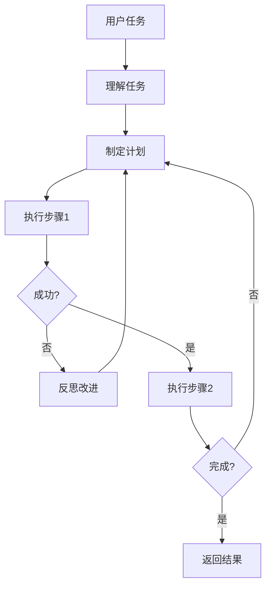

# 13 Agent 生产部署 — 小白版 🤖

> **一句话秒懂**: Agent 就是能"自主行动"的 AI——不只是回答问题，还能规划任务、使用工具、记忆信息、和其他 Agent 协作，就像一个能干的员工，能帮你完成复杂的工作！

## 为什么要学 Agent？

想象一下：
- 💼 以前：你让 AI 做一件事，它只能做一步
- 💼 现在：AI 能自主规划多步，还能调用各种工具
- 🚀 以前：AI 只能回答问题
- 🚀 现在：AI 能帮你完成任务

**Agent = 有脑子 + 有手脚 + 有记忆的 AI**

## Agent vs 普通 AI

```
【普通 AI = 只会说话的书】
你问："帮我写一篇作文"
AI 答："好的，这是作文..." ✓
AI 做不了别的

【Agent = 能干的助理】
你让："帮我发布一篇文章到公众号"
Agent:
1. 写文章 ✓
2. 配图 ✓
3. 登录公众号后台 ✓
4. 发布 ✓
5. 告诉你发布成功 ✓
```

## Agent 的核心能力

```
┌─────────────────────────────────────────────────────────┐
│                  Agent 五大核心能力                        │
├─────────────────────────────────────────────────────────┤
│                                                         │
│  🧠 规划 ─── 分解任务，制定步骤                          │
│     "写文章" → 1.写内容 2.配图 3.发布                  │
│                                                         │
│  🔧 工具 ─── 调用外部工具/API                           │
│     搜索、计算、发送邮件、操作数据库                     │
│                                                         │
│  📝 记忆 ─── 记住之前的对话和信息                       │
│     用户偏好、历史经验                                   │
│                                                         │
│  🔄 反思 ─── 检查自己的行为，改进                        │
│     做错了就调整                                       │
│                                                         │
│  👥 协作 ─── 和其他 Agent 配合                          │
│     多个 Agent 分工合作                                 │
│                                                         │
└─────────────────────────────────────────────────────────┘
```

## Agent 工作流程



## ReAct 框架

```
【ReAct = Reasoning + Acting】

思考 → 行动 → 观察 → 思考 → ...

例子: "帮我查北京明天天气"

1. Thought: 我需要先查天气
2. Action: 调用天气 API
3. Observation: 明天晴天，20-28度
4. Thought: 天气不错，我可以推荐户外活动
5. Action: 搜索北京户外活动
6. Observation: 故宫、颐和园推荐
7. Response: "明天晴天20-28度，推荐去故宫或颐和园"
```

## 工具调用

```
【Agent 能用的工具】

🔍 搜索 ─── Google、百度
🧮 计算 ─── Python 代码执行
📧 邮件 ─── 发送/读取邮件
📊 数据 ─── 查询数据库
💻 代码 ─── 运行代码
🌐 网页 ─── 获取网页内容

Agent 决定:
- 什么任务需要什么工具
- 怎么调用工具
- 如何处理结果
```

## 记忆系统

```
【三层记忆架构】

工作记忆 ─── 当前任务
            "我现在在写代码"

短期记忆 ─── 对话历史
            "用户刚才说要翻译"

长期记忆 ─── 持久存储
            "用户叫小明，喜欢简洁回答"

检索:
用户问 → 查短期记忆 → 查长期记忆 → 综合回答
```

## Multi-Agent 协作

```
【单个 Agent】
一个人干所有活
→ 什么都做，但什么都不精

【多个 Agent 协作】
专业分工，团队合作

例如: 开发网站

Manager Agent ─── 分配任务
    │
    ├── Coder Agent ─── 写代码
    ├── Tester Agent ─── 写测试
    └── Reviewer Agent ─── 检查代码

→ 效率更高，质量更好
```

## 主流框架

| 框架 | 特点 | 适用场景 |
|------|------|---------|
| LangGraph | 可视化工作流 | 复杂多步骤任务 |
| AutoGen | 多 Agent 协作 | 对话和协作场景 |
| CrewAI | 角色扮演 Agent | 团队协作场景 |
| LlamaIndex | 数据连接 | RAG + Agent |

## 下一步

- 想深入技术？→ 查看子目录具体文档
- 想学 Agent 评估？→ [Agent_Evaluation/README_for_dummy.md](./Agent_Evaluation/README_for_dummy.md)
- 想学 RAG？→ [RAG系统/README_for_dummy.md](../RAG系统/README_for_dummy.md)

---

*本文是 [README.md](./README.md) 的简化版，适合零基础读者。*

## Related

- [[Agent/Agent_Evaluation/Agent_Harness_Complete_2026.md|Agent_Harness_Complete_2026]]
- [[Agent/Agent_Evaluation/Agent_Red_Teaming_2026.md|Agent_Red_Teaming_2026]]
- [[Agent/Agent_Evaluation/Assessment/Evaluation_Workflow.md|Evaluation_Workflow]]
- [[Agent/Agent_Evaluation/Assessment/Production_Assessment.md|Production_Assessment]]
- [[Agent/Agent_Evaluation/Benchmarking/Benchmarking_Criteria.md|Benchmarking_Criteria]]
