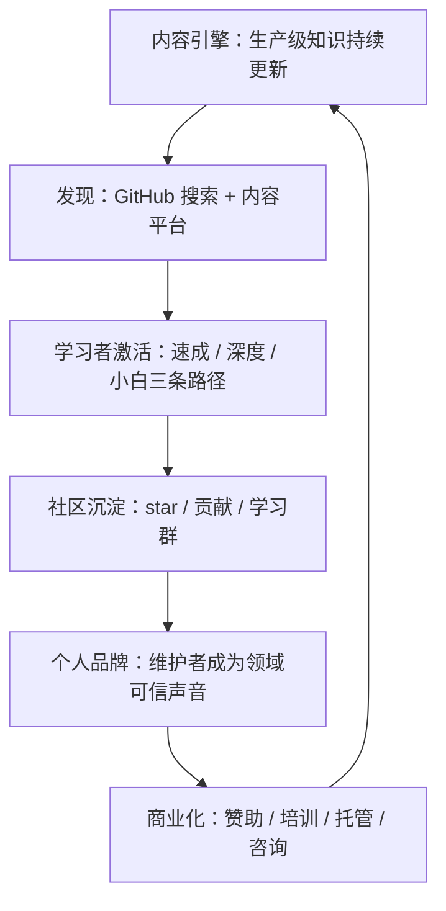

# AI Guru GTM 战略 2026 (GTM Strategy)

> 中文简称：GTM 战略 2026

> **一句话理解**: 先想清楚"谁、为什么、通过什么渠道来"——本文回答 AI Guru 的市场、用户、定位、渠道、度量五个核心问题。

---

## 1. 战略总览

### 1.1 三层目标

AI Guru 的 GTM 服务于三层递进目标，每一层都是下一层的前提：

| **层级** | **目标** | **北极星指标** | **达成前提** |
|---------|---------|--------------|-------------|
| 表层 | 开源社区增长 | 月深度学习会话数 | 内容质量与可发现性 |
| 中层 | 维护者个人品牌 | 具名提及 / 邀请分享次数 | 社区规模与稳定输出 |
| 里层 | 商业化变现 | 月变现收入 | 个人品牌信任与付费场景验证 |

三层目标的因果链：内容吸引学习者，学习者沉淀为社区，社区规模与口碑背书维护者的专业品牌，品牌带来培训、咨询、托管等商业机会，收入再反哺内容投入。**任何试图跳过前一层直接摘取后一层成果的动作（例如在社区未成形时强推付费课）都会破坏信任链条。**

### 1.2 战略原则

1. **内容即产品**：知识库本身就是产品，GTM 的第一要务是让对的人发现并使用它，而不是重新造一个营销物。
2. **开源即信任**：MIT 许可与"核心内容永久免费"是信任基座，所有变现设计不得侵蚀它。
3. **社区即杠杆**：单人维护者的产出有限，贡献者与传播者是唯一的规模化杠杆。
4. **数据即迭代**：每个渠道动作都必须可度量，90 天内拿不到数据的动作要么补埋点要么停掉。

---

## 2. 市场分析

### 2.1 市场背景

三股力量在 2024-2026 年持续放大 AI 学习需求：

1. **岗位重构**：后端、算法、数据、运维岗位普遍要求补齐 LLM 与 Agent 技能，在职工程师存在系统性补课需求。
2. **供给错配**：新知识（推理优化、Agent 工程、RAG 生产化）产出速度远超课程与书籍的更新速度，学习者被迫在碎片化博客、视频与官方文档之间自行拼图。
3. **中文缺口**：高质量生产级内容以英文为主，中文学习者要么读英文原文（门槛高），要么依赖二手翻译（滞后且碎片）。

AI Guru 的结构性机会在于：**用中文、体系化、生产导向的知识库，一次性解决"碎片、过时、语言门槛"三个痛点。**

### 2.2 竞争格局

| **竞品** | **语言** | **形态** | **体系化** | **生产导向** | **与 AI Guru 的差异** |
|---------|---------|---------|-----------|-------------|---------------------|
| fast.ai | 英文 | 课程 + 教材 | 高（单一课程线） | 中 | 课程形态，非知识库；无中文 |
| DeepLearning.AI | 英文 | 课程矩阵 | 高 | 中 | 视频课为主，更新依赖课程周期 |
| Hugging Face 官方课程 | 英文 | 开源课程 | 中（按主题） | 中 | 绑定 HF 生态工具链 |
| Datawhale 开源学习项目 | 中文 | 组队学习 + 开源教程 | 中 | 中 | 活动驱动，知识沉淀分散在各项目 |
| GitHub 路线图类仓库（llm-course 等） | 英文 | 单页链接清单 | 低（索引非内容） | 低 | 只做导航，不生产内容 |
| 从零实现类书籍仓库（LLMs-from-scratch 等） | 英文 | 书 + 代码 | 高（单主题纵深） | 低 | 聚焦原理实现，不覆盖运维与部署全栈 |
| 中文笔记类仓库（so-large-lm 等） | 中文 | 笔记集合 | 中 | 低-中 | 以论文笔记为主，生产工程覆盖薄 |

> 表格为定性对比，用于定位决策；具体竞品数据随时间变化，引用时以原始仓库为准。

### 2.3 差异化窗口

竞品矩阵中没有一个同时占据"**中文原生 + 全栈体系 + 生产级深度 + 持续维护**"四个位置，这正是 AI Guru 的差异化窗口：

1. **中文原生**：不是翻译，而是用中文语境组织的完整知识体系（24 大章节 + 12 子域概念网络）。
2. **全栈覆盖**：从 [数学基础](../01_数学基础/README.md) 到 [Agent 生产](../15_智能体/README.md)，竞品多只覆盖单段。
3. **生产级深度**：LLMOps 完整主线 + 故障树（FTA）排障手册 + 运维 Runbook，直接服务线上问题。
4. **三层阅读路径**：70+ 篇速成指南（in-nutshell）+ 深度文档 + 48 篇小白指南（for_dummy），同一主题三种深度。
5. **时效承诺**：2026 主线持续更新，用 `updated` 字段与年度文档（`*_2026.md`）对抗内容过时。

---

## 3. 目标用户

### 3.1 ICP（理想客户画像）声明

> 我们的首要服务对象是：**有 1 年以上工程或学习经验、需要在 6 个月内系统性补齐 AI 全栈（尤其是 LLM 生产化）能力、偏好中文与自定进度学习的工程师和学生。**

### 3.2 用户画像与优先级

| **优先级** | **画像** | **规模直觉** | **核心痛点** | **进入内容** | **转化路径** |
|-----------|---------|------------|-------------|-------------|-------------|
| P0 | 转型 / 在职工程师 | 最大 | 知识碎片、理论到生产断层 | 速成指南、[10_部署推理](../10_部署推理/README.md) | star → watch → 贡献 / 企业内推荐 |
| P1 | 学生与求职者 | 大 | 学校与业界脱节、面试准备 | [21_面试岗位](../21_面试岗位/README.md)、[90_学习](../90_学习/README.md) | star → 社群转发（高传播意愿） |
| P2 | 企业团队 / 培训负责人 | 中 | 内部培训教材缺体系 | 12_架构基建、11_模型运维、LLMOps 主线 | fork / 内部镜像 → 培训与咨询商机 |
| P3 | 爱好者与跨界学习者 | 长尾 | 入门门槛高、术语劝退 | for_dummy 系列 | 泛传播，扩大漏斗上沿 |

### 3.3 画像卡片

**P0 转型 / 在职工程师**

- 典型描述：3-8 年经验的后端 / 算法 / 数据工程师，公司开始落地 LLM 应用，需要在业余时间补课。
- 待完成的任务（JTBD）：在不脱产的情况下，6 个月内具备独立设计、部署、运维 LLM 应用的能力。
- 决策特征：讨厌营销话术，看内容密度与更新频率；一旦认可会成为最有力的推荐者（推荐给同事与团队）。
- 关键承接页：`*_in-nutshell.md` 速成系列、部署推理与模型运维章节。

**P1 学生与求职者**

- 典型描述：计算机相关专业在校生或应届生，目标是算法 / AI 工程岗 offer。
- JTBD：用最短路径建立可面试的知识体系，并能说清楚实践细节。
- 决策特征：价格敏感（免费是硬需求）、社群活跃、转发意愿最高，是冷启动期最好的传播节点。
- 关键承接页：140 篇面试指南、90_学习 学习路径。

**P2 企业团队 / 培训负责人**

- 典型描述：技术负责人或培训负责人，需要为 10-100 人团队建立统一的 AI 知识基线。
- JTBD：找到可以直接用作内部培训底座的体系化材料，最好有中文与落地案例。
- 决策特征：决策周期长，看重许可合规（MIT 是加分项）与内容稳定性；是商业化层的主要线索来源。
- 关键承接页：LLMOps 主线、FTA 排障手册、架构基建章节。

**P3 爱好者与跨界学习者**

- 典型描述：非技术背景或初学者，被 AI 热潮吸引，容易被术语劝退。
- JTBD：用能听懂的话建立基础认知，判断自己是否要深入。
- 决策特征：留存率低但进入量大，用于扩大漏斗上沿与口碑扩散。
- 关键承接页：48 篇 for_dummy 指南、00_入门 章节。

---

## 4. 定位与信息屋

### 4.1 定位声明

| **要素** | **内容** |
|---------|---------|
| 面向 | 需要系统掌握 AI 全栈能力的工程师与学生 |
| 他们的困境 | 知识碎片化、内容过时快、理论与生产脱节、优质内容多为英文 |
| AI Guru 是 | 一个中文开源的 AI 全栈知识库 + Web 浏览应用 |
| 能够 | 在一个知识体系内从数学基础走到 Agent 生产部署，按速成 / 深度 / 小白三种路径自学 |
| 不同于 | 单一课程、单页路线图、碎片化博客与论文笔记集合 |
| 差异点 | 1,894 万字生产级内容 + 三层阅读路径 + 2026 主线持续维护 + MIT 完全开源 |

### 4.2 价值支柱

| **支柱** | **一句话主张** | **证据** |
|---------|--------------|---------|
| 全面覆盖 | 一个仓库装下整条 AI 学习路线 | 24 大章节 + 12 子域概念网络 + 2,061 篇核心文档 |
| 生产级 | 不止讲原理，还教你上线后怎么活下来 | LLMOps 完整主线、FTA 故障树、运维 Runbook |
| 三层阅读路径 | 同一主题，30 分钟速成或 3 天深啃任选 | 70+ in-nutshell + 48 for_dummy + 深度文档 |
| 持续新鲜 | 知识跟得上模型迭代速度 | 2026 年度主线文档、每页 `updated` 字段可审计 |

### 4.3 信息屋（Messaging House）

**一句话 Pitch（10 秒）**

> GitHub 上最全面的中文 AI 全栈知识库——从数学基础到 Agent 生产部署，1,894 万字，永久免费开源。

**30 秒 Pitch**

> AI 知识更新太快，学习者普遍面临内容碎片、过时、英文门槛高三座大山。AI Guru 把从数学基础到 Agent 生产部署的完整知识体系写成了 1,894 万字的中文开源知识库：想速成有 70+ 篇 30 分钟指南，想深啃有 24 个章节的完整体系，求职还有 140 篇面试指南。MIT 许可，永久免费，2026 主线持续更新。现在 GitHub 搜 AI Guru 或打开仓库链接就能开始。

**常见异议应答**

| **异议** | **应答要点** |
|---------|-------------|
| "和直接看课程 / 官方文档有什么区别？" | 课程是线性单向的，AI Guru 是可检索、可跳读、三层深度的知识网络，且覆盖课程普遍缺失的运维与生产排障 |
| "内容会不会过时？" | 每页带 `updated` 字段，年度主线文档（`*_2026`）持续更新，治理流程把新鲜度当质量门禁 |
| "可以用于企业内部或商业场景吗？" | MIT 许可允许，欢迎内部培训使用；企业定制需求走服务通道 |

---

## 5. 渠道与分发策略

### 5.1 渠道矩阵

| **渠道** | **漏斗角色** | **目标人群** | **内容形式** | **优先级** | **核心指标** |
|---------|-------------|-------------|-------------|-----------|-------------|
| GitHub 搜索 / README SEO | 曝光 → 获取 | 全部 | 仓库元数据 + badges | P0 | 搜索曝光 → star 转化 |
| 知乎 / 掘金 | 曝光 → 激活 | P0 / P1 | 系列长文摘录 | P0 | 引流点击、关注 |
| Hacker News / V2EX / Reddit | 曝光 | P0 / P3 | Launch 帖 | P1 | 上首页、引流量 |
| 微信公众号 / 技术社群 | 留存 | 全部 | 周更速递 | P1 | 订阅、打开率 |
| X / LinkedIn | 曝光 | 海外 P0 | 英文短卡片 | P2 | 曝光、互动 |
| B 站 / YouTube | 曝光 | P1 / P3 | 图解 / 视频讲解 | P2 | 播放、引流 |
| 高校社团 / 开源社区合作 | 获取 → 推荐 | P1 | 共办学习营 | P1 | 合作场次、新增学员 |
| awesome-* 清单 | 曝光 | P0 | 收录申请（PR） | P1 | 收录数量（长尾流量） |

### 5.2 GitHub 原生增长（P0）

GitHub 既是产品载体也是第一获客场：

1. **仓库元数据优化**：About 描述、Topics（llm、mlops、agents、chinese、learning 等）、Social Preview 图、主页置顶。
2. **README 即落地页**：首屏完成"是什么、多大、为谁、怎么开始"四问，徽章量化信任（文档数 / 字数 / 更新月份）。
3. **可发现性工程**：维护 awesome 清单收录、GitHub Trending 窗口利用（发布日集中引流的自然结果）。
4. **贡献漏斗**：`good first issue` 标签 + 贡献指南降低首次贡献门槛，把用户转成共建者。

### 5.3 内容平台策略（P0）

原则：**摘录引流，不搬运全文**——平台发布知识库里最有传播力的 10% 内容，文末回到仓库获取完整体系。

- 知乎：系列回答 + 专栏，主打"学习路线 / 面试 / 生产排障"搜索型问题。
- 掘金：实战向文章（部署、调优、评测），贴合其工程师社区调性。
- 公众号：每周速递（本周更新 + 精选 3 篇），承担留存与复访。
- 一鱼多吃：每篇平台文章由知识库文档改写，发布后在文内回链，形成资产复用闭环。

### 5.4 社区运营（P1）

- **学习群**：按画像分群（求职群 / 工程师群），入群路径统一走仓库，避免脱离主漏斗。
- **贡献者计划**：文档纠错、翻译、章节认领三类低门槛任务，让"第一次贡献"发生在一小时内。
- **用户证言**：征集学习成果故事（拿到 offer、上线项目），作为社交证明素材。

### 5.5 合作与借力（P1）

- 与高校 AI 社团、开源学习社区共办学习营（他们要内容，我们要分发）。
- 与互补型开源项目（工具类、数据集类）互挂推荐。
- 争取技术播客 / 周刊专访，输出维护者故事与工程方法论。

---

## 6. 三级飞轮与变现路径

### 6.1 飞轮模型

飞轮从"内容 → 发现 → 激活 → 社区"完成第一圈后，才进入"品牌 → 变现"的第二圈；变现收入必须以可感知的方式回流内容（例如资助全职维护时间），否则飞轮会失去正当性。

### 6.2 变现选项与触发条件

| **选项** | **说明** | **触发条件（建议）** | **主要风险** |
|---------|---------|-------------------|-------------|
| GitHub Sponsors / 赞助 | 社区与个人捐赠 | 稳定周活跃流量形成后开启 | 低；收入有限 |
| 企业培训 | 基于知识体系的定制内训 | 出现 3 个以上 P2 主动询价 | 时间不可规模化 |
| 托管 / 私有化部署 | Web 应用 + 内容交付企业内网 | 前端应用产品化完成 | 维护成本高 |
| 认证课程 | 从知识库提炼的系统化付费课 | 社区规模达到可持续开班阈值 | 处理不当会伤害开源信任 |
| 技术咨询 | LLM 落地咨询 | 个人品牌形成后自然承接 | 不可规模化 |

### 6.3 变现红线

1. **核心内容永久免费**：知识库本体不因任何变现动作设门槛。
2. **变现卖服务与便利，不卖内容锁**：付费项是培训、托管、咨询等增值，不是"解锁文章"。
3. **透明沟通**：任何商业化动作先在社区说明动机与收益用途。

---

## 7. 度量体系

### 7.1 北极星指标

**月深度学习会话数** = 当月产生深度阅读行为（Web 应用内阅读 ≥ 3 篇，或仓库内连续阅读 / clone 后阅读）的独立学习者数。

选择理由：Stars 是滞后且易刷的虚荣指标；深度学习会话直接对应"知识被使用"这一产品的真实价值，也领先于贡献与变现。

### 7.2 漏斗指标（AARRR）

| **漏斗层** | **指标** | **测量方式** |
|-----------|---------|-------------|
| 曝光 Awareness | 内容平台曝光、搜索展现 | 各平台后台、GitHub Traffic |
| 获取 Acquisition | 仓库访问量、Web 应用 UV | GitHub Traffic Insights、站点统计 |
| 激活 Activation | 首篇读完率、clone 数、watch 数 | 站点事件、GitHub 数据 |
| 留存 Retention | 周回访率、邮件 / 公众号订阅活跃 | 站点统计、订阅后台 |
| 推荐 Referral | star 增速、转发提及、新贡献者 | GitHub、舆情关键词监测 |
| 变现 Revenue | 赞助 / 培训 / 服务收入 | 财务记录 |

### 7.3 阶段目标（建议值）

基线在 Playbook Phase 0 完成采集后校准；以下为结构性目标框架：

| **周期** | **里程碑性质目标** | **量化目标（建议，待基线校准）** |
|---------|------------------|--------------------------------|
| 30 天 | 基线建立、仓库与落地页优化完成、首批 3 个渠道上线 | 相对基线：访问量 +30%、新增 star +15% |
| 90 天 | 正式发布完成、贡献者漏斗开启、首批用户证言 | 相对基线：访问量 +100%、新增贡献者 ≥ 5 人 |
| 180 天 | 周更节奏稳定、至少 1 条变现路径验证（收到第一笔） | 相对基线：北极星 +200%、月活贡献者 ≥ 10 人 |

---

## 8. 风险与对策

| **风险** | **概率** | **影响** | **对策** |
|---------|---------|---------|---------|
| 内容过时，"新鲜"承诺失效 | 高 | 高 | 季度新鲜度审计；年度主线文档；`updated` 字段纳入质量门禁 |
| 单一维护者依赖，节奏中断 | 高 | 高 | 贡献者计划 + 文档化 SOP，让维护动作可被认领 |
| 同质化竞品跟进 | 中 | 中 | 持续加深生产级深度与中文原生体验两条护城河 |
| 许可被误用或侵权 | 低 | 中 | README 显著标注 MIT；保留署名要求说明 |
| 变现动作伤害开源信任 | 中 | 高 | 遵守变现红线；商业化前先与社区沟通 |
| 渠道平台规则变化（限流 / 封禁） | 中 | 中 | 不把任何单一平台当唯一入口，回流路径始终指向仓库 |

---

## 9. 相关文档

- [GTM 总览](./README.md) — 一页速览与文档导航
- [发布与增长手册 2026](./Launch_Playbook_2026.md) — 90 天行动计划与执行工具
- [AI Guru 知识库 README](../README.md) — 产品事实与对外叙事来源
- [治理/ROADMAP](../治理/ROADMAP.md) — 项目演进方向，GTM 节奏需与其对齐
- [前端应用](../前端应用/README.md) — Web 浏览应用，GTM 的第二交付物

---

*Last updated: 2026-08-31*
