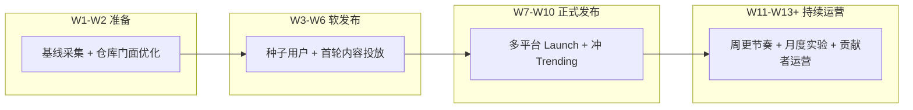

# AI Guru 发布与增长手册 2026 (Launch Playbook)

> 中文简称：发布与增长手册

> **一句话理解**: 战略回答"为什么"，本手册回答"这周做什么"——90 天四阶段行动计划，配发布清单、实验卡片和渠道 SOP。

---

## 1. 执行原则

1. **每周一个焦点**：每周只主推一个渠道动作，避免精力摊薄。
2. **小批量实验**：每个增长动作都是实验，预设成功与放弃标准，90 天内拿不到数据就停。
3. **资产复用**：所有内容从知识库文档改写而来，发布后回链仓库，一鱼多吃。
4. **数据先行**：Phase 0 先建基线，之后所有目标都是相对基线的增量。

完整策略依据见 [GTM 战略 2026](./GTM_Strategy_2026.md)。

---

## 2. 四阶段路线图



四个阶段环环相扣：Phase 0 的基线决定后续目标是否可信，Phase 1 的反馈决定正式发布的内容是否打磨到位，Phase 2 的声量决定 Phase 3 的起点高度。

### 2.1 Phase 0：准备（第 1-2 周）

| **任务** | **产出** | **验收标准** |
|---------|---------|-------------|
| 采集全渠道基线 | 基线表（见 §7.3） | 六项核心指标全部有数 |
| 仓库门面优化 | About / Topics / Social Preview 图 / 主页置顶 | 陌生人 30 秒内看懂"是什么、多大、为谁" |
| README 首屏审查 | 首屏四问完整（是什么 / 多大 / 为谁 / 怎么开始） | 找 2 位目标用户实测理解度 |
| 赞助通道开通 | Sponsors 配置完成 | 入口可见且可用 |
| Web 应用部署核查 | 部署地址可公开访问 | 核心浏览路径无白屏无死链 |
| Launch 资产包 | 一句话简介、配图、演示动图、30 秒 pitch | 素材可直接粘贴到任意平台 |

### 2.2 Phase 1：软发布（第 3-6 周）

| **任务** | **产出** | **验收标准** |
|---------|---------|-------------|
| 种子用户邀请 | 20-50 位熟人 / 社区成员试用 | 回收 ≥ 10 份结构化反馈 |
| 反馈修复 | 首轮 issue 清零 | 阻塞性问题全部关闭 |
| 首轮内容投放 | 知乎 / 掘金各 2-3 篇摘录文 | 每篇有回链，记录引流数据 |
| 贡献者入口 | `good first issue` 标签 ≥ 10 个 + 贡献指引 | 新贡献者 1 小时内可完成首贡 |
| 学习群冷启动 | 首批学习群建立 | 入群路径统一走仓库 |

### 2.3 Phase 2：正式发布（第 7-10 周）

| **任务** | **产出** | **验收标准** |
|---------|---------|-------------|
| Launch 日多平台齐发 | HN / V2EX / 知乎 / 掘金 / X / 公众号同日发布 | 全部按 §3 清单执行 |
| 冲刺响应 | Launch 日 12 小时在线响应 | 评论与 issue 响应 < 2 小时 |
| Trending 观察 | 每日记录排名与流量来源 | 形成流量来源归因记录 |
| 跟进内容 | Launch 后 7 天内 2 篇跟进文（幕后故事 / 数据复盘） | 维持话题热度 |

### 2.4 Phase 3：持续运营（第 11-13 周起）

| **任务** | **产出** | **验收标准** |
|---------|---------|-------------|
| 周更节奏 | 每周速递（本周更新 + 精选 3 篇） | 连续 4 周不断更 |
| 月度增长实验 | 每月启动 1 张实验卡片（见 §4） | 实验有结论记录 |
| 月度复盘 | 每月一次 GTM 复盘（见 §7.2） | 结论回写战略文档 |
| 贡献者运营 | 每月致谢 + 任务认领更新 | 月活贡献者稳步上升 |

---

## 3. 发布日清单（Launch Checklist）

**T-7（发布前一周）**

- [ ] Launch 资产包冻结（简介 / 配图 / 动图 / pitch 不再改动）
- [ ] 各平台文案按平台调性改写完成
- [ ] Web 应用与仓库链接全部实测可达
- [ ] 基线数据快照存档（用于前后对比）

**T-1（发布前一天）**

- [ ] 仓库处于干净状态（README 无笔误、徽章数据为最新）
- [ ] 学习群与支持渠道就绪，接待话术准备好
- [ ] 响应分工确认（谁盯评论、谁关 issue）

**T0（发布日）**

- [ ] 按平台时区顺序发布：HN（美西早间）→ V2EX / 知乎 / 掘金（北京上午）→ X → 公众号
- [ ] 每个帖子附统一回链（仓库主页或 Web 应用）
- [ ] 12 小时在线响应启动
- [ ] 每小时记录一次流量与 star 增量

**T+1（次日）**

- [ ] 回应所有未答评论与 issue
- [ ] 发布首条跟进内容（数据速报或幕后故事）
- [ ] 记录各平台引流效果入实验台账

**T+7（一周后）**

- [ ] 输出 Launch 复盘：流量来源、转化、上首页情况
- [ ] 决定乘胜追击（加投有效渠道）还是转入常态运营
- [ ] 复盘结论写入 §4 实验台账

---

## 4. 增长实验卡片

每张卡片包含：假设、动作、成本、成功标准、放弃标准。执行结果记入台账，作为后续资源分配依据。

| **编号** | **假设** | **动作** | **成本** | **成功标准** | **放弃标准** |
|---------|---------|---------|---------|-------------|-------------|
| E01 | 首屏价值主张影响 star 转化 | README 首屏 A/B（徽章优先 vs 问题陈述优先） | 半天 | 转化率相对提升 ≥ 20% | 4 周无显著差异 |
| E02 | 新人缺一条明确学习路线 | 推出"90 天学习计划"策划页并全站入口露出 | 1-2 天 | 该页周访问进全站前 5 | 8 周无留存改善 |
| E03 | 知乎搜索型问题有长尾流量 | 每周 1 篇系列摘录（学习路线 / 面试 / 排障） | 每周半天 | 单篇引流 ≥ 100 仓库访问 | 连续 4 篇引流 < 30 |
| E04 | 掘金工程师偏好实战文 | 部署 / 调优实战系列每周 1 篇 | 每周半天 | 单篇引流 ≥ 100 仓库访问 | 连续 4 篇引流 < 30 |
| E05 | Show HN 能带来海外流量脉冲 | 精心准备 Show HN 帖（配动图） | 1 天 | 上首页或 ≥ 500 引流 | 未上首页且引流 < 100 |
| E06 | V2EX 对中文开发者转化高 | Launch 日 + 每月 1 次进展帖 | 每次 2 小时 | 单帖引流 ≥ 200 | 连续 2 帖引流 < 50 |
| E07 | awesome 清单提供长尾发现 | 向 10 个相关 awesome 清单提 PR | 1 天 | 收录 ≥ 5 个 | 收录率 < 20% |
| E08 | 学习群提升留存与口碑 | 按画像建群（求职 / 工程师），周更推送 | 每周 2 小时 | 群成员月留存 ≥ 60% | 两群 8 周后活跃 < 20% |
| E09 | 低门槛任务能换来首批贡献者 | 10 个 `good first issue` + 首贡指引 | 1 天 | 90 天新增贡献者 ≥ 5 | 90 天新增 < 2 |
| E10 | 面试资料可独立传播触达 P1 | 140 篇面试指南打包为专题分发 | 1 天 | 专题引流 ≥ 300 访问 | 引流 < 80 |

---

## 5. 渠道 SOP 速查

| **渠道** | **最佳发布时机** | **内容形式** | **标题公式** | **CTA** |
|---------|----------------|-------------|-------------|---------|
| Hacker News | 美西周二至周四早间 | Show HN 帖 + 动图 | `Show HN: 量化事实 + 对象 + 差异点` | 评论互动 + 仓库链接 |
| V2EX | 工作日上午 | 分享帖（真诚口吻） | 数字 + 痛点 + 免费承诺 | 仓库链接 + 求建议 |
| 知乎 | 工作日晚 8-10 点 | 回答 + 专栏长文 | 问题镜像式标题（直击搜索词） | 文末完整体系回链 |
| 掘金 | 工作日上午 | 实战教程 | `场景 + 动作 + 结果数字` | 系列下一篇预告 + 回链 |
| 公众号 | 周四晚 | 每周速递 | `本周 N 篇更新 + 精选亮点` | 星标 + 入群 |
| X / LinkedIn | 与 HN 同日错峰 | 短卡片串（英文） | 一句钩子 + 数据 + 图 | 仓库链接 |

---

## 6. 内容日历模板（周节奏）

| **时间** | **动作** | **资产来源** |
|---------|---------|-------------|
| 周一 | 选定本周摘录源文档，确认授权与事实 | 知识库章节文档 |
| 周二至周三 | 改写为平台版本（保留回链） | 摘录草稿 |
| 周四 | 平台发布 + 公众号速递 | 平台版本 |
| 周五 | 数据回收入台账，回复所有互动 | 实验台账 |
| 周末 | 下周实验 / 选题排期 | 本手册 §4 |

---

## 7. 复盘机制

### 7.1 周报模板

```
本周焦点：<唯一主推动作>
五项数据：访问 / star 增量 / 激活 / 留存 / 引流来源
一个洞察：<数据背后的一句话解释>
下周一件事：<下周唯一焦点>
```

### 7.2 月度 GTM 复盘议程

1. 北极星与漏斗数据回顾（对比基线与上月）。
2. 实验台账盘点：继续 / 放大 / 停止。
3. 渠道资源再分配（向转化率最高的渠道倾斜）。
4. 风险清单过一遍（对应战略文档 §8）。
5. 结论回写 [GTM 战略 2026](./GTM_Strategy_2026.md) 并更新其 `updated` 字段。

### 7.3 基线采集表（Phase 0 填写）

| **指标** | **数值** | **采集日期** | **来源** |
|---------|---------|-------------|---------|
| 仓库周访问量（UV） | 待采集 | | GitHub Traffic |
| 周新增 star | 待采集 | | GitHub |
| Web 应用周访问 | 待采集 | | 站点统计 |
| 内容平台粉丝 / 订阅合计 | 待采集 | | 各平台后台 |
| 贡献者总数 | 待采集 | | GitHub |
| 外部提及（周） | 待采集 | | 关键词监测 |

---

## 8. 相关文档

- [GTM 总览](./README.md) — 一页速览与三级飞轮
- [GTM 战略 2026](./GTM_Strategy_2026.md) — 本手册的策略依据
- [AI Guru 知识库 README](../README.md) — 产品事实与对外叙事来源
- [前端应用](../前端应用/README.md) — Web 浏览应用（Launch 前需完成部署核查）
- [治理/ROADMAP](../治理/ROADMAP.md) — 项目方向对齐

---

*Last updated: 2026-08-31*
