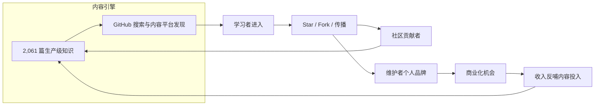

# AI Guru Go-To-Market (GTM)

> 中文简称：GTM 总览

> **一句话理解**: GTM（Go-To-Market）就是把好产品变成被知道、被使用、被传播的路线图——AI Guru 用开源知识做燃料，依次点燃社区增长、个人品牌、商业变现三级火箭。

---

## GTM 一页速览

| **维度** | **结论** |
|---------|---------|
| 产品 | AI Guru 开源知识库（2,061 篇核心文档 + 700+ 概念卡片、1,894 万字）+ Web 浏览应用 |
| 目标 | 三层递进：开源社区增长（表层）→ 维护者个人品牌（中层）→ 商业化变现（里层） |
| 定位 | GitHub 上最全面的中文 AI 全栈知识库：从数学基础到 Agent 生产部署 |
| 北极星指标 | 月深度学习会话数（独立学习者 × 阅读深度） |
| 主渠道 | GitHub 原生发现 + 中文技术内容平台 + 开源社区合作 |
| 商业模式 | 核心内容永久免费（MIT），变现走服务与便利（赞助 / 培训 / 托管） |
| 战略文档 | [GTM 战略 2026](./GTM_Strategy_2026.md) |
| 执行手册 | [发布与增长手册 2026](./Launch_Playbook_2026.md) |

---

## 三级飞轮

飞轮的关键逻辑：内容质量决定第一圈能不能转起来，社区传播决定转多快，个人品牌与商业化是飞轮加速后的自然产物，而不是起点。任何跳过内容质量直接追求变现的动作都会让飞轮停转。

---

## 文档导航

| **文档** | **定位** | **适合读者** | **建议阅读时长** |
|---------|---------|------------|----------------|
| [GTM 战略 2026](./GTM_Strategy_2026.md) | 战略层：市场分析、用户画像、定位信息屋、渠道策略、度量体系 | 需要理解"为什么这样做"的人 | 30-40 分钟 |
| [发布与增长手册 2026](./Launch_Playbook_2026.md) | 执行层：90 天行动计划、发布日清单、增长实验卡片、渠道 SOP | 需要知道"这周做什么"的执行者 | 20-30 分钟 |

---

## 与仓库的关系

GTM 不是独立于知识库的运营文档，它直接引用并服务于仓库的核心资产：

- 产品事实与对外叙事来源：[AI Guru 知识库 README](../README.md)（含英文版 [README_EN](../README_EN.md)）
- 项目演进方向对齐：[治理/ROADMAP](../治理/ROADMAP.md)
- GTM 的第二个交付物（Web 浏览应用）：[前端应用](../前端应用/README.md)

---

## 使用方式

1. 先读本页建立全局认知（5 分钟）。
2. 做决策或对外解释策略时，引用 [GTM 战略 2026](./GTM_Strategy_2026.md)。
3. 每周执行前，打开 [发布与增长手册 2026](./Launch_Playbook_2026.md) 对照当前阶段的任务清单。
4. 每月 GTM 复盘后，将结论回写战略文档并更新 `updated` 字段。

---

*Last updated: 2026-08-31*
