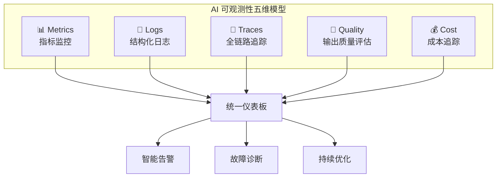
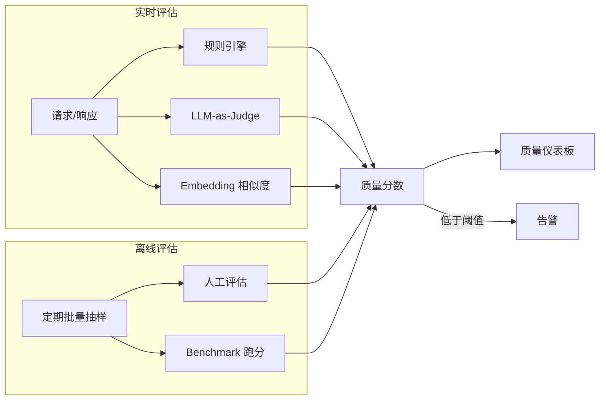
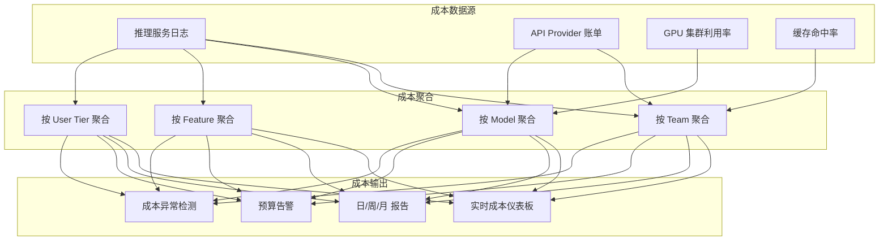

# AI 系统可观测性实践指南

> 🎯 **目标**：建立 AI/LLM 生产系统的完整可观测性体系 —— 从传统三支柱到 LLM 专属指标、全链路追踪、Token 粒度成本核算，实现"看见一切，理解一切"。

---

## 一、为什么 AI 系统需要专属可观测性

### 传统应用 vs AI 应用的可观测性差异

```
传统 Web 应用                     AI/LLM 应用
═══════════════                   ═══════════════
请求 → 响应 (确定)                Prompt → Completion (非确定)
HTTP 状态码 = 全部真相             状态码 200 ≠ 输出正确
延迟 = 处理时间                    TTFT + TPS + 总延迟 = 三个独立指标
错误率 = 5xx 占比                  错误率 + 幻觉率 + 拒答率 = 质量谱系
资源 = CPU/Memory                 资源 = GPU 显存/算力 + Token 配额
成本 = 基础设施                    成本 = 基础设施 + Token + API 调用
```

### AI 可观测性的五大维度



---

## 二、传统三支柱（AI 增强）

### 2.1 Metrics（指标）

#### 基础设施指标

| 指标 | 采集方式 | 告警阈值建议 |
|------|---------|------------|
| GPU Utilization | DCGM / nvidia-smi | > 95% 持续 5min |
| GPU Memory Used | DCGM | > 90% |
| GPU Temperature | DCGM | > 85°C |
| GPU Power Draw | DCGM | > 95% TDP |
| Host CPU / Memory | Node Exporter | 常规阈值 |
| Disk I/O | Node Exporter | 关注推理模型加载 I/O |
| Network Throughput | Node Exporter | 关注 KV Cache 同步带宽 |

#### 推理服务指标

| 指标 | 类型 | 含义 |
|------|------|------|
| `llm_request_total` | Counter | 总请求数 |
| `llm_request_duration_seconds` | Histogram | 请求耗时分布 |
| `llm_time_to_first_token_seconds` | Histogram | 首 Token 延迟 |
| `llm_output_tokens_per_second` | Histogram | 生成吞吐 |
| `llm_batch_size` | Histogram | 推理引擎批大小 |
| `llm_queue_depth` | Gauge | 请求排队深度 |
| `llm_kv_cache_utilization` | Gauge | KV Cache 利用率 |
| `llm_active_requests` | Gauge | 在途请求数 |
| `llm_request_tokens_total` | Counter | 消耗的 Token 总量 |

#### Prometheus 埋点示例

```python
from prometheus_client import Histogram, Counter, Gauge, Summary

REQUEST_TOTAL = Counter(
    "llm_request_total",
    "Total LLM requests",
    ["model", "provider", "endpoint", "status"]
)

TTFT = Histogram(
    "llm_time_to_first_token_seconds",
    "Time to first token",
    ["model", "provider"],
    buckets=[0.25, 0.5, 1.0, 1.5, 2.0, 3.0, 5.0, 10.0, 30.0]
)

TPS = Histogram(
    "llm_output_tokens_per_second",
    "Token generation throughput",
    ["model"],
    buckets=[5, 10, 15, 20, 30, 50, 80, 100, 150]
)

TOKENS_TOTAL = Counter(
    "llm_tokens_total",
    "Total tokens processed",
    ["model", "token_type"]  # token_type: input/output
)

KV_CACHE_UTIL = Gauge(
    "llm_kv_cache_utilization_ratio",
    "KV cache utilization",
    ["model", "gpu_id"]
)

COST_TOTAL = Counter(
    "llm_cost_dollars_total",
    "Accumulated cost in USD",
    ["model", "team", "environment", "cost_type"]  # cost_type: compute/api/cache
)

QUALITY_SCORE = Summary(
    "llm_output_quality_score",
    "Output quality score (0-1)",
    ["model", "evaluation_method"]
)
```

### 2.2 Logs（结构化日志）

#### AI 请求日志标准格式

```json
{
  "timestamp": "2026-04-11T14:30:00.123Z",
  "trace_id": "abc123def456",
  "span_id": "span789",
  "request_id": "req-uuid-001",
  
  "model": "claude-3.5-sonnet",
  "provider": "anthropic",
  "endpoint": "/v1/chat/completions",
  
  "input": {
    "prompt_tokens": 1523,
    "system_prompt_version": "v2.3",
    "tools_available": 4,
    "rag_chunks_retrieved": 5
  },
  
  "output": {
    "completion_tokens": 487,
    "finish_reason": "stop",
    "tool_calls": 1
  },
  
  "performance": {
    "ttft_ms": 890,
    "total_ms": 3200,
    "tokens_per_second": 42.1,
    "queue_wait_ms": 120
  },
  
  "quality": {
    "grounded": true,
    "relevance_score": 0.92,
    "hallucination_flagged": false
  },
  
  "cost": {
    "compute_dollars": 0.0089,
    "api_dollars": 0.0124,
    "cache_savings_dollars": 0.0031
  },
  
  "metadata": {
    "team": "product-search",
    "environment": "production",
    "region": "us-east-1",
    "user_tier": "enterprise"
  }
}
```

#### 日志分级策略

| 级别 | 内容 | 保留期限 | 用途 |
|------|------|---------|------|
| **Full** | 完整 Prompt + Completion | 30 天（加密） | 质量审计、回溯分析 |
| **Metrics-only** | 仅 Token 数/延迟/状态 | 90 天 | SLI 计算、趋势分析 |
| **Aggregated** | 按 Team/Model 聚合 | 1 年 | 成本分摊、容量规划 |
| **Anonymized** | 脱敏后的请求模式 | 无限期 | 产品分析 |

### 2.3 Traces（全链路追踪）

#### LLM 请求的典型 Trace 结构

```
[Trace: req-uuid-001] Chat Completion Request
│
├── [Span: gateway] API Gateway (2ms)
│   ├── auth_check (1ms)
│   └── rate_limit_check (1ms)
│
├── [Span: preprocessing] 请求预处理 (15ms)
│   ├── input_validation (2ms)
│   ├── prompt_assembly (5ms)
│   │   ├── system_prompt_load (1ms)
│   │   └── few_shot_template (3ms)
│   └── cache_lookup (8ms)
│       └── redis_get (7ms) → MISS
│
├── [Span: rag_retrieval] RAG 知识检索 (320ms)
│   ├── query_embedding (45ms)
│   │   └── embedding_api_call (42ms)
│   ├── vector_search (180ms)
│   │   └── qdrant_query (175ms)
│   ├── reranking (85ms)
│   └── context_assembly (10ms)
│
├── [Span: llm_inference] LLM 推理 (2800ms)
│   ├── queue_wait (120ms)
│   ├── tokenization (15ms)
│   ├── prefill / prompt_processing (350ms)
│   ├── decode / token_generation (2315ms)
│   │   ├── first_token_at (+890ms)
│   │   └── total_487_tokens @ 42.1 tok/s
│   └── detokenization (8ms)
│
├── [Span: postprocessing] 后处理 (25ms)
│   ├── output_validation (5ms)
│   ├── safety_check (8ms)
│   └── cache_write (12ms)
│
└── [Span: response] 响应返回 (3ms)
    ├── logging (2ms)
    └── metrics_emit (1ms)

Total: 3165ms
Critical Path: rag_retrieval(320ms) + llm_inference(2800ms) = 3120ms
```

#### OpenTelemetry 埋点实现

```python
from opentelemetry import trace
from opentelemetry.sdk.trace import TracerProvider
from opentelemetry.sdk.trace.export import BatchSpanExporter
from opentelemetry.exporter.otlp.proto.grpc.trace_exporter import OTLPSpanExporter

tracer = trace.get_tracer("llm-gateway")

async def handle_chat_completion(request):
    with tracer.start_as_current_span("chat_completion") as root:
        root.set_attribute("model", request.model)
        root.set_attribute("input.tokens", request.prompt_tokens)
        
        with tracer.start_as_current_span("rag_retrieval") as rag_span:
            chunks = await retrieve_rag_context(request.query)
            rag_span.set_attribute("rag.chunks_retrieved", len(chunks))
            rag_span.set_attribute("rag.latency_ms", rag_latency)
        
        with tracer.start_as_current_span("llm_inference") as llm_span:
            llm_span.set_attribute("llm.provider", provider)
            response = await call_llm(prompt, model=request.model)
            llm_span.set_attribute("llm.ttft_ms", response.ttft_ms)
            llm_span.set_attribute("llm.tps", response.tokens_per_second)
            llm_span.set_attribute("llm.output_tokens", len(response.tokens))
        
        with tracer.start_as_current_span("quality_check") as q_span:
            score = await evaluate_quality(response)
            q_span.set_attribute("quality.score", score)
            q_span.set_attribute("quality.grounded", score > 0.8)
        
        root.set_attribute("output.tokens", len(response.tokens))
        root.set_attribute("cost.dollars", response.cost)
    
    return response
```

---

## 三、AI 专属可观测性

### 3.1 质量可观测性

#### 自动化质量评估管线



#### 质量指标体系

| 维度 | 指标 | 采集方式 | 自动化程度 |
|------|------|---------|-----------|
| **事实性** | 幻觉率 | LLM-as-Judge + 事实库对比 | 80% |
| **相关性** | 回答-问题相关度 | Embedding 相似度 | 95% |
| **完整性** | 回答覆盖度 | 关键点抽取 + 对比 | 70% |
| **安全性** | 有害内容检出率 | 分类器 + 规则 | 95% |
| **一致性** | 同问题多次回答的相似度 | Embedding 距离 | 100% |
| **有用性** | 用户满意度 | 显式反馈 + 隐式信号 | 60% |

#### LLM-as-Judge 实现模式

```python
EVALUATION_PROMPT = """
You are an impartial judge evaluating an AI assistant's response.

[Question]
{question}

[Context Provided]
{context}

[AI Response]
{response}

Evaluate on these criteria (0-10 each):
1. GROUNDEDNESS: Is every claim supported by the provided context?
2. RELEVANCE: Does the response address the question?
3. COMPLETENESS: Does it cover all aspects of the question?
4. CLARITY: Is the response clear and well-structured?

Output JSON: {"groundedness": N, "relevance": N, "completeness": N, "clarity": N, "reasoning": "..."}
"""

async def evaluate_response(question: str, context: str, response: str) -> dict:
    result = await call_llm(
        EVALUATION_PROMPT.format(question=question, context=context, response=response),
        model="evaluator-model",
        temperature=0.0,
    )
    scores = json.loads(result)
    
    QUALITY_SCORE.labels(
        model=target_model,
        evaluation_method="llm-judge"
    ).observe(scores["groundedness"] / 10)
    
    return scores
```

### 3.2 成本可观测性

#### Token 粒度成本追踪



#### 成本分摊模型

```python
class CostAllocator:
    def __init__(self, pricing_config: dict):
        self.pricing = pricing_config
    
    def calculate_request_cost(self, request_log: dict) -> dict:
        model = request_log["model"]
        pricing = self.pricing[model]
        
        input_cost = request_log["input_tokens"] * pricing["input_per_1k"] / 1000
        output_cost = request_log["output_tokens"] * pricing["output_per_1k"] / 1000
        
        cache_savings = 0
        if request_log.get("cache_hit_tokens", 0) > 0:
            cache_savings = (
                request_log["cache_hit_tokens"]
                * pricing["input_per_1k"] / 1000
                * pricing.get("cache_discount", 0.9)
            )
        
        total = input_cost + output_cost - cache_savings
        
        return {
            "team": request_log["metadata"]["team"],
            "model": model,
            "input_cost": input_cost,
            "output_cost": output_cost,
            "cache_savings": cache_savings,
            "total_cost": total,
            "cost_per_1k_output": (total / request_log["output_tokens"] * 1000)
                if request_log["output_tokens"] > 0 else 0,
        }
```

#### 成本告警规则

```yaml
# 成本异常告警
groups:
  - name: cost_anomaly
    rules:
      - alert: TeamCostSpikeDaily
        expr: |
          sum by (team) (
            increase(llm_cost_dollars_total[24h])
          ) > on(team)
          (sum by (team) (
            avg_over_time(llm_cost_dollars_total[7d:1d])
          ) * 2.0)
        for: 1h
        labels:
          severity: warning
          team: "{{ $labels.team }}"
        annotations:
          summary: "Team {{ $labels.team }} 日成本超过 7 日均值 2x"
          
      - alert: MonthlyBudgetBurnRate
        expr: |
          sum(increase(llm_cost_dollars_total[1d])) * 30
          > 
          sum(monthly_budget_dollars) * 1.2
        for: 6h
        labels:
          severity: critical
        annotations:
          summary: "按当前消耗速率，月度预算将超支 20%"
```

---

## 四、统一仪表板设计

### 4.1 运维总览仪表板

```
┌──────────────────────────────────────────────────────────────────┐
│                        AI 服务总览                                │
├──────────────────┬──────────────────┬────────────────────────────┤
│  服务健康        │  关键 SLI        │  成本概览                   │
│                  │                  │                             │
│  ● LLM Gateway   │  TTFT P95: 1.2s  │  今日: $2,340              │
│  ● RAG Service   │  TPS P50: 45     │  本月: $45,200 / $60,000   │
│  ● Embedding     │  可用性: 99.97%  │  趋势: ↗ +12% wow         │
│  ● Cache         │  幻觉率: 3.2%    │  Top 消费: search-team 38% │
│  ● Vector DB     │  错误率: 0.03%   │                             │
├──────────────────┴──────────────────┴────────────────────────────┤
│  请求量 (24h)                                                     │
│  ▁▂▃▅▇█▇▅▃▂▁▁▂▃▅▇▇█▇▅▃▂▁▁▂▃▅▇▇█▇▅▃▂▁▁▂▃▅▇█▇▅▃▂          │
│  Peak: 2,340 req/min  Avg: 1,120 req/min                         │
├───────────────────────────────────────────────────────────────────┤
│  模型分布            │  延迟分布 (TTFT)      │  质量趋势          │
│  claude-3.5: 45%    │  P50: 0.8s ████       │  幻觉: 3.2% ↘      │
│  gpt-4o: 30%        │  P90: 1.5s ████████   │  相关: 92% →       │
│  fast-model: 25%    │  P95: 2.0s ██████████ │  完整: 85% ↗       │
│                     │  P99: 4.2s ████████████│                    │
├───────────────────────────────────────────────────────────────────┤
│  GPU 集群                   │  活跃告警                           │
│  Cluster-A: ████████░░ 82%  │  ⚠️ [SEV3] Embedding P95 > 200ms   │
│  Cluster-B: ██████░░░░ 65%  │  (23 min, investigating)            │
│  Cluster-C: ████░░░░░░ 42%  │                                     │
└─────────────────────────────┴─────────────────────────────────────┘
```

### 4.2 RAG 链路仪表板

```
┌─────────────────────────────────────────────────┐
│  RAG Pipeline Trace Dashboard                    │
├─────────────────────────────────────────────────┤
│                                                   │
│  Stage        P50     P95     Error%   Throughput │
│  ─────────   ─────   ─────   ──────   ─────────  │
│  Embedding   35ms    180ms   0.01%    5000/min   │
│  Vector DB   120ms   450ms   0.02%    5000/min   │
│  Reranker    65ms    200ms   0.01%    5000/min   │
│  LLM Call    1.2s    3.5s    0.05%    1200/min   │
│  Total E2E   1.8s    4.8s    0.08%    1200/min   │
│                                                   │
│  Index Freshness: last updated 12 min ago ✅      │
│  Chunk Quality: avg relevance 0.87 ✅             │
│  Retrieval Precision@5: 0.82 ✅                   │
└─────────────────────────────────────────────────┘
```

---

## 五、告警策略

### 5.1 告警分级与路由

```yaml
# Alertmanager 路由配置
route:
  receiver: "default-slack"
  group_by: ["alertname", "team"]
  group_wait: 30s
  group_interval: 5m
  repeat_interval: 4h
  
  routes:
    - match:
        severity: critical
      receiver: "pagerduty-sev1"
      group_wait: 10s
      repeat_interval: 15m
      
    - match:
        severity: warning
      receiver: "team-slack"
      group_wait: 1m
      repeat_interval: 2h
      
    - match_re:
        alertname: ".*Cost.*"
      receiver: "finops-slack"
      group_wait: 5m

receivers:
  - name: "pagerduty-sev1"
    pagerduty_configs:
      - routing_key: "xxx"
        severity: "critical"
        
  - name: "team-slack"
    slack_configs:
      - channel: "#ai-platform-alerts"
        
  - name: "finops-slack"
    slack_configs:
      - channel: "#ai-cost-alerts"
```

### 5.2 AI 专属告警规则集

```yaml
groups:
  - name: llm_quality
    rules:
      - alert: HallucinationRateAboveSLO
        expr: |
          sum(rate(llm_hallucination_detected_total[1h]))
          /
          sum(rate(llm_evaluated_total[1h]))
          > 0.05
        for: 15m
        labels:
          severity: warning
        annotations:
          summary: "幻觉率 {{ $value | humanizePercentage }} 超过 SLO (5%)"
          
      - alert: OutputQualityDegraded
        expr: |
          avg_over_time(llm_output_quality_score_sum[1h])
          /
          avg_over_time(llm_output_quality_score_count[1h])
          < 0.80
        for: 30m
        labels:
          severity: warning
        annotations:
          summary: "输出质量评分 {{ $value }} 低于阈值 (0.80)"

  - name: llm_performance
    rules:
      - alert: TTFTSLOBreach
        expr: |
          histogram_quantile(0.95, 
            sum(rate(llm_time_to_first_token_seconds_bucket[5m])) by (le)
          ) > 2.0
        for: 5m
        labels:
          severity: critical
        annotations:
          summary: "TTFT P95 = {{ $value }}s，超过 SLO (2s)"
          
      - alert: QueueDepthHigh
        expr: llm_queue_depth > 100
        for: 5m
        labels:
          severity: warning
        annotations:
          summary: "推理队列深度 {{ $value }}，可能需要扩容"
          
      - alert: KVCacheNearFull
        expr: llm_kv_cache_utilization_ratio > 0.90
        for: 10m
        labels:
          severity: warning
        annotations:
          summary: "KV Cache 利用率 {{ $value }}，OOM 风险"

  - name: llm_cost
    rules:
      - alert: CostPerQueryAnomaly
        expr: |
          sum(increase(llm_cost_dollars_total[1h]))
          /
          sum(increase(llm_request_total[1h]))
          > 0.05
        for: 1h
        labels:
          severity: warning
        annotations:
          summary: "单次查询平均成本 ${{ $value }} 超过阈值 ($0.05)"
```

### 5.3 告警降噪策略

```
告警降噪方法:
═══════════

1. 分组 (Grouping)
   同一服务的同类告警合并为一条
   例: "GPU-A 温度高" + "GPU-A 功耗高" → "GPU-A 资源压力"

2. 抑制 (Inhibition)
   高级别告警触发时，抑制同源的低级别告警
   例: SEV1 "推理全挂" 触发时，抑制 "TTFT 升高"

3. 静默 (Silencing)
   计划维护期间静默相关告警
   例: GPU 驱动升级期间，静默 GPU 相关告警

4. 延迟 (For Clause)
   告警条件持续 N 分钟后才触发
   防止瞬时抖动导致的误报

5. 多窗口燃烧率 (Multi-window Burn Rate)
   同时检查短窗口和长窗口，减少误报同时保证灵敏度
   例: 5m 窗口燃烧率 > 14.4x AND 1h 窗口燃烧率 > 6x
```

---

## 六、工具链参考

### 6.1 AI 可观测性工具矩阵

| 层级 | 工具 | 功能 | 部署方式 |
|------|------|------|---------|
| **LLM 专属** | Langfuse | Trace + Eval + Cost | SaaS / 自托管 |
| **LLM 专属** | Phoenix (Arize) | Embedding 可视化 + 漂移 | 开源自托管 |
| **LLM 专属** | LangSmith | Trace + Debug + Eval | SaaS |
| **LLM 专属** | Helicone | LLM Proxy + 日志 + 成本 | SaaS |
| **通用指标** | Prometheus + Grafana | 指标采集 + 仪表板 | 自托管 |
| **通用日志** | Loki / ELK | 日志聚合 + 搜索 | 自托管 |
| **通用追踪** | Jaeger / Tempo | 分布式链路追踪 | 自托管 |
| **通用 APM** | Datadog / New Relic | 全栈可观测性 | SaaS |
| **成本 FinOps** | Vantage / OpenMeter | 云成本追踪 | SaaS |
| **质量评估** | Evidently AI | 数据/模型质量监控 | 开源自托管 |

### 6.2 选型决策树

```
需要可观测性?
│
├── 预算充足 + 快速上线
│   └── Datadog (APM) + Langfuse (LLM) + Vantage (成本)
│
├── 开源自托管
│   └── Prometheus + Grafana + Loki + Tempo + Phoenix + Evidently
│
├── 仅需 LLM 可观测性
│   └── Langfuse (全功能) 或 Helicone (轻量 Proxy)
│
└── 大规模 + 定制需求
    └── OTel 采集 + 自建数据管道 + Grafana 可视化
```

---

## 七、实施路线图

### Phase 1: 基础（1-2 周）

- [ ] 部署 Prometheus + Grafana
- [ ] 推理服务添加基础 Metrics 埋点
- [ ] 建立核心 SLI 仪表板（TTFT, Error Rate, QPS）
- [ ] 配置基础告警（5xx, 延迟, GPU）

### Phase 2: 增强（2-4 周）

- [ ] 添加 OpenTelemetry 链路追踪
- [ ] 结构化日志标准化
- [ ] Token 粒度成本追踪
- [ ] 质量评估 Pipeline（LLM-as-Judge）

### Phase 3: 高级（4-8 周）

- [ ] SLO 看板 + 错误预算追踪
- [ ] 成本分摊仪表板
- [ ] 智能告警（多窗口燃烧率 + 异常检测）
- [ ] 自动化质量回归检测

---

## 🔗 相关主题

- [SRE for AI Systems](../../AI运维/SRE_Reliability/SRE_for_AI_Systems.md) — SLI/SLO 设计与错误预算
- [事故响应手册](AI运维/SRE_Reliability/AI_Incident_Response_Playbook) — Runbook 与事故处理
- [AI Ops 2026](AI运维/AI_Ops_2026.md) — 智能运维完整体系
- [部署与推理](部署推理/Inference-in-nutshell.md) — 推理性能优化
- [AI 成本优化](../../架构基建/Architecture_Overview/AI_Cost_Optimization_2026.md) — Token 经济学与 FinOps

> 📅 **最后更新**：2026-04-11 | **方法论**：OpenTelemetry + Google SRE + AI 生产实践

## Related

- [[AI运维/AIOps-in-nutshell.md|AIOps-in-nutshell]]
- [[AI运维/SRE_Reliability/AI_Incident_Response_Playbook|AI_Incident_Response_Playbook]]
- [[AI运维/AI_Ops_for_dummy.md|AI_Ops_for_dummy]]
- [[AI运维/README.md|AI运维 README]]
- [[AI运维/README_for_dummy.md|README_for_dummy]]
