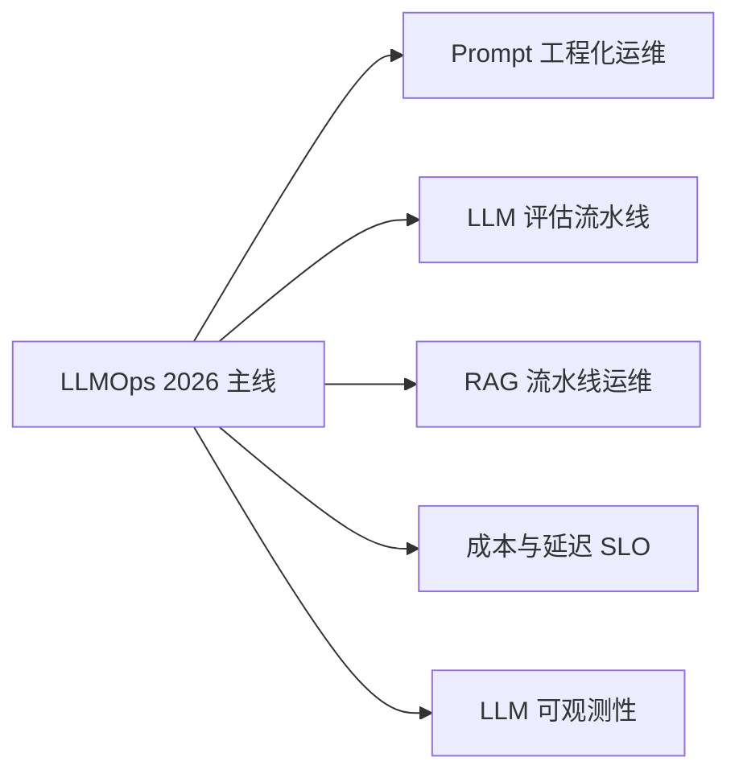

<div align="center">

<h1>🧠 AI Guru 知识库</h1>

<p><strong>这可能是 GitHub 上最全面的 AI 学习资源</strong></p>

<p>从理论到生产的完整 AI 知识体系 | 1,800+ 文档 | 1,500 万+ 字 | LLMOps 完整主线 | 2026 最新</p>

<p>
 <a href="#-快速开始">🚀 快速开始</a> •
 <a href="#-为什么选-ai-guru">💡 为什么选择</a> •
 <a href="#-内容导航">📚 内容导航</a> •
 <a href="#-适用人群">🎯 适用人群</a> •
 <a href="#-下载到本地工具">💾 下载到本地</a>
</p>

<p>
 
 
 
 
 
 
 
</p>

<p>
 <a href="./README_EN.md">🇺🇸 English Version</a>
</p>

</div>

---

## 💡 为什么选 AI Guru？

> **问题**：AI 领域变化太快，学习者面临信息碎片化、内容过时、理论与实践脱节的困境
>
> **解决方案**：AI Guru 是生产级的知识体系，帮你从 0 到 1 掌握 AI，从理论直达生产部署

### 🌟 核心亮点

<table>
<tr>
<td width="50%">

**📚 内容全面**
- 1,800+ Markdown 文档
- 1,500 万+ 字符（约 2,500 页 A4）
- 涵盖 70+ 技术领域
- 从数学基础到 AGI 前沿

</td>
<td width="50%">

**🎯 双轨学习**
- **速成路径**：26 篇 in-nutshell 指南
- **系统学习**：23 大章节深度剖析
- **入门友好**：99 篇 for_dummy 指南
- **大学课程**：16 周完整教学大纲

</td>
</tr>
<tr>
<td width="50%">

**🆕 2026 最新**
- GPT-5.2 / Claude 4.5 架构
- 中国六大厂商 (DeepSeek/Qwen/GLM/Kimi/MiniMax/MiMo)
- **LLMOps 完整主线**（Prompt/Eval/RAG/Cost/Observability）
- Agent 生产部署最佳实践

</td>
<td width="50%">

**🏭 生产就绪**
- K8s 部署方案
- MLOps + LLMOps 流水线
- 成本优化策略
- 企业级安全合规

</td>
</tr>
</table>

### 📊 数据说话

```
📁 1,800+ 个 Markdown 文件  📄 1,500 万+ 字符（约 2,500 页 A4）
📚 27 个知识章节            ⚡ 26 个速成指南 (in-nutshell)
🎓 99 篇入门指南 (for_dummy)  🔬 102 个 2026 专题 (_2026)
🏢 8 大行业应用             👔 21 个岗位面试指南
🧪 8 个动手实验             📖 6 个经典案例
```

#### 📈 各目录详细统计

| 目录名称 | 文件数 | 字符数 | 占比 |
|---------|--------|--------|------|
| 13_Agent_Production | 164 | 222.57 万 | 15.0% |
| 04_NLP_LLMs | 100 | 131.94 万 | 8.9% |
| 09_Deployment_Inference | 50 | 56.99 万 | 3.8% |
| 07_Model_Training | 23 | 51.38 万 | 3.5% |
| 12_Architecture_Infrastructure | 32 | 49.50 万 | 3.3% |
| 17_AI_Coding | 61 | 40.88 万 | 2.7% |
| 10_MLOps_Pipeline | 41 | 40.78 万 | 2.7% |
| concepts | 114 | 38.20 万 | 2.6% |
| 02_Machine_Learning | 35 | 33.73 万 | 2.3% |
| 22_Papers | 25 | 33.05 万 | 2.2% |
| 90_Learn | 60 | 32.98 万 | 2.2% |
| 01_Fundamentals | 31 | 32.73 万 | 2.2% |
| 19_Ethics_Safety | 28 | 30.71 万 | 2.1% |
| 11_RAG_Systems | 31 | 30.53 万 | 2.0% |
| 08_Model_Evaluation | 16 | 25.88 万 | 1.7% |
| 15_Testing | 12 | 22.87 万 | 1.5% |
| 03_Deep_Learning | 21 | 22.68 万 | 1.5% |
| 05_Computer_Vision | 23 | 19.63 万 | 1.3% |
| 16_AI_Ops | 11 | 16.85 万 | 1.1% |
| 20_AI_Applications_Industry | 26 | 15.92 万 | 1.1% |
| 00_AI_Introduction | 14 | 15.20 万 | 1.0% |
| 23_Interviews | 88 | 12.73 万 | 0.9% |
| 21_Talks | 54 | 12.45 万 | 0.8% |
| synthesis | 28 | 8.24 万 | 0.6% |
| references | 37 | 5.88 万 | 0.4% |
| 06_Reinforcement_Learning | 17 | 17.07 万 | 1.1% |
| **总计** | **1,800+** | **1,500 万+** | **100%** |

> 💡 提示：运行 `python3 count_words.py` 可查看最新的实时统计

---

## 🚀 快速开始

### 方式一：直接阅读（推荐）

```bash
# 克隆仓库
git clone https://github.com/your-org/ai-guru-knowledge-base.git

# 进入仓库根目录
cd ai-guru-knowledge-base

# 根据你的角色选择起点
ls -la
```

### 方式二：Web 端浏览

```bash
cd ai-guru-knowledge-base/Web
npm install
npm run dev
# 访问 http://localhost:4567
```

### 方式三：导入到 AI 工具

支持导入到 NotebookLM、ima、Claude Projects 等：

```bash
# 下载完整知识库（含元数据）
git clone --depth 1 https://github.com/your-org/ai-guru-knowledge-base.git

# 或者直接下载 ZIP
curl -L -o ai-guru.zip https://github.com/your-org/ai-guru-knowledge-base/archive/refs/heads/main.zip
```

---

## 🎯 适用人群

<table>
<tr>
<td align="center" width="25%">

**👨‍💻 运维/开发工程师**

转型 AI Agent 工程师

⏱️ 15-20 小时

[速成指南 →](#-速成路径-in-nutshell)

</td>
<td align="center" width="25%">

**🎓 大学生/自学者**

系统学习 AI 全栈

⏱️ 16-20 周

[大学课程 →](./00_AI_Introduction/)

</td>
<td align="center" width="25%">

**📊 产品经理**

理解 AI 能力边界

⏱️ 8-10 小时

[行业应用 →](./20_AI_Applications_Industry/)

</td>
<td align="center" width="25%">

**🔬 研究人员**

追踪前沿技术

⏱️ 自主学习

[必读论文 →](./22_Papers/)

</td>
</tr>
</table>

---

## 📚 内容导航

### 🎓 大学通识课程（00_AI_Introduction）

完整的 AI 通识教育，支持 16 周学期制：

| 模块 | 内容 | 时长 |
|------|------|------|
| AI 基础概念 | 定义、类型、核心技术 | 2-3h |
| 技术全景 | 技术栈、算法、工具链 | 3-4h |
| 历史时间线 | 1950-2026，4 次 AI 浪潮 | 2-3h |
| 工具实践 | ChatGPT、Claude、Cursor | 3-4h |
| 伦理社会 | 偏见、隐私、治理 | 3-4h |
| 未来趋势 | AGI 路径、2026-2040 | 2-3h |
| + 术语表 + 案例 + 实验 | 100+ 术语、6 案例、8 实验 | - |

### ⚡ 速成路径（26 篇 In-Nutshell 指南）

适合工程师快速上手的实战指南：

```
阶段 1: 基础认知
├── ① LLM 基础（Token、上下文、Temperature）
└── ② Prompt Engineering（CoT、Few-shot）

阶段 2: 核心技能
├── ③ 模型训练（损失函数、优化器）
├── ④ 模型推理（部署、量化 INT8）
└── ⑤ RAG 系统（向量数据库、混合检索）

阶段 3: Agent 工程
├── ⑥ AI 智能体（ReAct、Function Calling）
├── ⑦ AI 技能（技能注册、组合）
└── ⑧ AI 工作流（LangGraph、错误处理）

阶段 4: 生产保障
├── ⑨ AI 测试与评估（Metrics、LLM-as-Judge）
├── ⑩ MLOps 流水线（CI/CD、模型注册）
└── ⑪ AI 运维（可观测性、事故响应）
```

### 🆕 LLMOps 完整主线（10_MLOps_Pipeline · 2026 新增）

本知识库独有的 **LLMOps 全栈主线**，覆盖大模型时代 MLOps 的所有关键环节：



| 文档 | 内容 |
|------|------|
| ⭐ [LLMOps 2026](./10_MLOps_Pipeline/LLMOps_2026.md) | 主线：传统 MLOps 失效的 7 大原因、三层架构、成熟度模型、事故复盘 |
| [Prompt 工程化运维](./10_MLOps_Pipeline/Prompt_Engineering_Ops.md) | Prompt 即代码、版本化、A/B 测试、CI 门禁、DSPy 自动优化 |
| [LLM 评估流水线](./10_MLOps_Pipeline/LLM_Evaluation_Pipeline.md) | LLM-as-Judge、人审闭环、Eval-Driven Development、评估陷阱 |
| [RAG 流水线运维](./10_MLOps_Pipeline/RAG_Pipeline_Ops.md) | 四维可变性、Embedding 升级迁移、索引重建灰度 |
| [LLM 成本与延迟 SLO](./10_MLOps_Pipeline/LLM_Cost_Latency_SLO.md) | 三层缓存、智能路由、Token 预算熔断、FinOps |
| [LLM 可观测性](./10_MLOps_Pipeline/LLM_Observability.md) | 五层监控、Trace 分布式追踪、幻觉/毒性/PII 在线检测 |

> 加上横切关注点（数据版本/再训练/系统 SLO/成本/合规）与 16 个工具深度解析，10_MLOps_Pipeline 共 41 篇文档。

### 🔬 27 大系统章节

从数学基础到生产部署的完整路径：

<details>
<summary><b>📖 展开查看完整目录</b></summary>

| 章节 | 核心内容 | 难度 |
|------|----------|------|
| **00** [AI 简介与历史](./00_AI_Introduction/) | 通识导入：基础概念、技术全景、历史、工具、伦理、未来 | ⭐ |
| **01** [基础理论](./01_Fundamentals/) | 数学与计算机：线代、概率、数据结构、分布式、AI 硬件 2026 | ⭐⭐ |
| **02** [经典机器学习](./02_Machine_Learning/) | ML 基础：监督/无监督学习、特征工程、XGBoost | ⭐⭐ |
| **03** [深度学习](./03_Deep_Learning/) | 神经网络：MLP、反向传播、优化、世界模型 JEPA | ⭐⭐⭐ |
| **04** [NLP 与大模型](./04_NLP_LLMs/) | LLM 技术：Transformer、GPT-5.2/Claude 4.5、LoRA/RLHF/DPO | ⭐⭐⭐⭐ |
| **05** [计算机视觉](./05_Computer_Vision/) | 视觉 AI：CNN、YOLO、Diffusion、视频生成 2026 | ⭐⭐⭐ |
| **06** [强化学习与智能体](./06_Reinforcement_Learning/) | RL 与 Agent：DQN/PPO、Tool Calling、VLA 具身智能 | ⭐⭐⭐⭐ |
| **07** [模型训练](./07_Model_Training/) | 训练工程：损失函数、优化器、分布式训练 | ⭐⭐⭐ |
| **08** [模型评估](./08_Model_Evaluation/) | 评估方法：指标体系、基准测试、A/B 测试 | ⭐⭐⭐ |
| **09** [部署与推理](./09_Deployment_Inference/) | 推理优化：vLLM、量化、模型服务 | ⭐⭐⭐⭐ |
| **10** [MLOps 流水线](./10_MLOps_Pipeline/) | **LLMOps 完整主线** + 传统 MLOps + 工具深度解析（41 篇） | ⭐⭐⭐⭐ |
| **11** [RAG 系统](./11_RAG_Systems/) | 检索增强：向量数据库、混合检索、Agentic RAG、多模态检索 | ⭐⭐⭐ |
| **12** [架构与基础设施](./12_Architecture_Infrastructure/) | 架构设计 + 基础设施：四层模型、多租户、高可用、容量规划、边缘 AI | ⭐⭐⭐⭐ |
| **13** [Agent 生产部署](./13_Agent_Production/) | Agent 工程：框架、平台、Harness、技能、工作流、评估、OpenClaw 生态 | ⭐⭐⭐⭐ |
| ↳ [Agent Skills](./13_Agent_Production/Agent_Skills/) | 技能体系：技能注册、组合、生态 | ⭐⭐⭐ |
| ↳ [Agent Workflow](./13_Agent_Production/Agent_Workflow/) | 工作流：LangGraph、错误处理、编排 | ⭐⭐⭐ |
| ↳ [Agent 评估](./13_Agent_Production/16_Agent_Evaluation/) | 评估体系：Benchmark、红队测试、Leaderboard | ⭐⭐⭐⭐ |
| **15** [AI 测试](./15_Testing/) | 测试工程：测试框架（Ragas/DeepEval/Promptfoo）、契约测试 | ⭐⭐⭐ |
| **16** [AI 运维](./16_AI_Ops/) | AIOps：事故响应、SRE 实践、混沌工程 | ⭐⭐⭐⭐ |
| **17** [AI 编程](./17_AI_Coding/) | 编程工具与方法论：Cursor、Claude Code、Vibe Coding | ⭐⭐ |
| **19** [伦理与安全](./19_Ethics_Safety/) | AI 安全：价值对齐、红队测试、隐私保护、OWASP LLM | ⭐⭐⭐ |
| **20** [行业应用](./20_AI_Applications_Industry/) | 行业融合：医疗/金融/制造/零售核心应用 | ⭐⭐ |
| **21** [业界观点](./21_Talks/) | 领袖洞见：21 位 AI 领袖演讲与观点 | ⭐⭐ |
| **22** [必读论文](./22_Papers/) | 经典文献：Transformer、GPT、BERT 等里程碑 | ⭐⭐⭐⭐ |
| **23** [面试与岗位](./23_Interviews/) | 职业发展：21 个 AI 岗位面试指南 | ⭐⭐ |
| **90** [学习资源](./90_Learn/) | 课程映射：微软/Datawhale/HuggingFace 等课程 | ⭐⭐ |
| **91** [笔记](./91_Notes/) | 知识图谱：AI 全栈概念图 | ⭐⭐⭐ |

</details>

### 🔬 2026 专题深度报告（102 篇 _2026 文档）

最新的技术趋势和行业洞察：

<table>
<tr>
<td>

- [中国大模型生态全景](./04_NLP_LLMs/Chinese_LLM_Ecosystem/README.md) - DeepSeek/Qwen/GLM/Kimi/MiniMax/MiMo 六大厂商
- [国际大模型生态全景](./04_NLP_LLMs/Global_LLM_Ecosystem/README.md) - OpenAI/Google/Anthropic/Meta/Mistral 五大厂商
- [LLMOps 2026](./10_MLOps_Pipeline/LLMOps_2026.md) - 大模型时代的 MLOps 升级（⭐ 独家主线）
- [模型问题排查手册](./07_Model_Training/Model_Troubleshooting_Guide.md) - 预训练/微调/推理全链路故障诊断
- [LLM 基准测试全景](./08_Model_Evaluation/LLM_Benchmark_Suite_2026.md) - MMLU/SWE-bench/AIME/GPQA 全基准解读
- [量化技术深度 2026](./09_Deployment_Inference/Quantization_Techniques_2026.md) - GPTQ/AWQ/GGUF/NF4/FP8

</td>
<td>

- [LLM 架构 2026](./04_NLP_LLMs/LLM_Architectures/LLM_Architectures.md) - GPT-5.2, Claude 4.5, 推理模型
- [AI 硬件 2026](./01_Fundamentals/AI_Hardware/AI_Hardware_2026.md) - H100/H200/B200, GPU 选型
- [Scaling Laws 与训练动力学](./07_Model_Training/Scaling_Laws_and_Training_Dynamics.md) - Chinchilla/Kaplan/涌现能力
- [GRPO 与新对齐方法](./07_Model_Training/GRPO_and_New_Alignment_Methods.md) - GRPO/DPO/RLHF/RLOO
- [Agent 协议 2026](./06_Reinforcement_Learning/AI_Agents/Agent_Protocols_2026.md) - MCP/A2A/UCP
- [AI 基础设施](./12_Architecture_Infrastructure/AI_Infrastructure_2026.md) - SGLang, AI Gateway

</td>
</tr>
</table>

---

## 💾 下载到本地工具

AI Guru 知识库可以作为高质量语料导入到各种 AI 工具中：

### NotebookLM (Google)

1. 访问 [notebooklm.google.com](https://notebooklm.google.com)
2. 创建新项目
3. 选择 "GitHub" 或上传 ZIP
4. 粘贴仓库 URL：`https://github.com/your-org/ai-guru-knowledge-base`
5. NotebookLM 会自动分析所有文档，生成摘要和问答

### ima (腾讯)

1. 打开 ima 应用
2. 创建知识库
3. 导入本地文件夹
4. 选择下载的仓库根目录
5. 即可通过对话查询知识库内容

### Claude Projects / ChatGPT GPTs

```bash
# 下载精简版（仅核心内容）
git clone --depth 1 --filter=blob:none --sparse https://github.com/your-org/ai-guru-knowledge-base.git
cd ai-guru-knowledge-base
git sparse-checkout set 00_AI_Introduction 04_NLP_LLMs 10_MLOps_Pipeline 13_Agent_Production

# 打包上传
zip -r ai-guru-core.zip 00_AI_Introduction 04_NLP_LLMs 10_MLOps_Pipeline 13_Agent_Production
```

### Obsidian / Notion

所有文档为 Markdown 格式，可直接导入：
- **Obsidian**: 打开仓库作为 Vault（本库自带 `.obsidian/` 配置，支持 wiki 链接与图谱）
- **Notion**: 使用 Notion 导入工具批量导入 Markdown

---

## 🤖 Agent 友好说明

本知识库针对 AI Agent 进行了优化：

- ✅ **结构化元数据**: 每个文档包含 frontmatter（title/category/tags/summary/created/updated）
- ✅ **清晰的层级**: 章节-文档-段落结构清晰，编号式目录便于检索
- ✅ **三层入口**: 每章有 README + for_dummy + in-nutshell 三层阅读入口
- ✅ **代码可执行**: 包含可运行的代码示例
- ✅ **中英文对照**: 技术术语保留英文，便于理解原始概念
- ✅ **Wiki 链接**: 6,900+ 内部 wikilink，形成知识图谱
- ✅ **概念词典**: 114 篇 concepts/ 概念页 + 28 篇 synthesis/ 跨域合成页
- ✅ **版本控制**: Git 历史记录，可追溯更新

**建议的 Agent 使用方式**:
1. 将整个仓库根目录作为知识库导入
2. 使用文件路径作为上下文引用（如 `04_NLP_LLMs/LLM_Architectures/LLM_Architectures.md`）
3. 结合章节 README 快速定位内容
4. 利用 concepts/ 做概念查询，synthesis/ 做跨域关联

---

## 🏗️ 前端项目

包含现代化的知识库前端（React + Vite + TypeScript）：

```bash
cd Web/
npm install
npm run dev
```

特性：
- ⚡ Vite 极速构建
- 🎨 Tailwind CSS + shadcn/ui
- 🔍 全文搜索 (Fuse.js)
- 🌓 暗黑/亮色模式
- 📱 响应式设计

[查看前端详情 →](./Web/README.md)

---

## 🤝 贡献指南

我们欢迎各种形式的贡献！

### 如何贡献

- 📝 **内容**: 添加新指南、更新过时信息
- 🌐 **翻译**: 翻译成英文/其他语言
- 💻 **前端**: 改进 Web 体验
- 🐛 **Issue**: 报告问题或建议

### 快速开始

```bash
# Fork 并克隆
git clone https://github.com/your-username/ai-guru-knowledge-base.git

# 创建分支
git checkout -b feature/your-feature

# 提交更改
git commit -m "feat: 添加 XX 内容"
git push origin feature/your-feature
```

[查看完整贡献指南 →](./CONTRIBUTING.md)

---

## 📜 许可证

本项目采用 **MIT 许可证** - 详见 [LICENSE](./LICENSE) 文件。

引用的论文、书籍和第三方项目遵循其原始许可证。

---

## 🙏 致谢

感谢所有为本知识库做出贡献的人。

特别感谢：
- DeepLearning.AI - 课程结构灵感
- Hugging Face - 开源 ML 生态
- 所有贡献者和读者

---

<div align="center">

<p><b>AI Guru</b> — 让 AI 学习更系统、更高效、更 accessible</p>

<p>
  ⭐ <b>Star 本仓库</b> 获取更新通知 • 
  🔔 <b>Watch</b> 关注新内容 • 
  🍴 <b>Fork</b> 创建你的版本
</p>

</div>

## Related

- [[ROADMAP]] — AI Guru 知识库路线图
- [[KNOWN_ISSUES]] — 已知问题追踪
- [[README_EN]] — English Version
- [[CONTRIBUTING]] — 贡献指南
- [[README_for_dummy]] — 入门版 README
- [[index]] — 知识库索引
- [[hot]] — 热门页面
- [[92_Plan/MLOps_Section_Enhancement_Plan_2026]] — MLOps 章节加强计划
- [[10_MLOps_Pipeline/Boundary_with_16]] — 10 与 16 边界声明
- [[synthesis/README]] — 跨域综合文档索引
- [[00_AI_Introduction/AI_Fundamentals]] — 知识库入门索引
