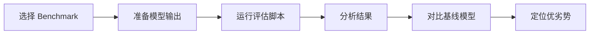

# 主流 LLM Benchmark 详解

## 一句话总结

主流 LLM Benchmark 各有侧重：MMLU 测知识、GSM8K 测数学、HumanEval 测代码、MT-Bench 测对话、AlpacaEval 测指令遵循。

---

## MMLU（Massive Multitask Language Understanding）

### 任务形式

- 57 个学科的多选题，涵盖 STEM、人文、社科等；
- 每个问题 4 个选项；
- 共约 15,908 题。

### 评分方式

```
Accuracy = 正确回答数 / 总题数
```

### 使用建议

- 5-shot 设置最常用；
- 是衡量模型综合知识能力的标准基准；
- 注意部分子领域样本少，结果波动大。

---

## GSM8K

### 任务形式

- 小学数学应用题；
- 需要多步推理才能得出最终答案；
- 共 1,319 题。

### 评分方式

- 提取答案中的数字；
- 与标准答案比较。

### 使用建议

- 8-shot CoT（Chain-of-Thought）最常用；
- 对模型的逐步推理能力敏感；
- 是评估数学推理的首选基准。

---

## HumanEval

### 任务形式

- 164 个手写 Python 编程问题；
- 每个问题包含函数签名和 docstring；
- 模型需要补全函数体。

### 评分方式

- **pass@k**：采样 k 个候选，至少有一个通过测试的概率；

```
pass@k = E[1 - C(n-c, k) / C(n, k)]
```

其中 `n` 是总样本数，`c` 是通过样本数。

### 使用建议

- pass@1 用于快速评估，pass@10 / pass@100 衡量潜力；
- 对 greedy decoding 敏感；
- 建议使用 `do_sample=False` 或 `temperature=0`。

---

## MT-Bench（Multi-Turn Benchmark）

### 任务形式

- 80 个多轮对话问题，覆盖 8 个类别；
- 使用 GPT-4 作为裁判打分（1~10 分）；
- 强调多轮对话和上下文一致性。

### 评分方式

- GPT-4 根据回答的有用性、相关性、准确性、深度等维度打分；
- 最终取平均分。

### 使用建议

- 适合评估 Chat 模型的对话能力；
- GPT-4 裁判可能存在偏好偏差；
- 可作为人工评估的补充。

---

## AlpacaEval

### 任务形式

- 805 个指令跟随任务；
- 模型输出与 text-davinci-003 输出进行对比；
- 使用 GPT-4 或自动评估器判断哪个更好。

### 评分方式

- **Win Rate**：模型胜过 text-davinci-003 的比例；
- 通常报告 Length-Controlled Win Rate（LC Win Rate）以控制输出长度影响。

### 使用建议

- 适合评估指令微调模型的指令遵循能力；
- 输出长度会影响结果，注意使用 LC Win Rate；
- 对中文模型可能不公平（基线以英文为主）。

---

## 对比总结

| Benchmark | 维度 | 题量 | 评分方式 | 常用设置 |
|---|---|---|---|---|
| MMLU | 知识 | 15K+ | Accuracy | 5-shot |
| GSM8K | 数学推理 | 1,319 | 答案匹配 | 8-shot CoT |
| HumanEval | 代码 | 164 | pass@k | 0-shot |
| MT-Bench | 对话 | 80 | GPT-4 打分 | 多轮 |
| AlpacaEval | 指令遵循 | 805 | Win Rate | 单轮 |

---

## 实战评估流程



常用工具：

- **lm-evaluation-harness**：EleutherAI 的通用评估框架；
- **MT-Bench**：FastChat 提供官方评估脚本；
- **AlpacaEval**：官方仓库提供自动评估；
- **OpenCompass**：中文大模型评估平台。

---

## 延伸阅读

- [[_concepts/llm-benchmarks|Benchmark 概览]]
- [[_concepts/model-evaluation|模型评估]]
- [[_concepts/perplexity|困惑度]]
