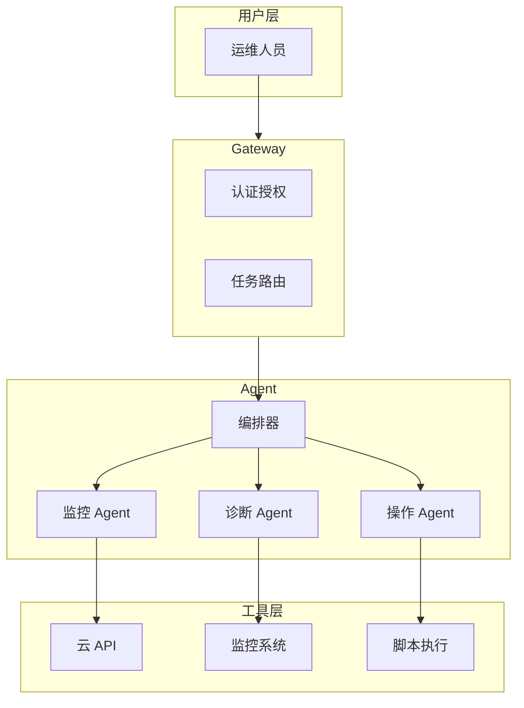
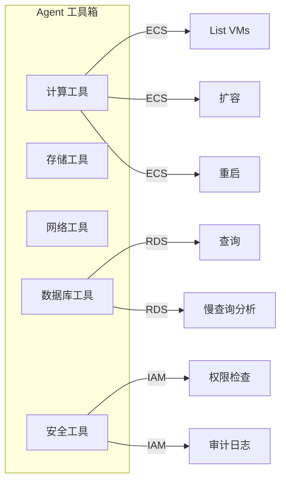
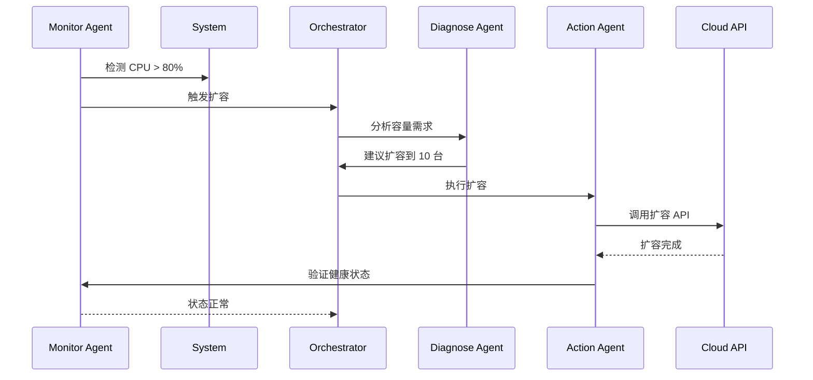
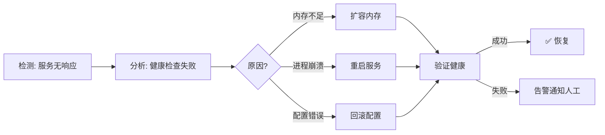
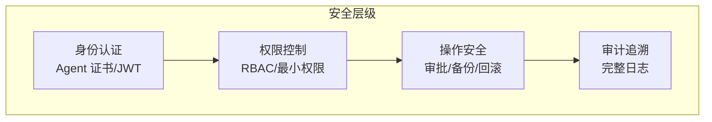

# 云产品运维 Agent 速成指南

> 🎯 **目标**：理解云产品运维 Agent 的核心概念、架构和典型应用场景。

---

## 🤔 什么是云产品运维 Agent？

**云产品运维 Agent** = 自主执行运维任务的 AI 智能体。

```
传统运维:                    Agent 运维:
                           
人工监控 + 判断 + 操作        AI 监控 + 分析 + 自动操作
需要 7x24 人力               24 小时不眠不休
响应慢                       秒级响应
依赖经验                     基于数据和规则
```

---

## 🏗️ Agent 架构



---

## 🎯 核心能力

| 能力 | 说明 | 自动化程度 |
|------|------|-------------|
| **监控告警** | 指标监控、告警处理 | 95% |
| **问题诊断** | 故障定位、根因分析 | 80% |
| **容量管理** | 资源调度、弹性伸缩 | 90% |
| **变更管理** | 配置变更、版本发布 | 70% |
| **安全运维** | 漏洞扫描、访问审计 | 85% |
| **成本优化** | 资源利用率优化 | 80% |

---

## 🔧 工具系统



---

## 🎬 典型工作流程

### 场景 1: 自动扩容



### 场景 2: 故障自愈



---

## 🔐 安全架构



| 安全措施 | 说明 |
|----------|------|
| **身份认证** | Agent 使用证书或 JWT 认证身份 |
| **权限控制** | 基于角色的访问控制，最小权限原则 |
| **操作审批** | 高风险操作需要人工审批 |
| **备份回滚** | 操作前备份，失败可回滚 |
| **完整审计** | 所有操作都有日志记录 |

---

## 📊 运维场景矩阵

| 场景 | Agent 能力 | 风险等级 |
|------|-----------|----------|
| 监控指标 | 自动采集分析 | 低 |
| 告警处理 | 智能聚合分发 | 低 |
| 弹性伸缩 | 自动扩缩容 | 中 |
| 服务重启 | 自动检测重启 | 中 |
| 数据库优化 | 索引推荐/参数调优 | 高 |
| 配置变更 | 灰度发布/回滚 | 高 |
| 安全扫描 | 漏洞检测 | 中 |

---

## 📝 关键术语

| 术语 | 解释 |
|------|------|
| **Agent Orchestrator** | 任务编排器，协调多个 Agent |
| **Tool Registry** | 工具注册表，管理可用操作 |
| **Self-Healing** | 自愈，故障自动恢复 |
| **Capacity Planning** | 容量规划，预测资源需求 |
| **Change Management** | 变更管理，控制变更风险 |
| **Harness** | 测试框架，验证 Agent 行为 |

---

## 🔗 相关主题

| 主题 | 文档 |
|------|------|
| 完整架构 | [Cloud_Product_Ops_2026.md](./Cloud_Product_Ops_2026.md) |
| 入门指南 | [Cloud_Product_Ops_for_dummy.md](./Cloud_Product_Ops_for_dummy.md) |
| Agent Harness | [Ops_Agent_Harness_2026.md](../Agent/Agent_Evaluation/Ops_Agent_Harness_2026.md) |
| SRE 实践 | [../AI_Ops/SRE_for_AI_Systems.md](../13_AI_Ops/SRE_for_AI_Systems.md) |
| 事故响应 | [../AI_Ops/AI_Incident_Response_Playbook.md](../13_AI_Ops/AI_Incident_Response_Playbook.md) |
| 可观测性 | [../AI_Ops/AI_Observability_Guide.md](../13_AI_Ops/AI_Observability_Guide.md) |

---

*Last updated: 2026-04-11*

## Related

- [[18_Cloud_Ops_Agent/Cloud_Product_Ops_for_dummy]] — 云产品运维 Agent 入门指南 (for Dummies) (共享: ai-agents, automation, cloud-ops, devops, sre)
- [[18_Cloud_Ops_Agent/docs/architecture/index]] — 云产品运维 Agent 架构设计指南 (Architecture) (共享: ai-agents, automation, cloud-ops, devops, sre)
- [[18_Cloud_Ops_Agent/docs/corpus/index]] — 云产品运维 Agent 语料工程指南 (Corpus Engineering) (共享: ai-agents, automation, cloud-ops, devops, sre)
- [[18_Cloud_Ops_Agent/docs/development/index]] — 云产品运维 Agent 研发指南 (Development) (共享: ai-agents, automation, cloud-ops, devops, sre)
- [[18_Cloud_Ops_Agent/README.md|README]]
