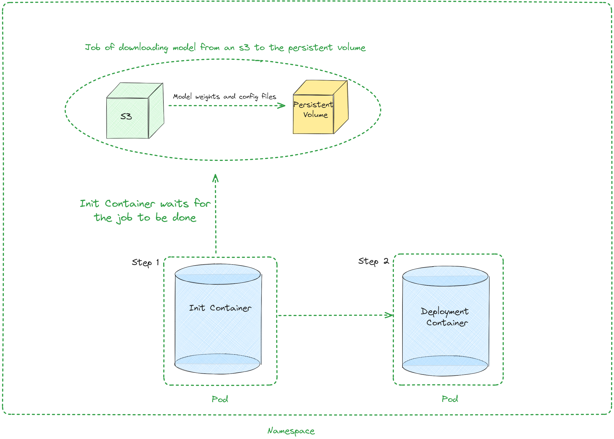

[](){ #deployment-helm }

A Helm chart to deploy vLLM for Kubernetes

Helm is a package manager for Kubernetes. It will help you to deploy vLLM on k8s and automate the deployment of vLLM Kubernetes applications. With Helm, you can deploy the same framework architecture with different configurations to multiple namespaces by overriding variable values.

This guide will walk you through the process of deploying vLLM with Helm, including the necessary prerequisites, steps for helm installation and documentation on architecture and values file.

## Prerequisites

Before you begin, ensure that you have the following:

- A running Kubernetes cluster
- NVIDIA Kubernetes Device Plugin (`k8s-device-plugin`): This can be found at [https://github.com/NVIDIA/k8s-device-plugin](https://github.com/NVIDIA/k8s-device-plugin)
- Available GPU resources in your cluster
- S3 with the model which will be deployed

## Installing the chart

To install the chart with the release name `test-vllm`:

```console
helm upgrade --install --create-namespace --namespace=ns-vllm test-vllm . -f values.yaml --set secrets.s3endpoint=$ACCESS_POINT --set secrets.s3bucketname=$BUCKET --set secrets.s3accesskeyid=$ACCESS_KEY --set secrets.s3accesskey=$SECRET_KEY
```

## Uninstalling the Chart

To uninstall the `test-vllm` deployment:

```console
helm uninstall test-vllm --namespace=ns-vllm
```

The command removes all the Kubernetes components associated with the
chart **including persistent volumes** and deletes the release.

## Architecture



## Values

| Key                                        | Type    | Default                                                                                                                                                  | Description                                                                                                                               |
|--------------------------------------------|---------|----------------------------------------------------------------------------------------------------------------------------------------------------------|-------------------------------------------------------------------------------------------------------------------------------------------|
| autoscaling                                | object  | {"enabled":false,"maxReplicas":100,"minReplicas":1,"targetCPUUtilizationPercentage":80}                                                                  | Autoscaling configuration                                                                                                                 |
| autoscaling.enabled                        | bool    | false                                                                                                                                                    | Enable autoscaling                                                                                                                        |
| autoscaling.maxReplicas                    | int     | 100                                                                                                                                                      | Maximum replicas                                                                                                                          |
| autoscaling.minReplicas                    | int     | 1                                                                                                                                                        | Minimum replicas                                                                                                                          |
| autoscaling.targetCPUUtilizationPercentage | int     | 80                                                                                                                                                       | Target CPU utilization for autoscaling                                                                                                    |
| configs                                    | object  | {}                                                                                                                                                       | Configmap                                                                                                                                 |
| containerPort                              | int     | 8000                                                                                                                                                     | Container port                                                                                                                            |
| customObjects                              | list    | []                                                                                                                                                       | Custom Objects configuration                                                                                                              |
| deploymentStrategy                         | object  | {}                                                                                                                                                       | Deployment strategy configuration                                                                                                         |
| externalConfigs                            | list    | []                                                                                                                                                       | External configuration                                                                                                                    |
| extraContainers                            | list    | []                                                                                                                                                       | Additional containers configuration                                                                                                       |
| extraInit                                  | object  | {"pvcStorage":"1Gi","s3modelpath":"relative_s3_model_path/opt-125m", "awsEc2MetadataDisabled": true}                                                     | Additional configuration for the init container                                                                                           |
| extraInit.pvcStorage                       | string  | "50Gi"                                                                                                                                                   | Storage size of the s3                                                                                                                    |
| extraInit.s3modelpath                      | string  | "relative_s3_model_path/opt-125m"                                                                                                                        | Path of the model on the s3 which hosts model weights and config files                                                                    |
| extraInit.awsEc2MetadataDisabled           | boolean | true                                                                                                                                                     | Disables the use of the Amazon EC2 instance metadata service                                                                              |
| extraPorts                                 | list    | []                                                                                                                                                       | Additional ports configuration                                                                                                            |
| gpuModels                                  | list    | ["TYPE_GPU_USED"]                                                                                                                                        | Type of gpu used                                                                                                                          |
| image                                      | object  | {"command":["vllm","serve","/data/","--served-model-name","opt-125m","--host","0.0.0.0","--port","8000"],"repository":"vllm/vllm-openai","tag":"latest"} | Image configuration                                                                                                                       |
| image.command                              | list    | ["vllm","serve","/data/","--served-model-name","opt-125m","--host","0.0.0.0","--port","8000"]                                                            | Container launch command                                                                                                                  |
| image.repository                           | string  | "vllm/vllm-openai"                                                                                                                                       | Image repository                                                                                                                          |
| image.tag                                  | string  | "latest"                                                                                                                                                 | Image tag                                                                                                                                 |
| livenessProbe                              | object  | {"failureThreshold":3,"httpGet":{"path":"/health","port":8000},"initialDelaySeconds":15,"periodSeconds":10}                                              | Liveness probe configuration                                                                                                              |
| livenessProbe.failureThreshold             | int     | 3                                                                                                                                                        | Number of times after which if a probe fails in a row, Kubernetes considers that the overall check has failed: the container is not alive |
| livenessProbe.httpGet                      | object  | {"path":"/health","port":8000}                                                                                                                           | Configuration of the Kubelet http request on the server                                                                                   |
| livenessProbe.httpGet.path                 | string  | "/health"                                                                                                                                                | Path to access on the HTTP server                                                                                                         |
| livenessProbe.httpGet.port                 | int     | 8000                                                                                                                                                     | Name or number of the port to access on the container, on which the server is listening                                                   |
| livenessProbe.initialDelaySeconds          | int     | 15                                                                                                                                                       | Number of seconds after the container has started before liveness probe is initiated                                                      |
| livenessProbe.periodSeconds                | int     | 10                                                                                                                                                       | How often (in seconds) to perform the liveness probe                                                                                      |
| maxUnavailablePodDisruptionBudget          | string  | ""                                                                                                                                                       | Disruption Budget Configuration                                                                                                           |
| readinessProbe                             | object  | {"failureThreshold":3,"httpGet":{"path":"/health","port":8000},"initialDelaySeconds":5,"periodSeconds":5}                                                | Readiness probe configuration                                                                                                             |
| readinessProbe.failureThreshold            | int     | 3                                                                                                                                                        | Number of times after which if a probe fails in a row, Kubernetes considers that the overall check has failed: the container is not ready |
| readinessProbe.httpGet                     | object  | {"path":"/health","port":8000}                                                                                                                           | Configuration of the Kubelet http request on the server                                                                                   |
| readinessProbe.httpGet.path                | string  | "/health"                                                                                                                                                | Path to access on the HTTP server                                                                                                         |
| readinessProbe.httpGet.port                | int     | 8000                                                                                                                                                     | Name or number of the port to access on the container, on which the server is listening                                                   |
| readinessProbe.initialDelaySeconds         | int     | 5                                                                                                                                                        | Number of seconds after the container has started before readiness probe is initiated                                                     |
| readinessProbe.periodSeconds               | int     | 5                                                                                                                                                        | How often (in seconds) to perform the readiness probe                                                                                     |
| replicaCount                               | int     | 1                                                                                                                                                        | Number of replicas                                                                                                                        |
| resources                                  | object  | {"limits":{"cpu":4,"memory":"16Gi","nvidia.com/gpu":1},"requests":{"cpu":4,"memory":"16Gi","nvidia.com/gpu":1}}                                          | Resource configuration                                                                                                                    |
| resources.limits."nvidia.com/gpu"          | int     | 1                                                                                                                                                        | Number of gpus used                                                                                                                       |
| resources.limits.cpu                       | int     | 4                                                                                                                                                        | Number of CPUs                                                                                                                            |
| resources.limits.memory                    | string  | "16Gi"                                                                                                                                                   | CPU memory configuration                                                                                                                  |
| resources.requests."nvidia.com/gpu"        | int     | 1                                                                                                                                                        | Number of gpus used                                                                                                                       |
| resources.requests.cpu                     | int     | 4                                                                                                                                                        | Number of CPUs                                                                                                                            |
| resources.requests.memory                  | string  | "16Gi"                                                                                                                                                   | CPU memory configuration                                                                                                                  |
| secrets                                    | object  | {}                                                                                                                                                       | Secrets configuration                                                                                                                     |
| serviceName                                | string  | Service name                                                                                                                                             |                                                                                                                                           |
| servicePort                                | int     | 80                                                                                                                                                       | Service port                                                                                                                              |
| labels.environment                         | string  | test                                                                                                                                                     | Environment name                                                                                                                          |

## 核心知识框架

| 知识层 | 内容 | 深度要求 | 优先级 |
|--------|------|----------|--------|
| 基础概念 | 定义/原理/分类 | 理解并能解释 | P0 |
| 核心方法 | 算法/技术/工具 | 掌握并能应用 | P0 |
| 工程实践 | 设计/实现/优化 | 独立完成项目 | P1 |
| 前沿进展 | 最新研究/趋势 | 了解并跟踪 | P2 |
| 应用案例 | 实际场景/经验 | 参考并借鉴 | P1 |

## 技术要点速查

| 要点 | 说明 | 注意事项 |
|------|------|----------|
| 核心原理 | 理解底层机制 | 不要死记硬背 |
| 实践方法 | 动手验证理论 | 从简单开始 |
| 性能优化 | 瓶颈分析+调优 | 数据驱动 |
| 错误排查 | 系统化定位问题 | 日志+复现 |
| 最佳实践 | 遵循行业标准 | 因地制宜 |
| 持续学习 | 跟踪技术发展 | 选择性深入 |

## 对比分析表

| 维度 | 方案一 | 方案二 | 方案三 | 推荐 |
|------|--------|--------|--------|------|
| 复杂度 | 低 | 中 | 高 | 按需选择 |
| 性能 | 基础 | 良好 | 优秀 | 按需求 |
| 可维护性 | 高 | 中 | 低 | 优先高 |
| 学习曲线 | 平缓 | 中等 | 陡峭 | 按团队 |
| 社区支持 | 广泛 | 一般 | 有限 | 优先广泛 |

## 常见问题FAQ

| 问题 | 解答 |
|------|------|
| 如何快速入门? | 先理解核心概念，再通过实践加深理解 |
| 如何选择技术方案? | 根据场景需求、团队能力、成本约束综合评估 |
| 遇到问题如何排查? | 复现问题→定位范围→分析原因→验证修复 |
| 如何持续提升? | 系统学习+项目实践+社区交流+定期复盘 |
| 如何评估效果? | 设定明确指标→对比基线→持续监控 |

## 学习路径

| 阶段 | 内容 | 时间 | 产出 |
|------|------|------|------|
| 入门 | 核心概念+基础操作 | 1-2周 | 基本理解 |
| 基础 | 工具使用+简单实践 | 2-3周 | 能独立操作 |
| 进阶 | 深入原理+复杂场景 | 3-4周 | 能解决问题 |
| 实战 | 生产级应用 | 4-6周 | 独立负责 |
| 精通 | 架构+创新 | 持续 | 技术领导 |

## 术语表

| 术语 | 含义 |
|------|------|
| Best Practice | 行业最佳实践 |
| Trade-off | 权衡取舍 |
| Scalability | 可扩展性 |
| Maintainability | 可维护性 |
| Observability | 可观测性 |
| Reliability | 可靠性 |

## 检查清单

- [ ] 核心概念已理解
- [ ] 基本操作已掌握
- [ ] 实践项目已完成
- [ ] 常见问题能解决
- [ ] 前沿趋势有关注
- [ ] 知识已沉淀文档化

## 进阶内容补充

| 主题 | 深度解析 | 实践要点 | 参考资源 |
|------|----------|----------|----------|
| 原理深入 | 底层机制剖析 | 源码阅读+实验验证 | 官方文档+论文 |
| 工程实现 | 生产级代码实践 | 设计模式+测试覆盖 | 开源项目 |
| 性能调优 | 瓶颈定位+优化 | Profiling+基准测试 | 性能工具 |
| 安全加固 | 威胁建模+防护 | 安全审计+渗透测试 | 安全框架 |
| 架构演进 | 系统设计与重构 | 渐进式改造+验证 | 架构书籍 |

## 实践操作指南

| 步骤 | 操作 | 验证方法 | 常见问题 |
|------|------|----------|----------|
| 环境搭建 | 安装依赖+配置 | 运行hello world | 版本冲突 |
| 基础使用 | 核心API调用 | 单元测试通过 | 参数错误 |
| 功能开发 | 业务逻辑实现 | 集成测试通过 | 边界条件 |
| 性能优化 | 热点优化+缓存 | 压测达标 | 内存泄漏 |
| 部署上线 | 容器化+CI/CD | 灰度验证通过 | 配置差异 |

## 技术选型决策

| 考量因素 | 权重 | 评估方法 | 决策标准 |
|----------|------|----------|----------|
| 功能匹配 | 30% | 需求清单对比 | 覆盖核心需求 |
| 性能表现 | 25% | 基准测试 | 满足SLA |
| 社区生态 | 20% | Star/Issue/更新频率 | 活跃维护 |
| 学习成本 | 15% | 文档质量+上手时间 | 团队可接受 |
| 长期维护 | 10% | 路线图+兼容性 | 可持续发展 |

## 故障排查流程

| 阶段 | 动作 | 工具 | 产出 |
|------|------|------|------|
| 复现 | 稳定复现问题 | 日志+断点 | 复现步骤 |
| 定位 | 缩小问题范围 | 二分法+排除法 | 问题模块 |
| 分析 | 找到根本原因 | 源码+文档 | 根因报告 |
| 修复 | 实施修复方案 | 代码修改+测试 | 修复PR |
| 验证 | 确认问题消除 | 回归测试 | 验证报告 |
| 预防 | 防止再次发生 | 监控+文档 | 改进措施 |

## 知识关联图谱

| 关联领域 | 关系 | 学习顺序 |
|----------|------|----------|
| 前置基础 | 必须先掌握 | 先学 |
| 并行技能 | 相互增强 | 同步 |
| 进阶方向 | 深入发展 | 后学 |
| 应用场景 | 价值体现 | 实践 |
| 工具支撑 | 效率提升 | 随时 |

## 持续改进清单

- [ ] 定期回顾和更新知识
- [ ] 实践验证理论认知
- [ ] 关注社区最新动态
- [ ] 参与技术讨论和分享
- [ ] 将经验沉淀为文档
- [ ] 持续优化工作流程
