# AI 智能体速成指南

> 🎯 **目标**：理解 AI 智能体如何工作，以及如何构建能够采取行动的自主 AI 系统。

---

## 🤔 什么是 AI 智能体？

**普通大模型**：回答问题，生成文本（不能行动）
**AI 智能体**：思考 + 规划 + 采取行动 + 从结果中学习

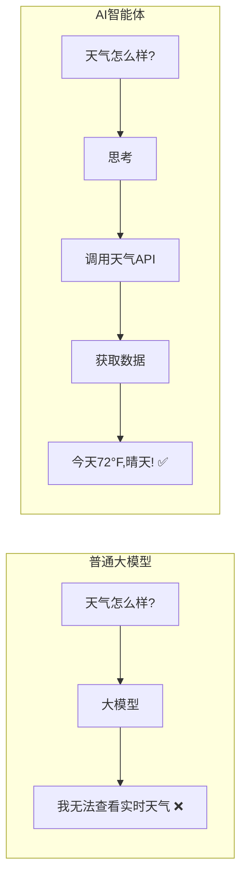

**类比**：
- 大模型 = 被锁在房间里的聪明人（只能说话）
- 智能体 = 有手机、电脑和工具的聪明人（可以行动！）

---

## 🧩 核心组件

### 智能体架构

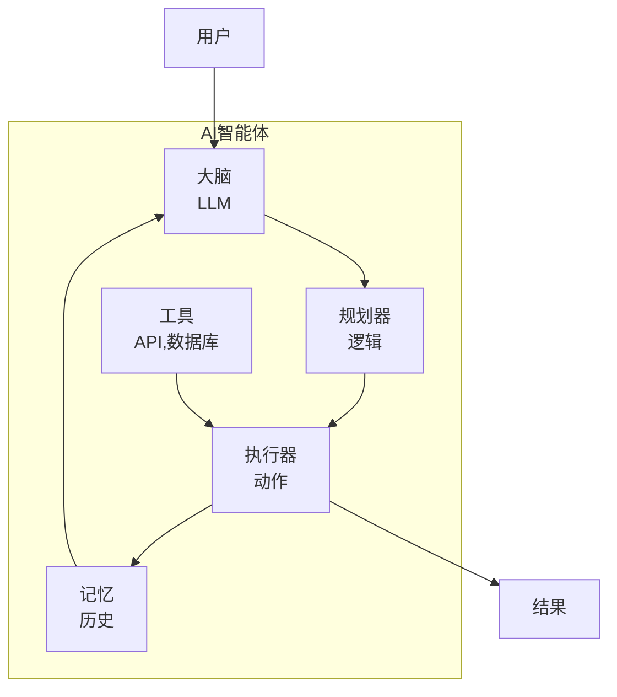

### 1. 大脑（LLM）
思考引擎 - 做决策。

```python
# 大脑解释请求并决定做什么
brain = ChatOpenAI(model="gpt-4")
```

### 2. 工具
智能体可以**做**的事情。

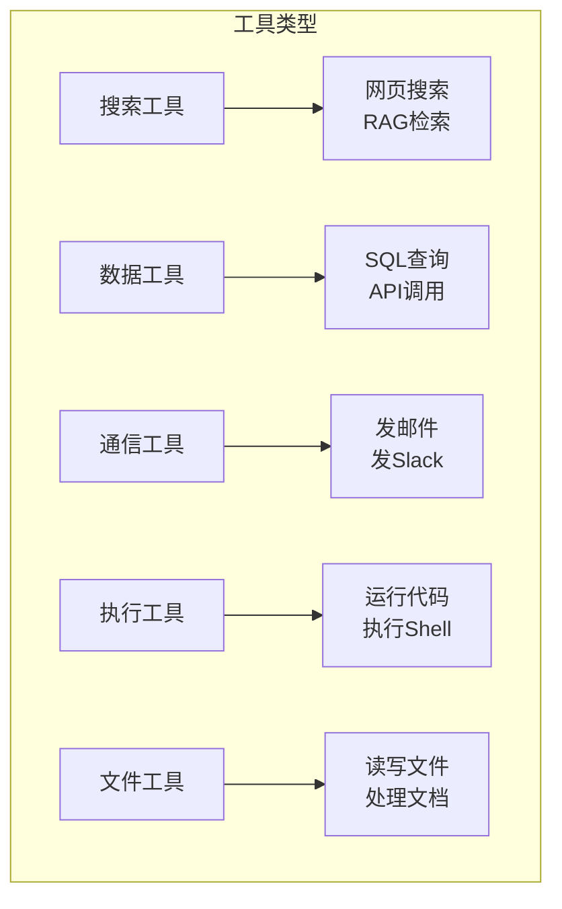

```python
# 智能体可能拥有的工具示例
tools = [
    search_web,           # 搜索互联网
    send_email,           # 发送邮件
    query_database,       # 查询数据库
    create_file,          # 创建文件
    execute_code,         # 运行代码
    call_api,             # 调用外部API
]
```

### 3. 记忆
智能体记住的内容。

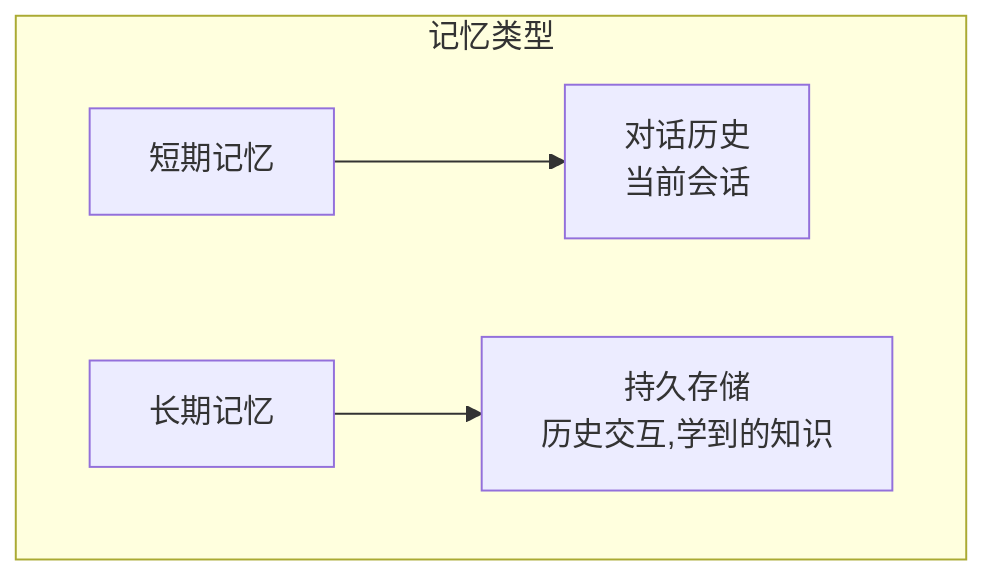

```python
# 短期：对话历史
short_term_memory = [
    {"role": "user", "content": "预订去纽约的航班"},
    {"role": "assistant", "content": "我来搜索航班..."},
]

# 长期：持久存储
long_term_memory = VectorStore()  # 过去的交互，学到的知识
```

### 4. 规划器
如何分解复杂任务。

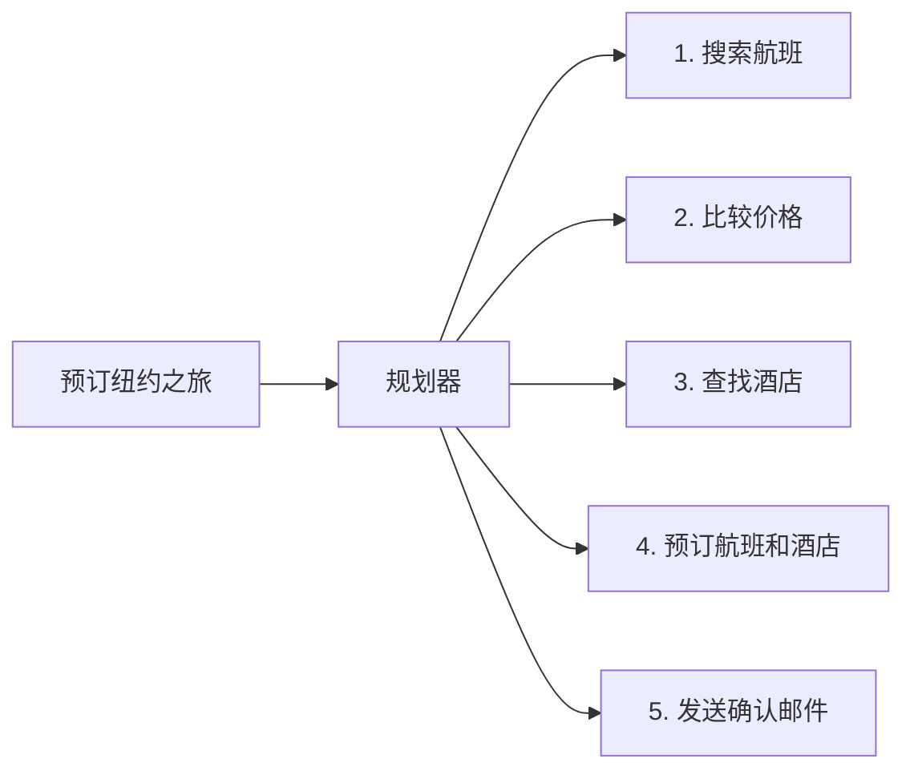

---

## 📋 智能体循环（ReAct 模式）

### ReAct 循环

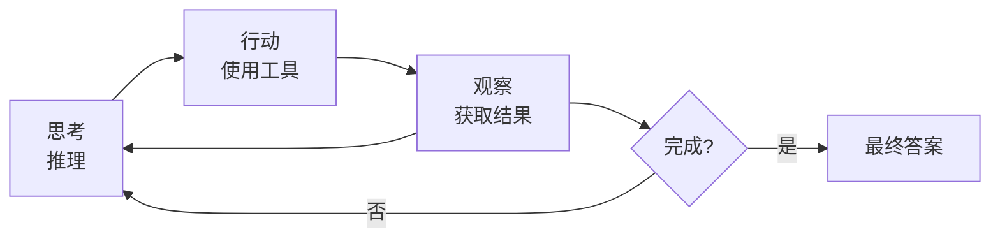

### ReAct 示例

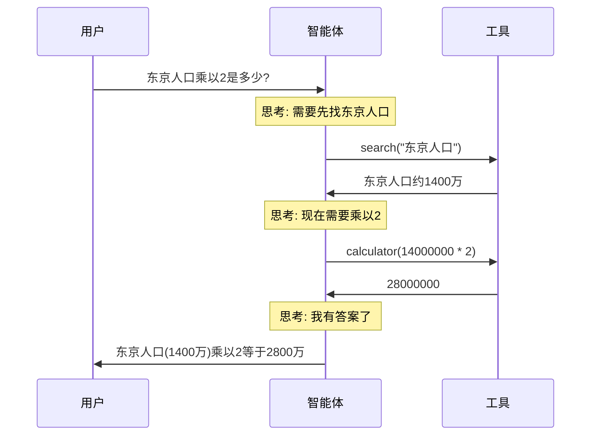

---

## 🔧 构建你的第一个智能体

### 使用 LangChain

```python
from langchain.agents import create_react_agent, AgentExecutor
from langchain.chat_models import ChatOpenAI
from langchain.tools import Tool
from langchain import hub

# 1. 定义工具
def search_weather(city: str) -> str:
    """获取城市天气。"""
    # 实际应用中，调用天气 API
    return f"{city}天气: 25°C, 晴天"

def calculate(expression: str) -> str:
    """计算数学表达式。"""
    return str(eval(expression))

tools = [
    Tool(
        name="weather",
        description="获取城市天气。输入：城市名",
        func=search_weather
    ),
    Tool(
        name="calculator",
        description="计算数学表达式。输入：表达式",
        func=calculate
    )
]

# 2. 创建智能体
llm = ChatOpenAI(model="gpt-4", temperature=0)
prompt = hub.pull("hwchase17/react")
agent = create_react_agent(llm, tools, prompt)

# 3. 创建执行器
executor = AgentExecutor(
    agent=agent,
    tools=tools,
    verbose=True,  # 查看思考过程
    max_iterations=5,
    handle_parsing_errors=True
)

# 4. 运行智能体
result = executor.invoke({
    "input": "东京天气怎么样？如果温度高于20°C，计算20乘以1.5"
})
print(result["output"])
```

### 使用 OpenAI Function Calling

```python
import openai
import json

# 将工具定义为函数
tools = [
    {
        "type": "function",
        "function": {
            "name": "get_weather",
            "description": "获取城市当前天气",
            "parameters": {
                "type": "object",
                "properties": {
                    "city": {"type": "string", "description": "城市名"}
                },
                "required": ["city"]
            }
        }
    },
    {
        "type": "function",
        "function": {
            "name": "send_email",
            "description": "发送邮件",
            "parameters": {
                "type": "object",
                "properties": {
                    "to": {"type": "string"},
                    "subject": {"type": "string"},
                    "body": {"type": "string"}
                },
                "required": ["to", "subject", "body"]
            }
        }
    }
]

def run_agent(user_message: str):
    messages = [{"role": "user", "content": user_message}]
    
    while True:
        # 获取 LLM 响应
        response = openai.chat.completions.create(
            model="gpt-4",
            messages=messages,
            tools=tools
        )
        
        message = response.choices[0].message
        
        # 检查是否完成
        if message.tool_calls is None:
            return message.content
        
        # 执行工具调用
        messages.append(message)
        
        for tool_call in message.tool_calls:
            func_name = tool_call.function.name
            func_args = json.loads(tool_call.function.arguments)
            
            # 执行函数
            result = execute_function(func_name, func_args)
            
            # 将结果添加到消息
            messages.append({
                "role": "tool",
                "tool_call_id": tool_call.id,
                "content": result
            })

# 使用
answer = run_agent("查看巴黎天气，然后把结果发邮件给 user@example.com")
```

---

## 🛠️ 基本工具类型

### 工具分类

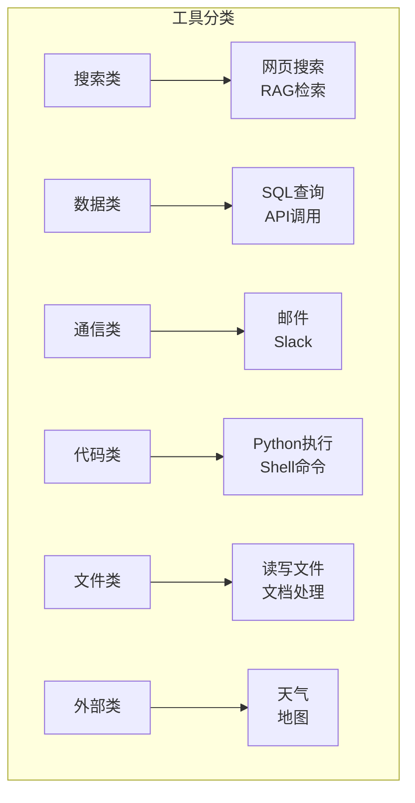

| 类别 | 示例 | 用途 |
|------|------|------|
| **搜索** | 网页搜索，RAG | 查找信息 |
| **数据** | SQL，API | 查询/更新数据 |
| **通信** | 邮件，Slack | 发送消息 |
| **代码** | Python 执行，Shell | 运行计算 |
| **文件** | 读写文件 | 文档处理 |
| **外部** | 天气，地图 | 第三方数据 |

### 工具定义最佳实践

```python
from langchain.tools import StructuredTool
from pydantic import BaseModel, Field

# 清晰定义输入模式
class SearchInput(BaseModel):
    query: str = Field(description="搜索查询字符串")
    max_results: int = Field(default=5, description="最大结果数")

def search_function(query: str, max_results: int = 5) -> str:
    """
    搜索网页获取信息。
    返回搜索结果摘要。
    """
    results = web_search(query, max_results)
    return format_results(results)

# 创建清晰描述的工具
search_tool = StructuredTool.from_function(
    func=search_function,
    name="web_search",
    description="搜索网页获取最新信息。当需要实时数据、新闻或"
                "训练数据中没有的信息时使用。输入：搜索查询字符串。",
    args_schema=SearchInput
)
```

---

## 📊 智能体模式

### 1. 单智能体（简单任务）

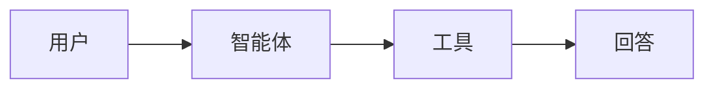

### 2. 多智能体（复杂任务）

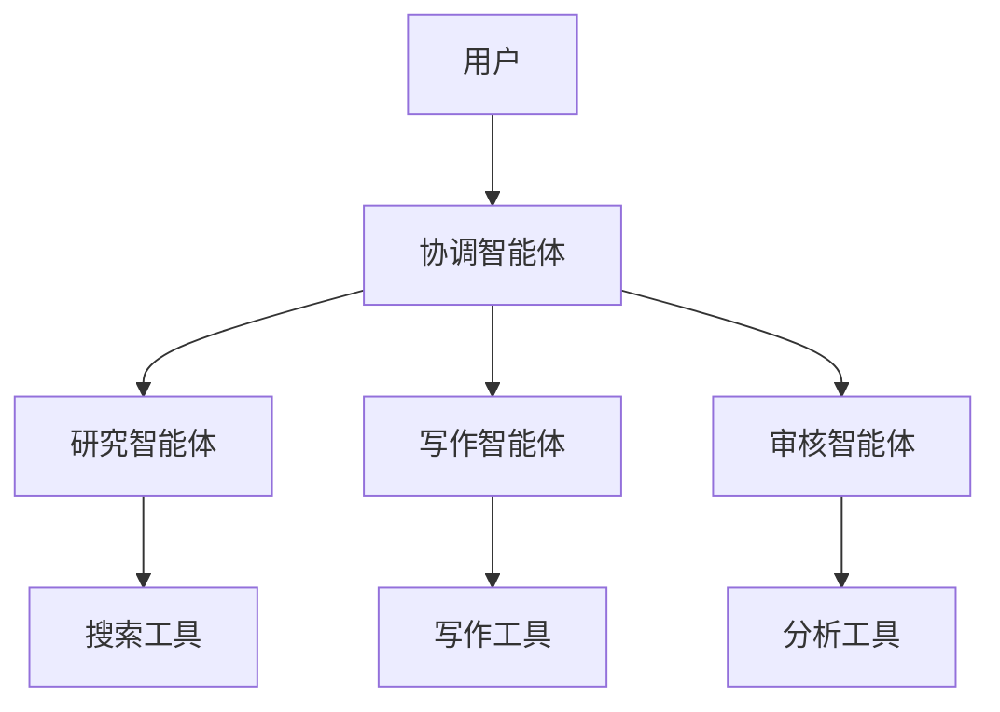

```python
# 适合：复杂项目，专业化任务
from crewai import Agent, Task, Crew

researcher = Agent(
    role="研究员",
    goal="查找准确信息",
    tools=[search_tool]
)

writer = Agent(
    role="写作者", 
    goal="撰写清晰内容",
    tools=[write_tool]
)

crew = Crew(agents=[researcher, writer], tasks=[...])
```

### 3. 分层智能体

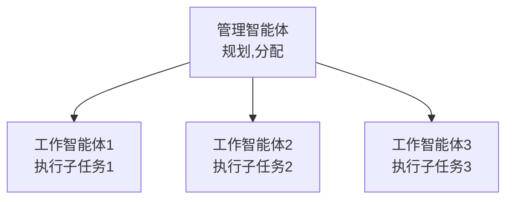

---

## ⚡ 性能与安全

### 速率限制

```python
from tenacity import retry, wait_exponential, stop_after_attempt

@retry(
    wait=wait_exponential(multiplier=1, min=4, max=60),
    stop=stop_after_attempt(3)
)
def call_tool_with_retry(tool, *args):
    return tool(*args)
```

### 成本控制

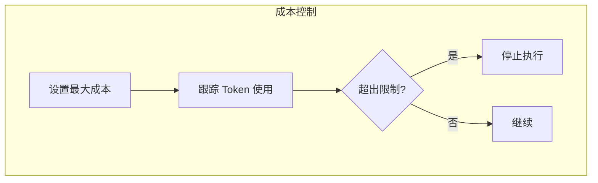

```python
class CostTracker:
    def __init__(self, max_cost: float = 1.0):
        self.total_cost = 0
        self.max_cost = max_cost
    
    def check_and_add(self, tokens: int, model: str):
        cost = calculate_cost(tokens, model)
        if self.total_cost + cost > self.max_cost:
            raise Exception("超出成本限制!")
        self.total_cost += cost

# 在智能体中使用
tracker = CostTracker(max_cost=5.0)  # $5 限制
```

### 安全护栏

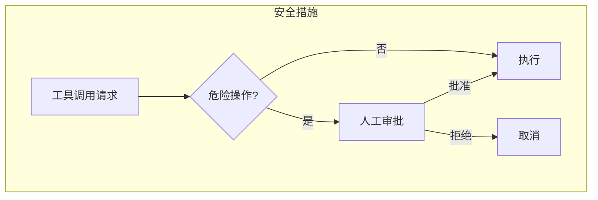

```python
# 1. 危险操作需要人工审批
DANGEROUS_TOOLS = ["delete_file", "send_money", "execute_code"]

def safe_executor(tool_name: str, tool_args: dict):
    if tool_name in DANGEROUS_TOOLS:
        approval = get_human_approval(tool_name, tool_args)
        if not approval:
            return "操作已被用户取消"
    return execute_tool(tool_name, tool_args)

# 2. 输入验证
def validate_email_tool(to: str, subject: str, body: str):
    if not is_valid_email(to):
        raise ValueError("无效的邮箱地址")
    if len(body) > 10000:
        raise ValueError("邮件内容过长")
    # ... 继续

# 3. 输出过滤
def filter_agent_output(output: str) -> str:
    # 从输出中移除敏感数据
    return redact_pii(output)
```

---

## 🛠️ 运维指南

### 部署清单

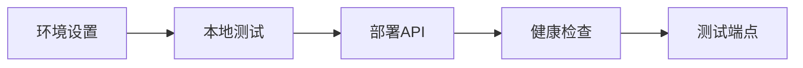

```bash
# 1. 环境设置
export OPENAI_API_KEY="sk-..."
export LANGCHAIN_TRACING_V2="true"  # 启用追踪

# 2. 本地测试智能体
python test_agent.py --task "简单测试查询"

# 3. 部署 API
uvicorn agent_server:app --host 0.0.0.0 --port 8000

# 4. 健康检查
curl http://localhost:8000/health

# 5. 测试端点
curl -X POST http://localhost:8000/agent \
  -H "Content-Type: application/json" \
  -d '{"task": "2+2等于几？"}'
```

### 监控

```python
import logging
from datetime import datetime

logging.basicConfig(level=logging.INFO)
logger = logging.getLogger(__name__)

class AgentMonitor:
    def __init__(self):
        self.runs = []
    
    def log_run(self, task: str, result: str, steps: list, 
                duration: float, tokens: int, cost: float):
        run_data = {
            "timestamp": datetime.now().isoformat(),
            "task": task,
            "result": result,
            "steps": steps,
            "duration_seconds": duration,
            "total_tokens": tokens,
            "cost_usd": cost,
            "success": "error" not in result.lower()
        }
        self.runs.append(run_data)
        logger.info(f"智能体运行: {run_data}")
        
        # 问题告警
        if duration > 30:
            alert("检测到慢速智能体运行")
        if cost > 0.50:
            alert("高成本智能体运行")
```

### 调试

```python
# 启用详细模式进行调试
executor = AgentExecutor(
    agent=agent,
    tools=tools,
    verbose=True,           # 打印所有步骤
    return_intermediate_steps=True,  # 返回步骤详情
    max_iterations=10,
    early_stopping_method="generate"
)

result = executor.invoke({"input": "调试这个任务"})

# 检查步骤
for step in result["intermediate_steps"]:
    tool_used = step[0].tool
    tool_input = step[0].tool_input
    tool_output = step[1]
    print(f"工具: {tool_used}, 输入: {tool_input}, 输出: {tool_output}")
```

---

## ⚠️ 常见问题与解决方案

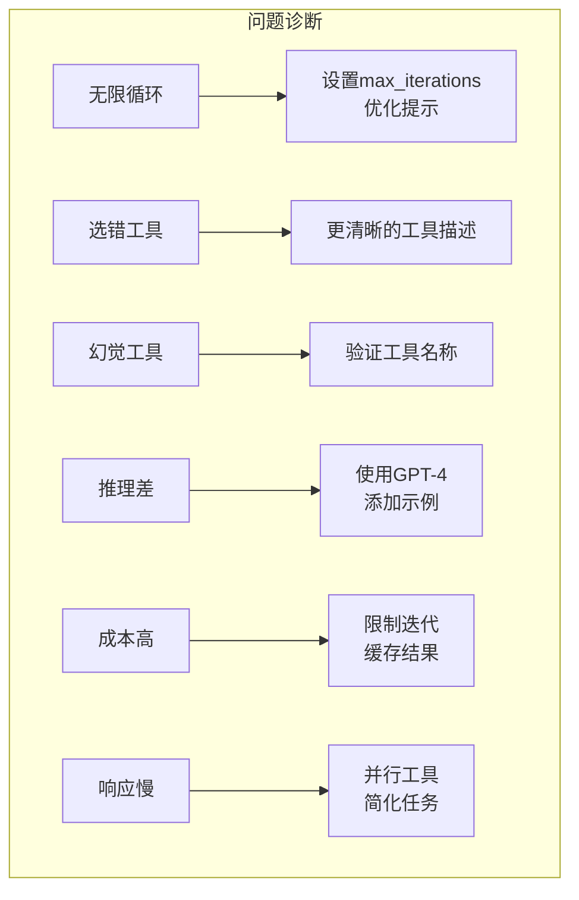

| 问题 | 症状 | 解决方案 |
|------|------|----------|
| **无限循环** | 永远不结束 | 设置 `max_iterations`，优化提示 |
| **选错工具** | 使用错误的工具 | 更清晰的工具描述 |
| **幻觉工具** | 调用不存在的工具 | 验证工具名称 |
| **推理差** | 错误决策 | 使用 GPT-4，添加示例 |
| **成本高** | 账单贵 | 限制迭代，缓存结果 |
| **响应慢** | 耗时长 | 并行工具，简化任务 |

---

## 💡 最佳实践

### 1. 清晰的工具描述

```python
# ❌ 差
Tool(name="search", description="搜索东西")

# ✅ 好
Tool(
    name="web_search",
    description="搜索网页获取最新信息。"
                "当需要实时数据、新闻或训练数据中"
                "没有的信息时使用。输入：搜索查询字符串。"
)
```

### 2. 结构化输出

```python
# 强制结构化响应
from langchain.output_parsers import PydanticOutputParser
from pydantic import BaseModel

class AgentResponse(BaseModel):
    thought: str        # 思考过程
    action: str         # 采取的动作
    action_input: dict  # 动作输入
    final_answer: Optional[str]  # 最终答案

parser = PydanticOutputParser(pydantic_object=AgentResponse)
```

### 3. 人机协作

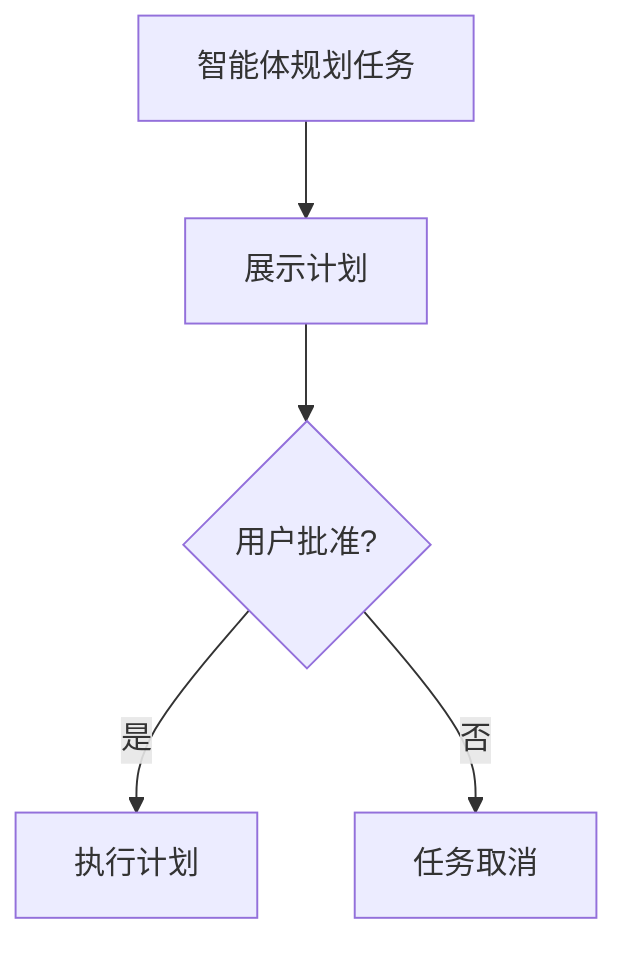

```python
def run_with_approval(agent, task: str):
    """带人工审批运行智能体。"""
    plan = agent.plan(task)
    
    print(f"智能体计划: {plan}")
    approval = input("批准? (yes/no): ")
    
    if approval.lower() == "yes":
        return agent.execute(plan)
    else:
        return "任务已取消"
```

---

## 📚 核心要点

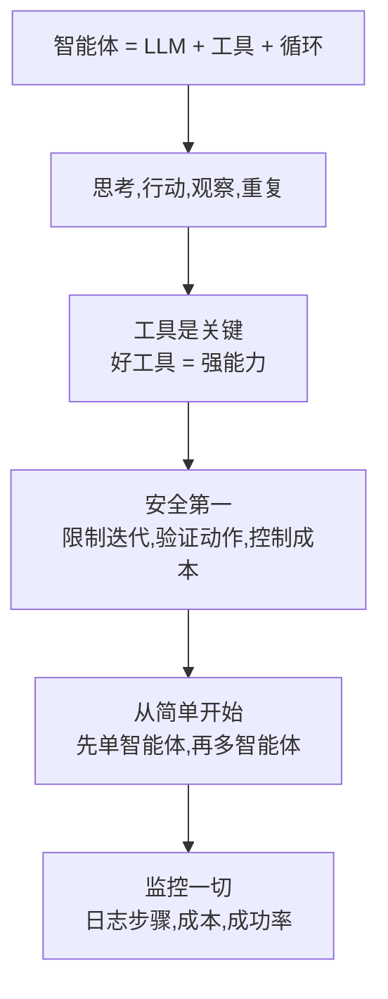

---

## 🔗 相关主题

- [RAG](../../07_AI_Engineering/RAG_Systems/RAG-in-nutshell.md) - 带知识检索的智能体
- [技能](../../07_AI_Engineering/AI_Skills/Skills-in-nutshell.md) - 构建智能体能力
- [工作流](../../07_AI_Engineering/AI_Workflow/Workflow-in-nutshell.md) - 智能体编排
