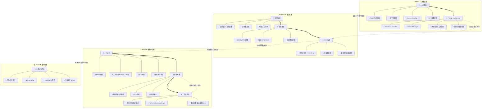
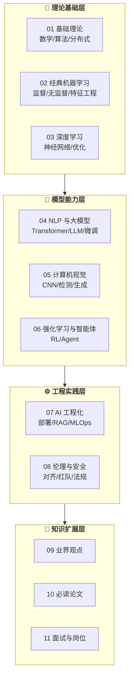

# AI Guru 知识库

> **从理论到生产的完整 AI 知识体系** | A Complete AI Knowledge System from Theory to Production

[](.)
[](.)
[](.)

---

## 📖 项目简介

**AI Guru** 是一套系统化的人工智能知识体系，涵盖从数学基础到生产部署的完整学习路径。本知识库特别设计了两种学习模式：

| 学习模式 | 目标人群 | 特点 | 入口 |
|----------|----------|------|------|
| **🚀 速成路径** | 运维/开发工程师转型 AI Agent 工程师 | 9 篇实战指南，Mermaid 图示，代码示例 | [快速入门](#-快速入门运维工程师--ai-agent-工程师) |
| **📚 系统学习** | 研究人员、深度学习者 | 11 大章节，理论+实践，论文引用 | [知识体系](#-知识体系架构) |

---

## 🎯 快速入门：运维工程师 → AI Agent 工程师

> **9 篇精心设计的速成指南**，支持零基础运维人员完成向 AI Agent 工程师的职业转型。每篇包含丰富的 Mermaid 图示、可运行代码、运维实操清单。

### 学习路线总览



#### 图例说明

| 符号 | 含义 |
|------|------|
| `==>` | 主学习路径（必经） |
| `-.->` | 跨阶段依赖（知识复用） |
| `---` | 子主题展开 |

### 速成指南索引

#### Phase 1: 基础认知 (Foundation)

| # | 主题 | 核心内容 | 预计时间 | 文档 |
|---|------|----------|----------|------|
| 1 | **LLM 基础** | Token、上下文窗口、Temperature、Top-P、模型对比、API 调用 | 2-3h | [LLM-Basics-in-nutshell.md](./04_NLP_LLMs/LLM_Architectures/LLM-Basics-in-nutshell.md) |
| 2 | **Prompt Engineering** | Zero-shot、Few-shot、Chain-of-Thought、角色扮演、提示词模板管理 | 3-4h | [Prompt-Engineering-in-nutshell.md](./04_NLP_LLMs/Prompt_Engineering/Prompt-Engineering-in-nutshell.md) |

#### Phase 2: 核心技能 (Core Skills)

| # | 主题 | 核心内容 | 预计时间 | 文档 |
|---|------|----------|----------|------|
| 3 | **模型训练** | 训练循环、损失函数、优化器、超参数调优、检查点管理 | 4-5h | [Model-Training-in-nutshell.md](./07_AI_Engineering/Model_Training/Model-Training-in-nutshell.md) |
| 4 | **模型推理** | REST/gRPC 部署、量化（INT8/ONNX）、批处理、监控指标 | 3-4h | [Inference-in-nutshell.md](./07_AI_Engineering/Deployment_Inference/Inference-in-nutshell.md) |
| 5 | **RAG 系统** | 文档分块、Embedding、向量数据库、混合检索、重排序 | 4-5h | [RAG-in-nutshell.md](./07_AI_Engineering/RAG_Systems/RAG-in-nutshell.md) |

#### Phase 3: 智能体工程 (Agent Engineering)

| # | 主题 | 核心内容 | 预计时间 | 文档 |
|---|------|----------|----------|------|
| 6 | **AI 智能体** | ReAct 模式、工具调用、记忆机制、多智能体、安全护栏 | 5-6h | [Agent-in-nutshell.md](./06_Reinforcement_Learning/AI_Agents/Agent-in-nutshell.md) |
| 7 | **AI 技能** | 技能结构、注册表、组合技能、权限系统、监控 | 4-5h | [Skills-in-nutshell.md](./07_AI_Engineering/AI_Skills/Skills-in-nutshell.md) |
| 8 | **AI 工作流** | 顺序/并行/条件模式、Prefect/Airflow/LangGraph、错误处理（重试/熔断/Saga） | 5-6h | [Workflow-in-nutshell.md](./07_AI_Engineering/AI_Workflow/Workflow-in-nutshell.md) |

#### Phase 4: 生产保障 (Production Ready)

| # | 主题 | 核心内容 | 预计时间 | 文档 |
|---|------|----------|----------|------|
| 9 | **AI 测试与评估** | 评估指标、LLM-as-Judge、RAG/Agent 测试、持续监控流水线 | 4-5h | [AI-Testing-in-nutshell.md](./07_AI_Engineering/AI_Testing/AI-Testing-in-nutshell.md) |

> **💡 学习建议**：
> - **零基础**：按顺序学习全部 9 篇，预计 35-45 小时完成
> - **有 Python 基础**：可跳过模型训练，从推理开始，预计 25-30 小时
> - **有 ML 经验**：直接从 RAG 系统开始，聚焦 Agent 工程，预计 15-20 小时

---

## 📚 知识体系架构

本知识库采用**渐进式学习设计**，从数学基础到生产部署，形成完整闭环。



### 章节详情

| 章节 | 主题 | 核心内容 | 难度 |
|------|------|----------|------|
| **[00 AI简介与历史](./00_AI_Introduction/README.md)** | AI通识导入 | AI基础概念、技术全景、历史时间线、工具实践、伦理社会、未来趋势 | ⭐ |
| **[01 基础理论](./01_Fundamentals/README.md)** | 数学与计算机基础 | 线性代数、概率统计、数据结构、分布式系统、**AI硬件/H100/H200** | ⭐⭐ |
| **[02 经典机器学习](./02_Machine_Learning/README.md)** | 传统 ML 方法 | 监督/无监督学习、特征工程、XGBoost | ⭐⭐ |
| **[03 深度学习](./03_Deep_Learning/README.md)** | 神经网络核心 | MLP、反向传播、SGD/Adam、Dropout、**世界模型/JEPA** | ⭐⭐⭐ |
| **[04 NLP 与大模型](./04_NLP_LLMs/README.md)** | 语言模型技术 | Transformer、GPT/BERT/LLaMA、LoRA/RLHF/QLoRA/DoRA、**GPT-5.2/Claude 4.5 2026** | ⭐⭐⭐⭐ |
| **[05 计算机视觉](./05_Computer_Vision/README.md)** | 视觉 AI | CNN/ResNet、YOLO、Diffusion、**视频生成2026/Veo3/Kling** | ⭐⭐⭐ |
| **[06 强化学习与智能体](./06_Reinforcement_Learning/README.md)** | RL 与 Agent | MDP、DQN/PPO、Tool Calling、Multi-Agent、**具身智能/VLA** | ⭐⭐⭐⭐ |
| **[07 AI 工程化](./07_AI_Engineering/README.md)** | 生产部署 | vLLM、量化、RAG高级实践、MLOps、**Agent生产部署**、**AI编程助手** | ⭐⭐⭐⭐ |
| **[08 伦理与安全](./08_Ethics_Safety/README.md)** | AI 安全 | 偏见公平、红队测试、法规合规、**OWASP LLM+ASI 2026** | ⭐⭐⭐ |
| **[09 业界观点](./09_talks/)** | 领袖洞见 | 21 位 AI 领袖的演讲与观点 | ⭐⭐ |
| **[10 必读论文](./10_papers/README.md)** | 经典文献 | Transformer、GPT、BERT 等里程碑论文 | ⭐⭐⭐⭐ |
| **[11 面试与岗位](./11_interviews/jobs.md)** | 职业发展 | 21 个 AI 岗位的面试指南 | ⭐⭐ |

---

## 🗂️ 项目结构

```
docs/
├── 00_AI_Introduction/         # AI简介与历史 (2026新 - 通识导入)
│   └── AI_History_Timeline.md  # AI历史时间线1950-2026
├── 01_Fundamentals/          # 数学与计算机基础
│   ├── Linear_Algebra/
│   ├── Probability_Statistics/
│   ├── Data_Structures_Algorithms/
│   ├── Distributed_Systems/
│   └── AI_Hardware/            # AI硬件与芯片2026 (2026新)
├── 02_Machine_Learning/      # 经典机器学习
│   ├── Supervised_Learning/
│   ├── Unsupervised_Learning/
│   └── Feature_Engineering/
├── 03_Deep_Learning/         # 深度学习基础
│   ├── Neural_Network_Core/
│   └── Optimization/
├── 04_NLP_LLMs/              # NLP 与大模型 ⭐
│   ├── Sequence_Models/
│   ├── Transformer_Revolution/
│   ├── LLM_Architectures/    # 含 LLM-Basics-in-nutshell.md
│   ├── Fine_tuning_Techniques/
│   └── Prompt_Engineering/   # 含 Prompt-Engineering-in-nutshell.md
├── 05_Computer_Vision/       # 计算机视觉
│   ├── Image_Classification_Detection/
│   ├── Segmentation/
│   ├── Generative_Models/
│   └── Multimodal_Vision/
├── 06_Reinforcement_Learning/ # 强化学习与智能体 ⭐
│   ├── RL_Foundations/
│   ├── Deep_RL/
│   ├── AI_Agents/            # 含 Agent-in-nutshell.md
│   └── Robotics_Embodied_AI/ # 具身智能与人形机器人 (2026新)
├── 03_Deep_Learning/         # 深度学习基础
│   ├── Neural_Network_Core/
│   ├── Optimization/
│   └── World_Models/         # JEPA/V-JEPA 世界模型 (2026新)
├── 05_Computer_Vision/       # 计算机视觉
│   ├── Image_Classification_Detection/
│   ├── Segmentation/
│   ├── Generative_Models/
│   ├── Multimodal_Vision/
│   └── Video_Generation/     # AI视频生成 2026 (2026新)
├── 07_AI_Engineering/        # AI 工程化 ⭐⭐
│   ├── Model_Training/       # 含 Model-Training-in-nutshell.md
│   ├── Deployment_Inference/ # 含 Inference-in-nutshell.md
│   ├── RAG_Systems/          # 含 RAG-in-nutshell.md
│   ├── AI_Skills/            # 含 Skills-in-nutshell.md
│   ├── AI_Workflow/          # 含 Workflow-in-nutshell.md
│   ├── AI_Testing/           # 含 AI-Testing-in-nutshell.md
│   ├── Agent_Production/     # Agent生产部署最佳实践 (2026新)
│   ├── MLOps_Pipeline/
│   └── Model_Evaluation/
├── 08_Ethics_Safety/         # 伦理与安全
│   ├── Value_Alignment/
│   ├── AI_Safety_RedTeaming/
│   └── AI_Security_2026/     # OWASP LLM+ASI安全框架 (2026新)
├── 09_talks/                 # 业界观点 (21 位领袖)
├── 10_papers/                # 必读论文清单
├── 11_interviews/            # 面试指南 (21 个岗位)
└── 99_AI_Applications_Industry/ # AI应用与行业融合 (2026新 - 行业应用)
    └── AI_Applications_Industry.md # 医疗/金融/制造/零售等核心行业
```

---

## 📊 项目统计

| 指标 | 数量 |
|------|------|
| 知识章节 | 13 |
| 速成指南 (In-Nutshell) | 9 |
| **2026年专题深度报告** | **12** |
| **通识课教材文档** | **10** (00章) |
| Markdown文档总数 | 290 |
| 总内容量 | 2.6M+ 字符 |
| 技术领域覆盖 | 70+
| 涵盖技术领域 | 70+ |

---

## 🔗 快速链接

### 速成系列 (In-Nutshell)
- [LLM 基础](./04_NLP_LLMs/LLM_Architectures/LLM-Basics-in-nutshell.md)
- [Prompt Engineering](./04_NLP_LLMs/Prompt_Engineering/Prompt-Engineering-in-nutshell.md)
- [模型训练](./07_AI_Engineering/Model_Training/Model-Training-in-nutshell.md)
- [模型推理](./07_AI_Engineering/Deployment_Inference/Inference-in-nutshell.md)
- [RAG 系统](./07_AI_Engineering/RAG_Systems/RAG-in-nutshell.md)
- [AI 智能体](./06_Reinforcement_Learning/AI_Agents/Agent-in-nutshell.md)
- [AI 技能](./07_AI_Engineering/AI_Skills/Skills-in-nutshell.md)
- [AI 工作流](./07_AI_Engineering/AI_Workflow/Workflow-in-nutshell.md)
- [AI 测试](./07_AI_Engineering/AI_Testing/AI-Testing-in-nutshell.md)

### 2026年最新专题 (2026 Latest)
- [**LLM架构2026**](./04_NLP_LLMs/LLM_Architectures/LLM_Architectures.md) - GPT-5.2, Claude 4.5, Gemini 3, Llama 4, 推理模型架构
- [**AI硬件2026**](./01_Fundamentals/AI_Hardware/AI_Hardware_2026.md) - H100/H200/B200对比, GPU选型指南, 边缘AI芯片
- [**PEFT微调2026**](./04_NLP_LLMs/Fine_tuning_Techniques/PEFT_2026/PEFT_2026.md) - LoRA/QLoRA/DoRA/rsLoRA, 单卡微调70B最佳实践
- [**RAG高级实践2026**](./07_AI_Engineering/RAG_Advanced_2026/RAG_Advanced_2026.md) - 混合检索/重排序/Agentic RAG/上下文压缩
- [**AI编程助手2026**](./07_AI_Engineering/AI_Coding_Assistants/AI_Coding_Assistants_2026.md) - Cursor/Claude Code/Windsurf/Devin对比选型
- [**AI基础设施2026**](./07_AI_Engineering/AI_Infrastructure_2026.md) - SGLang/vLLM基准, AI Gateway, LLMOps三阶段缓存
- [**Agent协议2026**](./06_Reinforcement_Learning/AI_Agents/Agent_Protocols_2026.md) - MCP/A2A/UCP协议栈, 协议测试框架
- [**具身智能2026**](./06_Reinforcement_Learning/Robotics_Embodied_AI/Embodied_AI_2026.md) - VLA模型, 人形机器人产业格局, Sim-to-Real
- [**世界模型2026**](./03_Deep_Learning/World_Models/World_Models_2026.md) - JEPA/V-JEPA 2.1/LeJEPA, 自监督世界建模
- [**AI视频生成2026**](./05_Computer_Vision/Video_Generation/Video_Generation_2026.md) - Veo3/Kling/Seedance, 后Sora时代格局
- [**AI安全2026**](./08_Ethics_Safety/AI_Security_2026/AI_Security_2026.md) - OWASP LLM + ASI框架, Agent安全最佳实践
- [**Agent生产部署**](./07_AI_Engineering/Agent_Production/Agent_Production_2026.md) - K8s架构, 监控, CI/CD, 成本控制

### 通识教材专题 (For Education)
- [AI历史时间线1950-2026](./00_AI_Introduction/AI_History_Timeline.md) - 从达特茅斯会议到Agentic AI的完整发展史
- [AI应用与行业融合](./99_AI_Applications_Industry/AI_Applications_Industry.md) - 医疗/金融/制造/零售核心行业深度分析

### 核心参考资料
- [Deep Learning Book](https://www.deeplearningbook.org/)
- [Hugging Face Course](https://huggingface.co/learn/nlp-course/)
- [Attention Is All You Need](https://arxiv.org/abs/1706.03762)
- [OpenAI Spinning Up](https://spinningup.openai.com/)

---

## 📝 更新日志

| 日期 | 更新内容 |
|------|----------|
| 2026-04-01 | **第四轮查漏补缺2026**: 完善通识课教材体系 (术语表、案例集、实验指导) |
| 2026-04-01 | **新增AI术语表**: 100+核心术语从A到Z完整解释，含定义、示例、关联概念 |
| 2026-04-01 | **新增AI经典案例集**: 6个里程碑案例深度剖析 (AlphaGo、ChatGPT、ImageNet等) |
| 2026-04-01 | **新增AI实验指导**: 8个课堂实验+期末项目，支持16周完整课程 |
| 2026-04-01 | **第三轮查漏补缺2026**: 新增通识教材专题 (AI历史时间线、AI应用与行业融合) |
| 2026-04-01 | **新增AI历史时间线**: 1950-2026完整AI发展史, 4次AI夏天与冬天, 关键人物与里程碑 |
| 2026-04-01 | **新增AI行业融合**: 医疗/金融/制造/零售/自动驾驶/教育核心行业深度分析 |
| 2026-04-01 | **第二轮查漏补缺2026**: 新增4大深度专题 (AI硬件/PEFT/RAG高级实践/AI编程助手) |
| 2026-04-01 | **新增AI硬件2026**: H100/H200/B200/MI300X对比, GPU选型决策树, 边缘AI芯片 |
| 2026-04-01 | **新增PEFT微调2026**: LoRA/QLoRA/DoRA/rsLoRA, 单卡微调70B最佳实践 |
| 2026-04-01 | **新增RAG高级实践**: 混合检索/重排序/Agentic RAG/上下文压缩, 准确率60%→90%+ |
| 2026-04-01 | **新增AI编程助手**: Cursor/Claude Code/Windsurf/Devin对比, 2026选型指南 |
| 2026-04-01 | **第一轮查漏补缺2026**: 新增7大深度专题，涵盖AI最新技术栈和行业最佳实践 |
| 2026-04-01 | **LLM架构2026更新**: GPT-5.2, Claude 4.5, Gemini 3, Llama 4, 推理模型架构趋势 |
| 2026-04-01 | **新增世界模型专题**: JEPA/V-JEPA 2.1/LeJEPA, Yann LeCun通往AGI路径 |
| 2026-04-01 | **新增AI视频生成专题**: Veo3/Kling/Seedance, Sora停止服务后市场格局 |
| 2026-04-01 | **新增AI安全2026专题**: OWASP LLM + ASI框架, Agent安全最佳实践 |
| 2026-04-01 | **新增Agent生产部署**: K8s架构, 监控, CI/CD, 成本控制, 企业级最佳实践 |
| 2026-04-01 | **具身智能专题**: 机器人基础模型/VLA架构/Sim-to-Real/人形机器人产业格局 |
| 2026-04-01 | **基础设施更新**: SGLang/vLLM 2026年性能基准、AI Gateway架构、LLMOps三阶段缓存 |
| 2026-04-01 | **Agent协议2026**: MCP/A2A/UCP协议栈、协议测试框架、安全最佳实践 |
| 2026-03-18 | 新增 3 篇速成指南：LLM 基础、Prompt Engineering、AI 测试 |
| 2026-03-18 | 完善学习路线图，支持 Ops → AI Agent 工程师转型路径 |
| 2026-02-26 | 新增 6 篇核心速成指南（训练/推理/RAG/Agent/技能/工作流） |
| 2026-02-10 | 知识库初始化，11 大章节框架搭建 |

---

## 📄 License

本知识库内容仅供学习交流使用。引用的论文、书籍、开源项目请遵循其原始许可协议。

---

<p align="center">
  <b>AI Guru</b> - 让 AI 学习更系统、更高效
</p>
