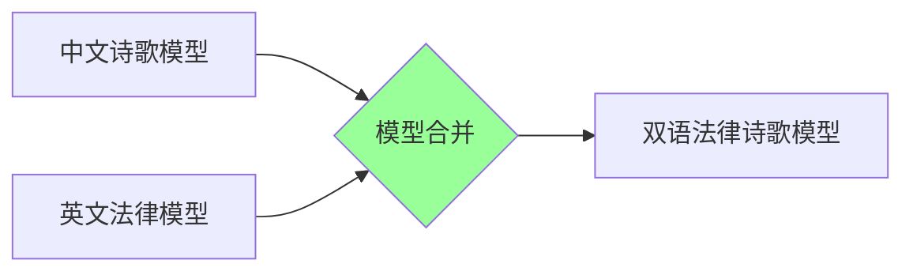
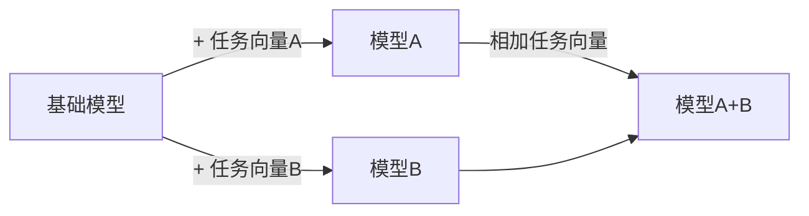
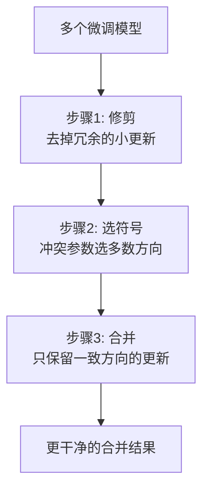
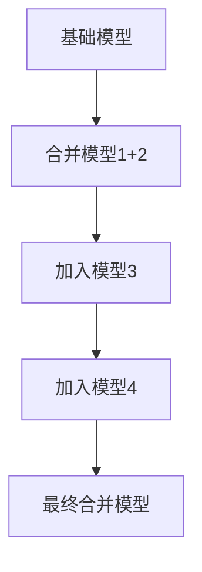

# 模型合并技术 2026 (Model Merging)

> **一句话理解**: 模型合并就像"炼金术"——把多个已经训练好的模型像调色一样混合在一起，不需要重新训练就能得到一个兼具多家之长的新模型。

---

## TL;DR（30 秒速览）

- **模型合并** = 不训练，只混合已有模型的权重
- **SLERP** = 球面线性插值，最直观的合并方式
- **TIES** = 解决符号冲突和冗余参数，效果更好
- **DARE** = 随机丢弃冗余参数，降低干扰
- **MergeKit** = 开源工具，一行命令合并模型
- **应用场景**：多语言能力融合、角色混合、领域知识整合

---

## 1. 为什么需要模型合并？

### 一个比喻

你训练了两个专家：
- **专家 A**：精通中文诗歌
- **专家 B**：精通英文法律

**传统方法**：重新训练一个双语专家（耗时耗钱）
**模型合并**：直接把两个专家的"大脑"按比例混合（几分钟搞定）



### 合并的优势

| 优势 | 说明 |
|------|------|
| **无需训练** | 省去 GPU 小时和电费 |
| **快速实验** | 几分钟测试不同组合 |
| **能力叠加** | 融合多个模型的专长 |
| **社区协作** | 开源社区共享模型，互相融合 |

---

## 2. 核心合并方法

### 2.1 SLERP（球面线性插值）

**最简单的方法**：像调音量一样，按权重混合两个模型。

```python
# SLERP 简化版
import torch

def slerp(theta_0, theta_1, t=0.5):
    """
    theta_0, theta_1: 两个模型的参数字典
    t: 插值系数 (0=全用模型0, 1=全用模型1, 0.5=各一半)
    """
    merged = {}
    for key in theta_0.keys():
        merged[key] = (1 - t) * theta_0[key] + t * theta_1[key]
    return merged
```

**适用场景**：两个能力相近的模型，想要"中间态"。

| 参数 t | 效果 |
|--------|------|
| 0.3 | 偏向模型 A |
| 0.5 | 均衡混合 |
| 0.7 | 偏向模型 B |

### 2.2 Task Arithmetic（任务向量算术）

**核心洞察**：微调 = 基础模型 + 任务向量



**公式**：
```
合并模型 = 基础模型 + (模型A - 基础模型) + (模型B - 基础模型)
        = 基础模型 + 任务向量A + 任务向量B
```

**优点**：数学上优雅，可扩展到多任务。
**缺点**：任务向量可能互相干扰。

### 2.3 TIES（Trim, Elect Sign & Merge）

**解决 Task Arithmetic 的问题**：不同任务向量的参数更新方向可能冲突。



| 步骤 | 作用 | 效果 |
|------|------|------|
| **Trim** | 剪掉幅度小的参数更新 | 减少噪声 |
| **Elect Sign** | 冲突参数按多数票决定方向 | 解决符号冲突 |
| **Merge** | 只合并方向一致的参数 | 能力保留更好 |

### 2.4 DARE（Drop And REscale）

**核心思想**：大多数参数更新是冗余的，随机扔掉 90%，剩下的放大 10 倍。

```python
# DARE 简化概念
def dare_merge(delta, drop_rate=0.9):
    """
    delta: 参数更新 (微调模型 - 基础模型)
    drop_rate: 丢弃比例（默认丢弃90%）
    """
    # 随机丢弃大部分参数更新
    mask = torch.rand_like(delta) > drop_rate
    
    # 保留的参数放大补偿
    dropped_delta = delta * mask / (1 - drop_rate)
    
    return dropped_delta
```

**为什么有效？**
- 神经网络的参数更新是**过度参数化**的
- 扔掉 90% 仍然保留了大部分信息
- 降低了不同任务向量之间的干扰

| 方法 | 速度 | 效果 | 适用场景 |
|------|------|------|---------|
| **SLERP** | ⚡ 极快 | ⭐⭐⭐ | 两个模型简单混合 |
| **Task Arithmetic** | ⚡ 快 | ⭐⭐⭐⭐ | 多任务能力叠加 |
| **TIES** | ⚡ 快 | ⭐⭐⭐⭐⭐ | 冲突较多的模型 |
| **DARE** | ⚡ 快 | ⭐⭐⭐⭐⭐ | 大量模型合并 |

---

## 3. 实战：用 MergeKit 合并模型

### 安装

```bash
pip install mergekit
```

### 配置文件示例（SLERP）

```yaml
# slerp_config.yaml
models:
  - model: mistralai/Mistral-7B-v0.1
    parameters:
      weight: 0.5
  - model: HuggingFaceH4/zephyr-7b-beta
    parameters:
      weight: 0.5

merge_method: slerp
base_model: mistralai/Mistral-7B-v0.1

parameters:
  t:
    - filter: self_attn
      value: 0.6
    - filter: mlp
      value: 0.4
    - value: 0.5
```

### 配置文件示例（TIES）

```yaml
# ties_config.yaml
models:
  - model: meta-llama/Llama-2-7b-chat-hf
    parameters:
      weight: 0.4
  - model: lmsys/vicuna-7b-v1.5
    parameters:
      weight: 0.3
  - model: WizardLM/WizardLM-7B-V1.0
    parameters:
      weight: 0.3

merge_method: ties
base_model: meta-llama/Llama-2-7b-hf
parameters:
  density: 0.6
  weight_mask: true
```

### 执行合并

```bash
mergekit-yaml slerp_config.yaml ./merged_model

# 合并后测试
python -c "
from transformers import AutoModelForCausalLM, AutoTokenizer
model = AutoModelForCausalLM.from_pretrained('./merged_model')
tokenizer = AutoTokenizer.from_pretrained('./merged_model')
print('合并成功！')
"
```

---

## 4. 高级技巧

### 4.1 分层合并

不同层用不同的合并策略：

```yaml
parameters:
  t:
    - filter: self_attn  # 注意力层多取模型A
      value: 0.7
    - filter: mlp        # FFN层多取模型B
      value: 0.3
    - value: 0.5         # 其他层均衡
```

### 4.2 多模型合并



**注意**：每多合并一个模型，干扰风险增加。建议用 TIES 或 DARE 处理。

### 4.3 能力评估

合并后必须测试：

| 测试维度 | 方法 |
|---------|------|
| **基础能力** | 在 MMLU、GSM8K 等基准上测试 |
| **各模型专长保留** | 用原模型的测试集验证 |
| **能力冲突** | 检查是否出现"学会A就忘了B" |
| **生成质量** | 人工评估输出流畅度和准确性 |

---

## 5. 常见问题（FAQ）

**Q1: 模型合并和模型集成（Ensemble）有什么区别？**
> 合并 = 权重融合，生成一个新模型（1 个模型）。集成 = 多个模型分别推理，结果投票/平均（多个模型）。合并更省推理成本。

**Q2: 任何模型都能合并吗？**
> 必须架构相同、参数量相同。不能合并 Llama-7B 和 Llama-70B，也不能合并 Llama 和 GPT。

**Q3: 合并后的模型需要重新训练吗？**
> 不需要！这是模型合并最大的优点。但如果你有额外数据，可以在合并后继续微调（进一步改善）。

**Q4: 合并会降低模型性能吗？**
> 可能。如果两个模型差异太大，合并会产生"噪声"。建议先用小比例（如 t=0.2）测试，再逐步调整。

**Q5: 最佳实践是什么？**
> 1. 选择架构相同的模型
> 2. 先用 SLERP 快速验证可行性
> 3. 如果效果不佳，换 TIES 或 DARE
> 4. 分层调整合并比例
> 5. 全面评估合并结果

---

## 6. 与其他章节的关联

- [Fine-tuning 策略](../../大模型/Fine_tuning_Techniques/Fine_tuning_Strategies.md) — 模型合并 vs 参数高效微调
- [LLaMA 模型](../../大模型/LLM_Architectures/) — 最常用的合并基础模型
- [模型评估](../../模型评估/) — 合并后如何评估模型质量
- [开源项目概览](../../Agent/AI_OpenSource_Projects_Overview.md) — 开源社区的热门合并模型

---

*Last updated: 2026-05-07*
