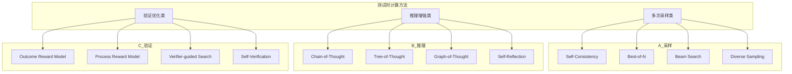
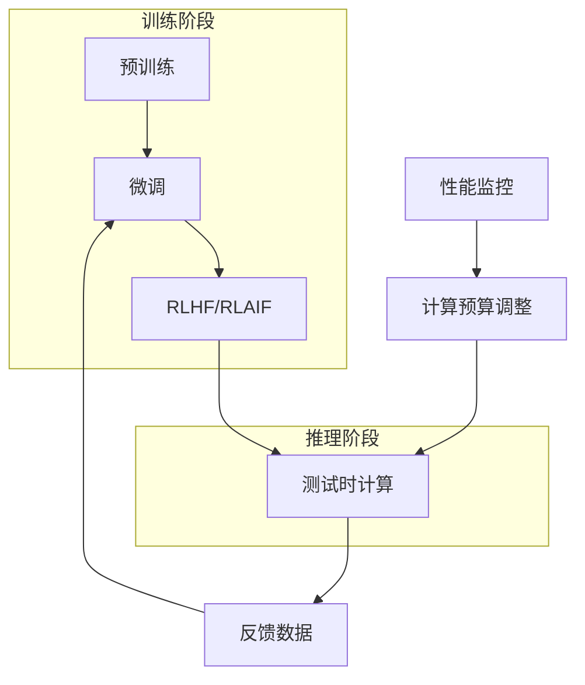

# 测试时计算 (Test-Time Compute 2026)

> **一句话理解**: 测试时计算是用推理时间换推理质量的技术——通过在推理阶段投入更多计算资源（如多次采样、思维链推理），让小模型达到大模型的效果，实现"以时间换空间"的能力跃迁。

---

## 1. 测试时计算概述

### 1.1 核心思想

```
传统训练范式 vs 测试时计算

传统范式:
┌─────────────────────────────────────────────────────┐
│  训练阶段 (高成本)                                   │
│  ├── 大规模数据                                      │
│  ├── 大量计算资源                                    │
│  └── 模型能力固化                                    │
└─────────────────────────────────────────────────────┘
           ↓
┌─────────────────────────────────────────────────────┐
│  推理阶段 (低成本)                                   │
│  └── 单次前向传播                                    │
└─────────────────────────────────────────────────────┘

测试时计算:
┌─────────────────────────────────────────────────────┐
│  训练阶段 (常规成本)                                 │
│  ├── 标准规模数据                                    │
│  └── 学习基础能力                                    │
└─────────────────────────────────────────────────────┘
           ↓
┌─────────────────────────────────────────────────────┐
│  推理阶段 (动态成本)                                 │
│  ├── 多次采样与验证                                  │
│  ├── 思维链推理                                      │
│  ├── 自我反思与修正                                  │
│  └── 计算量 ∝ 问题难度                               │
└─────────────────────────────────────────────────────┘
```

### 1.2 为什么需要测试时计算？

| 挑战 | 传统方法局限 | 测试时计算优势 |
|-----|------------|--------------|
| **复杂推理** | 训练时无法覆盖所有推理模式 | 动态探索多种推理路径 |
| **准确率要求** | 单次推理错误率较高 | 多次验证提高可靠性 |
| **成本效益** | 大模型训练成本极高 | 小模型+推理计算更经济 |
| **适应性** | 模型能力固定 | 根据问题难度动态分配计算 |
| **可解释性** | 黑盒输出 | 提供推理过程 |

### 1.3 代表性模型

| 模型 | 公司/机构 | 核心技术 | 发布时间 |
|-----|----------|---------|---------|
| **o1** | OpenAI | Chain-of-Thought + RL | 2024.09 |
| **DeepSeek-R1** | DeepSeek | RL-based Reasoning | 2024.11 |
| **Gemini 2.0 Flash Thinking** | Google | Extended Thinking | 2024.12 |
| **Claude 3.7 Sonnet** | Anthropic | Extended Thinking | 2025.02 |

---

## 2. 核心技术方法

### 2.1 技术方法全景图



### 2.2 多次采样方法

#### Self-Consistency

```python
"""
Self-Consistency: 多数投票机制
核心思想：采样多条推理路径，选择最一致的答案
"""

import numpy as np
from typing import List, Dict, Tuple, Optional
from collections import Counter
from dataclasses import dataclass

@dataclass
class ReasoningPath:
    """推理路径"""
    path_id: int
    reasoning_steps: List[str]
    final_answer: str
    confidence: float = 1.0

class SelfConsistency:
    """Self-Consistency 采样器"""
    
    def __init__(self, 
                 model,           # LLM 模型
                 num_samples: int = 10,
                 temperature: float = 0.7):
        self.model = model
        self.num_samples = num_samples
        self.temperature = temperature
    
    def generate_reasoning_paths(self, 
                                  question: str) -> List[ReasoningPath]:
        """生成多条推理路径"""
        paths = []
        
        for i in range(self.num_samples):
            # 采样不同的推理路径
            response = self.model.generate(
                prompt=self._build_prompt(question),
                temperature=self.temperature,
                max_tokens=2000
            )
            
            # 解析推理过程和答案
            reasoning_steps, answer = self._parse_response(response)
            
            paths.append(ReasoningPath(
                path_id=i,
                reasoning_steps=reasoning_steps,
                final_answer=answer
            ))
        
        return paths
    
    def aggregate_answers(self, 
                          paths: List[ReasoningPath]) -> Tuple[str, Dict]:
        """聚合答案 - 多数投票"""
        answers = [path.final_answer for path in paths]
        
        # 统计答案频率
        answer_counts = Counter(answers)
        
        # 选择最常见答案
        most_common = answer_counts.most_common(1)[0]
        
        # 计算一致性分数
        consistency_score = most_common[1] / len(answers)
        
        return most_common[0], {
            "vote_count": most_common[1],
            "total_samples": len(answers),
            "consistency_score": consistency_score,
            "all_answers": dict(answer_counts)
        }
    
    def solve(self, question: str) -> Dict:
        """完整求解流程"""
        # 1. 生成多条推理路径
        paths = self.generate_reasoning_paths(question)
        
        # 2. 聚合答案
        final_answer, stats = self.aggregate_answers(paths)
        
        return {
            "question": question,
            "final_answer": final_answer,
            "consistency_score": stats["consistency_score"],
            "reasoning_paths": [
                {
                    "steps": path.reasoning_steps,
                    "answer": path.final_answer
                }
                for path in paths
            ],
            "statistics": stats
        }
    
    def _build_prompt(self, question: str) -> str:
        """构建提示词"""
        return f"""请仔细思考这个问题，给出详细的推理过程和最终答案。

问题：{question}

请按以下格式回答：
推理过程：
<逐步分析>

最终答案：
<你的答案>
"""
    
    def _parse_response(self, response: str) -> Tuple[List[str], str]:
        """解析响应"""
        # 提取推理步骤
        steps = []
        if "推理过程：" in response:
            reasoning_part = response.split("最终答案：")[0]
            steps = [
                s.strip() 
                for s in reasoning_part.split("\n") 
                if s.strip() and not s.strip().startswith("推理过程")
            ]
        
        # 提取最终答案
        answer = ""
        if "最终答案：" in response:
            answer = response.split("最终答案：")[-1].strip()
        
        return steps, answer


class WeightedSelfConsistency(SelfConsistency):
    """加权 Self-Consistency"""
    
    def aggregate_answers(self, 
                          paths: List[ReasoningPath]) -> Tuple[str, Dict]:
        """加权聚合答案"""
        # 根据推理长度和置信度加权
        weighted_answers = {}
        
        for path in paths:
            answer = path.final_answer
            # 权重 = 推理深度 * 置信度
            weight = len(path.reasoning_steps) * path.confidence
            
            if answer not in weighted_answers:
                weighted_answers[answer] = 0
            weighted_answers[answer] += weight
        
        # 选择最高加权得分的答案
        best_answer = max(weighted_answers, key=weighted_answers.get)
        
        return best_answer, {
            "weighted_scores": weighted_answers,
            "total_weight": sum(weighted_answers.values())
        }
```

#### Best-of-N Sampling

```python
"""
Best-of-N: 从N个样本中选择最优
核心思想：使用验证器评估并选择最佳响应
"""

from typing import Callable, List, Optional
from dataclasses import dataclass

@dataclass
class CandidateResponse:
    """候选响应"""
    response_id: int
    content: str
    score: float = 0.0
    metadata: dict = None

class BestOfN:
    """Best-of-N 采样器"""
    
    def __init__(self,
                 model,
                 verifier,        # 验证器
                 n: int = 10,
                 temperature: float = 0.8):
        self.model = model
        self.verifier = verifier
        self.n = n
        self.temperature = temperature
    
    def generate_candidates(self, prompt: str) -> List[CandidateResponse]:
        """生成N个候选响应"""
        candidates = []
        
        for i in range(self.n):
            response = self.model.generate(
                prompt=prompt,
                temperature=self.temperature
            )
            
            candidates.append(CandidateResponse(
                response_id=i,
                content=response
            ))
        
        return candidates
    
    def score_candidates(self, 
                         candidates: List[CandidateResponse],
                         prompt: str) -> List[CandidateResponse]:
        """对候选响应评分"""
        for candidate in candidates:
            candidate.score = self.verifier.score(
                prompt=prompt,
                response=candidate.content
            )
        
        return candidates
    
    def select_best(self, 
                    candidates: List[CandidateResponse]) -> CandidateResponse:
        """选择最佳响应"""
        return max(candidates, key=lambda c: c.score)
    
    def generate(self, prompt: str) -> Dict:
        """完整生成流程"""
        # 1. 生成候选
        candidates = self.generate_candidates(prompt)
        
        # 2. 评分
        scored_candidates = self.score_candidates(candidates, prompt)
        
        # 3. 选择最佳
        best = self.select_best(scored_candidates)
        
        return {
            "best_response": best.content,
            "best_score": best.score,
            "num_candidates": self.n,
            "score_distribution": [c.score for c in scored_candidates]
        }


class Verifier:
    """响应验证器基类"""
    
    def score(self, prompt: str, response: str) -> float:
        """评估响应质量"""
        raise NotImplementedError


class OutcomeRewardModel(Verifier):
    """结果奖励模型 (ORM)"""
    
    def __init__(self, orm_model):
        self.orm_model = orm_model
    
    def score(self, prompt: str, response: str) -> float:
        """评估最终结果质量"""
        return self.orm_model.predict(
            input_text=prompt,
            output_text=response
        )


class ProcessRewardModel(Verifier):
    """过程奖励模型 (PRM)"""
    
    def __init__(self, prm_model):
        self.prm_model = prm_model
    
    def score(self, prompt: str, response: str) -> float:
        """评估推理过程质量"""
        # 分解响应为推理步骤
        steps = self._extract_steps(response)
        
        # 评估每一步
        step_scores = []
        for i, step in enumerate(steps):
            score = self.prm_model.score_step(
                prompt=prompt,
                previous_steps=steps[:i],
                current_step=step
            )
            step_scores.append(score)
        
        # 聚合分数
        return sum(step_scores) / len(step_scores) if step_scores else 0.0
    
    def _extract_steps(self, response: str) -> List[str]:
        """提取推理步骤"""
        # 按段落或编号分解
        steps = []
        lines = response.split("\n")
        current_step = ""
        
        for line in lines:
            line = line.strip()
            if line and (line[0].isdigit() or line.startswith("Step")):
                if current_step:
                    steps.append(current_step)
                current_step = line
            elif line:
                current_step += " " + line
        
        if current_step:
            steps.append(current_step)
        
        return steps
```

### 2.3 思维链推理增强

#### Chain-of-Thought (CoT)

```python
"""
Chain-of-Thought: 思维链推理
核心思想：通过显式的中间推理步骤提升复杂任务表现
"""

from typing import List, Optional
from dataclasses import dataclass

@dataclass
class ThoughtStep:
    """思维步骤"""
    step_id: int
    thought: str
    is_key_insight: bool = False

class ChainOfThought:
    """思维链推理器"""
    
    # CoT 提示模板
    ZERO_SHOT_COT = """Let's think step by step.

请逐步分析以下问题：

{question}

思考过程：
1. 首先，理解问题的核心是什么...
2. 然后，分析相关的信息...
3. 接着，推导结论...
4. 最后，验证答案...

请按照这个框架给出详细推理。"""

    FEW_SHOT_COT = """以下是一些示例，展示如何通过思维链解决复杂问题：

示例1：
问题：小明有5个苹果，给了小红2个，又买了3个，现在有几个？
思考过程：
1. 初始数量：5个苹果
2. 给出2个：5 - 2 = 3个
3. 买入3个：3 + 3 = 6个
4. 验证：5 - 2 + 3 = 6 ✓
答案：6个苹果

示例2：
问题：...
思考过程：...
答案：...

现在请解决以下问题：
{question}"""
    
    def __init__(self, model, few_shot: bool = False):
        self.model = model
        self.few_shot = few_shot
    
    def reason(self, question: str) -> Dict:
        """执行思维链推理"""
        # 选择提示模板
        template = self.FEW_SHOT_COT if self.few_shot else self.ZERO_SHOT_COT
        prompt = template.format(question=question)
        
        # 生成推理
        response = self.model.generate(prompt)
        
        # 解析推理步骤
        steps = self._parse_steps(response)
        
        return {
            "question": question,
            "reasoning_steps": steps,
            "full_response": response,
            "num_steps": len(steps)
        }
    
    def _parse_steps(self, response: str) -> List[ThoughtStep]:
        """解析推理步骤"""
        steps = []
        lines = response.split("\n")
        
        for i, line in enumerate(lines):
            line = line.strip()
            # 识别编号步骤
            if line and any([
                line.startswith(f"{j}.") for j in range(1, 100)
            ]):
                steps.append(ThoughtStep(
                    step_id=len(steps),
                    thought=line,
                    is_key_insight=self._is_key_insight(line)
                ))
        
        return steps
    
    def _is_key_insight(self, thought: str) -> bool:
        """判断是否为关键洞察"""
        keywords = ["因此", "所以", "关键", "重要", "结论", "答案"]
        return any(kw in thought for kw in keywords)


class TreeOfThought:
    """思维树推理"""
    
    def __init__(self,
                 model,
                 branch_factor: int = 3,
                 max_depth: int = 5,
                 evaluator=None):
        self.model = model
        self.branch_factor = branch_factor
        self.max_depth = max_depth
        self.evaluator = evaluator
    
    def search(self, problem: str, method: str = "beam") -> Dict:
        """搜索最佳推理路径"""
        if method == "beam":
            return self._beam_search(problem)
        elif method == "mcts":
            return self._mcts_search(problem)
        else:
            return self._dfs_search(problem)
    
    def _beam_search(self, problem: str) -> Dict:
        """束搜索"""
        # 初始化根节点
        current_thoughts = [ThoughtNode(
            thought=f"问题：{problem}",
            depth=0,
            score=1.0
        )]
        
        best_path = []
        
        for depth in range(self.max_depth):
            next_thoughts = []
            
            for node in current_thoughts:
                # 扩展节点
                expansions = self._expand(node)
                next_thoughts.extend(expansions)
            
            # 选择 top-k
            next_thoughts.sort(key=lambda x: x.score, reverse=True)
            current_thoughts = next_thoughts[:self.branch_factor]
            
            # 检查是否找到答案
            if any(node.is_terminal for node in current_thoughts):
                best_path = [
                    node for node in current_thoughts 
                    if node.is_terminal
                ][0].get_path()
                break
        
        return {
            "problem": problem,
            "best_path": best_path,
            "depth_explored": depth + 1,
            "nodes_evaluated": len(next_thoughts) if 'next_thoughts' in dir() else 0
        }
    
    def _expand(self, node: ThoughtNode) -> List['ThoughtNode']:
        """扩展节点"""
        prompt = f"""当前思考：{node.thought}

请给出 {self.branch_factor} 种可能的下一步思考方向：
1. ...
2. ...
3. ...
"""
        response = self.model.generate(prompt)
        thoughts = self._parse_thoughts(response)
        
        return [
            ThoughtNode(
                thought=thought,
                depth=node.depth + 1,
                parent=node,
                score=self._evaluate(thought, node)
            )
            for thought in thoughts[:self.branch_factor]
        ]
    
    def _evaluate(self, thought: str, context: ThoughtNode) -> float:
        """评估思考质量"""
        if self.evaluator:
            return self.evaluator.evaluate(thought, context)
        # 默认简单评估
        return 0.5


@dataclass
class ThoughtNode:
    """思维节点"""
    thought: str
    depth: int
    parent: Optional['ThoughtNode'] = None
    children: List['ThoughtNode'] = None
    score: float = 0.0
    is_terminal: bool = False
    
    def get_path(self) -> List[str]:
        """获取从根到当前节点的路径"""
        path = []
        node = self
        while node:
            path.append(node.thought)
            node = node.parent
        return list(reversed(path))
```

### 2.4 自我反思与修正

```python
"""
Self-Reflection & Self-Correction
核心思想：让模型反思自己的输出并进行修正
"""

from typing import List, Optional
from dataclasses import dataclass

@dataclass
class ReflectionResult:
    """反思结果"""
    issues_found: List[str]
    suggestions: List[str]
    confidence: float
    should_revise: bool

class SelfReflection:
    """自我反思模块"""
    
    REFLECTION_PROMPT = """请仔细检查你的回答，分析是否存在以下问题：

1. 逻辑错误：推理过程是否有逻辑漏洞？
2. 计算错误：数值计算是否正确？
3. 遗漏信息：是否遗漏了重要条件？
4. 理解偏差：是否正确理解了问题？
5. 表达不清：回答是否足够清晰？

你的回答：
{response}

原始问题：
{question}

请给出你的反思分析："""
    
    def __init__(self, model):
        self.model = model
    
    def reflect(self, 
                question: str, 
                response: str) -> ReflectionResult:
        """执行反思"""
        prompt = self.REFLECTION_PROMPT.format(
            question=question,
            response=response
        )
        
        reflection = self.model.generate(prompt)
        
        return self._parse_reflection(reflection)
    
    def _parse_reflection(self, reflection: str) -> ReflectionResult:
        """解析反思结果"""
        issues = []
        suggestions = []
        
        # 提取问题
        if "逻辑错误" in reflection:
            issues.append("逻辑错误")
        if "计算错误" in reflection:
            issues.append("计算错误")
        if "遗漏" in reflection:
            issues.append("遗漏信息")
        
        # 判断是否需要修正
        should_revise = len(issues) > 0
        
        # 计算置信度
        confidence = 1.0 - (len(issues) * 0.2)
        
        return ReflectionResult(
            issues_found=issues,
            suggestions=suggestions,
            confidence=max(0.1, confidence),
            should_revise=should_revise
        )


class SelfCorrection:
    """自我修正模块"""
    
    CORRECTION_PROMPT = """基于反思分析，请修正你的回答。

原始问题：
{question}

原始回答：
{response}

反思分析：
{reflection}

请给出修正后的回答："""
    
    def __init__(self, model, max_iterations: int = 3):
        self.model = model
        self.max_iterations = max_iterations
        self.reflection = SelfReflection(model)
    
    def correct(self, 
                question: str, 
                initial_response: str) -> Dict:
        """迭代修正"""
        current_response = initial_response
        iterations = []
        
        for i in range(self.max_iterations):
            # 反思
            reflection_result = self.reflection.reflect(
                question, current_response
            )
            
            iterations.append({
                "iteration": i + 1,
                "response": current_response,
                "reflection": reflection_result
            })
            
            # 如果不需要修正，停止
            if not reflection_result.should_revise:
                break
            
            # 修正
            correction_prompt = self.CORRECTION_PROMPT.format(
                question=question,
                response=current_response,
                reflection=str(reflection_result.issues_found)
            )
            
            current_response = self.model.generate(correction_prompt)
        
        return {
            "initial_response": initial_response,
            "final_response": current_response,
            "iterations": iterations,
            "total_corrections": len(iterations) - 1
        }


class IterativeReasoner:
    """迭代推理器"""
    
    def __init__(self, 
                 model,
                 max_iterations: int = 5,
                 convergence_threshold: float = 0.9):
        self.model = model
        self.max_iterations = max_iterations
        self.convergence_threshold = convergence_threshold
        self.cot = ChainOfThought(model)
        self.correction = SelfCorrection(model)
    
    def solve(self, question: str) -> Dict:
        """迭代求解"""
        # 1. 初始 CoT 推理
        initial_result = self.cot.reason(question)
        current_answer = initial_result["full_response"]
        
        # 2. 迭代修正
        for i in range(self.max_iterations):
            # 反思与修正
            correction_result = self.correction.correct(
                question, current_answer
            )
            
            new_answer = correction_result["final_response"]
            
            # 检查收敛
            if self._check_convergence(current_answer, new_answer):
                break
            
            current_answer = new_answer
        
        return {
            "question": question,
            "final_answer": current_answer,
            "iterations_used": i + 1,
            "reasoning_steps": initial_result["reasoning_steps"]
        }
    
    def _check_convergence(self, old: str, new: str) -> bool:
        """检查是否收敛"""
        # 简单的文本相似度检查
        from difflib import SequenceMatcher
        similarity = SequenceMatcher(None, old, new).ratio()
        return similarity > self.convergence_threshold
```

---

## 3. 计算预算与性能权衡

### 3.1 计算-性能曲线

```python
"""
计算预算与性能权衡分析
"""

from dataclasses import dataclass
from typing import Dict, List, Tuple
import numpy as np

@dataclass
class ComputeBudget:
    """计算预算"""
    num_samples: int          # 采样次数
    max_tokens: int           # 最大 Token 数
    reasoning_steps: int      # 推理步数
    verification_rounds: int  # 验证轮数
    
    def total_compute(self) -> float:
        """估算总计算量"""
        return (
            self.num_samples * 
            self.max_tokens * 
            self.reasoning_steps * 
            (1 + self.verification_rounds)
        )

@dataclass
class PerformanceMetrics:
    """性能指标"""
    accuracy: float           # 准确率
    latency_ms: float         # 延迟
    cost_per_query: float     # 单次查询成本
    compute_units: float      # 计算单元

class ComputePerformanceAnalyzer:
    """计算-性能分析器"""
    
    def __init__(self):
        self.benchmark_results: List[Tuple[ComputeBudget, PerformanceMetrics]] = []
    
    def benchmark(self,
                  model,
                  test_cases: List[str],
                  budgets: List[ComputeBudget]) -> Dict:
        """基准测试"""
        results = {}
        
        for budget in budgets:
            accuracies = []
            latencies = []
            
            for case in test_cases:
                # 使用指定预算运行
                metrics = self._run_with_budget(model, case, budget)
                accuracies.append(metrics.accuracy)
                latencies.append(metrics.latency_ms)
            
            results[budget] = PerformanceMetrics(
                accuracy=np.mean(accuracies),
                latency_ms=np.mean(latencies),
                cost_per_query=budget.total_compute() * 0.0001,  # 假设计算单价
                compute_units=budget.total_compute()
            )
        
        return results
    
    def _run_with_budget(self, 
                          model, 
                          case: str, 
                          budget: ComputeBudget) -> PerformanceMetrics:
        """使用指定预算运行"""
        # 实际实现需要调用模型
        pass
    
    def find_optimal_budget(self,
                            target_accuracy: float,
                            max_latency_ms: float) -> ComputeBudget:
        """寻找最优计算预算"""
        # 在满足约束条件下最小化计算量
        valid_budgets = [
            (budget, metrics)
            for budget, metrics in self.benchmark_results
            if metrics.accuracy >= target_accuracy 
            and metrics.latency_ms <= max_latency_ms
        ]
        
        if not valid_budgets:
            return None
        
        # 选择计算量最小的
        return min(valid_budgets, key=lambda x: x[1].compute_units)[0]
    
    def plot_compute_accuracy_curve(self):
        """绘制计算-准确率曲线"""
        import matplotlib.pyplot as plt
        
        computes = [m.compute_units for _, m in self.benchmark_results]
        accuracies = [m.accuracy for _, m in self.benchmark_results]
        
        plt.figure(figsize=(10, 6))
        plt.plot(computes, accuracies, 'bo-')
        plt.xlabel('Compute Units')
        plt.ylabel('Accuracy')
        plt.title('Compute vs Accuracy Trade-off')
        plt.grid(True)
        plt.show()
```

### 3.2 自适应计算分配

```python
"""
自适应计算分配：根据问题难度动态调整计算预算
"""

from typing import Dict, Optional
from dataclasses import dataclass

@dataclass
class DifficultyEstimate:
    """难度估计"""
    difficulty_score: float    # 0-1
    category: str              # easy, medium, hard
    recommended_budget: ComputeBudget

class AdaptiveComputeAllocator:
    """自适应计算分配器"""
    
    # 预定义的计算预算配置
    BUDGET_CONFIGS = {
        "easy": ComputeBudget(
            num_samples=1,
            max_tokens=500,
            reasoning_steps=3,
            verification_rounds=0
        ),
        "medium": ComputeBudget(
            num_samples=5,
            max_tokens=1000,
            reasoning_steps=5,
            verification_rounds=1
        ),
        "hard": ComputeBudget(
            num_samples=10,
            max_tokens=2000,
            reasoning_steps=10,
            verification_rounds=2
        ),
        "extreme": ComputeBudget(
            num_samples=20,
            max_tokens=4000,
            reasoning_steps=15,
            verification_rounds=3
        )
    }
    
    def __init__(self, model, difficulty_classifier=None):
        self.model = model
        self.difficulty_classifier = difficulty_classifier
    
    def estimate_difficulty(self, question: str) -> DifficultyEstimate:
        """估计问题难度"""
        # 使用分类器或启发式规则
        if self.difficulty_classifier:
            score = self.difficulty_classifier.predict(question)
        else:
            score = self._heuristic_difficulty(question)
        
        # 映射到难度类别
        if score < 0.3:
            category = "easy"
        elif score < 0.6:
            category = "medium"
        elif score < 0.85:
            category = "hard"
        else:
            category = "extreme"
        
        return DifficultyEstimate(
            difficulty_score=score,
            category=category,
            recommended_budget=self.BUDGET_CONFIGS[category]
        )
    
    def _heuristic_difficulty(self, question: str) -> float:
        """启发式难度评估"""
        score = 0.0
        
        # 长度因素
        if len(question) > 200:
            score += 0.2
        if len(question) > 500:
            score += 0.2
        
        # 关键词因素
        complex_keywords = [
            "证明", "推导", "分析", "比较", "优化",
            "设计", "实现", "多步骤", "综合"
        ]
        for kw in complex_keywords:
            if kw in question:
                score += 0.1
        
        # 数学/逻辑因素
        if any(c.isdigit() for c in question):
            score += 0.1
        if "如果" in question and "那么" in question:
            score += 0.1
        
        return min(1.0, score)
    
    def solve_with_adaptive_compute(self, 
                                     question: str,
                                     solver) -> Dict:
        """使用自适应计算求解"""
        # 1. 估计难度
        difficulty = self.estimate_difficulty(question)
        
        # 2. 分配计算预算
        budget = difficulty.recommended_budget
        
        # 3. 使用预算求解
        result = solver.solve(
            question=question,
            num_samples=budget.num_samples,
            max_tokens=budget.max_tokens,
            reasoning_steps=budget.reasoning_steps
        )
        
        result["compute_allocation"] = {
            "difficulty_estimate": difficulty.__dict__,
            "budget_used": budget.__dict__
        }
        
        return result
```

---

## 4. 实际应用案例

### 4.1 数学推理

```python
"""
数学推理应用示例
"""

class MathReasoner:
    """数学推理器"""
    
    MATH_COT_TEMPLATE = """请解决以下数学问题。请给出详细的推理过程。

问题：{problem}

解题步骤：
1. 理解问题：识别已知条件和求解目标
2. 分析思路：确定解题方法和策略
3. 执行计算：逐步计算
4. 验证答案：检查结果是否合理
5. 给出答案：最终结果

请开始解题："""
    
    def __init__(self, model):
        self.model = model
        self.self_consistency = SelfConsistency(model, num_samples=8)
    
    def solve(self, problem: str, method: str = "self_consistency") -> Dict:
        """解决数学问题"""
        if method == "self_consistency":
            return self._solve_with_consistency(problem)
        else:
            return self._solve_with_cot(problem)
    
    def _solve_with_consistency(self, problem: str) -> Dict:
        """使用 Self-Consistency"""
        return self.self_consistency.solve(problem)
    
    def _solve_with_cot(self, problem: str) -> Dict:
        """使用标准 CoT"""
        prompt = self.MATH_COT_TEMPLATE.format(problem=problem)
        response = self.model.generate(prompt, max_tokens=2000)
        return {
            "problem": problem,
            "solution": response,
            "method": "chain_of_thought"
        }

# 使用示例
def example_usage():
    problems = [
        "一个水池有甲乙两个进水管，单开甲管需要8小时注满，单开乙管需要12小时注满。如果同时打开两个管子，需要几小时注满？",
        "某商品原价100元，先涨价20%，再降价20%，现在的价格是多少？",
        "证明：对于任意正整数 n，n³ - n 能被 6 整除。"
    ]
    
    # reasoner = MathReasoner(model)
    # for problem in problems:
    #     result = reasoner.solve(problem, method="self_consistency")
    #     print(f"问题：{problem}")
    #     print(f"答案：{result['final_answer']}")
    #     print(f"一致性分数：{result['consistency_score']}")
```

### 4.2 代码生成

```python
"""
代码生成应用示例
"""

class CodeGenerator:
    """代码生成器（带测试时计算）"""
    
    CODE_GENERATION_TEMPLATE = """请生成满足以下需求的代码。

需求：{requirement}

请按以下步骤进行：
1. 分析需求，明确功能点
2. 设计数据结构和算法
3. 编写代码实现
4. 添加必要注释
5. 考虑边界情况

请给出代码："""
    
    def __init__(self, model, executor=None):
        self.model = model
        self.executor = executor
        self.best_of_n = BestOfN(
            model=model,
            verifier=CodeVerifier(executor),
            n=5
        )
    
    def generate(self, 
                 requirement: str, 
                 method: str = "best_of_n") -> Dict:
        """生成代码"""
        prompt = self.CODE_GENERATION_TEMPLATE.format(
            requirement=requirement
        )
        
        if method == "best_of_n":
            result = self.best_of_n.generate(prompt)
            return {
                "requirement": requirement,
                "code": result["best_response"],
                "score": result["best_score"],
                "method": method
            }
        else:
            code = self.model.generate(prompt)
            return {
                "requirement": requirement,
                "code": code,
                "method": method
            }


class CodeVerifier(Verifier):
    """代码验证器"""
    
    def __init__(self, executor):
        self.executor = executor
    
    def score(self, prompt: str, response: str) -> float:
        """验证代码质量"""
        score = 0.0
        
        # 1. 语法检查
        if self._check_syntax(response):
            score += 0.3
        
        # 2. 执行测试
        if self.executor:
            test_result = self.executor.run_tests(response)
            score += 0.4 * test_result["pass_rate"]
        
        # 3. 代码质量
        quality_score = self._assess_quality(response)
        score += 0.3 * quality_score
        
        return score
    
    def _check_syntax(self, code: str) -> bool:
        """检查语法"""
        try:
            compile(code, '<string>', 'exec')
            return True
        except SyntaxError:
            return False
    
    def _assess_quality(self, code: str) -> float:
        """评估代码质量"""
        score = 0.5
        
        # 有注释加分
        if "#" in code or '"""' in code:
            score += 0.1
        
        # 有文档字符串加分
        if 'def ' in code and '"""' in code:
            score += 0.1
        
        # 有错误处理加分
        if "try:" in code or "except" in code:
            score += 0.1
        
        # 有类型注解加分
        if "->" in code or ": " in code.split("def")[1].split("(")[0] if "def" in code else False:
            score += 0.1
        
        return min(1.0, score)
```

---

## 5. 最佳实践与调优

### 5.1 技术选择指南

| 场景 | 推荐技术 | 配置建议 |
|-----|---------|---------|
| **简单问答** | 单次推理 | 低温度，无需采样 |
| **数学问题** | Self-Consistency | N=8-16，温度0.7 |
| **代码生成** | Best-of-N | N=5-10，配合执行验证 |
| **复杂推理** | Tree-of-Thought | 分支因子3，深度5 |
| **高风险决策** | Self-Correction | 多轮反思验证 |

### 5.2 性能优化技巧

```python
"""
性能优化技巧
"""

class OptimizedTestTimeCompute:
    """优化的测试时计算"""
    
    def __init__(self, model):
        self.model = model
        
        # 缓存机制
        self.response_cache = {}
        
        # 并行配置
        self.max_parallel = 8
    
    def parallel_sampling(self, prompt: str, n: int) -> List[str]:
        """并行采样"""
        import asyncio
        
        async def sample_one():
            return self.model.generate(prompt)
        
        async def sample_all():
            tasks = [sample_one() for _ in range(n)]
            return await asyncio.gather(*tasks)
        
        return asyncio.run(sample_all())
    
    def early_stopping_sampling(self, 
                                 prompt: str, 
                                 n: int,
                                 verifier: Verifier,
                                 threshold: float = 0.9) -> str:
        """早停采样"""
        for batch in range(0, n, self.max_parallel):
            batch_size = min(self.max_parallel, n - batch)
            responses = self.parallel_sampling(prompt, batch_size)
            
            for response in responses:
                score = verifier.score(prompt, response)
                if score >= threshold:
                    return response  # 找到足够好的响应
        
        # 如果都没达到阈值，返回最佳
        return max(responses, key=lambda r: verifier.score(prompt, r))
    
    def cached_sampling(self, 
                        prompt: str, 
                        cache_key: str = None) -> str:
        """缓存采样"""
        key = cache_key or hash(prompt)
        
        if key in self.response_cache:
            return self.response_cache[key]
        
        response = self.model.generate(prompt)
        self.response_cache[key] = response
        return response
```

### 5.3 常见问题排查

| 问题 | 可能原因 | 解决方案 |
|-----|---------|---------|
| **采样多样性不足** | 温度过低 | 提高温度到0.7-1.0 |
| **多数投票无效果** | 问题无标准答案 | 改用 Best-of-N + 验证器 |
| **推理步数过多** | 未限制长度 | 设置 max_tokens 和步数上限 |
| **成本过高** | 计算量过大 | 使用自适应计算分配 |
| **延迟过长** | 串行执行 | 改用并行采样 |

---

## 6. 发展趋势与展望

### 6.1 技术演进方向

```
测试时计算发展趋势

2024-2025: 基础技术成熟
├── Self-Consistency 标准化
├── CoT 推理链优化
└── 验证器训练方法

2025-2026: 效率提升
├── 自适应计算分配
├── 早停机制
├── 并行化优化
└── 缓存与复用

2026+: 智能化演进
├── 元推理 (Meta-Reasoning)
├── 计算预算预测
├── 多模型协作推理
└── 持续学习验证器
```

### 6.2 与训练时计算的融合



---

## 7. FAQ

### Q1: 测试时计算与模型大小的权衡？

**A**: 经验法则：
- 小模型 + 测试时计算：成本可降低 5-10x，延迟增加 3-5x
- 推荐方案：对于复杂任务，使用中等模型（如 70B）+ 测试时计算
- 计算公式：`Total Cost = Model_Size × (1 + Compute_Multiplier)`

### Q2: 如何选择合适的采样次数 N？

**A**: 基于 Self-Consistency 研究：
- N=5-8：适合中等难度问题，性价比最优
- N=10-16：适合高准确率要求场景
- N=32+：边际收益递减，仅用于极高准确率需求

### Q3: 测试时计算是否适用于所有任务？

**A**: 适用性分析：
- ✅ 适用：数学推理、代码生成、复杂决策、高风险场景
- ⚠️ 谨慎：开放创意写作（多样性优先）
- ❌ 不适用：实时交互、简单分类、大规模批量处理

---

*文档版本: 1.0.0* 
*最后更新: 2026-04-13*

## Related

- [[_synthesis/modern-ai-training-stack|现代 AI 训练栈]] — Test-Time Compute 在训练全栈中的定位
