# Scaling Laws and Training Dynamics (LLM 缩放法则与训练动态)

> **一句话理解**: Scaling Laws 是训练大模型的「菜谱公式」——告诉你给定多少钱（compute），该买多少菜（data）配多大的锅（model parameters），才能做出最好吃的菜（lowest loss）。

---

## Table of Contents

- [Introduction: Why Scaling Laws Matter](#introduction-why-scaling-laws-matter)
- [1. Kaplan Scaling Laws (2020)](#1-kaplan-scaling-laws-2020)
- [2. Chinchilla Scaling Laws (2022)](#2-chinchilla-scaling-laws-2022)
- [3. Emergent Abilities](#3-emergent-abilities)
- [4. Data Scaling: Quality vs Quantity](#4-data-scaling-quality-vs-quantity)
- [5. Loss Prediction and Training Dynamics](#5-loss-prediction-and-training-dynamics)
- [6. Downstream Task Scaling](#6-downstream-task-scaling)
- [7. Inference-Time Scaling](#7-inference-time-scaling)
- [8. Practical Scaling Decisions](#8-practical-scaling-decisions)
- [9. Scaling Laws Master Comparison Table](#9-scaling-laws-master-comparison-table)
- [10. Frontiers (前沿)](#10-frontiers-前沿)
- [References](#_references)

---

## Introduction: Why Scaling Laws Matter

### The Billion-Dollar Question

训练一个前沿 LLM 在 2026 年需要 **数亿美元** 的 compute budget。在花费这些资源之前，你需要回答：

1. **模型该多大？** — 参数量 $N$ 决定了 memory 需求和推理成本
2. **数据该多少？** — token 数量 $D$ 决定了训练时长和数据工程投入
3. **算力怎么分配？** — FLOPs 预算 $C$ 决定了用多少 GPU 训练多久

**Scaling Laws** 正是回答这些问题的数学工具。它们揭示了模型性能（通常用 cross-entropy loss 衡量）与 $N$、$D$、$C$ 之间的幂律关系。

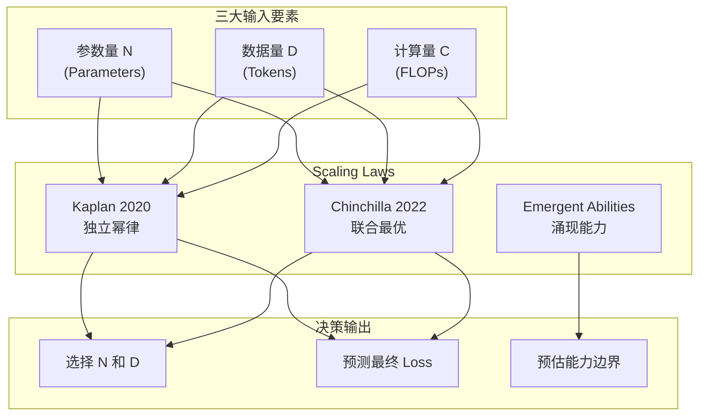

> **关键洞察**: Scaling Laws 不是简单的「越大越好」。它们的核心价值在于帮助工程师在 **有限预算** 下做出 **最优决策**——避免「买了太大的锅却只煮了半锅汤」的资源浪费。

### Historical Timeline

| 年份 | 里程碑 | 核心贡献 |
|------|--------|---------|
| **2020** | Kaplan et al. (OpenAI) | 发现 N, D, C 独立幂律；「bigger is always better」|
| **2022** | Hoffmann et al. (DeepMind) | Chinchilla: N 和 D 应同比例缩放；大部分 LLM 是 under-trained |
| **2022** | Wei et al. (Google) | 系统化 Emergent Abilities 分类 |
| **2023** | Schaeffer et al. | 质疑涌现能力是否为测量 artifact |
| **2024** | DCLM (AI2) | 系统化研究 data quality vs quantity |
| **2024** | MuP (Microsoft) | Maximal Update Parameterization 解决超参迁移 |
| **2025** | OpenAI o1 / DeepSeek R1 | Inference-time scaling 成为新范式 |
| **2026** | MoE + Agent Scaling | 稀疏模型与 Agent 的缩放法则 |

---

## 1. Kaplan Scaling Laws (2020)

### 1.1 核心发现：Three Independent Power Laws

Kaplan et al. (2020) 在 **"Scaling Laws for Neural Language Models"** 中首次系统揭示了 LLM 训练中的幂律关系。他们训练了数百个不同规模的模型，发现 loss 与三个因素分别遵循独立的幂律：

$$L(N) = \left(\frac{N_c}{N}\right)^{\alpha_N} \approx \left(\frac{8.8 \times 10^{13}}{N}\right)^{0.076}$$

$$L(D) = \left(\frac{D_c}{D}\right)^{\alpha_D} \approx \left(\frac{5.4 \times 10^{13}}{D}\right)^{0.095}$$

$$L(C) = \left(\frac{C_c}{C}\right)^{\alpha_C} \approx \left(\frac{3.1 \times 10^{8}}{C}\right)^{0.050}$$

其中：
- $L$ = cross-entropy loss (nats)
- $N$ = 非 embedding 参数数量
- $D$ = 训练 token 数量
- $C$ = 训练 FLOPs
- $N_c, D_c, C_c$ = 临界常数
- $\alpha_N, \alpha_D, \alpha_C$ = 幂指数

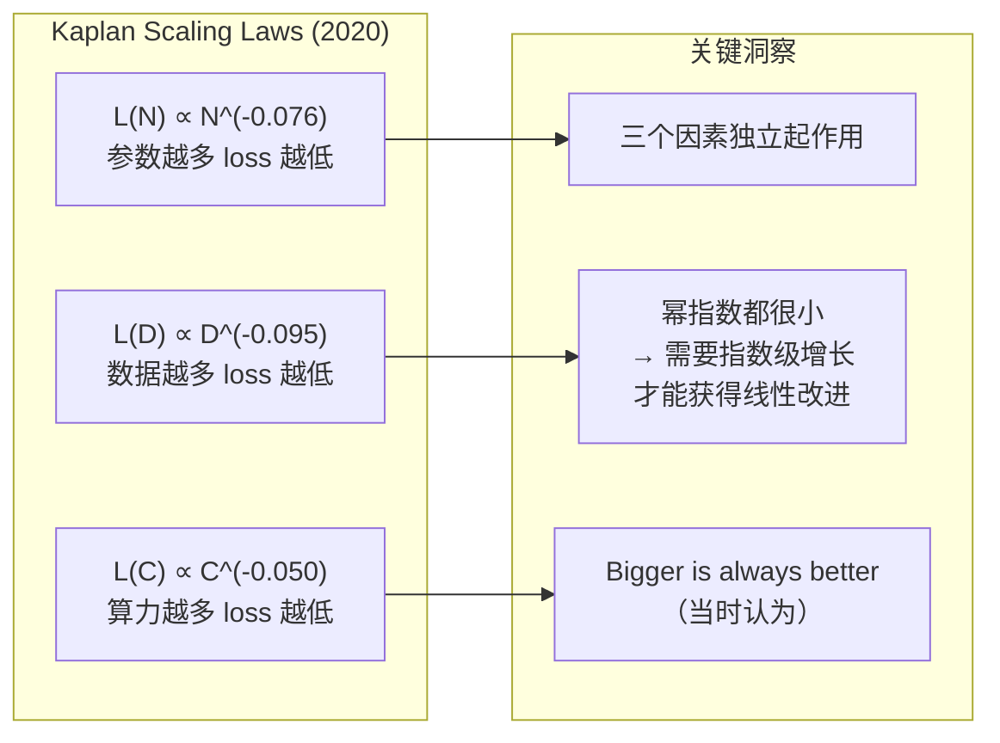

### 1.2 直觉理解

| 维度 | 幂指数 | 含义 | 现实类比 |
|------|--------|------|---------|
| **参数 N** | -0.076 | 模型容量越大，loss 越低 | 脑子越大，记东西越多 |
| **数据 D** | -0.095 | 数据越多，loss 越低（指数最大） | 读书越多，知识越丰富 |
| **算力 C** | -0.050 | 算力越多，loss 越低 | 练习时间越长，越熟练 |

> **注意**: 幂指数都很小（< 0.1），意味着需要 **指数级** 地增加资源才能获得 **线性** 的 loss 改进。这是 LLM 训练成本飙升的根本原因。

### 1.3 独立性的含义

Kaplan 的关键主张是：**三个因素独立起作用**。即：

- 不管模型大小如何，增加数据总是有帮助的
- 不管数据多少，增大模型总是有帮助的
- 三者可以独立预测，互不影响

这意味着在 Kaplan 的框架下，最佳策略是 **同时放大三者**——这直接影响了 **GPT-3 的设计哲学**：175B 参数 + 仅 300B tokens（大量参数、相对少的数据）。

### 1.4 对 GPT-3 设计的影响

GPT-3 (175B) 的设计决策直接受到 Kaplan Scaling Laws 的影响：

```python
# GPT-3 的设计逻辑（Kaplan 框架下）
# 给定 compute budget C ≈ 3.6e23 FLOPs

# Kaplan 的建议: 优先把预算花在增大 N 上
# 因为 L(N) 和 L(D) 是独立的
# → 只要 N 足够大，D 可以相对少

N_gpt3 = 175e9       # 175B 参数
D_gpt3 = 300e9       # 300B tokens（远少于 Chinchilla 建议）
C_gpt3 = 6 * N_gpt3 * D_gpt3  # ≈ 3.15e23 FLOPs

# Kaplan 预测: 这种配置接近最优
# Chinchilla 后来证明: 这是严重 under-trained 的！
```

### 1.5 Kaplan Laws 的局限性

| 局限性 | 描述 | Chinchilla 的修正 |
|--------|------|-----------------|
| **忽略 N-D 交互** | 假设 N 和 D 独立最优 | 证明 N 和 D 应同比例增长 |
| **过度参数化偏好** | 推荐大 N + 小 D | 实际是 under-trained |
| **未考虑数据质量** | 假设所有 token 等价 | 数据质量至关重要 |
| **未预测涌现能力** | 平滑幂律无法预测突变 | Emergent Abilities 是突变 |
| **外推风险** | 小模型规律未必适用于大模型 | 需要更大规模验证 |

---

## 2. Chinchilla Scaling Laws (2022)

### 2.1 核心修正：Compute-Optimal Training

Hoffmann et al. (2022) 在 **"Training Compute-Optimal Large Language Models"** 中推翻了 Kaplan 的核心假设。他们发现：

> **对于给定的 compute budget $C$，最优的 $N$ 和 $D$ 应该同比例增长。**

$$N_{opt} \propto C^{0.50}$$

$$D_{opt} \propto C^{0.50}$$

这意味着：**$N_{opt}$ 和 $D_{opt}$ 的关系是近似线性的**——参数量翻倍时，数据量也应该翻倍。

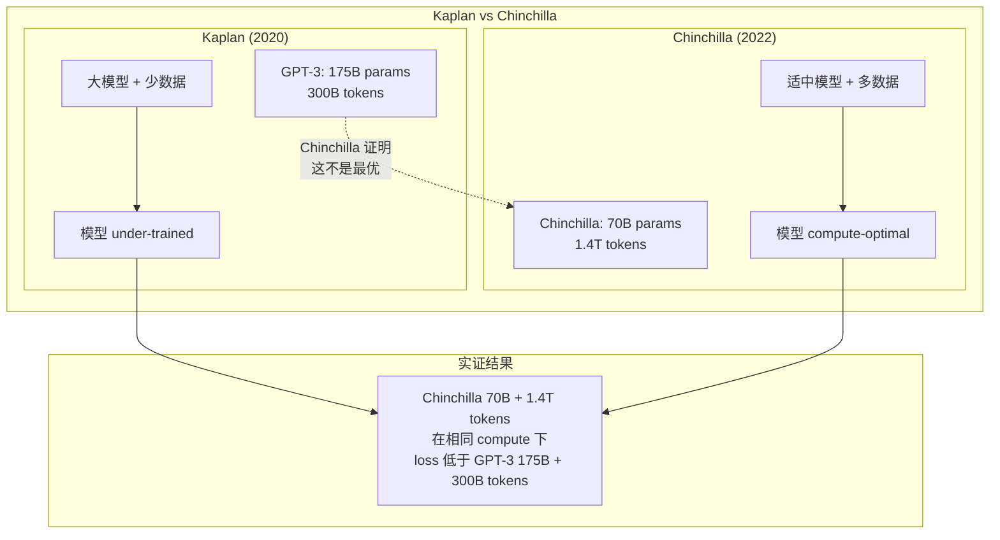

### 2.2 Chinchilla 的三种验证方法

论文使用了三种独立方法来验证 compute-optimal 关系：

**方法 1: IsoFLOP Analysis**
- 固定 $C$，变化 $N$ 和 $D$ 的组合
- 找到每个 $C$ 下 loss 最低的 $(N, D)$ 对
- 结果：$N_{opt} \propto C^{0.49}$, $D_{opt} \propto C^{0.51}$

**方法 2: Parametric Fit**
- 拟合统一的参数化 loss 函数
- $L(N, D) = \frac{A}{N^\alpha} + \frac{B}{D^\beta} + E$
- 参数：$A = 406.4$, $B = 410.7$, $E = 1.69$, $\alpha = 0.34$, $\beta = 0.28$

$$L(N, D) = \frac{406.4}{N^{0.34}} + \frac{410.7}{D^{0.28}} + 1.69$$

**方法 3: Critical Data Points**
- 对每个 $N$，找到 loss 曲线开始 flatten 的 data 量
- 该点即为给定 $N$ 下的最优 $D$

### 2.3 Chinchilla 公式的实用计算

给定 compute budget $C$（FLOPs），可以计算最优的 $N$ 和 $D$：

```python
import math

def chinchilla_optimal(C_flops):
    """
    给定 compute budget C (FLOPs), 计算最优 N 和 D.
    
    基于 Chinchilla 论文的 parametric fit:
    L(N, D) = A/N^alpha + B/D^beta + E
    
    C ≈ 6 * N * D (每个 token 的前向 + 反向 ≈ 6N FLOPs)
    """
    A, B = 406.4, 410.7
    alpha, beta = 0.34, 0.28
    E = 1.69
    
    # 最优比例: N/D 由 A*alpha / (B*beta) 决定
    # N_opt / D_opt ≈ (A*alpha / (B*beta))^(1/(alpha+beta))
    ratio = (A * alpha / (B * beta)) ** (1 / (alpha + beta))
    
    # C = 6 * N * D, N = ratio * D
    # C = 6 * ratio * D^2
    D_opt = math.sqrt(C_flops / (6 * ratio))
    N_opt = ratio * D_opt
    
    # 预测最终 loss
    L_opt = A / (N_opt ** alpha) + B / (D_opt ** beta) + E
    
    return {
        "N_opt": N_opt,
        "D_opt": D_opt,
        "predicted_loss": L_opt,
        "N_D_ratio": ratio
    }

# 示例: 给定 1e24 FLOPs (约 GPT-3 级别)
result = chinchilla_optimal(1e24)
print(f"Optimal N: {result['N_opt']:.2e}")    # ~6.5e10 (65B)
print(f"Optimal D: {result['D_opt']:.2e}")    # ~1.3e12 (1.3T)
print(f"Predicted Loss: {result['predicted_loss']:.3f}")

# 对比 GPT-3 的实际配置:
# GPT-3: N=175B, D=300B → 严重偏离最优
# Chinchilla: N=70B, D=1.4T → 接近最优
```

### 2.4 实战对比：Kaplan vs Chinchilla

| 模型 | 参数量 $N$ | 数据量 $D$ | $D/N$ 比 | Compute $C$ | 是否 compute-optimal |
|------|-----------|-----------|---------|------------|---------------------|
| **GPT-3** (2020) | 175B | 300B | 1.7 | ~3.15e23 | ❌ 严重 under-trained |
| **Chinchilla** (2022) | 70B | 1,400B | 20.0 | ~5.88e23 | ✅ compute-optimal |
| **PaLM** (2022) | 540B | 780B | 1.4 | ~2.52e24 | ❌ under-trained |
| **LLaMA-2 70B** (2023) | 70B | 2,000B | 28.6 | ~8.40e23 | ✅ 遵循 Chinchilla |
| **LLaMA-3 405B** (2024) | 405B | 15,000B | 37.0 | ~3.64e25 | ✅ 超越 Chinchilla |

> **关键趋势**: 从 LLaMA-2 开始，模型普遍选择 **比 Chinchilla 最优更多数据**，即 $D/N > 20$。这说明 Chinchilla 的最优比例是 **下限** 而非上限——更多数据总是有益的，只要模型容量足够。

### 2.5 Chinchilla 的工程影响

Chinchilla 论文直接改变了 LLM 训练的设计范式：

1. **LLaMA 系列**: Meta 明确遵循 Chinchilla 原则，LLaMA-1 7B 用了 1T tokens（远超 Kaplan 建议）
2. **Qwen 系列**: 同样遵循 compute-optimal 策略
3. **DeepSeek**: DeepSeek-V2/V3 的 MoE 设计也参考了 scaling laws
4. **成本节省**: 相同 compute 下，compute-optimal 模型可比 under-trained 模型好 **数个百分点** 的 loss

详细案例分析见 [LLaMA Deep Dive](20_Papers_and_Research/Architecture/LLaMA_Deep_Dive.md)。

---

## 3. Emergent Abilities

### 3.1 什么是 Emergent Abilities？

**Emergent Abilities（涌现能力）** 指模型在达到某个规模阈值后，**突然**展现出的新能力——这些能力在小模型上几乎不存在，但在大模型上突然出现。

Wei et al. (2022) 在 **"Emergent Abilities of Large Language Models"** 中系统化分类了这些现象：

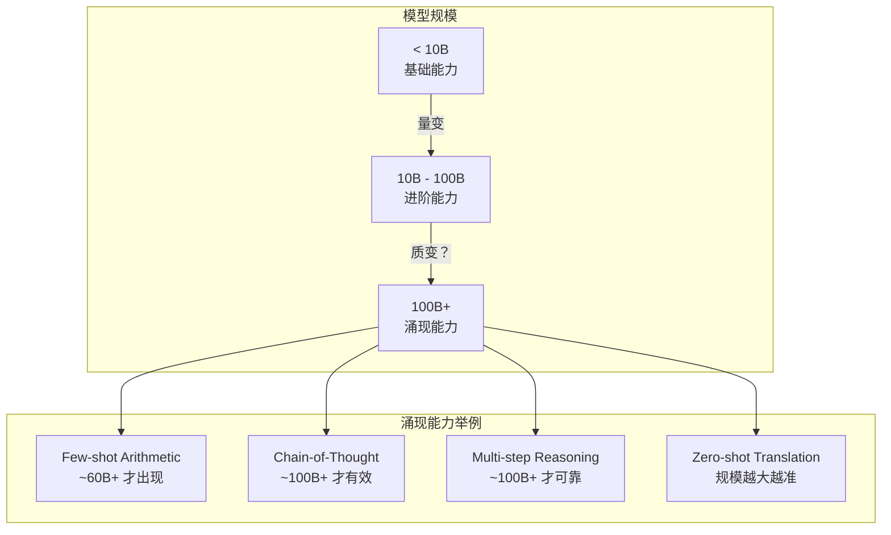

### 3.2 Wei et al. (2022) 分类体系

| 能力类别 | 出现阈值 | 代表任务 | 是否可预测 |
|---------|---------|---------|-----------|
| **Arithmetic (few-shot)** | ~60B params | GSM8K, multi-digit | 不可预测（突变） |
| **Chain-of-Thought** | ~100B params | Commonsense QA, math | 不可预测 |
| **Multi-step Reasoning** | ~100B+ | MMLU, HellaSwag | 部分可预测 |
| **Translation (zero-shot)** | 连续提升 | WMT benchmarks | 可预测（平滑） |
| **Question Answering** | ~10B+ | Natural Questions | 部分可预测 |
| **Instruction Following** | ~10B+ | FLAN tasks | 可预测 |

### 3.3 涌现能力的真实案例

**案例 1: Few-shot Arithmetic**
```
小模型 (10B):  "What is 234 + 567?" → 各种错误答案
中模型 (60B):  开始答对简单算术
大模型 (175B): 能处理多位数加减乘除

性能变化: 
10B → ~5% 正确率
60B → ~40% 正确率  ← 突变！
175B → ~80% 正确率
```

**案例 2: Chain-of-Thought Reasoning**
- 小模型（< 100B）: CoT prompting 不改善甚至恶化性能
- 大模型（100B+）: CoT 显著改善推理任务
- 这个 **能力跳变** 在 ~100B 处发生，且无法从小模型外推预测

### 3.4 争论：Real vs Measurement Artifact

Schaeffer et al. (2023) 在 **"Emergent Abilities of Large Language Models are Mirages"** 中提出了尖锐质疑：

| 观点 | 支持涌现是真实的 | 支持涌现是 artifact |
|------|----------------|-------------------|
| **证据** | 多个 benchmark 重复观察到 | 改变 metric 后突变消失 |
| **解释** | 非线性组合导致质变 | 非线性 metric（如 exact match）造成假象 |
| **类比** | 水到 100°C 沸腾是真实的涌现 | 温度计精度不够导致的突变假象 |
| **数学** | 组合能力有阈值效应 | 用连续 metric（如 token edit distance）替代后，曲线变平滑 |

**核心论点 (Schaeffer)**:
- 使用 **exact match accuracy** 时看到突变
- 使用 **per-token log-probability** 或 **edit distance** 时，曲线是平滑的
- 结论：涌现是 **measurement artifact**，不是模型能力的真实跳变

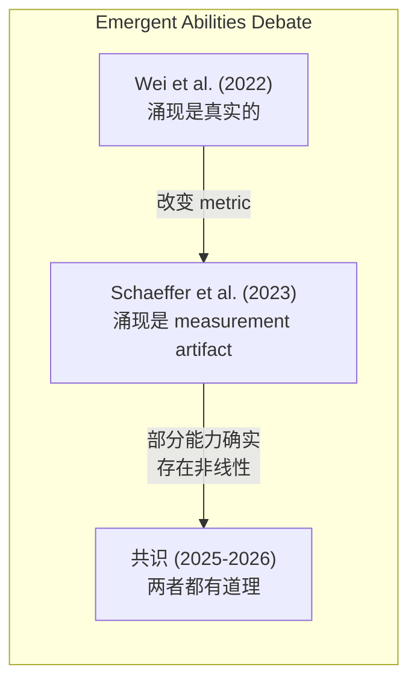

### 3.5 2026 年的共识

当前学界对 emergent abilities 的理解：

1. **部分涌现是真实的**: 某些能力确实存在非线性跳变（如特定算法的执行）
2. **部分是 metric artifact**: 使用非线性 metric（exact match）会放大跳变
3. **实践意义**: 即使部分是 artifact，大模型 **确实** 能做到小模型做不到的事
4. **预测困难**: 无法可靠预测新能力的出现阈值

> **工程启示**: 不要因为 scaling laws 显示平滑幂律就认为「没有惊喜」。某些任务需要达到特定规模才能解锁，这也是为什么持续 scaling 仍然有价值。

---

## 4. Data Scaling: Quality vs Quantity

### 4.1 数据缩放的核心挑战

在 Chinchilla 之后，业界认识到 **数据量** 是与参数量同等重要的缩放维度。但数据的 scaling 远比参数量复杂：

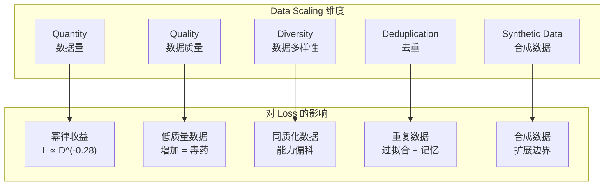

### 4.2 Diminishing Returns of Data

| 数据量范围 | Loss 下降 | 边际收益 | 说明 |
|-----------|---------|---------|------|
| **0 → 100B tokens** | 大 | 高 | 模型快速学习语言基础 |
| **100B → 1T tokens** | 中等 | 中 | 继续改善但速度放缓 |
| **1T → 10T tokens** | 小 | 低 | 需要极高数据质量 |
| **10T+ tokens** | 极小 | 极低 | 接近自然文本的 entropy 下限 |

> **现实约束**: 高质量英文文本约 **10-15T tokens**（Common Crawl 去重后），全球所有语言加起来约 **30-50T tokens**。数据正在成为一种 **有限资源**。

### 4.3 Data Deduplication Impact

Lee et al. (2022) 系统研究了去重对 LLM 训练的影响：

| 去重方法 | 数据减少 | Loss 影响 | 推荐度 |
|---------|---------|---------|--------|
| **Exact dedup** | ~10-20% | Loss 改善 ~0.01 | ✅ 必做 |
| **Near-dedup (MinHash)** | ~20-40% | Loss 改善 ~0.02-0.05 | ✅ 强烈推荐 |
| **Aggressive dedup** | ~50%+ | Loss 恶化 | ❌ 过度去重 |
| **No dedup** | 0% | 模型记忆重复内容 | ❌ 风险大 |

**关键发现**:
- 适度的 near-dedup 总是有益的
- 重复数据导致模型 **记忆** 而非 **泛化**
- 过度去重可能删除有用的多样信息

### 4.4 Synthetic Data as Scaling Strategy

当自然数据接近耗尽时，**合成数据（Synthetic Data）** 成为新的 scaling 策略：

```python
# 合成数据三大策略:
# 1. Self-Instruct: LLM 生成指令+回复 (Phi 系列用 GPT-3.5 生成教科书级数据)
# 2. Rejection Sampling: 生成多个回答, 只保留正确的 (DeepSeek R1 math data)
# 3. Data Augmentation: 改写/翻译/总结 (Back-translation, paraphrasing)
#
# 核心风险: Model collapse — 反复用合成数据训练会导致多样性退化
```

### 4.5 DCLM Study Findings (AI2, 2024)

**DCLM (DataComp-LM)** 是目前最系统化的数据质量研究：

| 数据策略 | 对 Loss 的影响 | 对下游任务的影响 |
|---------|---------------|----------------|
| **Filtering (质量过滤)** | 显著改善 | 大幅改善 |
| **Deduplication** | 轻微改善 | 中等改善 |
| **Domain mixing (领域混合)** | 影响大 | 决定性影响 |
| **Synthetic augmentation** | 中等改善 | 任务特定 |

**DCLM 的核心发现**:
1. **数据配方的重要性 > 数据量**: 精心配比的 1T tokens 胜过随机的 4T tokens
2. **Domain weights 是关键超参**: 不同领域（代码、数学、网页、书籍）的比例直接决定下游能力
3. **可复现的 data curation pipeline**: 开源了完整的 DCLM baseline

> **与 Distributed Training 的关联**: 数据 quality 和 deduplication 的 preprocessing 通常需要大量存储和 I/O，这在 [分布式训练](07_Model_Training/Distributed_Training/Distributed_Training_2026.md) 中是一个重要的工程考量。

---

## 5. Loss Prediction and Training Dynamics

### 5.1 从早期训练预测最终 Loss

训练一个 LLM 需要数周到数月。如果能在训练早期预测最终 loss，可以：
- **提前终止** 不好的实验
- **调整超参** 避免浪费
- **预估资源** 做好规划

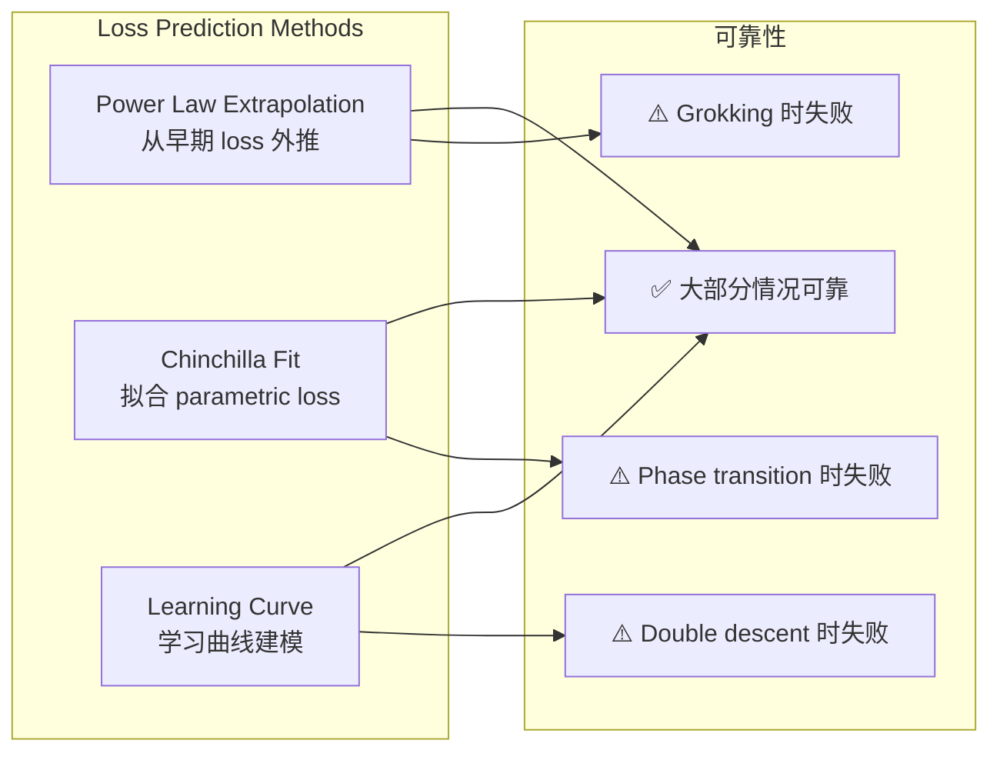

### 5.2 Power Law Extrapolation

最基本的方法：假设 loss 遵循幂律，从早期 steps 外推：

$$L(t) = L_0 \cdot t^{-\gamma} + L_\infty$$

其中 $t$ 是训练 step 数，$\gamma$ 是衰减指数，$L_\infty$ 是渐近 loss。

```python
import numpy as np
from scipy.optimize import curve_fit

def power_law_loss(t, L0, gamma, L_inf):
    """预测 loss 随 training step 的变化"""
    return L0 * (t ** (-gamma)) + L_inf

# 使用前 10% 的 training 数据拟合
steps_early = np.arange(1, 1000)        # 前 1000 steps
losses_early = get_losses(steps_early)   # 观测到的 loss

# 拟合参数
params, _ = curve_fit(
    power_law_loss, 
    steps_early, 
    losses_early,
    p0=[10.0, 0.3, 1.5]  # 初始猜测
)

# 预测最终 loss (例如 100,000 steps)
L_final_predicted = power_law_loss(100000, *params)
print(f"Predicted final loss: {L_final_predicted:.3f}")
```

### 5.3 When Predictions Fail

Scaling laws 和 loss prediction 在以下情况下会 **失败**：

#### Grokking (延迟泛化)

**Grokking** 是指模型在训练数据上已经完美（training loss ≈ 0）但 validation loss 仍然很高，经过 **极长时间** 后突然学会泛化。

| 阶段 | Training Loss | Validation Loss | 持续时间 |
|------|--------------|-----------------|---------|
| **Phase 1: Memorization** | 快速下降 → 0 | 高且不变 | ~90% 训练 |
| **Phase 2: Grokking** | 已经为 0 | 突然下降 | ~10% 训练 |
| **Phase 3: Generalization** | 0 | 低 | 稳态 |

> **启示**: 如果你的任务类似算法学习（如学习加法、排序），loss prediction 可能完全失效——模型可能在最后 5% 的训练时间内获得 50% 的性能提升。

#### Double Descent

经典 ML 认为存在 bias-variance tradeoff 的 U 形曲线。但深度学习中观察到 **double descent**：

```
Loss
  |  \
  |   \
  |    \___/  ← 第一个谷底（传统最优）
  |         \___
  |             \________  ← 第二个谷底（现代最优，更大模型）
  |
  +----------------------------> Model Size / Training Time
       ↑            ↑
    Under-     Over-parameterized
    parameterized
```

#### Phase Transitions

某些能力在特定规模突然出现，无法从平滑幂律外推：

| 能力 | 出现规模 | 可预测性 |
|------|---------|---------|
| **Basic arithmetic** | ~60B | ❌ 不可预测 |
| **CoT reasoning** | ~100B | ❌ 不可预测 |
| **Code execution** | ~30B | ⚠️ 部分可预测 |
| **Few-shot learning** | ~10B | ✅ 平滑可预测 |

### 5.4 工程实践中的 Loss Monitoring

```python
# 训练监控中的 loss prediction 实践
# 使用最近 N 个 (step, loss) 点拟合 power_law_loss, 外推预测最终 loss
# 如果 predicted_final_loss 远超预期 → 提前终止实验
# 如果 loss 出现 grokking 模式 → 延长训练而非终止
```

---

## 6. Downstream Task Scaling

### 6.1 不同任务的缩放特性

Scaling laws 对 **训练 loss** 的预测是可靠的，但对 **下游任务性能** 的预测更加复杂：

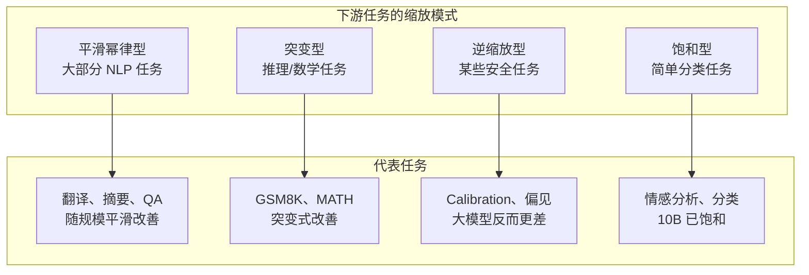

### 6.2 Scaling Exponents for Different Tasks

| 任务 | Scaling Exponent | 从 10B→100B 改善 | 从 100B→1T 改善 |
|------|-----------------|-----------------|----------------|
| **MMLU** | ~0.15 | +15-20% | +10-15% |
| **HellaSwag** | ~0.08 | +5-8% | +3-5% |
| **GSM8K (few-shot)** | ~0.30 | +30-40% | +20-30% |
| **HumanEval (code)** | ~0.20 | +20-25% | +15-20% |
| **WMT (translation)** | ~0.05 | +2-3 BLEU | +1-2 BLEU |
| **TruthfulQA** | ~-0.10 | -5-10% | -10-15% |

> **注意**: **TruthfulQA** 的负指数意味着模型越大反而越不 truthful——这是 **inverse scaling** 的一个例子。

### 6.3 Inverse Scaling: Bigger = Worse

McKenzie et al. (2023) 在 Inverse Scaling Prize 中发现了多个 **越大越差** 的任务：

| 任务 | 描述 | 原因 |
|------|------|------|
| **Quote repetition** | 重复引语时大模型更倾向续写而非重复 | 大模型过度「乐于助人」 |
| **Memo trap** | 记忆陷阱任务 | 大模型更倾向生成功能 |
| **Self-recognition** | 识别自身生成的文本 | 大模型的生成更流畅，更难区分 |
| **Winobias (某些设置)** | 特定指代消解 | 偏见随规模增加 |

**Inverse Scaling 的常见原因**:
1. **过度对齐（over-alignment）**: 大模型更倾向生成「有帮助」的回答
2. **训练分布偏移**: 大模型学到的 pattern 更强烈
3. **评估 metric 问题**: 某些 metric 对大模型的输出模式不公平

### 6.4 Few-shot vs Zero-shot Scaling

| 评估方式 | Scaling 特性 | 优势 | 劣势 |
|---------|-------------|------|------|
| **Zero-shot** | 更平滑，指数较小 | 不需要 prompt engineering | 绝对性能较低 |
| **Few-shot** | 可能出现突变，指数较大 | 绝对性能更高 | 需要好的 examples |
| **CoT (few-shot)** | 100B+ 才有效 | 推理任务大幅提升 | 小模型无效甚至有害 |
| **Fine-tuning** | 最快达到目标性能 | 小模型也能很好 | 需要标注数据 |

```python
# Few-shot scaling 经验法则:
# - 模型 < 10B:  few-shot 增益极小 (~0.02/example)
# - 模型 10-100B: few-shot 开始受益 (~0.05/example)
# - 模型 > 100B:  few-shot 显著受益 (~0.10/example)
# 因此 CoT prompting 只对 100B+ 模型有效
```

---

## 7. Inference-Time Scaling

### 7.1 新范式：Test-Time Compute Scaling

2024-2025 年最重要的 scaling 突破是 **inference-time scaling（推理时缩放）**——在推理阶段投入更多 compute 来提升性能，而非仅靠训练时 scaling。

OpenAI o1 和 DeepSeek R1 证明了这个范式的有效性：


### 7.2 Inference-Time Scaling 的主要策略

| 策略 | 描述 | Compute 开销 | 性能提升 |
|------|------|-------------|---------|
| **Best-of-N sampling** | 生成 N 个回答，选最好的 | O(N) | 中等 |
| **Beam search** | 在 token 级别搜索 | O(beam_width) | 中等 |
| **MCTS (Monte Carlo Tree Search)** | 用树搜索探索推理路径 | O(N × depth) | 高 |
| **Self-consistency** | 多数投票 | O(N) | 高 |
| **Process Reward Model** | 逐步验证推理过程 | O(steps × verifier) | 很高 |
| **Sequential revision** | 迭代修正答案 | O(iterations) | 中等 |

### 7.3 Training Compute vs Inference Compute

| 维度 | Training Compute | Inference Compute |
|------|-----------------|------------------|
| **时机** | 训练阶段 | 推理阶段 |
| **成本模型** | 一次性投入 | 按请求计费 |
| **收益衰减** | 幂律衰减 | 对数/线性衰减 |
| **典型规模** | 10^23 - 10^25 FLOPs | 10^18 - 10^22 FLOPs/query |
| **ROI** | 全局改善 | 任务特定改善 |
| **代表** | GPT-4, LLaMA-3 | o1, R1 |
| **2026 趋势** | 增速放缓 | 快速增长 |

### 7.4 Compute-Optimal Inference

类似于 Chinchilla 对训练的指导，**compute-optimal inference** 研究如何在给定 inference budget 下最优分配 compute：

```python
def compute_optimal_inference(
    budget_flops,        # 总推理 compute budget
    base_model_flops,    # 单次生成的 FLOPs
    task_type           # 任务类型
):
    """
    给定 inference budget, 计算最优采样策略
    """
    max_samples = budget_flops // base_model_flops
    
    strategies = {
        "math": {
            "optimal_samples": min(max_samples, 64),
            "selection": "process_reward_model",
            "diminishing_after": 32
        },
        "code": {
            "optimal_samples": min(max_samples, 32),
            "selection": "execution_feedback",
            "diminishing_after": 16
        },
        "general_qa": {
            "optimal_samples": min(max_samples, 8),
            "selection": "self_consistency",
            "diminishing_after": 4
        },
        "creative": {
            "optimal_samples": min(max_samples, 4),
            "selection": "diversity_weighted",
            "diminishing_after": 2
        }
    }
    
    return strategies.get(task_type, strategies["general_qa"])
```

### 7.5 Diminishing Returns in Inference Scaling

| 采样数 (N) | 数学任务准确率 | 边际收益 | 成本 |
|-----------|-------------|---------|------|
| 1 | 60% | — | 1x |
| 4 | 72% | +12% | 4x |
| 8 | 78% | +6% | 8x |
| 16 | 82% | +4% | 16x |
| 32 | 85% | +3% | 32x |
| 64 | 87% | +2% | 64x |
| 128 | 88% | +1% | 128x |

> **工程启示**: 对于大部分任务，**N=8 到 N=32** 是 ROI 最高的区间。超过 64 次采样后边际收益显著下降。

---

## 8. Practical Scaling Decisions

### 8.1 如何选择 N 和 D

给定 compute budget $C$，实战中选择 $N$ 和 $D$ 的决策流程：

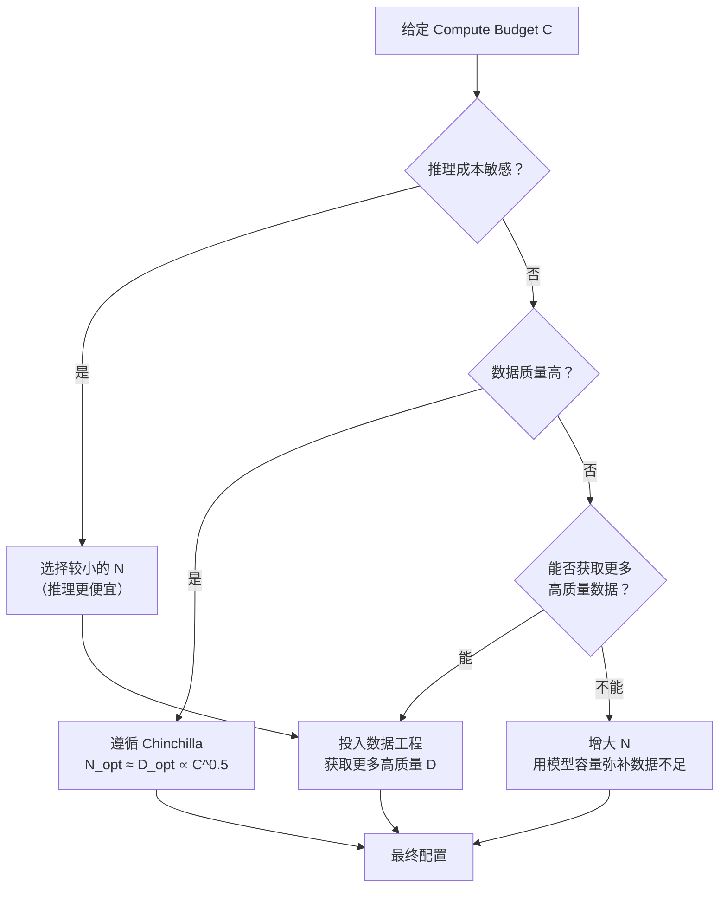

### 8.2 实战案例对比

| 模型 | $N$ | $D$ | $D/N$ | $C$ (FLOPs) | 策略 | 效果 |
|------|-----|-----|-------|------------|------|------|
| **GPT-3** | 175B | 300B | 1.7 | ~3.1e23 | 大 N 小 D | Under-trained |
| **LLaMA-1 7B** | 7B | 1T | 143 | ~4.2e22 | 小 N 多 D | 超越 13B 模型 |
| **LLaMA-2 70B** | 70B | 2T | 28.6 | ~8.4e23 | Chinchilla 风格 | 强基座 |
| **LLaMA-3 405B** | 405B | 15T | 37.0 | ~3.6e25 | 超越 Chinchilla | SOTA |
| **Qwen-2.5 72B** | 72B | 7T | 97.2 | ~3.0e24 | 极多数据 | 强基座 |
| **DeepSeek-V3** | 671B (MoE) | 14.8T | 22.1 | ~3.4e24 | MoE + Chinchilla | 性价比高 |
| **Phi-3 mini** | 3.8B | 3.3T | 868 | ~7.5e22 | 合成数据 | 超越 7B 模型 |

### 8.3 Small+More-Data vs Large+Less-Data

| 方案 | 优势 | 劣势 | 适用场景 |
|------|------|------|---------|
| **Small N + More D** | 推理快、便宜 | 训练时需要大量数据 | 推理密集型应用 |
| **Large N + Less D** | 少数据即可训练 | 推理慢、贵、under-trained 风险 | 一次性实验 |
| **Small N + Synthetic D** | 数据成本低 | Model collapse 风险 | 有强 teacher model |
| **Large N + More D** | 最佳性能 | 最贵 | 前沿模型 |

```python
# 决策辅助：给定 budget 选择最优配置
def recommend_config(budget_flops, inference_cost_weight=0.5):
    """
    给定 compute budget 和推理成本权重，推荐 N 和 D
    """
    # Chinchilla optimal
    N_chin = 0.6 * (budget_flops ** 0.5)
    D_chin = budget_flops / (6 * N_chin)
    
    if inference_cost_weight > 0.7:
        # 重视推理成本 → 选小模型
        N = N_chin * 0.5
        D = budget_flops / (6 * N)
        strategy = "推理优先: 小模型 + 多数据"
    elif inference_cost_weight < 0.3:
        # 不关心推理成本 → 可以大模型
        N = N_chin * 1.5
        D = budget_flops / (6 * N)
        strategy = "训练优先: 大模型 + Chinchilla 数据量"
    else:
        # 平衡
        N = N_chin
        D = D_chin
        strategy = "均衡: Chinchilla optimal"
    
    return {
        "N": f"{N/1e9:.1f}B",
        "D": f"{D/1e9:.0f}B tokens",
        "D_over_N": f"{D/N:.0f}",
        "strategy": strategy
    }
```

### 8.4 2026 年 Scaling 实践趋势

1. **超越 Chinchilla**: 前沿模型普遍使用比 Chinchilla 最优更多的数据（$D/N > 30$）
2. **MoE 改变规则**: Sparse models 用更少的 active 参数达到 dense model 的效果
3. **数据为王**: 数据工程（quality, diversity, dedup）比模型架构更重要
4. **小模型复兴**: Phi, Gemma, Qwen-1.5B 证明精心训练的小模型也有强能力
5. **Inference scaling 改变经济学**: 推理时的 compute 投入可以替代部分训练 compute

---

## 9. Scaling Laws Master Comparison Table

### 9.1 Scaling Laws 全景对比

| Law / Finding | Year | Key Insight | Formula / Threshold | Application | Limitation |
|:-------------|:----:|:-----------|:-------------------|:-----------|:-----------|
| **Kaplan** | 2020 | N, D, C 独立幂律 | $L \propto N^{-0.076}$ | GPT-3 设计 | 忽略 N-D 交互 |
| **Chinchilla** | 2022 | $N_{opt} = D_{opt}$ for given C | $N_{opt} \propto C^{0.50}$ | LLaMA, Qwen | 假设数据质量均匀 |
| **Emergent Abilities** | 2022 | 突然能力跳变 | ~100B threshold | Scaling motivation | 部分是 metric artifact |
| **Inverse Scaling** | 2023 | 某些任务越大越差 | Task-dependent | 安全评估 | 范围有限 |
| **Inference Scaling** | 2025 | Test-time compute ROI | Best-of-N, CoT search | o1/R1 | Diminishing returns |

### 9.2 关键公式速查

| 公式 | 来源 | 含义 | 使用场景 |
|------|------|------|---------|
| $L(N) \propto N^{-0.076}$ | Kaplan | 参数越多 loss 越低 | 预测模型容量需求 |
| $L(D) \propto D^{-0.095}$ | Kaplan | 数据越多 loss 越低 | 预测数据需求 |
| $L(C) \propto C^{-0.050}$ | Kaplan | 算力越多 loss 越低 | 预测 compute 需求 |
| $N_{opt} \propto C^{0.50}$ | Chinchilla | 最优参数量 | 设计模型大小 |
| $D_{opt} \propto C^{0.50}$ | Chinchilla | 最优数据量 | 设计数据 pipeline |
| $C \approx 6ND$ | 通用 | FLOPs 估算 | 资源规划 |
| $L(N,D) = \frac{A}{N^\alpha} + \frac{B}{D^\beta} + E$ | Chinchilla | 联合 loss 预测 | 精确预测 loss |

### 9.3 Scaling Exponents 汇总

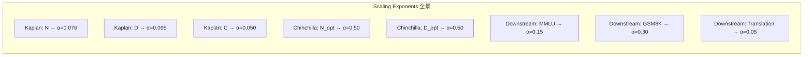

---

## 10. Frontiers (前沿)

### 10.1 MuP: Maximal Update Parameterization

**问题**: 在大规模模型上调好的超参数（learning rate, initialization scale），能否直接迁移到小规模模型上？

传统参数化（SP）的答案是 **不能**——最优超参数随模型规模变化。

**MuP (Yang et al., 2022)** 解决了这个问题：

| 特性 | Standard Parameterization (SP) | Maximal Update Parameterization (μP) |
|------|-------------------------------|-------------------------------------|
| **LR 随 N 变化** | 是（需要重新搜索） | 否（直接迁移） |
| **Init scale 随 N 变化** | 是 | 否 |
| **小模型调参 → 大模型** | ❌ 需要重新调 | ✅ 直接迁移 |
| **计算开销** | 需要大模型实验 | 只需小模型实验 |
| **成本节省** | 无 | 10x-100x |

```python
# MuP 的核心思想: 在宽度维度缩放
# 对于宽度为 n 的层:
# SP:  W ~ N(0, 1/n)        → LR 需要 ∝ 1/n
# μP:  W ~ N(0, 1/n)        → LR 与 n 无关!

# 使用 MuP 的步骤:
# 1. 在小模型 (e.g., 128 width) 上搜索最优 LR
# 2. 直接用这个 LR 训练大模型 (e.g., 4096 width)
# 3. 性能应该是 near-optimal 的

# 在 PyTorch 中使用 mup 库:
# pip install mup

from mup import MuReadiness, make_base_and_delta
# 1. 定义 base model (小宽度)
# 2. 定义 delta model (目标宽度)
# 3. 用 mup.MuAdamW 替代 AdamW
# 4. 搜索超参 → 直接迁移
```

### 10.2 MoE Scaling Laws

**Mixture of Experts (MoE)** 引入了新的缩放维度：

| 参数 | Dense Model | MoE Model |
|------|-----------|----------|
| **总参数量** | $N$ | $N_{total} = E \times N_{expert}$ |
| **活跃参数量** | $N$ | $N_{active} = K \times N_{expert}$ (K = top-k) |
| **计算成本** | O(N) per token | O(K × N_expert) per token |
| **Scaling 优势** | 标准幂律 | 用 $N_{active}$ 的成本获得 $N_{total}$ 的效果 |

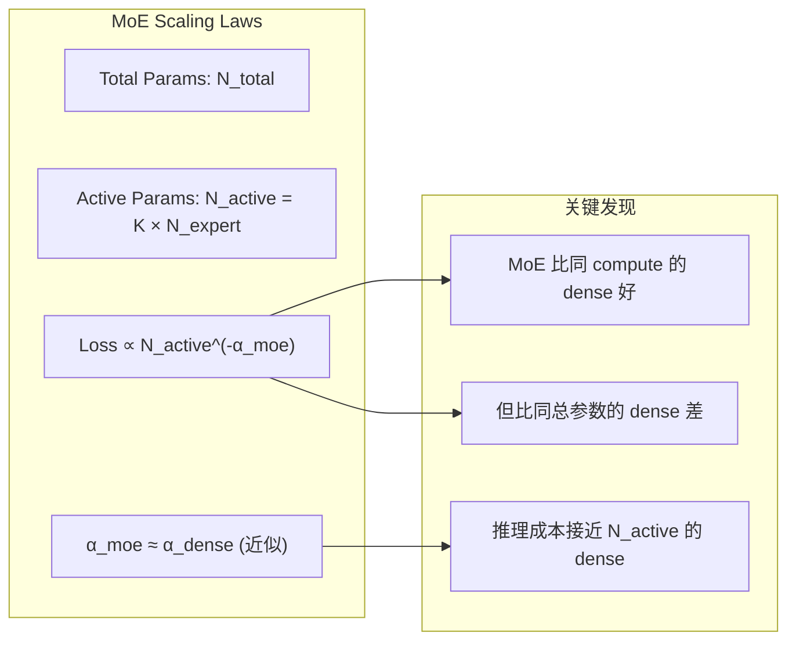

**实战**:
- **DeepSeek-V3**: 671B total, 37B active (top-8/256), 训练成本 ~$5.5M
- **Mixtral 8x7B**: 46.7B total, 12.9B active, 性能接近 dense 13B

详见 [Mixture of Experts Deep Dive](20_Papers_and_Research/Architecture/Mixture_of_Experts_Deep_Dive.md)。

### 10.3 Agent Scaling

随着 LLM Agent 的兴起，scaling laws 扩展到了 **agent 维度**：

| 缩放维度 | 描述 | 现状 |
|---------|------|------|
| **模型规模** | Agent 使用的 LLM 大小 | 越大越好但 ROI 递减 |
| **工具数量** | Agent 可调用的工具数 | 存在最优数量 (~10-20) |
| **记忆长度** | 对话/经验历史 | 更长 ≠ 更好（检索噪声） |
| **Agent 数量** | Multi-agent 系统 | 存在协调成本 |
| **推理步数** | 思考链长度 | 类似 inference scaling |

### 10.4 Small Language Model Scaling

不是所有人都能训练 405B 模型。**小模型 scaling** 成为重要研究方向：

| 模型 | 参数量 | 数据量 | $D/N$ | 关键策略 |
|------|--------|--------|-------|---------|
| **Phi-1** | 1.3B | 1B (合成) | 769 | 教科书级合成数据 |
| **Phi-2** | 2.7B | 1.4T | 519 | 扩展合成数据 |
| **Phi-3 mini** | 3.8B | 3.3T | 868 | 3x 更多数据 |
| **Gemma-2 2B** | 2.6B | 8T | 3077 | 极多数据 |
| **Qwen-2.5 0.5B** | 0.5B | 7T | 14000 | 海量数据 |

**小模型的关键启示**:
1. **数据量远超 Chinchilla 最优**: $D/N$ 可达 1000+
2. **数据质量决定上限**: 合成数据 + 精细过滤是关键
3. **架构改进更重要**: GQA, RoPE, SwiGLU 在小模型上影响更大
4. **知识蒸馏**: 用大模型训练小模型是有效的 scaling 策略

### 10.5 未来方向

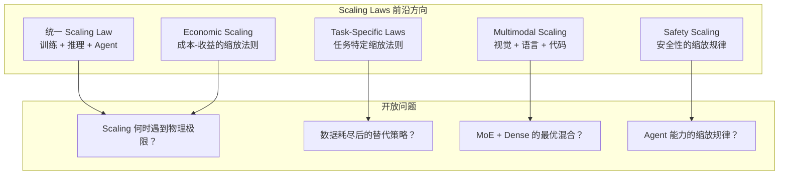

---

## Quick Reference: Scaling Decision Cheat Sheet

### 给定 Budget 的快速决策

```
┌─────────────────────────────────────────────────────────────┐
│              SCALING DECISION CHEAT SHEET                     │
├─────────────────────────────────────────────────────────────┤
│                                                             │
│  Step 1: 计算 Chinchilla optimal                            │
│    N_opt ≈ 0.6 × C^0.5                                     │
│    D_opt = C / (6 × N_opt)                                 │
│                                                             │
│  Step 2: 根据约束调整                                        │
│    • 推理成本敏感 → N 减小 30-50%, D 增大                     │
│    • 数据获取困难 → N 增大 20-30%, D 保持                     │
│    • 有强 teacher model → 考虑合成数据扩充 D                   │
│                                                             │
│  Step 3: 验证                                               │
│    • 检查 D/N ≥ 20 (至少 Chinchilla level)                  │
│    • 用 MuP 从小模型验证超参                                   │
│    • 监控 loss 曲线，检测 grokking/phase transition            │
│                                                             │
│  Step 4: 推理优化                                            │
│    • 简单任务: best-of-N (N=4-8)                             │
│    • 推理任务: CoT + self-consistency (N=16-32)              │
│    • 数学/代码: process reward model + search                 │
│                                                             │
└─────────────────────────────────────────────────────────────┘
```

---

## References

### 核心论文

1. **Kaplan et al. (2020)** — "Scaling Laws for Neural Language Models" — [arXiv:2001.08361](https://arxiv.org/abs/2001.08361)
2. **Hoffmann et al. (2022)** — "Training Compute-Optimal Large Language Models" (Chinchilla) — [arXiv:2203.15556](https://arxiv.org/abs/2203.15556)
3. **Wei et al. (2022)** — "Emergent Abilities of Large Language Models" — [arXiv:2206.07682](https://arxiv.org/abs/2206.07682)
4. **Schaeffer et al. (2023)** — "Emergent Abilities of Large Language Models are Mirages" — [arXiv:2304.15004](https://arxiv.org/abs/2304.15004)
5. **McKenzie et al. (2023)** — "Inverse Scaling: When Bigger Isn't Better" — [arXiv:2306.09479](https://arxiv.org/abs/2306.09479)
6. **Yang et al. (2022)** — "Tensor Programs V: Tuning Large Neural Networks via Zero-Shot Hyperparameter Transfer" (MuP) — [arXiv:2203.03466](https://arxiv.org/abs/2203.03466)
7. **Li et al. (2024)** — "DCLM: DataComp-LM" — [arXiv:2406.11800](https://arxiv.org/abs/2406.11800)
8. **Lee et al. (2022)** — "Deduplicating Training Data Makes Language Models Better" — [arXiv:2107.06499](https://arxiv.org/abs/2107.06499)
9. **Snell et al. (2024)** — "Scaling LLM Test-Time Compute Optimally can be More Effective than Scaling Model Parameters" — [arXiv:2408.03314](https://arxiv.org/abs/2408.03314)

### 相关文档

- [分布式训练 (Distributed Training 2026)](07_Model_Training/Distributed_Training/Distributed_Training_2026.md) — 大规模训练的分布式实现
- [混合精度训练 (Mixed Precision Training)](07_Model_Training/Optimization/Mixed_Precision_Training.md) — 训练效率优化的基础
- [LLM 架构 (LLM Architectures)](05_NLP_LLMs/LLM_Architectures/LLM_Architectures.md) — 理解 N, D 如何映射到模型结构
- [LLaMA 论文解读 (LLaMA Deep Dive)](20_Papers_and_Research/Architecture/LLaMA_Deep_Dive.md) — Chinchilla scaling laws 的经典实践案例

---

*Last updated: 2026-06-04*

