# 模型评估速成指南

> **一句话理解**: 模型评估就像"给 AI 考试打分"——不仅要看总分，还要看各科目表现、答题稳定性，以及面对新题型时的真实水平。

---

## 🤔 为什么需要评估？

没有评估的模型就像没有考试成绩的学生——你不知道他到底学会了多少。

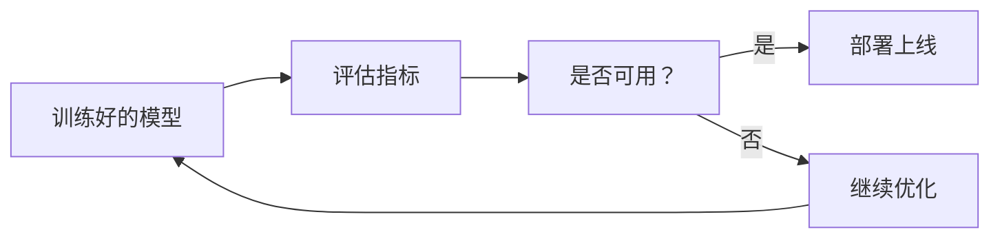

**核心问题**：
- 模型在训练数据上表现好，不代表在真实场景中也好
- 单一指标往往具有欺骗性
- 不同任务需要不同的评估方式

---

## 🧩 分类任务评估

### 混淆矩阵：一切分类指标的基础

```
               实际为正      实际为负
预测为正      TP (真阳性)    FP (假阳性)
预测为负      FN (假阴性)    TN (真阴性)
```

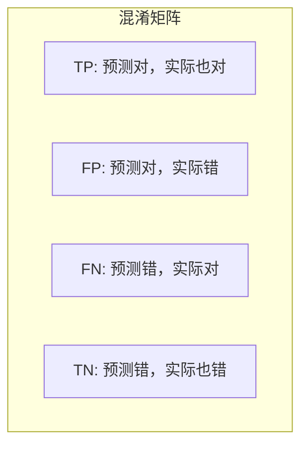

### 核心分类指标

| 指标 | 公式 | 含义 | 适用场景 |
|------|------|------|----------|
| **准确率 (Accuracy)** | (TP+TN)/(TP+TN+FP+FN) | 预测正确的比例 | 类别平衡时 |
| **精确率 (Precision)** | TP/(TP+FP) | 预测为正的中实际为正的比例 | 避免误报（如垃圾邮件） |
| **召回率 (Recall)** | TP/(TP+FN) | 实际为正的中被找出的比例 | 避免漏报（如疾病检测） |
| **F1 分数** | 2×(P×R)/(P+R) | 精确率和召回率的调和平均 | 需要平衡两者时 |
| **AUC-ROC** | ROC 曲线下面积 | 模型区分正负类的能力 | 比较不同模型 |

### 精确率 vs 召回率的权衡

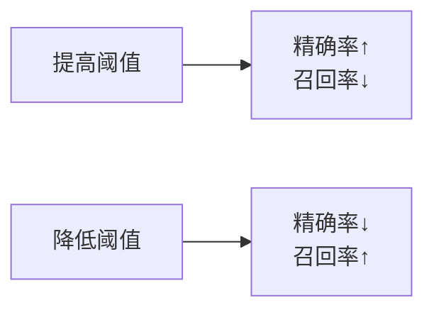

**场景对比**：

| 场景 | 优先指标 | 原因 |
|------|----------|------|
| 医学诊断（癌症筛查） | 召回率 | 漏诊代价远高于误诊 |
| 垃圾邮件过滤 | 精确率 | 误删正常邮件代价高 |
| 广告推荐 | F1 | 需要平衡覆盖和精准 |
| 欺诈检测 | AUC | 需要综合排序能力 |

### 多分类评估

| 策略 | 计算方式 | 适用 |
|------|----------|------|
| **Macro** | 各类指标的平均 | 类别同等重要 |
| **Weighted** | 按类别样本数加权 | 类别不平衡 |
| **Micro** | 全局计算 TP/FP/FN | 大规模多分类 |

```python
# scikit-learn 多分类示例
from sklearn.metrics import classification_report

print(classification_report(y_true, y_pred, target_names=['A', 'B', 'C']))
# 输出: precision, recall, f1-score per class + macro/weighted avg
```

---

## 📈 回归任务评估

### 核心回归指标

| 指标 | 公式 | 特点 | 适用场景 |
|------|------|------|----------|
| **MSE** | mean((y-ŷ)²) | 对大误差惩罚重 | 一般回归任务 |
| **RMSE** | sqrt(MSE) | 与目标变量同量纲 | 需要直观解释时 |
| **MAE** | mean(\|y-ŷ\|) | 对异常值更鲁棒 | 数据有 outliers 时 |
| **R²** | 1 - MSE/Var(y) | 解释方差比例 | 衡量模型解释力 |
| **MAPE** | mean(\|y-ŷ\|/y) | 百分比误差 | 需求预测 |

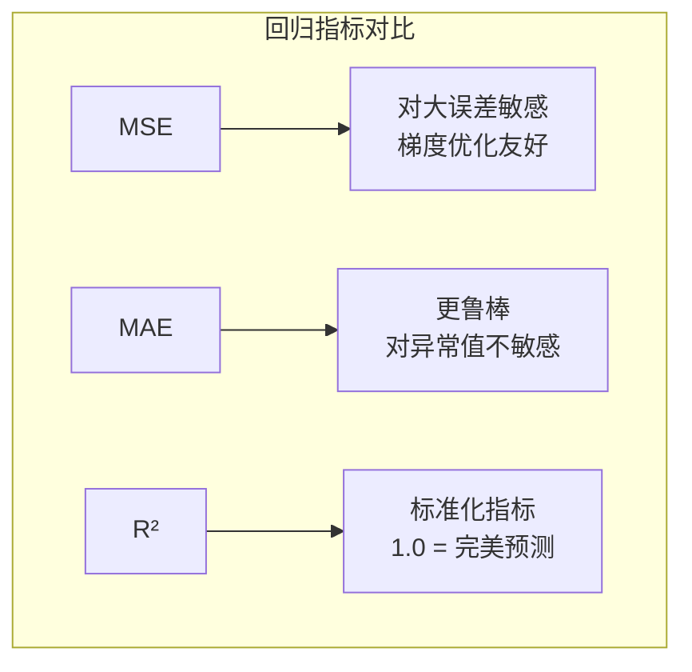

### 指标选择指南

```
数据有异常值 → 优先 MAE
需要梯度下降 → 优先 MSE/RMSE
需要解释占比 → 优先 R²
误差百分比 → 优先 MAPE
```

### 残差分析

```python
import matplotlib.pyplot as plt

residuals = y_true - y_pred
plt.scatter(y_pred, residuals)
plt.axhline(y=0, color='r', linestyle='--')
plt.xlabel('Predicted')
plt.ylabel('Residuals')

# 理想: 残差随机分布在0附近
# 问题: 出现模式(如漏斗形) → 模型假设 violated
```

| 残差模式 | 含义 | 解决 |
|----------|------|------|
| 随机分布 | 模型合适 | 无需调整 |
| 漏斗形 | 异方差 | 对数变换 / 加权回归 |
| 曲线形 | 非线性关系 | 添加多项式特征 |
| 偏移 | 系统性偏差 | 检查特征工程 |

---

## 🗣️ LLM 评估

### LLM 特有指标

| 指标 | 说明 | 适用场景 |
|------|------|----------|
| **困惑度 (Perplexity)** | 模型对下一个词预测的不确定性 | 语言模型训练监控 |
| **BLEU** | n-gram 精确匹配 | 机器翻译 |
| **ROUGE** | n-gram 召回匹配 | 文本摘要 |
| **BERTScore** | 语义相似度（基于嵌入） | 更贴近人类判断 |
| **METEOR** | 考虑同义词和词干 | 开放生成 |

### LLM 基准测试

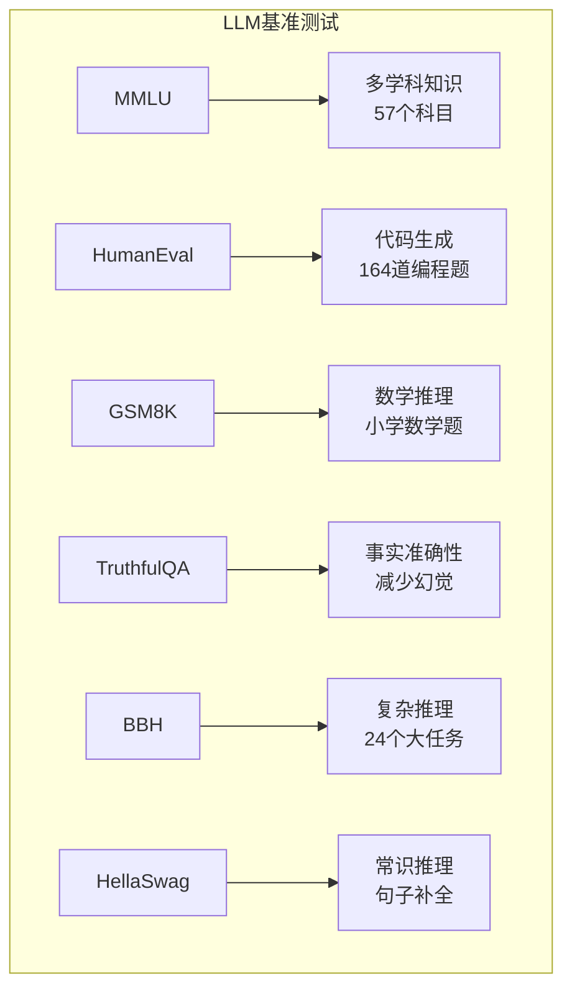

| 基准 | 测试内容 | 代表分数 |
|------|----------|----------|
| **MMLU** | 0-shot/Few-shot 学科问答 | GPT-4: 86.4% |
| **HumanEval** | Python 函数补全 | GPT-4: 67% |
| **GSM8K** | 数学文字题 | GPT-4: 92% |
| **TruthfulQA** | 事实性问题 | GPT-4: 60% |
| **BBH** | 高级推理任务 | GPT-4: 83.1% |
| **HellaSwag** | 常识推理 | GPT-4: 95.3% |

### LLM 评估方法

| 方法 | 描述 | 优缺点 |
|------|------|--------|
| **自动评估** | 用规则/模型打分 | 快，但不够全面 |
| **人工评估** | 人类标注员打分 | 准，但贵且慢 |
| **模型评估** | GPT-4 评估其他模型 | 中等成本，较可靠 |
| **A/B 测试** | 用户真实反馈 | 最真实，但风险高 |

### LLM 评估框架工具

| 工具 | 特点 | 适用 |
|------|------|------|
| **OpenAI Evals** | 开源框架，社区贡献任务 | 自定义评估 |
| **lm-evaluation-harness** | EleutherAI，覆盖 200+ 基准 | 模型对比 |
| **Promptfoo** | 自动化 prompt 测试 | 生产监控 |
| **DeepEval** | 单元测试式 LLM 评估 | CI/CD 集成 |

---

## 🔄 数据划分与交叉验证

### 训练/验证/测试划分

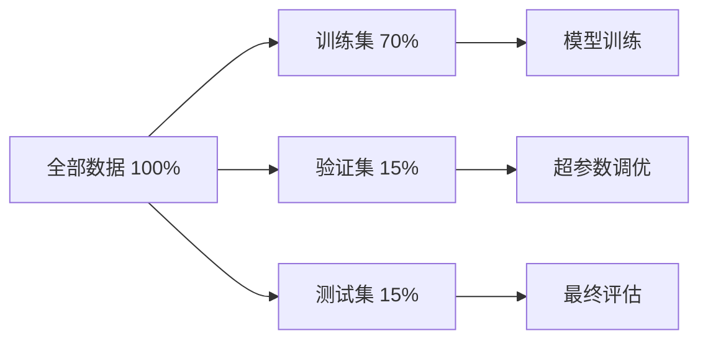

| 划分方式 | 比例 | 用途 |
|----------|------|------|
| 训练集 | 60-80% | 模型学习参数 |
| 验证集 | 10-20% | 调参、早停 |
| 测试集 | 10-20% | 最终 unbiased 评估 |

### 特殊划分策略

| 场景 | 划分方式 | 原因 |
|------|----------|------|
| 时间序列 | 按时间划分 | 避免未来信息泄露 |
| 用户级别 | 按用户划分 | 评估对新用户的泛化 |
| 地理分布 | 按地区划分 | 评估跨地区稳定性 |
| 分层采样 | 保持类别比例 | 类别不平衡时 |

### 交叉验证 (Cross-Validation)

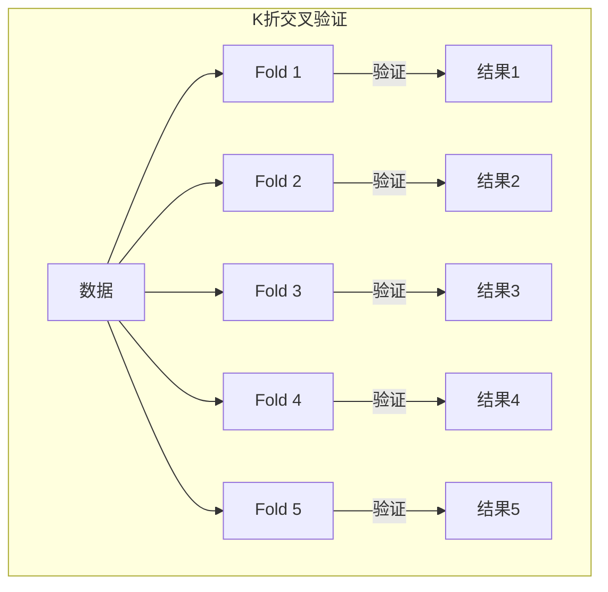

**K-Fold 步骤**：
1. 将数据分成 K 份（通常 K=5 或 10）
2. 每次用 K-1 份训练，1 份验证
3. 重复 K 次，确保每份都做过验证
4. 取 K 次结果的平均作为最终指标

**什么时候用交叉验证？**
- 数据集较小
- 需要更稳定的指标估计
- 想充分利用所有数据
- 超参数搜索时

---

## ⚠️ 过拟合检测

### 过拟合 vs 欠拟合

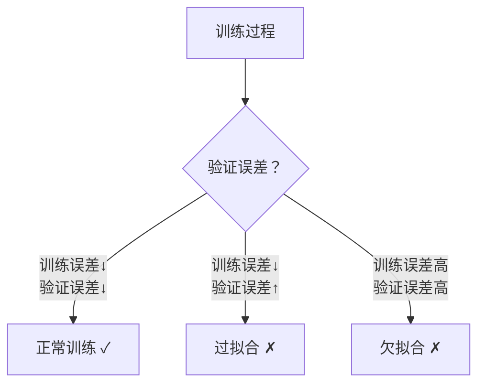

| 现象 | 训练误差 | 验证误差 | 原因 | 解决 |
|------|----------|----------|------|------|
| 正常 | 低 | 低 | 模型刚好 | 无需调整 |
| 过拟合 | 很低 | 很高 | 模型太复杂 | 正则化、 dropout、早停 |
| 欠拟合 | 很高 | 很高 | 模型太简单 | 增加复杂度、更多特征 |

### 学习曲线诊断

```
过拟合特征:
训练准确率: 99%
验证准确率: 75%
差距: 24% → 严重过拟合!

正常特征:
训练准确率: 85%
验证准确率: 82%
差距: 3% → 可以接受
```

### 检测过拟合的方法

1. **学习曲线**：绘制训练/验证误差随 epoch 变化
2. **验证集监控**：验证误差连续 N 轮不下降则早停
3. **正则化检查**：L1/L2 正则化系数是否合适
4. **模型复杂度**：参数数量 vs 数据量比例
5. **Dropout 效果**：训练时随机丢弃神经元

---

## 🛠️ 评估最佳实践

### 评估检查清单

| 检查项 | 说明 | 必须？ |
|--------|------|--------|
| 划分随机性 | 随机打乱数据 | 是 |
| 分层采样 | 保持类别比例 | 分类任务 |
| 时间敏感 | 按时间顺序划分 | 时序任务 |
| 数据泄露 | 训练/测试无重叠 | 是 |
| 多次实验 | 多次随机划分取平均 | 推荐 |
| 置信区间 | 报告指标的标准差 | 推荐 |
| 基线对比 | 与简单模型对比 | 是 |
| 业务指标 | 技术指标 + 业务指标 | 是 |

### 常见错误

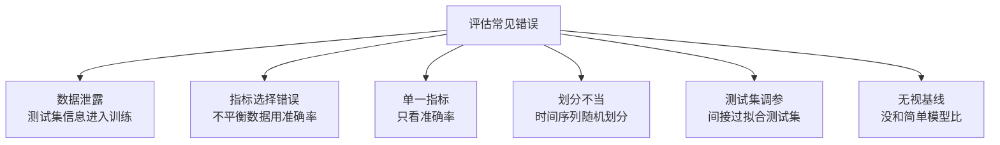

### 统计显著性检验

| 检验方法 | 用途 | 适用场景 |
|----------|------|----------|
| **t 检验** | 比较两组均值 | A/B 测试 |
| **McNemar 检验** | 比较两个分类器 | 模型对比 |
| **Bootstrap** | 估计置信区间 | 任何指标 |
| **交叉验证 t 检验** | 比较多个模型 | K折交叉验证 |

```python
from scipy import stats

#  paired t-test 比较两个模型
model_a_scores = [0.85, 0.87, 0.86, 0.88, 0.85]
model_b_scores = [0.82, 0.83, 0.81, 0.84, 0.82]

t_stat, p_value = stats.ttest_rel(model_a_scores, model_b_scores)
print(f"t={t_stat:.3f}, p={p_value:.3f}")
if p_value < 0.05:
    print("差异统计显著!")
else:
    print("差异不显著，可能是随机波动。")
```

### 模型选择策略

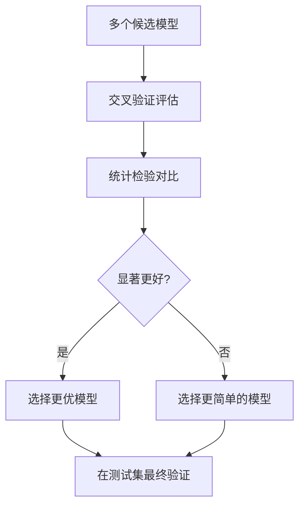

| 原则 | 说明 |
|------|------|
| **奥卡姆剃刀** | 性能相近选更简单的 |
| **验证集决策** | 绝不在测试集上调参 |
| **置信区间** | 报告指标范围而非单点 |
| **业务指标优先** | 技术指标服务于业务目标 |

---

## ❓ 常见问题 (FAQ)

### Q1: 准确率很高但模型不好用？

**A**: 数据可能严重不平衡！

```
场景: 1000 个样本，990 正例，10 负例
模型: 全部预测为正
准确率: 99%
实际: 负例全部漏掉！

解决: 看 F1、AUC、精确率、召回率
```

### Q2: 回归问题用哪个指标？

**A**: 取决于业务需求：

| 需求 | 推荐指标 |
|------|----------|
| 对大误差敏感 | MSE/RMSE |
| 数据有异常值 | MAE |
| 需要百分比 | MAPE |
| 解释模型能力 | R² |

### Q3: 如何选择 K-Fold 的 K 值？

**A**: 
- K=5: 计算快，适合大数据
- K=10: 更稳定，标准推荐
- 留一法 (K=N): 小数据集，计算量大
- 分层 K-Fold: 类别不平衡时必用

### Q4: LLM 评估为什么难？

**A**: 生成任务的答案不唯一：
- 同一问题有多种正确答案
- 自动指标（BLEU）与人工判断相关性弱
- 需要多维度评估（事实性、流畅性、安全性）

**推荐**: 结合自动指标 + 模型评估 + 抽样人工评估

### Q5: 早停（Early Stopping）怎么设置？

**A**: 
```python
# 伪代码
patience = 5       # 容忍5轮不提升
best_score = 0
counter = 0

for epoch in epochs:
    val_score = evaluate(model, val_data)
    if val_score > best_score:
        best_score = val_score
        save_model()
        counter = 0
    else:
        counter += 1
        if counter >= patience:
            break  # 早停
```

### Q6: 测试集只能用一次吗？

**A**: 理论上是的。多次在测试集上调参会间接过拟合测试集。

**实践建议**:
- 先用验证集调参
- 最终只在测试集评估一次
- 或者把测试集锁起来，用交叉验证代替
- 数据充足时，可用「验证集 = 多个 hold-out 集」

### Q7: 什么是好的基线模型？

**A**: 最简单的合理方案：

| 任务 | 基线模型 |
|------|----------|
| 分类 | 随机预测 / 多数类预测 |
| 回归 | 均值预测 / 线性回归 |
| 时序 | 上一期值 / 移动平均 |
| 推荐 | 热门推荐 / 协同过滤 |

**原则**: 如果你的复杂模型只比基线好一点点，可能不值得投入。

---

## 📚 核心要点

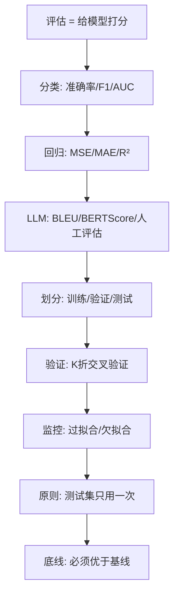

---

## 🔗 相关主题

- [模型训练速成指南](../模型训练/Model-Training-in-nutshell.md) —— 如何训练模型
- [RAG 速成指南](../RAG系统/RAG-in-nutshell.md) —— LLM 应用评估
- [模型评估完整版](./Model_Evaluation.md) —— 深入评估方法论
- [模型评估 - 小白版](./Model_Evaluation_for_dummy.md) —— 零基础入门
- [自动化评估](./Evaluation_Automation_2026.md) —— 2026 自动化评估趋势

---

*Last updated: 2026-05-07*

## Related

- [[模型评估/Model_Evaluation.md|Model_Evaluation]]
- [[模型评估/README.md|模型评估 README]]
- [[Agent/Agent_Evaluation/Assessment/Evaluation_Workflow.md|Evaluation_Workflow]]
- [[Agent/Agent_Evaluation/Cloud_Agent_Evaluation/README.md|Cloud_Agent_Evaluation README]]
- [[Agent/Agent_Evaluation/Cloud_Agent_Evaluation_System_2026.md|Cloud_Agent_Evaluation_System_2026]]
