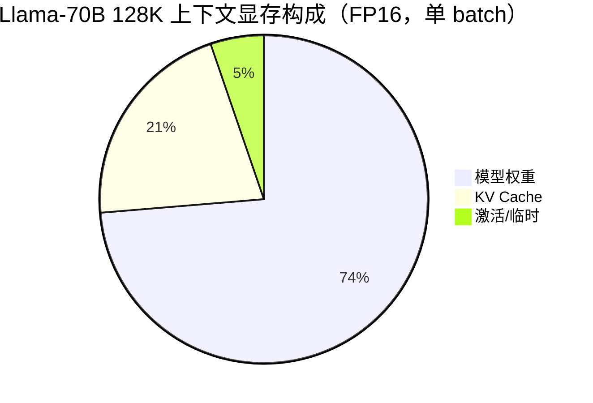
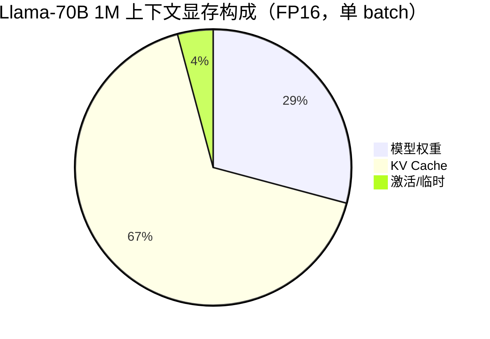
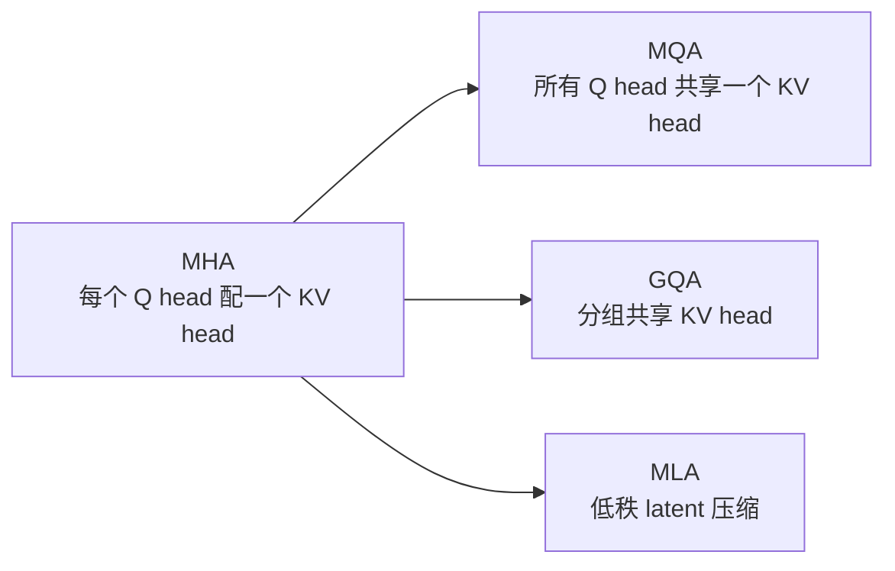

# KV Cache 深度研究：从原理到工程实践

> **一句话秒懂**：KV Cache 是自回归 LLM 推理的“记忆体”——把已经算过的 Key/Value 存下来，让模型每次生成只聚焦新 token，避免重复劳动。

---

## 目录

- [1. 为什么需要 KV Cache](#1-为什么需要-kv-cache)
- [2. KV Cache 的结构与显存模型](#2-kv-cache-的结构与显存模型)
- [3. 生命周期：Prefill → Decode](#3-生命周期prefill--decode)
- [4. 系统级优化：Paging、Prefix Caching 与调度](#4-系统级优化pagingprefix-caching-与调度)
- [5. 架构级压缩：MHA / MQA / GQA / MLA](#5-架构级压缩mha--mqa--gqa--mla)
- [6. 序列级压缩：Token Eviction 与稀疏注意力](#6-序列级压缩token-eviction-与稀疏注意力)
- [7. 数值级压缩：KV 量化](#7-数值级压缩kv-量化)
- [8. 主流框架实现对比](#8-主流框架实现对比)
- [9. 硬件视角：Roofline 与带宽瓶颈](#9-硬件视角roofline-与带宽瓶颈)
- [10. 生产选型决策树](#10-生产选型决策树)
- [11. FAQ 与常见误区](#11-faq-与常见误区)
- [12. 延伸阅读与参考](#12-延伸阅读与参考)

---

## 1. 为什么需要 KV Cache

### 1.1 自回归生成的重复计算

大语言模型在**解码阶段（decode）**是逐个 token 生成的。假设输入 prompt 有 $N$ 个 token，要生成第 $N+1, N+2, \dots, N+T$ 个 token：

```
生成 token 1: [prompt]           → 计算 prompt 所有 token 的 K/V
生成 token 2: [prompt + token 1] → 再次计算 prompt + token 1 的 K/V
生成 token 3: [prompt + token 1 + token 2] → 再次计算全部 K/V
...
```

如果不缓存，生成 $T$ 个 token 需要对 prompt 重复计算 $T$ 次，**时间复杂度是 O(T²)**。

### 1.2 KV Cache 的核心思想

在第一次处理 prompt（Prefill）时，一次性算出所有 token 的 Key 和 Value 并保存。之后每生成一个新 token，只需要：

1. 计算当前 token 的 $Q, K, V$；
2. 把新的 $K, V$ **追加**到缓存；
3. 用当前 $Q$ 与所有缓存的 $K$ 做 attention。

这样每一步的注意力计算只涉及“当前 query”对“全部历史 key”，**时间复杂度降到 O(T)**。

### 1.3 没有 KV Cache 会怎样？

| 指标 | 无 KV Cache | 有 KV Cache |
|------|------------|-------------|
| 生成长度 T 的复杂度 | O(T²) | O(T) |
| 长 prompt 重复计算 | 每次都重算 | 只算一次 |
| 实际吞吐 | 极低 | 提升 10–100× |
| 显存占用 | 小（只存输入） | 大（要存 K/V） |

> KV Cache 是用**显存换时间**的经典工程权衡。

---

## 2. KV Cache 的结构与显存模型

### 2.1 Transformer Attention 回顾

对于单个注意力头：

$$
\text{Attention}(Q, K, V) = \text{softmax}\left(\frac{QK^T}{\sqrt{d_h}}\right) V
$$

其中：

- $Q, K, V$ 形状为 $[\text{seq_len}, d_h]$
- $d_h$ 是单头维度
- 多头时 $Q, K, V$ 被切分为 $h$ 个头

在推理时，**已生成的 token 的 K 和 V 不会改变**，因此可以缓存。

### 2.2 KV Cache 显存公式

标准情况下：

$$
\text{KV\_Size} = 2 \times L \times H_{kv} \times d_h \times T \times B \times \text{bytes}
$$

参数含义：

| 符号 | 含义 | 典型值 |
|------|------|--------|
| $L$ | 层数 | 32 / 80 / 61 |
| $H_{kv}$ | KV 头数 | MHA 时 = $h$，GQA 时 = 8 |
| $d_h$ | 每头维度 | 64 / 128 |
| $T$ | 序列长度 | 4K / 32K / 128K / 1M |
| $B$ | batch size | 1 / 16 / 64 |
| bytes | 每个元素字节 | FP16=2, FP8=1, INT8=1 |
| 2 | Key + Value 两份 | 固定 |

### 2.3 直观计算示例

以 **Llama-3.1 70B**（GQA，$L=80, H_{kv}=8, d_h=128$，FP16）为例：

$$
\text{per\_token} = 2 \times 80 \times 8 \times 128 \times 2 = 327{,}680 \text{ bytes} \approx 320 \text{ KB}
$$

| 上下文长度 | 单 batch KV Cache | batch=16 |
|-----------|------------------|---------|
| 8K | ~2.5 GB | ~40 GB |
| 32K | ~10 GB | ~160 GB |
| 128K | ~40 GB | ~640 GB |
| 1M | ~320 GB | 远超单卡 |

以 **DeepSeek-V3**（MLA，$L=61, d_c=512, d_h^R=64$，FP16）为例，缓存 latent + RoPE key：

$$
\text{per\_token} = (512 + 64) \times 2 = 1{,}152 \text{ bytes} \approx 1.1 \text{ KB}
$$

| 上下文长度 | MLA FP16 | MLA + FP8 |
|-----------|---------|----------|
| 128K | ~9 GB | ~4.5 GB |
| 1M | ~72 GB | ~36 GB |

> 实际数值会因是否缓存 RoPE key、是否启用量化、是否前缀缓存等因素变化。关键是：**KV Cache 与序列长度、batch size 成正比，长上下文下会迅速超过模型权重本身。**

### 2.4 显存占比趋势





**临界点**：当上下文超过 128K，KV Cache 通常会成为第一大显存消费者。

---

## 3. 生命周期：Prefill → Decode

### 3.1 Prefill（提示词处理）

- 输入：完整的 prompt
- 输出：最后一个 token 的 logits，以及**所有 prompt token 的 K/V**
- 计算密集，通常能充分利用 GPU 算力
- TTFT（Time To First Token）主要由 Prefill 决定

### 3.2 Decode（逐 token 生成）

- 输入：上一个生成的 token
- 输出：下一个 token 的 logits
- 每次只算一个新 token 的 K/V，然后追加到 KV Cache
- 主要瓶颈从**算力**变成**内存带宽**（读取 KV Cache）

### 3.3 Chunked Prefill

大 prompt 一次性 Prefill 会导致：

- 长时间占用 GPU，阻塞其他请求
- 峰值激活值很大

**Chunked Prefill** 把长 prompt 切成多个 chunk（如 512/2048/8192 tokens），逐个处理，让其他请求可以插入。

```python
# 伪代码：Chunked Prefill
for chunk in split(prompt, chunk_size=2048):
    kv_chunk = model.prefill(chunk, prev_kv=kv_cache)
    kv_cache.append(kv_chunk)
```

### 3.4 不同阶段的 KV Cache 行为

| 阶段 | 输入长度 | 计算特点 | 瓶颈 | KV Cache 变化 |
|------|---------|---------|------|--------------|
| Prefill | $N$ | 并行计算所有 token | 算力 / 显存 | 从 0 增长到 $N$ |
| Decode | 1 | 只算当前 token | 内存带宽 | 每次 +1 |
| Chunked Prefill | chunk | 分块并行 | 调度延迟 | 分块增长 |

### 3.5 Batch 对 KV Cache 的影响

KV Cache 显存随 batch size **线性增长**。同一个 prompt 服务 16 个请求，KV Cache 就是单条的 16 倍。

```python
# Llama-3-8B, 128K, batch=16
kv_size = 2 * 32 * 8 * 128 * 128000 * 16 * 2  # ≈ 256 GB
```

这是长上下文服务难以做大 batch 的核心原因。

---

## 4. 系统级优化：Paging、Prefix Caching 与调度

### 4.1 PagedAttention：KV Cache 的虚拟内存

传统 KV Cache 为每个请求预分配一段**连续**显存。由于序列长度动态增长，会产生严重碎片：

```
请求 A 释放 100 slots，请求 B 释放 50 slots
新请求需要 120 slots，但碎片不连续 → 无法分配
```

**PagedAttention**（vLLM）把 KV Cache 切成固定大小的 Block（如 16 tokens），通过 Block Table 做逻辑到物理的映射：

```
逻辑视图: [t0-t15] [t16-t31] [t32-t47]
物理块:    Block[3]  Block[7]  Block[1]
```

优势：

- 消除碎片，显存利用率从 50–65% 提升到 90%+
- 支持共享前缀（Copy-on-Write）
- 支持动态增长

更多细节见：[[_concepts/paged-attention|PagedAttention 概念卡]]、[[10_Deployment_Inference/Inference_Engines/vLLM_Deep_Dive|vLLM 深度解析]]。

### 4.2 Prefix Caching / Prompt Caching

如果多个请求共享同一段前缀（system prompt、文档、对话历史），只需要计算一次 K/V，后续请求复用。

| 匹配方式 | 代表 | 特点 |
|---------|------|------|
| 哈希前缀匹配 | vLLM Automatic Prefix Caching | 块级精确匹配 |
| 基数树 | SGLang RadixAttention | 支持分支共享，树形结构 |
| 语义缓存 | 自定义方案 | 近似匹配，适合 FAQ |

效果：命中时首 token 延迟降低 5–10×，长文档 RAG 场景成本降低 80–95%。

深入解析：[[10_Deployment_Inference/Caching/Prompt_Caching_and_KV_Cache_Optimization|Prompt Caching 与 KV Cache 优化深度解析]]。

### 4.3 Continuous Batching

把 Prefill 和 Decode 任务动态拼成一个 batch，避免 GPU 空闲：

```
Batch 1: [Prefill A, Prefill B]
Batch 2: [Decode A, Decode B, Prefill C]
Batch 3: [Decode A, Decode B, Decode C, Decode D]
```

与 PagedAttention 配合，才能实现高吞吐生产服务。

### 4.4 KV Cache Offloading

当显存不足时，把部分 KV Cache 搬到 CPU/磁盘，需要时按需加载：

| 方法 | 思路 | 代表 |
|------|------|------|
| 分页卸载 | 冷页面换到 CPU | vLLM swap、FlexGen |
| 查询感知加载 | 只加载 attention 需要的块 | Quest、ShadowKV |
| 哈希近似 | 用 LSH 选择重要 token | MagicPiG |

代价是增加 PCIe/NVLink 传输延迟，适合超长上下文或超大 batch。

---

## 5. 架构级压缩：MHA / MQA / GQA / MLA

### 5.1 多者关系



### 5.2 Multi-Head Attention（MHA）

标准 Transformer：

$$
Q_i = X W_i^Q, \quad K_i = X W_i^K, \quad V_i = X W_i^V
$$

每个 query head $i$ 有独立的 $K_i, V_i$。KV Cache 最大，表达能力最强。

每 token 每层存储：

$$
2 \times h \times d_h = 2 \times d_{model}
$$

### 5.3 Multi-Query Attention（MQA）

所有 query head 共享同一组 $K, V$：

$$
K = X W^K, \quad V = X W^V
$$

- 压缩比：约 $h$ 倍（如 32×）
- 代价：attention 表达能力下降，质量可能掉 1–3 个点
- 典型：早期 Palm、部分小模型

### 5.4 Grouped-Query Attention（GQA）

把 $h$ 个 query head 分成 $g$ 组，每组共享一个 KV head：

$$
Q_i = X W_i^Q, \quad K_j = X W_j^K, \quad V_j = X W_j^V, \quad j = \lfloor i / (h/g) \rfloor
$$

- 压缩比：$h / g$（常见 4–8×）
- 质量损失：通常 < 0.5 个点
- 2024–2026 年主流：Llama 3.x、Mistral、Qwen2.5 等

### 5.5 Multi-head Latent Attention（MLA）

DeepSeek 提出的低秩 KV 压缩：

$$
\begin{aligned}
C^{KV} &= X W^{DKV} \\
K_i^C &= C^{KV} W_i^{UK} \\
V_i^C &= C^{KV} W_i^{UV} \\
K^R &= \text{RoPE}(X W^{KR}) \\
K_i &= \text{Concat}(K_i^C, K_i^R)
\end{aligned}
$$

推理时只需要缓存：

- 压缩 latent $C^{KV}$（维度 $d_c$，如 512）
- RoPE key $K^R$（维度 $d_h^R$，如 64）

压缩比：7–14×，甚至更高；质量损失通常 < 0.2 个点。

局限：

- 需要从头训练（DeepSeek V2/V3/V4）
- 与 RoPE 的交互复杂
- 社区正在研究 MHA/GQA → MLA 的迁移（MHA2MLA、TransMLA）

更多：[[_concepts/multi-head-latent-attention|MLA 概念卡]]、[[05_NLP_LLMs/Chinese_LLM_Ecosystem/DeepSeek_Deep_Dive|DeepSeek 深度解析]]。

### 5.6 架构对比表

| 架构 | 每 token 每层存储（FP16） | 128K 总估算（Llama-70B 规模） | 压缩比 | 质量损失 | 代表模型 |
|------|------------------------|----------------------------|--------|---------|---------|
| MHA | $2 h d_h$ | ~140 GB | 1× | 0 | 原始 Transformer |
| MQA | $2 d_h$ | ~4.4 GB | ~32× | 1–3 pt | PaLM |
| GQA（8 组） | $2 (h/g) d_h$ | ~17 GB | ~8× | <0.5 pt | Llama 3、Mistral、Qwen |
| MLA | $(d_c + d_h^R)$ | ~7–10 GB | ~14× | <0.2 pt | DeepSeek V2/V3/V4 |
| MLA + FP8 | 约一半 | ~4–5 GB | ~28× | 可忽略 | DeepSeek 生产 |

> 表中估算基于典型配置，实际随 head_dim、层数、是否量化而变化。

---

## 6. 序列级压缩：Token Eviction 与稀疏注意力

### 6.1 为什么可以压缩序列维度？

研究发现，LLM 的 attention 往往是稀疏的：

- 开头几个 token（attention sink）很重要
- 最近的 token很重要
- 中间大量 token 的 attention 权重很低

因此可以**只保留重要的 K/V，丢弃不重要的**，从而减少 KV Cache 大小。

### 6.2 主流方法概览

| 方法 | 核心思想 | 保留策略 | 优点 | 局限 |
|------|---------|---------|------|------|
| **StreamingLLM** | Attention sink + 局部窗口 | 前几个 token + 最近 W 个 token | 恒定内存、无限长 | 丢弃中间信息 |
| **H2O（Heavy Hitter Oracle）** | Heavy hitter tokens | 根据累计 attention 分数选 Top-K | 动态保留重要 token | 需要维护分数，策略复杂 |
| **SnapKV** | 观察窗口聚类 | 用尾部观察窗口判断 token 重要性 | 实现简单、效果较好 | 对长生成效果可能下降 |
| **PyramidKV** | 金字塔信息漏斗 | 不同层分配不同 KV budget | 小预算下更优 | 需要按层调参 |
| **AdaKV** | 自适应 head 预算 | 不同 head 分配不同保留数量 | 更细粒度 | 额外调度开销 |
| **DuoAttention / MoA** | 区分持久头与局部头 | 静态 head 级别稀疏 | 低开销 | 模型相关 |

### 6.3 StreamingLLM

关键发现：**前几个 token 加上最近的局部窗口**，就能近似恢复长序列 attention：

```python
# StreamingLLM 保留策略
keep = sink_tokens(first=4) + recent_tokens(window=1024)
evict = others
```

适合：无限流式输入、实时对话。

不适合：长文档问答，因为中间信息会被丢弃。

### 6.4 H2O 与 SnapKV

**H2O**：维护每个 token 的“heavy hitter”分数，保留历史高关注 + 最近 token 的混合集合。

**SnapKV**：在 prompt 末尾用一个观察窗口（observation window）计算 attention，选出一组重要 token，做聚类后保留。

### 6.5 序列压缩与 Paging/量化是正交的

```
原始 KV Cache
    ↓ PagedAttention（解决碎片）
Paged KV Cache
    ↓ Token Eviction（减少 token 数）
Sparse KV Cache
    ↓ KV Quantization（减少每个值字节）
Compact KV Cache
```

三者叠加可以实现 10–40× 压缩。

---

## 7. 数值级压缩：KV 量化

### 7.1 基本思想

KV Cache 本质是浮点张量。用低精度表示：

$$
X_{quant} = \text{round}\left(\frac{X - z}{s}\right), \quad \tilde{X} = X_{quant} \cdot s + z
$$

其中 $s$ 是 scale，$z$ 是 zero point。

### 7.2 FP8 KV Cache

NVIDIA Hopper（H100/H200/B200）原生支持 FP8：

- `fp8_e4m3`：4 位指数 + 3 位尾数，精度更高，KV Cache 常用
- `fp8_e5m2`：动态范围更大

效果：相比 FP16/BF16，显存减少约 50%，吞吐量提升。

vLLM 启用示例：

```python
from vllm import LLM

llm = LLM(
    model="meta-llama/Llama-3-8B-Instruct",
    kv_cache_dtype="fp8",
    calculate_kv_scales=True,  # 自动校准
    gpu_memory_utilization=0.95,
)
```

生产建议：离线用校准数据集计算 scale，避免运行时开销。

### 7.3 INT8 / INT4 量化

| 精度 | 压缩比 | 典型方案 | 质量影响 |
|------|--------|---------|---------|
| INT8 | 2× |  per-channel / per-token | 通常无损 |
| FP8 | 2× |  e4m3 / e5m2 | 通常无损 |
| 4-bit | 4× | KIVI、KVQuant | 轻微退化 |
| 2-bit | 8× | KIVI 2-bit | 可能明显下降 |

**KIVI**：key 做 per-channel 量化，value 做 per-token 量化，避免分布差异导致的大误差。

**KVQuant**：学习每层最佳 scale，支持 sub-4-bit。

**KVTuner**：按层敏感度混合精度，敏感层用 FP16/INT8，不敏感层用 2-bit。

### 7.4 量化与架构压缩的叠加

```
MLA 压缩：14×
FP8 量化：2×
Prefix Caching：5–12×（命中时）
─────────────────────────────
叠加效果：最多可达 140×+ 逻辑成本压缩
```

注意：这里“逻辑成本压缩”指命中/低精度/低秩综合效果；实际显存节省取决于命中率与是否命中。

---

## 8. 主流框架实现对比

### 8.1 Transformers（Hugging Face）

提供多种 Cache 实现：

```python
from transformers import DynamicCache, StaticCache, SinkCache

# DynamicCache：最常用，按需增长
cache = DynamicCache()
outputs = model(input_ids, past_key_values=cache)

# StaticCache：预分配最大长度，适合固定窗口
static_cache = StaticCache(
    config=model.config,
    batch_size=1,
    max_cache_len=32768,
    device="cuda",
    dtype=torch.float16,
)

# SinkCache：StreamingLLM 风格
sink_cache = SinkCache(window_length=1024, num_sink_tokens=4)
```

### 8.2 vLLM

- PagedAttention
- Automatic Prefix Caching
- FP8/INT8 KV Cache
- Continuous Batching + Chunked Prefill

### 8.3 SGLang

- RadixAttention：基于基数树的前缀缓存
- 对多轮对话、分支生成更友好

### 8.4 TensorRT-LLM

- 编译期优化 KV Cache 布局
- INT8/FP8 KV Cache 原生支持
- 与 Triton Inference Server 集成

### 8.5 llama.cpp

- CPU/GPU 多后端
- 支持 q4_0、q5_1 等 GGUF 量化 KV Cache
- 支持 KV Cache offload 到 CPU/磁盘

### 8.6 选型参考

| 场景 | 推荐框架 | 关键特性 |
|------|---------|---------|
| 通用生产高吞吐 | vLLM | PagedAttention、生态成熟 |
| 多轮/分支/Agent | SGLang | RadixAttention |
| NVIDIA 极致延迟 | TensorRT-LLM | 编译优化 |
| 边缘/本地 | llama.cpp / Ollama | 量化、低资源 |
| Hugging Face 生态 | TGI | 原生兼容 |

---

## 9. 硬件视角：Roofline 与带宽瓶颈

### 9.1 Decode 阶段为什么是带宽瓶颈？

生成一个 token 时：

1. 读取模型权重（约 2× 参数量）
2. 读取整个 KV Cache（与序列长度成正比）
3. 执行矩阵乘法和 attention

当上下文很长时，步骤 2 的内存访问量超过步骤 1，且 attention 计算本身的算术强度很低。

### 9.2 Roofline 简单估算

算术强度 = 浮点运算数 / 访问字节数

对于 decode 的 attention：

$$
\text{FLOPs} \approx 2 \cdot B \cdot L \cdot H \cdot d_h \cdot T
$$

$$
\text{Bytes} \approx 2 \cdot B \cdot L \cdot H_{kv} \cdot d_h \cdot T \cdot \text{bytes}
$$

当序列很长、batch 很小时，运算/字节比很低，落在 Roofline 的**内存带宽受限区**。

### 9.3 量化的硬件收益

FP8/INT8 不仅省显存，还减少 HBM 读取量，直接提升 decode 吞吐：

```
FP16 KV Cache 读取量: 2 × L × H_kv × d_h × T × 2 bytes
FP8  KV Cache 读取量: 2 × L × H_kv × d_h × T × 1 byte
→ 读取量减半，decode 吞吐提升 ~30–80%
```

### 9.4 未来硬件方向

- **HBM 容量与带宽提升**：B200、Rubin 架构
- **CXL / 统一内存**：把 CPU DRAM 当作 KV Cache 扩展池
- **近存计算 / 存内处理**：减少 KV Cache 搬运
- **专用推理芯片**：Groq LPU、SambaNova 等针对低延迟 decode 优化

---

## 10. 生产选型决策树

### 10.1 按工作负载选择

```
是否需要长上下文 (>32K)?
  ├─ 否 → GQA/FP8 + PagedAttention 已足够
  └─ 是 → 是否大量共享前缀?
         ├─ 是 → 启用 Prefix Caching + PagedAttention + FP8
         └─ 否 → 是否必须保留全部上下文?
                ├─ 是 → MLA/GQA + FP8 + Offloading
                └─ 否 → StreamingLLM / SnapKV 等 Token Eviction
```

### 10.2 按场景推荐

| 场景 | 关键优化 | 预期收益 |
|------|---------|---------|
| 长文档 Q&A | Prefix Caching + FP8 KV | 成本降低 5–12× |
| 多轮对话 | RadixAttention / Prefix Caching | TTFT 降低 5–10× |
| Agent 长历史 | Sliding window + 定期 re-anchor | 恒定/缓慢增长 |
| 实时流式输入 | StreamingLLM | 无限上下文 |
| 高并发短 prompt | PagedAttention + Continuous Batching | 吞吐提升 2–4× |
| 边缘部署 | INT4/INT8 量化 + 小模型 | 显存下降 4–8× |

### 10.3 不推荐组合

- **2-bit KV 量化 + 长上下文 RAG**：召回精度可能显著下降
- **StreamingLLM + 长文档问答**：中间信息丢失
- **无 Paging 的大 batch 长上下文服务**：显存碎片严重

---

## 11. FAQ 与常见误区

### Q1：KV Cache 和 Hidden States 有什么区别？

KV Cache 是 attention 层的 Key/Value；Hidden States 是模型每一层的输出。推理时 KV Cache 必须保留，hidden states 通常只保留当前步即可。

### Q2：Prefill 阶段需要 KV Cache 吗？

Prefill 阶段会**生成** KV Cache，但不需要读取之前的 KV Cache（因为还没有）。所以 Prefill 的瓶颈是算力和激活显存，不是 KV Cache 读取。

### Q3：KV Cache 可以跨请求共享吗？

只有在请求有**相同前缀**时才能共享。vLLM/SGLang 的 Prefix Caching 就是做这个的。完全无关的请求不能共享。

### Q4：为什么 decode 延迟高？

Decode 每次只处理一个 token，但权重的加载量和 KV Cache 读取量都很大，导致 GPU 算力利用率低、带宽成为瓶颈。

### Q5：MQA 为什么用得少了？

MQA 压缩太激进，质量损失明显。GQA 在压缩比和质量之间取得了更好平衡，成为 2024–2026 年主流。

### Q6：MLA 只能 DeepSeek 用吗？

目前原生 MLA 主要在 DeepSeek 系列。已有研究（MHA2MLA、TransMLA）尝试把 MHA/GQA 模型迁移到 MLA，但尚未成为主流。

### Q7：FP8 KV Cache 会影响精度吗？

对于绝大多数任务，FP8 KV Cache（e4m3）与 FP16 几乎无感知差异。但对敏感任务建议做离线评估。

---

## 12. 延伸阅读与参考

### 论文

- Vaswani et al., *Attention Is All You Need*, NeurIPS 2017
- Shazeer, *Fast Transformer Decoding: One Write-Head is All You Need*, 2019（MQA）
- Ainslie et al., *GQA: Training Generalized Multi-Query Transformer Models*, 2023
- Liu et al., *DeepSeek-V2: A Strong, Economical, and Efficient Mixture-of-Experts Language Model*, 2024（MLA）
- Xiao et al., *StreamingLLM: Efficient Streaming Language Models with Attention Sinks*, 2023
- Zhang et al., *H2O: Heavy-Hitter Oracle for Accurate KV Cache Compression*, 2023
- Li et al., *SnapKV: LLM Knows What You Are Looking For Before Generation*, 2024
- Kwon et al., *Efficient Memory Management for LLM Serving with PagedAttention*, SOSP 2023
- Hooper et al., *KVQuant: Towards 10 Million Context Length LLM Inference*, 2024
- Liu et al., *KIVI: A Tuning-Free Asymmetric 2-bit Quantization for KV Cache*, 2023

### 参考页面

- [[_concepts/kv-cache|KV Cache 概念卡]]
- [[_concepts/paged-attention|PagedAttention 概念卡]]
- [[_concepts/prefix-caching|Prefix Caching 概念卡]]
- [[_concepts/multi-head-latent-attention|MLA 概念卡]]
- [[_concepts/prefill-decode|Prefill / Decode 概念卡]]
- [[_concepts/attention-variants|Attention 变体概念卡]]
- [[10_Deployment_Inference/Inference_Engines/vLLM_Deep_Dive|vLLM 深度解析]]
- [[10_Deployment_Inference/Caching/Prompt_Caching_and_KV_Cache_Optimization|Prompt Caching 与 KV Cache 优化]]
- [[10_Deployment_Inference/Caching/Speculative_Decoding_Advanced_2026|投机解码前沿技术]]
- [[10_Deployment_Inference/Quantization/Quantization_Techniques_2026|量化技术 2026]]
- [[05_NLP_LLMs/LLM_Architectures/Transformer_Alternatives|Transformer 替代架构]]

---

*Last updated: 2026-06-15*
