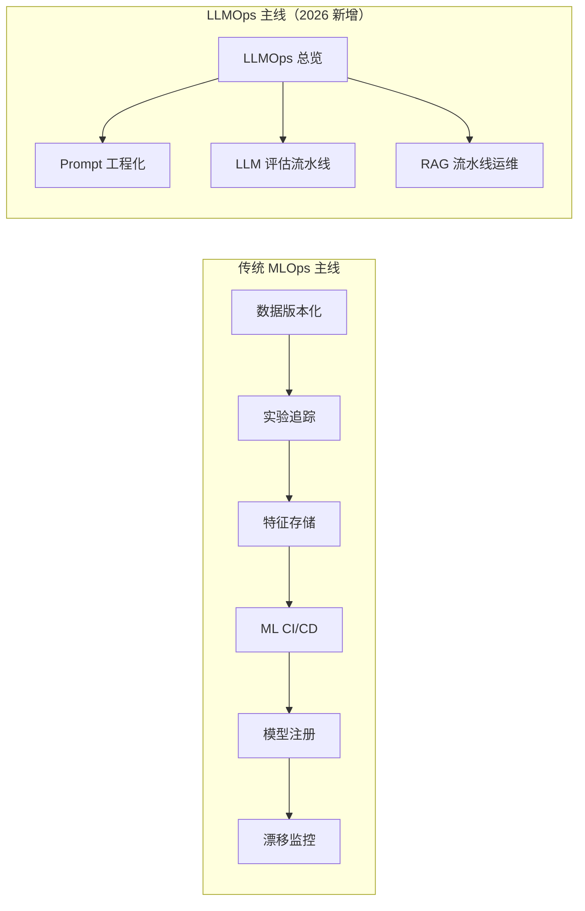
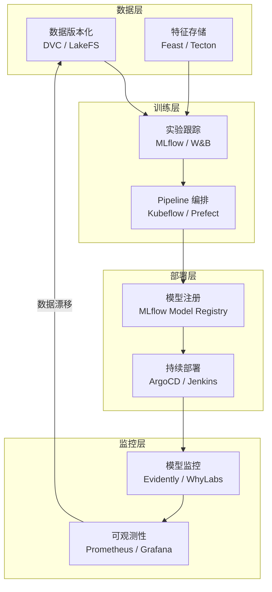

# MLOps 流水线 (MLOps Pipeline)

> **一句话理解**: MLOps 是 DevOps 的"AI 版"——如果说开发一个模型像造一辆车，MLOps 就是建造并运营整条汽车生产线，确保模型能持续、稳定、高效地在生产环境中运行。

---

## 🎯 双主线阅读导航

本章按**两条主线**组织：传统 ML 的全生命周期管理 + LLM 时代的 LLMOps 升级。2026 年的实践必须两者兼顾——传统 ML 系统仍在运行，LLM 应用正在爆发。

### 📌 应该从哪条主线入手？

| 你的场景 | 推荐起点 |
|---------|---------|
| 我在做 LLM/RAG/Agent 应用 | **[[MLOps/LLMOps_2026.md]]** → 然后 Prompt/Eval/RAG 三专题 |
| 我在做传统 ML（推荐/分类/预测） | [[MLOps/MLOps_Pipeline.md]] → 然后特征/CI-CD/监控 |
| 我想知道 MLOps 是什么 | [[MLOps/MLOps-in-nutshell.md]]（30 分钟速览） |
| 我是纯初学者 | [[MLOps/MLOps_Pipeline_for_dummy.md]] |
| 我想知道工具怎么用 | 见下方「🔧 工具深度解析」区（已从 16 迁入本章） |

---

## 📍 与 16_AI_Ops 的边界

> **本章是「ML 建设」（概念 + 工具实现，Build-time），16 是「AI 运维」（线上运营 + 应急，Run-time）。**
> 2026-06-15 起，16 个工具深度解析已从 16 迁入本章。16 仅保留 Incident Response / SRE / Chaos Engineering。
> 完整边界声明与归属矩阵见 [[MLOps/Boundary_with_16.md]]。

| 想了解 | 去哪 |
|--------|------|
| 概念与方法论（什么是特征存储/为什么需要数据版本） | 本章上方「LLMOps 主线」/「传统 MLOps 主线」/「横切关注点」 |
| 工具怎么用（Feast/DVC/MLflow/LangSmith…） | 本章下方「🔧 工具深度解析」 |
| 事故响应 / SRE / 混沌工程 | [[运维/README]] — 运维专属 |

---

## 本章内容

### 🆕 LLMOps 主线（LLM 时代·2026）

| 文档 | 内容 | 适用读者 |
|------|------|----------|
| ⭐ **[LLMOps 2026](MLOps/LLMOps_2026.md)** | **LLM 时代主线**：传统 MLOps 失效的 7 大原因、Prompt/模型/RAG 三层架构、成本与延迟 SLO、可观测性、成熟度模型、3 个事故复盘 | 所有人必读 |
| [Prompt 工程化运维](MLOps/Prompt_Engineering_Ops.md) | Prompt 版本化、A/B 测试、回归门禁、Prompt Registry（Promptflow/LangSmith/Promptfoo） | LLM 应用工程师 |
| [LLM 评估流水线](MLOps/Evaluation/LLM_Evaluation_Pipeline.md) | LLM-as-Judge、人审工作流、Eval 数据集版本化、CI 门禁、Ragas/DeepEval 实战 | LLM 应用工程师 |
| [RAG 流水线运维](MLOps/Orchestration/RAG_Pipeline_Ops.md) | 切块版本化、Embedding 升级策略、索引重建、检索质量监控（侧重 Ops） | RAG 系统工程师 |
| [LLM 成本与延迟 SLO](MLOps/Cost/LLM_Cost_Latency_SLO.md) | 三层缓存、智能路由、级联、Token 预算熔断、FinOps | LLM 平台工程师 |
| [LLM 可观测性](MLOps/Observability/LLM_Observability.md) | 五层监控、Trace 分布式追踪、幻觉/毒性/PII 在线检测、Runbook | SRE / LLM 平台 |
| [LLM 护栏与安全运维 2026](MLOps/LLM_Guardrails_and_Safety_Ops_2026.md) | Prompt Injection/PII/毒性检测、Guardrails 编排、审计合规 | AI 安全工程师 / MLOps |

### 传统 MLOps 主线

| 文档 | 内容 | 适用读者 |
|------|------|----------|
| [MLOps-in-nutshell](MLOps/MLOps-in-nutshell.md) | 30 分钟速览：成熟度模型、生命周期、关键工具 | 快速入门 |
| [MLOps Pipeline](MLOps/MLOps_Pipeline.md) | 完整流水线设计：数据版本化、特征存储、模型注册、持续部署 | 系统学习 |
| [MLOps Pipeline for Dummy](MLOps/MLOps_Pipeline_for_dummy.md) | MLOps 概念的简化版解释 | 初学者 |
| [Feature Store 深度解析](MLOps/Experiment_Tracking/Feature_Store_Deep_Dive.md) | Feast/Tecton/Hopsworks 对比，训练-服务偏差解决方案 | 进阶 |
| [实验追踪深度解析](MLOps/Experiment_Tracking/Experiment_Tracking_Deep_Dive.md) | MLflow/W&B/Neptune 全面对比，实验管理与复现 | 进阶 |
| [ML CI/CD 流水线](MLOps/CI_CD/ML_CI_CD.md) | 数据验证、模型测试、金丝雀部署、GitHub Actions for ML | 进阶 |
| [Model Monitoring & Drift Detection 2026](MLOps/Observability/Model_Monitoring_and_Drift_Detection_2026.md) | 漂移检测理论、PSI/KS 统计、语义漂移、Evidently/WhyLabs 实战 | 进阶 |
| [数据流水线编排](MLOps/Orchestration/Data_Pipeline_Orchestration.md) | Airflow/Dagster/Prefect 对比，DAG 设计最佳实践 | 进阶 |
| [MLOps 成熟度模型](MLOps/MLOps_Maturity_Model.md) | Level 0-3 成熟度评估、团队建设、工具选型、ROI 衡量 | 管理者 |
| [Model Registry & Model Cards](MLOps/Experiment_Tracking/Model_Registry_and_Cards_Deep_Dive.md) | MLflow Registry、版本管理、阶段转换、Model Card 文档化 | 进阶 |

### 数据工程（MLOps 数据基础）

| 文档 | 内容 | 适用读者 |
|------|------|----------|
| [ML 数据流水线](MLOps/Data_Engineering/Data_Pipeline_for_ML.md) | 数据摄取、清洗、特征工程、版本化、Airflow/K8s 编排 | 数据工程师 |
| [数据验证与质量](MLOps/Data_Engineering/Data_Validation_and_Quality.md) | 四层验证、Great Expectations/Pandera/Evidently、漂移检测 | 数据/MLOps 工程师 |

### 特征平台

| 文档 | 内容 | 适用读者 |
|------|------|----------|
| [特征平台基础](MLOps/Feature_Store/Feature_Store_Fundamentals.md) | Feature Store 价值、架构、在线/离线一致性、工具对比 | MLOps 工程师 |

### 横切关注点（跨 LLMOps 与 MLOps）

| 文档 | 内容 | 适用读者 |
|------|------|----------|
| [数据版本控制](MLOps/Orchestration/Data_Versioning_DVC_LakeFS.md) | DVC/LakeFS/Delta Lake 对比，可复现性的基石 | 数据工程师 |
| [自动化再训练](MLOps/Automated_Retraining.md) | 触发机制、数据回流、增量 vs 全量、自动门禁、灾难性遗忘 | ML 平台 |
| [ML 系统可观测与 SLO](MLOps/Observability/ML_Observability_SLO.md) | 三大支柱、SLI/SLO/SLA、错误预算、USE 方法、告警设计 | SRE |
| [MLOps 成本优化](MLOps/Cost/Cost_Optimization_MLOps.md) | GPU 调度、Spot 实例、弹性伸缩、训练/推理优化、FinOps | 平台 / FinOps |
| [隐私与合规流水线](MLOps/Orchestration/Privacy_Compliance_Pipeline.md) | PII 检测、数据血源、模型卡强制化、公平性门禁、审计、GDPR/AI Act | 合规 / 风控 |

### 🔧 工具深度解析（2026-06-15 从 16_AI_Ops 迁入）

> 以下工具页聚焦**具体命令、配置、部署、踩坑**。概念与选型方法论见上方对应的概念页。

#### 数据与版本控制

| 文档 | 对应概念页 |
|------|-----------|
| [DVC Deep Dive](MLOps/Orchestration/DVC_Deep_Dive.md) | [[MLOps/Orchestration/Data_Versioning_DVC_LakeFS.md]] |
| [LakeFS Deep Dive](MLOps/Orchestration/LakeFS_Deep_Dive.md) | [[MLOps/Orchestration/Data_Versioning_DVC_LakeFS.md]] |

#### 特征与实验追踪

| 文档 | 对应概念页 |
|------|-----------|
| [Feast Deep Dive](MLOps/Experiment_Tracking/Feast_Deep_Dive.md) | [[MLOps/Experiment_Tracking/Feature_Store_Deep_Dive.md]] |
| [MLflow Deep Dive](MLOps/Experiment_Tracking/MLflow_Deep_Dive.md) | [[MLOps/Experiment_Tracking/Experiment_Tracking_Deep_Dive.md]] |
| [ClearML Deep Dive](MLOps/Experiment_Tracking/ClearML_Deep_Dive.md) | [[MLOps/Experiment_Tracking/Experiment_Tracking_Deep_Dive.md]] |

#### 流水线编排

| 文档 | 对应概念页 |
|------|-----------|
| [Kubeflow Deep Dive](MLOps/Orchestration/Kubeflow_Deep_Dive.md) | [[MLOps/Orchestration/Data_Pipeline_Orchestration.md]] |
| [Prefect Deep Dive](MLOps/Orchestration/Prefect_Deep_Dive.md) | [[MLOps/Orchestration/Data_Pipeline_Orchestration.md]] |

#### LLM 可观测与评估

| 文档 | 对应概念页 |
|------|-----------|
| [LangSmith Deep Dive](MLOps/Observability/LangSmith_Deep_Dive.md) | [[MLOps/Evaluation/LLM_Evaluation_Pipeline.md]] / [[MLOps/Observability/LLM_Observability.md]] |
| [Helicone Deep Dive](MLOps/Observability/Helicone_Deep_Dive.md) | [[MLOps/Observability/LLM_Observability.md]] |
| [Phoenix Deep Dive](MLOps/Observability/Phoenix_Deep_Dive.md) | [[MLOps/Observability/LLM_Observability.md]] |
| [Braintrust Deep Dive](MLOps/Observability/Braintrust_Deep_Dive.md) | [[MLOps/Evaluation/LLM_Evaluation_Pipeline.md]] |

#### 可观测性与 CI/CD（综合）

| 文档 | 对应概念页 |
|------|-----------|
| [AI Observability Deep Dive](MLOps/Observability/AI_Observability_Deep_Dive.md) | [[MLOps/Observability/ML_Observability_SLO.md]] |
| [AI Observability Guide](MLOps/Observability/AI_Observability_Guide.md) | [[MLOps/Observability/ML_Observability_SLO.md]] |
| [AI Observability Guide 2026](MLOps/Observability/AI_Observability_Guide_2026.md) | [[MLOps/Observability/ML_Observability_SLO.md]] |
| [CI/CD Pipeline AI 2026](MLOps/CI_CD/CI_CD_Pipeline_AI_2026.md) | [[MLOps/CI_CD/ML_CI_CD.md]] |
| [LLM Production Pipeline 2026](MLOps/LLM_Production_Pipeline_2026.md) | [[MLOps/LLMOps_2026.md]] |

### 🛠 MLOps / LLMOps 排障 Runbook

> 面向 K8s 上 ML/LLM 流水线的实战排障手册。

| 文档 | 内容 | 适用读者 |
|------|------|----------|
| [MLflow Tracking Server 不可达](MLOps/Troubleshooting/MLflow_Tracking_Server_Unreachable.md) | 从客户端 URI 到 DB / Artifact Store 分层排查 | MLOps 工程师 |
| [数据验证失败](MLOps/Troubleshooting/Data_Validation_Failure_Runbook.md) | Schema / 统计 / 语义层失败定位与处理 | 数据工程师 |
| [模型版本回滚](MLOps/Troubleshooting/Model_Version_Rollback_Playbook.md) | MLflow Registry + K8s/KServe 回滚流程 | MLOps / SRE |
| [MLOps on K8s 排查速查表](MLOps/Troubleshooting/MLOps_K8s_Cheat_Sheet.md) | MLflow/Airflow/KServe/PostgreSQL/OSS 常用诊断命令 | MLOps / SRE |

> Guardrails / PromptLayer 仍留 [[运维/README]]（安全护栏与 Prompt 管理更贴近运维场景）。

---

## 学习路径

### LLM 应用开发者路径（2026 主流）
- **主线** → [LLMOps 2026](MLOps/LLMOps_2026.md)（1 小时，必读）
- **深扩** → [Prompt Ops](MLOps/Prompt_Engineering_Ops.md) → [LLM Eval](MLOps/Evaluation/LLM_Evaluation_Pipeline.md) → [RAG Ops](MLOps/Orchestration/RAG_Pipeline_Ops.md)
- **成本** → 跨章参考 [[部署推理/Cost/LLM_Cost_Optimization.md]]

### 传统 ML 工程师路径
- **快速入门** → [MLOps-in-nutshell](MLOps/MLOps-in-nutshell.md)（30 分钟）
- **系统学习** → [MLOps Pipeline](MLOps/MLOps_Pipeline.md)（2-3 小时）
- **简化版** → [MLOps Pipeline for Dummy](MLOps/MLOps_Pipeline_for_dummy.md)

---

## 与其他章节的关联

### 前置知识
- [模型训练](../模型训练/) — 训练流程是 MLOps 的输入
- [模型评估](../模型评估/) — 评估是流水线中的质量门禁
- [部署推理](../部署推理/README.md) — MLOps 的最终交付环节

### 进阶方向
- [AI Ops](../运维/README.md) — 模型监控、告警、自动回滚
- [测试](../测试/README.md) — AI 系统的测试策略
- [架构基础设施](../架构基建/) — 底层基础设施支撑
- [RAG 系统](../RAG系统/) — 知识密集型应用的 MLOps 实践

---

## 关键技术栈

---

*本章内容持续完善中。*

## Related
- [[MLOps/Boundary_with_16.md|📍 10 与 16 边界声明]] 📐 治理
- [[MLOps/Boundary_with_16|10 vs 16 边界声明]] ✅ 已完成
- [[MLOps/LLMOps_2026.md|LLMOps 2026：大模型时代的 MLOps 升级]] ⭐ LLM 时代主线
- [[MLOps/Prompt_Engineering_Ops.md|Prompt 工程化运维]]
- [[MLOps/Evaluation/LLM_Evaluation_Pipeline.md|LLM 评估流水线]]
- [[MLOps/Orchestration/RAG_Pipeline_Ops.md|RAG 流水线运维]]
- [[MLOps/Cost/LLM_Cost_Latency_SLO.md|LLM 成本与延迟 SLO]]
- [[MLOps/Observability/LLM_Observability.md|LLM 可观测性]]
- [[MLOps/Orchestration/Data_Versioning_DVC_LakeFS.md|数据版本控制：DVC 与 LakeFS]]
- [[MLOps/Automated_Retraining.md|自动化再训练]]
- [[MLOps/Observability/ML_Observability_SLO.md|ML 系统可观测与 SLO]]
- [[MLOps/Cost/Cost_Optimization_MLOps.md|MLOps 成本优化]]
- [[MLOps/Orchestration/Privacy_Compliance_Pipeline.md|隐私与合规流水线]]
- [[MLOps/Experiment_Tracking/Model_Registry_and_Cards_Deep_Dive.md|模型注册与模型卡片深度解析 (Model Registry & Model Cards Deep Dive)]]
- [[MLOps/MLOps_Pipeline.md|MLOps 流水线 (MLOps Pipeline)]]
- [[MLOps/CI_CD/ML_CI_CD.md|ML CI/CD 流水线 (ML CI/CD Pipeline)]]
- [[MLOps/MLOps_Pipeline_for_dummy.md|MLOps 流水线 - 小白版]]
- [[MLOps/README_for_dummy|10 MLOps 流水线 — 小白版 🔄]]
- [[MLOps/Experiment_Tracking/Experiment_Tracking_Deep_Dive.md|实验追踪深度解析 (Experiment Tracking Deep Dive)]]
- [[MLOps/MLOps_Maturity_Model.md|MLOps 成熟度模型与最佳实践 (MLOps Maturity Model)]]
- [[MLOps/Experiment_Tracking/Feature_Store_Deep_Dive.md|Feature Store 深度解析 (Feature Store Deep Dive)]]

- [[_concepts/mlops.md]] — MLOps
- [[_concepts/model-deployment.md]] — 模型部署

- [[Data_Pipeline_for_ML|ML 数据流水线]]
- [[Feature_Store_Fundamentals|特征平台基础]]
- [[Model_Serving_Patterns|模型服务模式 (Model Serving Patterns)]]
- [[Annotation_Pipeline|标注流水线 (Annotation Pipeline)]]
- [[Tutorial_LLMOps_End_to_End|LLMOps 端到端教程：Langfuse + Promptfoo + Ragas + LiteLLM]]
- [[Tutorial_MLOps_End_to_End|MLOps 端到端教程：DVC + MLflow + GitHub Actions + Evidently]]
