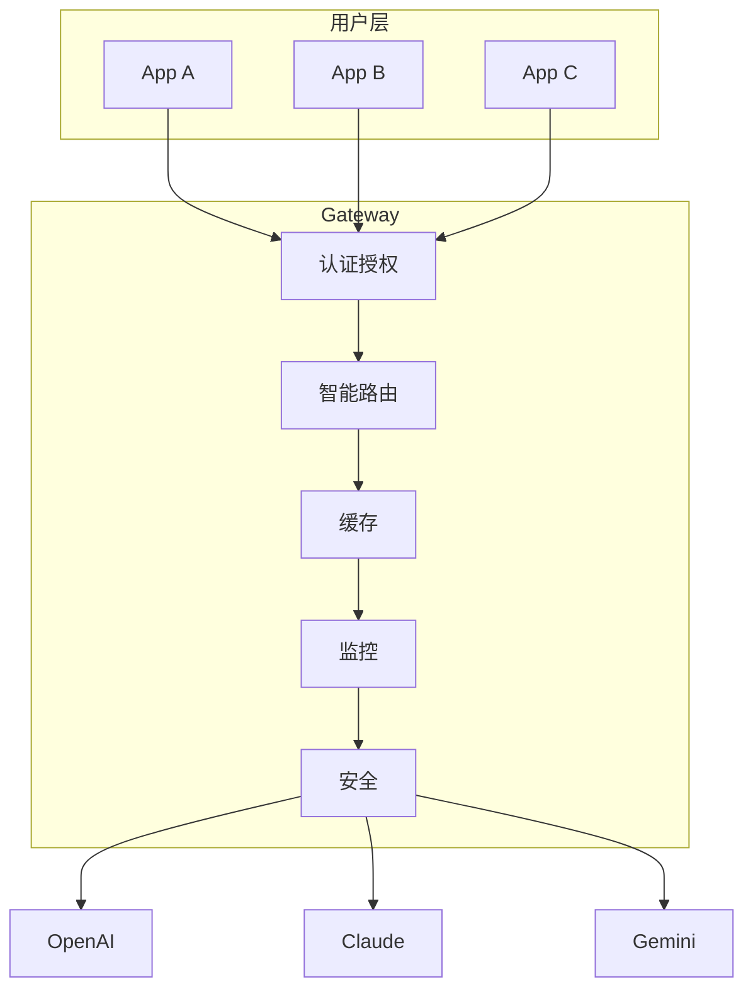
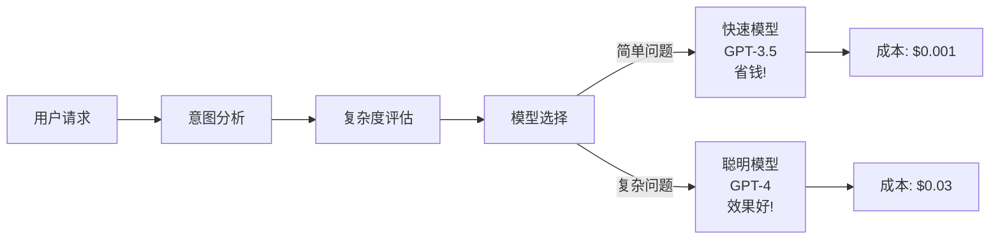
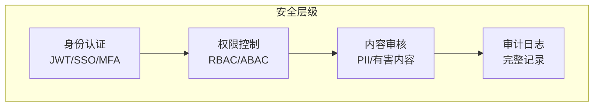

# AI 网关速成指南

> 🎯 **目标**：理解 AI Gateway 的核心概念、架构和关键功能。

---

## 🤔 什么是 AI Gateway？

**AI Gateway** = 企业 AI 能力的统一入口。

```
没有 Gateway:                    有 Gateway:
                              
用户 → OpenAI API              用户 → AI Gateway → [OpenAI / Claude / Gemini / ...]
用户 → Claude API                      ↑
用户 → Gemini API                      (一个入口，统一管理)
用户 → ...                      
```

---

## 🏗️ 核心架构



---

## ⚡ 核心功能

| 功能 | 作用 | 业务价值 |
|------|------|----------|
| **统一入口** | 一个 API 调用所有模型 | 简化集成 |
| **智能路由** | 自动选择最优模型 | 成本降低 40-60% |
| **安全管控** | 认证、授权、内容审核 | 防止滥用 |
| **流量管理** | 限流、熔断、降级 | 保障稳定性 |
| **成本优化** | 缓存、批处理、模型分层 | 减少浪费 |
| **可观测性** | 请求追踪、指标分析 | 快速定位问题 |

---

## 🎯 智能路由原理



---

## 🔐 安全架构



---

## 📊 成本优化策略

```
Layer 1: 请求优化
├── 提示词压缩
├── 上下文截断
└── 语义缓存 (相似请求直接返回)

Layer 2: 模型优化
├── 简单请求 → 小模型 (省 90%)
├── 复杂请求 → 大模型 (效果好)
└── 模型分层选择

Layer 3: 架构优化
├── 批处理 (合并请求)
├── 本地部署 (高频场景)
└── 混合云策略
```

---

## 🚀 快速开始

```python
# 1. 安装
pip install portkey-ai  # 或其他 Gateway

# 2. 配置
from portkey_ai import Portkey
client = Portkey(api_key="your-key")

# 3. 调用
response = client.chat.completions.create(
    messages=[{"role": "user", "content": "Hello!"}]
)
```

---

## 📝 关键术语

| 术语 | 解释 |
|------|------|
| **MCP** | Model Context Protocol，模型上下文协议 |
| **Rate Limiting** | 速率限制，防止滥用 |
| **Circuit Breaker** | 熔断器，故障时自动保护 |
| **Semantic Cache** | 语义缓存，相似请求命中缓存 |
| **Model Tiering** | 模型分层，复杂任务用强模型 |

---

## 🔗 相关主题

| 主题 | 文档 |
|------|------|
| 完整架构 | [AI_Gateway_2026.md](./AI_Gateway_2026.md) |
| 入门指南 | [AI_Gateway_for_dummy.md](./AI_Gateway_for_dummy.md) |
| SRE 实践 | [../AI_Ops/SRE_for_AI_Systems.md](../../运维/SRE_Reliability/SRE_for_AI_Systems.md) |
| 可观测性 | [../AI_Ops/AI_Observability_Guide.md](../../MLOps/Observability/AI_Observability_Guide.md) |
| 成本优化 | [../AI_Cost_Optimization_2026.md](../Architecture_Overview/AI_Cost_Optimization_2026.md) |

---

*Last updated: 2026-04-11*

## Related

- [[架构基建/AI_Gateway/AI_Gateway_for_dummy]] — AI Gateway 入门指南 (for Dummies) (共享: ai-gateway, api-management, litellm, routing)
- [[架构基建/AI_Gateway/Kong_AI_Gateway_Deep_Dive]] — Kong AI Gateway 深度解析 (共享: ai-gateway, api-management, litellm, routing)
- README — AI Gateway (共享: ai-gateway, api-management, litellm, routing)
- [[架构基建/AI_Gateway/Spring_AI_Gateway_Security]] — Spring AI 网关与安全 (共享: ai-gateway, api-management, litellm, routing)
