# AI 架构速成指南

> **一句话理解**: AI 架构就像设计一座智能工厂——从原材料（数据）到生产线（模型服务）再到出货口（应用接口），每一层都需要合理规划才能高效运转。

---

## 🤔 为什么需要 AI 架构？

AI 应用不是「一个大模型」那么简单。一个生产级 AI 系统需要：
- 接收和路由用户请求
- 安全地调用模型
- 检索相关知识
- 存储向量数据
- 监控和扩展

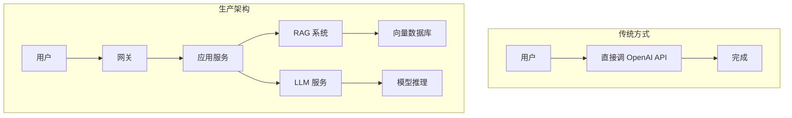

---

## 🏗️ 四层 AI 架构

### 整体架构图

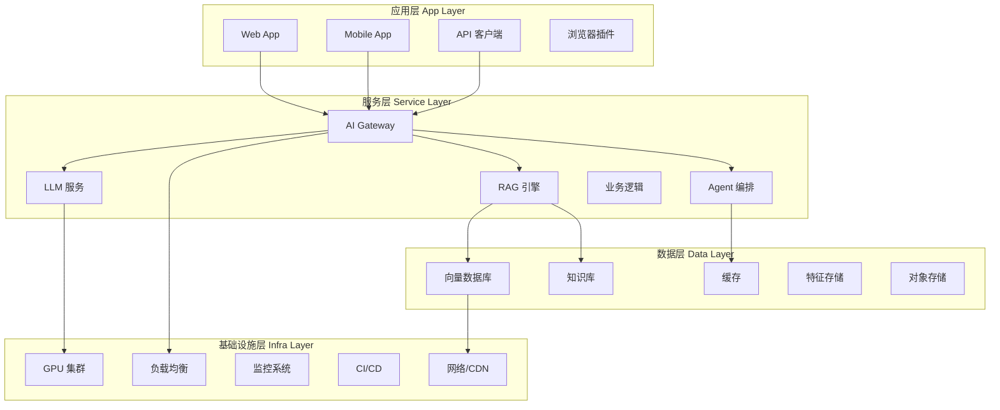

### 各层职责

| 层级 | 核心职责 | 关键组件 |
|------|----------|----------|
| **应用层** | 用户交互、展示结果 | Web/Mobile、ChatUI、插件 |
| **服务层** | 业务逻辑、模型编排 | Gateway、LLM Service、RAG、Agent |
| **数据层** | 知识存储、向量检索 | Milvus、Redis、PostgreSQL |
| **基础设施层** | 计算、网络、运维 | Kubernetes、GPU、Prometheus |

---

## 🔑 关键组件详解

### 1. AI Gateway（AI 网关）

AI 系统的「交通指挥官」。

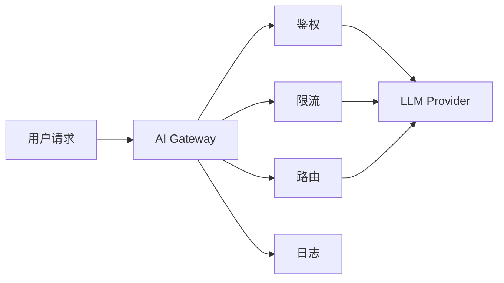

| 功能 | 说明 | 示例工具 |
|------|------|----------|
| 统一接入 | 一个接口调用多个模型 | LiteLLM、Portkey |
| 流量控制 | 防止单用户耗尽配额 | Token bucket |
|  Fallback | 主模型失败切换备用 | 自动路由 |
| 成本追踪 | 记录每次调用成本 | 按项目/用户计费 |
| 日志审计 | 记录完整请求响应 | 合规追溯 |

### 2. LLM 服务层

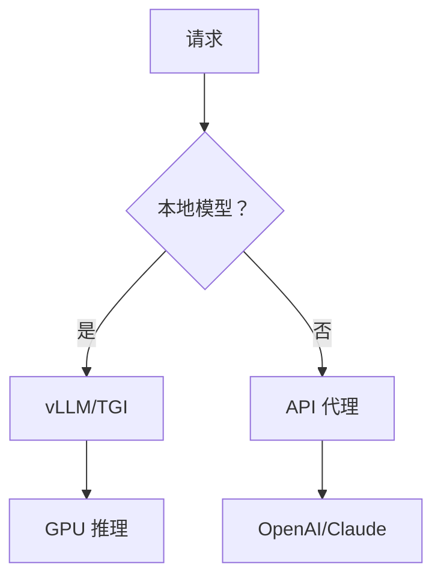

| 部署方式 | 延迟 | 成本 | 适用场景 |
|----------|------|------|----------|
| 自托管 (vLLM) | 低 | 固定 GPU | 高频、隐私敏感 |
| API 代理 | 中 | 按量付费 | 低频、快速启动 |
| 混合模式 | 灵活 | 混合 | 大多数场景 |

**推理优化技术**：

| 技术 | 效果 | 复杂度 |
|------|------|--------|
| 连续批处理 (Continuous Batching) | 2-5x 吞吐 | 中 |
| 模型量化 (INT8/FP8) | 2x 吞吐，50% 显存 | 低 |
| PagedAttention | 减少显存碎片 | 中 |
| 投机解码 (Speculative Decoding) | 2-3x 加速 | 高 |

### 3. RAG 系统


RAG = 检索 + 生成。让 LLM 基于私有知识回答问题。

### 4. 向量数据库

| 数据库 | 特点 | 适用规模 |
|--------|------|----------|
| Milvus | 分布式、云原生 | 十亿级 |
| Qdrant | Rust 实现、高性能 | 百万级 |
| Chroma | 轻量、易用 | 十万级 |
| PGVector | PostgreSQL 扩展 | 已有 PG 生态 |
| Pinecone | 全托管 SaaS | 快速启动 |

---

## 📈 扩展策略

### 水平扩展 vs 垂直扩展

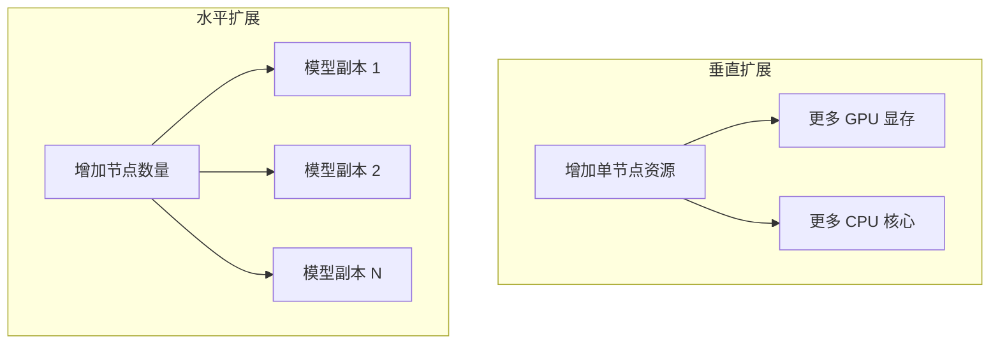

| 维度 | 垂直扩展 | 水平扩展 |
|------|----------|----------|
| 方式 | 升级单机硬件 | 增加机器数量 |
| 上限 | 硬件天花板 | 理论上无限 |
| 成本 | 初期低，后期指数增长 | 线性增长 |
| 复杂度 | 低 | 高（需要负载均衡） |
| 适用 | 数据库、缓存 | 推理服务、Web 服务 |

### 自动扩缩容

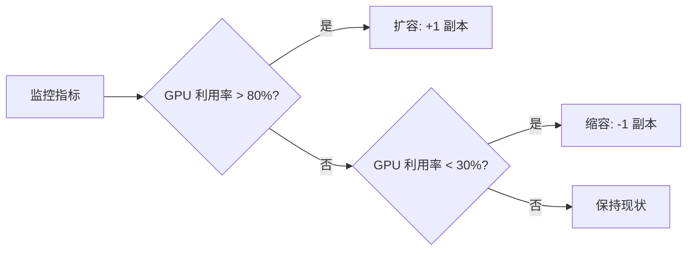

**常用指标**：
- GPU 利用率
- 请求队列长度
- P95 延迟
- 错误率
- Token 生成速率

**扩缩容策略**：

| 策略 | 触发条件 | 适用 |
|------|----------|------|
| 基于阈值 | GPU > 80% | 稳定负载 |
| 基于队列 | 排队请求 > 10 | 突发流量 |
| 基于调度 | 预定时间扩容 | 已知高峰 |
| 预测性 | 根据历史预测 | 有规律波动 |

---

## 🔄 高可用性 (HA) 基础

### 高可用设计原则

| 原则 | 实现方式 | 目标 |
|------|----------|------|
| 冗余 | 多副本、多可用区 | 单点故障不影响服务 |
| 故障转移 | 健康检查 + 自动切换 | RTO < 1 分钟 |
| 限流降级 | 熔断、降级策略 | 故障不扩散 |
| 数据备份 | 定期快照、跨区域复制 | RPO 最小化 |

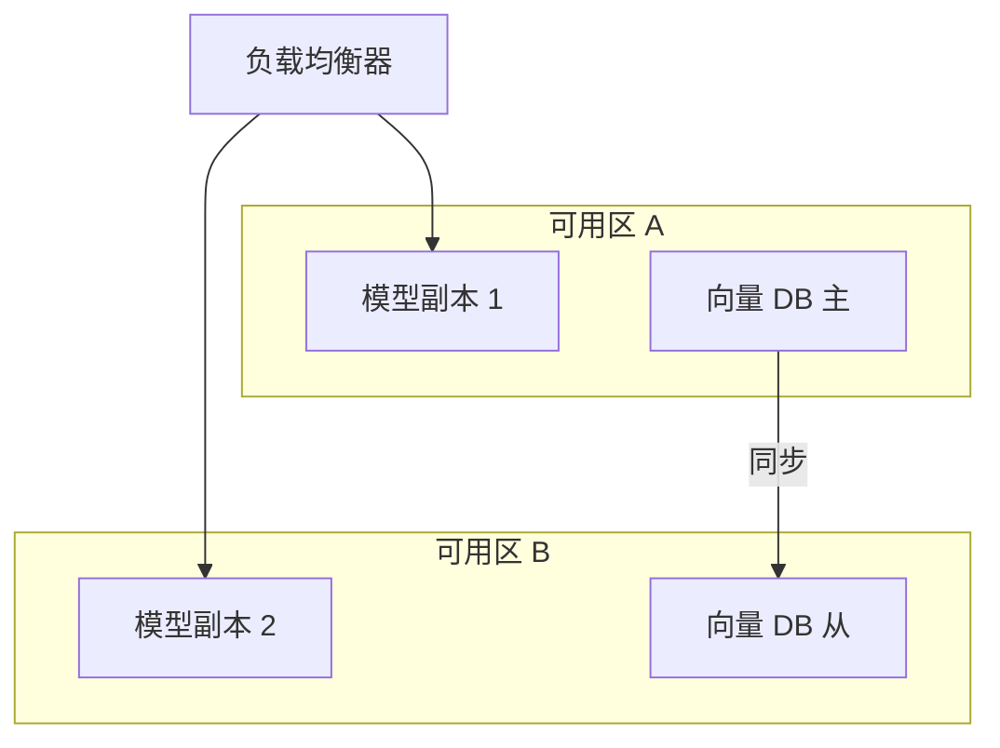

### 健康检查机制

```python
# 伪代码：健康检查
@app.get("/health")
def health_check():
    checks = {
        "llm_service": check_llm(),
        "vector_db": check_vector_db(),
        "gateway": check_gateway(),
    }
    if all(checks.values()):
        return {"status": "healthy"}
    return {"status": "degraded", "details": checks}
```

### 降级策略

| 场景 | 降级方案 | 用户体验 |
|------|----------|----------|
| LLM 超时 | 返回缓存答案 | 可能 slightly outdated |
| 向量 DB 故障 | 纯 LLM 回答 | 可能缺少私有知识 |
| 主模型故障 | 切换到小模型 | 质量下降但可用 |
| 全链路故障 | 返回静态提示 | 服务可用，功能受限 |

---

## 💰 成本优化快速技巧

### 成本构成分析

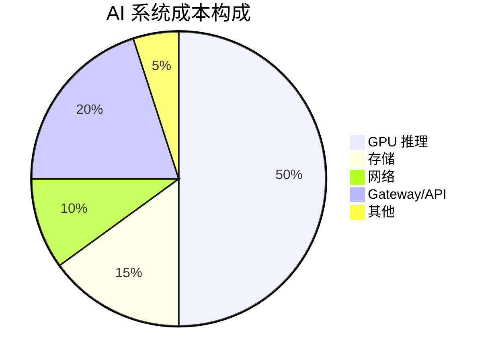

### 10 个成本优化技巧

| 技巧 | 节省 | 复杂度 |
|------|------|--------|
| **模型量化** (INT8/INT4) | 2-4x | 低 |
| **缓存常见查询** | 30-50% | 低 |
| **用小模型处理简单任务** | 40-60% | 中 |
| **批处理请求** | 20-30% | 低 |
| **Spot/抢占式实例** | 60-90% | 中 |
| **Embedding 模型本地化** | 固定费用 | 低 |
| **请求去重** | 10-20% | 低 |
| **动态批处理 (vLLM)** | 2-5x | 中 |
| **冷热数据分层** | 30-40% | 中 |
| **监控并告警异常流量** | 避免浪费 | 低 |

### 缓存策略

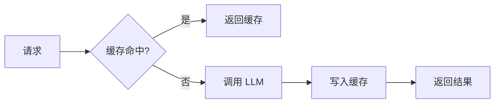

### 负载均衡策略

| 策略 | 说明 | 适用场景 |
|------|------|----------|
| **轮询 (Round Robin)** | 依次分配给每个实例 | 实例性能相近 |
| **最少连接** | 分配给当前连接最少的实例 | 请求处理时间差异大 |
| **加权轮询** | 按权重分配 | GPU 规格不同 |
| **一致性哈希** | 相同请求路由到相同实例 | 有状态缓存 |
| **响应时间加权** | 根据实例响应动态调整 | 实例性能波动大 |

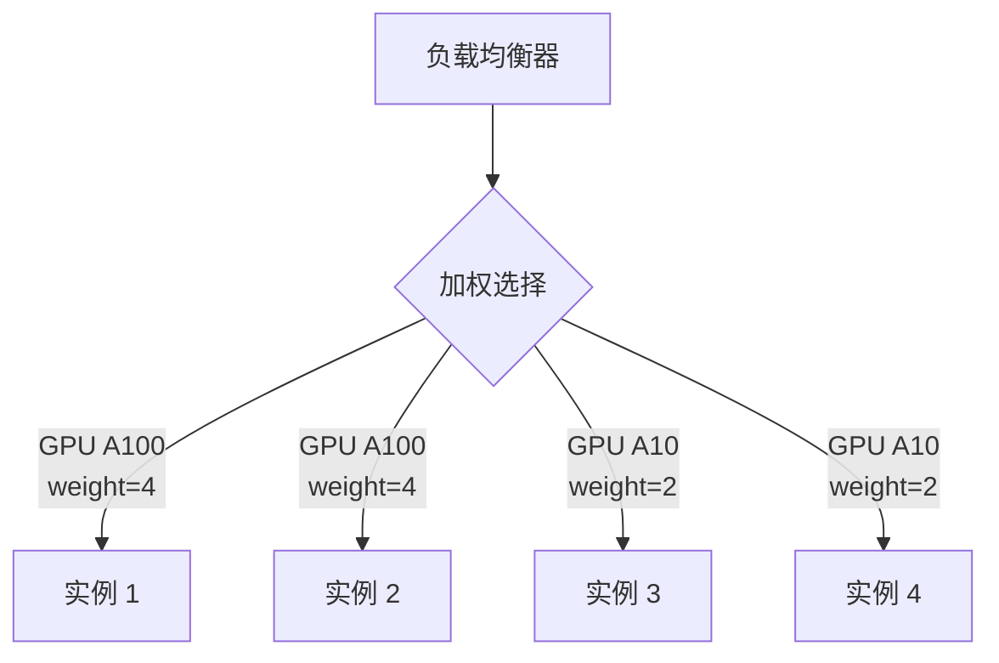

### 多租户架构要点

| 隔离级别 | 实现方式 | 成本 | 安全性 |
|----------|----------|------|--------|
| **共享模型** | 同一模型服务所有租户 | 低 | 低 |
| **逻辑隔离** | 命名空间/标签隔离 | 中 | 中 |
| **资源隔离** | 独立 Pod/GPU | 高 | 高 |
| **完全隔离** | 独立集群 | 极高 | 极高 |

### 部署模式对比

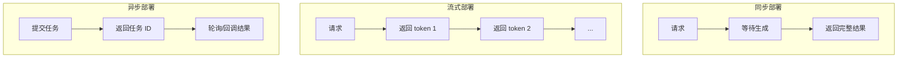

| 模式 | 延迟感知 | 用户体验 | 复杂度 | 适用 |
|------|----------|----------|--------|------|
| 同步 | 高 | 等待中 | 低 | 短文本、简单任务 |
| 流式 | 低 | 实时显示 | 中 | 聊天、长文本生成 |
| 异步 | 无 | 稍后查看 | 高 | 批量处理、长任务 |

**缓存层级**：

| 层级 | 位置 | TTL | 适用 |
|------|------|-----|------|
| 内存缓存 | Redis | 分钟级 | 高频查询 |
| CDN 缓存 | 边缘节点 | 小时级 | 静态内容 |
| 结果缓存 | 应用层 | 天级 | 完全相同的请求 |
| Embedding 缓存 | 向量层 | 长期 | 已计算的向量 |

---

## 🏢 多租户与隔离

### 多租户架构模式

| 模式 | 隔离级别 | 成本 | 适用 |
|------|----------|------|------|
| **共享实例** | 逻辑隔离 | 最低 | SaaS 起步 |
| **共享 + 命名空间** | 数据隔离 | 低 | 中小客户 |
| **独立副本** | 计算隔离 | 中 | 大客户 |
| **独立集群** | 完全隔离 | 高 | 金融/政务 |

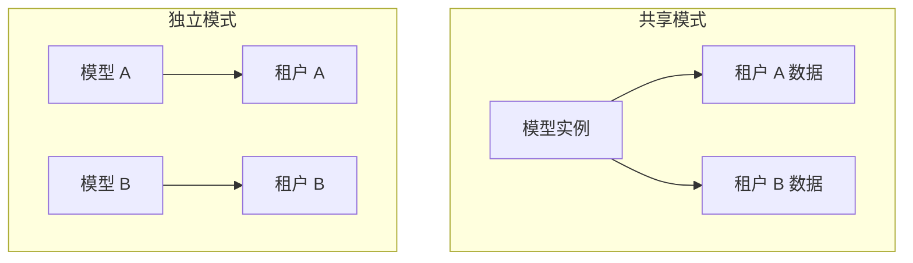

---

## 📊 架构决策速查表

| 场景 | 推荐架构 | 关键组件 |
|------|----------|----------|
| 原型/MVP | 全托管 API | OpenAI + 前端 |
| 企业内部 | 私有部署 | vLLM + RAG + PGVector |
| 高并发 C 端 | 混合架构 | Gateway + 多副本 + 缓存 |
| 多租户 SaaS | 隔离架构 | K8s namespace + 独立向量空间 |
| 边缘推理 | 轻量化 | ONNX Runtime + 小模型 |
| 金融合规 | 独立集群 | 私有化 + 审计日志 |

---

## ❓ 常见问题 (FAQ)

### Q1: 应该选择云托管还是自托管 LLM？

**A**: 取决于你的约束：

| 因素 | 云托管 API | 自托管 |
|------|------------|--------|
| 启动速度 | 快（分钟级） | 慢（天级） |
| 数据隐私 | 低 | 高 |
| 延迟控制 | 有限 | 完全控制 |
| 高频调用成本 | 高 | 低 |
| 模型定制 | 受限 | 自由 |

### Q2: 向量数据库怎么选？

**A**: 
- 快速原型：Chroma
- 已有 PostgreSQL：PGVector
- 大规模生产：Milvus / Qdrant
- 云原生：Pinecone（托管）

### Q3: 如何设计高可用的模型推理服务？

**A**: 
1. 至少 2 个模型副本，分布在不同可用区
2. 负载均衡器做健康检查和流量分发
3. 自动扩缩容应对流量波动
4. 降级策略：主模型失败时切换备用模型
5. 监控 GPU 利用率、显存、延迟

### Q4: RAG 系统需要多少向量存储？

**A**: 估算公式：
```
存储 ≈ 文档数 × 每文档分块数 × 向量维度 × 精度

示例:
10,000 文档 × 10 块 × 1536 维 × 4 字节 ≈ 614 MB
```

### Q5: AI Gateway 和 API Gateway 有什么区别？

**A**: AI Gateway 是 API Gateway 的超集，额外支持：
- Token 级限流（不只是请求级）
- 多模型路由和 Fallback
- LLM 特有的日志（prompt、completion、token 数）
- 成本追踪和预算控制

### Q6: 如何估算 AI 系统的总成本？

**A**: 
```
月成本 = GPU 实例费 + API 调用费 + 存储费 + 网络费 + 运维人力

示例 (中等规模):
- GPU 节点 (2×A100): $6,000
- API 调用 (备份模型): $2,000
- 向量数据库: $500
- 存储/CDN: $300
- 运维: $8,000
= 总计约 $17,000/月
```

---

## 📚 核心要点

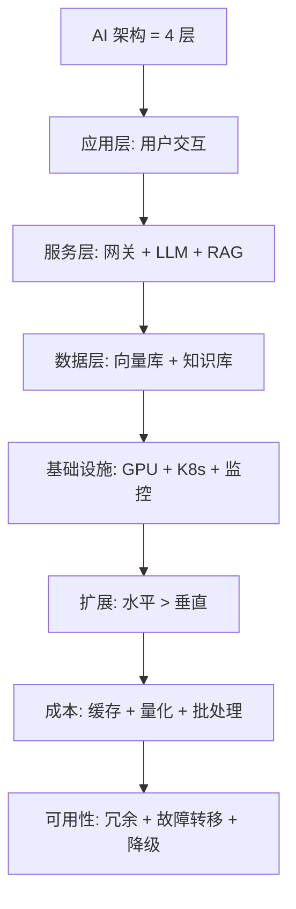

---

## 🔗 相关主题

- [RAG 速成指南](../RAG系统/RAG-in-nutshell.md) —— 检索增强生成
- [推理速成指南](../部署推理/Inference-in-nutshell.md) —— 模型部署推理
- [成本优化完整版](./Architecture_Overview/AI_Cost_Optimization_2026.md) —— 深入成本策略
- [高可用完整版](./Architecture_Overview/High_Availability_2026.md) —— 深入 HA 设计
- [架构基础设施 - 小白版](./Architecture_Infrastructure_for_dummy.md) —— 零基础入门

---

*Last updated: 2026-05-07*

## Related

- [[架构基建/Architecture_Overview/AI_Infrastructure_2026]] — AI Infrastructure 2026 完全指南 (共享: architecture, high-availability, infrastructure, kubernetes)
- [[架构基建/Architecture_Infrastructure_for_dummy]] — AI 架构基础设施 - 小白版 (共享: architecture, high-availability, infrastructure, kubernetes)
- [[架构基建/Architecture_Overview/Spring_AI_Architecture]] — Spring AI 系统架构设计 (共享: architecture, high-availability, infrastructure, kubernetes)
- [[架构基建/README.md|README]]
- [[AI_System_Architecture_2026|AI_System_Architecture_2026]]
