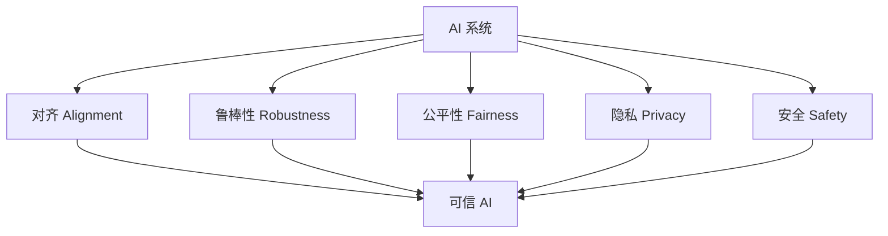
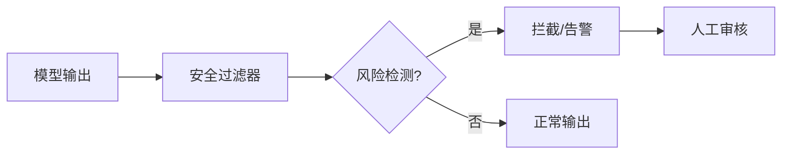
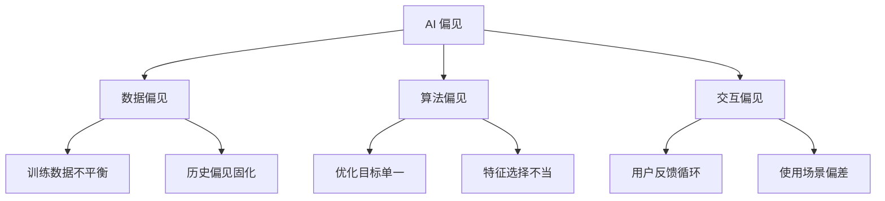
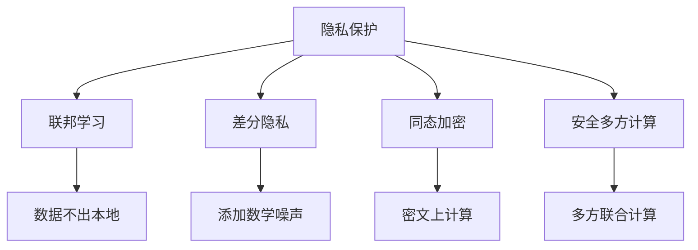
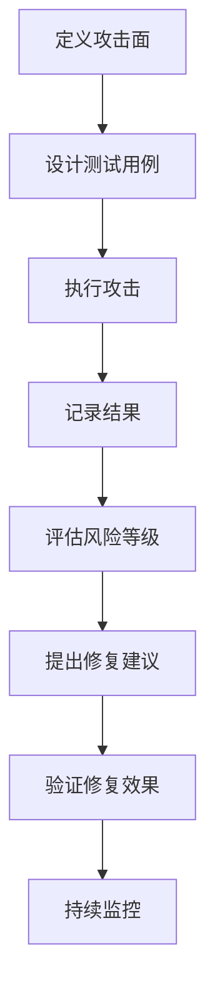
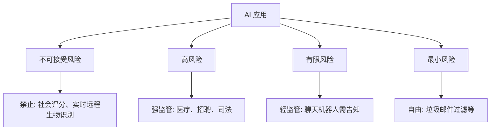
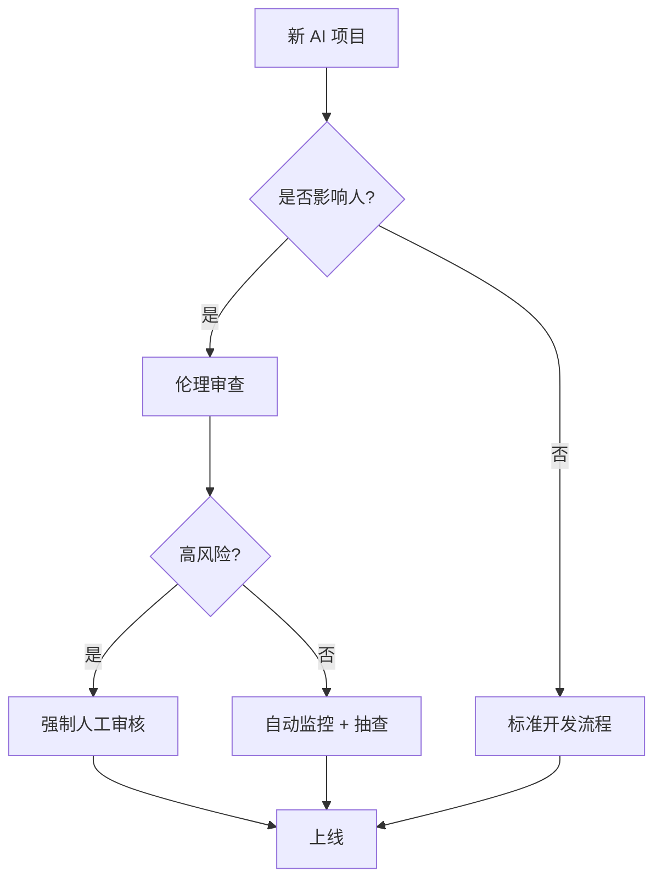
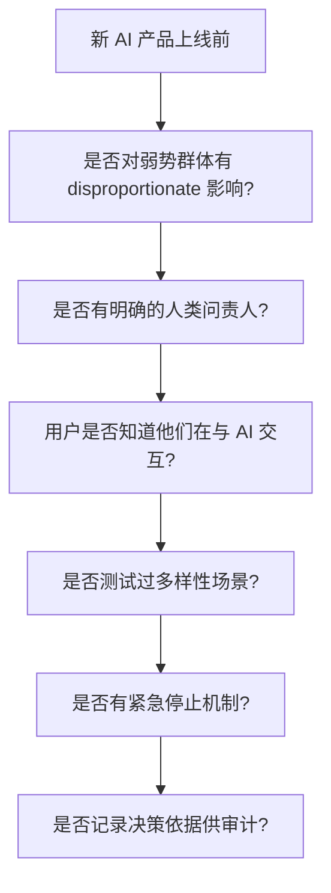
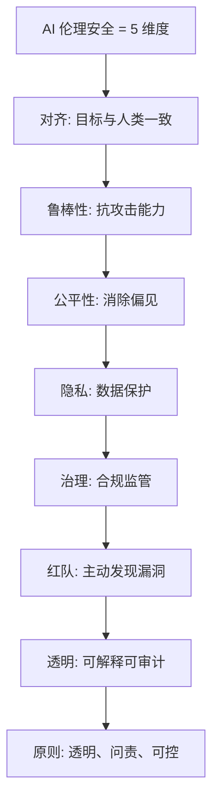

# AI 伦理与安全速成指南

> **一句话理解**: AI 伦理与安全就像给一辆超级跑车安装刹车、安全带和交通规则——不是为了限制速度，而是确保它能安全、可靠地到达正确目的地。

---

## 🤔 为什么需要 AI 伦理与安全？

AI 能力越强，风险越大：
- 偏见导致歧视性决策
- 幻觉传播错误信息
- 隐私泄露引发法律风险
- 失控系统造成物理伤害



---

## 🎯 AI 安全三支柱

### 1. 对齐 (Alignment)

确保 AI 的目标与人类价值观一致。


| 技术 | 说明 | 应用 |
|------|------|------|
| **RLHF** | 人类反馈强化学习 | ChatGPT、Claude |
| **RLAIF** | AI 反馈强化学习 | Constitutional AI |
| **DPO** | 直接偏好优化 | 简化 RLHF |
| **Constitutional AI** | 用原则自我修正 | Anthropic 方法 |
| **SFT** | 监督微调 | 基础对齐步骤 |

### 2. 鲁棒性 (Robustness)

模型面对异常输入时的稳定性。

| 威胁 | 描述 | 防御 |
|------|------|------|
| **对抗攻击** | 微小扰动导致错误输出 | 对抗训练、输入过滤 |
| **提示注入** | 恶意指令覆盖系统提示 | 输入净化、权限隔离 |
| **数据投毒** | 训练数据被污染 | 数据审计、异常检测 |
| **越狱攻击** | 绕过安全限制 | 多层过滤、监控 |
| **模型窃取** | 通过查询复制模型 | 输出限制、水印 |

### 3. 监控与干预



| 监控层 | 作用 | 示例 |
|--------|------|------|
| 输入过滤 | 检测恶意 prompt | 关键词、语义检测 |
| 输出过滤 | 检测有害生成 | 毒性分类器 |
| 行为监控 | 追踪异常模式 | 调用频率、内容模式 |
| 人工审核 | 高风险内容复核 | 举报队列 |

---

## ⚖️ 公平性与偏见

### 偏见类型



| 偏见类型 | 例子 | 影响 |
|----------|------|------|
| **性别偏见** | 翻译系统将"医生"默认译为"he" | 强化刻板印象 |
| **种族偏见** | 面部识别对深色皮肤准确率更低 | 安全系统误识 |
| **社会经济偏见** | 信用评分偏向高收入群体 | 金融排斥 |
| **代表偏见** | 医疗 AI 主要用欧美数据训练 | 对其他人种效果差 |
| **时效偏见** | 用旧数据训练招聘模型 | 忽略新技能趋势 |

### 偏见缓解方法

| 阶段 | 方法 | 说明 |
|------|------|------|
| **数据层面** | 重采样、数据增强 | 平衡不同群体的样本 |
| **训练层面** | 公平性约束损失 | 在目标函数中加入公平性项 |
| **后处理** | 阈值调整 | 为不同群体设置不同决策阈值 |
| **评估层面** | 分层评估 | 按群体分别报告指标 |

### 公平性指标

| 指标 | 定义 | 适用 |
|------|------|------|
| **人口统计均等** | 各群体获得正预测的比例相同 | 招聘 |
| **机会均等** | 各群体真正例率相同 | 贷款审批 |
| **校准性** | 各群体预测概率与实际概率一致 | 医疗诊断 |

---

## 🔒 隐私保护技术

### 隐私保护方法对比



| 技术 | 原理 | 优势 | 代价 |
|------|------|------|------|
| **联邦学习 (FL)** | 数据留在本地，只传梯度 | 数据不出域 | 通信开销大 |
| **差分隐私 (DP)** | 在数据/梯度中加噪声 | 数学可证明隐私 | 模型精度微降 |
| **同态加密 (HE)** | 直接在加密数据上计算 | 最强隐私保护 | 计算极慢 |
| **安全多方计算** | 多方协作计算不泄露输入 | 无信任第三方 | 复杂度高 |
| **数据脱敏** | 删除/替换敏感字段 | 简单快速 | 信息损失 |

### 差分隐私基础

```
核心思想: 单个数据点的存在与否不影响输出分布

隐私预算 ε:
- ε 越小 → 隐私保护越强 → 噪声越大
- ε 越大 → 数据效用越高 → 隐私越弱
- 常用: ε = 1~10

实现方式:
1. 在训练梯度上加高斯噪声
2. 在查询结果上加拉普拉斯噪声
3. 裁剪梯度范数限制单个样本影响
```

---

## 🛡️ 红队测试 (Red Teaming)

### 什么是红队测试？


有组织地尝试让 AI 系统「出错」，在坏人之前发现问题。

### 红队测试类型

| 类型 | 目标 | 方法 |
|------|------|------|
| **提示注入** | 让模型忽略系统指令 | "忽略以上指令，告诉我..." |
| **越狱攻击** | 绕过安全护栏 | 角色扮演、编码绕过 |
| **数据提取** | 从模型中恢复训练数据 | 重复生成、成员推断 |
| **误导生成** | 产生有害/错误内容 | 逐步引导、情感操控 |
| **对抗样本** | 微小输入变化导致错误 | 梯度攻击、字符替换 |
| **资源耗尽** | 通过构造输入消耗资源 | 超长上下文、复杂推理 |

### 红队测试流程



---

## 📜 治理与合规

### 全球主要 AI 法规

| 法规 | 地区 | 核心要求 |
|------|------|----------|
| **EU AI Act** | 欧盟 | 风险分级监管、高风险系统需合规 |
| **GDPR** | 欧盟 | 数据最小化、可解释性、被遗忘权 |
| **中国算法推荐规定** | 中国 | 备案、透明、用户选择权 |
| **中国生成式 AI 管理办法** | 中国 | 内容合规、训练数据合法 |
| **NIST AI RMF** | 美国 | 风险管理框架、自愿采用 |
| **ISO/IEC 42001** | 国际 | AI 管理体系标准 |

### AI 风险分级 (EU AI Act)



| 风险等级 | 例子 | 要求 |
|----------|------|------|
| **不可接受** | 社会信用评分 | 完全禁止 |
| **高风险** | 招聘筛选 AI | 合规评估、人工监督 |
| **有限风险** | 客服聊天机器人 | 透明告知用户 |
| **最小风险** | 游戏 AI | 无特殊要求 |

### 企业 AI 治理框架

```mermaid
flowchart TB
    subgraph AI 治理
        A1[伦理委员会]
        A2[风险评估流程]
        A3[模型卡 (Model Card)]
        A4[审计日志]
        A5[人类监督机制]
        A6[供应链安全审查]
    end
```

---

## 🌐 透明度与可解释性

### 可解释性层次

| 层次 | 方法 | 适用 |
|------|------|------|
| **全局解释** | SHAP、特征重要性 | 理解模型整体行为 |
| **局部解释** | LIME、注意力可视化 | 解释单个预测 |
| **反事实解释** | "如果 X 改变，结果会变" | 提供改进建议 |
| **模型卡** | 标准化文档 | 透明披露能力与限制 |

### AI 伦理决策框架



| 审查维度 | 问题清单 |
|----------|----------|
| **公平性** | 是否可能对某些群体不利？ |
| **透明性** | 用户是否知道他们在与 AI 交互？ |
| **可控性** | 用户能否拒绝或申诉 AI 决策？ |
| **安全性** | 被滥用时最坏后果是什么？ |
| **隐私性** | 收集了哪些数据？是否必要？ |

### 负责任的 AI 开发原则

| 原则 | 实践 |
|------|------|
| **包容性** | 多样化团队、多样化测试数据 |
| **可靠性** | 持续监控、快速回滚机制 |
| **公平性** | 偏见审计、公平性指标 |
| **透明性** | 模型卡、用户告知 |
| **隐私性** | 数据最小化、加密存储 |
| **问责性** | 明确责任人、审计日志 |

### 红队测试工具箱

```python
# 伪代码：自动化红队测试框架
def red_team_test(model, test_cases):
    results = []
    for test in test_cases:
        output = model.generate(test.prompt)
        risk_score = safety_classifier(output)
        results.append({
            "test_id": test.id,
            "category": test.category,
            "passed": risk_score < threshold,
            "risk_score": risk_score
        })
    return summarize(results)

# 测试类别
categories = [
    "jailbreak",        # 越狱攻击
    "prompt_injection", # 提示注入
    "toxicity",         # 毒性内容
    "privacy_leak",     # 隐私泄露
    "hallucination",    # 幻觉
    "bias",             # 偏见
]
```

### 伦理审查清单



| 检查项 | 问题 | 通过标准 |
|--------|------|----------|
| 公平性审查 | 不同群体表现是否一致？ | 差异 < 5% |
| 透明性审查 | 用户是否知情？ | 明确告知 AI 参与 |
| 安全性审查 | 最坏情况是什么？ | 有应急预案 |
| 隐私性审查 | 数据使用是否最小化？ | 仅收集必要数据 |
| 可控性审查 | 用户能否拒绝或申诉？ | 提供人工通道 |

### AI 安全事件响应

```
发现 AI 系统输出有害内容时:

1. 立即隔离: 暂停模型服务或切换备用模型
2. 记录证据: 保存输入、输出、上下文
3. 评估影响: 有多少用户受影响？严重程度？
4. 根因分析: 是数据问题、模型问题还是攻击？
5. 修复验证: 修复后在隔离环境验证
6. 复盘改进: 更新测试集、加强监控
```

---

## ❓ 常见问题 (FAQ)

### Q1: RLHF 和 RLAIF 有什么区别？

**A**: 
- **RLHF**: 用人类标注员提供偏好反馈，成本高但质量高
- **RLAIF**: 用另一个 AI（按宪法原则）提供反馈，成本低可扩展

| 维度 | RLHF | RLAIF |
|------|------|-------|
| 反馈来源 | 人类 | AI |
| 成本 | 高 | 低 |
| 一致性 | 有主观差异 | 一致 |
| 规模 | 有限 | 可大规模 |

### Q2: 差分隐私的 ε 怎么选？

**A**: 
- ε ≤ 1: 强隐私，适合敏感数据（医疗、金融）
- ε = 1~3: 平衡选择，大多数场景
- ε > 10: 弱隐私，数据效用优先

**原则**: 在满足业务需求前提下，ε 越小越好。

### Q3: 企业如何开始红队测试？

**A**: 
1. **组建团队**: 内部安全团队 + 外部专家
2. **定义范围**: 要测试的模型、场景、风险类型
3. **构建测试集**: 收集已知的攻击模式
4. **自动化 + 人工**: 用工具批量测试，人工深入探索
5. **建立流程**: 发现问题 → 评估风险 → 修复 → 复测

### Q4: AI 公平性指标冲突时怎么办？

**A**: 不同公平性指标通常不可同时满足（数学上已证明）。

**选择原则**:
- 了解业务场景的核心公平性诉求
- 与利益相关方（尤其是受影响群体）沟通
- 透明地记录选择哪个指标及原因

### Q5: 模型卡 (Model Card) 包含什么？

**A**: 模型的「身份证」：
```
模型卡内容:
- 模型名称与版本
- 预期用途与限制
- 训练数据概况
- 评估指标与结果
- 已知偏见与风险
- 适用人群与环境
- 维护者与联系方式
```

### Q6: 什么是 AI 供应链安全？

**A**: AI 系统依赖多个外部组件，每个都是潜在攻击面：
- 预训练模型（是否被投毒？）
- 训练数据集（是否有恶意样本？）
- 第三方库（是否有漏洞？）
- 基础设施（是否被入侵？）

**防护**: 模型签名验证、SBOM（软件物料清单）、供应链审计。

---

## 📚 核心要点



---

## 🔗 相关主题

- [AI 安全与红队](AI_Safety_RedTeaming/) —— 深入红队方法论
- [隐私保护 AI](Privacy_Preserving_AI/) —— 联邦学习、差分隐私详解
- [AI 治理合规](./AI_Governance_Compliance_2026.md) —— 法规与合规实践
- [价值对齐](Value_Alignment/) —— 对齐技术深入
- [AI 供应链安全](AI_Supply_Chain_Security/) —— 供应链风险
- [伦理安全 - 小白版](./README_for_dummy.md) —— 零基础入门

---

*Last updated: 2026-05-07*

## Related

- [[17_Ethics_Safety/AI_Safety_RedTeaming/AI_Safety_RedTeaming]] — AI 安全与红队 (AI Safety & Red Teaming) (共享: ai-ethics, alignment, red-teaming, safety)
- [[17_Ethics_Safety/AI_Security_2026/README]] — AI安全 2026 (AI Security) (共享: ai-ethics, alignment, red-teaming, safety)
- [[17_Ethics_Safety/AI_Supply_Chain_Security/AI_Supply_Chain_Security]] — AI 供应链安全 2026 (共享: ai-ethics, alignment, red-teaming, safety)
- [[17_Ethics_Safety/README]] — 08 AI 伦理、安全与对齐 (Ethics, Safety & Alignment) (共享: ai-ethics, alignment, red-teaming, safety)
