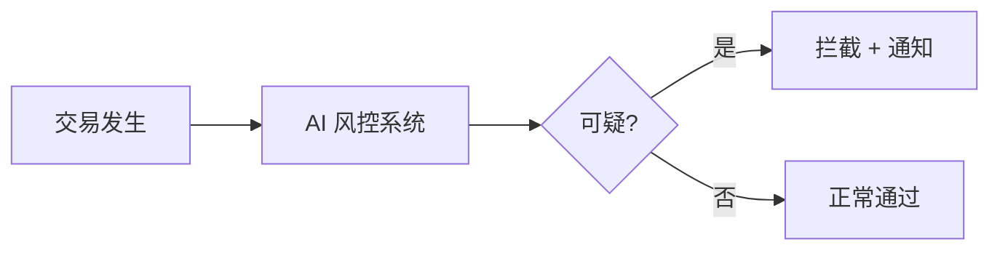
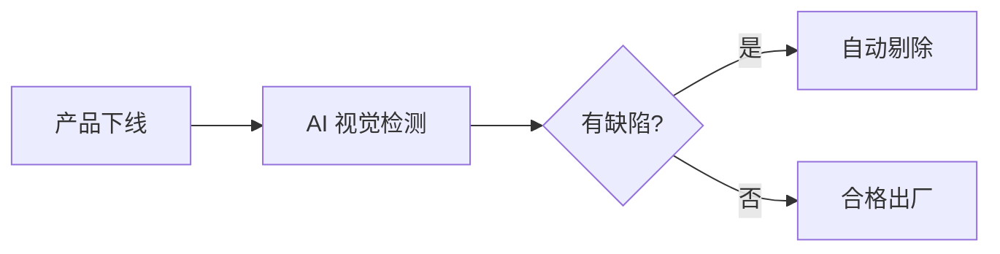
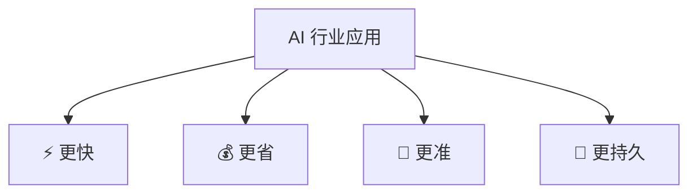
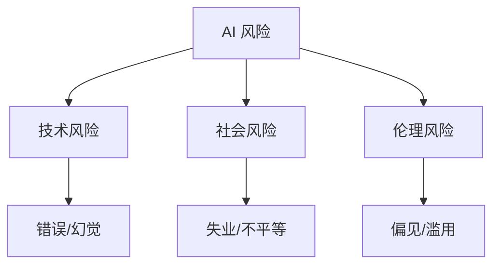

# AI 行业应用 - 小白版

> **一句话理解**: AI 在行业中就像"智能员工"——它不会取代所有人类，但会用数据分析和自动化帮助每个行业做得更好、更快、更省钱。

---

## 🤔 什么是 AI 行业应用？

想象你有一个超级助手：
- 它读过世界上所有的书 📚
- 它从不疲倦，24 小时工作 ⏰
- 它能从海量数据中发现人眼看不到的规律 🔍

**这就是 AI 行业应用——把 AI 的能力放到具体行业里解决实际问题。**


---

## 🏥 行业例子（用大白话讲）

### 1. 医疗健康 🏥

**AI 做什么**：
- 看 X 光片、CT，找肿瘤和病变
- 帮医生整理病历，写报告
- 加速新药研发（从 10 年缩短到 2-3 年）


**💡 小白理解**：
> AI 不是替代医生，而是像医生的"第二双眼睛"——
> 先看一遍，标出可能有问题的地方，
> 医生再看一遍做最终判断。
> 这样既快又准，还能减少漏诊。

---

### 2. 金融服务 💰

**AI 做什么**：
- 识别信用卡盗刷（毫秒级判断）
- 评估贷款风险（比传统方式更准）
- 智能理财建议（根据你的风险偏好）



**💡 小白理解**：
> 以前银行靠人工审核贷款，一天看不了几份。
> 现在 AI 几秒就能分析你的收入、信用、消费，
> 判断你能不能还得起钱。
> 对你来说：审批更快；对银行来说：坏账更少。

---

### 3. 制造业 🏭

**AI 做什么**：
- 摄像头检查产品有没有瑕疵
- 预测机器什么时候会坏，提前维修
- 优化生产排期，减少浪费



**💡 小白理解**：
> 以前质检靠人眼——累、慢、还会看错。
> 现在摄像头 + AI，
> 每秒能检查几十个产品，
> 连人眼看不到的微小裂缝都能发现。

---

### 4. 零售电商 🛒

**AI 做什么**：
- "猜你喜欢"——推荐你可能想买的商品
- 预测什么货会卖爆，提前备货
- 智能客服回答"我的快递到哪了"


**💡 小白理解**：
> 逛淘宝时"猜你喜欢"怎么那么准？
> 因为 AI 看了几百万人的购物记录，
> 发现"买 A 的人 80% 也会买 B"，
> 就推荐给你了。
> 你更容易找到想要的，平台也更赚钱。

---

### 5. 自动驾驶 🚗

**AI 做什么**：
- 识别路上的车、人、红绿灯
- 判断什么时候该刹车、变道
- 规划最优路线


**💡 小白理解**：
> AI 开车就像人开车——
> 眼睛看路（摄像头）、
> 大脑判断（AI 模型）、
> 手脚操作（控制系统）。
> 区别是 AI 不会疲劳、不会酒驾、反应更快。
> 但目前还做不到所有路况，需要人类监督。

---

### 6. 内容媒体 🎬

**AI 做什么**：
- 写文章、做视频、画插画
- 自动给视频加字幕
- 把中文视频翻译成英文（连口型都对上）

```mermaid
flowchart LR
    A[你说: "画一只猫在月球上"] --> B[AI 生成]
    B --> C[图片/视频生成]
```

**💡 小白理解**：
> 以前做一张商业海报需要设计师一天。
> 现在告诉 AI "科技感、蓝色、金融主题"，
> 10 秒出 4 张图。
> 设计师还是需要的——他们负责挑选、修改、把控品质。
> AI 是工具，不是替代。

---

### 7. 教育 📚

**AI 做什么**：
- 给每个学生定制学习计划
- 自动批改作业和作文
- 24 小时答疑（不会嫌你问得笨）


**💡 小白理解**：
> 以前一个老师管 50 个学生，只能按平均水平教。
> 现在 AI 能盯着每个学生——
> 小明几何好代数差，就多练代数；
> 小红背单词慢，就调整记忆曲线。
> 相当于给每个学生配了一个私人家教。

---

## ✅ 共同的好处



| 好处 | 解释 | 例子 |
|------|------|------|
| **更快** | 秒级完成人需要小时的工作 | 秒批贷款、秒审内容 |
| **更省** | 减少人力和错误成本 | 质检人力减少 70% |
| **更准** | 从海量数据中发现规律 | 风控准确率提升 50% |
| **更持久** | 24/7 不间断工作 | 客服、监控永不掉线 |
| **更公平** | 按规则执行，减少人为偏见 | 标准化评分 |

---

## ⚠️ 共同的风险

| 风险 | 解释 | 例子 |
|------|------|------|
| **失业担忧** | 部分重复性工作被替代 | 客服、基础翻译 |
| **隐私问题** | AI 需要大量个人数据 | 健康数据、消费记录 |
| **算法偏见** | 训练数据有偏见，AI 会放大 | 招聘 AI 歧视女性 |
| **依赖风险** | 过度相信 AI，放弃人类判断 | 自动驾驶事故 |
| **安全风险** | AI 被恶意利用 | Deepfake 诈骗 |



---

## 🎯 给行业外小白的建议

### 怎么了解你所在行业的 AI 应用？

```mermaid
flowchart LR
    A[了解行业 AI] --> B[搜: "XX 行业 AI 应用案例"]
    B --> C[关注行业头部公司动态]
    C --> D[试用相关 AI 工具]
    D --> E[思考: 我的工作哪些可被辅助?]
```

| 步骤 | 行动 | 时间 |
|------|------|------|
| 1 | 搜索你行业的 AI 新闻 | 30 分钟 |
| 2 | 看看竞争对手在用什么 | 1 小时 |
| 3 | 试用 1-2 个相关工具 | 2 小时 |
| 4 | 和同事讨论应用场景 | 1 小时 |

### 不是只有技术岗才能参与 AI

| 岗位 | 可以做什么 |
|------|------------|
| **销售** | 用 AI 生成客户邮件、分析客户需求 |
| **HR** | 用 AI 筛简历（但要防偏见） |
| **财务** | 用 AI 做报表、识别异常交易 |
| **法务** | 用 AI 审合同、查法规 |
| **市场** | 用 AI 写文案、做设计、分析数据 |

---

## ❓ 小白常见问题

### Q1: AI 会抢走我的工作吗？

**A**: 视工作而定。

```
容易被替代的工作:
- 高度重复性（数据录入、基础审核）
- 规则明确（简单客服、标准翻译）

不容易被替代的工作:
- 需要创造力（策划、设计、研究）
- 需要情感连接（心理咨询、管理、教育）
- 需要复杂判断（战略决策、危机处理）

最佳策略:
学会用 AI 工具，让自己效率翻倍！
```

### Q2: 我想转行做 AI，从哪开始？

**A**: 三步走：


```
优势策略:
如果你是医生 → 医疗 AI（你懂业务！）
如果你是律师 → 法律 AI（你懂需求！）
如果你是销售 → AI 产品经理（你懂用户！）

懂行业 + 学 AI > 纯技术背景
```

### Q3: 小公司用得起 AI 吗？

**A**: 越来越能！

```
以前:
- 需要自己买 GPU（贵！）
- 需要养算法团队（贵！）

现在:
- 按量付费的 API（便宜！）
- 开源模型免费下载（免费！）
- 低代码 AI 平台（简单！）

一个小团队 1000 元/月就能跑起来 AI 应用。
```

### Q4: 怎么判断一个 AI 产品是不是吹牛？

**A**: 看三点：

| 检查项 | 靠谱 | 吹牛 |
|--------|------|------|
| 演示 | 让你随便试 | 只放剪辑好的视频 |
| 数据 | 公开测试报告 | "准确率 99%" 没说明场景 |
| 团队 | 有技术 + 行业专家 | 只有商务没有技术 |

---

## 🎓 学习推荐

| 你想了解... | 去看... |
|-------------|---------|
| 医疗 AI | [Healthcare 文件夹](Healthcare/) |
| 金融 AI | [Finance 文件夹](Finance/) |
| 自动驾驶 | [Autonomous_Driving 文件夹](Autonomous_Driving/) |
| 行业全景 | [行业应用速成指南](./Industry-in-nutshell.md) |
| 技术基础 | [AI 基础 - 小白版](../数学基础/README_for_dummy.md) |

---

*Last updated: 2026-05-07*

## Related

- [[行业应用/Industry_Comparison_2026.md|Industry_Comparison_2026]]
- [[行业应用/README.md|行业应用 README]]
- [[行业应用/README_for_dummy.md|README_for_dummy]]
- [[行业应用/Agriculture/AI_Agriculture_2026.md|AI_Agriculture_2026]]
- [[行业应用/Autonomous_Driving/AI_Autonomous_Driving_2026.md|AI_Autonomous_Driving_2026]]
