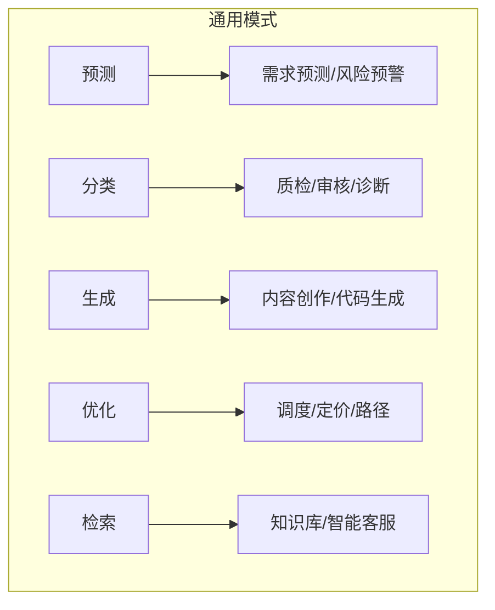
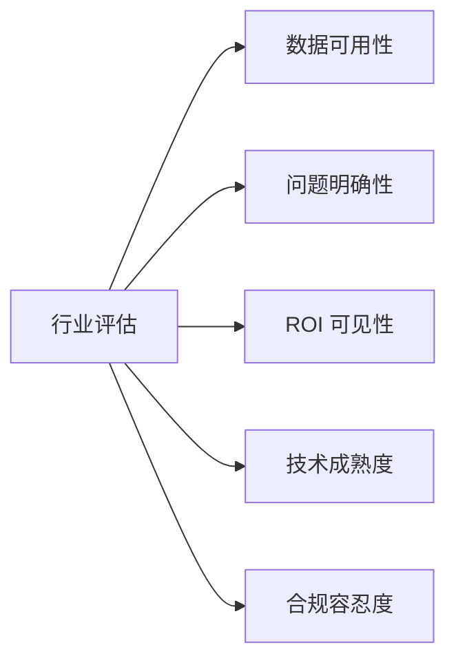
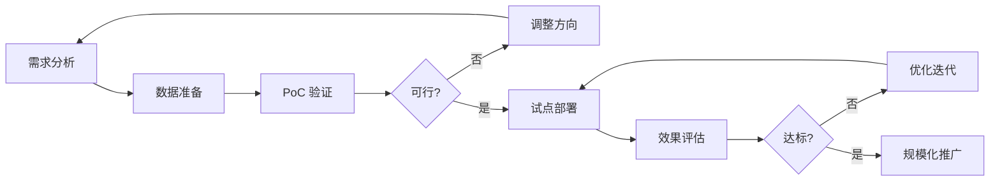
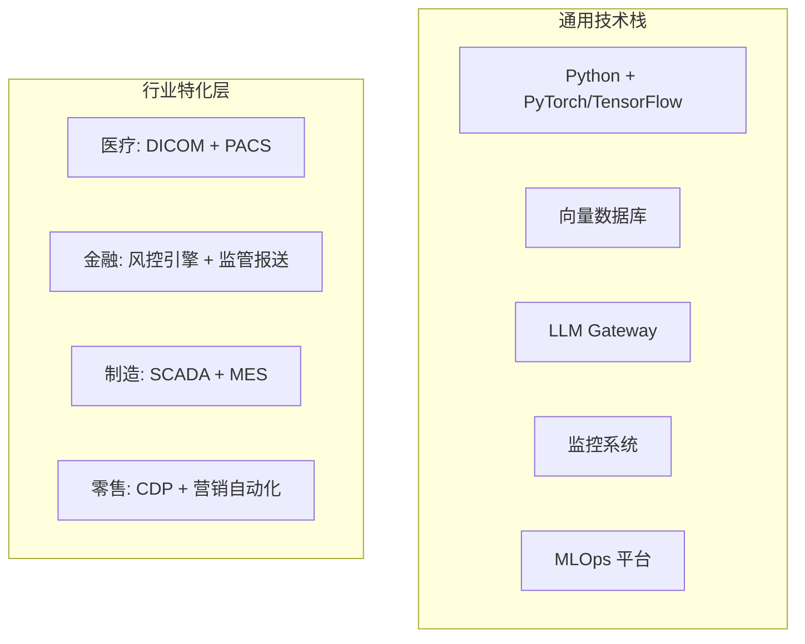
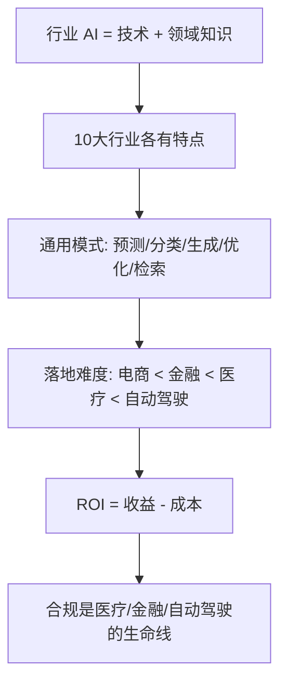

# AI 行业应用速成指南

> **一句话理解**: AI 在行业中就像"智能杠杆"——找准支点（痛点），用最小的技术投入撬动最大的业务价值。

---

## 🤔 为什么行业应用是 AI 落地的最后一公里？

技术再先进，不解决实际问题就没有价值。行业应用是连接 AI 能力与业务价值的桥梁。


---

## 🏭 十大行业 AI 应用速览

### 1. 医疗健康 (Healthcare)

AI 辅助影像诊断、药物发现、个性化治疗方案。FDA 已批准超 1000 款 AI 医疗设备，AI 在放射影像中的准确率已接近或超越人类专家水平。

| 应用 | 成熟度 | 代表案例 |
|------|--------|----------|
| 医学影像分析 | 高 | Google DeepMind 眼科诊断 |
| 药物研发 | 中 | AlphaFold 蛋白质结构预测 |
| 智能问诊 | 中 | Babylon Health |

### 2. 金融服务 (Finance)

AI 驱动风控、算法交易、智能投顾和反欺诈。2026 年 88% 的金融机构报告 AI 显著提升了年收入，AI 风控模型将欺诈检测率提升 50% 以上。

| 应用 | 成熟度 | 代表案例 |
|------|--------|----------|
| 反欺诈 | 高 | 支付宝实时风控 |
| 智能投顾 | 高 | Betterment、蚂蚁财富的智能配置 |
| 信用评估 | 高 | Zest AI 替代传统评分卡 |

### 3. 制造业 (Manufacturing)

AI 视觉质检、预测性维护、供应链优化和数字孪生。PepsiCo 用 AI 数字孪生提升产能 20%，视觉质检漏检率降低 90%。

| 应用 | 成熟度 | 代表案例 |
|------|--------|----------|
| 视觉质检 | 高 | 特斯拉产线缺陷检测 |
| 预测性维护 | 高 | 西门子 MindSphere |
| 数字孪生 | 中 | 波音飞机数字孪生 |

### 4. 零售电商 (Retail & E-commerce)

AI 推荐系统、动态定价、需求预测和智能客服。亚马逊 35% 的销售额来自推荐系统，AI 客服已能处理 80% 的常见咨询。

| 应用 | 成熟度 | 代表案例 |
|------|--------|----------|
| 个性化推荐 | 高 | 亚马逊、淘宝推荐引擎 |
| 动态定价 | 高 | 航空公司、Uber surge pricing |
| 需求预测 | 高 | Walmart 库存优化 |

### 5. 自动驾驶 (Autonomous Driving)

端到端 AI 架构成为技术主流。Waymo 在美国多城市运营 Robotaxi，Tesla FSD 累计行驶超 30 亿英里，中国 L4 级无人出租车在武汉、北京规模运营。

| 应用 | 成熟度 | 代表案例 |
|------|--------|----------|
| L2+ 辅助驾驶 | 高 | Tesla FSD、小鹏 NGP |
| L4 Robotaxi | 中 | Waymo、百度萝卜快跑 |
| 无人配送 | 中 | Nuro、美团无人车 |

### 6. 内容媒体 (Content & Media)

AI 生成文本、图像、视频和音频。Midjourney、Runway、Suno 等工具让内容创作门槛大幅降低，但也带来了版权和真实性问题。

| 应用 | 成熟度 | 代表案例 |
|------|--------|----------|
| 文本生成 | 高 | ChatGPT、Jasper |
| 图像生成 | 高 | Midjourney、DALL-E |
| 视频生成 | 中 | Runway Gen-3、Sora |

### 7. 教育 (Education)

AI 个性化学习、自动批改、智能助教。Khan Academy 的 Khanmigo 已服务数百万学生，AI 个性化学习可提升学习效果 30%。

| 应用 | 成熟度 | 代表案例 |
|------|--------|----------|
| 个性化辅导 | 中 | Khanmigo、松鼠 AI |
| 自动批改 | 高 | Gradescope |
| 语言学习 | 高 | Duolingo Max |

### 8. 法律政务 (Legal & Government)

AI 合同审查、法律检索、智能政务。Harvey AI 服务全球前 100 大律所中的 40+ 家，AI 合同审查效率提升 80%，智能政务覆盖全球 50+ 国家。

| 应用 | 成熟度 | 代表案例 |
|------|--------|----------|
| 合同审查 | 高 | Harvey AI、Kira Systems |
| 法律检索 | 高 | CoCounsel (Casetext) |
| 智能政务 | 中 | 新加坡 GovTech |

### 9. 农业 (Agriculture)

AI 精准农业、病虫害识别、产量预测。John Deere 的 AI 农机可实现厘米级精准播种，无人机巡检降低农药使用量 30%。

| 应用 | 成熟度 | 代表案例 |
|------|--------|----------|
| 精准农业 | 中 | John Deere See & Spray |
| 病虫害识别 | 高 | Plantix 作物医生 |
| 产量预测 | 中 | Climate FieldView |

### 10. 能源气候 (Energy & Climate)

AI 电网优化、可再生能源预测、核聚变研究加速。Google 用 AI 将数据中心能耗降低 30%，AI 加速核聚变等离子体控制研究。

| 应用 | 成熟度 | 代表案例 |
|------|--------|----------|
| 电网优化 | 中 | DeepMind 风电预测 |
| 智能楼宇 | 高 | Nest 温控系统 |
| 材料发现 | 中 | GNoME 新材料发现 |

---

## 🔗 跨行业通用 AI 模式

### 常见 AI 模式矩阵



| 模式 | 描述 | 适用行业 |
|------|------|----------|
| **预测 (Prediction)** | 基于历史数据预测未来 | 金融、零售、能源 |
| **分类 (Classification)** | 将对象分到预定义类别 | 医疗、制造、内容 |
| **生成 (Generation)** | 创造新内容 | 媒体、教育、设计 |
| **优化 (Optimization)** | 在约束下找最优解 | 物流、制造、金融 |
| **检索 (Retrieval)** | 从海量数据找相关信息 | 法律、政务、客服 |

---

## 📋 行业选择决策框架

### 选择标准



| 维度 | 高优先级行业 | 低优先级行业 |
|------|--------------|--------------|
| 数据可用性 | 电商、金融 | 传统制造（数据孤岛） |
| 问题明确性 | 客服、质检 | 战略决策 |
| ROI 可见性 | 营销、风控 | 基础研究 |
| 技术成熟度 | 推荐、NLP | 通用机器人 |
| 合规容忍度 | 营销 | 医疗、自动驾驶 |

### 行业落地难度评估

| 行业 | 技术难度 | 数据难度 | 合规难度 | 综合落地难度 |
|------|----------|----------|----------|--------------|
| 电商推荐 | ⭐ | ⭐ | ⭐ | 低 |
| 金融风控 | ⭐⭐ | ⭐⭐ | ⭐⭐⭐ | 中 |
| 医疗影像 | ⭐⭐ | ⭐⭐⭐ | ⭐⭐⭐⭐ | 高 |
| 自动驾驶 | ⭐⭐⭐⭐ | ⭐⭐⭐ | ⭐⭐⭐⭐⭐ | 极高 |

---

## 💰 ROI 估算基础

### ROI 计算框架

```
ROI = (AI 带来的收益 - AI 投入成本) / AI 投入成本 × 100%

收益包括:
- 效率提升 (节省人力 × 人效)
- 错误减少 (避免损失)
- 收入增长 (转化率提升 × 流量)
- 成本降低 (能耗、库存优化)

成本包括:
- 开发成本 (人力 × 时间)
- 算力成本 (GPU/TPU)
- 数据成本 (标注、清洗)
- 运维成本 (监控、迭代)
```

### 行业 ROI 参考

| 应用 | 典型 ROI 周期 | 预期回报 |
|------|---------------|----------|
| 智能客服 | 3-6 个月 | 人力成本降低 40-60% |
| 推荐系统 | 6-12 个月 | 转化率提升 10-30% |
| 视觉质检 | 6-12 个月 | 漏检率降低 80%+ |
| 预测性维护 | 12-24 个月 | 停机减少 30-50% |

---

## ⚖️ 合规考量速查

### 各行业关键合规要求

| 行业 | 关键法规 | 核心关注点 |
|------|----------|------------|
| 医疗 | FDA/NMPA、HIPAA/GDPR | 安全性、数据隐私 |
| 金融 | SEC/银保监会、GDPR | 公平性、可解释性 |
| 自动驾驶 | DOT/工信部 | 安全标准、责任认定 |
| 教育 | FERPA/个人信息保护法 | 未成年人保护、数据安全 |
| 政务 | 政府数据开放条例 | 透明性、问责制 |

### 实施路线图



| 阶段 | 周期 | 关键产出 | 投入规模 |
|------|------|----------|----------|
| 需求分析 | 2-4 周 | 痛点清单、可行性初判 | 小 |
| 数据准备 | 4-8 周 | 清洗后的数据集 | 中 |
| PoC 验证 | 4-8 周 | 可演示的 demo | 中 |
| 试点部署 | 8-12 周 | 生产环境运行 | 大 |
| 规模推广 | 3-6 月 | 全量业务覆盖 | 大 |

### 成功与失败因素

| 成功因素 | 失败因素 |
|----------|----------|
| 业务方深度参与 | 技术团队闭门造车 |
| 数据质量优先 | 忽视数据治理 |
| 小步快跑迭代 | 一上来就想做全 |
| 明确的成功指标 | 没有量化目标 |
| 组织变革配套 | 只买工具不改造流程 |

### 跨行业技术栈参考



### 行业技术成熟度曲线


| 阶段 | 行业应用 | 投资建议 |
|------|----------|----------|
| 生产成熟 | 推荐系统、智能客服、风控 | 大规模投入 |
| 稳步爬升 | 代码生成、文档处理、质检 | 积极试点 |
| 期望膨胀 | 自动驾驶 L4、通用机器人 | 谨慎跟进 |
| 技术萌芽 | 通用人工智能、脑机接口 | 关注研究 |

### 行业数据成熟度评估

| 数据特征 | 低成熟度 | 高成熟度 |
|----------|----------|----------|
| 结构化程度 | 大量非结构化文档 | 标准化数据库 |
| 标注质量 | 无标注或错误多 | 高质量标注 |
| 数据量 | 样本太少 (<1000) | 充足样本 (>10000) |
| 可获取性 | 孤岛、权限复杂 | 集中、易访问 |
| 实时性 | 批处理、T+1 | 实时流 |

### 数字化转型 vs AI 转型


| 阶段 | 特征 | 例子 |
|------|------|------|
| **信息化** | 记录数据 | Excel 记账 |
| **数字化** | 流程在线 | ERP 系统 |
| **智能化** | 自动决策 | AI 风控审批 |
| **自主化** | 自我优化 | AI 自动调整策略 |

### 行业 AI 落地 Checklist

```
评估一个 AI 项目是否值得做:

□ 问题是否明确？（不是要"用 AI"，而是要"解决 XX 问题"）
□ 数据是否可得？（有数据、能获取、质量可接受）
□ 是否有衡量标准？（怎么算成功？ROI 怎么算？）
□ 技术是否成熟？（不是做基础研究，而是应用已知技术）
□ 组织是否准备好？（有预算、有人、有耐心）
□ 合规是否可行？（不违反法规、不触碰伦理红线）

6 个都满足 → 大胆做
缺 1-2 个 → 补齐后再做
缺 3 个以上 → 先放一放
```

---

## ❓ 常见问题 (FAQ)

### Q1: 哪些行业最适合 AI 初学者切入？

**A**: 推荐顺序：
1. **电商/零售**：数据丰富，问题明确，ROI 快
2. **内容媒体**：工具成熟，试错成本低
3. **金融风控**：需求强烈，但合规要求高
4. **制造质检**：视觉技术成熟，场景标准化

### Q2: 如何估算一个 AI 项目的 ROI？

**A**: 三步法：
1. **量化痛点**: 当前问题造成多少损失？（如客服人力成本 100万/年）
2. **估算提升**: AI 能解决多少？（如替代 60% 简单咨询）
3. **计算净收益**: 收益 - 开发运维成本

### Q3: AI 落地最大的障碍是什么？

**A**: 不是技术，而是：
- **数据质量差**：脏数据、数据孤岛
- **业务理解不足**：技术团队不懂业务
- **期望管理不当**：以为 AI 万能
- **组织阻力**：担心被替代

### Q4: 跨行业 AI 解决方案可以复用吗？

**A**: 基础技术可以，业务逻辑不行。

| 可复用 | 不可复用 |
|--------|----------|
| 图像分类模型 | 业务规则 |
| NLP 基础能力 | 行业知识图谱 |
| 推荐算法框架 | 用户行为模式 |
| MLOps 流水线 | 合规要求 |

### Q5: 传统行业如何开始 AI 转型？

**A**: 
1. **找痛点**: 选一个数据相对好获取、ROI 可见的场景
2. **做 PoC**: 2-3 个月验证可行性
3. **建数据基础**: 数据治理是前提
4. **培养团队**: 业务 + 技术的复合人才
5. **持续迭代**: AI 不是一次性项目

---

## 📚 核心要点



---

## 🔗 相关主题

- [行业应用完整版](./AI_Applications_Industry.md) —— 深入各行业案例
- [行业应用 - 小白版](./AI_Applications_Industry_for_dummy.md) —— 零基础入门
- [医疗 AI](Healthcare/) —— 医疗行业深度
- [金融 AI](Finance/) —— 金融行业深度
- [自动驾驶](Autonomous_Driving/) —— 自动驾驶深度
- [AI 伦理安全速成指南](../伦理安全/Ethics-in-nutshell.md) —— 合规基础

---

*Last updated: 2026-05-07*

## Related

- [[行业应用/Industry_Comparison_2026.md|Industry_Comparison_2026]]
- [[行业应用/README.md|行业应用 README]]
- [[行业应用/README_for_dummy.md|README_for_dummy]]
- [[行业应用/Agriculture/AI_Agriculture_2026.md|AI_Agriculture_2026]]
- [[行业应用/Autonomous_Driving/AI_Autonomous_Driving_2026.md|AI_Autonomous_Driving_2026]]
