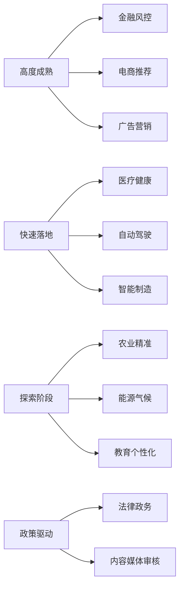
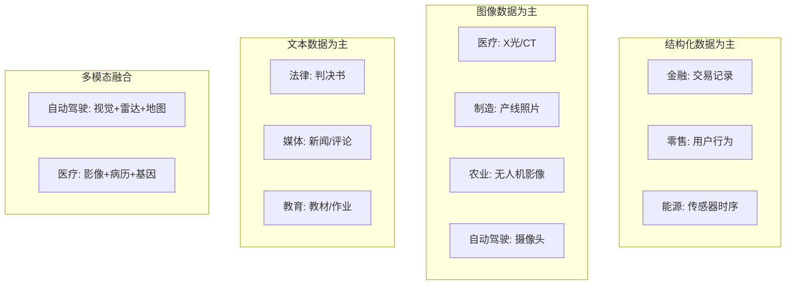
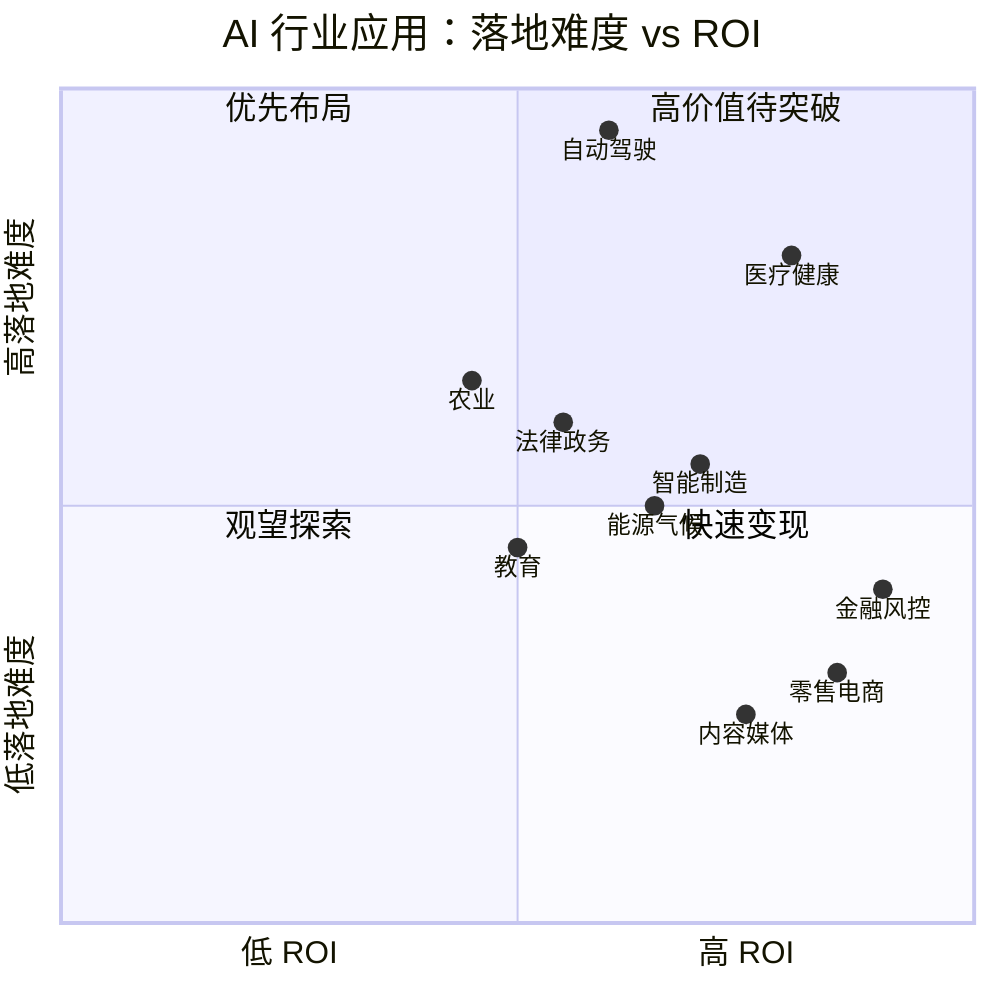

# AI 行业应用对比 2026 (Industry Comparison)

> **一句话理解**: 本章节横向对比 10 大行业的 AI 应用现状——从成熟度、数据特点、技术方案到合规要求，帮助你快速判断哪个行业的 AI 机会最适合你。

---

## 行业 AI 成熟度总览

| 行业 | AI 成熟度 | 数据丰富度 | 合规要求 | ROI 可见性 | 技术难度 |
|------|----------|-----------|---------|-----------|---------|
| **金融** | ⭐⭐⭐⭐⭐ | ⭐⭐⭐⭐⭐ | ⭐⭐⭐⭐⭐ | ⭐⭐⭐⭐⭐ | ⭐⭐⭐⭐ |
| **零售电商** | ⭐⭐⭐⭐⭐ | ⭐⭐⭐⭐⭐ | ⭐⭐⭐ | ⭐⭐⭐⭐⭐ | ⭐⭐⭐ |
| **医疗健康** | ⭐⭐⭐⭐ | ⭐⭐⭐ | ⭐⭐⭐⭐⭐ | ⭐⭐⭐⭐ | ⭐⭐⭐⭐⭐ |
| **自动驾驶** | ⭐⭐⭐ | ⭐⭐⭐⭐ | ⭐⭐⭐⭐⭐ | ⭐⭐ | ⭐⭐⭐⭐⭐ |
| **制造** | ⭐⭐⭐⭐ | ⭐⭐⭐ | ⭐⭐⭐ | ⭐⭐⭐⭐ | ⭐⭐⭐⭐ |
| **内容媒体** | ⭐⭐⭐⭐⭐ | ⭐⭐⭐⭐⭐ | ⭐⭐⭐⭐ | ⭐⭐⭐⭐ | ⭐⭐⭐ |
| **教育** | ⭐⭐⭐ | ⭐⭐⭐ | ⭐⭐⭐ | ⭐⭐⭐ | ⭐⭐⭐ |
| **农业** | ⭐⭐ | ⭐⭐ | ⭐⭐ | ⭐⭐⭐ | ⭐⭐⭐ |
| **能源气候** | ⭐⭐⭐ | ⭐⭐⭐⭐ | ⭐⭐⭐ | ⭐⭐⭐⭐ | ⭐⭐⭐⭐ |
| **法律政务** | ⭐⭐⭐ | ⭐⭐⭐ | ⭐⭐⭐⭐⭐ | ⭐⭐⭐ | ⭐⭐⭐⭐ |

---

## 核心应用场景矩阵

| 应用场景 | 金融 | 医疗 | 零售 | 制造 | 自动驾驶 | 媒体 | 教育 | 农业 | 能源 | 法律 |
|---------|------|------|------|------|---------|------|------|------|------|------|
| **预测/预报** | ✅ 风控 | ✅ 疾病 | ✅ 销量 | ✅ 维护 | ✅ 轨迹 | ✅ 热度 | ✅ 成绩 | ✅ 产量 | ✅ 发电 | ✅ 案件 |
| **分类/识别** | ✅ 欺诈 | ✅ 影像 | ✅ 商品 | ✅ 缺陷 | ✅ 障碍物 | ✅ 审核 | ✅ 作业 | ✅ 病虫害 | ✅ 故障 | ✅ 文书 |
| **生成/创作** | ✅ 报告 | ✅ 病历 | ✅ 文案 | ✅ 设计 | ❌ | ✅ 内容 | ✅ 题目 | ❌ | ❌ | ✅ 合同 |
| **优化/调度** | ✅ 组合 | ✅ 资源 | ✅ 库存 | ✅ 排产 | ✅ 路径 | ✅ 推荐 | ✅ 路径 | ✅ 灌溉 | ✅ 电网 | ✅ 流程 |
| **对话/服务** | ✅ 客服 | ✅ 导诊 | ✅ 导购 | ✅ 培训 | ❌ | ❌ | ✅ 助教 | ❌ | ✅ 客服 | ✅ 咨询 |

---

## 数据特点对比

| 行业 | 主要数据类型 | 数据质量 | 标注难度 | 隐私敏感度 |
|------|------------|---------|---------|-----------|
| **金融** | 结构化交易数据 | 高 | 低 | 极高 |
| **医疗** | 影像 + 电子病历 | 中 | 高 | 极高 |
| **零售** | 行为日志 + 商品图 | 高 | 低 | 中 |
| **制造** | 传感器 + 视觉 | 中 | 中 | 低 |
| **自动驾驶** | 视觉 + 点云 + 轨迹 | 高 | 极高 | 中 |
| **媒体** | 文本 + 图像 + 视频 | 中 | 中 | 低 |
| **教育** | 文本 + 行为数据 | 低 | 中 | 高 |
| **农业** | 卫星影像 + 气象 | 中 | 高 | 低 |
| **能源** | 时序传感器数据 | 高 | 低 | 中 |
| **法律** | 文本 + 结构化字段 | 高 | 中 | 高 |

---

## 技术方案选型指南

### 按行业推荐技术栈

| 行业 | 推荐模型类型 | 推荐框架 | 部署特点 |
|------|------------|---------|---------|
| **金融** | 梯度提升树 + 小模型 | XGBoost, LightGBM | 本地部署，解释性优先 |
| **医疗** | CNN + Transformer | PyTorch, MONAI | 边缘 + 云端混合 |
| **零售** | 推荐系统 + LLM | TensorFlow, PyTorch | 高并发在线服务 |
| **制造** | CNN + 时序模型 | OpenCV, PyTorch | 边缘计算为主 |
| **自动驾驶** | 多模态融合 + BEV | PyTorch, ONNX | 车端 + 云端协同 |
| **媒体** | Diffusion + LLM | Diffusers, vLLM | GPU 密集型 |
| **教育** | 知识图谱 + LLM | LangChain, PyTorch | 个性化推理 |
| **农业** | CNN + 卫星图像处理 | PyTorch, GDAL | 低带宽环境 |
| **能源** | 时序预测 + 优化 | Prophet, OR-Tools | 实时性要求高 |
| **法律** | LLM + RAG | LangChain, Elasticsearch | 知识库驱动 |

---

## 合规与伦理要求对比

| 行业 | 关键法规 | 算法备案 | 可解释性要求 | 人工审核 |
|------|---------|---------|-------------|---------|
| **金融** | 巴塞尔协议、央行算法备案 | 强制 | 高（授信决策） | 必须 |
| **医疗** | FDA/NMPA、HIPAA/个人信息保护法 | 器械注册 | 极高（诊断辅助） | 必须 |
| **零售** | 消费者权益保护法 | 无 | 低 | 无 |
| **自动驾驶** | 道路交通法规、准入试点 | 强制 | 高（事故责任） | 紧急接管 |
| **法律** | 司法数据安全规定 | 内部 | 高 | 必须 |
| **教育** | 教育数据安全规范 | 无 | 中 | 推荐 |

---

## ROI 与落地难度评估

### 投资建议

| 象限 | 行业 | 策略 |
|------|------|------|
| **快速变现** | 零售电商、内容媒体 | 立即投入，成熟方案多 |
| **优先布局** | 金融风控、智能制造 | 重点投入，壁垒高 |
| **高价值待突破** | 医疗健康、自动驾驶 | 长期投入，技术未成熟 |
| **观望探索** | 农业、法律 | 试点为主，等待生态成熟 |

---

## 跨行业通用模式

尽管行业差异巨大，但以下 AI 模式具有通用性：

| 通用模式 | 描述 | 跨行业例子 |
|---------|------|----------|
| **异常检测** | 找出与正常模式不符的数据点 | 金融欺诈、医疗病灶、制造缺陷 |
| **需求预测** | 预测未来需求量 | 零售销量、能源负荷、农业产量 |
| **个性化推荐** | 根据用户偏好推荐内容 | 电商商品、教育课程、媒体内容 |
| **智能客服** | 自动回答常见问题 | 金融、医疗、零售、能源 |
| **文档理解** | 从非结构化文本提取信息 | 法律合同、医疗病历、政务文件 |

---

## 各章节导航

| 行业 | 专题文档 |
|------|---------|
| 农业 | [Agriculture](./Agriculture/) |
| 自动驾驶 | [Autonomous Driving](./Autonomous_Driving/) |
| 内容媒体 | [Content Media](./Content_Media/) |
| 教育 | [Education](./Education/) |
| 能源气候 | [Energy & Climate](./Energy_Climate/) |
| 金融 | [Finance](./Finance/) |
| 医疗健康 | [Healthcare](./Healthcare/) |
| 法律政务 | [Legal & Government](./Legal_Government/) |
| 制造 | [Manufacturing](./Manufacturing/) |
| 零售电商 | [Retail & E-commerce](./Retail_Ecommerce/) |

---

*Last updated: 2026-05-07*

## Related

- [[18_AI_Applications_Industry/Energy_Climate/AI_Energy_Climate_2026]] — AI 能源与气候行业应用 (2025-2026) (共享: ai-applications, finance, healthcare, industry)
- [[18_AI_Applications_Industry/README]] — 13 - AI应用与行业融合 (共享: ai-applications, finance, healthcare, industry)
- [[18_AI_Applications_Industry/README_for_dummy]] — AI 行业应用 — 小白版 🏭 (共享: ai-applications, finance, healthcare, industry)
