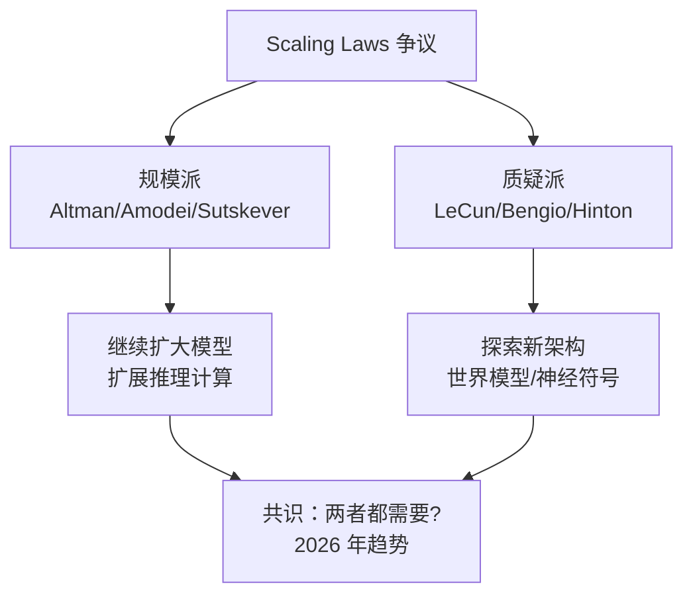
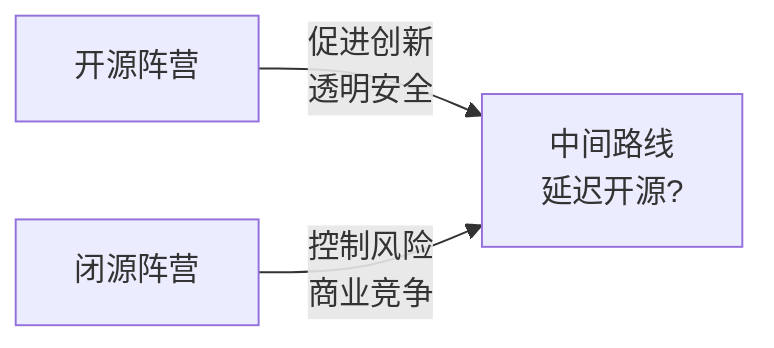
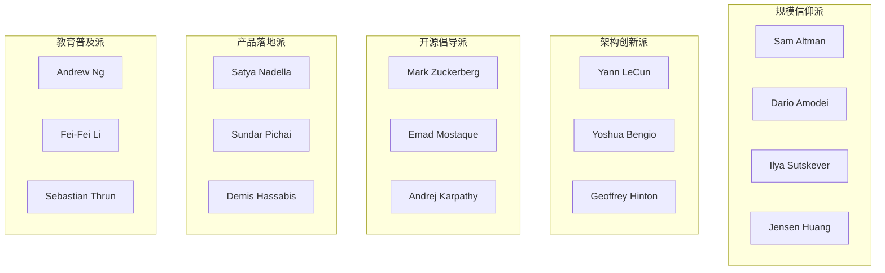

# AI 领袖观点合成 2026 (Talks Synthesis)

> **一句话理解**: 本章节横向整合 20+ 位 AI 领袖的核心观点，按主题分类呈现，帮助你从"辩论双方"的视角理解 AI 发展中的关键分歧与共识。

---

## 主题一：Scaling Laws —— 越大越好？

### 核心争议

**"规模派"认为**：只要模型够大、数据够多、算力够强，智能就会涌现。

| 支持者 | 核心观点 |
|--------|---------|
| **Sam Altman** | "Scaling 是通往 AGI 的最可靠路径" |
| **Dario Amodei** | "每次规模提升 10 倍，模型能力出现质的飞跃" |
| **Ilya Sutskever** | "预训练将结束，但推理时的计算扩展才刚刚开始" |
| **Jensen Huang** | "买更多 GPU！AI 需要算力基建" |

**"质疑派"认为**：纯 Scaling 有天花板，需要新架构和新范式。

| 质疑者 | 核心观点 |
|--------|---------|
| **Yann LeCun** | "LLM 不是通往 AGI 的路，需要世界模型" |
| **Yoshua Bengio** | "Scaling 带来风险，安全必须同步 Scaling" |
| **Geoffrey Hinton** | "我担心 AI 的进化速度超过我们的控制能力" |

### 合成视角

**2026 年共识**：纯 Scaling 边际效益递减，但"测试时计算扩展"（Test-Time Compute，如 o1/R1）成为新方向。

---

## 主题二：开源 vs 闭源 —— AI 应该开放吗？

### 双方论点

**开源倡导者**：

| 人物 | 观点 |
|------|------|
| **Yann LeCun** | "开源是安全的，因为更多眼睛可以发现漏洞" |
| **Mark Zuckerberg** | "LLaMA 开源让 Meta 成为行业标准" |
| **Emad Mostaque** | "Stable Diffusion 开源推动了整个生成式 AI 生态" |
| **Andrej Karpathy** | "开源加速创新，降低准入门槛" |

**闭源支持者**：

| 人物 | 观点 |
|------|------|
| **Dario Amodei** | "Anthropic 选择闭源是为了安全可控地释放能力" |
| **Sam Altman** | "GPT-4 级别的模型需要谨慎管理" |
| **Demis Hassabis** | "前沿研究需要负责任地部署" |

### 合成视角

**2026 年态势**：开源模型（Llama 3、DeepSeek、Qwen）能力逼近闭源模型，闭源厂商转向"延迟开源"策略（先闭源，后开源旧版本）。

---

## 主题三：AI 安全与对齐 —— 何时行动？

### 安全焦虑派

| 人物 | 警告 |
|------|------|
| **Geoffrey Hinton** | "AI 可能像原子弹一样改变历史，但我们还没有类似联合国原子能机构的监管" |
| **Yoshua Bengio** | "我们需要暂停超大型模型的训练，直到解决对齐问题" |
| **Stuart Russell**（补充） | "AI 的目标设定必须内置不可更改的约束" |

### 实用主义派

| 人物 | 观点 |
|------|------|
| **Yann LeCun** | "担忧被过度夸大，现在的 AI 连猫都不如" |
| **Jensen Huang** | "AI 安全应该通过技术迭代解决，不是暂停" |
| **Bill Gates** | "AI 的风险真实，但收益更大，关键是管理而非禁止" |

### 合成视角

**共识**：所有人都同意 AI 安全重要，分歧在于" urgency"和"方法"。

| 维度 | 共识 | 分歧 |
|------|------|------|
| **AI 风险存在？** | ✅ 同意 | 程度不同 |
| **需要监管？** | ✅ 同意 | 形式不同 |
| **现在暂停？** | ❌ 分歧 | Hinton/Bengio 支持，LeCun/Huang 反对 |
| **技术 vs 政策** | ⚠️ 分歧 | 技术解决优先 vs 政策约束优先 |

---

## 主题四：Agent 与未来形态 —— AI 的下一步

### Agent 乐观派

| 人物 | 愿景 |
|------|------|
| **Sam Altman** | "Agent 将能独立完成复杂任务，如编程、研究、决策" |
| **Andrej Karpathy** | "Vibe Coding：人类描述，Agent 实现" |
| **Satya Nadella** | "Copilot 将成为每个人的 AI 同事" |
| **Demis Hassabis** | "Agent 需要世界模型和长期规划能力" |

### 谨慎派

| 人物 | 提醒 |
|------|------|
| **Ilya Sutskever** | "Superalignment：如何控制比自己聪明的系统？" |
| **Dario Amodei** | "Agent 的能力增长必须与安全措施同步" |

---

## 主题五：中国 AI 与全球格局

### 观点光谱

| 人物 | 观点 |
|------|------|
| **Jensen Huang** | "中国 AI 进展迅速，全球需要合作而非脱钩" |
| **Bill Gates** | "技术封锁适得其反，会加速中国自研" |
| **部分美国政客** | "AI 芯片出口管制是必要安全措施" |

**2026 年现实**：DeepSeek、Qwen、Kimi 证明中国在 LLM 领域已处于第一梯队，芯片管制倒逼架构创新（如 MoE、投机解码）。

---

## 主题六：教育与人才培养

| 人物 | 教育理念 |
|------|---------|
| **Andrew Ng** | "AI 素养应该像数学一样普及" |
| **Andrej Karpathy** | "最好的学习方式是动手做项目" |
| **Fei-Fei Li** | "AI 教育必须包含伦理和社会影响" |
| **Sebastian Thrun** | "在线教育让全球都能接触顶尖 AI 课程" |

---

## 人物速查：谁是哪一派的？

---

## 如何阅读 Talks 章节

### 按主题研究
1. 选择你关心的主题（如 Scaling Laws）
2. 阅读本文件的"双方观点"
3. 点击具体人物链接，深入了解其完整观点
4. 形成自己的判断

### 按人物研究
1. 从 [Talks 目录](./README.md) 选择感兴趣的人物
2. 阅读 `about.md` 了解背景
3. 阅读 `sayings.md` 获取金句和来源
4. 回到本文件查看该人物在哪些主题中活跃

---

## 与其他章节的关联

- [AI 历史](../00_AI_Introduction/AI_History_Timeline.md) — 演讲者贡献与历史时间线
- [AI 伦理](../00_AI_Introduction/AI_Ethics_Society.md) — AI 安全争议的深入分析
- [AI 未来趋势](../00_AI_Introduction/AI_Future_Trends.md) — 行业前瞻判断的汇总
- [Agent 生产](../15_Agent_Production/README.md) — Agent 技术实现

---

*Last updated: 2026-05-07*

## Related

- [[19_Talks/Andrej_Karpathy/about.md|about]]
- [[19_Talks/Andrew_Ng/about.md|about]]
- [[19_Talks/Andrew_Ng/sayings.md|sayings]]
- [[19_Talks/Bill_Gates/about.md|about]]
- [[19_Talks/Bill_Gates/sayings.md|sayings]]
