# Mixture of Experts 深度解读 (从 Switch Transformers 到 Mixtral 和 DeepSeek)

> **一句话理解**: MoE 就像一个"超级医院"——有几十个专科医生（专家），每个病人进来只看最相关的几个，既享受了全科室的智慧，又只花了看一两个医生的费用，让模型在保持推理成本可控的同时拥有超大参数容量。

---

## 论文基本信息

| 属性 | 内容 |
|------|------|
| **核心论文 1** | Switch Transformers: Scaling to Trillion Parameter Models with Simple and Efficient Sparsity |
| **Switch 作者** | William Fedus, Barret Zoph, Noam Shazeer (Google) |
| **发表** | JMLR 2022 |
| **论文链接** | [arXiv:2101.03961](https://arxiv.org/abs/2101.03961) |
| **核心论文 2** | Mixtral of Experts |
| **Mixtral 作者** | Albert Q. Jiang 等 (Mistral AI) |
| **发表** | 2024 |
| **论文链接** | [arXiv:2401.04088](https://arxiv.org/abs/2401.04088) |

---

## 1. 历史背景：为什么需要 MoE？

### 1.1 Dense 模型的困境

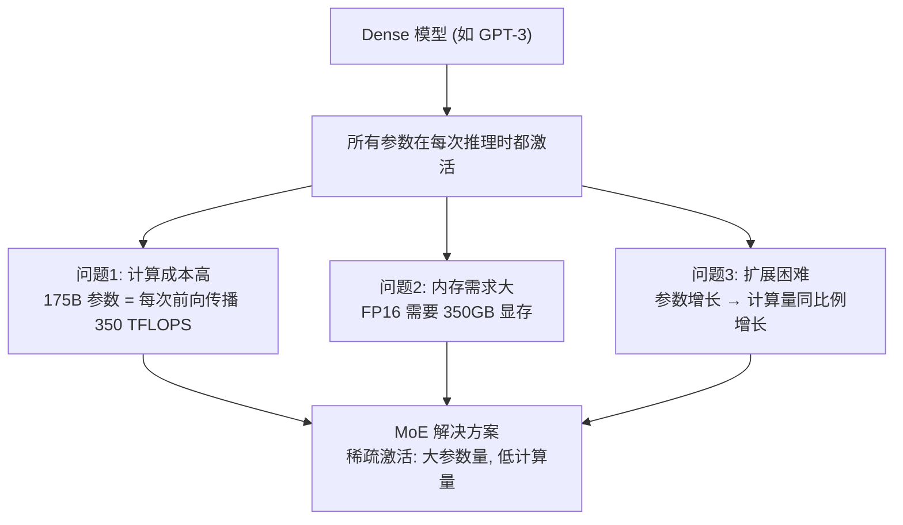

### 1.2 MoE 的核心思想

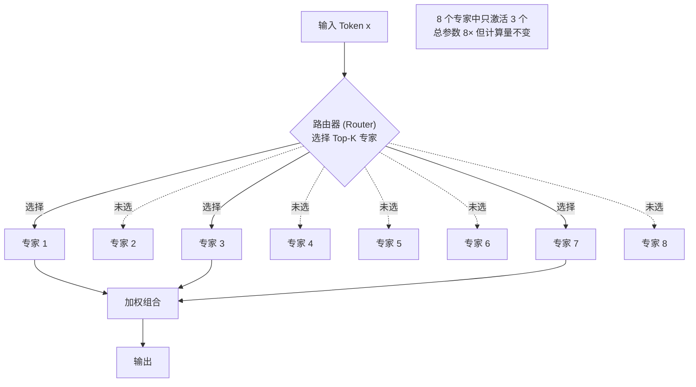

### 1.3 MoE 的发展时间线

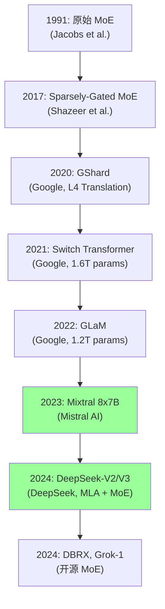

---

## 2. MoE 架构详解

### 2.1 标准Transformer vs MoE Transformer

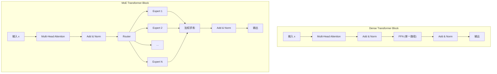

**关键区别**：Dense 模型的 FFN 被替换为 MoE 层（Router + 多个 Expert FFN）。

### 2.2 路由机制 (Routing)

#### Top-K 路由

$$
\text{Router}(x) = \text{TopK}(\text{softmax}(W_r \cdot x))
$$

$$
\text{Output} = \sum_{i \in \text{TopK}} g_i(x) \cdot E_i(x)
$$

其中 $g_i(x)$ 是路由权重，$E_i(x)$ 是专家 $i$ 的输出。

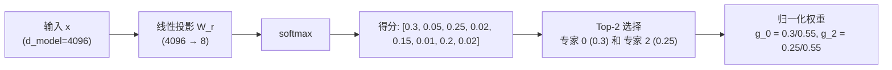

#### 路由变体对比

| 路由策略 | 公式/方法 | 优点 | 缺点 |
|---------|----------|------|------|
| **Top-1** | 只选最高分的 1 个专家 | 最简单、最快 | 表达力受限 |
| **Top-2** | 选最高的 2 个专家 | 效果好 | 略复杂 |
| **Expert Choice** | 专家选择 token | 天然负载均衡 | 实现复杂 |
| **Hash 路由** | 固定规则分配 | 确定性，无训练 | 灵活性差 |
| **BASE** | 最优传输 | 最优分配 | 计算昂贵 |

### 2.3 负载均衡 (Load Balancing)

**核心问题**：如果所有 token 都选择同一个专家，其他专家就浪费了。

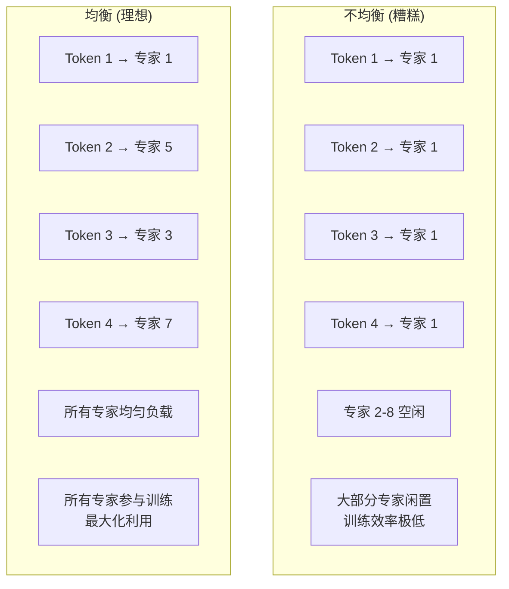

**Switch Transformer 的辅助损失**：

$$
\mathcal{L}_{\text{aux}} = \alpha \cdot N \cdot \sum_{i=1}^{N} f_i \cdot P_i
$$

其中：
- $f_i = \frac{\text{分配给专家 } i \text{ 的 token 数}}{T}$（专家 $i$ 的 token 比例）
- $P_i = \frac{1}{T} \sum_{j=1}^{T} p_{ij}$（专家 $i$ 的平均路由概率）
- $N$：专家数量
- $\alpha$：辅助损失系数（通常 0.01）

**直觉**：最小化 $f_i \cdot P_i$ 鼓励每个专家获得均等的 token 分配。

### 2.4 Expert Choice 路由

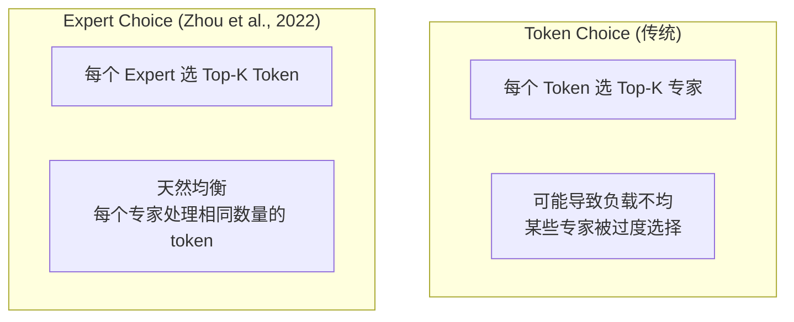

$$
\text{Expert Choice}: \text{每个专家 } i \text{ 选择 } \frac{B}{N} \times K \text{ 个 token}
$$

其中 $B$ 是 batch 中的 token 总数，$N$ 是专家数。

---

## 3. Switch Transformers

### 3.1 核心简化：Top-1 路由

Switch Transformer 的核心决策：**只用 Top-1 路由**（每个 token 只发给 1 个专家）。

| 设计选择 | Switch 理由 |
|---------|------------|
| **Top-1 vs Top-2** | Top-1 通信量减半，效果差距不大 |
| **专家数量** | 128 个 FFN 专家 |
| **容量因子** | 每个专家最多处理 $C = \lfloor B/N \cdot cf \rfloor$ 个 token |

### 3.2 Switch Transformer 架构

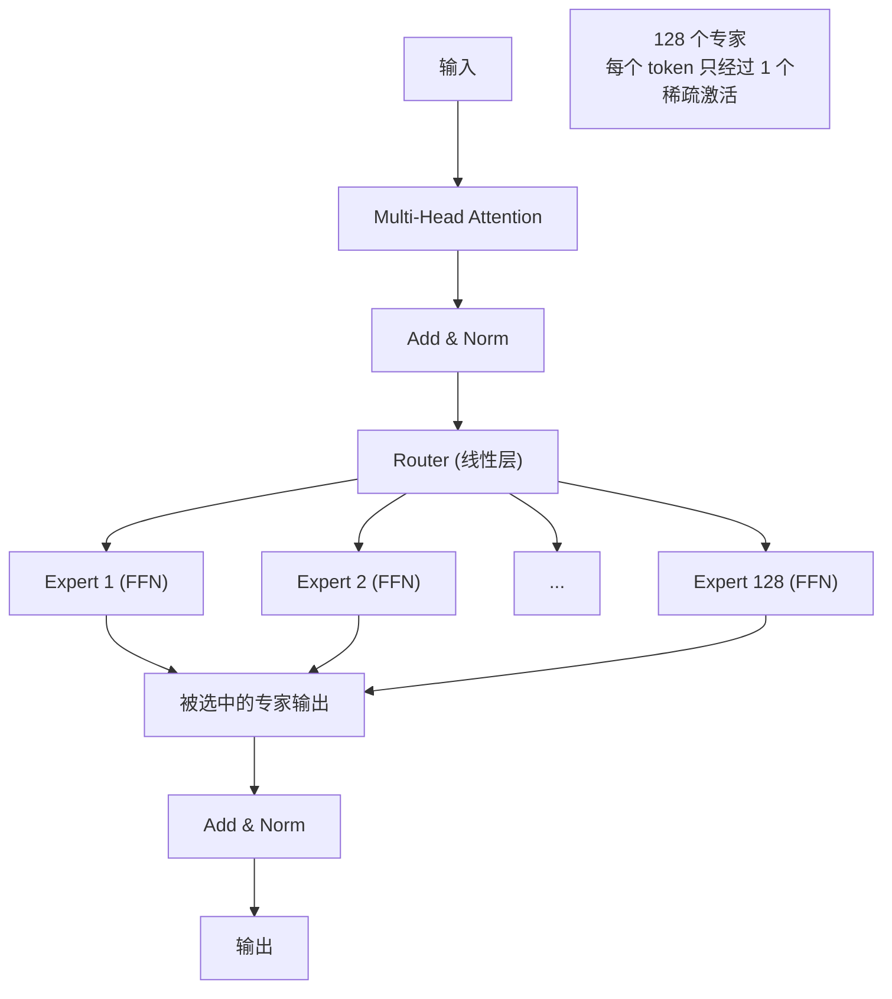

### 3.3 Switch Transformer 规格

| 模型 | 专家数 | 活跃参数 | 总参数 | 等效 Dense |
|------|--------|---------|--------|-----------|
| **Switch-Base** | 128 | 223M | 7.4B | ~6.6× 参数效率 |
| **Switch-Large** | 128 | 1.6B | 26.3B | — |
| **Switch-XXL** | 128 | 11.1B | 395B | — |
| **Switch-C** | 128 | 1.6B | **1.6T** | 1000× 参数效率 |

### 3.4 关键实验结果

| 对比 | T5-XXL (Dense) | Switch-XXL (MoE) |
|------|----------------|-------------------|
| **总参数** | 11B | 395B |
| **活跃参数** | 11B | 11B |
| **训练速度** | 基准 | **4-7× 更快** |
| **预训练困惑度** | 基准 | **显著更低** |
| **下游任务** | 基准 | **平均提升** |

**核心发现**：在相同计算预算下，Switch Transformer 比 Dense 模型**预训练快 4-7 倍**达到相同效果。

---

## 4. GShard：MoE 在大规模翻译中的应用

### 4.1 GShard 的贡献

| 贡献 | 说明 |
|------|------|
| **规模化** | 将 MoE 扩展到 600B 参数用于多语言翻译 |
| **分片策略** | 专家并行 (EP) + 数据并行 (DP) |
| **容量因子** | 引入专家容量和容量因子概念 |
| **辅助损失** | 改进的负载均衡损失 |

### 4.2 专家并行 (Expert Parallelism)

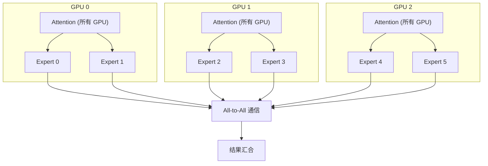

**通信模式**：
1. **Dispatch**：token 发送到对应专家所在的 GPU
2. **计算**：各 GPU 上专家计算
3. **Combine**：结果发送回原 GPU

---

## 5. Mixtral 8x7B

### 5.1 Mixtral 的设计

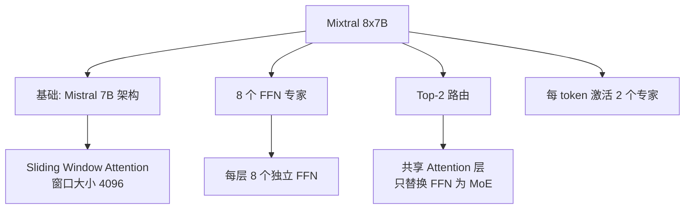

**关键设计决策**：

| 设计 | Mixtral 选择 | 原因 |
|------|-------------|------|
| **MoE 位置** | 只替换 FFN 层 | Attention 共享，减少参数 |
| **专家数** | 8 | 平衡多样性和效率 |
| **Top-K** | 2 | 效果好且计算可控 |
| **路由粒度** | Token 级别 | 每个 token 独立路由 |

### 5.2 Mixtral 参数分析

```
总参数量: ~46.7B (8 个专家的 FFN + 共享的 Attention)
活跃参数量: ~12.9B (每个 token: 1×Attention + 2×FFN)
参数效率: 3.6× (总参数/活跃参数)
```

```python
# Mixtral 8x7B 参数分解
d_model = 4096
ffn_dim = 14336
n_layers = 32
n_experts = 8
top_k = 2

# 共享部分 (每层)
attn_params = 4 * d_model * d_model  # Q, K, V, O projections

# MoE 部分 (每层)
expert_params = 3 * d_model * ffn_dim  # SwiGLU: gate, up, down
all_experts = n_experts * expert_params
router_params = d_model * n_experts  # Router

# 每层总参数
layer_params = attn_params + all_experts + router_params
all_layers = n_layers * layer_params

# 活跃参数 (每层)
active_expert_params = top_k * expert_params
active_layer = attn_params + active_expert_params
active_all = n_layers * active_layer

print(f"每层总参数:   {layer_params / 1e6:.1f}M")
print(f"每层活跃参数: {active_layer / 1e6:.1f}M")
print(f"所有层总参数: {all_layers / 1e9:.1f}B")
print(f"所有层活跃:   {active_all / 1e9:.1f}B")
print(f"稀疏比:       {all_layers / active_all:.1f}×")
```

### 5.3 Mixtral 性能对比

| 模型 | 总参数 | 活跃参数 | MMLU | HumanEval | MT-Bench |
|------|--------|---------|------|-----------|----------|
| **Llama 2 7B** | 7B | 7B | 45.3 | 12.2 | 6.25 |
| **Llama 2 13B** | 13B | 13B | 54.8 | 18.9 | 6.70 |
| **Llama 2 70B** | 70B | 70B | 69.8 | 33.1 | 7.81 |
| **Mistral 7B** | 7B | 7B | 60.1 | 28.0 | 6.84 |
| **Mixtral 8x7B** | **46.7B** | **12.9B** | **70.6** | **40.2** | **8.30** |
| GPT-3.5 Turbo | — | — | 70.0 | 48.1 | 8.39 |

**惊人结论**：Mixtral 8x7B 以 ~13B 活跃参数超越了 70B 的 Llama 2，性能接近 GPT-3.5！

### 5.4 专家专业化分析

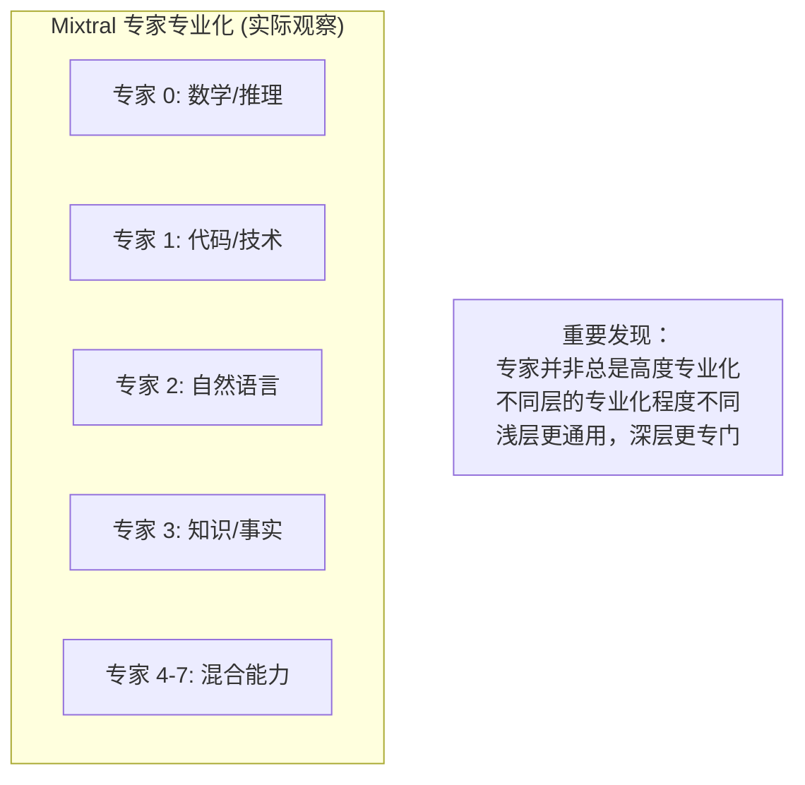

---

## 6. DeepSeek MoE

### 6.1 DeepSeek-V2 的 MLA + MoE

DeepSeek-V2 引入了 **MLA (Multi-head Latent Attention)** 和改进的 MoE：

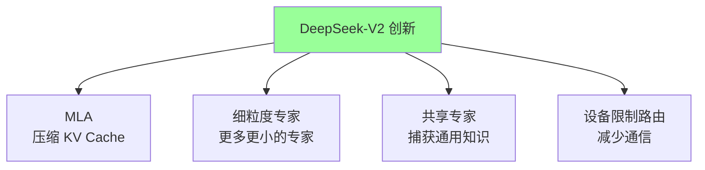

### 6.2 共享专家 + 路由专家

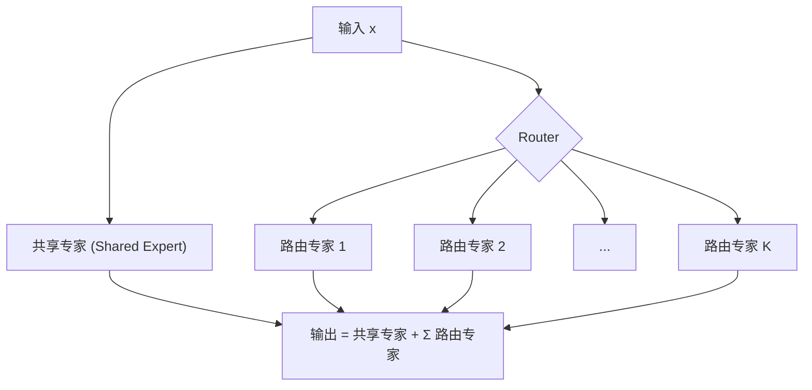

$$
\text{Output} = \text{SharedExpert}(x) + \sum_{i \in \text{TopK}} g_i(x) \cdot \text{RoutedExpert}_i(x)
$$

**设计动机**：

| 类型 | 作用 | 原因 |
|------|------|------|
| **共享专家** | 捕获通用知识 | 避免每个路由专家重复学习通用模式 |
| **路由专家** | 捕获专业化知识 | 不同 token 路由到不同专家 |

### 6.3 DeepSeek-V3 规格

| 属性 | DeepSeek-V3 |
|------|-------------|
| **总参数** | 671B |
| **活跃参数** | 37B |
| **层数** | 61 |
| **路由专家数/层** | 256 |
| **共享专家数/层** | 1 |
| **Top-K** | 8 |
| **训练数据** | 14.8T tokens |
| **训练成本** | ~$5.6M |
| **注意力** | MLA |

**671B 参数，但每次推理只激活 37B（5.5%），极致的参数效率！**

---

## 7. Sparse vs Dense MoE

### 7.1 定义与对比

| 维度 | Sparse MoE | Dense MoE |
|------|-----------|-----------|
| **定义** | 每个 token 激活 K < N 个专家 | 每个 token 激活所有专家 |
| **代表** | Switch, Mixtral, DeepSeek | MoE with soft routing |
| **计算量** | 低（稀疏激活） | 高（全激活） |
| **效果** | 好 | 理论更好但实际差距小 |
| **通信** | 需要调度（All-to-All） | 简单 |
| **代表性模型** | Mixtral 8x7B | 早期 MoE 研究 |

### 7.2 MoE 的推理优化

| 优化技术 | 原理 | 加速比 |
|---------|------|--------|
| **Expert Parallelism** | 专家分布在不同 GPU | 线性于 GPU 数 |
| **Expert Batching** | 批量处理同一专家的 token | 2-3× |
| **容量因子调优** | 控制每个专家的最大 token 数 | 减少浪费 |
| **动态批处理** | 按路由结果分组 | 1.5-2× |
| **专家缓存** | 缓存热门专家权重 | 减少 IO |

---

## 8. 分布式 MoE 训练

### 8.1 并行策略组合

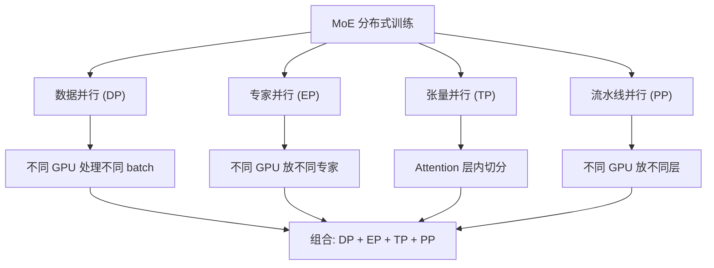

### 8.2 通信瓶颈

**MoE 的核心通信挑战**：

```
每个训练步：
1. All-to-All (Dispatch): 发送 token 到对应专家
2. 计算: 各专家处理 token
3. All-to-All (Combine): 收回处理结果

通信量 ∝ batch_size × d_model × 2
```

| 优化策略 | 方法 | 效果 |
|---------|------|------|
| **通信与计算重叠** | 在通信时同时计算 Attention | 减少 30-50% 等待 |
| **设备限制路由** | 限制 token 只能路由到同一节点的专家 | 大幅减少跨节点通信 |
| **All-to-All 优化** | NCCL 参数调优 + 自定义通信 | 提升带宽利用率 |
| **专家复制** | 热门专家多拷贝 | 减少热点 |

---

## 9. 代码实战

### 9.1 简化版 MoE Layer

```python
import torch
import torch.nn as nn
import torch.nn.functional as F

class Expert(nn.Module):
    def __init__(self, d_model, ffn_dim):
        super().__init__()
        self.w1 = nn.Linear(d_model, ffn_dim, bias=False)
        self.w2 = nn.Linear(ffn_dim, d_model, bias=False)
        self.w3 = nn.Linear(d_model, ffn_dim, bias=False)
    
    def forward(self, x):
        return self.w2(F.silu(self.w1(x)) * self.w3(x))


class MoELayer(nn.Module):
    def __init__(self, d_model, ffn_dim, num_experts, top_k=2):
        super().__init__()
        self.num_experts = num_experts
        self.top_k = top_k
        
        self.experts = nn.ModuleList([
            Expert(d_model, ffn_dim) for _ in range(num_experts)
        ])
        self.router = nn.Linear(d_model, num_experts, bias=False)
    
    def forward(self, x):
        batch_size, seq_len, d_model = x.shape
        x_flat = x.view(-1, d_model)
        
        router_logits = self.router(x_flat)
        router_probs = F.softmax(router_logits, dim=-1)
        
        top_k_probs, top_k_indices = torch.topk(router_probs, self.top_k, dim=-1)
        top_k_probs = top_k_probs / top_k_probs.sum(dim=-1, keepdim=True)
        
        output = torch.zeros_like(x_flat)
        
        for k in range(self.top_k):
            for i in range(self.num_experts):
                expert_mask = (top_k_indices[:, k] == i)
                if expert_mask.any():
                    expert_input = x_flat[expert_mask]
                    expert_output = self.experts[i](expert_input)
                    output[expert_mask] += top_k_probs[expert_mask, k].unsqueeze(-1) * expert_output
        
        return output.view(batch_size, seq_len, d_model)
```

### 9.2 高效 MoE 实现 (使用 Scatter/Gather)

```python
class EfficientMoELayer(nn.Module):
    def __init__(self, d_model, ffn_dim, num_experts, top_k=2):
        super().__init__()
        self.num_experts = num_experts
        self.top_k = top_k
        self.d_model = d_model
        
        self.gate_proj = nn.Parameter(torch.randn(num_experts, ffn_dim, d_model) * 0.02)
        self.up_proj = nn.Parameter(torch.randn(num_experts, ffn_dim, d_model) * 0.02)
        self.down_proj = nn.Parameter(torch.randn(num_experts, d_model, ffn_dim) * 0.02)
        self.router = nn.Linear(d_model, num_experts, bias=False)
    
    def forward(self, x):
        B, S, D = x.shape
        x_flat = x.view(-1, D)
        num_tokens = x_flat.shape[0]
        
        router_logits = self.router(x_flat)
        router_probs = F.softmax(router_logits, dim=-1)
        
        top_k_weights, top_k_indices = torch.topk(router_probs, self.top_k, dim=-1)
        top_k_weights = top_k_weights / top_k_weights.sum(dim=-1, keepdim=True)
        
        final_output = torch.zeros(num_tokens, D, device=x.device, dtype=x.dtype)
        
        for k in range(self.top_k):
            expert_indices = top_k_indices[:, k]
            expert_weights = top_k_weights[:, k]
            
            for e in range(self.num_experts):
                token_mask = (expert_indices == e)
                if not token_mask.any():
                    continue
                
                expert_input = x_flat[token_mask]
                
                gate = F.silu(expert_input @ self.gate_proj[e].T)
                up = expert_input @ self.up_proj[e].T
                expert_output = (gate * up) @ self.down_proj[e].T
                
                final_output[token_mask] += expert_weights[token_mask].unsqueeze(-1) * expert_output
        
        return final_output.view(B, S, D)
```

### 9.3 Mixtral 风格的完整 MoE Block

```python
import torch
import torch.nn as nn
import torch.nn.functional as F
import math

class MixtralBlock(nn.Module):
    def __init__(self, d_model=4096, n_heads=32, ffn_dim=14336, num_experts=8, top_k=2):
        super().__init__()
        self.n_heads = n_heads
        self.head_dim = d_model // n_heads
        
        self.q_proj = nn.Linear(d_model, d_model, bias=False)
        self.k_proj = nn.Linear(d_model, d_model, bias=False)
        self.v_proj = nn.Linear(d_model, d_model, bias=False)
        self.o_proj = nn.Linear(d_model, d_model, bias=False)
        
        self.experts = nn.ModuleList([
            nn.Sequential(
                nn.Linear(d_model, ffn_dim, bias=False),
                nn.SiLU(),
            ) for _ in range(num_experts)
        ])
        self.expert_up = nn.ModuleList([
            nn.Linear(d_model, ffn_dim, bias=False) for _ in range(num_experts)
        ])
        self.expert_down = nn.ModuleList([
            nn.Linear(ffn_dim, d_model, bias=False) for _ in range(num_experts)
        ])
        
        self.router = nn.Linear(d_model, num_experts, bias=False)
        self.top_k = top_k
        
        self.input_norm = nn.LayerNorm(d_model)
        self.post_attn_norm = nn.LayerNorm(d_model)
    
    def forward(self, x, attention_mask=None):
        residual = x
        x = self.input_norm(x)
        
        bsz, seq_len, _ = x.shape
        
        q = self.q_proj(x).view(bsz, seq_len, self.n_heads, self.head_dim).transpose(1, 2)
        k = self.k_proj(x).view(bsz, seq_len, self.n_heads, self.head_dim).transpose(1, 2)
        v = self.v_proj(x).view(bsz, seq_len, self.n_heads, self.head_dim).transpose(1, 2)
        
        scores = torch.matmul(q, k.transpose(-2, -1)) / math.sqrt(self.head_dim)
        if attention_mask is not None:
            scores = scores + attention_mask
        attn = F.softmax(scores, dim=-1)
        attn_out = torch.matmul(attn, v)
        attn_out = attn_out.transpose(1, 2).contiguous().view(bsz, seq_len, -1)
        x = residual + self.o_proj(attn_out)
        
        residual = x
        x = self.post_attn_norm(x)
        
        x_flat = x.view(-1, x.shape[-1])
        router_logits = self.router(x_flat)
        weights, indices = torch.topk(F.softmax(router_logits, dim=-1), self.top_k)
        weights = weights / weights.sum(dim=-1, keepdim=True)
        
        moe_output = torch.zeros_like(x_flat)
        for k_idx in range(self.top_k):
            for e_idx in range(len(self.experts)):
                mask = (indices[:, k_idx] == e_idx)
                if not mask.any():
                    continue
                
                expert_input = x_flat[mask]
                gate = self.experts[e_idx](expert_input)
                up = self.expert_up[e_idx](expert_input)
                expert_out = self.expert_down[e_idx](gate * up)
                
                moe_output[mask] += weights[mask, k_idx:k_idx+1] * expert_out
        
        x = residual + moe_output.view(bsz, seq_len, -1)
        return x


if __name__ == "__main__":
    block = MixtralBlock(d_model=4096, n_heads=32, ffn_dim=14336, num_experts=8, top_k=2)
    
    total = sum(p.numel() for p in block.parameters())
    print(f"MoE Block 总参数: {total / 1e6:.1f}M")
    
    active_expert_params = sum(
        p.numel() for name, p in block.named_parameters()
        if "expert" in name and any(f".{i}." in name for i in range(2))
    )
    
    x = torch.randn(1, 64, 4096)
    with torch.no_grad():
        out = block(x)
    print(f"输入: {x.shape} → 输出: {out.shape}")
```

---

## 10. MoE 的优势与挑战

### 10.1 优势总结

| 优势 | 说明 |
|------|------|
| **参数效率** | 总参数大但活跃参数少，推理成本低 |
| **训练效率** | 相同计算预算下训练更快 |
| **模型容量** | 大参数容量存储更多知识 |
| **专业化** | 不同专家学习不同领域的知识 |
| **可扩展性** | 增加专家数比增加模型维度更灵活 |

### 10.2 挑战与解决方案

| 挑战 | 描述 | 解决方案 |
|------|------|---------|
| **负载不均衡** | 某些专家过载，某些空闲 | 辅助损失 + 容量因子 + Expert Choice |
| **通信开销** | All-to-All 通信成为瓶颈 | 设备限制路由 + 通信重叠 |
| **显存需求** | 总参数需要全部加载 | 专家卸载 + CPU Offload |
| **训练不稳定** | 路由震荡 | Z-loss + 辅助损失 |
| **微调困难** | MoE 微调容易过拟合 | 稀疏微调 + 冻结部分专家 |
| **量化复杂** | 不同专家量化精度不同 | QMoE + 混合精度量化 |

---

## 11. 面试问题（FAQ）

### Q1: MoE 和 Dense 模型的本质区别是什么？

> **答**: 核心区别在于**参数激活方式**：
> - **Dense 模型**：所有参数对每个输入都参与计算
> - **MoE 模型**：通过路由器选择性地激活部分参数（专家）
> 
> MoE 的 FFN 层被替换为 Router + N 个 Expert FFN，每个 token 只经过 Top-K 个专家。Attention 层通常是共享的。

### Q2: Mixtral 8x7B 是不是有 56B (8×7) 参数？

> **答**: 不是。Mixtral 8x7B 的总参数约 46.7B，活跃参数约 12.9B。原因是：
> 1. **Attention 层共享**：8 个"7B"不是独立的 8 个完整模型
> 2. **只有 FFN 是 MoE**：每层 8 个 FFN 专家，Attention 是一套
> 3. **"8×7B"是简化说法**：实际是"基于 Mistral 7B 架构，FFN 部分替换为 8 个专家"

### Q3: MoE 的路由器如何训练？

> **答**: 路由器是一个简单的线性层 $W_r \in \mathbb{R}^{d \times N}$，与模型其他部分**联合训练**（端到端）：
> - 路由器的梯度来自两部分：主任务损失 + 辅助均衡损失
> - 不需要单独训练路由器
> - 路由器学习将不同类型的 token 分配给不同专家

### Q4: 为什么 MoE 微调比 Dense 模型更困难？

> **答**: MoE 微调面临独特挑战：
> 1. **过拟合风险**：专家容易"坍缩"，只用少数专家
> 2. **路由固化**：微调数据可能让路由器偏向某些专家
> 3. **数据效率**：每个专家看到的微调数据更少
> 
> **解决方案**：
> - 冻结路由器，只微调专家
> - 使用较小的学习率
> - 增加辅助均衡损失

### Q5: DeepSeek MoE 的共享专家有什么好处？

> **答**: 共享专家解决了路由专家的"冗余学习"问题：
> - **无共享专家**：每个路由专家都需要独立学习通用知识（如语法、常识），造成参数浪费
> - **有共享专家**：通用知识由共享专家统一处理，路由专家只需学习专业化知识
> - **效果**：在相同专家数量下，共享专家设计显著提升性能

### Q6: MoE 模型如何进行量化？

> **答**: MoE 量化比 Dense 模型更复杂，因为总参数量大但每次只用一部分：
> 
> | 方法 | 原理 | 效果 |
> |------|------|------|
> | **QMoE** | 对每个专家独立量化到 3-4 bit | 压缩率高 |
> | **混合精度** | 热门专家 FP16，冷门专家 INT4 | 平衡精度和显存 |
> | **专家卸载** | 冷门专家放 CPU，热门放 GPU | 减少显存需求 |
> | **MoE-Quant** | 考虑路由概率的量化策略 | 量化感知路由 |

### Q7: MoE 的未来发展方向是什么？

> **答**: 2025-2026 的几个关键方向：
> 1. **动态专家数**：根据输入难度动态调整 Top-K
> 2. **多粒度 MoE**：Attention 和 FFN 都使用 MoE
> 3. **MoE + 长上下文**：结合稀疏注意力和稀疏 MoE
> 4. **AutoMoE**：自动化专家数量和粒度选择
> 5. **MoE 推理优化**：FlashMoE、专家预取等技术
> 6. **统一 MoE 框架**：标准化 MoE 训练和部署

---

## 12. 与其他章节的关联

### 前置知识
- [Attention Is All You Need 深度解读](20_Papers_and_Research/Architecture/Attention_Is_All_You_Need_Deep_Dive.md) — Transformer FFN 层的作用
- [LLaMA 深度解读](20_Papers_and_Research/Architecture/LLaMA_Deep_Dive.md) — 现代解码器架构 (SwiGLU, RoPE)
- [GPT-3 深度解读](20_Papers_and_Research/Scaling/GPT3_Deep_Dive.md) — Dense 模型的 Scaling Laws

### 横向关联
- [LLM 架构](../05_NLP_LLMs/LLM_Architectures/) — MoE 在 LLM 中的架构设计
- [分布式训练](07_Model_Training/Distributed_Training/Distributed_Training_2026.md) — MoE 的专家并行策略
- [模型训练](../../07_Model_Training/README.md) — MoE 训练的工程挑战

### 进阶方向
- [训练优化](07_Model_Training/Optimization/Training_Optimization_2026.md) — MoE 推理优化
- [RLHF 与 DPO 深度解读](20_Papers_and_Research/Alignment/RLHF_DPO_Deep_Dive.md) — MoE 模型的对齐
- [AI 开源项目](15_Agent_Production/AI_OpenSource_Projects_Overview.md) — 开源 MoE 模型生态

---

*Last updated: 2026-05-17*

## Related

- [[05_NLP_LLMs/Fine_tuning_Techniques/PEFT_2026]] — PEFT 2026 (参数高效微调) (共享: llm, nlp, transformer)
- [[05_NLP_LLMs/Fine_tuning_Techniques/README]] — 微调技术 (Fine-tuning Techniques) (共享: llm, nlp, transformer)
- [[05_NLP_LLMs/LLM_Architectures/LLM-Basics-in-nutshell]] — 大语言模型基础速成指南 (共享: llm, nlp, transformer)
- [[05_NLP_LLMs/Multimodal_Models/Multimodal_Architectures_2026]] — 多模态模型架构 2026：从 GPT-4V 到原生多模态 AGI (共享: llm, nlp, transformer)
