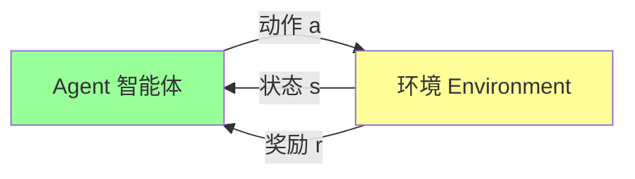
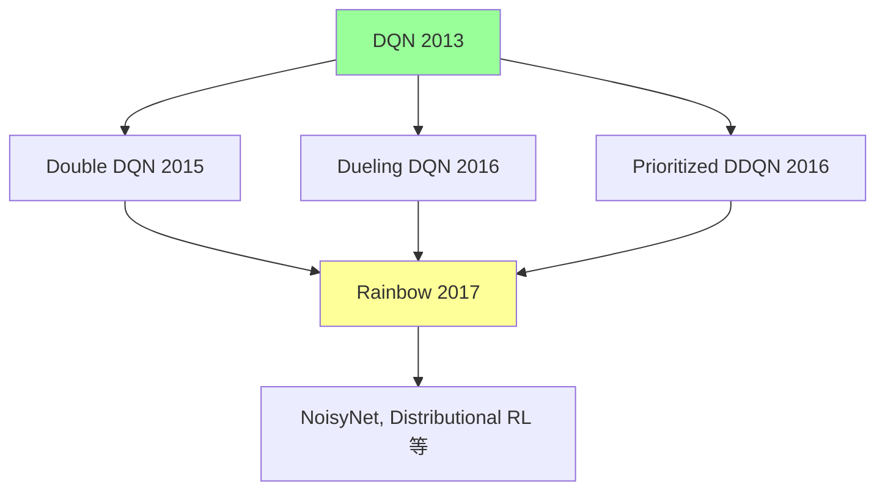

# DQN 深度解读 (Playing Atari with Deep Reinforcement Learning)

> **一句话理解**: DQN 就像教一个婴儿玩电子游戏——通过反复尝试记住"这样做得分高、那样做得分低"，结合深度学习让 AI 直接从屏幕像素学习游戏策略，这是深度强化学习的开山之作。

---

## 论文基本信息

| 属性 | 内容 |
|------|------|
| **核心论文** | Playing Atari with Deep Reinforcement Learning |
| **作者** | Volodymyr Mnih, Koray Kavukcuoglu, David Silver 等 (DeepMind) |
| **发表** | Nature 2013 (arXiv:1312.5602) |
| **核心贡献** | 首个端到端深度 RL，从原始像素直接学习策略 |
| **影响** | 深度 RL 时代的起点，AlphaGo 的技术基础 |

---

## 1. 历史背景：为什么这是突破？

### 1.1 之前的困境

```
传统强化学习的问题:
- 需要人工设计特征（费时费力）
- 无法处理高维输入（图像、语音）
- 泛化能力差（换一个游戏就要重新设计）

DL（深度学习）的优势:
- 自动学习特征表示
- 能处理原始高维数据
- 泛化能力强

DQN = DL + RL 的首次成功结合！
```

### 1.2 雅达利游戏为什么重要？

| 特点 | 为什么重要 |
|------|-----------|
| 多种游戏类型 | 测试泛化能力（不是只针对一个游戏） |
| 即时奖励信号 | 分数明确，学习信号清晰 |
| 需要策略规划 | 不是简单反射，需要长期规划 |
| 原始像素输入 | 模拟真实世界的感知问题 |

---

## 2. 核心技术：DQN 是什么？

### 2.1 整体架构

```
输入: 雅达利游戏的原始像素 (210×160×3)
  ↓
卷积层1: 32 个 8×8 卷积核, stride=4, ReLU
  ↓
卷积层2: 64 个 4×4 卷积核, stride=2, ReLU
  ↓
卷积层3: 64 个 3×3 卷积核, stride=1, ReLU
  ↓
全连接层: 512 个神经元, ReLU
  ↓
输出层: 每个动作的价值 Q(s, a)
```

### 2.2 强化学习基础概念



| 概念 | 定义 | 雅达利中的例子 |
|------|------|--------------|
| **状态 s** | 游戏屏幕画面 | 210×160 像素图像 |
| **动作 a** | 可以做的操作 | 上/下/左/右/开火 |
| **奖励 r** | 动作的好坏 | 得分变化（+1/-1/0） |
| **策略 π** | 状态→动作的映射 | 看到某种画面就按某个键 |
| **价值 Q** | 长期奖励期望 | 这个动作未来能得多少分 |

### 2.3 Q-Learning 核心公式

```
Q(s, a) ← Q(s, a) + α[r + γ·max Q(s', a') - Q(s, a)]

这在说:
"更新一个动作的价值 =
 旧价值 + 学习率 × (立即奖励 + 折扣的未来价值 - 旧价值)"
```

| 符号 | 含义 | 类比 |
|------|------|------|
| α | 学习率 | 调整步伐大小 |
| γ | 折扣因子 | 眼前的利益更重要（γ=0.9） |
| max Q(s', a') | 下一状态的最佳动作价值 | 向前看一步的最佳选择 |

---

## 3. 两个关键技术

### 3.1 经验回放 (Experience Replay)

**问题**: 按顺序学习会导致样本关联性太强

**解决方案**: 随机抽取过去的状态转换进行学习

```
【之前的方法 - 顺序学习的问题】
样本1: 状态A → 动作1 → 奖励+1
样本2: 状态B → 动作2 → 奖励0    （和样本1高度相关）
样本3: 状态C → 动作3 → 奖励-1   （还是相关）
...

【经验回放 - 打乱相关性】
经验池: [(s1,a1,r1,s2), (s5,a3,r2,s8), (s2,a7,r1,s3), ...]
       ↑ 从池中随机抽取，打乱顺序

好处:
✓ 打破样本相关性，提高学习稳定性
✓ 允许同一经验被多次使用（数据效率高）
✓ 近似于离线策略学习
```

### 3.2 目标网络 (Target Network)

**问题**: 同时更新价值和目标，导致不稳定

**解决方案**: 用一个"老"网络来计算目标值

```
【问题示意】

如果用同一个网络计算:
Q(s,a) ← r + γ·max Q(s', a')  ← 目标和价值用同一个网络
更新 Q 的同时，max Q(s', a') 也在变！

就像追一个移动的靶子，很难命中。

【目标网络解决方案】

两个网络:
- 在线网络 Q: 用于选择动作和计算当前价值
- 目标网络 Q̄: 用于计算目标值（定期从 Q 复制）

公式变为:
Q(s,a) ← r + γ·max Q̄(s', a')

每 N 步（论文用10000步）把 Q 的参数复制给 Q̄。
这样目标在一段时间内是"固定的"，学习更稳定。
```

---

## 4. 训练流程

```mermaid
flowchart TB
    A[初始化: 在线网络 Q 和目标网络 Q̄] --> B[开始episode]
    B --> C[选择动作 ε-greedy]
    C --> D[执行动作, 获得 (s, a, r, s')]
    D --> E[存储到经验池]
    E --> F{经验池足够?}
    F -->|否| B
    F -->|是| G[随机采样 batch]
    G --> H[计算 TD 目标: r + γ·max Q̄(s', a')]
    H --> I[用梯度下降更新 Q 网络]
    I --> J{每 N 步?}
    J -->|是| K[Q̄ ← Q]
    J -->|否| L
    K --> L{继续?}
    L -->|是| C
    L -->|否| M[结束]

    style A fill:#9cf
    style M fill:#9f9
```

---

## 5. 实验结果

### 5.1 在雅达利上的表现

| 游戏 | 随机策略 | DQN | 人类最佳 |
|------|---------|-----|---------|
| Breakout | 0.3 | 401.2 | 31.8 |
| Enduro | 0.0 | 141.6 | 1.6 |
| Space Invaders | 0.2 | 125.6 | 1.8 |
| Beam Rider | 0.6 | 14.2 | 1.5 |

> DQN 在多个游戏中达到了人类水平的 25-100%！
> 重要的是：同一网络架构，没有针对任何游戏调参。

### 5.2 学习到的特征

```
低层卷积层 → 简单特征（边缘、颜色）
中层卷积层 → 物体检测（球拍、球、敌人）
高层卷积层 → 高级语义（位置关系、状态）
```

---

## 6. 局限性

| 局限 | 说明 | 后续改进 |
|------|------|---------|
| 离散动作空间 | 只适用离散动作，无法直接用于连续控制 | DDPG, PPO 等处理连续 |
| 样本效率低 | 需要数百万帧才能学会 | 改进的探索策略 |
| 训练不稳定 | 有时性能会突然下降 | Double DQN, Dueling DQN |
| 奖励设计 | 依赖明确奖励信号 | 稀疏奖励问题仍是难题 |

---

## 7. 后续演进



| 改进 | 核心思想 | 论文 |
|------|---------|------|
| Double DQN | 解决 Q 值过估计问题 | van Hasselt 2015 |
| Dueling DQN | 分别估计状态价值和动作优势 | Wang 2016 |
| Prioritized DDQN | 优先学习 TD 误差大的样本 | Schaul 2016 |
| Rainbow | 多种改进的组合 | Hessel 2017 |

---

## 8. 核心思想总结

| 技术 | 解决什么问题 | 核心思想 |
|------|------------|---------|
| 端到端学习 | 手工特征工程 | 直接从像素学习策略 |
| 经验回放 | 样本相关性 | 随机采样，打破关联 |
| 目标网络 | 学习稳定性 | 固定目标，定期更新 |
| 深度卷积网络 | 函数逼近 | 通用特征表示 |

---

## 9. 为什么必读？

```
【学术价值】
- 证明了 DL + RL 可以结合
- 开创了"深度强化学习"这个领域
- 启发了后续所有深度 RL 研究（AlphaGo 也基于此）

【工程价值】
- 第一个通用 AI 智能体（同一架构玩多个游戏）
- 证明可以从零开始学习复杂行为
- 为机器人、自动驾驶等领域铺路

【思想价值】
- "AI 可以像人类一样通过试错学习"
- "不需要人工设计特征，AI 自己学"
```

---

*本文是 [README.md](../../README.md) 的补充，适合想深入理解 DQN 和深度 RL 原理的读者。*
*原始论文: [Playing Atari with Deep Reinforcement Learning](https://arxiv.org/abs/1312.5602)*

## Related

- [[_concepts/reinforcement-learning]] — 强化学习基础
- [[_concepts/deep-reinforcement-learning]] — 深度强化学习
- [[_concepts/neural-networks]] — 神经网络
