# GPT-3 深度解读 (Language Models are Few-Shot Learners)

> **一句话理解**: GPT-3 就像把一个阅读量超过人类万倍的天才放在一个"只给例子不教规则"的考试中——它通过 1750 亿参数和海量文本训练，竟能从几个示例中顿悟任务逻辑，开启了"大模型 + 提示词"的全新 AI 范式。

---

## 论文基本信息

| 属性 | 内容 |
|------|------|
| **标题** | Language Models are Few-Shot Learners |
| **作者** | Tom B. Brown, Benjamin Mann, Nick Ryder 等 (OpenAI) |
| **发表** | NeurIPS 2020 |
| **引用量** | 50,000+ (截至 2026) |
| **论文链接** | [arXiv:2005.14165](https://arxiv.org/abs/2005.14165) |
| **模型规模** | 175B 参数 (最大版本) |

---

## 1. 历史背景：从 GPT-1 到 GPT-3 的演进

### 1.1 三代 GPT 的范式跃迁

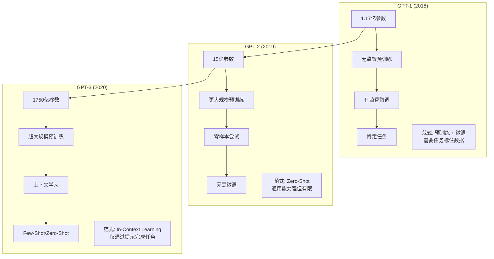

### 1.2 GPT-1：预训练-微调范式的确立

**核心思想**：先在大量无标注文本上预训练语言模型，再在下游任务上微调。

| 特性 | 详情 |
|------|------|
| **参数量** | 117M |
| **层数** | 12 |
| **训练数据** | BookCorpus (约 8,000 本书) |
| **创新** | 证明生成式预训练 (Generative Pre-Training) 有效 |
| **局限** | 每个任务都需要收集标注数据并微调 |

### 1.3 GPT-2：零样本能力的惊喜

**关键发现**：当模型足够大、数据足够多时，模型展现出**零样本 (Zero-Shot)** 能力——无需微调，直接用自然语言描述任务就能执行。

```mermaid
flowchart LR
    A[输入: "翻译为法语: The cat sat on the mat."] --> B[GPT-2]
    B --> C[输出: "Le chat s'est assis sur le tapis."]
    
    note["没有见过翻译数据!<br/>纯靠预训练学到的语言知识"]
```

| 特性 | 详情 |
|------|------|
| **参数量** | 1.5B (比 GPT-1 大 10 倍) |
| **训练数据** | WebText (Reddit 外链，约 40GB) |
| **创新** | 发现 Zero-Shot 能力，提出"多任务学习"解释 |
| **局限** | Zero-Shot 效果仍远不如微调模型 |

### 1.4 GPT-3：上下文学习的涌现

GPT-3 的核心突破：**不需要微调，只需在输入中提供几个示例，模型就能理解并执行新任务**——这被称为**上下文学习 (In-Context Learning)**。

---

## 2. 核心创新：规模化与上下文学习

### 2.1 Scaling Laws 的实践验证

OpenAI 同期论文《Scaling Laws for Neural Language Models》(Kaplan et al., 2020) 发现：

```
语言模型的损失 L 与三个因素呈幂律关系:

L(N) ∝ N^(-0.076)      ← 参数量 N
L(D) ∝ D^(-0.095)      ← 数据量 D  
L(C) ∝ C^(-0.057)      ← 计算量 C
```

**核心结论**：只要继续扩大模型、数据和计算，性能就会**可预测地提升**。

### 2.2 GPT-3 的规模化决策

| 维度 | GPT-2 | GPT-3 | 增长倍数 |
|------|-------|-------|---------|
| **参数量** | 1.5B | **175B** | 116× |
| **训练数据** | 40GB | **570GB** (300B tokens) | 14× |
| **层数** | 48 | **96** | 2× |
| **模型维度** | 1,600 | **12,288** | 7.7× |
| **注意力头数** | 25 | **96** | 3.8× |
| **Batch Size** | 512 | **3.2M** (tokens) | — |
| **训练成本** | ~$50K | **~$4.6M** | 90×+ |

### 2.3 In-Context Learning：无需参数更新的学习

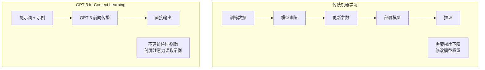

**关键洞察**：GPT-3 不是在"学习"新任务（没有参数更新），而是在**激活**预训练时已掌握的能力。示例只是帮助模型"回忆"起正确的行为模式。

---

## 3. 架构细节

### 3.1 Decoder-Only Transformer

GPT-3 采用与 GPT-2 相同的架构——**纯解码器 Transformer**（即原始 Transformer 的 Decoder 部分，去掉 Cross-Attention）：

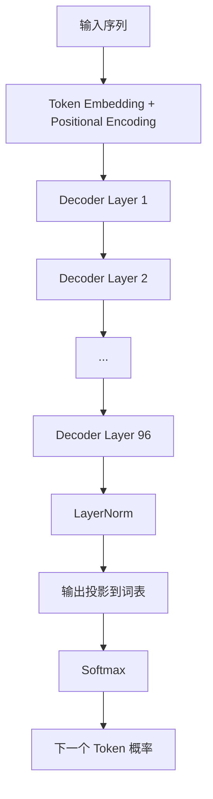

### 3.2 GPT-3 各版本规格

| 模型 | 参数量 | 层数 | d_model | 注意力头数 | 每头维度 | Batch Size | 学习率 |
|------|--------|------|---------|-----------|---------|-----------|--------|
| **GPT-3 Small** | 125M | 12 | 768 | 12 | 64 | 0.5M | 6.0×10⁻⁴ |
| **GPT-3 Medium** | 350M | 24 | 1024 | 16 | 64 | 0.5M | 3.0×10⁻⁴ |
| **GPT-3 Large** | 760M | 24 | 1536 | 16 | 96 | 0.5M | 2.5×10⁻⁴ |
| **GPT-3 XL** | 1.3B | 24 | 2048 | 24 | 128 | 1.0M | 2.0×10⁻⁴ |
| **GPT-3 2.7B** | 2.7B | 32 | 2560 | 32 | 80 | 1.0M | 1.6×10⁻⁴ |
| **GPT-3 6.7B** | 6.7B | 32 | 4096 | 32 | 128 | 2.0M | 1.2×10⁻⁴ |
| **GPT-3 13B** | 13B | 40 | 5140 | 40 | 128 | 2.0M | 1.0×10⁻⁴ |
| **GPT-3 175B (davinci)** | **175B** | **96** | **12288** | **96** | **128** | **3.2M** | **0.6×10⁻⁴** |

### 3.3 注意力模式

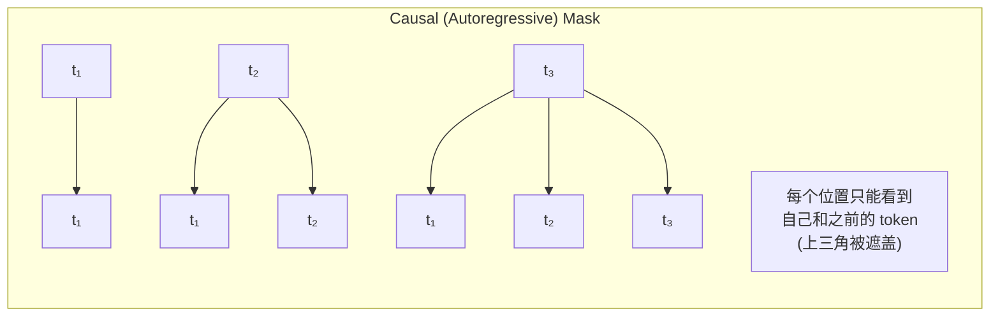

**Causal Mask 矩阵可视化**（序列长度 4）：

```
        t₁   t₂   t₃   t₄
    t₁ [ 1    0    0    0  ]   t₁ 只能看自己
    t₂ [ 1    1    0    0  ]   t₂ 能看 t₁, t₂
    t₃ [ 1    1    1    0  ]   t₃ 能看 t₁, t₂, t₃
    t₄ [ 1    1    1    1  ]   t₄ 能看全部
```

### 3.4 模型维度与参数量计算

```python
# GPT-3 175B 参数分解
d_model = 12288
vocab_size = 50257
num_layers = 96
num_heads = 96

# 1. Token 嵌入矩阵
embedding_params = vocab_size * d_model  # 50257 * 12288 ≈ 617M

# 2. 每个 Transformer 层
#   Attention: 4 * d_model^2 (Q, K, V, O 投影)
#   FFN: 8 * d_model^2 (d_ff = 4 * d_model, 两个线性层)
layer_params = 4 * d_model**2 + 8 * d_model**2  # 12 * d_model^2 ≈ 1.81B

# 3. 所有层
all_layers = num_layers * layer_params  # 96 * 1.81B ≈ 174B

# 4. 总计 (~175B)
total = embedding_params + all_layers  # ≈ 174.6B

print(f"嵌入层参数:  {embedding_params / 1e9:.1f}B")
print(f"每层参数:    {layer_params / 1e9:.2f}B")
print(f"所有层参数:  {all_layers / 1e9:.1f}B")
print(f"总参数量:    {total / 1e9:.1f}B")
```

---

## 4. 训练细节

### 4.1 训练数据

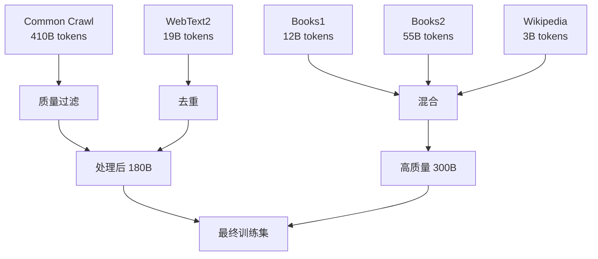

| 数据集 | 占比 | Token 量 | 说明 |
|--------|------|---------|------|
| **Common Crawl** | 60% | ~180B | 网络爬取数据，经质量过滤 |
| **WebText2** | 22% | ~19B | Reddit 高赞帖链接 (GPT-2 数据集扩展) |
| **Books1** | 8% | ~12B | 互联网图书集合 |
| **Books2** | 8% | ~55B | 更大规模的图书数据 |
| **Wikipedia** | 3% | ~3B | 英文维基百科 |
| **总计** | 100% | **~300B** | — |

**数据清洗策略**：
1. **质量过滤**：用轻量级分类器筛选高质量内容（基于 WebText 训练）
2. **模糊去重**：在文档级别进行去重，减少训练集与测试集重叠
3. **混合比例**：增加 WebText/Books/Wikipedia 比例（已知更高质量）

### 4.2 训练配置

| 配置项 | 值 | 说明 |
|--------|-----|------|
| **优化器** | Adam | β₁=0.9, β₂=0.95, ε=10⁻⁸ |
| **学习率调度** | 预热 + 余弦衰减 | 前 3.75 亿 tokens 线性预热 |
| **梯度裁剪** | 1.0 | 全局范数裁剪 |
| **权重衰减** | 0.1 | 应用于所有非偏置/非 Embedding 权重 |
| **Dropout** | 0.1 | 注意力、残差、Embedding 层 |
| **上下文长度** | 2048 tokens | 所有版本统一 |
| **精度** | FP16 + FP32 混合 | 使用动态损失缩放 |
| **训练时长** | ~数月 | 在 V100 GPU 集群上 |

### 4.3 模型并行策略

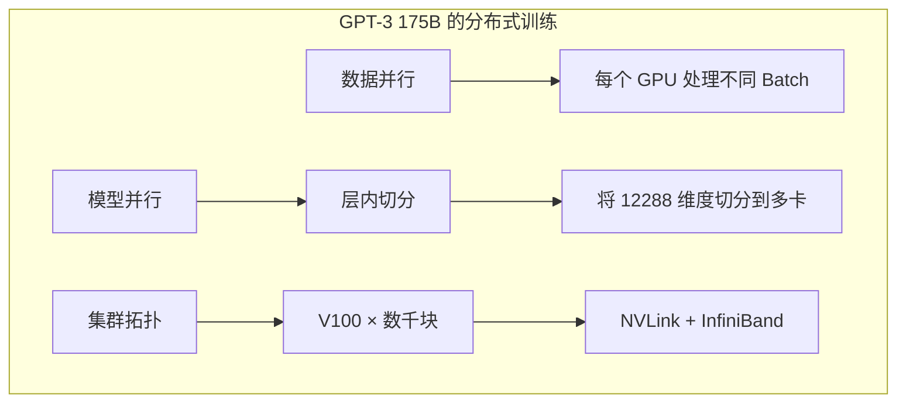

GPT-3 使用 **模型并行 + 数据并行** 的组合策略：
- **模型并行**：将每层切分到多个 GPU（如注意力头分配到不同卡）
- **数据并行**：不同 GPU 处理不同 mini-batch

据估计，GPT-3 训练使用了约 **10,000 块 V100 GPU**，训练成本约 **460 万美元**。

### 4.4 Mixture of Bucketing

为处理不同长度的序列，GPT-3 使用**动态分桶 (Mixture of Bucketing)**：

| Bucket | 序列长度 | 占比 |
|--------|---------|------|
| **短序列** | 512 | ~30% |
| **中序列** | 1024 | ~40% |
| **长序列** | 2048 | ~30% |

这种混合确保模型在不同长度上都表现良好，同时避免所有序列都填充到 2048 造成的计算浪费。

---

## 5. 三种学习范式：Zero-Shot / One-Shot / Few-Shot

### 5.1 范式定义

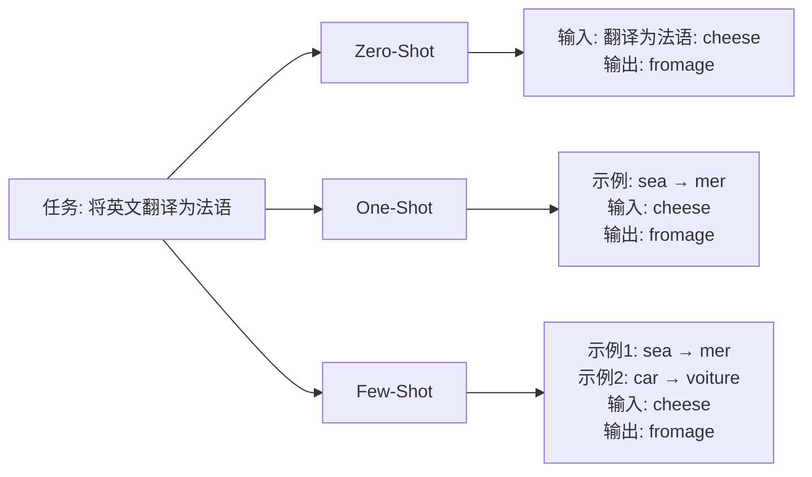

| 范式 | 示例数量 | 适用场景 | 准确率趋势 |
|------|---------|---------|-----------|
| **Zero-Shot** | 0 | 简单任务，通用能力 | 基准水平 |
| **One-Shot** | 1 | 任务格式明确 | 显著提升 |
| **Few-Shot** | 10-100 | 复杂任务，需要示范 | 最优 |

### 5.2 Few-Shot Prompt 示例

**情感分类任务**：

```
以下是将产品评论分类为正面或负面的示例：

评论: "这款手机的电池续航太棒了，一天重度使用还有30%！"
分类: 正面

评论: "屏幕有坏点，联系客服三天都没人回复，气死了。"
分类: 负面

评论: "物流很快，包装也很精致，但颜色比图片深一些。"
分类: 中性

评论: "完全超出预期，性价比超高，已经推荐给朋友了！"
分类:
```

**GPT-3 输出**：`正面`

### 5.3 上下文窗口的使用

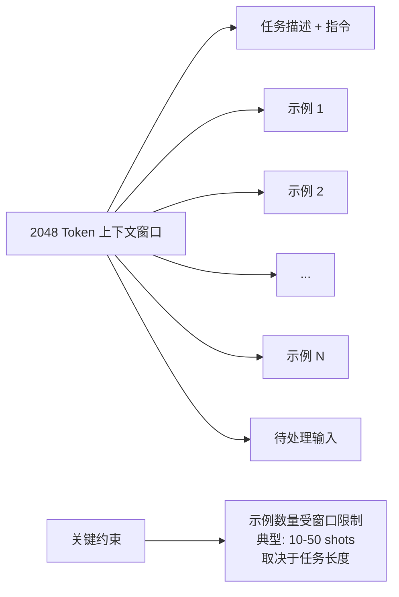

---

## 6. 能力与局限

### 6.1 GPT-3 能做什么？

| 能力 | 示例 | 表现 |
|------|------|------|
| **文本生成** | 写文章、诗歌、故事 | 流畅、有创意、风格可控 |
| **问答** | 开放域知识问答 | 准确率高，但可能幻觉 |
| **翻译** | 英法/英德互译 | Few-Shot 接近监督模型 |
| **代码生成** | Python、JavaScript | 基本正确，需人工审查 |
| **算术** | 简单加减乘除 | 2 位数可靠，多位数易错 |
| **摘要** | 长文摘要 | 能捕捉要点 |
| **常识推理** | 物理/社会常识 | 显著优于小模型 |

### 6.2 GPT-3 不能做什么？

| 局限 | 表现 | 原因 |
|------|------|------|
| **事实准确性** | 可能生成看似合理但错误的信息 | 语言建模目标 ≠ 事实核查 |
| **多步数学推理** | 复杂算术和代数错误率高 | 未显式训练数学逻辑 |
| **长程一致性** | 长文档中前后矛盾 | 2048 token 限制 + 注意力分散 |
| **常识物理** | 某些物理直觉错误 | 纯文本训练缺乏物理交互 |
| **偏见与毒性** | 可能生成歧视性内容 | 训练数据包含网络偏见 |
| **实时信息** | 知识截止于训练时间 | 无法浏览互联网 |

### 6.3 性能随规模的变化

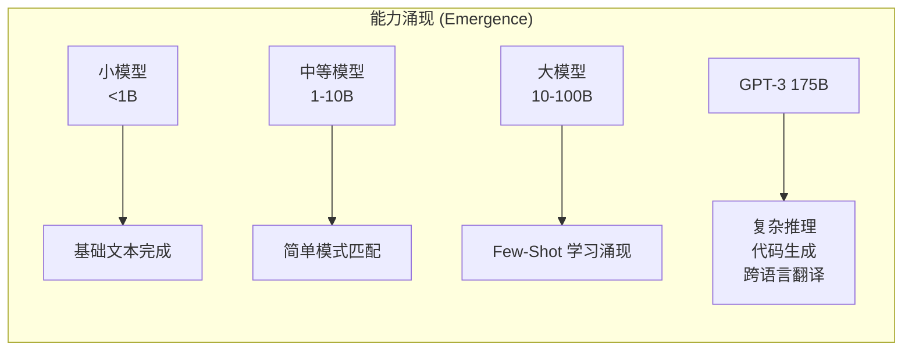

**关键发现**：某些能力（如 Few-Shot 翻译、代码补全）只在模型超过一定规模后才**突然涌现**，而非线性提升。

---

## 7. 影响：开启基础模型时代

### 7.1 对 AI 产业的影响

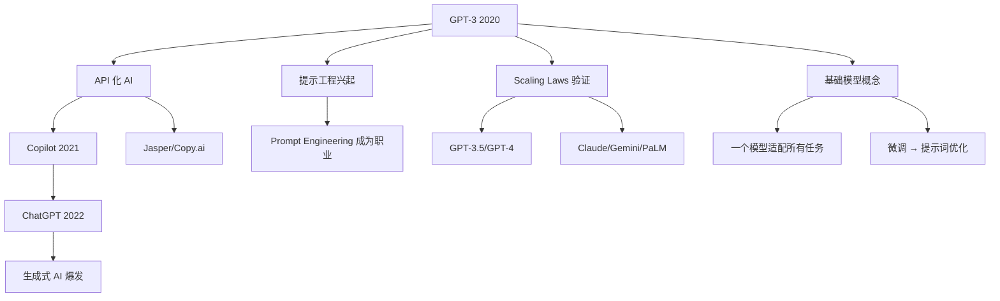

### 7.2 从 GPT-3 到 ChatGPT 的关键演进

| 时间 | 里程碑 | 关键改进 |
|------|--------|---------|
| **2020** | GPT-3 | 175B 参数，Few-Shot 学习 |
| **2021** | Codex | 在代码上微调，GitHub Copilot |
| **2022.03** | InstructGPT | RLHF 对齐，遵循指令 |
| **2022.11** | ChatGPT | 对话优化，现象级应用 |
| **2023** | GPT-4 | 多模态，推理能力跃升 |
| **2024-2026** | GPT-4o/5.x | 实时语音，Agent 能力 |

### 7.3 基础模型 (Foundation Model) 范式的确立

GPT-3 之后，AI 开发范式发生根本转变：

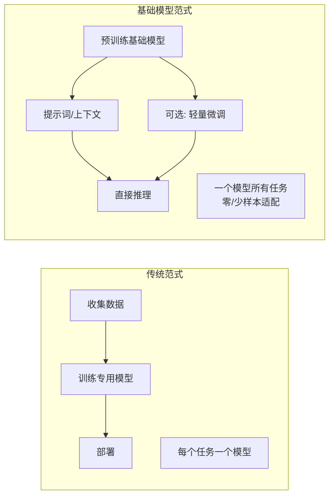

---

## 8. 代码实战：OpenAI API Few-Shot 提示

### 8.1 基本 Few-Shot 分类

```python
import os
from openai import OpenAI

client = OpenAI(api_key=os.getenv("OPENAI_API_KEY"))


def classify_review_fewshot(review: str) -> str:
    """使用 Few-Shot 提示进行评论情感分类"""
    
    # Few-shot 示例
    prompt = f"""将以下产品评论分类为"正面"、"负面"或"中性"。

示例 1:
评论: "电池续航惊人，用了整整两天还有电！"
分类: 正面

示例 2:
评论: "屏幕有划痕，退货流程太麻烦了。"
分类: 负面

示例 3:
评论: "包装一般，但功能符合描述。"
分类: 中性

现在分类这条评论:
评论: "{review}"
分类:"""
    
    response = client.chat.completions.create(
        model="gpt-3.5-turbo",  # 或使用 "gpt-4" 获得更好效果
        messages=[
            {"role": "user", "content": prompt}
        ],
        temperature=0,  # 零温度确保一致性
        max_tokens=10
    )
    
    result = response.choices[0].message.content.strip()
    return result


# 测试
test_reviews = [
    "完全超出预期，客服态度也很好，五星好评！",
    "等了三天才发货，包装还破了，非常失望。",
    "价格合理，功能正常，没什么特别的。"
]

for review in test_reviews:
    label = classify_review_fewshot(review)
    print(f"评论: {review[:30]}... → {label}")
```

### 8.2 结构化 Few-Shot 信息提取

```python
import json
from openai import OpenAI

client = OpenAI()


def extract_entities_fewshot(text: str) -> dict:
    """从文本中提取实体（Few-Shot + JSON 输出）"""
    
    system_prompt = """你是一个信息提取助手。从文本中提取人名、组织名、地点和时间。
始终以 JSON 格式输出。"""
    
    few_shot_examples = [
        {
            "text": "2024年，特斯拉 CEO 埃隆·马斯克在加州发布了新款 Model 3。",
            "output": {
                "人物": ["埃隆·马斯克"],
                "组织": ["特斯拉"],
                "地点": ["加州"],
                "时间": ["2024年"]
            }
        },
        {
            "text": "2019年，阿里巴巴在杭州举办了云栖大会，张勇发表了主题演讲。",
            "output": {
                "人物": ["张勇"],
                "组织": ["阿里巴巴"],
                "地点": ["杭州"],
                "时间": ["2019年"]
            }
        }
    ]
    
    # 构建消息
    messages = [
        {"role": "system", "content": system_prompt}
    ]
    
    # 添加 Few-shot 示例
    for example in few_shot_examples:
        messages.append({
            "role": "user", 
            "content": f"文本: {example['text']}"
        })
        messages.append({
            "role": "assistant", 
            "content": json.dumps(example['output'], ensure_ascii=False)
        })
    
    # 添加待处理文本
    messages.append({"role": "user", "content": f"文本: {text}"})
    
    response = client.chat.completions.create(
        model="gpt-3.5-turbo",
        messages=messages,
        temperature=0,
        response_format={"type": "json_object"}  # 强制 JSON 输出
    )
    
    return json.loads(response.choices[0].message.content)


# 测试
text = "2025年，OpenAI 在旧金山发布了 GPT-5，Sam Altman 出席了发布会。"
result = extract_entities_fewshot(text)
print(json.dumps(result, ensure_ascii=False, indent=2))
```

### 8.3 Few-Shot 翻译

```python
def translate_fewshot(chinese_text: str, target_lang: str = "英语") -> str:
    """使用 Few-Shot 示例进行翻译"""
    
    examples = """将以下中文翻译为英语：

中文: 人工智能正在改变我们的生活方式。
英语: Artificial intelligence is changing the way we live.

中文: 深度学习需要大量的计算资源。
英语: Deep learning requires a large amount of computational resources.

中文: 神经网络模仿人脑的工作方式。
英语: Neural networks mimic the way the human brain works.
"""
    
    prompt = f"{examples}\n中文: {chinese_text}\n{target_lang}:"
    
    response = client.chat.completions.create(
        model="gpt-3.5-turbo",
        messages=[{"role": "user", "content": prompt}],
        temperature=0.3,
        max_tokens=200
    )
    
    return response.choices[0].message.content.strip()


# 测试
chinese = "大规模语言模型通过海量数据预训练获得了强大的理解和生成能力。"
english = translate_fewshot(chinese)
print(f"中文: {chinese}")
print(f"英语: {english}")
```

---

## 9. 常见问题（FAQ）

### Q1: 为什么 GPT-3 选择 175B 参数这个规模？

> **答**: 这不是随意选择的数字，而是 Scaling Laws 的工程实践：
> 1. **计算预算约束**：OpenAI 有可用的训练资源（约 $5M）
> 2. **幂律预测**：根据 Kaplan et al. (2020) 的公式，给定计算量可以预测最优参数规模
> 3. **验证涌现**：实验发现 Few-Shot 能力在 100B+ 参数后才显著涌现
> 4. **工程极限**：175B 是当时分布式训练框架能稳定训练的最大规模
> 
> **有趣的事实**：175B 恰好是 96 层、12288 维度、96 头这个"整齐"配置的总参数量。

### Q2: 模型越大总是越好吗？

> **答**: 不完全是。Scaling Laws 揭示了几个重要权衡：
> 
> | 维度 | 小模型 (<10B) | 大模型 (100B+) | 最优策略 |
> |------|--------------|---------------|---------|
> | **训练成本** | 低 | 极高 | 根据预算选 |
> | **推理速度** | 快 | 慢 | 产品用小模型 |
> | **Few-Shot 能力** | 弱 | 强 | 复杂任务用大模型 |
> | **边际收益** | — | 递减 | 存在甜点 |
> 
> **Chinchilla 发现** (Hoffmann et al., 2022)：GPT-3 实际上**欠训练**了。对于 175B 模型，最优训练数据量应该是 3.5T tokens（而不是 300B）。这意味着同等计算预算下，**更小的模型 + 更多数据**可能更好。

### Q3: 上下文学习 (In-Context Learning) 是真正的"学习"吗？

> **答**: 这是一个开放的研究问题，存在两种观点：
> 
> **观点 A：不是真正的学习（表面统计匹配）**
> - 模型参数在推理时不更新
> - 可能只是通过注意力机制复制示例中的表面模式
> - 对示例顺序敏感，鲁棒性差
> 
> **观点 B：是隐式学习（任务识别与检索）**
> - 示例激活了预训练时学到的任务表征
> - 注意力头在示例和查询之间建立正确的映射
> - 与梯度下降存在数学等价性（某些条件下）
> 
> **当前共识**：ICL 是**任务定位/检索**而非从零学习，但它确实改变了模型行为。

### Q4: 涌现能力 (Emergence) 是真实的还是幻觉？

> **答**: 2023 年后的研究对"涌现"提出了质疑：
> 
> - **支持涌现**：某些能力（如 Few-Shot 算术）确实在特定规模后突然出现
> - **质疑观点** (Schaeffer et al., 2023)：涌现可能是**评估指标选择**的人为产物——用连续指标（如 token 编辑距离）代替离散指标（如准确率）后，能力提升变得平滑
> 
> **折中观点**：
> - 部分"涌现"是指标造成的错觉
> - 但某些定性变化（如从不能翻译到能翻译）是真实的
> - 更准确的说法：能力是**平滑提升**的，只是某些评估方式让它看起来"突然"

### Q5: GPT-3 与 BERT 的核心区别是什么？

| 维度 | GPT-3 (Decoder-only) | BERT (Encoder-only) |
|------|---------------------|---------------------|
| **架构** | 单向 (Causal) 注意力 | 双向 (Bidirectional) 注意力 |
| **训练目标** | 自回归语言建模 | 掩码语言建模 (MLM) |
| **预训练任务** | 预测下一个 token | 预测被遮盖的 token |
| **生成能力** | **强**，自回归生成 | 弱，不适合生成 |
| **理解能力** | 强 (通过上下文) | **更强** (双向上下文) |
| **使用方式** | 提示词驱动 (Zero/Few-Shot) | 微调 (Fine-tuning) |
| **代表应用** | 文本生成、对话、代码 | 文本分类、NER、问答 |

> **2026 年视角**：Decoder-only 架构成为绝对主流，因为生成任务覆盖面更广，且通过指令微调可以兼顾理解能力。

### Q6: 为什么 GPT-3 用 Decoder-Only 而不是 Encoder-Decoder？

> **答**: Decoder-only 在当时是工程与效果的权衡选择：
> 1. **架构简洁**：只需堆叠 Decoder 层，易于扩展到超大参数
> 2. **训练高效**：统一的语言建模目标，任何文本都可训练
> 3. **生成自然**：自回归生成适合开放 ended 任务
> 4. **In-Context Learning**：Decoder-only 的因果注意力天然适合"前文是示例，后文是回答"的模式
> 5. **推理优化**：KV Cache 技术让 Decoder-only 推理更高效
> 
> **代价**：双向理解能力不如 BERT，但通过大规模预训练 + 指令微调，这一差距被缩小了。

### Q7: GPT-3 的训练数据有哪些伦理问题？

> **答**: GPT-3 论文和后续研究揭示了多个数据伦理挑战：
> 
> | 问题 | 表现 | 缓解措施 |
> |------|------|---------|
> | **版权争议** | 训练数据包含版权文本 | 过滤、授权谈判 |
> | **偏见放大** | 网络数据中的性别/种族偏见 | 去偏技术、RLHF |
> | **有害内容** | 可能生成仇恨言论 | 内容过滤、安全层 |
> | **隐私泄露** | 记忆训练数据中的个人信息 | 差分隐私、数据脱敏 |
> | **数据质量** | 低质量网页内容影响性能 | 质量过滤、去重 |
> 
> **后续改进**：InstructGPT/ChatGPT 通过 RLHF 显著减少了有害输出，但数据伦理仍是 2026 年的核心议题。

---

## 10. 与其他章节的关联

### 前置知识
- [LLM 架构](大模型/LLM_Architectures/LLM_Architectures.md) — 理解 Decoder-only 架构和 Scaling Laws
- [Transformer 革命](../大模型/Transformer_Revolution/) — Self-Attention 机制详解
- [提示工程](大模型/Prompt_Engineering/Prompt_Engineering.md) — Few-Shot 和 Zero-Shot 提示设计

### 横向关联
- [序列模型](../大模型/Sequence_Models/) — 语言建模基础
- [模型训练](模型训练/Model-Training-in-nutshell.md) — 分布式训练与优化策略

### 进阶方向
- [分布式训练](模型训练/Distributed_Training/Distributed_Training_2026.md) — GPT-3 级别的模型如何分布式训练
- [Fine-tuning 技术](../大模型/Fine_tuning_Techniques/) — 从 GPT-3 到 InstructGPT 的 RLHF
- [AI 智能体](../强化学习/AI_Agents/) — GPT-3 作为 Agent 大脑的应用

---

*Last updated: 2026-05-07*

## Related

- [[大模型/Fine_tuning_Techniques/PEFT_2026]] — PEFT 2026 (参数高效微调) (共享: gpt, llm, nlp)
- [[大模型/Fine_tuning_Techniques/README]] — 微调技术 (Fine-tuning Techniques) (共享: gpt, llm, nlp)
- [[大模型/LLM_Architectures/LLM-Basics-in-nutshell]] — 大语言模型基础速成指南 (共享: gpt, llm, nlp)
- [[大模型/Multimodal_Models/Multimodal_Architectures_2026]] — 多模态模型架构 2026：从 GPT-4V 到原生多模态 AGI (共享: gpt, llm, nlp)
