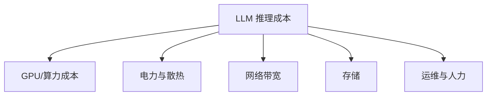
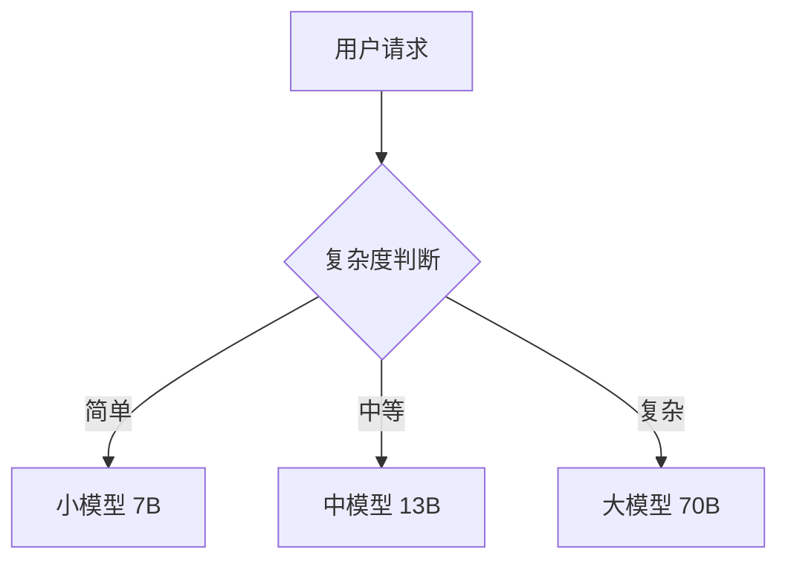

# LLM 推理成本优化

## 一句话总结

**LLM 推理成本优化**通过技术手段降低单位 token 的推理开销，主要方向包括模型压缩、缓存复用、批处理优化和硬件调度。

---

## 成本构成



其中 **GPU 算力** 通常占最大比例。

---

## 优化方向

### 1. 模型层面

| 技术 | 效果 | 复杂度 |
|---|---|---|
| **量化（INT8/INT4/FP8）** | 降低显存和计算 | 低 |
| **剪枝** | 减少参数量 | 中 |
| **蒸馏** | 使用更小模型 | 高 |
| **MoE 架构** | 推理时只激活部分参数 | 中 |

### 2. 推理引擎层面

| 技术 | 效果 | 代表 |
|---|---|---|
| **KV Cache** | 避免重复计算 | 所有引擎 |
| **PagedAttention** | 减少显存碎片 | vLLM |
| **Continuous Batching** | 提高吞吐 | vLLM、Triton |
| **Speculative Decoding** | 降低有效延迟 | Medusa、Lookahead |
| **FlashAttention** | 加速 Attention | 主流引擎 |

### 3. 系统架构层面

| 技术 | 效果 |
|---|---|
| **Prefill-Decode 分离** | 分别优化两阶段资源 |
| **Prompt Cache** | 缓存常见 prompt 的 KV Cache |
| **自动扩缩容** | 按需使用 GPU |
| **Spot 实例** | 降低云计算成本 |
| **请求路由** | 小请求用小模型，大请求用大模型 |

---

## 成本计算公式

```
单位 token 成本 = GPU 小时成本 / 每小时生成 token 数

每小时生成 token 数 = 3600 / TPOT × batch_size
```

因此，降低 TPOT 和提高 batch size 是降低成本的关键。

---

## 实战策略

### 策略 1：量化 + vLLM

```bash
# AWQ 量化模型 + vLLM 服务
python -m vllm.entrypoints.openai.api_server \
    --model TheBloke/Llama-2-7B-AWQ \
    --quantization awq \
    --max-num-seqs 256
```

### 策略 2：Prompt Cache

缓存高频 query 的 KV Cache，如：

- System prompt；
- 常见文档的 embedding；
- 重复的用户输入。

### 策略 3：模型路由



### 策略 4：Speculative Decoding

```bash
# vLLM 支持 draft model 推测解码
python -m vllm.entrypoints.openai.api_server \
    --model meta-llama/Llama-2-70b-chat-hf \
    --speculative-model meta-llama/Llama-2-7b-chat-hf
```

---

## 成本优化 checklist

- [ ] 是否使用了量化模型？
- [ ] 是否启用了 Continuous Batching？
- [ ] 是否对常见 prompt 做了缓存？
- [ ] 是否根据请求复杂度路由不同模型？
- [ ] 是否按需扩缩容？
- [ ] 是否监控单位 token 成本？
- [ ] 是否使用 spot 实例或预留实例？

---

## 延伸阅读

- [[_concepts/quantization|模型量化]]
- [[_concepts/speculative-decoding|推测解码]]
- [[_concepts/prefill-decode-disaggregated|Prefill-Decode 分离]]
- [[_concepts/inference-cluster-scheduling|推理集群调度]]
- [[_concepts/vllm-practical|vLLM 实战]]
