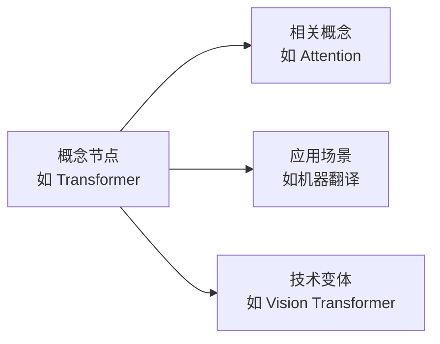

# 笔记与知识沉淀 (Notes)

> **一句话理解**: 本章节是 AI 全栈知识的"底层数据库"——包含概念知识图谱、全栈概念索引和知识库元数据，为整个项目提供统一的知识组织和检索基础。

---

## 本章内容

| 文档 | 内容 | 规模 |
|------|------|------|
| [AI Concept Knowledge Graph](./AI_Concept_Knowledge_Graph.md) | AI 领域概念的知识图谱：概念、关系、属性 | ~1,300 个概念节点 |
| [AI Full Stack Concepts](./AI_Full_Stack_Concepts.md) | AI 全栈技术概念字典：术语定义、技术关联 | ~500 个术语条目 |
| [Knowledge Base](./KNOWLEDGE_BASE.md) | 知识库使用指南与元数据说明 | 导航说明 |

---

## 使用场景

### 1. 概念查询
当你遇到不熟悉的 AI 术语时：
- 先在 [AI Full Stack Concepts](./AI_Full_Stack_Concepts.md) 中搜索术语定义
- 再到 [AI Concept Knowledge Graph](./AI_Concept_Knowledge_Graph.md) 查看概念之间的关系

### 2. 知识图谱探索

### 3. 项目维护
- 新增文档时，参考 [AI Full Stack Concepts](./AI_Full_Stack_Concepts.md) 确保术语使用一致
- 更新知识图谱时，同步修改 [AI Concept Knowledge Graph](./AI_Concept_Knowledge_Graph.md)

---

## 与其他章节的关联

本章节不直接面向学习者，而是作为**全项目的知识基础设施**：
- 为 [00_AI_Introduction/AI_Glossary.md](../00_AI_Introduction/AI_Glossary.md) 提供底层数据
- 为 [90_Learn/pathways/](../90_Learn/pathways/) 学习路径提供概念关联
- 为各章节的交叉引用提供术语标准化支持

---

*本章节数据量较大（~130KB），建议使用文本编辑器的搜索功能进行查询。*

## Related
- [[_meta/notes/README|笔记与知识沉淀 (Notes)]]
- [[_meta/notes/README_for_dummy|91 Notes — 小白版 📚]]

- [[_meta/notes/AI_Concept_Knowledge_Graph.md|AI_Concept_Knowledge_Graph]]
- [[_meta/notes/AI_Full_Stack_Concepts.md|AI_Full_Stack_Concepts]]
- [[_meta/notes/KNOWLEDGE_BASE.md|KNOWLEDGE_BASE]]

