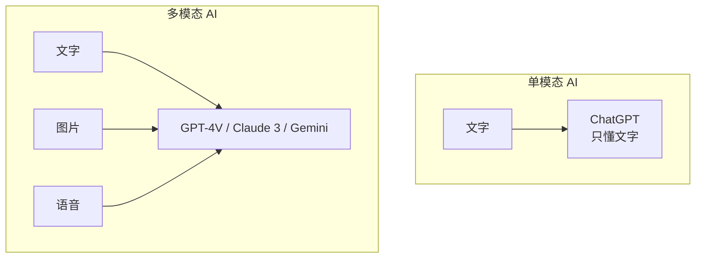
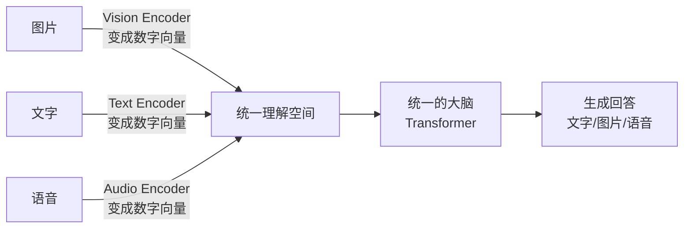
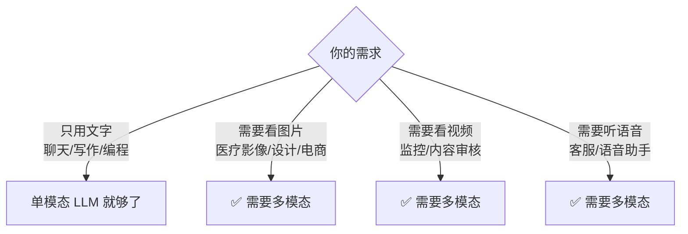
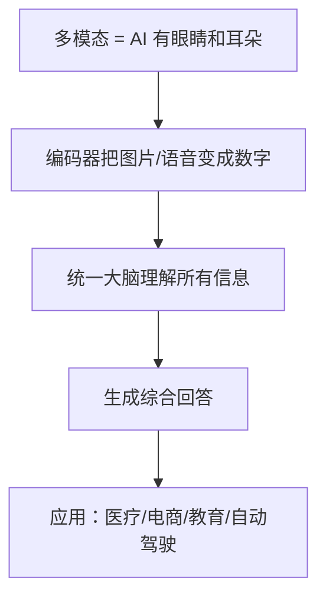

# 多模态模型小白指南 (Multimodal Models for Dummy)

> **一句话理解**: 多模态模型就像一个有"眼睛和耳朵"的 AI——不仅能读文字，还能看图片、听声音，然后综合所有信息来回答你。

---

## 🤔 什么是多模态？

### 用人类来比喻

你和朋友聊天时：
- 听到**声音**（语音）
- 看到**表情和手势**（视觉）
- 理解**话语内容**（文字）

多模态 AI 就是同时处理多种"感觉输入"的 AI。

---

## 🧩 多模态模型能做什么？

| 能力 | 例子 |
|------|------|
| **看图说话** | 你给一张猫的照片，它说"这是一只橘猫在沙发上睡觉" |
| **视觉问答** | 你问"图里有几个人？"，它回答"3 个" |
| **图文理解** | 你给一张菜单照片，它帮你算出总价 |
| **视频分析** | 看一段视频，总结发生了什么 |
| **听音识图** | 听到"汪汪"，联想到狗的照片 |

---

## 🔧 多模态是怎么工作的？（简化版）

### 三个关键步骤

1. **编码器（Encoder）** = 翻译官
   - 图片编码器：把像素变成 AI 能懂的数字（如 CLIP/ViT）
   - 文字编码器：把词语变成数字（如 BERT/GPT）
   - 语音编码器：把声波变成数字

2. **对齐（Alignment）** = 统一语言
   - 让"狗"这个字和狗的照片在数字空间里靠得很近

3. **生成器（Decoder）** = 输出答案
   - 根据理解生成文字、图片或语音

---

## 🏆 主流多模态模型

| 模型 | 公司 | 能看什么 | 特点 |
|------|------|---------|------|
| **GPT-4V** | OpenAI | 图片 | 理解力强，细节好 |
| **Claude 3** | Anthropic | 图片 | 安全性高，长文本 |
| **Gemini** | Google | 图片、视频、语音 | 原生多模态，视频理解强 |
| **LLaVA** | 开源 | 图片 | 小而快，可本地部署 |
| **Qwen-VL** | 阿里 | 图片 | 中文理解好 |

---

## 🎯 什么时候需要多模态？

### 典型应用场景

| 行业 | 应用 |
|------|------|
| **医疗** | 看 X 光片/CT，辅助诊断 |
| **电商** | 用户上传照片找相似商品 |
| **教育** | 学生拍数学题，AI 讲解 |
| **自动驾驶** | 摄像头+雷达融合理解路况 |
| **内容审核** | 同时检查图文是否违规 |

---

## ⚠️ 局限性与风险

| 问题 | 说明 |
|------|------|
| **幻觉** | 可能看错图（把猫看成狗） |
| **细节丢失** | 图片压缩后小字看不清 |
| **偏见** | 训练数据中的刻板印象 |
| **计算贵** | 处理图片比文字慢得多、贵得多 |
| **隐私** | 上传照片可能泄露隐私 |

---

## 💡 核心要点

---

## 🔗 相关主题

- [LLM 架构](../LLM_Architectures/LLM_Architectures.md) — 大模型基础架构
- [Prompt Engineering](../Prompt_Engineering/Prompt_Engineering.md) — 如何给多模态模型下指令
- [计算机视觉](../../计算机视觉/README.md) — 视觉技术基础

---

*Last updated: 2026-05-07*

## Related

- [[大模型/Multimodal_Models/Multimodal_Architectures_2026.md|Multimodal_Architectures_2026]]
- [[大模型/Fine_tuning_Techniques/Axolotl_Deep_Dive.md|Axolotl_Deep_Dive]]
- [[大模型/Fine_tuning_Techniques/Fine_tuning_Techniques.md|Fine_tuning_Techniques]]
- [[大模型/Fine_tuning_Techniques/Fine_tuning_Techniques_for_dummy.md|Fine_tuning_Techniques_for_dummy]]
- [[大模型/Fine_tuning_Techniques/Model_Merging_2026.md|Model_Merging_2026]]
