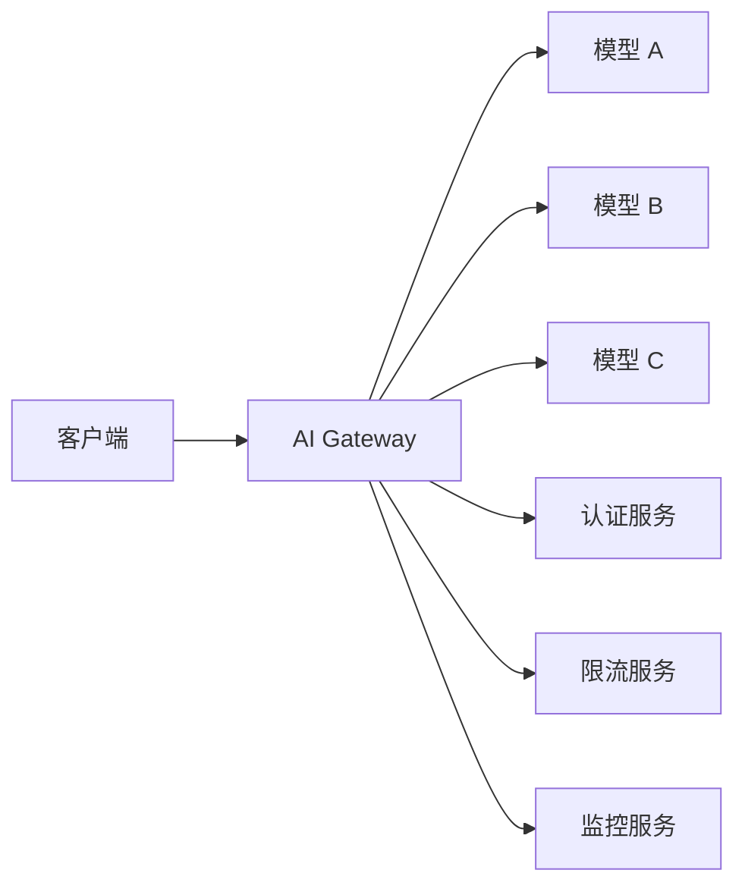

# 14 AI Gateway — 小白版 🚪

> **一句话秒懂**: AI Gateway 就是 AI 系统的"智能路由器"——管理 AI 请求的路由、限流、认证、监控，让多个 AI 模型和服务像一个整体一样高效运行。

## 为什么要学 AI Gateway？

想象一下：
- 🚪 你有多个 AI 服务，怎么统一管理？
- ⚡ 请求太多，AI 服务扛不住怎么办？
- 🔐 怎么控制谁可以用 AI、用多少？

**AI Gateway = AI 的"门卫 + 路由器 + 监控中心"**

## AI Gateway 能做什么？

### 1. 智能路由

```
【场景】你有多个 AI 模型

┌─────────────────────────────────────┐
│            AI Gateway               │
├─────────────────────────────────────┤
│                                     │
│  用户请求 → 路由到合适的 AI         │
│                                     │
│  "翻译" → 翻译专用模型              │
│  "写代码" → Code专用模型            │
│  "聊天" → 通用对话模型              │
│                                     │
└─────────────────────────────────────┘
```

### 2. 限流保护

```
【场景】秒杀活动，海量请求

没有 Gateway:
- AI 服务直接崩溃 ❌

有 Gateway:
- 请求排队，超限拒绝
- 保护 AI 服务不被压垮 ✓

限流策略:
- 每用户 N 次/分钟
- 每 IP N 次/分钟
- 总体 N 次/秒
```

### 3. 认证与安全

```
【功能】
✓ API Key 管理
✓ 访问令牌验证
✓ 敏感词过滤
✓ 防注入攻击
```

### 4. 监控与日志

```
【监控内容】
- 请求量
- 响应时间
- 错误率
- Token 消耗
- 各模型调用量
```

## 核心功能

```
┌─────────────────────────────────────────────────────────┐
│                    AI Gateway 功能                       │
├─────────────────────────────────────────────────────────┤
│                                                         │
│  🚦 路由 ─── 基于路径/参数的智能路由                      │
│  ⚡ 限流 ─── 多维度限流策略                              │
│  🔐 安全 ─── 认证、鉴权、风控                           │
│  📊 监控 ─── 实时指标、日志、告警                        │
│  🔄 降级 ─── AI 服务故障时的保底策略                     │
│  💰 计费 ─── 按用户/项目统计用量                        │
│                                                         │
└─────────────────────────────────────────────────────────┘
```

## 技术架构



## 选型对比

| 产品 | 特点 | 适用场景 |
|------|------|---------|
| Kong | 通用 API 网关 + AI 插件 | 已有 Kong 的团队 |
| Apache APISIX | 高性能 + AI 插件 | 需要高性能 |
| 阿里云 API 网关 | 云服务 + AI 能力 | 国内云用户 |
| 自建 | 完全可控 | 大厂自研 |

## 应用场景

### 1. 多模型统一接入

```
【问题】团队有多个 AI 服务，调用方式各异

【解决】统一通过 Gateway 接入

- 统一 API 格式
- 统一认证鉴权
- 统一监控限流
```

### 2. 模型 A/B 测试

```
【场景】想对比两个模型的效果

Gateway 配置:
- 50% 流量 → 模型 A
- 50% 流量 → 模型 B

自动收集效果数据，对比决策
```

### 3. 成本控制

```
【场景】LLM 调用成本高

Gateway 能力:
- 统计各用户/项目的 token 消耗
- 设置预算上限，超限自动拒绝
- 优化 prompt，减少 token 消耗
```

## 下一步

- 想深入技术？→ 查看子目录具体文档
- 想学架构？→ [架构基建/README_for_dummy.md](伦理安全/README_for_dummy.md)
- 想学部署？→ [部署推理/README_for_dummy.md](伦理安全/README_for_dummy.md)

---

*本文是 [README.md](../../README.md) 的简化版，适合零基础读者。*

## Related

- [[架构基建/AI_Gateway/AI_Gateway_2026.md|AI_Gateway_2026]]
- [[架构基建/AI_Gateway/AI_Gateway_for_dummy.md|AI_Gateway_for_dummy]]
- [[架构基建/AI_Gateway/Cohere_Deep_Dive.md|Cohere_Deep_Dive]]
- [[架构基建/AI_Gateway/Gateway-in-nutshell.md|Gateway-in-nutshell]]
- [[架构基建/AI_Gateway/Kong_AI_Gateway_Deep_Dive.md|Kong_AI_Gateway_Deep_Dive]]

- [[架构基建/README|架构与基础设施 (Architecture & Infrastructure)]]
