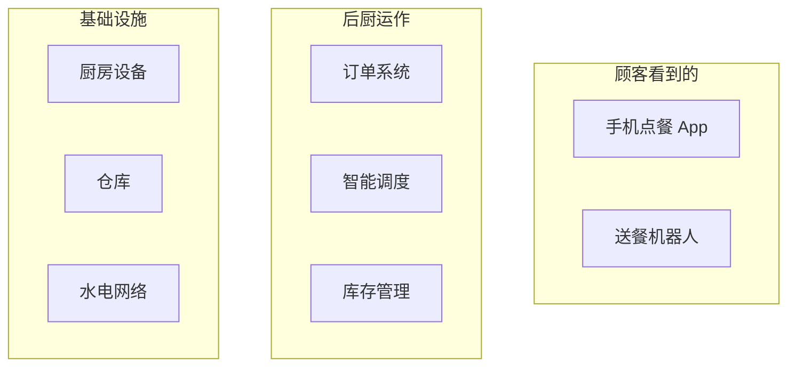
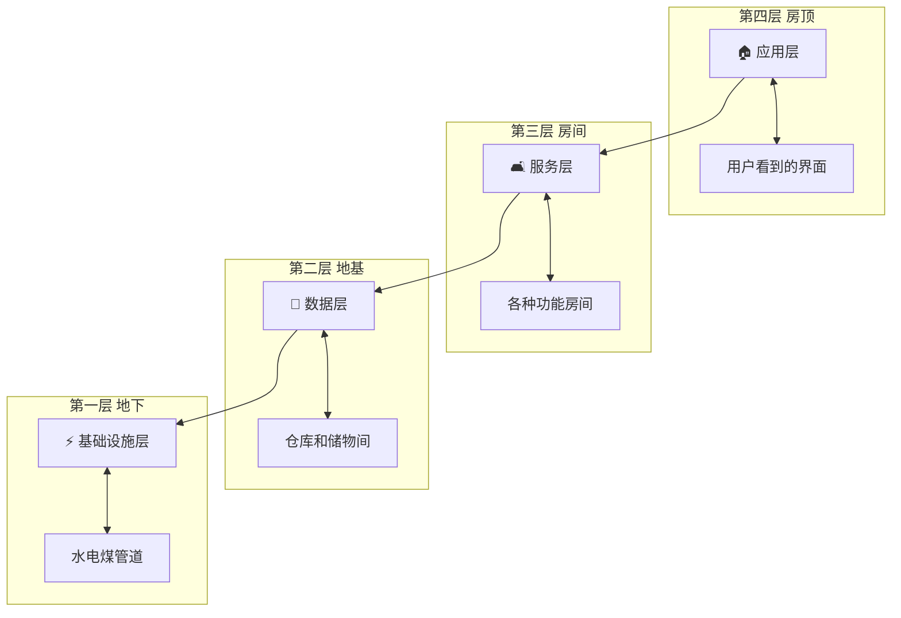
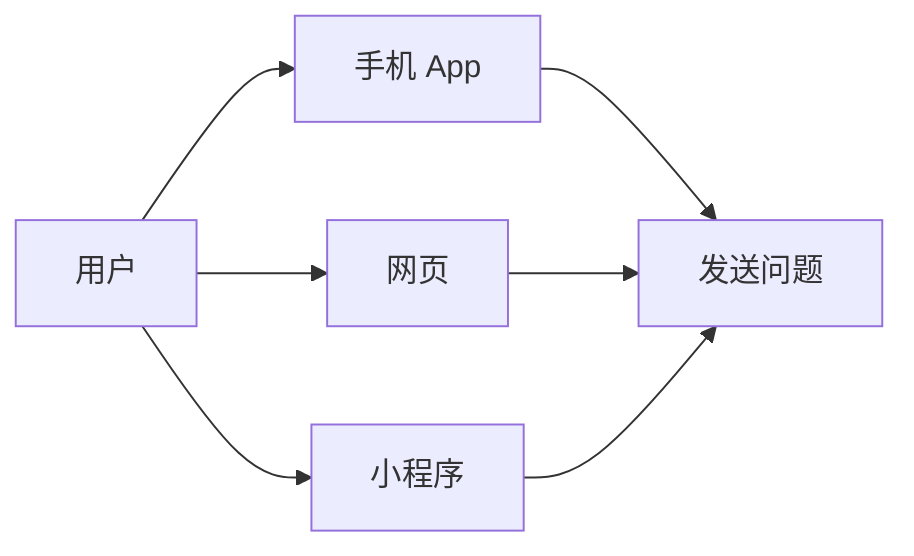
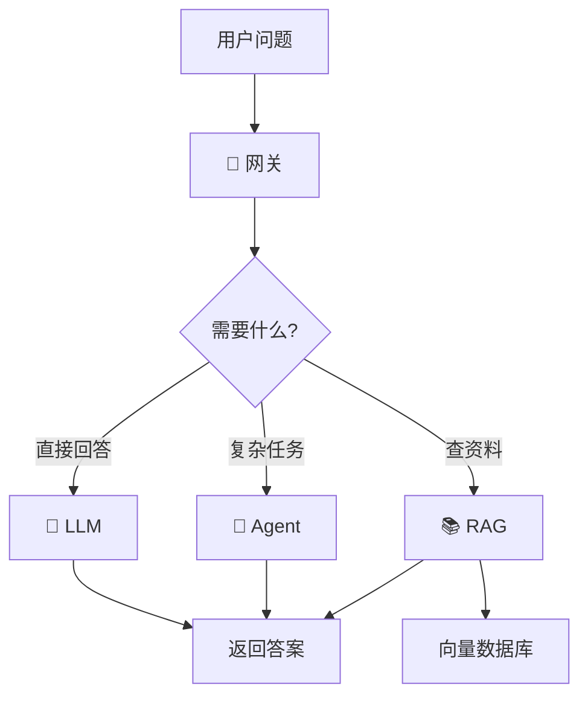
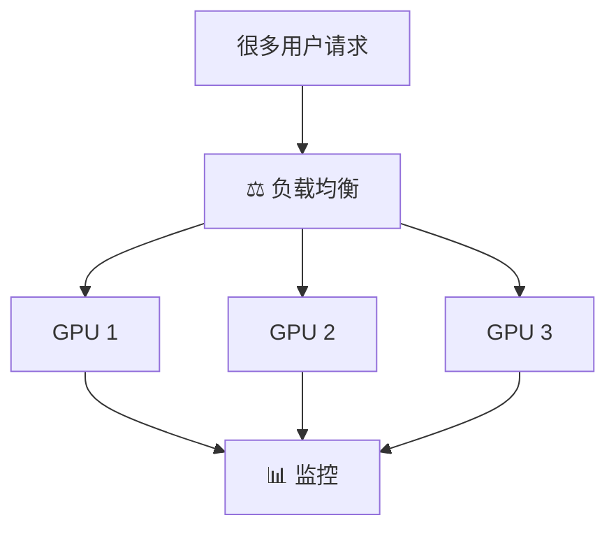
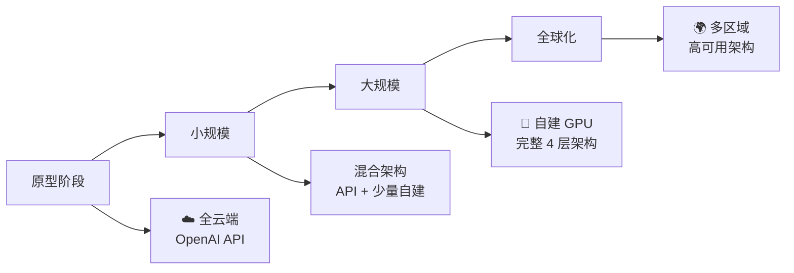
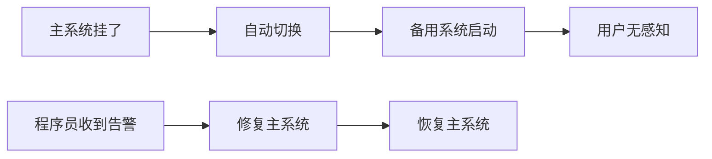

# AI 架构基础设施 - 小白版

> **一句话理解**: AI 架构就像盖房子——地基（服务器）、水管电线（网络）、房间布局（服务层）、家具摆设（应用层），每层都要规划好，房子才能住得舒服。

---

## 🏠 什么是 AI 架构？

想象你要开一家智能餐厅：



**AI 架构也是一样的道理**——用户看到的只是聊天界面，背后有一套复杂系统在运转。

---

## 🧱 四层架构（用盖房子比喻）

### 整体比喻



---

## 📱 第一层：应用层（房顶）

**就像**：房子的屋顶和外观——用户第一眼看到的

**是什么**：
- 手机 App
- 网页聊天界面
- 微信小程序
- 智能音箱



**💡 小白理解**：
- 就像微信的聊天界面
- 你打字的地方、看到的回复
- 按钮、颜色、动画都属于这一层

---

## 🛋️ 第二层：服务层（房间）

**就像**：房子的各个房间——厨房、卧室、客厅，各有功能

**是什么**：
- **AI 网关** 🚪：大门保安，检查你是谁、能不能进
- **LLM 服务** 🧠：大脑，思考问题给出答案
- **RAG 系统** 📚：图书管理员，帮你查资料
- **Agent 编排** 🤖：管家，协调多个 AI 做事



**💡 小白理解**：

| 组件 | 生活比喻 | 做什么 |
|------|----------|--------|
| 网关 | 小区保安 | 检查身份、控制流量 |
| LLM | 大学教授 | 回答知识性问题 |
| RAG | 图书管理员 | 查公司资料、文档 |
| Agent | 私人管家 | 订机票、发邮件等操作 |

---

## 🗄️ 第三层：数据层（仓库）

**就像**：房子的地下室、仓库——存放东西的地方

**是什么**：
- **向量数据库** 📦：存 AI 能理解的"语义快递单"
- **知识库** 📖：存公司文档、产品手册
- **缓存** ⚡：存最近常用的东西，拿得快
- **特征存储** 🏷️：存整理好的数据标签


**💡 小白理解**：

普通数据库就像图书馆的**书名目录**——按书名查找。

向量数据库就像图书馆的**内容分类**——你说"想找讲猫咪的书"，它能找到《宠物饲养》《动物百科》，即使书名里没有"猫"字。

---

## ⚡ 第四层：基础设施层（水电煤）

**就像**：房子的地基、水管、电线——看不见但离不开

**是什么**：
- **GPU 集群** 💪：AI 的"肌肉"，越强壮算得越快
- **负载均衡** ⚖️：交通警察，让请求均匀分配
- **监控系统** 📊：体检仪器，随时看系统健不健康
- **CI/CD** 🔄：自动装修队，更新系统不中断



**💡 小白理解**：

| 组件 | 生活比喻 | 没有它会怎样 |
|------|----------|--------------|
| GPU | 跑车引擎 | 回答慢得像蜗牛 |
| 负载均衡 | 多窗口售票 | 一个窗口排大队 |
| 监控 | 体温计 | 生病了都不知道 |
| CI/CD | 不停业装修 | 更新系统要关门 |

---

## ☁️ 云端 vs 本地（租房 vs 买房）

### 比喻

```mermaid
flowchart TB
    subgraph 云端 ☁️
        A1[租房] --> A2[拎包入住]
        A1 --> A3[按月交租]
        A1 --> A4[房东修东西]
        A1 --> A5[不能随便改造]
    end
    
    subgraph 本地 🏢
        B1[买房] --> B2[自己装修]
        B1 --> B3[一次性投入大]
        B1 --> B4[自己维护]
        B1 --> B5[想怎么改都行]
    end
```

### 对比

| 维度 | 云端 (租房) | 本地 (买房) |
|------|-------------|-------------|
| 启动速度 | ⚡ 几分钟 | 🐢 几周到几个月 |
| 初期投入 | 💰 低 | 💰💰💰 高 |
| 维护责任 | 云厂商管 | 自己管 |
| 数据隐私 | 🔓 在人家地盘 | 🔒 在自己家 |
| 灵活定制 | 有限制 | 完全自由 |
| 长期成本 | 越用越贵 | 固定投入 |

**💡 什么时候选什么？**

- **刚起步 / 试想法** → 云端（租房）
- **数据很敏感（医院、银行）** → 本地（买房）
- **用量大且稳定** → 本地更划算
- **想快速上线** → 云端

---

## 🎯 什么时候需要什么？

### 不同阶段的架构需求



| 阶段 | 用户量 | 核心需求 | 建议架构 |
|------|--------|----------|----------|
| **原型** | <100 | 快速验证 | 直接调 API |
| **MVP** | 1K-10K | 成本控制 | API + 简单后端 |
| **成长** | 10K-100K | 稳定性 | 自托管 + 缓存 |
| **成熟** | 100K+ | 性能 + 成本 | 完整 4 层 + 多副本 |
| **企业** | 内部使用 | 安全隐私 | 完全私有化 |

---

## 📦 常见组件选择（买菜清单）

### 网关选择

| 名字 | 特点 | 适合谁 |
|------|------|--------|
| LiteLLM | 免费、支持 100+ 模型 | 技术团队 |
| Portkey | 功能全、有仪表盘 | 中小公司 |
| 自建网关 | 完全可控 | 大企业 |

### 向量数据库选择

| 名字 | 特点 | 适合谁 |
|------|------|--------|
| Chroma | 最简单，几行代码搞定 | 初学者 |
| Qdrant | 速度快，功能多 | 中等规模 |
| Milvus | 能处理十亿级数据 | 大公司 |
| PGVector | PostgreSQL 插件 | 已有 PG 的团队 |

---

## ❓ 小白常见问题

### Q1: 小公司需要完整的 4 层架构吗？

**A**: 不需要！就像一个人住不需要大别墅。

```
阶段建议:
- 1-3 人团队: 直接调 OpenAI API + 前端
- 5-10 人团队: 加网关和数据库
- 20+ 人团队: 考虑完整架构
```

### Q2: GPU 为什么那么贵？

**A**: GPU 是 AI 的"大脑"，计算能力超强。

```
比喻:
CPU 像普通轿车 —— 适合日常代步
GPU 像 F1 赛车 —— 专门跑计算赛道

F1 赛车当然贵啦！
但你可以:
- 租 instead of 买（云服务）
- 和别人合租（共享 GPU）
- 开小一点的赛车（量化模型）
```

### Q3: 什么是"向量"？为什么数据库要存向量？

**A**: 向量是 AI 理解世界的"语言"。

```
人类理解: "猫"是一种毛茸茸、会叫的动物
AI 理解: "猫" = [0.2, -0.5, 0.8, 0.1, ...] （一串数字）

好处:
- "猫"和" kitten"的向量很接近 → AI 知道它们相关
- "猫"和"汽车"的向量很远 → AI 知道它们无关

向量数据库就是专门搜"意思相近"的数据库
```

### Q4: 系统宕机了怎么办？

**A**: 好的架构都有"备胎"。



### Q5: 怎么判断我的架构够不够用？

**A**: 看三个指标：

| 指标 | 健康 | 危险 |
|------|------|------|
| 响应时间 | < 2 秒 | > 5 秒 |
| 可用性 | > 99.9% | 经常报错 |
| 成本占比 | < 收入的 20% | 越用越亏 |

---

## 🎓 小白学习路线


| 阶段 | 做什么 | 学会什么 |
|------|--------|----------|
| 1 | 读完本文 | 知道每层是干嘛的 |
| 2 | 用 API 搭聊天机器人 | 理解请求-响应 |
| 3 | 加向量数据库做知识库 | 理解 RAG |
| 4 | 部署到云服务器 | 理解运维 |
| 5 | 看监控、调配置 | 理解优化 |

---

## 🔗 想深入了解？

- [AI 架构速成指南](./Architecture-in-nutshell.md) —— 技术细节版
- [RAG 速成指南](../RAG系统/RAG-in-nutshell.md) —— 知识库怎么搭
- [推理速成指南](../部署推理/Inference-in-nutshell.md) —— 模型怎么跑
- [MLOps 速成指南](../MLOps/MLOps-in-nutshell.md) —— 自动化运维

---

*Last updated: 2026-05-07*

## Related

- [[架构基建/Architecture_Overview/AI_Infrastructure_2026]] — AI Infrastructure 2026 完全指南 (共享: architecture, high-availability, infrastructure, kubernetes)
- [[架构基建/Architecture-in-nutshell]] — AI 架构速成指南 (共享: architecture, high-availability, infrastructure, kubernetes)
- [[架构基建/Architecture_Overview/Spring_AI_Architecture]] — Spring AI 系统架构设计 (共享: architecture, high-availability, infrastructure, kubernetes)
- [[AI_Cost_Optimization_2026|AI_Cost_Optimization_2026]]
- [[High_Availability_2026|High_Availability_2026]]
