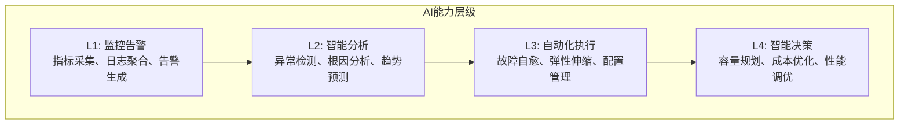
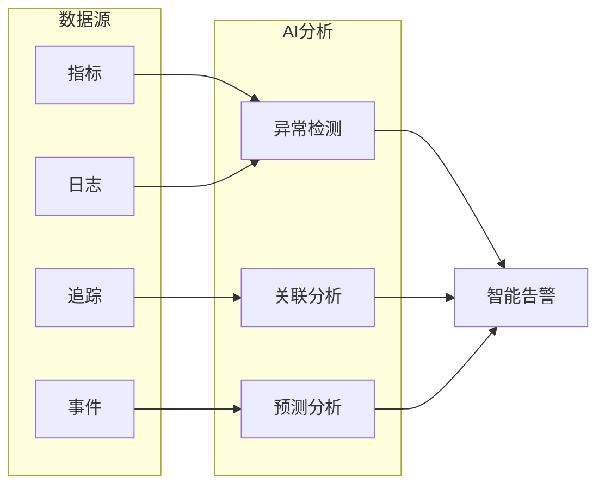
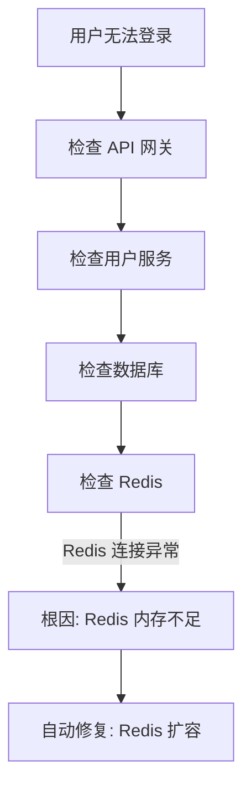
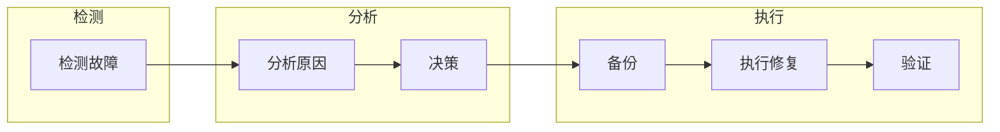

# AI Ops 速成指南

> 🎯 **目标**：理解 AI Ops 的核心概念、智能监控、异常检测和自动修复能力。

---

## 🤔 什么是 AI Ops？

**AI Ops** = 用 AI 能力让运维更智能。

```
传统运维:                    AI Ops:
                           
告警 → 人工排查 → 修复       告警 → AI 分析 → 自动修复
   (慢，被动)                  (快，主动)
```

---

## 🏗️ AI Ops 能力层级



---

## 👁️ 智能监控



---

## 🔍 异常检测原理

```
AI 如何检测异常？

正常模式学习:
┌────────────────────────────────────┐
│ AI 学习系统正常是什么样              │
│                                    │
│ CPU: 40-70% (波动)                 │
│ 内存: 50-65% (稳定)                │
│ 延迟: 50-150ms (正常)               │
│                                    │
│ 建立动态基线...                      │
└────────────────────────────────────┘

异常判断:
┌────────────────────────────────────┐
│ 当前 CPU: 95%                       │
│ 正常范围: 40-70%                    │
│ 偏离程度: 远超正常                   │
│                                    │
│ AI: "这是异常！需要告警！"          │
└────────────────────────────────────┘
```

---

## 🎯 根因分析



---

## 🤖 自动修复



| 故障类型 | 自动修复策略 |
|----------|-------------|
| 服务无响应 | 健康检查失败 3 次 → 重启服务 |
| 内存泄漏 | 定期检测 → 自动重启服务 |
| CPU 过高 | 扩容或负载均衡 |
| 外部依赖超时 | 熔断 → 降级 |

---

## 📊 告警智能聚合

```
问题: 500 条告警，怎么处理？

┌────────────────────────────────────┐
│ 原始告警 (500 条):                  │
│                                    │
│ CPU 高告警 #1                       │
│ CPU 高告警 #2                       │
│ ... (498 条类似)                    │
│ 服务延迟告警 #1                      │
│ 服务延迟告警 #2                      │
│ ...                                │
└────────────────────────────────────┘

         ↓ AI 聚合

┌────────────────────────────────────┐
│ 聚合后告警 (5 条):                  │
│                                    │
│ 🚨 [P1] 数据库压力导致服务延迟       │
│    影响: 5 个服务                   │
│    告警数: 47 → 1 条               │
│    建议: 检查数据库连接池            │
└────────────────────────────────────┘
```

---

## 🔧 核心工具

| 工具类型 | 代表工具 | 用途 |
|----------|----------|------|
| 指标监控 | Prometheus | 采集和存储指标 |
| 可视化 | Grafana | 仪表盘和告警 |
| 日志管理 | ELK/Loki | 日志聚合和搜索 |
| 链路追踪 | Jaeger | 分布式追踪 |
| AIOps 平台 | Datadog/Splunk | AI 驱动分析 |

---

## 📝 关键术语

| 术语 | 解释 |
|------|------|
| **MTTR** | Mean Time To Recovery，平均恢复时间 |
| **异常检测** | 自动发现系统不正常的行为 |
| **根因分析 (RCA)** | Root Cause Analysis，找到问题源头 |
| **自愈** | 自动检测并修复故障 |
| **告警疲劳** | 告警太多导致的麻木 |
| **动态基线** | AI 学习正常范围，自动调整阈值 |

---

## 🔗 相关主题

| 主题 | 文档 |
|------|------|
| 完整架构 | [AI_Ops_2026.md](运维/AI_Ops_2026.md) |
| 入门指南 | [AI_Ops_for_dummy.md](运维/AI_Ops_for_dummy.md) |
| SRE 实践 | [SRE_for_AI_Systems.md](./SRE_Reliability/SRE_for_AI_Systems.md) |
| 事故响应 | [AI_Incident_Response_Playbook.md](运维/SRE_Reliability/AI_Incident_Response_Playbook) |
| 可观测性 | [AI_Observability_Guide.md](MLOps/Observability/AI_Observability_Guide.md) |

---

*Last updated: 2026-04-11*

## Related

- [[运维/SRE_Reliability/AI_Incident_Response_Playbook]] — AI 系统事故响应手册 (共享: ai-ops, incident-response, monitoring, observability)
- [[运维/AI_Ops_for_dummy]] — AI Ops 入门指南 (for Dummies) (共享: ai-ops, incident-response, monitoring, observability)
- [[运维/README]] — AI 运维与可观测性 (AI Ops) (共享: ai-ops, incident-response, monitoring, observability)
- [[运维/README_for_dummy]] — 16 AI Ops — 小白版 📡 (共享: ai-ops, incident-response, monitoring, observability)
- [[MLOps/Observability/Phoenix_Deep_Dive.md|Phoenix_Deep_Dive]]
- [[MLOps/Experiment_Tracking/Feast_Deep_Dive.md|Feast_Deep_Dive]]
- [[MLOps/Orchestration/LakeFS_Deep_Dive.md|LakeFS_Deep_Dive]]
- [[MLOps/Observability/LangSmith_Deep_Dive.md|LangSmith_Deep_Dive]]
- [[_synthesis/llm-observability-aiops|LLM 可观测性 × AIOps: 从系统监控到语义监控的范式跃迁]]
