# Direct Preference Optimization (DPO) 深度解读

> **一句话理解**: DPO 就像跳过了"先请老师打分再学"的中间步骤——直接从人类偏好数据学习，不需要单独训练奖励模型

---

## 论文基本信息

| 属性 | 内容 |
|------|------|
| **标题** | Direct Preference Optimization: Your Language Model is Secretly a Reward Model |
| **作者** | Rafael Rafailov, Archit Sharma, Alan Mitchell, Stefano Ermon, Christopher D. Manning, Chelsea Finn (Stanford) |
| **发表** | NeurIPS 2023 (Outstanding Paper Award) |
| **引用量** | 5,000+ (截至 2026) |
| **论文链接** | [arXiv:2305.18290](https://arxiv.org/abs/2305.18290) |
| **核心贡献** | 证明语言模型可以隐式充当奖励模型，直接从偏好数据优化策略 |

---

## 1. 历史背景：为什么需要 DPO？

### 1.1 RLHF 的痛点

DPO 的出现是为了克服 RLHF (Reinforcement Learning from Human Feedback) 的固有缺陷：

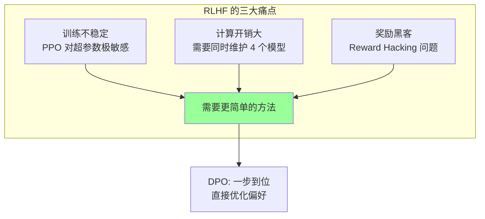

### 1.2 RLHF 的复杂性

传统 RLHF 需要维护 4 个模型并执行复杂的 PPO 训练循环：

| 模型 | 作用 | 参数量 | 显存需求 |
|------|------|--------|---------|
| **策略模型 (Policy)** | 正在训练的模型 | 7B-70B | 14-140 GB |
| **参考模型 (Reference)** | 冻结的 SFT 模型 | 7B-70B | 14-140 GB |
| **奖励模型 (Reward)** | 评估输出质量 | 7B-70B | 14-140 GB |
| **价值模型 (Value/Critic)** | PPO 的价值估计 | 7B-70B | 14-140 GB |

> **总计**：训练一个 7B 的 RLHF 模型需要约 56 GB 显存 (仅模型参数)，加上优化器状态和激活值，实际需要 200+ GB。

### 1.3 RLHF 的流程复杂度

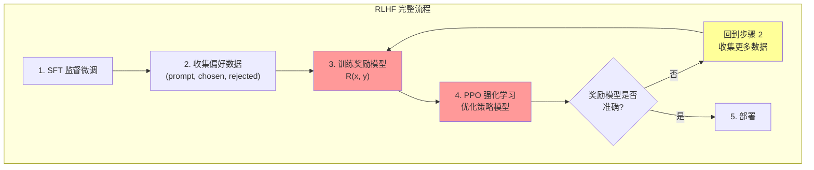

### 1.4 DPO 之前：为什么没人想到直接优化？

在 DPO 之前，学界普遍认为**偏好优化必须通过奖励模型 + 强化学习**：

| 原因 | 解释 | DPO 如何打破 |
|------|------|-------------|
| **偏好数据不适合直接训练** | 偏好数据是"相对"信号，不是绝对分数 | 通过数学推导将偏好信号转化为闭式解 |
| **需要 RL 探索** | 认为策略需要探索才能发现好回答 | 证明可以用参考模型隐式约束探索 |
| **奖励模型泛化更好** | 独立的奖励模型可以在未见数据上泛化 | DPO 的策略模型本身泛化能力足够 |

---

## 2. DPO 的核心创新

### 2.1 一句话概括

**DPO 证明了一个令人惊讶的数学结论：语言模型本身就隐式包含了一个奖励函数。通过一个优雅的数学变换，可以直接从偏好数据训练语言模型，完全不需要单独训练奖励模型。**

### 2.2 核心直觉

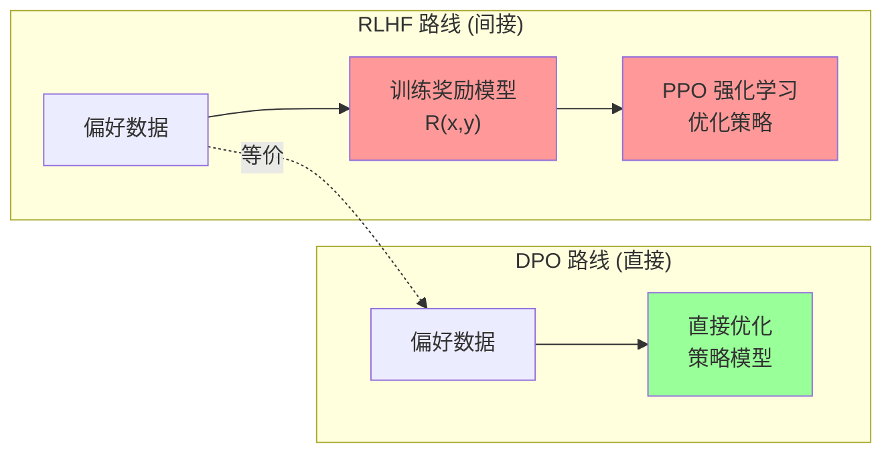

### 2.3 关键数学推导

DPO 的核心洞察是一个**数学等价变换**：

**步骤 1：RLHF 的目标函数**

```
max_π  E[π(y|x)] [R(x,y)] - β · KL(π(y|x) || π_ref(y|x))
```

其中 `π` 是策略模型，`π_ref` 是参考模型，`R` 是奖励函数，`β` 是 KL 约束系数。

**步骤 2：最优策略的闭式解**

```
π*(y|x) = (1/Z(x)) · π_ref(y|x) · exp(R(x,y) / β)
```

**步骤 3：反推隐式奖励 (关键步骤)**

```
R(x,y) = β · log(π(y|x) / π_ref(y|x)) + β · log Z(x)
```

这就是 DPO 的核心洞察：**策略模型的输出概率本身就定义了一个隐式奖励函数**。

**步骤 4：代入 Bradley-Terry 偏好模型**

```
P(y_w > y_l | x) = σ(R(x, y_w) - R(x, y_l))
                 = σ(β · [log(π(y_w|x)/π_ref(y_w|x)) - log(π(y_l|x)/π_ref(y_l|x))])
```

其中 `σ` 是 sigmoid 函数，`y_w` 是偏好回答，`y_l` 是非偏好回答。

### 2.4 DPO 损失函数

最终的 DPO 损失函数极其简洁：

```
L_DPO(π) = -E[log σ(β · log(π(y_w|x)/π_ref(y_w|x)) - β · log(π(y_l|x)/π_ref(y_l|x)))]
```

**直觉解释**：

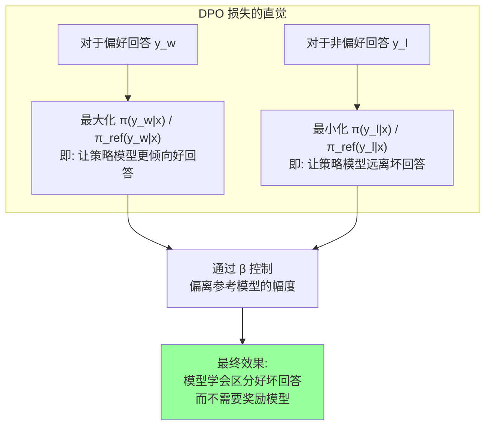

### 2.5 DPO 与 RLHF 的等价性证明

| 步骤 | RLHF | DPO |
|------|------|-----|
| 1 | 训练奖励模型 R(x,y) | 跳过 |
| 2 | 用 R 训练 PPO 策略 | 用偏好数据直接优化 |
| 3 | KL 约束防止偏离太远 | β 参数隐式约束 |
| 4 | 策略 + 奖励模型 = 对齐模型 | 策略模型 = 对齐模型 |
| **等价性** | 理论上等价 | 数学上证明与 RLHF 等价 |

---

## 3. DPO 训练流程详解

### 3.1 完整训练流程

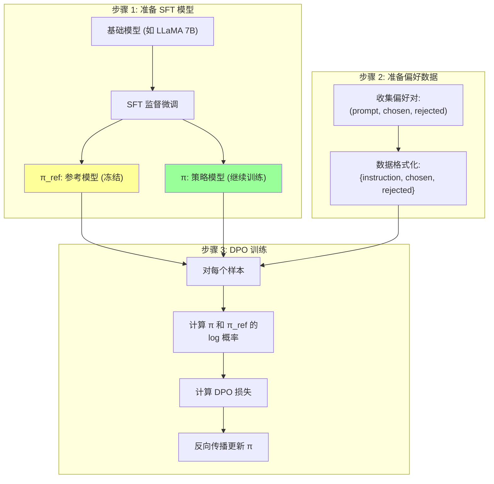

### 3.2 数据格式

DPO 训练数据格式非常简单：

```json
{
  "instruction": "解释量子力学的基本原理",
  "chosen": "量子力学是描述微观粒子行为的物理学分支...",
  "rejected": "量子力学就是量子计算机用的那个东西..."
}
```

### 3.3 训练代码示例 (TRL 库)

```python
from trl import DPOTrainer, DPOConfig
from transformers import AutoModelForCausalLM, AutoTokenizer

# 加载模型
model = AutoModelForCausalLM.from_pretrained("meta-llama/Llama-2-7b-hf")
model_ref = AutoModelForCausalLM.from_pretrained("meta-llama/Llama-2-7b-hf")
tokenizer = AutoTokenizer.from_pretrained("meta-llama/Llama-2-7b-hf")

# DPO 配置
training_args = DPOConfig(
    beta=0.1,               # KL 约束系数
    learning_rate=5e-5,
    per_device_train_batch_size=4,
    gradient_accumulation_steps=4,
    max_steps=1000,
    warmup_steps=100,
    logging_steps=10,
    output_dir="dpo_model",
)

# DPO 训练器
trainer = DPOTrainer(
    model=model,
    ref_model=model_ref,
    args=training_args,
    train_dataset=preference_dataset,
    tokenizer=tokenizer,
)

trainer.train()
```

### 3.4 关键超参数

| 超参数 | 推荐值 | 作用 | 影响 |
|--------|--------|------|------|
| **β (beta)** | 0.1-0.5 | KL 约束系数 | 越大越保守，越小变化越大 |
| **learning_rate** | 5e-7 ~ 5e-5 | 学习率 | 过大会导致训练不稳定 |
| **warmup_steps** | 10% 总步数 | 预热步数 | 防止训练初期不稳定 |
| **max_length** | 1024-2048 | 最大序列长度 | 截断过长样本 |
| **max_prompt_length** | 512 | 最大 prompt 长度 | 控制 prompt 部分长度 |

---

## 4. DPO vs RLHF 深度对比

### 4.1 系统性对比

| 维度 | RLHF (PPO) | DPO |
|------|-----------|-----|
| **训练复杂度** | 极高 (4 个模型 + PPO) | 低 (1 个模型 + 1 个冻结参考) |
| **计算资源** | 极高 (200+ GB for 7B) | 中等 (50-80 GB for 7B) |
| **训练稳定性** | 差 (PPO 超参数敏感) | 好 (标准交叉熵训练) |
| **奖励黑客** | 严重 (Reward Hacking) | 较少 (直接优化偏好) |
| **数据需求** | 偏好数据 + 奖励模型数据 | 仅偏好数据 |
| **在线 vs 离线** | 在线 (on-policy) | 离线 (off-policy) |
| **实现难度** | 高 (需要 PPO 库) | 低 (标准训练循环) |
| **泛化能力** | 强 (奖励模型泛化) | 中等 (策略直接泛化) |
| **调参空间** | 大 (PPO 超参数多) | 小 (主要 β + lr) |
| **工程成熟度** | 高 (TRL, DeepSpeed 等) | 高 (TRL, Open-Instruct 等) |

### 4.2 计算效率对比

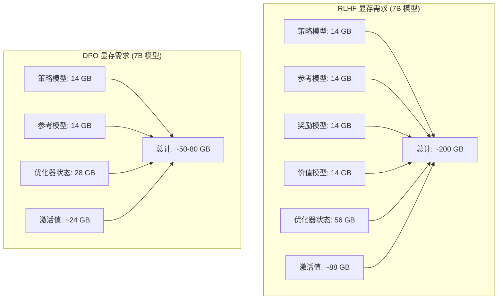

### 4.3 训练稳定性对比

| 问题 | RLHF 表现 | DPO 表现 |
|------|----------|---------|
| **训练发散** | 常见 (PPO 不稳定) | 罕见 (标准梯度下降) |
| **KL 爆炸** | 策略偏离参考模型太远 | β 参数有效约束 |
| **奖励过拟合** | 严重 (Reward Hacking) | 不适用 (无奖励模型) |
| **模式坍塌** | 可能 (策略过度集中) | 较少 (参考模型约束) |
| **超参数敏感** | 极敏感 (PPO 参数多) | 较不敏感 (主要 β) |
| **训练监控** | 困难 (多个指标) | 简单 (loss + reward margin) |

---

## 5. DPO 变体家族

### 5.1 DPO 变体全景图

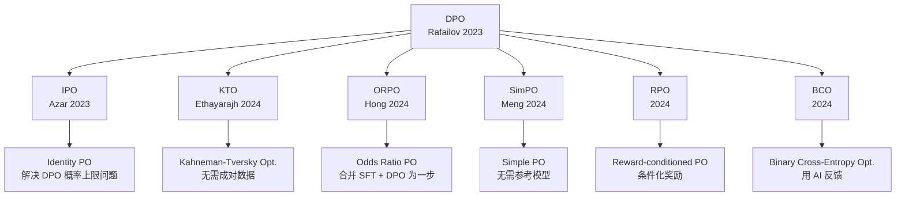

### 5.2 主要变体详细对比

| 变体 | 年份 | 核心改进 | 优势 | 劣势 |
|------|------|---------|------|------|
| **DPO** (原版) | 2023 | 基础方法 | 简单优雅，广泛验证 | 需要参考模型，对数据敏感 |
| **IPO** | 2023 | 恒等映射替代 sigmoid | 解决 DPO 的概率上限问题 | 改进幅度有限 |
| **KTO** | 2024 | 无需成对偏好数据 | 数据收集更容易 | 需要更多数据 |
| **ORPO** | 2024 | 合并 SFT + DPO 为一步 | 训练效率更高 | 新范式，验证不充分 |
| **SimPO** | 2024 | 无需参考模型 | 显存需求更低 | 缺少参考约束可能不稳定 |
| **BCO** | 2024 | AI 反馈替代人类偏好 | 可大规模生成训练数据 | AI 反馈可能有偏差 |
| **RPO** | 2024 | 条件化奖励建模 | 更细粒度的偏好 | 复杂度增加 |

### 5.3 各变体的损失函数

**DPO (原版)**
```
L = -log σ(β · [log(π(y_w)/π_ref(y_w)) - log(π(y_l)/π_ref(y_l))])
```

**IPO (Identity Preference Optimization)**
```
L = (log(π(y_w)/π_ref(y_w)) - log(π(y_l)/π_ref(y_l)) - 1/(2τ))²
```

**KTO (Kahneman-Tversky Optimization)**
```
L = -w(y) · [1 - σ(β · [log(π(y)/π_ref(y)) - z_ref])]
```
其中 `w(y)` 是基于前景理论的权重函数，`z_ref` 是参考基线。

**ORPO (Odds Ratio Preference Optimization)**
```
L = L_SFT + λ · L_OR
L_OR = -log σ(log(p(y_w)/(1-p(y_w))) - log(p(y_l)/(1-p(y_l))))
```

**SimPO (Simple Preference Optimization)**
```
L = -log σ(β · [avg_log_p(y_w) - avg_log_p(y_l) - γ])
```
其中 `γ` 是目标奖励边际 (target reward margin)。

### 5.4 变体选择指南

| 场景 | 推荐变体 | 原因 |
|------|---------|------|
| **标准对齐** | DPO / SimPO | 最成熟，社区验证充分 |
| **数据不成对** | KTO | 可以使用单条好/坏样本 |
| **计算资源有限** | SimPO / ORPO | 不需要参考模型 (SimPO) 或合并训练 (ORPO) |
| **快速实验** | ORPO | SFT + DPO 一步完成 |
| **大规模数据** | BCO | 可用 AI 生成偏好数据 |

---

## 6. DPO 的局限性

### 6.1 核心局限

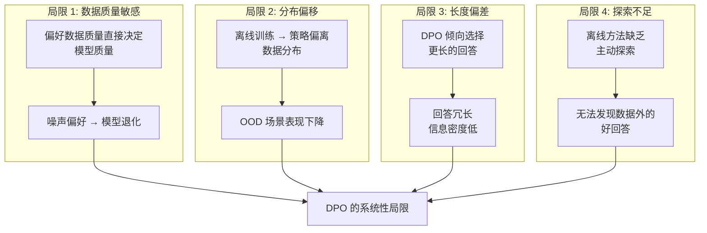

### 6.2 各局限详解

| 局限 | 问题描述 | 严重程度 | 缓解方法 |
|------|---------|---------|---------|
| **数据质量** | 偏好标注不一致会直接传导到模型 | 高 | 多标注员、质量过滤 |
| **分布偏移** | 训练数据分布与部署分布不同 | 高 | 迭代 DPO、在线 DPO |
| **长度偏差** | 偏好数据中好回答往往更长 | 中 | 长度归一化、长度惩罚 |
| **探索不足** | 只能从已有数据学习 | 中 | 结合 RLHF 或 online DPO |
| **多轮对话** | 单轮偏好难以推广到多轮 | 中 | 多轮 DPO 数据 |
| **安全对齐** | 偏好数据难以覆盖所有安全场景 | 中 | 结合 Constitutional AI |

### 6.3 DPO vs RLHF 在局限性上的互补

| 场景 | DPO 表现 | RLHF 表现 | 推荐方法 |
|------|---------|----------|---------|
| **数据分布内** | 优秀 | 优秀 | DPO (更简单) |
| **数据分布外 (OOD)** | 一般 | 较好 | RLHF 或 online DPO |
| **需要探索** | 差 | 好 | RLHF |
| **安全关键场景** | 一般 | 较好 | RLHF + Constitutional AI |
| **资源受限** | 好 | 差 | DPO / SimPO |
| **快速迭代** | 好 | 差 | DPO |

---

## 7. 使用 DPO 的代表性模型

### 7.1 主要开源模型

| 模型 | 机构 | 基座 | DPO 变体 | 效果 |
|------|------|------|---------|------|
| **Zephyr 7B** | HuggingFace | Mistral 7B | DPO | 首次证明开源 DPO 模型可超越 GPT-3.5 |
| **Tulu 2** | Allen AI | LLaMA 2 | DPO | 系统性开源对齐基准 |
| **Zephyr 7B Beta** | HuggingFace | Mistral 7B | DPO | 在 MT-Bench 上超越 ChatGPT |
| **OpenHermes 2.5** | Nous Research | Mistral 7B | DPO | 社区驱动的高质量模型 |
| **Starling 7B** | UC Berkeley | Mistral 7B | DPO + RLHF | Chatbot Arena 高分 |
| **Capybara** | Nous Research | LLaMA 2 | DPO | 长对话能力突出 |
| **Yi 34B Chat** | 01.AI | Yi 34B | DPO | 中文能力突出 |
| **Qwen Chat** | 阿里巴巴 | Qwen | DPO | 多语言对齐 |

### 7.2 Zephyr：DPO 的里程碑

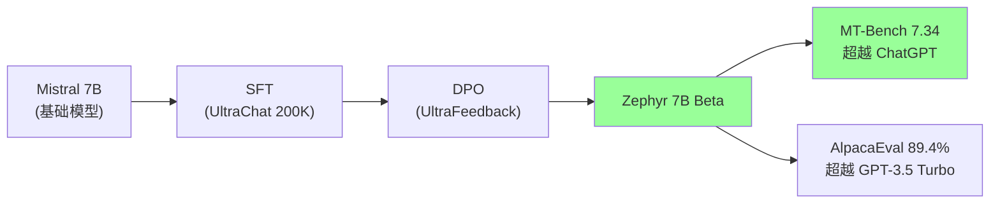

Zephyr 7B Beta 是 DPO 方法的里程碑式验证：
- 7B 参数的开源模型首次在标准 benchmark 上超越 GPT-3.5 Turbo
- 仅使用 DPO 对齐，无需 RLHF 的复杂 PPO 训练
- 证明了 DPO 在开源社区的巨大潜力

### 7.3 DPO 在 2024-2026 年的普及

| 时间 | 里程碑 | 意义 |
|------|--------|------|
| 2023.6 | DPO 论文发布 | 提出方法 |
| 2023.10 | Zephyr 7B Beta | 首个 DPO 模型超越 ChatGPT |
| 2023.11 | TRL 库集成 DPO | 工程化工具成熟 |
| 2024.1 | Tulu 2 系统性研究 | 开源对齐最佳实践 |
| 2024.3 | SimPO 提出 | 无需参考模型的简化版 |
| 2024.6 | LLaMA 3 使用 DPO 类方法 | 主流大模型采用 |
| 2024.12 | Qwen 2.5 系列 | DPO 成为中文模型标配 |
| 2025+ | DPO 成为默认对齐方法 | 替代 RLHF 成为开源标配 |

---

## 8. DPO 的理论分析

### 8.1 隐式奖励函数的性质

DPO 的核心洞见是策略模型隐式定义了一个奖励函数：

```
R_DPO(x, y) = β · log(π_θ(y|x) / π_ref(y|x))
```

| 性质 | 含义 |
|------|------|
| **相对性** | 奖励是相对于参考模型定义的 |
| **有界性** | KL 约束确保奖励不会极端化 |
| **可计算性** | 只需前向传播即可计算奖励 |
| **自洽性** | 策略模型的改进自动更新奖励估计 |

### 8.2 Bradley-Terry 模型的假设

DPO 依赖 Bradley-Terry 偏好模型：

```
P(y_w ≻ y_l | x) = σ(R(x, y_w) - R(x, y_l))
```

| 假设 | 描述 | 局限性 |
|------|------|--------|
| **传递性** | A > B 且 B > C 则 A > C | 人类偏好可能不满足传递性 |
| **概率单调性** | 奖励差越大，选择概率越高 | 人类决策不完全理性 |
| **上下文独立** | 偏好不受其他选项影响 | 实际偏好受上下文影响 |

### 8.3 与 RLHF 的理论等价条件

DPO 与 RLHF 在以下条件满足时理论等价：

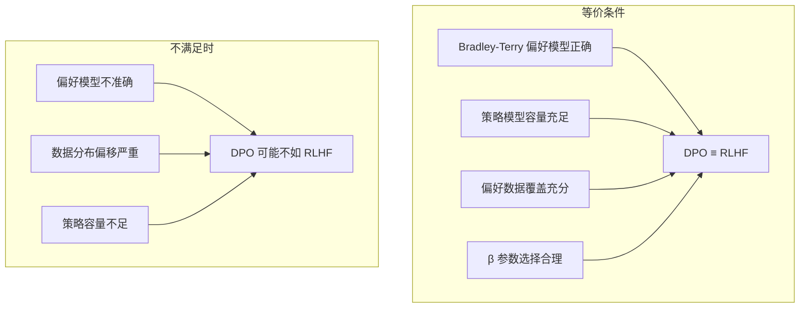

---

## 9. DPO 训练最佳实践

### 9.1 数据准备

| 步骤 | 建议 | 说明 |
|------|------|------|
| **1. 收集偏好对** | 至少 10K 高质量对 | 质量 > 数量 |
| **2. 数据多样性** | 覆盖多种任务类型 | 避免单一分布 |
| **3. 质量过滤** | 去除不一致标注 | 噪声数据直接伤害 DPO |
| **4. 长度匹配** | chosen 和 rejected 长度相近 | 减少长度偏差 |
| **5. 领域平衡** | 各领域数据均衡 | 防止领域过拟合 |

### 9.2 训练监控指标

| 指标 | 含义 | 期望范围 | 异常信号 |
|------|------|---------|---------|
| **DPO Loss** | 训练损失 | 0.3-0.8 (下降) | > 1.0 或上升 |
| **Reward Margin** | chosen 和 rejected 的奖励差 | > 0 且持续增大 | ≤ 0 |
| **Chosen Reward** | 偏好回答的奖励 | 逐渐上升 | 突然下降 |
| **Rejected Reward** | 非偏好回答的奖励 | 逐渐下降 | 突然上升 |
| **KL Divergence** | 策略与参考模型的距离 | < 10 | > 20 (过度偏离) |

### 9.3 常见问题排查

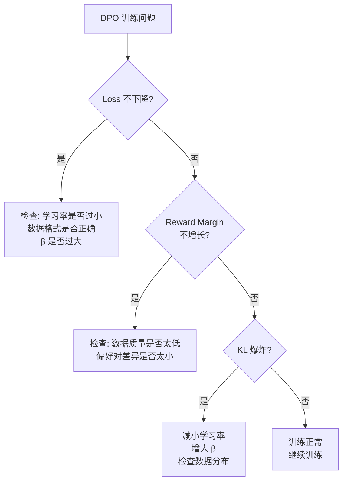

### 9.4 迭代 DPO (Iterative DPO)

单次 DPO 可能存在分布偏移问题，迭代 DPO 可以缓解：

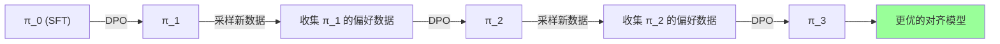

| 迭代 | 数据源 | 优势 | 成本 |
|------|--------|------|------|
| 第 1 轮 | 初始偏好数据 | 基础对齐 | 低 |
| 第 2 轮 | π_1 采样 + 标注 | 减少分布偏移 | 中 |
| 第 3 轮 | π_2 采样 + 标注 | 进一步优化 | 高 |

---

## 10. DPO 与 GRPO 的对比

### 10.1 GRPO 简介

GRPO (Group Relative Policy Optimization) 由 DeepSeek 在 2024 年提出，是 DPO 之后的重要演进：

| 维度 | DPO | GRPO |
|------|-----|------|
| **数据来源** | 离线偏好对 | 在线采样 (on-policy) |
| **基线** | 参考模型 | 组内相对奖励 (Group Relative) |
| **探索** | 无 (离线) | 有 (在线采样) |
| **训练信号** | 二元偏好 (chosen vs rejected) | 连续奖励信号 |
| **适用场景** | 偏好对齐 | 推理能力强化 (如数学、代码) |
| **代表模型** | Zephyr, Tulu | DeepSeek-R1 |

### 10.2 为什么 DeepSeek-R1 选择了 GRPO 而非 DPO？

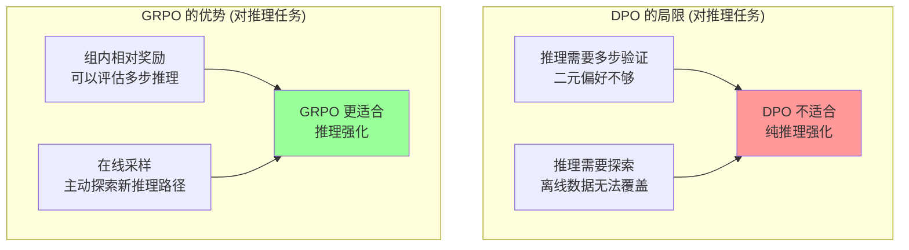

---

## 11. FAQ

### Q1: DPO 真的完全不需要奖励模型吗？

> **答**: 是的，DPO 的核心创新就是不需要单独训练奖励模型。但注意：DPO 的策略模型本身就隐式充当了奖励模型 (R_DPO(x,y) = β · log(π/π_ref))。所以不是"没有奖励模型"，而是"策略模型 = 奖励模型"。

### Q2: DPO 和 SFT 有什么区别？

> **答**: SFT 学习"什么是正确答案"，DPO 学习"什么是更好的答案"。SFT 需要绝对正确标注，DPO 只需要相对偏好 (A 比 B 好)。DPO 通常在 SFT 之后进行。

### Q3: DPO 适合什么规模的模型？

> **答**: DPO 对各种规模的模型都有效，从 1B 到 70B+ 参数。但对于更大的模型 (70B+)，RLHF 可能在某些场景下仍有优势，因为奖励模型的泛化能力更强。

### Q4: 如何选择 DPO 的 β 参数？

> **答**: β 控制策略模型偏离参考模型的程度。常见设置：
> - β = 0.1: 较大变化，适合 SFT 质量高的场景
> - β = 0.5: 中等变化，平衡探索与稳定
> - 建议从 0.1 开始，根据 KL divergence 调整

### Q5: DPO 会导致模型变得过于保守吗？

> **答**: 可能。β 过大会导致模型过于接近 SFT 模型 (保守)，β 过小可能导致模型过度偏离。关键是找到合适的 β，并监控 KL divergence。

### Q6: DPO 能用于非文本模型吗？

> **答**: 可以。DPO 的数学推导不依赖特定模态。已有研究将 DPO 应用于图像生成 (Diffusion Model 对齐)、代码生成、多模态模型等。

---

## 12. 与其他章节的关联

| 相关文档 | 关系 | 详见 |
|---------|------|------|
| RLHF & DPO Deep Dive | 本论文的综述级解读 | [RLHF_DPO_Deep_Dive.md](论文精读/Alignment/RLHF_DPO_Deep_Dive.md) |
| GRPO 与新对齐方法 | DPO 之后的演进 | [../模型训练/GRPO_and_New_Alignment_Methods.md](模型训练/Alignment/GRPO_and_New_Alignment_Methods.md) |
| GPT-4 Deep Dive | RLHF at Scale 的实践 | [GPT4_Deep_Dive.md](论文精读/Scaling/GPT4_Deep_Dive.md) |
| LLaMA Deep Dive | DPO 对齐的典型基座模型 | [LLaMA_Deep_Dive.md](论文精读/Architecture/LLaMA_Deep_Dive.md) |
| LoRA Deep Dive | DPO 常与 LoRA 结合使用 | [LoRA_Deep_Dive.md](论文精读/Efficiency/LoRA_Deep_Dive.md) |
| 分布式训练 | 大模型 DPO 训练基础设施 | [../模型训练/Distributed_Training_2026.md](模型训练/Distributed_Training/Distributed_Training_2026.md) |

---

## 13. 总结

### 13.1 DPO 的三大核心贡献

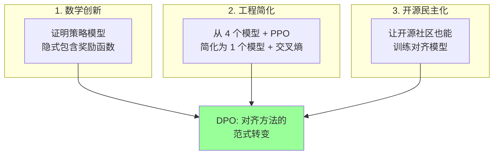

### 13.2 一句话总结

> **DPO 证明了"好品味不需要中间商"——直接从人类偏好学习，不需要先训练一个"评分老师"再去学习，这彻底改变了大模型对齐的工程实践。**

### 13.3 给实践者的建议

| 建议 | 说明 |
|------|------|
| 先做 SFT 再做 DPO | SFT 质量是 DPO 效果的上限 |
| 数据质量最重要 | 1000 条高质量 > 10000 条噪声数据 |
| 从小模型开始 | 先在 1B-7B 上验证，再扩展到更大模型 |
| 监控 KL divergence | 保持在合理范围内 (< 10) |
| 考虑 DPO 变体 | SimPO (省显存)、ORPO (省步骤) 可能更适合你的场景 |
| 迭代 DPO | 多轮 DPO 通常优于单轮 |
| 结合 LoRA | DPO + LoRA 可以大幅降低训练成本 |

---

## 参考资料

1. Rafailov, R. et al. "Direct Preference Optimization: Your Language Model is Secretly a Reward Model." NeurIPS 2023.
2. Azar, M.G. et al. "A General Theoretical Paradigm to Understand Learning from Human Preferences." 2023. (IPO)
3. Ethayarajh, K. et al. "KTO: Model Alignment as Prospect Theoretic Optimization." 2024.
4. Hong, J. et al. "ORPO: Monolithic Preference Optimization without Reference Model." 2024.
5. Meng, Y. et al. "SimPO: Simple Preference Optimization with a Reference-Free Reward." 2024.
6. Ouyang, L. et al. "Training Language Models to Follow Instructions with Human Feedback." NeurIPS 2022.

---

*Last updated: 2026-06-15*
