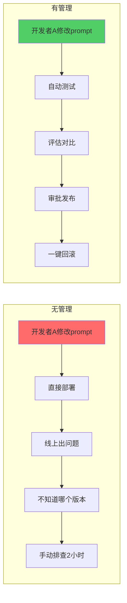
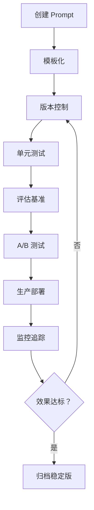
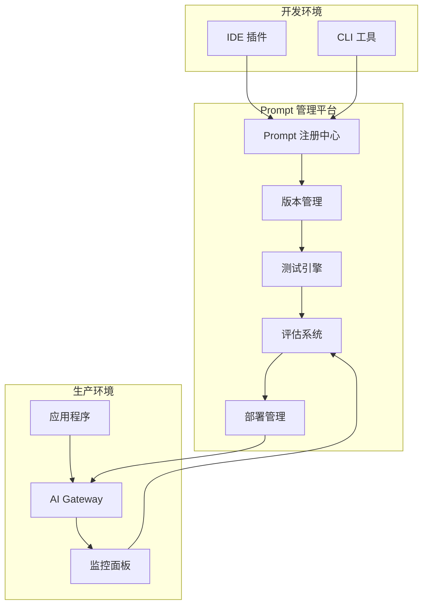
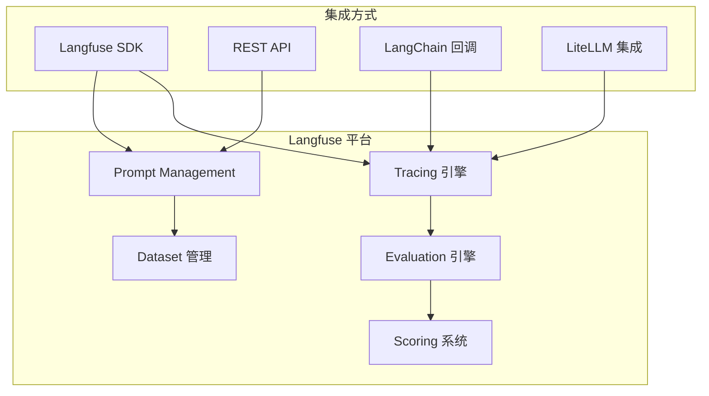
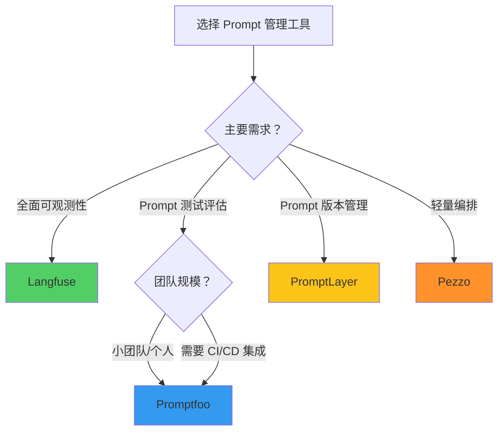
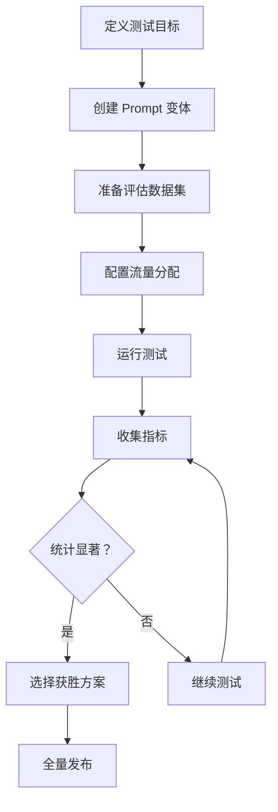
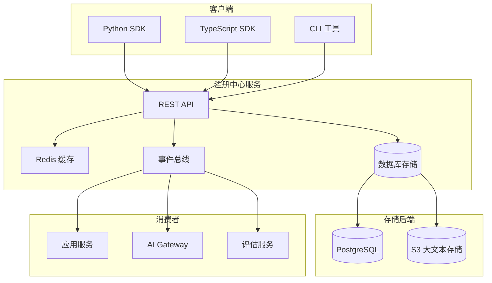

# Prompt 管理平台

> **一句话秒懂**: Prompt 管理平台就是 AI 应用界的"Git + CI/CD"，让团队能够版本控制、测试、评估和迭代提示词。

## 目录

- [为什么需要 Prompt 管理？](#为什么需要-prompt-管理)
- [核心概念](#核心概念)
- [Langfuse 深度解析](#langfuse-深度解析)
- [PromptLayer](#promptlayer)
- [Promptfoo 测试框架](#promptfoo-测试框架)
- [Pezzo](#pezzo)
- [平台对比](#平台对比)
- [Prompt 模板最佳实践](#prompt-模板最佳实践)
- [A/B 测试 Prompt](#ab-测试-prompt)
- [Prompt 注册中心设计](#prompt-注册中心设计)
- [总结](#总结)

---

## 为什么需要 Prompt 管理？

### 没有管理的混乱场景

```
项目文件结构（混乱版）
├── src/
│   ├── prompt_v1.txt
│   ├── prompt_v2.txt
│   ├── prompt_v2_final.txt
│   ├── prompt_v2_final_really.txt
│   ├── prompt_v3_不要删.txt
│   └── prompt_old_backup/
│       ├── prompt_v1_backup.txt
│       └── prompt_v1_backup_2.txt
├── shared/
│   └── "谁能告诉我生产环境用的是哪个prompt？？？".md
└── README.md  ← 过时了 6 个月
```

### 核心痛点

| 痛点 | 描述 | 影响 |
|------|------|------|
| 版本混乱 | 无法追溯 prompt 变更历史 | 线上事故无法回滚 |
| 缺乏测试 | 手动逐个测试 prompt | 效率极低，质量不可控 |
| 协作困难 | 多人编辑 prompt 冲突 | 团队生产力下降 |
| 无评估体系 | 凭感觉判断 prompt 好坏 | 结果不可量化 |
| 安全隐患 | prompt 直接硬编码在代码中 | 泄露风险，审计困难 |

### 有管理 vs 无管理



---

## 核心概念

### Prompt 生命周期管理



### Prompt 管理架构



---

## Langfuse 深度解析

### 概述

Langfuse 是开源的 LLM 可观测性平台，提供 prompt 管理、tracing 和评估三大核心能力。

### 核心架构



### 安装与配置

```python
# pip install langfuse

from langfuse import Langfuse

# 初始化
langfuse = Langfuse(
    public_key="pk-xxx",
    secret_key="sk-xxx",
    host="https://cloud.langfuse.com"  # 或自部署地址
)
```

### Prompt 管理

```python
# 创建 prompt 模板
langfuse.create_prompt(
    name="customer-support-classifier",
    prompt="""你是一个客户支持分类器。请将客户的请求分类到以下类别之一：

类别列表：
{categories}

客户消息：
{message}

请只输出类别名称，不要输出其他内容。""",
    config={
        "model": "gpt-4o",
        "temperature": 0.1,
        "max_tokens": 50,
    },
    labels=["production"]
)

# 在代码中使用 prompt
prompt = langfuse.get_prompt("customer-support-classifier")

# 编译模板（替换变量）
compiled = prompt.compile(
    categories="技术问题, 账单问题, 退款请求, 功能建议",
    message="我的账号被锁了，无法登录"
)

print(compiled)
```

### Prompt 版本控制

```python
# 更新 prompt（自动创建新版本）
langfuse.update_prompt(
    name="customer-support-classifier",
    prompt="""你是一个专业的客户支持分类器。

请根据以下规则分类客户请求：

## 分类规则
{categories}

## 客户信息
- 消息: {message}
- 用户等级: {user_level}

输出格式：JSON
{{"category": "...", "confidence": 0.0-1.0, "reason": "..."}}""",
    config={
        "model": "gpt-4o",
        "temperature": 0.1,
        "max_tokens": 200,
    }
)

# 获取特定版本
prompt_v1 = langfuse.get_prompt(
    "customer-support-classifier",
    version=1
)

# 获取生产版本
prompt_prod = langfuse.get_prompt(
    "customer-support-classifier",
    label="production"
)
```

### Tracing 追踪

```python
from langfuse.decorators import observe

@observe()
def process_customer_query(message: str, user_level: str):
    prompt = langfuse.get_prompt("customer-support-classifier")
    compiled = prompt.compile(
        categories="技术问题, 账单问题, 退款请求, 功能建议",
        message=message,
        user_level=user_level
    )

    # 调用 LLM
    from openai import OpenAI
    client = OpenAI()

    response = client.chat.completions.create(
        model=prompt.config["model"],
        messages=[{"role": "user", "content": compiled}],
        temperature=prompt.config["temperature"],
        max_tokens=prompt.config["max_tokens"],
    )

    return response.choices[0].message.content

# 每次调用自动追踪
result = process_customer_query(
    message="我的订阅费扣了两次",
    user_level="premium"
)
```

### 评估系统

```python
from langfuse import Langfuse

langfuse = Langfuse()

# 创建评估数据集
dataset = langfuse.create_dataset(
    name="classifier-eval-v1"
)

# 添加测试用例
test_cases = [
    {"input": "无法登录", "expected": "技术问题"},
    {"input": "退款我的订单", "expected": "退款请求"},
    {"input": "希望增加暗色模式", "expected": "功能建议"},
    {"input": "扣费异常", "expected": "账单问题"},
]

for case in test_cases:
    langfuse.create_dataset_item(
        dataset_name="classifier-eval-v1",
        input={"message": case["input"]},
        expected_output=case["expected"]
    )

# 运行评估
from langfuse.decorators import observe

@observe()
def eval_classifier(dataset_item):
    result = process_customer_query(
        message=dataset_item.input["message"],
        user_level="standard"
    )
    return result

# 执行评估
eval_result = langfuse.evaluate(
    name="classifier-accuracy-v1",
    data="classifier-eval-v1",
    func=eval_classifier,
    scoring=[
        {"name": "exact_match", "type": "exact_match"},
    ]
)
```

---

## PromptLayer

### 概述

PromptLayer 是专注于 prompt 工程的管理平台，提供 prompt 版本历史、性能追踪和协作功能。

### 核心功能

```python
# pip install promptlayer

import promptlayer

# 初始化
promptlayer.api_key = "pl-xxx"

# 在 OpenAI 调用中加入 PromptLayer 追踪
from promptlayer.utils import get_prompt, publish_prompt

# 创建 prompt 模板
publish_prompt(
    name="summarizer",
    prompt_template="请将以下文本总结为 {{num_points}} 个要点：\n\n{{text}}",
    tags=["summarization", "production"],
    metadata={
        "model": "gpt-4o",
        "temperature": 0.3,
    }
)

# 获取并使用 prompt
prompt = get_prompt(
    "summarizer",
    params={
        "num_points": "3",
        "text": "很长的文章内容..."
    }
)

# 追踪 API 调用
from promptlayer.track import track_request

response = track_request(
    engine="chat",
    provider="openai",
    prompt_name="summarizer",
    request_params={
        "model": "gpt-4o",
        "messages": [{"role": "user", "content": prompt}],
        "temperature": 0.3,
    },
    tags=["production", "v2"],
    metadata={"user_id": "user-123", "session_id": "sess-456"}
)
```

### Prompt 模板语法

```python
# PromptLayer 使用 Handlebars 风格的模板

template = """
你是一个{{role}}。

{{#if context}}
参考信息：
{{context}}
{{/if}}

{{#each examples}}
示例 {{@index}}:
输入: {{this.input}}
输出: {{this.output}}
{{/each}}

现在请处理：
{{input}}
"""

# 发布模板
publish_prompt(
    name="few-shot-template",
    prompt_template=template,
    tags=["template", "few-shot"]
)
```

---

## Promptfoo 测试框架

### 概述

Promptfoo 是开源的 prompt 测试和评估框架，支持声明式测试用例定义。

### 安装

```bash
# npm 全局安装
npm install -g promptfoo

# 或使用 npx
npx promptfoo@latest init
```

### 配置文件

```yaml
# promptfooconfig.yaml
providers:
  - openai:gpt-4o
  - openai:gpt-4o-mini
  - anthropic:claude-sonnet-4-20250514

prompts:
  - prompts/classifier.txt
  - prompts/classifier_v2.txt

tests:
  - vars:
      message: "我的账号被锁了"
    assert:
      - type: contains
        value: "技术问题"
      - type: latency
        threshold: 2000  # 毫秒

  - vars:
      message: "我要退款"
    assert:
      - type: contains
        value: "退款"
      - type: llm-rubric
        value: "回复应准确分类为退款请求"

  - vars:
      message: "希望能增加数据导出功能"
    assert:
      - type: contains
        value: "功能建议"

  - vars:
      message: "上个月的账单金额不对"
    assert:
      - type: contains
        value: "账单"
```

### Prompt 文件

```
你是一个客户支持分类器。请将以下消息分类：

类别：技术问题、账单问题、退款请求、功能建议

消息：{{message}}

只输出类别名称。
```

### 运行测试

```bash
# 运行评估
promptfoo eval

# 查看结果（Web UI）
promptfoo view

# CI/CD 集成
promptfoo eval --ci --max-concurrency 5
```

### Python API

```python
# pip install promptfoo

import promptfoo

# 编程方式运行评估
result = promptfoo.evaluate(
    providers=["openai:gpt-4o"],
    prompts=[
        "将以下消息分类：{{message}}\n类别：技术问题、账单问题、退款请求、功能建议"
    ],
    tests=[
        {
            "vars": {"message": "无法登录"},
            "assert": [{"type": "contains", "value": "技术问题"}]
        },
        {
            "vars": {"message": "多扣了钱"},
            "assert": [{"type": "contains", "value": "账单"}]
        },
    ],
)

print(f"通过率: {result['stats']['pass_rate']}")
print(f"总测试数: {result['stats']['total']}")
```

### 高级断言

```yaml
tests:
  - vars:
      message: "描述一个复杂的技术问题"
    assert:
      # JSON Schema 验证
      - type: is-json
        value:
          type: object
          required: ["category", "confidence"]
          properties:
            category:
              type: string
            confidence:
              type: number
              minimum: 0
              maximum: 1

      # 相似度检测
      - type: similar
        value: "该消息属于技术类问题"
        threshold: 0.7

      # 自定义 Python 脚本
      - type: python
        value: |
          def check(output, context):
              categories = ["技术问题", "账单问题", "退款请求", "功能建议"]
              return any(cat in output for cat in categories)
```

---

## Pezzo

### 概述

Pezzo 是开源的 AI prompt 管理平台，专注于 prompt 编排和可观测性。

### 核心特性

```typescript
// npm install @pezzo/client

import { Pezzo } from "@pezzo/client";

const pezzo = new Pezzo({
  apiKey: "pezzo-api-key",
  environment: "production",
});

// 执行 prompt
const result = await pezzo.executePrompt("customer-support", {
  variables: {
    message: "我的订单还没到",
    language: "中文",
  },
});

console.log(result.content);
console.log(`Token 使用: ${result.usage.totalTokens}`);
console.log(`成本: $${result.cost}`);
```

### Prompt 版本管理

```typescript
// Pezzo 支持在仪表板中管理 prompt 版本
// 每个版本包含：
// - prompt 模板内容
// - 模型参数（temperature, max_tokens 等）
// - 变量定义
// - 发布状态（draft/staging/production）

interface PezzoPrompt {
  id: string;
  name: string;
  content: string;
  variables: Record<string, string>;
  model: {
    name: string;
    temperature: number;
    maxTokens: number;
  };
  version: number;
  status: "draft" | "staging" | "production";
}
```

---

## 平台对比

### 功能对比矩阵

| 功能 | Langfuse | PromptLayer | Promptfoo | Pezzo |
|------|----------|-------------|-----------|-------|
| **开源** | ✅ 完全开源 | ❌ 商业 | ✅ 完全开源 | ✅ 开源 |
| **Prompt 版本管理** | ✅ 强大 | ✅ 核心 | ⚠️ 基础 | ✅ 完善 |
| **Tracing** | ✅ 核心功能 | ✅ 完善 | ❌ 无 | ✅ 基础 |
| **评估系统** | ✅ 内置 | ⚠️ 基础 | ✅ 核心功能 | ⚠️ 基础 |
| **A/B 测试** | ✅ 支持 | ✅ 支持 | ❌ 无 | ✅ 支持 |
| **多模型支持** | ✅ 全部 | ✅ 全部 | ✅ 全部 | ✅ 主流 |
| **CI/CD 集成** | ✅ API | ⚠️ 有限 | ✅ CLI 模式 | ⚠️ 有限 |
| **自部署** | ✅ Docker | ❌ | ✅ 本地 | ✅ Docker |
| **团队协作** | ✅ RBAC | ✅ | ⚠️ 有限 | ✅ |
| **定价** | 免费自部署 / 云付费 | 免费额度后付费 | 免费开源 | 免费自部署 |
| **语言支持** | Python/JS | Python/JS | YAML/JS | TypeScript |

### 选型指南



### 使用场景推荐

| 场景 | 推荐工具 | 理由 |
|------|---------|------|
| 生产环境 LLM 监控 | Langfuse | Tracing 最完善 |
| Prompt 质量保障 | Promptfoo | 测试断言最灵活 |
| 快速原型验证 | Pezzo | 部署最简单 |
| 企业级 Prompt 管理 | Langfuse + Promptfoo | 版本管理 + 测试 |
| 个人开发者 | Promptfoo | 完全免费，CLI 友好 |
| 需要可视化编辑 | PromptLayer | Web 编辑器最好用 |

---

## Prompt 模板最佳实践

### 模板设计原则

```python
# 好的模板设计

GOOD_TEMPLATE = """
你是一个{role}。

## 任务描述
{task_description}

## 约束条件
{constraints}

## 输出格式
{output_format}

## 输入
{input}
"""

# 不好的模板设计

BAD_TEMPLATE = """
{input}  # 所有信息混在一起，没有结构
"""
```

### 模板变量规范

```python
from typing import TypedDict, List, Optional
from pydantic import BaseModel, Field

class PromptTemplate(BaseModel):
    name: str = Field(description="模板唯一标识")
    version: int = Field(description="版本号")
    template: str = Field(description="模板内容")
    variables: dict[str, str] = Field(description="变量说明")
    model_config: dict = Field(description="模型配置")

    class Config:
        json_schema_extra = {
            "example": {
                "name": "text-classifier",
                "version": 3,
                "template": "分类以下文本：{{text}}\n类别：{{categories}}",
                "variables": {
                    "text": "待分类的文本（必填）",
                    "categories": "类别列表（必填）",
                    "examples": "Few-shot 示例（可选）",
                },
                "model_config": {
                    "model": "gpt-4o",
                    "temperature": 0.1,
                    "max_tokens": 100,
                }
            }
        }

# 模板注册中心
class PromptRegistry:
    def __init__(self):
        self._registry: dict[str, list[PromptTemplate]] = {}

    def register(self, template: PromptTemplate):
        name = template.name
        if name not in self._registry:
            self._registry[name] = []
        self._registry[name].append(template)

    def get(self, name: str, version: int = None) -> PromptTemplate:
        versions = self._registry.get(name, [])
        if not versions:
            raise ValueError(f"Prompt '{name}' 不存在")
        if version:
            for v in versions:
                if v.version == version:
                    return v
            raise ValueError(f"版本 {version} 不存在")
        return max(versions, key=lambda x: x.version)

    def compile(self, name: str, **kwargs) -> str:
        template = self.get(name)
        result = template.template
        for key, value in kwargs.items():
            result = result.replace(f"{{{{{key}}}}}", str(value))
        return result
```

### 模板版本规范

```
版本命名规则：
  MAJOR.MINOR.PATCH

  MAJOR: prompt 策略完全改变（如换了分类体系）
  MINOR: 添加/修改了重要内容（如新增 few-shot 示例）
  PATCH: 微调措辞、修复小问题

示例：
  customer-classifier-v1.0.0  ← 初始版本
  customer-classifier-v1.1.0  ← 增加了 few-shot
  customer-classifier-v1.1.1  ← 修正了错别字
  customer-classifier-v2.0.0  ← 完全重构了分类体系
```

---

## A/B 测试 Prompt

### A/B 测试流程



### 代码实现

```python
import hashlib
import random
from dataclasses import dataclass
from typing import Optional

@dataclass
class ABTestConfig:
    test_name: str
    prompt_a_name: str
    prompt_b_name: str
    traffic_split: float  # 0.0 - 1.0, B 的流量比例
    min_samples: int = 100
    metrics: list[str] = None

class ABTestRunner:
    def __init__(self, registry: PromptRegistry):
        self.registry = registry
        self.results: dict[str, list[dict]] = {"A": [], "B": []}

    def get_variant(self, user_id: str, config: ABTestConfig) -> str:
        """基于用户ID确定变体（确保同一用户始终看到同一变体）"""
        hash_val = int(
            hashlib.md5(f"{config.test_name}:{user_id}".encode()).hexdigest(),
            16
        ) % 100
        return "B" if hash_val < config.traffic_split * 100 else "A"

    def get_prompt(self, variant: str, config: ABTestConfig) -> PromptTemplate:
        name = config.prompt_a_name if variant == "A" else config.prompt_b_name
        return self.registry.get(name)

    def record_result(self, variant: str, metrics: dict):
        self.results[variant].append(metrics)

    def analyze(self, config: ABTestConfig) -> dict:
        import numpy as np

        analysis = {}
        for metric in (config.metrics or ["accuracy"]):
            a_values = [r.get(metric, 0) for r in self.results["A"]]
            b_values = [r.get(metric, 0) for r in self.results["B"]]

            if len(a_values) >= config.min_samples and len(b_values) >= config.min_samples:
                a_mean = np.mean(a_values)
                b_mean = np.mean(b_values)
                improvement = (b_mean - a_mean) / a_mean * 100

                analysis[metric] = {
                    "A_mean": a_mean,
                    "B_mean": b_mean,
                    "improvement_pct": improvement,
                    "samples_A": len(a_values),
                    "samples_B": len(b_values),
                    "winner": "B" if b_mean > a_mean else "A",
                }

        return analysis


# 使用示例
runner = ABTestRunner(registry)
config = ABTestConfig(
    test_name="classifier-prompt-v2",
    prompt_a_name="classifier-v1",
    prompt_b_name="classifier-v2",
    traffic_split=0.3,
    min_samples=200,
    metrics=["accuracy", "latency_ms"]
)

# 处理请求
def handle_request(user_id: str, message: str):
    variant = runner.get_variant(user_id, config)
    prompt = runner.get_prompt(variant, config)
    compiled = runner.registry.compile(prompt.name, message=message)

    # 调用 LLM 并记录结果
    start_time = time.time()
    result = call_llm(compiled, prompt.model_config)
    latency = (time.time() - start_time) * 1000

    accuracy = evaluate_result(result, message)

    runner.record_result(variant, {
        "accuracy": accuracy,
        "latency_ms": latency
    })

    return result
```

---

## Prompt 注册中心设计

### 架构设计



### 数据库设计

```sql
-- Prompt 模板表
CREATE TABLE prompt_templates (
    id UUID PRIMARY KEY DEFAULT gen_random_uuid(),
    name VARCHAR(255) NOT NULL,
    version INTEGER NOT NULL,
    content TEXT NOT NULL,
    variables JSONB DEFAULT '{}',
    model_config JSONB DEFAULT '{}',
    labels TEXT[] DEFAULT '{}',
    tags TEXT[] DEFAULT '{}',
    description TEXT,
    created_by VARCHAR(255),
    created_at TIMESTAMP DEFAULT NOW(),
    updated_at TIMESTAMP DEFAULT NOW(),
    is_active BOOLEAN DEFAULT TRUE,
    UNIQUE(name, version)
);

-- A/B 测试表
CREATE TABLE ab_tests (
    id UUID PRIMARY KEY DEFAULT gen_random_uuid(),
    name VARCHAR(255) NOT NULL UNIQUE,
    prompt_a_id UUID REFERENCES prompt_templates(id),
    prompt_b_id UUID REFERENCES prompt_templates(id),
    traffic_split FLOAT DEFAULT 0.5,
    status VARCHAR(50) DEFAULT 'draft',
    start_at TIMESTAMP,
    end_at TIMESTAMP,
    min_samples INTEGER DEFAULT 100,
    metrics JSONB DEFAULT '[]',
    created_at TIMESTAMP DEFAULT NOW()
);

-- 评估结果表
CREATE TABLE evaluation_results (
    id UUID PRIMARY KEY DEFAULT gen_random_uuid(),
    prompt_id UUID REFERENCES prompt_templates(id),
    dataset_name VARCHAR(255),
    metric_name VARCHAR(255),
    metric_value FLOAT,
    sample_count INTEGER,
    metadata JSONB DEFAULT '{}',
    created_at TIMESTAMP DEFAULT NOW()
);

-- 索引
CREATE INDEX idx_templates_name ON prompt_templates(name);
CREATE INDEX idx_templates_name_version ON prompt_templates(name, version);
CREATE INDEX idx_templates_labels ON prompt_templates USING GIN(labels);
CREATE INDEX idx_eval_prompt ON evaluation_results(prompt_id);
```

### FastAPI 服务实现

```python
from fastapi import FastAPI, HTTPException
from pydantic import BaseModel
from typing import Optional
import asyncpg

app = FastAPI(title="Prompt Registry API")

class PromptCreate(BaseModel):
    name: str
    content: str
    variables: dict = {}
    model_config: dict = {}
    labels: list[str] = []
    tags: list[str] = []
    description: str = ""

class PromptResponse(BaseModel):
    id: str
    name: str
    version: int
    content: str
    variables: dict
    model_config: dict
    labels: list[str]
    tags: list[str]

@app.post("/prompts", response_model=PromptResponse)
async def create_prompt(prompt: PromptCreate):
    """创建新版本的 prompt"""
    pool = await asyncpg.create_pool(DATABASE_URL)

    async with pool.acquire() as conn:
        max_version = await conn.fetchval(
            "SELECT COALESCE(MAX(version), 0) FROM prompt_templates WHERE name = $1",
            prompt.name
        )

        row = await conn.fetchrow(
            """INSERT INTO prompt_templates
            (name, version, content, variables, model_config, labels, tags, description)
            VALUES ($1, $2, $3, $4, $5, $6, $7, $8)
            RETURNING id, name, version, content, variables, model_config, labels, tags""",
            prompt.name, max_version + 1, prompt.content,
            json.dumps(prompt.variables), json.dumps(prompt.model_config),
            prompt.labels, prompt.tags, prompt.description
        )

    return PromptResponse(
        id=str(row["id"]), name=row["name"], version=row["version"],
        content=row["content"], variables=json.loads(row["variables"]),
        model_config=json.loads(row["model_config"]),
        labels=row["labels"], tags=row["tags"]
    )

@app.get("/prompts/{name}/latest", response_model=PromptResponse)
async def get_latest_prompt(name: str, label: str = None):
    """获取最新版本的 prompt"""
    pool = await asyncpg.create_pool(DATABASE_URL)

    async with pool.acquire() as conn:
        if label:
            row = await conn.fetchrow(
                """SELECT * FROM prompt_templates
                WHERE name = $1 AND $2 = ANY(labels) AND is_active = TRUE
                ORDER BY version DESC LIMIT 1""",
                name, label
            )
        else:
            row = await conn.fetchrow(
                """SELECT * FROM prompt_templates
                WHERE name = $1 AND is_active = TRUE
                ORDER BY version DESC LIMIT 1""",
                name
            )

    if not row:
        raise HTTPException(status_code=404, detail=f"Prompt '{name}' 不存在")

    return PromptResponse(
        id=str(row["id"]), name=row["name"], version=row["version"],
        content=row["content"], variables=json.loads(row["variables"]),
        model_config=json.loads(row["model_config"]),
        labels=row["labels"], tags=row["tags"]
    )

@app.get("/prompts/{name}/versions")
async def list_versions(name: str):
    """列出所有版本"""
    pool = await asyncpg.create_pool(DATABASE_URL)

    async with pool.acquire() as conn:
        rows = await conn.fetch(
            """SELECT version, labels, created_at, description
            FROM prompt_templates WHERE name = $1
            ORDER BY version DESC""",
            name
        )

    return [{"version": r["version"], "labels": r["labels"],
             "created_at": str(r["created_at"]), "description": r["description"]}
            for r in rows]

@app.post("/prompts/{name}/rollback/{version}")
async def rollback_prompt(name: str, version: int):
    """回滚到指定版本"""
    pool = await asyncpg.create_pool(DATABASE_URL)

    async with pool.acquire() as conn:
        target = await conn.fetchrow(
            "SELECT * FROM prompt_templates WHERE name = $1 AND version = $2",
            name, version
        )
        if not target:
            raise HTTPException(status_code=404, detail=f"版本 {version} 不存在")

        await conn.execute(
            """UPDATE prompt_templates SET labels = array_remove(labels, 'production')
            WHERE name = $1 AND version != $2""",
            name, version
        )

        await conn.execute(
            """UPDATE prompt_templates SET labels = array_append(labels, 'production')
            WHERE name = $1 AND version = $2""",
            name, version
        )

    return {"message": f"已回滚到版本 {version}", "name": name, "version": version}
```

---

## 总结

### 工具选型速查

```
┌─────────────────────────────────────────────────┐
│          Prompt 管理工具选型决策树                │
├─────────────────────────────────────────────────┤
│                                                 │
│  Q: 是否需要完整的 LLM 可观测性？               │
│  ├── 是 → Langfuse                             │
│  └── 否 → 继续                                 │
│                                                 │
│  Q: 主要需求是测试和评估？                       │
│  ├── 是 → Promptfoo                            │
│  └── 否 → 继续                                 │
│                                                 │
│  Q: 需要 Web 界面编辑 Prompt？                   │
│  ├── 是 → PromptLayer 或 Pezzo                 │
│  └── 否 → Promptfoo (CLI 模式)                 │
│                                                 │
│  Q: 需要自部署？                                │
│  ├── 是 → Langfuse 或 Pezzo                    │
│  └── 否 → PromptLayer (SaaS)                   │
│                                                 │
│  最佳实践组合：                                  │
│  Langfuse (可观测性) + Promptfoo (测试)         │
│                                                 │
└─────────────────────────────────────────────────┘
```

### 相关文档

- [AI Gateway 对比 2026](../架构基建/AI_Gateway/AI_Gateway_Comparison_2026.md) - 网关层 prompt 管理
- [API 设计 for AI](./API_Design_for_AI.md) - API 层面的 prompt 集成
- [部署推理 2026](../部署推理/Deployment_Inference_2026.md) - 生产部署最佳实践
- [Langfuse 官方文档](https://langfuse.com/docs)
- [Promptfoo 官方文档](https://promptfoo.dev/docs)

## Related

- [[93_Templates/DOCUMENT_TEMPLATES.md|DOCUMENT_TEMPLATES]]
- [[93_Templates/IMPORT_GUIDE.md|IMPORT_GUIDE]]
- [[93_Templates/README.md|93_Templates README]]
- [[AI入门/AI_Tools_Practical_Guide.md|AI_Tools_Practical_Guide]]
