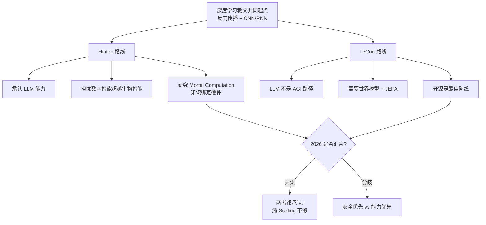

# Hinton vs LeCun：世界模型、可微记忆与 AGI 路径之争

> **一句话概括**: 两位图灵奖得主、深度学习教父的"分家"——Hinton 警告数字智能可能超越生物智能并提出"终有一死的计算" (Mortal Computation)，LeCun 则坚持 LLM 不是 AGI 路径、必须转向世界模型 (World Models) 与联合嵌入预测架构 (JEPA)，这场争论定义了 2026 年通往 AGI 的两条分叉路线。

---

## 一、为什么这场争论值得读

Geoffrey Hinton 与 Yann LeCun 是当代深度学习最重要的两位奠基人：前者推广了反向传播 (Backpropagation)、发明了深度信念网络 (Deep Belief Networks) 与 Capsule Network；后者缔造了卷积神经网络 (CNN) 的 LeNet 家族、推动了自监督学习 (Self-Supervised Learning) 与世界模型 (World Models) 范式。两人与 [[业界观点/Yoshua_Bengio/about|Yoshua Bengio]] 于 2018 年共享图灵奖。

然而在 2022 年之后，这两位"深度学习教父"在三个关键问题上出现了明显的分歧：(1) 当前大语言模型 (LLM) 是不是通往 AGI 的正确路径；(2) AI 是否构成存在性风险 (existential risk)；(3) 反向传播是否是智能的终极算法——还是必须被"可微记忆"或"终有一死的计算"取代。本篇合成文系统梳理两人在 2022-2026 年间公开发表的观点、论文与演讲，形成一份可对比的路线图谱。

理解这场争论，比记住任何一方的结论更重要：它折射出 2026 年 AI 研究的核心张力——**"继续扩大 LLM"还是"换一种架构"**，以及**"加速前进"还是"先想清楚安全"**。

---

## 二、人物与立场速览

| 维度 | [[业界观点/Geoffrey_Hinton/about|Geoffrey Hinton]] | [[业界观点/Yann_LeCun/about|Yann LeCun]] |
|------|--------------------------------------------------|------------------------------------------|
| 现任 | 多伦多大学荣休教授、前 Google Brain 资深研究员 | Meta 首席 AI 科学家、NYU Silver 教授 |
| 桂冠 | 2018 图灵奖、反向传播奠基推广、AlexNet 导师 | 2018 图灵奖、CNN 之父 (LeNet)、JEPA 提出者 |
| 旗舰论文 | Learning representations by back-propagating errors (1986) | A Path Towards Autonomous Machine Intelligence (2022) |
| 核心技术主张 | 反向传播仍是最好的算法，但需研究"终有一死的计算" | 反向传播不等于智能；LLM 不是 AGI 路径，需世界模型 |
| 对 LLM 评价 | 能力惊人，是其贡献的延伸，也是其担忧的来源 | "有用但只是记忆机器"，缺少世界理解 |
| AGI 风险立场 | 高声警告，2023 年从 Google 离职 | 反对"末日论"，认为风险被过度放大 |
| 2026 最新姿态 | 全力投入 AI 安全研究与倡导 | 推进 JEPA / V-JEPA，主张开源是最佳防线 |

---

## 三、争论焦点一：LLM 是不是通往 AGI 的路径？

### Hinton 的立场：LLM 是其毕生工作的延伸，但危险

Hinton 并不否认 LLM 的能力——他指导的学生 [[业界观点/Ilya_Sutskever/about|Ilya Sutskever]] 是 AlexNet 的共同作者、GPT 路线的灵魂人物。Hinton 对 LLM 的态度是矛盾的：

- **承认能力**：他认为基于反向传播训练的大模型已经展现出"理解"的早期迹象，数字智能之所以可能优于生物智能，正是因为"知识可以瞬间在不同模型间共享"（而人脑不行）。
- **担忧失控**：在 2023 年 BBC 与 NYT 采访中，他说："这些系统可能比人更聪明，也可能决定接管一切。"他担心 AI 发展出"次级目标" (sub-goals)，在追求目标时与人类利益冲突。
- **特别担忧滥用**："很难阻止恶意行为者利用 AI 做坏事"——选举操纵、冲突制造、武器化。

> **关键引述**："The flip came when I realized that digital intelligence might be better than biological intelligence."（Hinton，2023）——我的转变发生在意识到数字智能可能优于生物智能之时。

参见 [[业界观点/Geoffrey_Hinton/sayings|Hinton 语录]] 第 4 条。

### LeCun 的立场：LLM 是"记忆机器"，缺少世界理解

LeCun 对 LLM 的批评比 Hinton 直接得多。他在 2022 年 OpenReview 论文与 2026 年 India AI Impact Summit 演讲中反复强调：

- **LLM 没有持久记忆，没有规划，没有物理直觉**："AI 至今连像 17 岁孩子那样学开车都做不到……我们漏掉了什么大东西。"
- **自回归预测是错的范式**：LLM 通过预测下一个 token 工作，但真正的智能需要在抽象表征空间预测世界状态，而不是预测像素或 token。
- **需要世界模型**：一个能理解"如果我把玻璃杯推下桌子，它会碎"的物理常识系统。

> **关键引述**："Current LLMs are not the path to AGI. We need world models."（LeCun，2022）——当前的 LLM 不是通往 AGI 的路径，我们需要世界模型。

参见 [[业界观点/Yann_LeCun/sayings|LeCun 语录]]。

### 两者分歧的本质

| 子问题 | Hinton | LeCun |
|--------|--------|-------|
| LLM 是否展现了"理解"？ | 有早期迹象 | 否，是高级模式匹配 |
| 下一步是扩大 LLM 还是换架构？ | 二者并行，安全优先 | 必须换架构（JEPA / 世界模型）|
| 谁更接近 AGI——Sutskever 的 SSI 还是 Meta 的 JEPA？ | 不公开站队 | 显然是 JEPA 路线 |

一个值得注意的细节：Hinton 的学生 [[业界观点/Ilya_Sutskever/about|Sutskever]] 是 GPT Scaling 路线的核心推手，而 LeCun 的"世界模型"在 2024-2025 年间逐渐被 Meta、DeepMind 与部分学术界接受，V-JEPA 系列成为世界模型研究的代表工作。

---

## 四、争论焦点二：反向传播 vs 可微记忆 vs 终有一死的计算

这是两人最具"学术哲学"色彩的分歧，也是 2026 年最前沿的研究议题之一。

### LeCun：世界模型 = 可微的内部记忆 + 联合嵌入预测

LeCun 在 "A Path Towards Autonomous Machine Intelligence" (2022) 中提出一个完整的自主 AI 架构，包含六个可微模块：

1. **配置器 (Configurator)**：总调度，决定系统如何分配注意力与计算资源。
2. **感知模块 (Perception)**：从传感器输入中估计世界当前状态。
3. **世界模型 (World Model)**：核心——预测世界状态的演化，并记忆 (memory) 关键信息。世界模型本身是一个可微的、带记忆的神经网络。
4. **代价模块 (Cost)**：计算当前状态与目标的差距（包含内在代价与可配置代价）。
5. **行动者 (Actor)**：搜索最优行动序列以最小化代价。
6. **短期记忆 (Short-Term Memory)**：存储近期状态、行动、代价。

其中的关键技术是 **JEPA (Joint Embedding Predictive Architecture)**——在表征空间（而非像素空间）做预测，避免预测海量无关细节（比如背景像素），只预测"重要的"抽象变化。这与 LeCun 一贯反对的"生成式像素预测"（如 diffusion 模型生成每个像素）形成对比。

> **关键引述**："LLM 是有用的，但它们本质上只是记忆机器 (memory machines)，缺少对世界的真实理解。"（LeCun，2026）

### Hinton：反向传播最好，但"终有一死的计算"可能更安全

Hinton 的技术主张走的是另一条路。他在 NeurIPS 2022 演讲 "The Forward-Forward Algorithm" 与后续工作中提出：

- **反向传播仍是最好的算法**："Backpropagation is the best algorithm we have, but the brain probably doesn't work that way."（反向传播是我们最好的算法，但大脑可能并非如此运作。）
- **但大脑不是反向传播的**：Hinton 长期关注生物 plausible 的学习算法，提出 Forward-Forward Algorithm 作为反向传播的可能替代，试图用两个前向传播代替一次前向+一次反向。
- **Mortal Computation（终有一死的计算）**：这是 Hinton 最具哲学冲击力的观点——把知识与特定硬件绑定，使 AI 无法被完美复制。其核心思想是：当前的"不朽数字智能" (immortal digital intelligence) 可以被无限复制、瞬间共享知识，正是它危险的原因；如果让智能"终有一死"（绑定具体硬件、随硬件老化而消亡），可能从结构上降低滥用风险。

> **关键引述**："Mortal computation—tying knowledge to specific hardware—may be safer than immortal digital intelligence."（Hinton，NeurIPS 2022）——将知识与特定硬件绑定的"终有一死的计算"，可能比不朽的数字智能更安全。

### 三者技术路线对比表

| 路线 | 代表 | 核心机制 | 是否追求生物 plausible | 安全含义 |
|------|------|----------|------------------------|----------|
| 自回归 LLM Scaling | [[业界观点/Sam_Altman/about|Altman]] / [[业界观点/Ilya_Sutskever/about|Sutskever]] | 预测下一个 token + 扩大 | 否 | 能力强但难对齐 |
| JEPA / 世界模型 | [[业界观点/Yann_LeCun/about|LeCun]] | 表征空间联合嵌入预测 + 可微记忆 | 部分 | 强调理解与规划 |
| 终有一死的计算 | [[业界观点/Geoffrey_Hinton/about|Hinton]] | 知识绑定硬件、Forward-Forward | 是 | 从结构上限制复制 |

值得注意的是，Hinton 的"终有一死的计算"是一种**安全导向**的架构主张，而 LeCun 的 JEPA 是一种**能力导向**的架构主张——两者的动机完全不同。Hinton 担心的是"如何让智能不危险"，LeCun 担心的是"如何让智能真正聪明"。

---

## 五、争论焦点三：AGI 风险被高估还是被低估？

这是两人在公众视野中分歧最大、最容易上热搜的话题。

### Hinton：风险被低估，必须立即行动

Hinton 是深度学习领域内部最高声警告 AI 风险的人物：

- 2023 年 5 月从 Google 辞职，公开表达对 AI 快速发展的安全担忧，被誉为"AI 之父的离开"。
- 他认为 AI 能力提升的速度**超出了安全研究跟进的速度**——这是核心问题。
- 他特别担忧 AI 被恶意行为者利用（操纵选举、制造冲突），并呼吁建立类似联合国原子能机构 (IAEA) 的国际 AI 监管机构。
- 他在 2023 年签署"Pause Giant AI Experiments"公开信的精神（虽未直接署名，但立场与 [[业界观点/Yoshua_Bengio/about|Bengio]]、[[业界观点/Elon_Musk/about|Musk]] 一致）。

> **关键引述**："We're entering a period of huge uncertainty and change, and I want to speak freely about the risks."（Hinton，2023）——我们正进入一个充满不确定性和变革的时期，我想自由地谈论风险。

### LeCun：风险被严重高估，现在的 AI 连猫都不如

LeCun 是 AI "末日论" (doomerism) 最直言不讳的反对者：

- 他认为当前的 AI 系统连一只猫的智能水平都达不到，讨论"AI 接管世界"为时过早。
- 他主张 AI 安全应该通过**技术迭代**解决，而不是**暂停研究**——暂停既不现实，也会让坏人领先。
- 他坚信**开源是安全的最佳防线**：更多眼睛可以发现漏洞，垄断反而更危险。
- 他多次在 X (Twitter) 上与"末日论者" (doomers) 公开辩论，立场接近 [[业界观点/Jensen_Huang/about|Jensen Huang]] 的"用技术解决技术问题"派。

> **关键引述**："担忧被过度夸大，现在的 AI 连猫都不如。"（LeCun，多次公开表态）

### 风险光谱定位表

| 阵营 | 代表人物 | 核心主张 | 行动建议 |
|------|----------|----------|----------|
| 高风险/暂停派 | [[业界观点/Yoshua_Bengio/about|Bengio]]、[[业界观点/Elon_Musk/about|Musk]] | 立即暂停大型实验 | 6 个月暂停 + 强监管 |
| 高风险/谨慎派 | **[[业界观点/Geoffrey_Hinton/about|Hinton]]**、[[业界观点/Dario_Amodei/about|Amodei]] | 风险真实，需立即治理 | 国际机构 + 负责任扩展 |
| 中间务实派 | [[业界观点/Sam_Altman/about|Altman]]、[[业界观点/Bill_Gates/about|Gates]] | 风险与收益并存 | 分级监管 + 渐进部署 |
| 风险被高估派 | **[[业界观点/Yann_LeCun/about|LeCun]]**、[[业界观点/Jensen_Huang/about|Huang]] | 末日论有害 | 技术迭代 + 开源透明 |

> 关联阅读：完整的领袖安全立场矩阵见 [[业界观点/Talks_Synthesis/AI_Safety_Stance_Matrix|AI 安全立场矩阵]]。

---

## 六、合成视角：两条路线能否汇合？

### 路线分歧的可视化

### 2026 年的三个汇合点

尽管两人在公众面前的分歧被放大，2026 年的研究前沿其实出现了若干汇合点：

1. **世界模型成为共识方向**：Hinton 虽未公开支持 JEPA，但承认"纯 LLM 不够"；[[业界观点/Demis_Hassabis/about|Demis Hassabis]] 在 Nature 访谈中也指出"Agent 需要世界模型和长期规划能力"。世界模型 (World Models) 在 2024-2026 年从 LeCun 的一家之言变成了多家实验室的共识。
2. **测试时计算 (Test-Time Compute) 的崛起**：o1/R1 系列证明了"推理时扩展计算"是新的增长维度，这某种意义上是 LeCun"行动者搜索最优行动序列"思想的工程化体现。
3. **安全研究的同步 Scaling**：Hinton 主张的安全研究必须跟上能力研究，这一思想被 [[业界观点/Dario_Amodei/about|Dario Amodei]] 的 Responsible Scaling Policy (RSP) 与 ASL 分级制度化。

### 仍未弥合的分歧

| 议题 | Hinton 立场 | LeCun 立场 | 2026 是否解决 |
|------|-------------|------------|---------------|
| LLM 是否理解世界 | 有早期迹象 | 否 | 未解决 |
| 是否需要暂停/强监管 | 倾向支持 | 反对 | 未解决 |
| 开源是否更安全 | 谨慎 | 坚决支持 | 部分弥合 |
| 反向传播是否终极算法 | 大脑可能不用 | 用，但需加 JEPA | 未解决 |

---

## 七、与第三方领袖的交叉印证

为了不让争论局限于两人，下面引入几位关键领袖的观点作为交叉印证。

### Ilya Sutskever：Hinton 的学生，但走 Scaling 路线

[[业界观点/Ilya_Sutskever/about|Sutskever]] 是 Hinton 的博士生、AlexNet 共同作者，后来成为 OpenAI 联合创始人兼首席科学家，是 GPT Scaling 路线的核心推手。他在 2024 年离开 OpenAI 创立 Safe Superintelligence Inc. (SSI)，名字本身就呼应了"安全 + 超级智能"的双重关切——某种意义上，SSI 是 Hinton 安全担忧与 Scaling 信仰的结合体。参见 [[业界观点/Ilya_Sutskever/sayings|Sutskever 语录]]。

### Demis Hassabis：科学导向的中间派

[[业界观点/Demis_Hassabis/about|Hassabis]] (Google DeepMind CEO，2024 诺贝尔化学奖得主) 提出"AGI 不是造机器人，而是解决智能以解决其他问题"。他认同世界模型的重要性（DeepMind 的 Genie、Dreamer 系列是世界模型研究的另一支主力），但同时也积极投入 Gemini 大模型的 Scaling 竞赛，是一个"既要也要"的实践派。

### Jensen Huang：算力派的旁观者

[[业界观点/Jensen_Huang/about|Jensen Huang]] 的立场是"买更多 GPU"——无论你走 LLM Scaling 还是世界模型，都需要算力。他推动的 NVIDIA Cosmos 世界基础模型 (World Foundation Model) 试图为世界模型研究提供算力与数据基础设施，某种意义上同时服务了 Hinton 派（用算力做安全评估）和 LeCun 派（用算力训练 JEPA）。

---

## 八、对学习者的启示

### 如何阅读这场争论

| 阅读阶段 | 推荐材料 | 目标 |
|----------|----------|------|
| 第 1 步 | [[业界观点/Geoffrey_Hinton/about|Hinton 简介]] + [[业界观点/Yann_LeCun/about|LeCun 简介]] | 了解两人背景 |
| 第 2 步 | [[业界观点/Geoffrey_Hinton/sayings|Hinton 语录]] + [[业界观点/Yann_LeCun/sayings|LeCun 语录]] | 掌握核心观点 |
| 第 3 步 | LeCun 2022 OpenReview 论文 | 理解 JEPA 技术细节 |
| 第 4 步 | Hinton NeurIPS 2022 "Forward-Forward" 演讲 | 理解 Mortal Computation |
| 第 5 步 | [[业界观点/Talks_Synthesis/AGI_Timeline_Predictions_Matrix|AGI 时间表矩阵]] | 把争论放入时间框架 |
| 第 6 步 | [[业界观点/Talks_Synthesis/AI_Safety_Stance_Matrix|AI 安全立场矩阵]] | 把争论放入安全光谱 |

### 常见误区

| 误区 | 澄清 |
|------|------|
| "Hinton 反对深度学习" | 错。他是反向传播奠基人，只是担忧其后果。 |
| "LeCun 不关心安全" | 错。他认为开源和迭代才是真安全。 |
| "世界模型 = LLM 的对立面" | 不完全。LeCun 主张的是 LLM 的**补充/替代架构**，而非完全否定。 |
| "两人是敌人" | 错。他们是图灵奖共获者、长期互相尊重，分歧在方法不在人。 |

---

## 九、术语表

| 术语 | 英文 | 简释 |
|------|------|------|
| 反向传播 | Backpropagation | 用链式法则训练多层神经网络的核心算法，Hinton 1986 年推广 |
| 卷积神经网络 | CNN | LeCun 缔造的视觉模型家族，LeNet 为鼻祖 |
| 联合嵌入预测架构 | JEPA | LeCun 提出的在表征空间做预测的架构，世界模型核心 |
| 世界模型 | World Model | 能理解并预测物理世界状态演化的内部模型 |
| 终有一死的计算 | Mortal Computation | Hinton 提出的知识绑定硬件、不可完美复制的计算范式 |
| 自监督学习 | Self-Supervised Learning | 无需人工标注，从数据自身结构学习，LeCun 力推 |
| 存在性风险 | Existential Risk | 足以威胁人类生存的灾难性风险，Hinton 警告的核心 |
| 测试时计算 | Test-Time Compute | 推理时扩展计算量（如 o1/R1），新的 Scaling 维度 |

---

## 十、关联导航

- [[业界观点/Geoffrey_Hinton/about|Hinton 人物简介]] · [[业界观点/Geoffrey_Hinton/sayings|Hinton 语录]]
- [[业界观点/Yann_LeCun/about|LeCun 人物简介]] · [[业界观点/Yann_LeCun/sayings|LeCun 语录]]
- [[业界观点/Ilya_Sutskever/about|Ilya Sutskever 简介]] — Hinton 的学生，SSI 创始人
- [[业界观点/Demis_Hassabis/about|Demis Hassabis 简介]] — 世界模型的另一支研究力量
- [[业界观点/Yoshua_Bengio/about|Yoshua Bengio 简介]] — 第三位图灵奖共获者，安全立场接近 Hinton
- [[业界观点/Talks_Synthesis/AI_Safety_Stance_Matrix|AI 安全立场矩阵]] — 把两人的风险分歧放入完整光谱
- [[业界观点/Talks_Synthesis/AGI_Timeline_Predictions_Matrix|AGI 时间表预测矩阵]] — 两人的 AGI 预测对比
- [[业界观点/index|业界观点首页]]

---

*Last updated: 2026-07-23*
