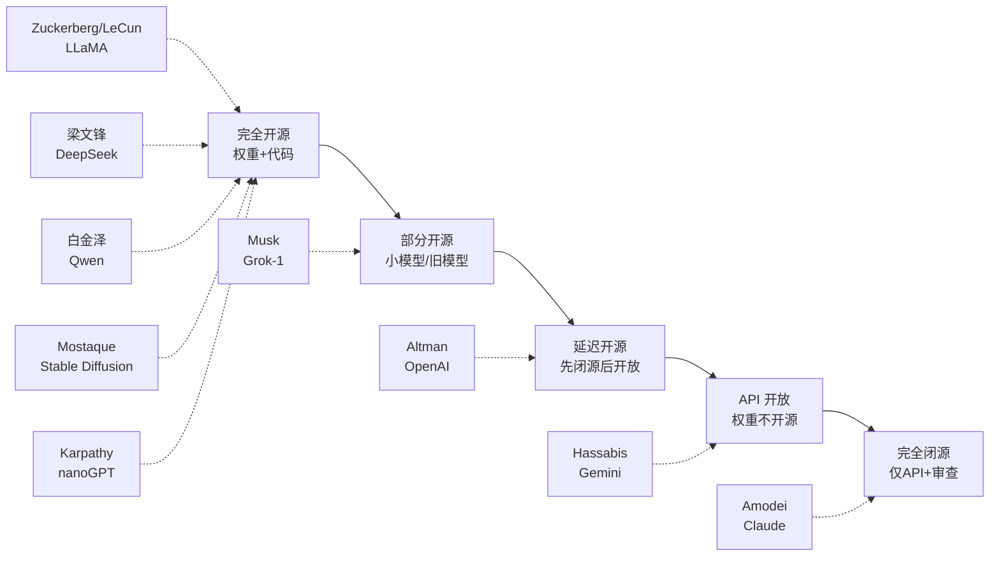

# 开源 vs 闭源 AI：2026 路线之争与立场矩阵

> **一句话概括**: 2026 年 AI 行业最深刻的分裂——开源阵营 (Meta LLaMA / DeepSeek / Qwen) 以权重开放推动生态民主化，闭源阵营 (OpenAI / Anthropic / Google) 以安全可控为由管制前沿模型，本篇用一张立场矩阵呈现十位领袖的真实态度与商业逻辑。

---

## 一、为什么"开不开源"是 2026 年的核心问题

在传统软件时代，开源 vs 闭源是商业模式之争（Linux vs Windows、MySQL vs Oracle）。但在大模型时代，这个问题被赋予了三层全新含义：

1. **安全含义**：开源权重意味着任何人（包括恶意行为者）都可以移除安全微调 (safety fine-tuning)，使模型"越狱"。这是闭源阵营（OpenAI、Anthropic）拒绝开源前沿模型的核心论据。
2. **地缘含义**：开源模型让无法获得最先进芯片的国家和公司也能获得接近前沿的能力。DeepSeek-V3 的开源被视为对芯片管制的回应。
3. **垄断含义**：开源是反垄断的天然武器。Meta 用 LLaMA 开源挑战 OpenAI/Google 的双寡头，[[业界观点/Mark_Zuckerberg/about|Zuckerberg]] 称之为"开源让 Meta 成为行业标准"。

因此，"开不开源"不再只是技术偏好，而是 2026 年 AI 治理、地缘政治和商业模式三重博弈的交汇点。

---

## 二、领袖立场矩阵（核心表格）

下表是十位关键领袖在开源/闭源议题上的完整立场矩阵。"开放程度"分四档：**权重完全开源** / **延迟开源**（先闭源后开放旧版）/ **API 开放** / **完全闭源**。

| 领袖 | 机构 | 旗舰模型 | 开放程度 | 公开理由 | 商业/战略动机 |
|------|------|----------|----------|----------|---------------|
| [[业界观点/Mark_Zuckerberg/about|Zuckerberg]] | Meta | LLaMA 2/3/4 | 权重完全开源 | "开放是构建安全 AI 的最佳方式" | 用开源建生态，对抗 OpenAI/Google 垄断 |
| [[业界观点/Yann_LeCun/about|LeCun]] | Meta FAIR | LLaMA / JEPA | 权重完全开源 | "开源是安全的，更多眼睛发现漏洞" | 学术信念 + 实证主义 |
| [[业界观点/Wenfeng_Liang/about|梁文锋]] | DeepSeek | DeepSeek-V3/R1 | 权重完全开源 | "效率比规模更重要，开源推动全行业" | 用开源换影响力，绕开芯片管制 |
| [[业界观点/Jinze_Bai/about|白金泽]] | 阿里云 | Qwen 系列 | 权重完全开源 (Apache 2.0) | "开源 + 119 种语言覆盖服务全球" | 云生态引流，ModelScope 平台 |
| [[业界观点/Emad_Mostaque/about|Mostaque]] | Stability AI | Stable Diffusion | 权重完全开源 | "去中心化生成 AI，人人可用" | 用开源撼动闭源图像生成垄断 |
| [[业界观点/Andrej_Karpathy/about|Karpathy]] | (独立) | nanoGPT / llm.c | 代码+权重开源 | "开源加速创新，降低准入门槛" | 教育信念，传播 AI 知识 |
| [[业界观点/Sam_Altman/about|Altman]] | OpenAI | GPT-4o / o3 | 延迟开源 + API 开放 | "前沿模型需谨慎管理" | 商业护城河 + 安全叙事 |
| [[业界观点/Dario_Amodei/about|Amodei]] | Anthropic | Claude 4 | 完全闭源 + API | "闭源是为了安全可控地释放能力" | 安全使命 + RSP 框架 |
| [[业界观点/Demis_Hassabis/about|Hassabis]] | Google DeepMind | Gemini 2.5 | 完全闭源 + API | "前沿研究需负责任部署" | Google 云商业护城河 |
| [[业界观点/Elon_Musk/about|Musk]] | xAI | Grok | 部分开源 (Grok-1 开源) | "OpenAI 背叛了开源初衷" | 差异化竞争 + 政治叙事 |

> 注：Musk 的立场最矛盾——他是 OpenAI 联合创始人（2015 最初承诺开源），2018 因方向分歧离开，2024 起诉 OpenAI"背叛开源使命"，但同时 xAI 的 Grok-2/3 又走向闭源 API，被外界批评为"选择性开源"。

---

## 三、开源阵营：论点与代表人物

### 核心论点

**1. 安全论（开源更安全）**

[[业界观点/Yann_LeCun/about|LeCun]] 反复论证：开源让更多研究者审查模型，发现偏见、后门与漏洞，比闭源的"黑箱"更安全。他把闭源前沿实验室的"安全叙事"斥为"伪装成责任的商业护城河"。

> **关键引述**："开源是安全的，因为更多眼睛可以发现漏洞。"（LeCun）

**2. 创新论（开源加速创新）**

[[业界观点/Andrej_Karpathy/about|Karpathy]] 认为，LLaMA 开源直接催生了 Alpaca、Vicuna、Mistral 等整个开源生态，把最先进的能力"民主化"到每个研究者和创业公司，降低了准入门槛。[[业界观点/Emad_Mostaque/about|Mostaque]] 的 Stable Diffusion 让图像生成从闭源 API（如 Midjourney、DALL·E）走向人人可本地运行的开源工具，催生了整个 AIGC 创业潮。

**3. 反垄断论（开源打破寡头）**

[[业界观点/Mark_Zuckerberg/about|Zuckerberg]] 的战略最务实——Meta 在 LLM 领域无法直接靠 API 收费与 OpenAI 竞争，但通过开源 LLaMA，Meta 可以让整个行业依赖 Meta 的底座模型，从而确立生态主导权（类似 Google 用 Android 开源对抗 iOS）。他宣布 Meta 将拥有超过 60 万块 GPU 的算力，并把成果开源。

**4. 效率/地缘论（开源绕过封锁）**

[[业界观点/Wenfeng_Liang/about|梁文锋]] 的 DeepSeek 是这条路线的极致代表——用不到 $6M 训练 671B 参数的 DeepSeek-V3，证明"效率比规模更重要"，并用全面开源（MLA、MoE、GRPO、FP8 训练细节全部公开）震撼全球。[[业界观点/Jinze_Bai/about|白金泽]] 领导的 Qwen 则以 Apache 2.0 许可 + 119 种语言覆盖，成为中国科技巨头开源 AI 的标杆。两人的开源都带有"绕开芯片管制、用创新换影响力"的地缘色彩。

> 关联阅读：中美 AI 竞赛的完整视角见 [[业界观点/Talks_Synthesis/China_US_AI_Race_Leaders_Views|中美 AI 竞赛领袖观点]]。

---

## 四、闭源阵营：论点与代表人物

### 核心论点

**1. 安全可控论**

[[业界观点/Dario_Amodei/about|Amodei]] 的论点最系统化。Anthropic 推出业界首个 Responsible Scaling Policy (RSP)，将模型按能力分为 ASL 1-5 级，每个级别有对应的安全评估要求和部署限制。他认为开源权重等于让任何人都能移除安全微调，这在模型能力达到"生物武器辅助、网络攻击自动化"级别时是不可接受的风险。

> **关键引述**："Anthropic 选择闭源是为了安全可控地释放能力。"（Amodei）

**2. 谨慎管理论**

[[业界观点/Sam_Altman/about|Altman]] 采取务实中间路线：GPT-4 级别的模型不应完全开源，但 OpenAI 释放了部分较小模型的权重（如 2025 年的部分开放），被视为"延迟开源"策略——先闭源保护商业利益，待模型不再前沿后再开放旧版本。这与 OpenAI 2015 年"完全开源"的初衷形成鲜明对比，也是 Musk 起诉 OpenAI 的核心依据。

**3. 负责任部署论**

[[业界观点/Demis_Hassabis/about|Hassabis]] 的 Google DeepMind 走的是"科学负责任"路线——Gemini 系列完全闭源，仅通过 API 和 Google 云提供服务。Google 的动机是商业护城河，但叙事是"前沿研究需要负责任地部署"。

---

## 五、立场光谱图

---

## 六、2026 年态势：开源逼近闭源

2026 年最重要的趋势是**开源模型能力逼近闭源前沿**。下表对比 2026 年代表性模型：

| 类型 | 代表模型 | 参数规模 | 特点 | 开放程度 |
|------|----------|----------|------|----------|
| 闭源前沿 | GPT-5 / Claude 4.5 / Gemini 2.5 Pro | 未公开 | 综合能力最强 | API |
| 开源前沿 | LLaMA 4 | 400B+ MoE | 多模态、长上下文 | 权重完全开源 |
| 开源效率 | DeepSeek-V3 / R1 | 671B MoE (37B 激活) | MLA + GRPO，推理强 | 权重完全开源 |
| 开源多语 | Qwen3-Max | MoE + 1M 上下文 | 119 语言，Hybrid Thinking | Apache 2.0 |
| 开源多模态 | GLM-5.2 (智谱) | 744B MoE | 全模态 | 部分开源 |

闭源阵营的应对是**"延迟开源 + 测试时计算"**：不再靠单纯扩大参数取胜，而是靠 o1/o3/R1 风格的推理时扩展计算拉开差距。但 DeepSeek-R1 的开源直接把"测试时计算"能力也开源化了，使闭源阵营的技术护城河被进一步削弱。

---

## 七、合成视角：三种未来走向

| 走向 | 描述 | 概率判断 | 支持者 |
|------|------|----------|--------|
| **开源主导** | 开源模型持续逼近闭源，闭源前沿仅剩"几个月领先" | 高 | LeCun / Zuckerberg / 梁文锋 |
| **闭源锁定** | 前沿能力因安全/管制被少数实验室垄断 | 中 | Amodei / Hassabis |
| **分级监管** | 政府按能力等级强制要求开源/闭源策略 | 中 | Altman（呼吁类似 FDA 的 AI 机构）|

> 关联阅读：AGI 何时到来会显著影响这场争论——若 AGI 在 2-5 年内实现，闭源锁定可能性上升；若更远，开源主导更可能。见 [[业界观点/Talks_Synthesis/AGI_Timeline_Predictions_Matrix|AGI 时间表预测矩阵]]。

---

## 八、交叉人物速查

| 人物 | 与本主题的关系 |
|------|----------------|
| [[业界观点/Mark_Zuckerberg/about|Zuckerberg]] | 开源战略总指挥，LLaMA 系列发布者 |
| [[业界观点/Yann_LeCun/about|LeCun]] | 开源安全论的理论旗手 |
| [[业界观点/Wenfeng_Liang/about|梁文锋]] | 用效率+开源撼动全球的中国代表 |
| [[业界观点/Jinze_Bai/about|白金泽]] | Qwen 开源生态负责人 |
| [[业界观点/Emad_Mostaque/about|Mostaque]] | Stable Diffusion 开源推动者 |
| [[业界观点/Andrej_Karpathy/about|Karpathy]] | 开源教育布道者（nanoGPT） |
| [[业界观点/Sam_Altman/about|Altman]] | "延迟开源"策略代表 |
| [[业界观点/Dario_Amodei/about|Amodei]] | 闭源安全论代表 |
| [[业界观点/Demis_Hassabis/about|Hassabis]] | 科学负责任部署代表 |
| [[业界观点/Elon_Musk/about|Musk]] | 选择性开源的矛盾人物 |

---

## 九、常见误区与澄清

| 误区 | 澄清 |
|------|------|
| "开源 = 没有商业价值" | 错。Meta、阿里通过开源建立生态主导，云收入反而增长。 |
| "闭源 = 更安全" | 争议。LeCun 认为闭源黑箱更危险；Amodei 认为开源权重可被去安全。 |
| "开源阵营都无私" | 错。开源常是战略选择，背后有明确商业/地缘动机。 |
| "Musk 是开源派" | 部分错。Grok-1 开源，但 Grok-2/3 走向闭源 API。 |
| "中国模型都开源" | 大部分是（DeepSeek/Qwen/GLM），但也有闭源（部分通义 Max、Kimi 等）。 |

---

## 十、术语表

| 术语 | 英文 | 简释 |
|------|------|------|
| 权重 | Weights | 神经网络参数，开源权重 = 可本地运行模型 |
| 前沿模型 | Frontier Model | 当前最先进能力的模型 |
| 延迟开源 | Delayed Open Source | 先闭源，待模型旧了再开放 |
| 负责任扩展政策 | Responsible Scaling Policy, RSP | Anthropic 提出的按能力分级的安全框架 |
| 混合专家 | Mixture of Experts, MoE | 只激活部分参数的稀疏架构，DeepSeek/Qwen 主力 |
| 多头潜在注意力 | Multi-head Latent Attention, MLA | DeepSeek 的效率优化注意力机制 |
| 测试时计算 | Test-Time Compute | 推理时扩展计算，o1/R1 路线 |

---

## 十一、关联导航

- [[业界观点/Mark_Zuckerberg/about|Zuckerberg 简介]] · [[业界观点/Yann_LeCun/about|LeCun 简介]]
- [[业界观点/Wenfeng_Liang/about|梁文锋 简介]] · [[业界观点/Jinze_Bai/about|白金泽 简介]]
- [[业界观点/Sam_Altman/about|Altman 简介]] · [[业界观点/Dario_Amodei/about|Amodei 简介]]
- [[业界观点/Talks_Synthesis/China_US_AI_Race_Leaders_Views|中美 AI 竞赛领袖观点]]
- [[业界观点/Talks_Synthesis/AI_Safety_Stance_Matrix|AI 安全立场矩阵]]
- [[业界观点/Talks_Synthesis/AGI_Timeline_Predictions_Matrix|AGI 时间表预测矩阵]]
- [[业界观点/Talks_Synthesis/Hinton_vs_LeCun_World_Model_Debate|Hinton vs LeCun 之争]]
- [[业界观点/index|业界观点首页]]

---

*Last updated: 2026-07-23*
