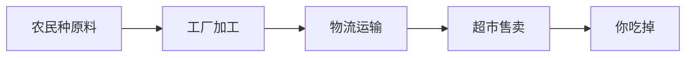
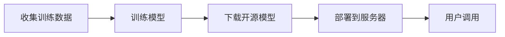
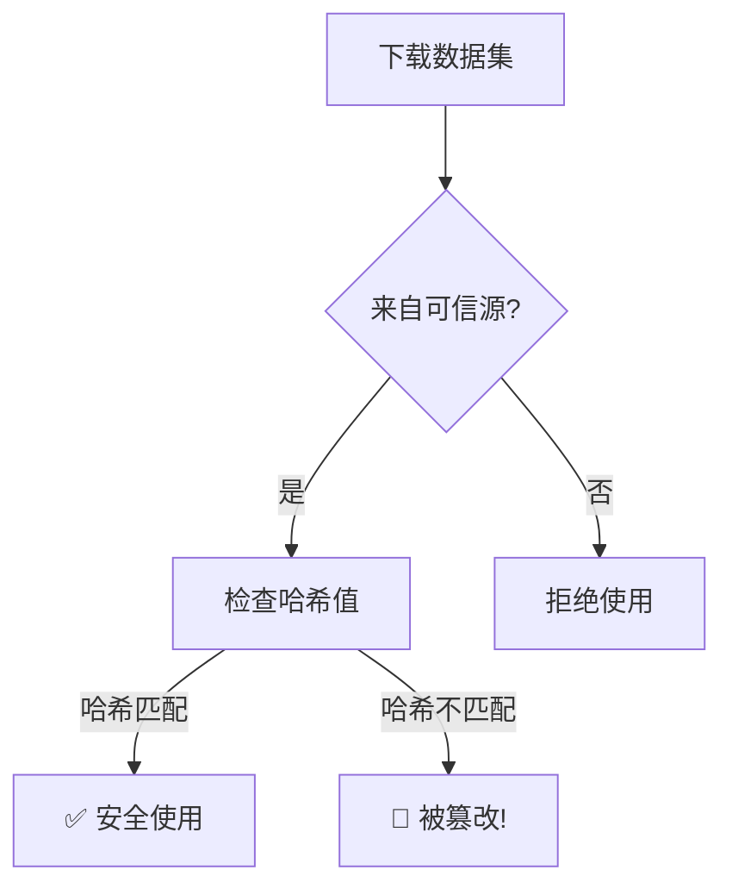
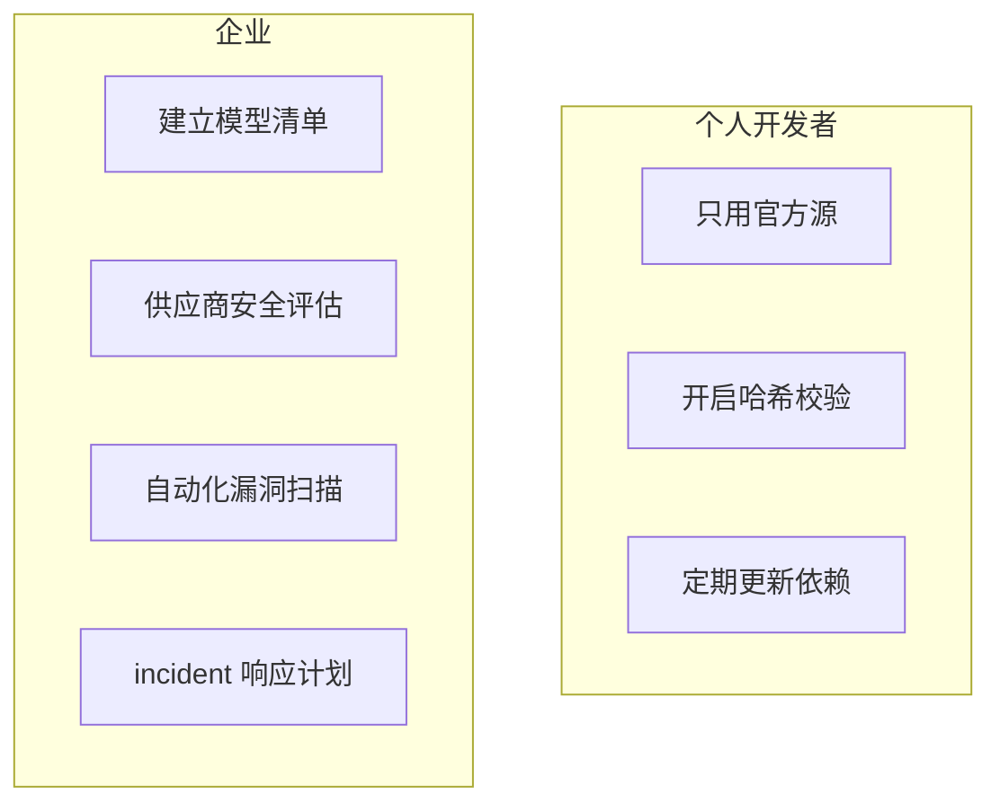

> [!warning] 生产安全提示 · Production Safety
> 本文档含可执行命令/操作步骤。执行前请核对风险等级（🟢低/🔶中/🔴高），高危命令必须 dry-run 并确认回滚方案。完整策略见 [生产安全策略](../../治理/Production_Safety_Policy.md)。
<!-- op-safety-banner v1 -->
# AI 供应链安全小白指南 (AI Supply Chain Security for Dummy)

> **一句话理解**: AI 供应链安全就像检查"AI 食物的来源"——确保训练数据、模型文件和依赖库没有被坏人投毒或篡改。

---

## 🤔 什么是 AI 供应链？

### 用食品供应链来比喻

你吃的零食要经过很多环节：



**AI 系统也一样**：



**AI 供应链安全** = 确保每个环节都没被坏人动手脚。

---

## 🧨 有哪些风险？

| 风险 | 就像... | 后果 |
|------|--------|------|
| **毒化数据** | 往牛奶里加三聚氰胺 | 模型学到有害偏见 |
| **恶意模型** | 假药包装成真药 | 模型暗藏后门 |
| **依赖漏洞** | 运输卡车被劫持 | PyTorch/TensorFlow 库被篡改 |
| **权重窃取** | 配方被偷 | 价值百万的模型被复制 |

### 真实案例

- **2023 年 Hugging Face 令牌泄露**：攻击者上传恶意模型到 HF，用户下载后电脑被控制
- **XCodeGhost**：苹果开发工具被篡改，影响数千个 App

---

## 🛡️ 如何保护自己？

### 1. 验证数据来源



### 2. 模型安全检查清单

| 检查项 | 怎么做 |
|--------|--------|
| **来源验证** | 只从官方渠道下载（Hugging Face 官方、GitHub 官方仓库） |
| **哈希校验** | 下载后比对 MD5/SHA256 |
| **模型扫描** | 用工具检测模型文件是否包含恶意代码 |
| **沙箱测试** | 先在隔离环境运行新模型 |
| **依赖审计** | 定期检查 pip/conda 包的漏洞 |

### 3. 简单命令

```bash
# 检查文件哈希（确保和官网一致）
sha256sum model.bin

# 扫描 Python 依赖漏洞
pip install safety
safety check

# 检查模型文件是否异常
ls -lh model.bin  # 文件大小是否合理？
```

---

## 🎯 企业和个人该怎么做？



| 角色 | 关键行动 |
|------|---------|
| **个人** | 不下载来路不明的模型；更新 pip 包 |
| **小企业** | 建立模型来源记录；用 SBOM 工具 |
| **大企业** | 供应商安全审计；红队测试；合规检查 |

---

## ⚠️ 常见问题

| 问题 | 解答 |
|------|------|
| **开源模型安全吗？** | 大部分安全，但要验证来源和哈希 |
| **怎么知道数据被投毒了？** | 看模型行为是否异常（输出有害内容、性能骤降） |
| **供应链攻击常见吗？** | 越来越常见，2023-2024 年攻击增长 300%+ |
| **小企业需要担心吗？** | 需要。用第三方 API 也要考虑供应商安全 |

---

## 💡 核心要点

```mermaid
flowchart TB
    A[AI 供应链安全 = 检查 AI 的"食材来源"] --> B[数据：验证来源和完整性]
    B --> C[模型：校验哈希、扫描漏洞]
    C --> D[依赖：定期审计和更新]
    D --> E[一句话：只从可信源下载，下载后验证]
```

---

## 🔗 相关主题

- [AI 安全红队测试](../AI_Safety_RedTeaming/AI_Safety_RedTeaming.md) — 主动发现安全漏洞
- [AI 治理合规](../AI_Governance_Compliance_2026.md) — 法规要求
- [Value Alignment](../Value_Alignment/Value_Alignment.md) — 模型价值观对齐

---

*Last updated: 2026-05-07*

## 核心知识体系

| 知识域 | 核心内容 | 重要程度 | 学习优先级 |
|--------|----------|----------|------------|
| 基础理论 | 核心概念/原理/方法论 | 最高 | P0 |
| 技术实践 | 工具/框架/最佳实践 | 高 | P0 |
| 工程方法 | 设计模式/架构/流程 | 高 | P1 |
| 前沿趋势 | 新技术/新方向/研究 | 中 | P2 |
| 行业应用 | 实际案例/落地经验 | 中 | P1 |

## 技术对比与选型

| 维度 | 方案A | 方案B | 方案C | 选型建议 |
|------|-------|-------|-------|----------|
| 性能 | 高吞吐 | 低延迟 | 均衡 | 按场景选择 |
| 复杂度 | 简单 | 中等 | 复杂 | 按团队能力 |
| 成本 | 低 | 中 | 高 | 按预算约束 |
| 生态 | 成熟 | 发展中 | 新兴 | 按稳定性需求 |
| 扩展性 | 有限 | 良好 | 优秀 | 按增长预期 |

## 最佳实践清单

| 实践 | 说明 | 优先级 | 预期收益 |
|------|------|--------|----------|
| 标准化流程 | 统一规范和流程 | P0 | 减少错误+提升效率 |
| 自动化 | 重复工作自动化 | P0 | 节省时间+降低风险 |
| 持续监控 | 关键指标实时监控 | P1 | 及时发现问题 |
| 定期回顾 | 周期性复盘改进 | P1 | 持续优化 |
| 知识沉淀 | 文档化经验教训 | P2 | 团队能力提升 |
| 安全优先 | 安全贯穿全流程 | P0 | 降低风险 |

## 常见问题与解决方案

| 问题 | 根因分析 | 解决方案 | 预防措施 |
|------|----------|----------|----------|
| 效率低下 | 流程不规范/工具不当 | 优化流程+引入工具 | 标准化+培训 |
| 质量不稳定 | 缺乏检查机制 | 引入质量门禁 | 自动化测试 |
| 协作困难 | 职责不清/沟通不畅 | 明确分工+定期同步 | 文档化+工具 |
| 技术债务 | 赶工忽略质量 | 定期重构+代码审查 | 质量优先文化 |
| 安全风险 | 意识不足/措施缺失 | 安全培训+工具扫描 | 安全左移 |

## 学习路径建议

| 阶段 | 内容 | 时间 | 产出 |
|------|------|------|------|
| 入门 | 核心概念+基础操作 | 1-2周 | 理解基本框架 |
| 基础 | 工具使用+简单实践 | 2-3周 | 能独立完成基础任务 |
| 进阶 | 深入原理+复杂场景 | 3-4周 | 能处理复杂问题 |
| 实战 | 生产级应用+优化 | 4-6周 | 独立负责项目 |
| 精通 | 架构设计+前沿探索 | 持续 | 技术领导力 |

## 术语速查表

| 术语 | 含义 |
|------|------|
| Best Practice | 行业公认的最佳做法 |
| Anti-pattern | 反模式(应避免的做法) |
| Technical Debt | 技术债务(为速度牺牲质量) |
| CI/CD | 持续集成/持续部署 |
| SLA | 服务等级协议 |
| KPI | 关键绩效指标 |
| ROI | 投资回报率 |
| TCO | 总拥有成本 |

## 检查清单

- [ ] 核心概念和原理已理解
- [ ] 主流工具和框架已掌握
- [ ] 最佳实践已应用到工作中
- [ ] 常见问题能独立解决
- [ ] 持续关注前沿趋势
- [ ] 知识已文档化沉淀

## 相关链接

- [[伦理安全/AI_Supply_Chain_Security/AI_Supply_Chain_Security|AI 供应链安全 (完整版)]] — 本篇小白版对应的详细版
- [[伦理安全/AI_Supply_Chain_Security/index|AI 供应链安全索引]] — 主题导览
- [[概念/Safety/supply-chain-security|供应链安全]] — 概念卡片
- [[概念/K8s/trivy|Trivy]] — 容器镜像漏洞扫描
- [[概念/K8s/detect-secrets|detect-secrets]] — 密钥泄露检测
- [[概念/MLOps/data-versioning|数据版本管理]] — 数据供应链管理
