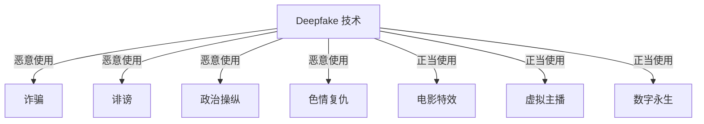
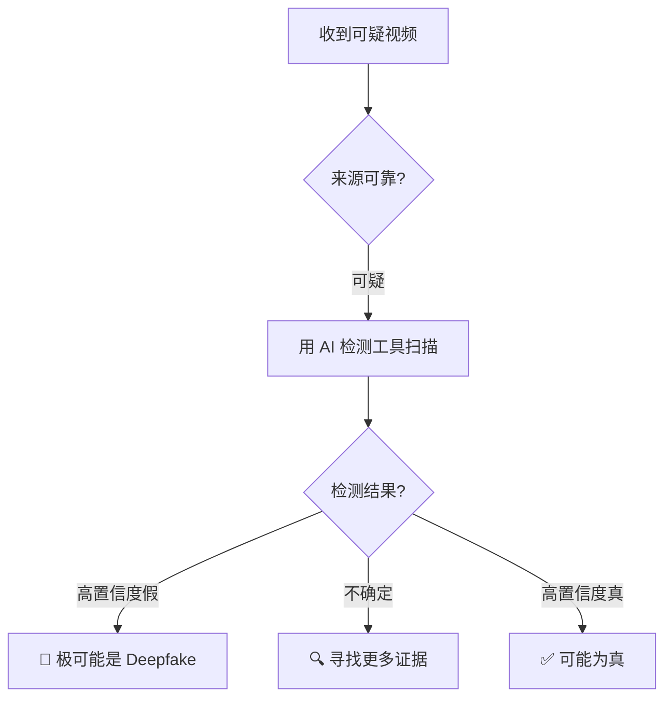

# 深度伪造安全小白指南 (Deepfake Security for Dummy)

> **一句话理解**: Deepfake 就像"数字变脸魔术"——用 AI 把你的脸换到别人身上，或者让某人说出从没说过的话，真假难辨。

---

## 🤔 什么是 Deepfake？

### 两个主要类型

| 类型 | 通俗说法 | 例子 |
|------|---------|------|
| **换脸** | "AI 变脸" | 把你的脸换到电影明星身上 |
| **语音克隆** | "AI 假声音" | 用你的声音说任何话 |
| **全身合成** | "AI 假人" | 生成不存在的人跳舞、说话 |

```mermaid
flowchart LR
    A[真视频<br/>奥巴马演讲] -->|AI 分析<br/>面部特征| B[Deepfake 模型]
    C[目标人脸<br/>你的照片] --> B
    B --> D[假视频<br/>"你"在演讲]
```

---

## 🧨 Deepfake 的危害

### 就像一个危险的玩具



| 危害 | 真实案例 |
|------|---------|
| **诈骗** | 用老板声音打电话，骗走 24 万欧元 |
| **假新闻** | 伪造政客演讲视频，影响选举 |
| **名誉损害** | 把普通人脸换到色情视频上 |
| **信任危机** | "有视频为证"不再可靠 |

---

## 🔍 如何识别 Deepfake？

### 肉眼观察技巧（不够准，但有用）

| 观察点 | 假视频的表现 |
|--------|-------------|
| **眼睛** | 不眨眼或眨眼频率异常 |
| **牙齿** | 模糊或不自然 |
| **耳朵** | 细节缺失，耳环穿帮 |
| **头发边缘** | 有奇怪的模糊边界 |
| **光照** | 脸部光和背景光不一致 |
| **声音** | 机械感，没有呼吸声 |

### AI 检测工具

| 工具 | 用途 | 准确度 |
|------|------|--------|
| **Microsoft Video Authenticator** | 视频真伪 | 中等 |
| **Deepware Scanner** | 手机扫描 | 入门 |
| **Intel FakeCatcher** | 实时检测 | 较高 |
| **商业方案** | 企业级检测 | 高 |



---

## 🛡️ 如何保护自己？

### 个人防护

| 措施 | 怎么做 |
|------|--------|
| **少晒高清正面照** | 减少被换脸的素材 |
| ** watermark 你的视频** | 加数字水印，方便追溯 |
| **警惕视频通话诈骗** | 涉及钱的视频通话，回拨确认 |
| **保护声音样本** | 不要随意提供语音录音 |

### 企业防护

- 部署 Deepfake 检测 API
- 员工安全意识培训
- 重要决策需要多重验证（视频+文字确认）

---

## ⚖️ 法律与伦理

| 国家/地区 | 法规 |
|-----------|------|
| **中国** | 《深度合成管理规定》：必须标识 AI 生成内容 |
| **美国** | 部分州立法禁止选举相关 Deepfake |
| **欧盟** | AI 法案要求高风险 AI 系统透明 |

**底线**：未经同意制作他人 Deepfake 是违法的。

---

## ⚠️ 常见问题

| 问题 | 解答 |
|------|------|
| **所有 AI 生成视频都是 Deepfake 吗？** | Deepfake 特指"伪造真实人物"，AI 动画、虚拟主播不算 |
| **Deepfake 检测 100% 准吗？** | 不是。检测和伪造在"军备竞赛" |
| **普通人需要担心吗？** | 需要。诈骗电话、假视频越来越逼真 |
| **怎么向长辈解释？** | "现在视频也能造假了，看到奇怪视频先别信" |

---

## 💡 核心要点

```mermaid
flowchart TB
    A[Deepfake = AI 变脸/变声] --> B[技术本身中性]
    B --> C[恶意使用：诈骗/诽谤/操纵]
    C --> D[防护：检测工具 + 提高警惕 + 法律]
    D --> E[记住：视频不再"有图有真相"]
```

---

## 🔗 相关主题

- [AI 安全红队测试](.伦理安全/AI_Safety_RedTeaming/AI_Safety_RedTeaming.md) — 主动测试 AI 安全
- [AI 治理合规](伦理安全/Governance/AI_Governance_Compliance_2026.md) — 法律法规
- [Privacy Preserving AI](.伦理安全/Privacy_Preserving_AI/Privacy_Preserving_AI.md) — 保护个人数据

---

*Last updated: 2026-05-07*

## 核心知识体系

| 知识域 | 核心内容 | 重要程度 | 学习优先级 |
|--------|----------|----------|------------|
| 基础理论 | 核心概念/原理/方法论 | 最高 | P0 |
| 技术实践 | 工具/框架/最佳实践 | 高 | P0 |
| 工程方法 | 设计模式/架构/流程 | 高 | P1 |
| 前沿趋势 | 新技术/新方向/研究 | 中 | P2 |
| 行业应用 | 实际案例/落地经验 | 中 | P1 |

## 技术对比与选型

| 维度 | 方案A | 方案B | 方案C | 选型建议 |
|------|-------|-------|-------|----------|
| 性能 | 高吞吐 | 低延迟 | 均衡 | 按场景选择 |
| 复杂度 | 简单 | 中等 | 复杂 | 按团队能力 |
| 成本 | 低 | 中 | 高 | 按预算约束 |
| 生态 | 成熟 | 发展中 | 新兴 | 按稳定性需求 |
| 扩展性 | 有限 | 良好 | 优秀 | 按增长预期 |

## 最佳实践清单

| 实践 | 说明 | 优先级 | 预期收益 |
|------|------|--------|----------|
| 标准化流程 | 统一规范和流程 | P0 | 减少错误+提升效率 |
| 自动化 | 重复工作自动化 | P0 | 节省时间+降低风险 |
| 持续监控 | 关键指标实时监控 | P1 | 及时发现问题 |
| 定期回顾 | 周期性复盘改进 | P1 | 持续优化 |
| 知识沉淀 | 文档化经验教训 | P2 | 团队能力提升 |
| 安全优先 | 安全贯穿全流程 | P0 | 降低风险 |

## 常见问题与解决方案

| 问题 | 根因分析 | 解决方案 | 预防措施 |
|------|----------|----------|----------|
| 效率低下 | 流程不规范/工具不当 | 优化流程+引入工具 | 标准化+培训 |
| 质量不稳定 | 缺乏检查机制 | 引入质量门禁 | 自动化测试 |
| 协作困难 | 职责不清/沟通不畅 | 明确分工+定期同步 | 文档化+工具 |
| 技术债务 | 赶工忽略质量 | 定期重构+代码审查 | 质量优先文化 |
| 安全风险 | 意识不足/措施缺失 | 安全培训+工具扫描 | 安全左移 |

## 学习路径建议

| 阶段 | 内容 | 时间 | 产出 |
|------|------|------|------|
| 入门 | 核心概念+基础操作 | 1-2周 | 理解基本框架 |
| 基础 | 工具使用+简单实践 | 2-3周 | 能独立完成基础任务 |
| 进阶 | 深入原理+复杂场景 | 3-4周 | 能处理复杂问题 |
| 实战 | 生产级应用+优化 | 4-6周 | 独立负责项目 |
| 精通 | 架构设计+前沿探索 | 持续 | 技术领导力 |

## 术语速查表

| 术语 | 含义 |
|------|------|
| Best Practice | 行业公认的最佳做法 |
| Anti-pattern | 反模式(应避免的做法) |
| Technical Debt | 技术债务(为速度牺牲质量) |
| CI/CD | 持续集成/持续部署 |
| SLA | 服务等级协议 |
| KPI | 关键绩效指标 |
| ROI | 投资回报率 |
| TCO | 总拥有成本 |

## 检查清单

- [ ] 核心概念和原理已理解
- [ ] 主流工具和框架已掌握
- [ ] 最佳实践已应用到工作中
- [ ] 常见问题能独立解决
- [ ] 持续关注前沿趋势
- [ ] 知识已文档化沉淀

## 相关链接

- [[伦理安全/Deepfake_Security/Deepfake_Security|Deepfake 安全 (完整版)]] — 本篇小白版对应的详细版
- [[伦理安全/Deepfake_Security/index|Deepfake 安全索引]] — 主题导览
- [[伦理安全/AI_Watermarking|AI 水印]] — Deepfake 防御的溯源手段
- [[概念/Vision/video-generation|视频生成]] — Deepfake 背后的生成技术
- [[计算机视觉/Video_Generation/Video_Generation_2026|AI 视频生成 2026]] — 视频生成技术全景
- [[概念/Safety/model-watermark|模型水印]] — 内容溯源技术
