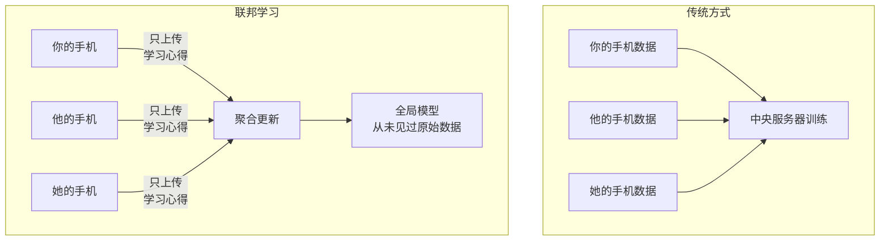
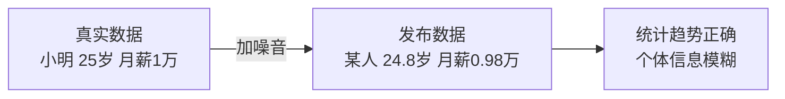
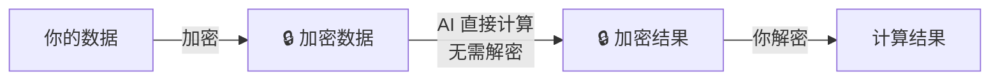
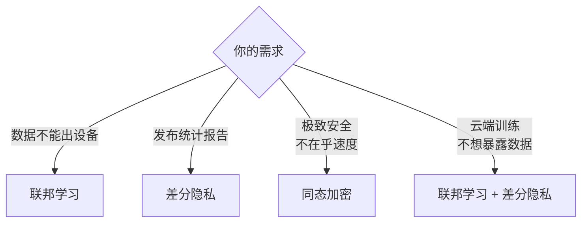
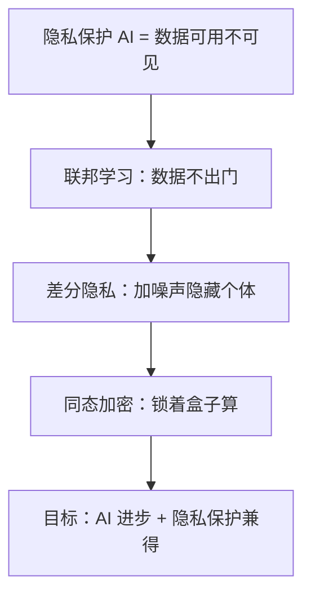

# 隐私保护 AI 小白指南 (Privacy Preserving AI for Dummy)

> **一句话理解**: 隐私保护 AI 就像"蒙眼猜谜"——让 AI 学到有用的知识，但永远看不到你的私人数据。

---

## 🤔 为什么 AI 需要隐私保护？

### 一个担忧

你用手机输入法，它越用越懂你：
- 你打"老地方"，它自动补全"星巴克"
- 你打"老婆生日"，它提醒"下周三"

**问题**：这些私密信息去哪了？

```mermaid
flowchart TB
    A[你的手机] -->|上传数据| B[AI 公司服务器]
    B --> C[训练大模型]
    C --> D[模型记住了<br/>"某人在某时某地..."]
    D --> E[🚨 隐私泄露风险!]
```

### 真实案例

| 事件 | 问题 |
|------|------|
| **ChatGPT 数据泄露** | 用户聊天记录被其他用户看到 |
| **三星员工泄密** | 把机密代码贴给 ChatGPT，被用于训练 |
| **医疗 AI 偏见** | 用未脱敏数据训练，暴露患者信息 |

---

## 🛡️ 三大保护技术

### 1. 联邦学习（Federated Learning）

**比喻**：小组学习，但不共享笔记



**怎么工作？**
1. 中央服务器发一个"空白模型"到每个手机
2. 每个手机用**自己的数据**训练这个模型
3. 只把**训练后的更新**（不是数据）传回服务器
4. 服务器把所有更新合并，得到更好的模型

| 优点 | 缺点 |
|------|------|
| 数据不离开设备 | 计算分散，训练慢 |
| 符合隐私法规 | 需要大量设备参与 |
| 减少数据传输 | 模型更新可能被反推 |

---

### 2. 差分隐私（Differential Privacy）

**比喻**：给数据"加噪音"，让个体信息隐藏在大数据中



**核心思想**：
- 在数据或模型更新中加入**数学噪声**
-  Noise 小到不影响整体统计
-  Noise 大到无法还原个人信息

```python
# 简化概念（不是真实代码）
def private_average(salaries):
    noise = random_laplace()  # 加入拉普拉斯噪声
    return sum(salaries) / len(salaries) + noise
```

| 隐私预算 ε | 含义 |
|-----------|------|
| **ε = 0.1** | 非常隐私，但数据效用低 |
| **ε = 1** | 平衡隐私和效用 |
| **ε = 10** | 效用高，但隐私保护弱 |

---

### 3. 同态加密（Homomorphic Encryption）

**比喻**：锁着的盒子里做计算



**神奇之处**：
- AI 在**完全不知道数据内容**的情况下完成计算
- 只有数据主人能解密看到结果

| 优点 | 缺点 |
|------|------|
| 极致隐私 | 计算慢 100-1000 倍 |
| 数学上可证明安全 | 部署复杂 |

---

## 🎯 技术选型指南



| 场景 | 推荐方案 |
|------|---------|
| 手机输入法优化 | 联邦学习 |
| 发布人口统计报告 | 差分隐私 |
| 银行联合风控 | 联邦学习 + 差分隐私 |
| 医疗数据跨院研究 | 联邦学习 |
| 云端 AI 推理 | 同态加密（若性能允许） |

---

## ⚠️ 常见问题

| 问题 | 解答 |
|------|------|
| **这些技术 100% 安全吗？** | 没有绝对安全，但数学上可量化风险 |
| **会严重影响 AI 效果吗？** | 联邦学习影响小；差分隐私取决于 ε；同态加密影响大 |
| **普通开发者需要学吗？** | 了解概念即可，实际用开源库（PySyft、TensorFlow Privacy） |
| **法规要求吗？** | GDPR、中国《个人信息保护法》都要求隐私保护 |

---

## 💡 核心要点



---

## 🔗 相关主题

- [AI Supply Chain Security](../AI_Supply_Chain_Security/AI_Supply_Chain_Security.md) — 数据安全
- [AI Governance](../AI_Governance_Compliance_2026.md) — 隐私法规
- [Deepfake Security](../Deepfake_Security/Deepfake_Security.md) — 个人信息保护

---

*Last updated: 2026-05-07*

## 核心知识体系

| 知识域 | 核心内容 | 重要程度 | 学习优先级 |
|--------|----------|----------|------------|
| 基础理论 | 核心概念/原理/方法论 | 最高 | P0 |
| 技术实践 | 工具/框架/最佳实践 | 高 | P0 |
| 工程方法 | 设计模式/架构/流程 | 高 | P1 |
| 前沿趋势 | 新技术/新方向/研究 | 中 | P2 |
| 行业应用 | 实际案例/落地经验 | 中 | P1 |

## 技术对比与选型

| 维度 | 方案A | 方案B | 方案C | 选型建议 |
|------|-------|-------|-------|----------|
| 性能 | 高吞吐 | 低延迟 | 均衡 | 按场景选择 |
| 复杂度 | 简单 | 中等 | 复杂 | 按团队能力 |
| 成本 | 低 | 中 | 高 | 按预算约束 |
| 生态 | 成熟 | 发展中 | 新兴 | 按稳定性需求 |
| 扩展性 | 有限 | 良好 | 优秀 | 按增长预期 |

## 最佳实践清单

| 实践 | 说明 | 优先级 | 预期收益 |
|------|------|--------|----------|
| 标准化流程 | 统一规范和流程 | P0 | 减少错误+提升效率 |
| 自动化 | 重复工作自动化 | P0 | 节省时间+降低风险 |
| 持续监控 | 关键指标实时监控 | P1 | 及时发现问题 |
| 定期回顾 | 周期性复盘改进 | P1 | 持续优化 |
| 知识沉淀 | 文档化经验教训 | P2 | 团队能力提升 |
| 安全优先 | 安全贯穿全流程 | P0 | 降低风险 |

## 常见问题与解决方案

| 问题 | 根因分析 | 解决方案 | 预防措施 |
|------|----------|----------|----------|
| 效率低下 | 流程不规范/工具不当 | 优化流程+引入工具 | 标准化+培训 |
| 质量不稳定 | 缺乏检查机制 | 引入质量门禁 | 自动化测试 |
| 协作困难 | 职责不清/沟通不畅 | 明确分工+定期同步 | 文档化+工具 |
| 技术债务 | 赶工忽略质量 | 定期重构+代码审查 | 质量优先文化 |
| 安全风险 | 意识不足/措施缺失 | 安全培训+工具扫描 | 安全左移 |

## 学习路径建议

| 阶段 | 内容 | 时间 | 产出 |
|------|------|------|------|
| 入门 | 核心概念+基础操作 | 1-2周 | 理解基本框架 |
| 基础 | 工具使用+简单实践 | 2-3周 | 能独立完成基础任务 |
| 进阶 | 深入原理+复杂场景 | 3-4周 | 能处理复杂问题 |
| 实战 | 生产级应用+优化 | 4-6周 | 独立负责项目 |
| 精通 | 架构设计+前沿探索 | 持续 | 技术领导力 |

## 术语速查表

| 术语 | 含义 |
|------|------|
| Best Practice | 行业公认的最佳做法 |
| Anti-pattern | 反模式(应避免的做法) |
| Technical Debt | 技术债务(为速度牺牲质量) |
| CI/CD | 持续集成/持续部署 |
| SLA | 服务等级协议 |
| KPI | 关键绩效指标 |
| ROI | 投资回报率 |
| TCO | 总拥有成本 |

## 检查清单

- [ ] 核心概念和原理已理解
- [ ] 主流工具和框架已掌握
- [ ] 最佳实践已应用到工作中
- [ ] 常见问题能独立解决
- [ ] 持续关注前沿趋势
- [ ] 知识已文档化沉淀
