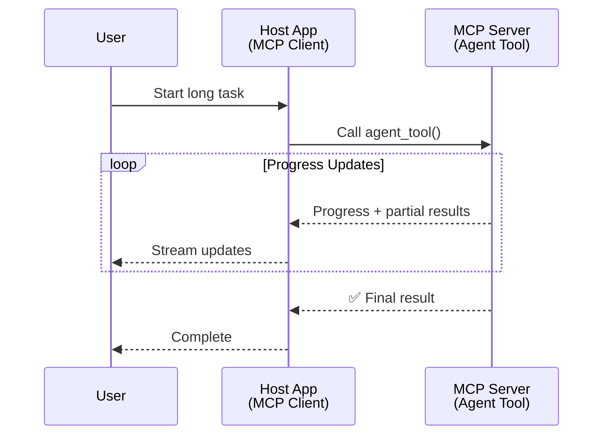
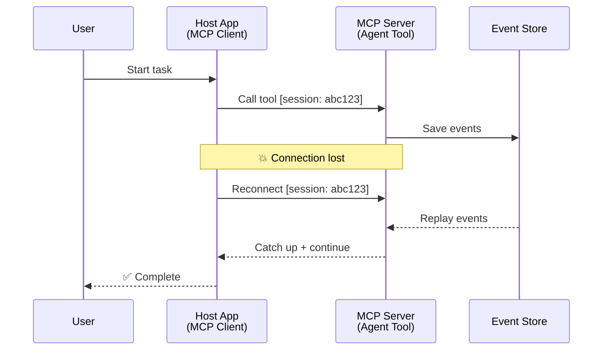
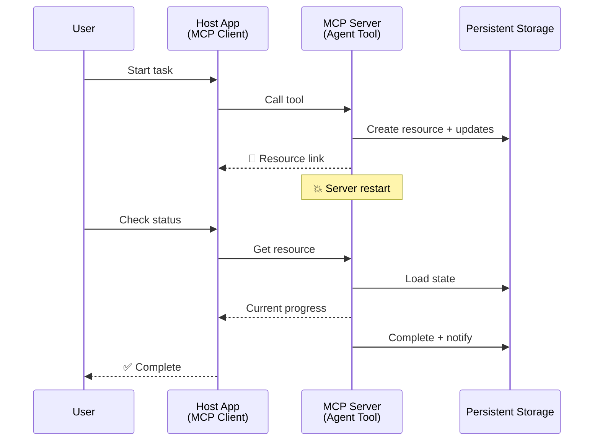
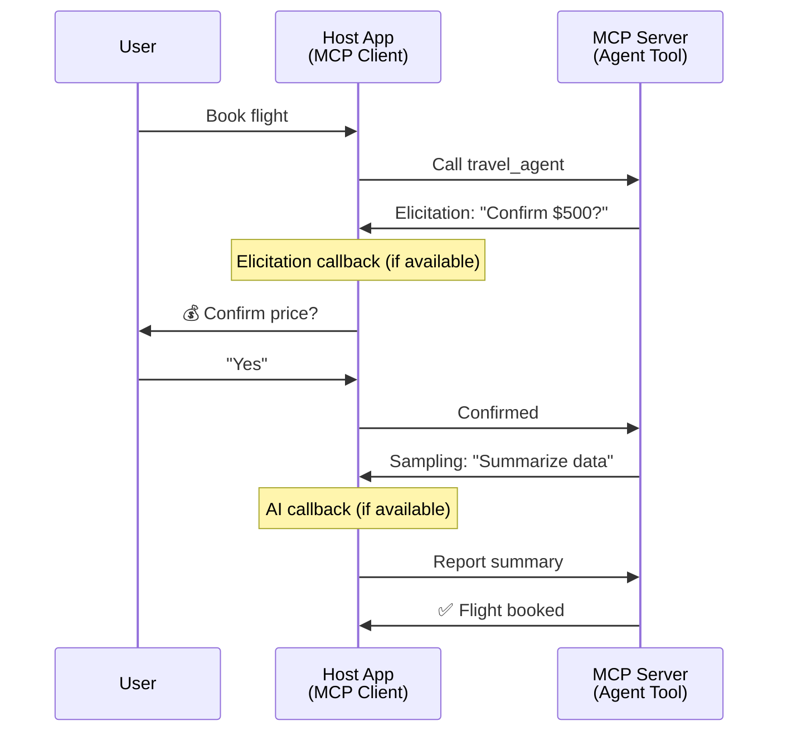
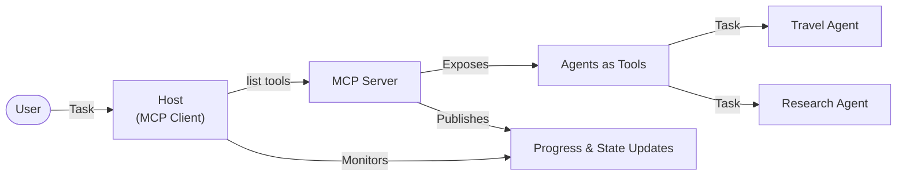

# Створення систем комунікації між агентами за допомогою MCP

> Коротко - Чи можна побудувати Agent2Agent комунікацію на MCP? Так!

MCP значно розвинувся від своєї початкової мети "надання контексту для LLMs". Завдяки останнім покращенням, таким як [відновлювані потоки](https://modelcontextprotocol.io/docs/概念/transports#resumability-and-redelivery), [елісітація](https://modelcontextprotocol.io/specification/2025-06-18/client/elicitation), [семплінг](https://modelcontextprotocol.io/specification/2025-06-18/client/sampling) і сповіщення ([прогрес](https://modelcontextprotocol.io/specification/2025-06-18/basic/utilities/progress) та [ресурси](https://modelcontextprotocol.io/specification/2025-06-18/schema#resourceupdatednotification)), MCP тепер забезпечує міцну основу для створення складних систем комунікації між агентами.

## Неправильне уявлення про агента/інструмент

Зі збільшенням кількості розробників, які досліджують інструменти з агентною поведінкою (тривала робота, необхідність додаткового вводу під час виконання тощо), поширюється хибне уявлення, що MCP не підходить, головним чином через те, що ранні приклади його примітивів інструментів зосереджувалися на простих шаблонах запит-відповідь.

Це уявлення застаріло. Специфікація MCP значно покращилася за останні місяці, включивши можливості, які закривають прогалини для створення тривалої агентної поведінки:

- **Потоки та часткові результати**: Оновлення прогресу в реальному часі під час виконання
- **Відновлюваність**: Клієнти можуть повторно підключатися та продовжувати після розриву зв’язку
- **Стійкість**: Результати зберігаються після перезапуску сервера (наприклад, через посилання на ресурси)
- **Багатокроковість**: Інтерактивний ввід під час виконання через елісітацію та семплінг

Ці функції можна комбінувати для створення складних агентних і мультиагентних додатків, які розгортаються на протоколі MCP.

Для довідки ми будемо називати агента "інструментом", доступним на сервері MCP. Це передбачає існування хост-додатку, який реалізує клієнт MCP, встановлює сесію з сервером MCP і може викликати агента.

## Що робить інструмент MCP "агентним"?

Перед тим як перейти до реалізації, давайте визначимо, які інфраструктурні можливості потрібні для підтримки тривалих агентів.

> Ми визначимо агента як сутність, яка може автономно працювати протягом тривалого часу, здатна виконувати складні завдання, які можуть вимагати багаторазових взаємодій або коригувань на основі зворотного зв’язку в реальному часі.

### 1. Потоки та часткові результати

Традиційні шаблони запит-відповідь не працюють для тривалих завдань. Агенти повинні надавати:

- Оновлення прогресу в реальному часі
- Проміжні результати

**Підтримка MCP**: Сповіщення про оновлення ресурсів дозволяють потокове передавання часткових результатів, хоча це вимагає ретельного дизайну, щоб уникнути конфліктів із моделлю 1:1 запит/відповідь JSON-RPC.

| Функція                    | Використання                                                                                                                                                                       | Підтримка MCP                                                                                |
| -------------------------- | ---------------------------------------------------------------------------------------------------------------------------------------------------------------------------------- | ------------------------------------------------------------------------------------------ |
| Оновлення прогресу в реальному часі | Користувач запитує завдання міграції кодової бази. Агент передає прогрес: "10% - Аналіз залежностей... 25% - Конвертація файлів TypeScript... 50% - Оновлення імпортів..."          | ✅ Сповіщення про прогрес                                                                  |
| Часткові результати            | Завдання "Створити книгу" передає часткові результати, наприклад: 1) Контур сюжетної арки, 2) Список глав, 3) Кожна глава по мірі завершення. Хост може перевірити, скасувати або перенаправити на будь-якому етапі. | ✅ Сповіщення можуть бути "розширені", щоб включати часткові результати, див. пропозиції PR 383, 776 |

<div align="center" style="font-style: italic; font-size: 0.95em; margin-bottom: 0.5em;">
<strong>Рисунок 1:</strong> Ця діаграма ілюструє, як агент MCP передає оновлення прогресу в реальному часі та часткові результати хост-додатку під час тривалого завдання, дозволяючи користувачеві контролювати виконання в реальному часі.
</div>



### 2. Відновлюваність

Агенти повинні справлятися з перериваннями мережі без втрати даних:

- Повторне підключення після розриву зв’язку (клієнт)
- Продовження з того місця, де вони зупинилися (повторна доставка повідомлень)

**Підтримка MCP**: Транспорт StreamableHTTP MCP сьогодні підтримує відновлення сесій і повторну доставку повідомлень за допомогою ідентифікаторів сесій і останніх ідентифікаторів подій. Важливо зазначити, що сервер повинен реалізувати EventStore, який дозволяє повторне відтворення подій при повторному підключенні клієнта.  
Зверніть увагу, що існує пропозиція спільноти (PR #975), яка досліджує транспортно-незалежні відновлювані потоки.

| Функція      | Використання                                                                                                                                                   | Підтримка MCP                                                                |
| ------------ | ---------------------------------------------------------------------------------------------------------------------------------------------------------- | -------------------------------------------------------------------------- |
| Відновлюваність | Клієнт розриває зв’язок під час тривалого завдання. Після повторного підключення сесія відновлюється з пропущеними подіями, продовжуючи безперервно з того місця, де вона зупинилася. | ✅ Транспорт StreamableHTTP з ідентифікаторами сесій, повторним відтворенням подій і EventStore |

<div align="center" style="font-style: italic; font-size: 0.95em; margin-bottom: 0.5em;">
<strong>Рисунок 2:</strong> Ця діаграма показує, як транспорт StreamableHTTP MCP і EventStore забезпечують безперервне відновлення сесій: якщо клієнт розриває зв’язок, він може повторно підключитися і відтворити пропущені події, продовжуючи завдання без втрати прогресу.
</div>



### 3. Стійкість

Тривалі агенти потребують збереження стану:

- Результати зберігаються після перезапуску сервера
- Статус можна отримати поза сесією
- Відстеження прогресу між сесіями

**Підтримка MCP**: MCP тепер підтримує тип повернення Resource link для викликів інструментів. Сьогодні можливий шаблон полягає в тому, щоб створити інструмент, який створює ресурс і негайно повертає посилання на ресурс. Інструмент може продовжувати виконувати завдання у фоновому режимі та оновлювати ресурс. У свою чергу, клієнт може вибрати опитування стану цього ресурсу, щоб отримати часткові або повні результати (залежно від того, які оновлення ресурсу надає сервер) або підписатися на ресурс для отримання сповіщень про оновлення.

Одним із обмежень тут є те, що опитування ресурсів або підписка на оновлення може споживати ресурси з наслідками для масштабування. Існує відкрита пропозиція спільноти (включаючи #992), яка досліджує можливість включення вебхуків або тригерів, які сервер може викликати для сповіщення клієнта/хост-додатку про оновлення.

| Функція    | Використання                                                                                                                                        | Підтримка MCP                                                        |
| ---------- | ----------------------------------------------------------------------------------------------------------------------------------------------- | ------------------------------------------------------------------ |
| Стійкість | Сервер аварійно завершує роботу під час завдання міграції даних. Результати та прогрес зберігаються після перезапуску, клієнт може перевірити статус і продовжити з постійного ресурсу. | ✅ Посилання на ресурси з постійним зберіганням і сповіщеннями про статус |

Сьогодні поширений шаблон полягає в тому, щоб створити інструмент, який створює ресурс і негайно повертає посилання на ресурс. Інструмент може у фоновому режимі виконувати завдання, видавати сповіщення про ресурс, які служать оновленнями прогресу або включають часткові результати, і оновлювати вміст у ресурсі за потреби.

<div align="center" style="font-style: italic; font-size: 0.95em; margin-bottom: 0.5em;">
<strong>Рисунок 3:</strong> Ця діаграма демонструє, як агенти MCP використовують постійні ресурси та сповіщення про статус, щоб забезпечити збереження тривалих завдань після перезапуску сервера, дозволяючи клієнтам перевіряти прогрес і отримувати результати навіть після збоїв.
</div>



### 4. Багатокрокові взаємодії

Агенти часто потребують додаткового вводу під час виконання:

- Уточнення або підтвердження від людини
- Допомога AI для складних рішень
- Динамічне коригування параметрів

**Підтримка MCP**: Повністю підтримується через семплінг (для вводу AI) та елісітацію (для вводу людини).

| Функція                 | Використання                                                                                                                                     | Підтримка MCP                                           |
| ----------------------- | -------------------------------------------------------------------------------------------------------------------------------------------- | ----------------------------------------------------- |
| Багатокрокові взаємодії | Агент бронювання подорожей запитує підтвердження ціни від користувача, а потім просить AI підсумувати дані про подорож перед завершенням транзакції бронювання. | ✅ Елісітація для вводу людини, семплінг для вводу AI |

<div align="center" style="font-style: italic; font-size: 0.95em; margin-bottom: 0.5em;">
<strong>Рисунок 4:</strong> Ця діаграма показує, як агенти MCP можуть інтерактивно запитувати ввід людини або просити допомогу AI під час виконання, підтримуючи складні багатокрокові робочі процеси, такі як підтвердження та динамічне прийняття рішень.
</div>



## Реалізація тривалих агентів на MCP - огляд коду

У рамках цієї статті ми надаємо [репозиторій коду](https://github.com/victordibia/ai-tutorials/tree/main/MCP%20Agents), який містить повну реалізацію тривалих агентів за допомогою MCP Python SDK з транспортом StreamableHTTP для відновлення сесій і повторної доставки повідомлень. Реалізація демонструє, як можливості MCP можуть бути скомпоновані для забезпечення складної агентної поведінки.

Зокрема, ми реалізуємо сервер із двома основними інструментами агентів:

- **Агент подорожей** - Імітує сервіс бронювання подорожей із підтвердженням ціни через елісітацію
- **Агент досліджень** - Виконує дослідницькі завдання з AI-допомогою через семплінг

Обидва агенти демонструють оновлення прогресу в реальному часі, інтерактивні підтвердження та повні можливості відновлення сесій.

### Основні концепції реалізації

Наступні розділи показують реалізацію агента на стороні сервера та обробку хостом на стороні клієнта для кожної функції:

#### Потоки та оновлення прогресу - статус завдання в реальному часі

Потоки дозволяють агентам надавати оновлення прогресу в реальному часі під час тривалих завдань, інформуючи користувачів про статус завдання та проміжні результати.

**Реалізація на сервері (агент надсилає сповіщення про прогрес):**

```python
# From server/server.py - Travel agent sending progress updates
for i, step in enumerate(steps):
    await ctx.session.send_progress_notification(
        progress_token=ctx.request_id,
        progress=i * 25,
        total=100,
        message=step,
        related_request_id=str(ctx.request_id)
    )
    await anyio.sleep(2)  # Simulate work

# Alternative: Log messages for detailed step-by-step updates
await ctx.session.send_log_message(
    level="info",
    data=f"Processing step {current_step}/{steps} ({progress_percent}%)",
    logger="long_running_agent",
    related_request_id=ctx.request_id,
)
```

**Реалізація на клієнті (хост отримує оновлення прогресу):**

```python
# From client/client.py - Client handling real-time notifications
async def message_handler(message) -> None:
    if isinstance(message, types.ServerNotification):
        if isinstance(message.root, types.LoggingMessageNotification):
            console.print(f"📡 [dim]{message.root.params.data}[/dim]")
        elif isinstance(message.root, types.ProgressNotification):
            progress = message.root.params
            console.print(f"🔄 [yellow]{progress.message} ({progress.progress}/{progress.total})[/yellow]")

# Register message handler when creating session
async with ClientSession(
    read_stream, write_stream,
    message_handler=message_handler
) as session:
```

#### Елісітація - запит вводу користувача

Елісітація дозволяє агентам запитувати ввід користувача під час виконання. Це важливо для підтверджень, уточнень або схвалень під час тривалих завдань.

**Реалізація на сервері (агент запитує підтвердження):**

```python
# From server/server.py - Travel agent requesting price confirmation
elicit_result = await ctx.session.elicit(
    message=f"Please confirm the estimated price of $1200 for your trip to {destination}",
    requestedSchema=PriceConfirmationSchema.model_json_schema(),
    related_request_id=ctx.request_id,
)

if elicit_result and elicit_result.action == "accept":
    # Continue with booking
    logger.info(f"User confirmed price: {elicit_result.content}")
elif elicit_result and elicit_result.action == "decline":
    # Cancel the booking
    booking_cancelled = True
```

**Реалізація на клієнті (хост надає зворотний виклик елісітації):**

```python
# From client/client.py - Client handling elicitation requests
async def elicitation_callback(context, params):
    console.print(f"💬 Server is asking for confirmation:")
    console.print(f"   {params.message}")

    response = console.input("Do you accept? (y/n): ").strip().lower()

    if response in ['y', 'yes']:
        return types.ElicitResult(
            action="accept",
            content={"confirm": True, "notes": "Confirmed by user"}
        )
    else:
        return types.ElicitResult(
            action="decline",
            content={"confirm": False, "notes": "Declined by user"}
        )

# Register the callback when creating the session
async with ClientSession(
    read_stream, write_stream,
    elicitation_callback=elicitation_callback
) as session:
```

#### Семплінг - запит допомоги AI

Семплінг дозволяє агентам запитувати допомогу LLM для складних рішень або генерації контенту під час виконання. Це дозволяє створювати гібридні робочі процеси людина-AI.

**Реалізація на сервері (агент запитує допомогу AI):**

```python
# From server/server.py - Research agent requesting AI summary
sampling_result = await ctx.session.create_message(
    messages=[
        SamplingMessage(
            role="user",
            content=TextContent(type="text", text=f"Please summarize the key findings for research on: {topic}")
        )
    ],
    max_tokens=100,
    related_request_id=ctx.request_id,
)

if sampling_result and sampling_result.content:
    if sampling_result.content.type == "text":
        sampling_summary = sampling_result.content.text
        logger.info(f"Received sampling summary: {sampling_summary}")
```

**Реалізація на клієнті (хост надає зворотний виклик семплінгу):**

```python
# From client/client.py - Client handling sampling requests
async def sampling_callback(context, params):
    message_text = params.messages[0].content.text if params.messages else 'No message'
    console.print(f"🧠 Server requested sampling: {message_text}")

    # In a real application, this could call an LLM API
    # For demo purposes, we provide a mock response
    mock_response = "Based on current research, MCP has evolved significantly..."

    return types.CreateMessageResult(
        role="assistant",
        content=types.TextContent(type="text", text=mock_response),
        model="interactive-client",
        stopReason="endTurn"
    )

# Register the callback when creating the session
async with ClientSession(
    read_stream, write_stream,
    sampling_callback=sampling_callback,
    elicitation_callback=elicitation_callback
) as session:
```

#### Відновлюваність - безперервність сесії при розриві зв’язку

Відновлюваність забезпечує, що тривалі завдання агентів можуть пережити розриви зв’язку клієнта та продовжувати безперервно після повторного підключення. Це реалізується через EventStore і токени відновлення.

**Реалізація EventStore (сервер зберігає стан сесії):**

```python
# From server/event_store.py - Simple in-memory event store
class SimpleEventStore(EventStore):
    def __init__(self):
        self._events: list[tuple[StreamId, EventId, JSONRPCMessage]] = []
        self._event_id_counter = 0

    async def store_event(self, stream_id: StreamId, message: JSONRPCMessage) -> EventId:
        """Store an event and return its ID."""
        self._event_id_counter += 1
        event_id = str(self._event_id_counter)
        self._events.append((stream_id, event_id, message))
        return event_id

    async def replay_events_after(self, last_event_id: EventId, send_callback: EventCallback) -> StreamId | None:
        """Replay events after the specified ID for resumption."""
        # Find events after the last known event and replay them
        for _, event_id, message in self._events[start_index:]:
            await send_callback(EventMessage(message, event_id))

# From server/server.py - Passing event store to session manager
def create_server_app(event_store: Optional[EventStore] = None) -> Starlette:
    server = ResumableServer()

    # Create session manager with event store for resumption
    session_manager = StreamableHTTPSessionManager(
        app=server,
        event_store=event_store,  # Event store enables session resumption
        json_response=False,
        security_settings=security_settings,
    )

    return Starlette(routes=[Mount("/mcp", app=session_manager.handle_request)])

# Usage: Initialize with event store
event_store = SimpleEventStore()
app = create_server_app(event_store)
```

**Метадані клієнта з токеном відновлення (клієнт повторно підключається, використовуючи збережений стан):**

```python
# From client/client.py - Client resumption with metadata
if existing_tokens and existing_tokens.get("resumption_token"):
    # Use existing resumption token to continue where we left off
    metadata = ClientMessageMetadata(
        resumption_token=existing_tokens["resumption_token"],
    )
else:
    # Create callback to save resumption token when received
    def enhanced_callback(token: str):
        protocol_version = getattr(session, 'protocol_version', None)
        token_manager.save_tokens(session_id, token, protocol_version, command, args)

    metadata = ClientMessageMetadata(
        on_resumption_token_update=enhanced_callback,
    )

# Send request with resumption metadata
result = await session.send_request(
    types.ClientRequest(
        types.CallToolRequest(
            method="tools/call",
            params=types.CallToolRequestParams(name=command, arguments=args)
        )
    ),
    types.CallToolResult,
    metadata=metadata,
)
```

Хост-додаток зберігає локально ідентифікатори сесій і токени відновлення, дозволяючи йому повторно підключатися до існуючих сесій без втрати прогресу або стану.

### Організація коду

<div align="center" style="font-style: italic; font-size: 0.95em; margin-bottom: 0.5em;">
<strong>Рисунок 5:</strong> Архітектура системи агентів на основі MCP
</div>



**Основні файли:**

- **`server/server.py`** - Відновлюваний сервер MCP із агентами подорожей і досліджень, які демонструють елісітацію, семплінг і оновлення прогресу
- **`client/client.py`** - Інтерактивний хост-додаток із підтримкою відновлення, обробниками зворотних викликів і управлінням токенами
- **`server/event_store.py`** - Реалізація EventStore, що дозволяє відновлення сесій і повторну доставку повідомлень

## Розширення до мультиагентної комунікації на MCP

Реалізацію, описану вище, можна розширити до мультиагентних систем, покращуючи інтелект і масштаб хост-додатку:

- **Інтелектуальне розбиття завдань**: Хост аналізує складні запити користувача та розбиває їх на підзавдання для різних спеціалізованих агентів
- **Координація між серверами**: Хост підтримує з’єднання з кількома серверами MCP, кожен із яких надає різні можливості агентів
- **Управління станом завдань**: Хост відстежує прогрес кількох одночасних завдань агентів, обробляючи залежності та послідовність
- **Стійкість і повторні спроби**: Хост управляє збоями, реалізує логіку повторних спроб і перенаправляє завдання, коли агенти стають недоступними
- **Синт

---

**Відмова від відповідальності**:  
Цей документ був перекладений за допомогою сервісу автоматичного перекладу [Co-op Translator](https://github.com/Azure/co-op-translator). Хоча ми прагнемо до точності, будь ласка, майте на увазі, що автоматичні переклади можуть містити помилки або неточності. Оригінальний документ на його рідній мові слід вважати авторитетним джерелом. Для критичної інформації рекомендується професійний людський переклад. Ми не несемо відповідальності за будь-які непорозуміння або неправильні тлумачення, що виникають внаслідок використання цього перекладу.