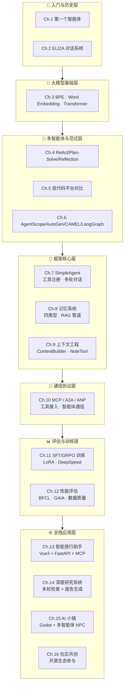
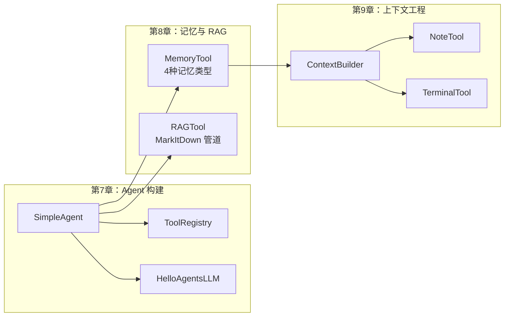

**Hello Agents** 是一套从零基础到全栈实战的 AI 智能体开发教程，覆盖 16 个章节、超过 80 个可运行代码示例，以及 4 个完整的工业级应用项目。本教程以 **"从原理到工程"** 为核心哲学——先让你理解 Transformer 注意力机制的数学推导，再带你用 HelloAgents 框架构建可上线的智能体系统。无论你是刚接触 LLM 的前端工程师，还是深耕后端的架构师，都能在此找到一条清晰的学习路径。

## 教程整体架构

整个教程按照 **"认知 → 能力 → 工具 → 协议 → 训练 → 评估 → 应用"** 的七层递进结构组织，每一层都建立在前一层的知识基础之上。以下架构图展示了从底层 NLP 基础到顶层全栈应用的完整知识栈：



整个教程的代码库采用扁平的 `chapter1` 至 `chapter16` 目录组织，每个章节独立可运行，无需严格的前序依赖——但建议初学者按照章节顺序学习，以获得最流畅的知识构建体验。

Sources: [目录结构](.) · [FirstAgentTest.py](chapter1/FirstAgentTest.py) · [ELIZA.py](chapter2/ELIZA.py)

## 16 章内容地图

下表是对全部 16 个章节的系统性总览，按学习阶段分组，标注了核心技术栈、代码量和建议学习优先级：

| 阶段 | 章节 | 主题 | 核心技术栈 | 关键产出 |
|------|------|------|-----------|---------|
| **入门** | Ch.1 | 第一个智能体 | OpenAI 兼容 API · wttr.in · Tavily | 天气查询+景点推荐 ReAct Agent |
| | Ch.2 | ELIZA 对话系统 | 正则匹配 · 模板响应 | 规则驱动的心理治疗聊天机器人 |
| **大模型基础** | Ch.3 | 分词与 Transformer | PyTorch · BPE · Word Embedding | 从零实现多头注意力+编解码器 |
| **推理范式** | Ch.4 | ReAct/Plan-Solve/Reflection | HelloAgentsLLM · ToolExecutor | 三种推理范式的完整实现 |
| **平台对比** | Ch.5 | 低代码平台 | Coze · Dify · FastGPT · n8n | 四平台配置文件导出 |
| | Ch.6 | 多智能体框架 | AgentScope · AutoGen · CAMEL · LangGraph | 三国狼人杀/软件开发团队/数字图书写作 |
| **框架核心** | Ch.7 | SimpleAgent 构建 | HelloAgents 框架 | 自定义 Agent + 工具注册 + 流式对话 |
| | Ch.8 | 记忆系统 | MemoryTool · RAGTool · MarkItDown | 四种记忆类型+遗忘整合机制 |
| | Ch.9 | 上下文工程 | ContextBuilder · NoteTool · TerminalTool | 三天代码库维护工作流 |
| **通信协议** | Ch.10 | MCP/A2A/ANP | MCPClient · A2AServer · ANPDiscovery | 协议全栈：工具接入→智能体通信→网络发现 |
| **模型训练** | Ch.11 | SFT/GRPO 微调 | RLTrainingTool · LoRA · DeepSpeed | 完整 RL 训练流水线 |
| **评估优化** | Ch.12 | 性能评估 | BFCL · GAIA · LLM Judge · Win Rate | 函数调用/通用能力/合成数据评估 |
| **全栈应用** | Ch.13 | 旅行助手 | Vue3 + TypeScript + FastAPI + MCP | 全栈智能旅行规划系统 |
| | Ch.14 | 深度研究 | FastAPI + 多轮检索 | 端到端研究报告生成 |
| | Ch.15 | AI 小镇 | Godot 4.x + FastAPI + HelloAgents | 多智能体 NPC 游戏模拟 |
| | Ch.16 | 社区共创 | 开源协作 | 共创项目指引 |

Sources: [FirstAgentTest.py](chapter1/FirstAgentTest.py#L1-L209) · [ELIZA.py](chapter2/ELIZA.py#L1-L85) · [Transformer.py](chapter3/Transformer.py#L1-L60) · [ReAct.py](chapter4/ReAct.py#L1-L100) · [Plan_and_solve.py](chapter4/Plan_and_solve.py#L1-L126) · [Reflection.py](chapter4/Reflection.py#L1-L60)

## 入门阶段：从第一个智能体到对话系统史

教程的前两章旨在建立最基础的认知锚点。第 1 章直接给出一个 **完整的 ReAct 智能体**——包含系统提示词设计、工具注册（天气查询 + Tavily 搜索）、Thought-Action-Observation 循环解析，以及 OpenAI 兼容客户端封装。这个示例虽然只有约 200 行代码，却涵盖了现代智能体的所有核心要素：**LLM 调用 → 推理 → 工具执行 → 循环迭代**。第 2 章则回到 1966 年的 ELIZA，用纯 Python 正则匹配实现规则驱动的对话系统，让你理解"对话系统"从无到有的历史脉络。

这两章的代码风格刻意保持极简——不依赖任何框架，所有逻辑裸露可见。这种设计让初学者能够 **逐行理解智能体的运行机制**，而不被框架抽象层遮蔽视线。

Sources: [FirstAgentTest.py](chapter1/FirstAgentTest.py#L1-L50) · [ELIZA.py](chapter2/ELIZA.py#L1-L41) · [FirstAgentTest.py](chapter1/FirstAgentTest.py#L113-L155)

## 大模型基础与推理范式

### 从分词到 Transformer：理解 LLM 的底层引擎

第 3 章是整部教程的 **数学基石**。你将从 BPE 分词算法的逐步合并过程开始，理解大模型如何将自然语言转化为可计算的词元序列；然后通过 Word Embedding 的余弦相似度实验，直观感受"king − man + woman ≈ queen"的向量语义空间；最后用 PyTorch 从零实现完整的 Transformer 架构——多头注意力、缩放点积注意力、位置编码、前馈网络、编码器-解码器堆叠，每一层都配有详细注释。

```python
# 缩放点积注意力的核心计算（第3章 Transformer 实现片段）
attn_scores = torch.matmul(Q, K.transpose(-2, -1)) / math.sqrt(self.d_k)
attn_probs = torch.softmax(attn_scores, dim=-1)
output = torch.matmul(attn_probs, V)
```

### 三种推理范式：ReAct、Plan-and-Solve、Reflection

第 4 章在第 3 章的 LLM 客户端基础上，构建了三种经典的智能体推理范式，并引入了一个简洁的 **ToolExecutor 工具执行器** 作为基础设施：

| 范式 | 核心思想 | 适用场景 | 实现文件 |
|------|---------|---------|---------|
| **ReAct** | 思考→行动→观察的实时循环 | 需要实时工具调用的问答 | [ReAct.py](chapter4/ReAct.py#L26-L73) |
| **Plan-and-Solve** | 先规划全步骤，再逐步执行 | 复杂多步推理任务 | [Plan_and_solve.py](chapter4/Plan_and_solve.py#L32-L126) |
| **Reflection** | 执行后自我反思，迭代改进 | 代码生成/创作类任务 | [Reflection.py](chapter4/Reflection.py#L7-L164) |

ReAct 范式的实现尤为精炼：通过正则表达式解析 LLM 输出中的 `Thought:` 和 `Action:` 字段，自动调用注册的工具，将执行结果作为 `Observation` 追加到上下文中，循环往复直到遇到 `Finish[答案]` 指令或达到最大步数。

Sources: [Transformer.py](chapter3/Transformer.py#L6-L60) · [BPE.py](chapter3/BPE.py#L1-L35) · [Word_Embedding.py](chapter3/Word_Embedding.py#L1-L23) · [ReAct.py](chapter4/ReAct.py#L26-L91) · [Plan_and_solve.py](chapter4/Plan_and_solve.py#L18-L54) · [Reflection.py](chapter4/Reflection.py#L47-L60) · [tools.py](chapter4/tools.py#L53-L83) · [llm_client.py](chapter4/llm_client.py#L9-L50)

## HelloAgents 框架核心体系

第 7-9 章构成了 HelloAgents 框架的 **核心 API 体系**。第 7 章从 `MySimpleAgent` 继承框架基类 `SimpleAgent`，演示了系统提示词增强、工具注册表（ToolRegistry）、多轮工具调用循环、以及流式响应的实现范式。第 8 章深入 **记忆系统**——支持工作记忆、情景记忆、语义记忆和感知记忆四种类型，并提供遗忘、整合（consolidation）等高级操作，以及完整的 RAG 管道（MarkItDown 多格式文档解析 + 智能分块）。第 9 章则聚焦 **上下文工程**，将 ContextBuilder（上下文构建器）、NoteTool（笔记工具）和 TerminalTool（终端工具）组合成一个 CodebaseMaintainer 智能体，展示了一个跨越三天的长程代码库维护工作流。

以下对比展示了框架核心三章节各自的关键组件及其协作关系：



框架中的 `MemoryTool` 支持九种操作——`add`、`search`、`summary`、`stats`、`update`、`remove`、`forget`、`consolidate`、`clear_all`，为构建具备持久记忆能力的智能体提供了完整的接口。

Sources: [my_simple_agent.py](chapter7/my_simple_agent.py#L6-L55) · [01_MemoryTool_Basic_Operations.py](chapter8/01_MemoryTool_Basic_Operations.py#L14-L60) · [06_three_day_workflow.py](chapter9/06_three_day_workflow.py#L1-L60) · [05_UseMCPToolInAgent.py](chapter10/05_UseMCPToolInAgent.py#L1-L49)

## 通信协议层：MCP、A2A 与 ANP

第 10 章是整部教程中 **技术密度最高** 的章节之一，涵盖了三种前沿的智能体通信协议：

| 协议 | 全称 | 解决的问题 | 代码示例数 | 核心模式 |
|------|------|-----------|-----------|---------|
| **MCP** | Model Context Protocol | 智能体如何发现和调用外部工具 | 6 个 | `MCPClient` 连接 + `MCPTool` 集成 |
| **A2A** | Agent-to-Agent | 智能体之间如何通信和协商 | 7 个 | `A2AServer` 技能注册 + 任务路由 |
| **ANP** | Agent Network Protocol | 智能体如何组建网络、分发任务、负载均衡 | 4 个 | `ANPDiscovery` 服务发现 + `ANPNetwork` 拓扑管理 |

从技术演进的角度看，这三者构成了一个自然的层次结构：**MCP 解决"智能体 ↔ 工具"的垂直集成**（一个智能体连接多个外部服务），**A2A 解决"智能体 ↔ 智能体"的对等通信**（两个智能体直接交换信息），**ANP 解决"智能体群 ↔ 网络"的系统级编排**（多智能体的发现、路由和负载均衡）。该章还包含一个完整的天气 MCP 服务器实现（Docker 化部署），以及一个多智能体文档协作助手的端到端案例。

Sources: [02_Connect2MCP.py](chapter10/02_Connect2MCP.py#L1-L60) · [05_UseMCPToolInAgent.py](chapter10/05_UseMCPToolInAgent.py#L1-L49) · [07_SimpleA2AAgent.py](chapter10/07_SimpleA2AAgent.py#L1-L60) · [11_ANPInit.py](chapter10/11_ANPInit.py#L1-L52)

## 模型训练与评估

第 11-12 章聚焦于 **"让模型变得更好"** 这一核心命题。第 11 章使用 `RLTrainingTool` 封装了从数据加载到模型部署的完整训练流水线，包括 SFT 监督微调（LoRA 配置）、GRPO 强化学习训练（奖励函数设计），以及分布式训练配置（DeepSpeed Zero2/Zero3 + 多 GPU DDP）。第 12 章则从 **评估** 角度切入，覆盖了 BFCL 函数调用基准测试、GAIA 通用智能体能力分级评测，以及合成数据质量评估（LLM Judge + Win Rate 方法论），共计 9 个独立可运行的评估示例。

分布式训练章节提供了三套开箱即用的加速配置，其中 DeepSpeed Zero3 实现了优化器状态和参数的双卸载：

```yaml
# DeepSpeed ZeRO-3 配置：优化器 + 参数均卸载至 CPU
deepspeed_config:
  offload_optimizer_device: cpu    # 优化器状态卸载
  offload_param_device: cpu        # 参数卸载
  zero3_init_flag: true
  zero_stage: 3
```

Sources: [01_dataset_loading.py](chapter11/01_dataset_loading.py#L1-L50) · [06_complete_pipeline.py](chapter11/06_complete_pipeline.py#L21-L68) · [deepspeed_zero3.yaml](chapter11/accelerate_configs/deepspeed_zero3.yaml#L1-L16) · [README.md](chapter12/README.md#L1-L50)

## 全栈应用案例

教程的最后四章（Ch.13-16）是 **从学习到实战** 的过渡。每个项目都是完整的前后端分离架构，可以直接作为生产级应用的起点：

| 项目 | 前端 | 后端 | 核心能力 |
|------|------|------|---------|
| **智能旅行助手** | Vue3 + Ant Design Vue + 高德地图 | FastAPI + MCP | AI 驱动的多日行程规划 |
| **深度研究系统** | 前端界面 | FastAPI + 多轮检索 | 端到端研究报告自动生成 |
| **AI 小镇** | Godot 4.x 游戏引擎 | FastAPI + HelloAgents | 多 NPC 自主对话、记忆与好感度 |
| **社区共创** | — | — | 开源项目协作指引 |

AI 小镇项目尤为亮眼——它将 HelloAgents 框架嵌入 Godot 游戏引擎，实现了 3 个具备记忆系统（短期+长期）、好感度系统（5 个等级）和自主行为（闲逛、工作）的 AI NPC，是 **多智能体在游戏场景中的完整实践**。

Sources: [README.md](chapter13/helloagents-trip-planner/README.md#L1-L59) · [README.md](chapter15/Helloagents-AI-Town/README.md#L1-L39) · [共创路径.md](chapter16/共创路径.md#L1-L1)

## 学习路径建议

根据你的技术背景和学习目标，我们推荐以下三条学习路径：

### 路径一：前端/全栈工程师（快速上手，8 章）

如果你已有前端开发经验，希望快速构建 AI 应用：

1. [快速上手：环境配置与第一个智能体运行](2-kuai-su-shang-shou-huan-jing-pei-zhi-yu-di-ge-zhi-neng-ti-yun-xing) — 配置环境，跑通第一个 Agent
2. [从 ELIZA 到现代智能体：对话系统演进史](3-cong-eliza-dao-xian-dai-zhi-neng-ti-dui-hua-xi-tong-yan-jin-shi) — 理解对话系统的演进脉络
3. [低代码平台对比：Coze、Dify、FastGPT 与 n8n](10-di-dai-ma-ping-tai-dui-bi-coze-dify-fastgpt-yu-n8n) — 零代码快速构建 Agent
4. [SimpleAgent 构建：系统提示词、工具注册与多轮对话](13-simpleagent-gou-jian-xi-tong-ti-shi-ci-gong-ju-zhu-ce-yu-duo-lun-dui-hua) — 用框架构建自定义 Agent
5. [工具系统设计：计算器工具、搜索工具与工具执行器](14-gong-ju-xi-tong-she-ji-ji-suan-qi-gong-ju-sou-suo-gong-ju-yu-gong-ju-zhi-xing-qi) — 理解工具系统的设计哲学
6. [MCP 协议：工具接入与高德地图服务集成](18-mcp-xie-yi-gong-ju-jie-ru-yu-gao-de-di-tu-fu-wu-ji-cheng) — 接入真实的外部服务
7. [智能旅行助手：Vue3 + FastAPI + MCP 全栈架构](27-zhi-neng-lu-xing-zhu-shou-vue3-fastapi-mcp-quan-zhan-jia-gou) — 全栈实战
8. [AI 小镇：Godot 游戏引擎中的多智能体 NPC 模拟](29-ai-xiao-zhen-godot-you-xi-yin-qing-zhong-de-duo-zhi-neng-ti-npc-mo-ni) — 多智能体游戏项目

### 路径二：后端/算法工程师（深度学习，12 章）

如果你关心底层原理和系统设计：

1. [分词与词嵌入：BPE、N-gram 与 Word Embedding 原理](4-fen-ci-yu-ci-qian-ru-bpe-n-gram-yu-word-embedding-yuan-li) — NLP 基础
2. [从零实现 Transformer：多头注意力、位置编码与编解码器](5-cong-ling-shi-xian-transformer-duo-tou-zhu-yi-li-wei-zhi-bian-ma-yu-bian-jie-ma-qi) — 深入 Transformer 架构
3. [LLM 客户端封装：OpenAI 兼容接口与流式响应](6-llm-ke-hu-duan-feng-zhuang-openai-jian-rong-jie-kou-yu-liu-shi-xiang-ying) — API 封装设计
4. [ReAct 模式：思考-行动-观察循环的实现与解析](7-react-mo-shi-si-kao-xing-dong-guan-cha-xun-huan-de-shi-xian-yu-jie-xi) — 推理范式核心
5. [记忆系统：四种记忆类型与遗忘-整合机制](15-ji-yi-xi-tong-si-chong-ji-yi-lei-xing-yu-yi-wang-zheng-he-ji-zhi) — 记忆架构设计
6. [RAG 检索增强：MarkItDown 多格式管道与智能分块](16-rag-jian-suo-zeng-qiang-markitdown-duo-ge-shi-guan-dao-yu-zhi-neng-fen-kuai) — 检索增强系统
7. [上下文工程：ContextBuilder、NoteTool 与 TerminalTool 协同工作流](17-shang-xia-wen-gong-cheng-contextbuilder-notetool-yu-terminaltool-xie-tong-gong-zuo-liu) — 长程任务管理
8. [SFT 监督微调全流程：数据加载、LoRA 配置与训练](21-sft-jian-du-wei-diao-quan-liu-cheng-shu-ju-jia-zai-lora-pei-zhi-yu-xun-lian) — 模型微调
9. [GRPO 强化学习训练：奖励函数设计与策略优化](22-grpo-qiang-hua-xue-xi-xun-lian-jiang-li-han-shu-she-ji-yu-ce-lue-you-hua) — 强化学习训练
10. [分布式训练配置：DeepSpeed Zero2/Zero3 与多 GPU DDP](23-fen-bu-shi-xun-lian-pei-zhi-deepspeed-zero2-zero3-yu-duo-gpu-ddp) — 分布式系统
11. [BFCL 评估：函数调用能力基准测试](24-bfcl-ping-gu-han-shu-diao-yong-neng-li-ji-zhun-ce-shi) — 能力评估
12. [深度研究系统：多轮检索与报告生成的端到端实现](28-shen-du-yan-jiu-xi-tong-duo-lun-jian-suo-yu-bao-gao-sheng-cheng-de-duan-dao-duan-shi-xian) — 端到端实战

### 路径三：完整学习路径（全部 16 章）

如果你希望系统性地掌握智能体开发的全部知识，建议 **严格按章节顺序** 从第 1 章学习到第 16 章。每一章都建立在前序章节的概念之上，跳读可能导致知识断层。整个学习路径可以概括为：

> **第 1-2 章**（认知）→ **第 3 章**（原理）→ **第 4-6 章**（范式与平台）→ **第 7-9 章**（框架核心）→ **第 10 章**（协议）→ **第 11-12 章**（训练与评估）→ **第 13-16 章**（全栈实战）

Sources: [目录结构](.) · [README.md](chapter12/README.md#L181-L200)

## 环境准备速览

在正式开始学习之前，你需要准备以下环境配置。不同章节可能需要不同的依赖包，但核心配置是通用的：

| 配置项 | 说明 | 使用章节 |
|--------|------|---------|
| **Python 3.10+** | 所有章节的运行环境 | 全部 |
| **LLM API Key** | OpenAI / DeepSeek / ModelScope 等兼容接口 | Ch.1, 4, 7-15 |
| **`.env` 文件** | 存储 API 密钥和服务地址 | Ch.4, 7-12 |
| **Node.js 16+** | MCP 服务器的 npx 调用 + 前端项目 | Ch.10, 13-14 |
| **PyTorch** | Transformer 实现与模型训练 | Ch.3, 11 |
| **Docker** | 天气 MCP 服务器部署 | Ch.10 |
| **Godot 4.x** | AI 小镇游戏项目 | Ch.15 |

建议从 [快速上手：环境配置与第一个智能体运行](2-kuai-su-shang-shou-huan-jing-pei-zhi-yu-di-ge-zhi-neng-ti-yun-xing) 开始，逐步搭建你的开发环境。

Sources: [.env.example](chapter7/.env.example) · [.env.example](chapter10/.env.example) · [.env.example](chapter8/.env.example)

## 下一步

现在你已经对整个教程体系有了全局认知，建议从以下页面开始你的学习之旅：

- **如果你想快速看到效果**：前往 [快速上手：环境配置与第一个智能体运行](2-kuai-su-shang-shou-huan-jing-pei-zhi-yu-di-ge-zhi-neng-ti-yun-xing)
- **如果你对对话系统的历史感兴趣**：前往 [从 ELIZA 到现代智能体：对话系统演进史](3-cong-eliza-dao-xian-dai-zhi-neng-ti-dui-hua-xi-tong-yan-jin-shi)
- **如果你想直接理解底层原理**：前往 [分词与词嵌入：BPE、N-gram 与 Word Embedding 原理](4-fen-ci-yu-ci-qian-ru-bpe-n-gram-yu-word-embedding-yuan-li)