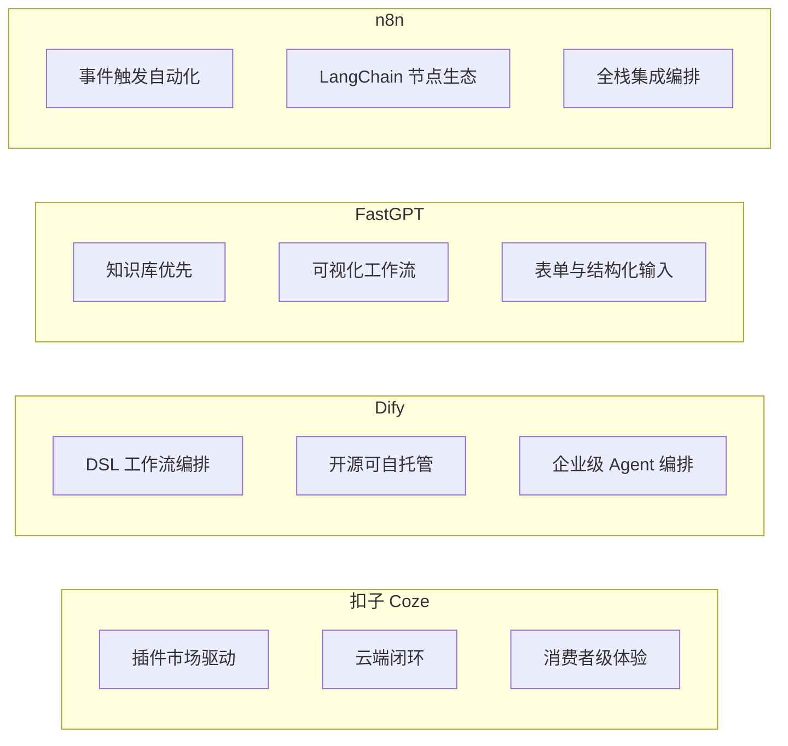
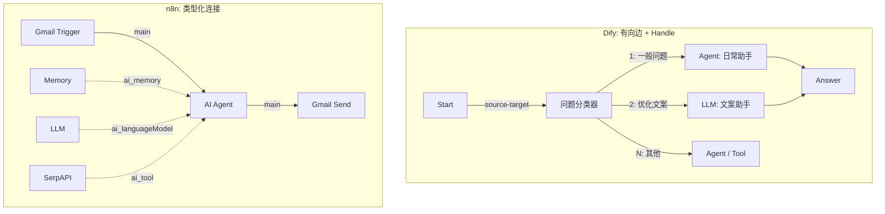
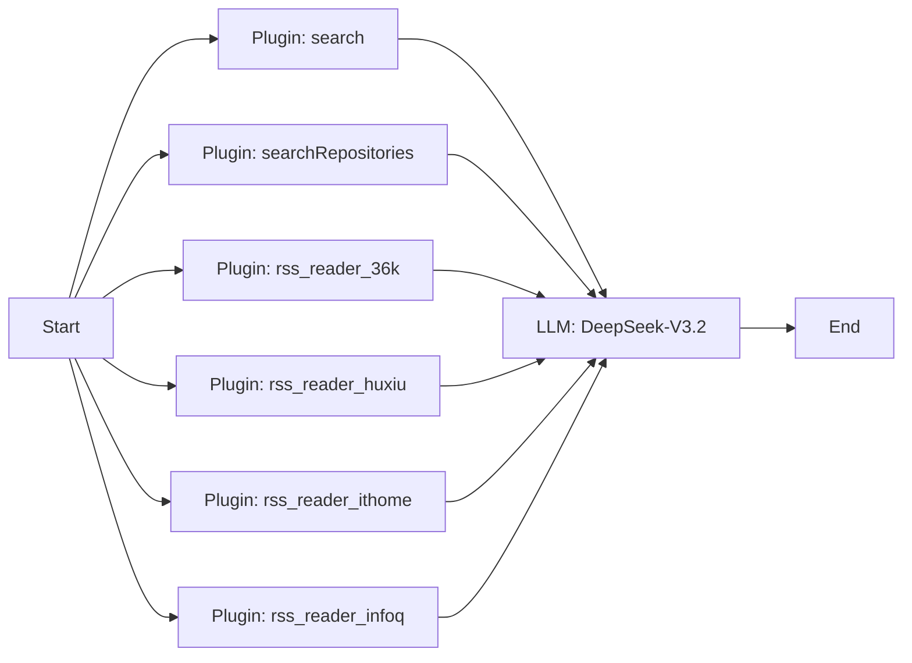
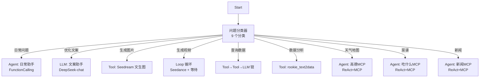
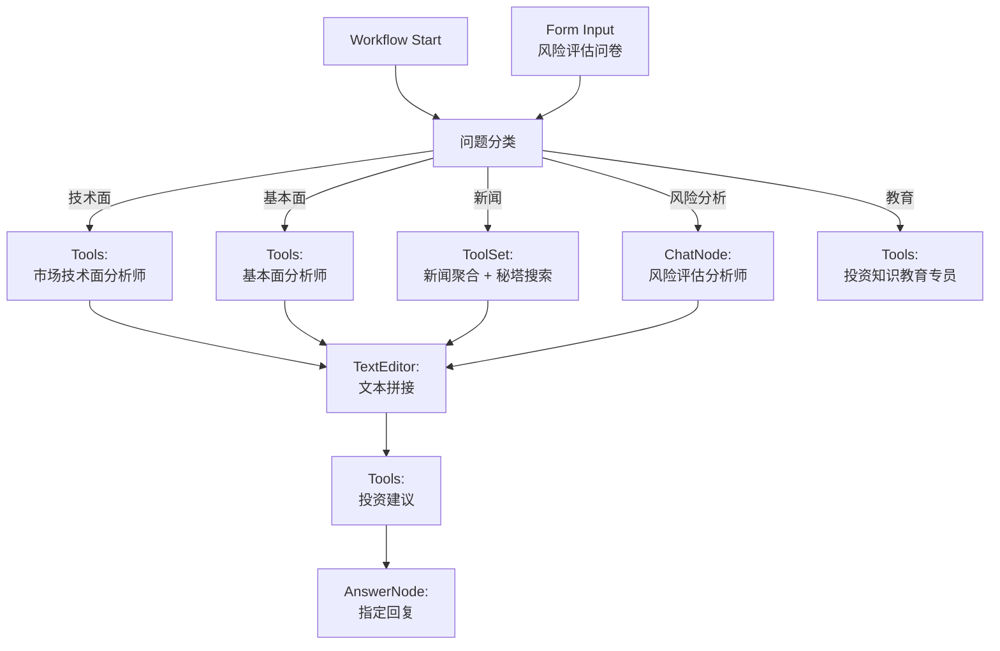
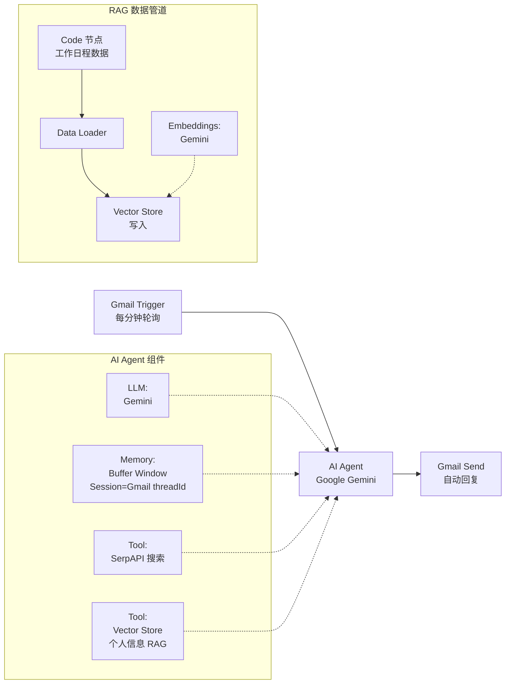

当智能体从代码走向产品，开发者面临一个核心抉择：如何在保持灵活性的同时，将编排效率最大化？本章通过四个真实案例——Coze 的 AI 新闻聚合器、Dify 的超级智能个人助手、FastGPT 的投资风险评估系统、以及 n8n 的 Gmail 自动回复智能体——拆解四款主流低代码平台的架构哲学、节点体系和集成能力，为不同场景下的技术选型提供可验证的决策依据。

## 平台定位与设计哲学

四款平台虽然都提供"拖拽式"智能体构建能力，但其底层设计假设截然不同。理解这种差异是选型的第一性原理。



**Coze（扣子）** 由字节跳动出品，定位为面向消费者的云端智能体平台。其核心优势在于丰富的**插件市场**——搜索、RSS 阅读、GitHub 仓库检索等能力均以插件形式封装，开发者通过配置参数即可接入。案例中构建的 AI 新闻聚合器使用了 6 个插件节点（搜索、GitHub 仓库搜索、36氪/虎嗅/IT之家/InfoQ RSS 阅读器），通过一个 LLM 节点（DeepSeek-V3.2）进行内容整合与格式化输出，整个工作流以 chatflow 模式运行。其导出格式为 ZIP 包，内含 `MANIFEST.yml` 元数据与 `workflow/` 目录下的 YAML 定义文件，体现了平台级的标准化封装。

Sources: [HelloAgent_cozeCase.zip](chapter5/HelloAgent_cozeCase.zip), [MANIFEST.yml](chapter5/HelloAgent_cozeCase.zip)

**Dify** 是开源的 LLM 应用开发平台，支持云端 SaaS 与私有化部署。其工作流以 YAML DSL（Domain Specific Language）定义，采用有向无环图（DAG）结构编排，案例文件长达 5069 行，涵盖 9 个问题分类分支、Function Calling 与 ReAct 两种 Agent 策略、循环（Loop）节点以及条件分支（If-Else）等高级控制结构。Dify 的核心差异化在于**问题分类器**节点——通过一个独立的 LLM 调用将用户意图分发到不同的处理分支，实现类路由器的智能分发机制。

Sources: [HelloAgent_difyCase.yml](chapter5/HelloAgent_difyCase.yml#L1-L21), [问题分类器](chapter5/HelloAgent_difyCase.yml#L459-L508)

**FastGPT** 以**知识库检索**为核心能力，案例展示了 36 个节点、34 条边构成的投资风险评估系统。其特色在于 `formInput`（表单输入）节点和 `datasetSearch`（知识库搜索）节点——前者通过结构化表单收集用户的风险偏好数据（年龄、投资经验、收入水平、亏损承受度、投资目标），后者提供 RAG 检索增强。FastGPT 还原生支持 `toolSet`（工具集）节点用于 MCP 服务集成，以及 `pluginModule`（插件模块）节点用于接入第三方搜索服务（如秘塔 AI 搜索）。

Sources: [HelloAgent_fastgptCase.json](chapter5/HelloAgent_fastgptCase.json#L124-L148), [知识库搜索节点](chapter5/HelloAgent_fastgptCase.json)

**n8n** 是一款通用工作流自动化平台，其 LangChain 集成使其能够构建 AI 智能体。与前三者本质不同——n8n 是**事件驱动**的：案例中的 Gmail Trigger 节点每分钟轮询新邮件，触发 AI Agent 节点处理后自动回复。n8n 的核心优势在于丰富的**第三方服务集成**（Gmail、Slack、数据库等 400+ 节点）和基于 LangChain 的 AI 能力组合（Memory、Vector Store、Embeddings、Tools 均作为可连接的组件）。

Sources: [HelloAgent_n8nCase.json](chapter5/HelloAgent_n8nCase.json#L1-L30), [AI Agent 节点](chapter5/HelloAgent_n8nCase.json#L208-L225)

## 节点体系与工作流范式

四种平台的节点抽象粒度和连接方式存在本质差异，这直接决定了开发者编排复杂逻辑时的表达力边界。

### 节点类型对比

| 维度 | Coze | Dify | FastGPT | n8n |
|------|------|------|---------|-----|
| **起始节点** | `start` | `start` | `workflowStart` | 触发器节点（Gmail/Cron/Webhook 等） |
| **终结节点** | `end` | `answer` | `answerNode` | Action 节点（Gmail Send/HTTP 等） |
| **LLM 节点** | `llm` | `llm` + `agent` | `chatNode` | `lmChatGoogleGemini` 等 |
| **工具节点** | `plugin` | `tool` + `agent` | `tools` + `toolSet` + `pluginModule` | `toolSerpApi` 等 |
| **分类/路由** | 无独立节点（LLM 内部处理） | `question-classifier` | `classifyQuestion` | `switch` / `if` 节点 |
| **循环结构** | 无 | `loop` / `loop-start` / `loop-end` | 无 | 无（通过 `splitInBatches` 模拟） |
| **条件分支** | 无独立节点 | `if-else` | 无独立节点 | `if` 节点 |
| **结构化输入** | 无独立节点 | `parameter-extractor` | `formInput` | 表单触发器 |
| **知识库/RAG** | 插件方式 | 内置知识库 + retriever | `datasetSearch` 节点 | `vectorStoreInMemory` + Embeddings |
| **记忆** | 对话历史参数 | 对话变量 | `userGuide` 配置 | `memoryBufferWindow` |

Dify 的节点体系最为丰富，拥有独立的问题分类器、参数提取器、循环、条件分支等控制节点，表达力最强。案例中"视频生成"分支使用了 **Loop + Parameter Extractor + If-Else + Wait** 的组合实现了轮询等待视频生成结果的异步流程：参数提取器解析生成请求 → Seedance 工具发起生成 → 条件分支判断状态 → 未完成时进入等待节点（`justwait` 插件，等待 10 秒）→ 循环回溯。

Sources: [循环结构](chapter5/HelloAgent_difyCase.yml#L3348-L3574), [等待工具](chapter5/HelloAgent_difyCase.yml#L3620-L3639)

### 连接模型差异



**Dify 和 FastGPT** 使用有向图中的 `source-target` 边连接节点，分类器通过 `sourceHandle` 标识不同分类出口（如 `'1'`、`'2'`、`'1753153701588'`），形成多分支路由。**n8n** 则采用**类型化连接**——除了 `main` 数据流连接外，还有 `ai_languageModel`、`ai_memory`、`ai_tool`、`ai_embedding`、`ai_document` 等语义化连接类型，将 AI Agent 节点的依赖关系（模型、记忆、工具、向量存储）以独立连线表达，架构更为解耦。

Sources: [Dify 边定义](chapter5/HelloAgent_difyCase.yml#L88-L125), [n8n 连接定义](chapter5/HelloAgent_n8nCase.json#L228-L338)

## Agent 策略与工具集成

### Agent 策略体系

四个案例展示了三种截然不同的 Agent 架构模式：

**Dify 的双策略体系**最为完善。案例中同时使用了两种 Agent 策略：`FunctionCalling`（由 `langgenius/agent/agent` 插件提供）和 `ReAct (Support MCP Tools)`（由 `junjiem/mcp_see_agent/mcp_see_agent` 插件提供）。日常助手、数据可视化分析使用 Function Calling 策略，内置时间工具和 AntV 可视化图表生成工具；而高德地图 MCP、吃什么 MCP、新闻 MCP 三个 Agent 则使用 ReAct + MCP 策略，通过 `mcp_servers_config` 字段配置外部 MCP 服务的 SSE 端点：

```yaml
# 高德MCP Agent 的 MCP 配置
agent_strategy_name: mcp_sse_ReAct
agent_strategy_provider_name: junjiem/mcp_see_agent/mcp_see_agent
mcp_servers_config:
  type: constant
  value: '{"amap-maps": {"type": "sse", "url": "https://mcp.api-inference.modelscope.net/..."}}'
```

Sources: [高德MCP Agent](chapter5/HelloAgent_difyCase.yml#L1893-L1904), [吃什么MCP](chapter5/HelloAgent_difyCase.yml#L2010-L2020), [新闻MCP](chapter5/HelloAgent_difyCase.yml#L2039-L2044)

**n8n 的 LangChain 组合模式**将 Agent 能力拆解为可插拔的组件。案例中的 AI Agent 节点（`@n8n/n8n-nodes-langchain.agent` v2.2）通过 4 条语义化连接挂载了语言模型（Google Gemini）、对话记忆（Buffer Window Memory，基于 Gmail `threadId` 做 Session 隔离）、搜索工具（SerpAPI）和向量检索工具（Simple Vector Store，使用 `retrieve-as-tool` 模式作为 Agent 可调用的 RAG 工具）。系统提示词通过 `options.systemMessage` 配置，运行时上下文通过模板注入当前时间、发件人和邮件正文。

Sources: [n8n AI Agent 节点](chapter5/HelloAgent_n8nCase.json#L208-L225), [Session 记忆配置](chapter5/HelloAgent_n8nCase.json#L50-L63), [向量检索工具](chapter5/HelloAgent_n8nCase.json#L170-L188)

**Coze 的插件编排**和 **FastGPT 的工具集分发**则采用更扁平的模式。Coze 将搜索、RSS 等能力封装为 `plugin` 节点，在 LLM 节点的 prompt 中通过模板变量（`{{articles}}{{articles1}}...`）注入上游插件输出。FastGPT 使用 `classifyQuestion` 节点进行问题分类，然后路由到不同的 `tools` 节点（如市场技术面分析师、基本面分析师、新闻社媒分析师），每个工具节点内置独立的功能调用逻辑，再通过 `textEditor`（文本拼接）节点聚合多路分析结果。

Sources: [Coze LLM 模板变量](chapter5/HelloAgent_cozeCase.zip), [FastGPT 节点列表](chapter5/HelloAgent_fastgptCase.json)

### MCP 与 RAG 集成能力

| 能力 | Coze | Dify | FastGPT | n8n |
|------|------|------|---------|-----|
| **MCP 协议支持** | 原生插件 | `mcp_see_agent` 插件（SSE 模式） | `toolSet` 节点（MCP 类型） | 无原生支持 |
| **向量存储** | 云端内置 | 知识库功能 | `datasetSearch` 节点 | `vectorStoreInMemory` + 自定义 |
| **Embedding 模型** | 平台内置 | 平台内置 | 平台内置 | 可选（如 Gemini Embeddings） |
| **文档加载** | 插件方式 | 知识库 API | 知识库管理 | `documentDefaultDataLoader` + Code |
| **检索作为工具** | 否 | 否 | 否 | 是（`retrieve-as-tool` 模式） |

n8n 的 RAG 实现值得特别关注——案例中使用了一个 **Code 节点**（JavaScript）硬编码个人工作日程数据，通过 Data Loader 写入内存向量存储，再将该向量存储以 `retrieve-as-tool` 模式暴露为 Agent 可调用的工具。工具描述精确指导了 Agent 的调用时机：*"这是 Simple Vector Store2 工具，用来查询我的个人信息，特别是我的工作时间和邮件回复策略。当需要判断当前是否为工作时间，或者需要告知对方我何时会回复邮件时，必须使用此工具。"* 这种将 RAG 检索能力包装为工具的范式，使得 Agent 能够自主决定何时需要查询上下文知识，而非每次请求都进行检索。

Sources: [n8n Code 节点](chapter5/HelloAgent_n8nCase.json#L156-L168), [RAG 工具描述](chapter5/HelloAgent_n8nCase.json#L170-L178)

## 四大案例架构全景

### Coze：AI 新闻聚合器



Coze 案例以 **chatflow 模式**运行，6 个插件节点并行采集数据源（网络搜索、GitHub 仓库、4 个科技媒体 RSS），汇入单个 LLM 节点完成内容筛选、分类（AI 技术新闻 / AI 学术论文 / AI 开源项目）和格式化输出。LLM 节点的系统提示词定义了资深科技媒体编辑角色，要求输出"AI 日报"格式的结构化内容，包含 10 条技术新闻、5 篇学术论文、5 个开源项目，每条配备 emoji 标识和链接。

Sources: [Coze 工作流定义](chapter5/HelloAgent_cozeCase.zip)

### Dify：超级智能个人助手



Dify 案例是最复杂的——通过问题分类器将用户输入分发到 9 个功能分支，涵盖**日常生活咨询、文案优化、AI 绘图、AI 视频、数据查询、数据分析、地图天气、菜谱推荐、新闻资讯**。各分支采用不同节点类型：Agent（Function Calling / ReAct+MCP）、LLM、Tool、以及 Loop 循环。视频生成分支是唯一使用循环节点的路径，实现了"发起生成 → 轮询状态 → 条件等待 → 返回结果"的异步流程编排。应用配置了语音转文字（speech_to_text）、文字转语音（text_to_speech）、文件上传、推荐问题等丰富的交互特性。

Sources: [Dify 应用配置](chapter5/HelloAgent_difyCase.yml#L1-L87), [问题分类器](chapter5/HelloAgent_difyCase.yml#L459-L508), [Agent 节点](chapter5/HelloAgent_difyCase.yml#L830-L842)

### FastGPT：投资风险评估系统



FastGPT 案例构建了一个**投资理财助手**，核心特色在于 `formInput` 节点——通过下拉菜单收集用户结构化信息（年龄段、投资经验、月收入、亏损承受度、投资目标），形成风险画像。系统通过 `classifyQuestion` 节点将查询路由到不同专业分析角色，最终通过文本拼接节点聚合多维度分析结果。案例中还使用了 `pluginModule`（秘塔 AI 搜索 ×5）、`toolSet`（中国股票 MCP、且慢基金 MCP、BI 图表、minimax-MCP）等丰富的集成节点，以及 `datasetSearch`（知识库搜索）实现投资知识的 RAG 检索。

Sources: [FastGPT 表单输入](chapter5/HelloAgent_fastgptCase.json#L124-L148), [FastGPT 节点清单](chapter5/HelloAgent_fastgptCase.json)

### n8n：Gmail AI 自动回复



n8n 案例是唯一的**事件驱动**架构——Gmail Trigger 节点每分钟轮询新邮件，触发 AI Agent 处理。Agent 的系统提示词注入了实时上下文（悉尼时间、发件人、主题、正文），并通过两个工具增强能力：SerpAPI 用于搜索公开信息回答邮件问题，Vector Store（`retrieve-as-tool` 模式）用于查询个人工作日程和非工作时间策略。Agent 输出通过 Gmail Send 节点自动回复，Session 基于邮件的 `threadId` 实现同一邮件线程内的上下文保持。

Sources: [n8n 完整工作流](chapter5/HelloAgent_n8nCase.json#L1-L350), [系统提示词](chapter5/HelloAgent_n8nCase.json#L209-L225)

## 导出格式与可移植性

| 维度 | Coze | Dify | FastGPT | n8n |
|------|------|------|---------|-----|
| **导出格式** | ZIP（YAML） | YML（DSL） | JSON | JSON |
| **可读性** | 高（结构化 YAML） | 中（超长 YML，5000+ 行） | 低（超长 JSON，18000+ 行） | 高（350 行，结构清晰） |
| **版本管理** | Git 友好（YAML） | Git 友好（YML） | 困难（单行 JSON） | 中等（JSON） |
| **依赖声明** | MANIFEST 元数据 | `dependencies` 字段 | 无显式声明 | `credentials` 引用 |
| **跨平台迁移** | 不可迁移 | 不可迁移 | 不可迁移 | 不可迁移 |

值得注意：四个平台的导出格式**互不兼容**。Dify 在 YML 中通过 `dependencies` 字段声明了 marketplace 插件依赖（`agimaster/justwait:0.0.2` 和 `langgenius/deepseek:0.0.5`），确保导入时自动安装所需组件。n8n 的 JSON 虽然结构最为紧凑可读，但 `credentials` 字段引用了加密存储的凭证 ID（如 `XD1oTN8hEyHzsxBR`），迁移到新实例时需重新配置。

Sources: [Dify 依赖声明](chapter5/HelloAgent_difyCase.yml#L9-L19), [n8n 凭证引用](chapter5/HelloAgent_n8nCase.json#L23-L29)

## 选型决策矩阵

| 场景特征 | 推荐平台 | 核心理由 |
|----------|----------|----------|
| **快速构建对话型智能体** | Coze | 插件市场丰富，云端零配置，chatflow 模式开箱即用 |
| **复杂多分支工作流 + 企业级部署** | Dify | 问题分类器 + 9 种节点类型 + 双 Agent 策略 + 开源自托管 |
| **知识库问答 + 结构化表单收集** | FastGPT | 原生知识库检索 + 表单输入节点 + 多工具集编排 |
| **跨系统集成 + 事件驱动自动化** | n8n | 400+ 第三方节点 + LangChain 生态 + 触发器模式 |
| **需要 MCP 协议集成** | Dify 或 FastGPT | Dify 通过 `mcp_see_agent` 支持 SSE 模式；FastGPT 原生 `toolSet` 节点 |
| **需要 RAG 检索作为 Agent 工具** | n8n | `retrieve-as-tool` 模式让 Agent 自主决定何时检索 |

从工程实践角度，一个关键洞察是：**平台的选择不应基于"功能多寡"，而应基于"编排范式与业务场景的匹配度"**。如果你的需求是"用户提问 → 智能分发 → 多专家协同"的对话模式，Dify 的问题分类器架构最为契合；如果是"事件触发 → 多系统联动 → 自动化处理"的工作流模式，n8n 的触发器 + 类型化连接模型是更自然的选择。

## 延伸阅读

理解低代码平台的智能体编排后，可以通过以下章节深入对比代码级框架的实现方式：

- [AgentScope 实战：三国狼人杀多智能体消息驱动架构](11-agentscope-shi-zhan-san-guo-lang-ren-sha-duo-zhi-neng-ti-xiao-xi-qu-dong-jia-gou) —— 消息驱动架构与低代码编排的根本差异
- [AutoGen、CAMEL 与 LangGraph 框架应用对比](12-autogen-camel-yu-langgraph-kuang-jia-ying-yong-dui-bi) —— 代码级多智能体框架的能力边界
- [SimpleAgent 构建：系统提示词、工具注册与多轮对话](13-simpleagent-gou-jian-xi-tong-ti-shi-ci-gong-ju-zhu-ce-yu-duo-lun-dui-hua) —— 从零理解智能体核心机制
- [MCP 协议：工具接入与高德地图服务集成](18-mcp-xie-yi-gong-ju-jie-ru-yu-gao-de-di-tu-fu-wu-ji-cheng) —— 深入 MCP 协议在代码中的实现