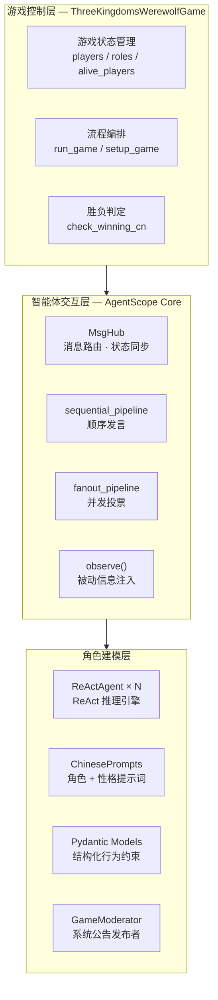
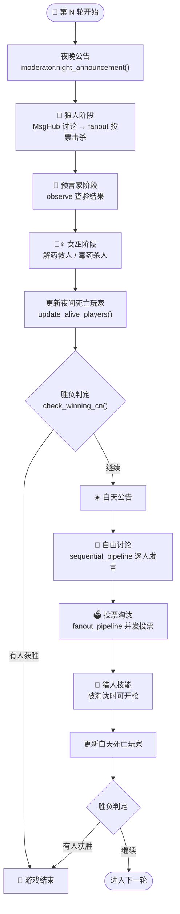
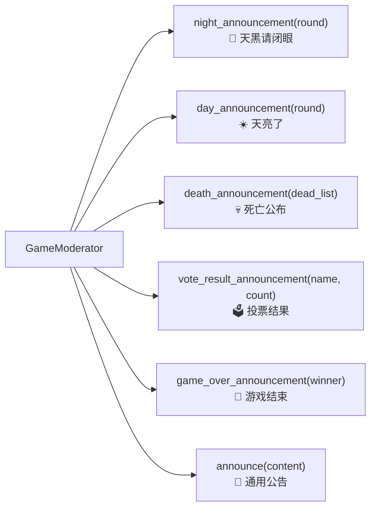

当多个 AI 智能体需要在同一个游戏中扮演不同角色、进行秘密协商、公开辩论、结构化投票时，框架的消息传递机制就成了系统的中枢神经。本文以 AgentScope 1.0 构建的三国狼人杀游戏为案例，深入剖析其消息驱动架构、结构化输出约束、并发管道编排和容错设计——这些模式在任何需要多智能体协作的场景中均可复用。

---

## 架构总览：三层分离设计

三国狼人杀采用经典的三层分层架构，自顶向下依次为**游戏控制层**、**智能体交互层**和**角色建模层**。控制层负责游戏状态与流程编排；交互层通过 AgentScope 的 `MsgHub` 实现消息路由与并发调度；角色建模层则为每个智能体注入双重身份（游戏角色 + 三国人物），并通过 Pydantic 模型约束行为输出。



整个系统由 `ThreeKingdomsWerewolfGame` 类集中管理，其 `__init__` 方法初始化了全部游戏状态，包括玩家字典、角色映射、各阵营列表以及女巫道具状态。值得注意的是，所有玩家智能体、主持人、阵营分组都以**列表/字典引用**形式持有，而非值拷贝——这意味着当 `update_alive_players` 从列表中移除某智能体时，所有引用该智能体的地方会同步生效。

Sources: [main_cn.py](chapter6/AgentScopeDemo/main_cn.py#L37-L53)

---

## 智能体创建：ReActAgent 的双重身份注入

每个玩家都是一个 `ReActAgent` 实例，通过系统提示词（`sys_prompt`）同时注入两层身份信息：**游戏角色**（狼人/预言家/女巫/猎人/村民）决定行为目标和技能边界；**三国人物**（刘备/曹操/诸葛亮等）决定说话风格和性格特征。模型选用阿里云 DashScope 的 `qwen-max`，并启用 `enable_thinking=True` 以获得更强的推理能力。

```python
agent = ReActAgent(
    name=name,
    sys_prompt=ChinesePrompts.get_role_prompt(role, character),
    model=DashScopeChatModel(
        model_name="qwen-max",
        api_key=os.environ["DASHSCOPE_API_KEY"],
        enable_thinking=True,
    ),
    formatter=DashScopeMultiAgentFormatter(),
)
```

创建完成后，系统立即通过 `agent.observe()` 向该智能体注入一条身份确认消息——这是一个关键设计：**智能体在游戏开始前就知道自己的角色和技能**，但不获取任何其他玩家的身份信息。`DashScopeMultiAgentFormatter` 的作用是为多智能体对话场景格式化消息历史，确保每个 `Msg` 带有正确的发送者标识。

三国人物的性格特征通过 `GameRoles.CHARACTER_TRAITS` 字典集中管理，每个角色对应一段行为指导文本，例如刘备"仁德宽厚，善于团结众人"，司马懿"深谋远虑，城府极深，言辞含蓄"。这些特征被嵌入到系统提示词中，引导 LLM 以特定风格发言。

Sources: [main_cn.py](chapter6/AgentScopeDemo/main_cn.py#L55-L80), [game_roles.py](chapter6/AgentScopeDemo/game_roles.py#L48-L58)

---

## 消息驱动核心：MsgHub 与 Pipeline 编排

AgentScope 的消息驱动架构通过三种核心原语实现多智能体通信模式。理解这三者的区别是掌握整个框架的关键。

| 通信原语 | 消息流向 | 典型场景 | 游戏中的应用 |
|----------|----------|----------|-------------|
| **MsgHub** | 多对多广播（可开关） | 秘密会议室 / 公开讨论 | 狼人夜间密谈、白天自由辩论 |
| **sequential_pipeline** | 链式顺序传递 | 逐人发言 | 白天讨论阶段轮流发言 |
| **fanout_pipeline** | 一对多扇出 → 多对一汇聚 | 并发收集响应 | 投票、狼人击杀选择 |
| **observe()** | 单向信息注入（不触发回复） | 被动接收情报 | 预言家查验结果告知女巫 |

### MsgHub：可编程的消息隔离房间

`MsgHub` 是 AgentScope 提供的**异步上下文管理器**，在进入时创建一个消息广播域，域内所有参与者的发言自动广播给同域其他成员，退出时关闭广播。其 `enable_auto_broadcast` 参数可以在运行时动态切换——这正是狼人杀"讨论→投票"阶段切换的核心机制。

在狼人夜间阶段，MsgHub 首先以 `enable_auto_broadcast=True` 进入讨论模式，狼人之间可以互相看到对方的发言和推理：

```python
async with MsgHub(
    self.werewolves,
    enable_auto_broadcast=True,
    announcement=await self.moderator.announce(
        f"狼人们，请讨论今晚的击杀目标。存活玩家：{format_player_list(self.alive_players)}"
    ),
) as werewolves_hub:
    # 讨论阶段：每个狼人轮流发言，自动广播给队友
    for _ in range(MAX_DISCUSSION_ROUND):
        for wolf in self.werewolves:
            await wolf(structured_model=DiscussionModelCN)
```

讨论结束后，代码通过 `werewolves_hub.set_auto_broadcast(False)` **即时关闭广播**，然后使用 `fanout_pipeline` 并发收集每个狼人的击杀投票。这一设计确保投票阶段是**秘密的**——每只狼人独立决策，无法看到队友的选择，更贴近真实狼人杀的投票体验。

Sources: [main_cn.py](chapter6/AgentScopeDemo/main_cn.py#L117-L160)

### fanout_pipeline：并发投票的扇出-汇聚

`fanout_pipeline` 实现了一对多扇出与多对一汇聚的通信模式。系统将同一条投票指令同时发送给所有存活玩家，并发等待每个玩家的结构化回复，最终将结果聚合为列表返回。`enable_gather=False` 参数表示不需要等待所有回复完成后再统一返回，而是逐个收集：

```python
vote_msgs = await fanout_pipeline(
    self.alive_players,
    await self.moderator.announce("请投票选择要淘汰的玩家"),
    structured_model=get_vote_model_cn(self.alive_players),
    enable_gather=False,
)
```

投票结果通过 `majority_vote_cn` 函数统计——该函数使用 Python 标准库 `collections.Counter` 对所有投票目标进行计数，返回得票最多的玩家及其票数。在平票情况下，`Counter.most_common(1)` 会返回字典序最小的键，这是一个简化处理。

Sources: [main_cn.py](chapter6/AgentScopeDemo/main_cn.py#L286-L309), [utils_cn.py](chapter6/AgentScopeDemo/utils_cn.py#L40-L48)

### observe()：异步信息注入

`observe()` 是 AgentScope 中一个容易被忽略但极为重要的方法。它允许智能体**被动接收一条消息并将其加入上下文历史，但不触发任何回复行为**。这在狼人杀中至关重要——预言家收到查验结果后需要记住但不需要"说话"，女巫收到死亡信息后需要决策但不希望暴露自己：

```python
# 预言家私下获知查验结果
await seer_agent.observe(await self.moderator.announce(result_msg))

# 女巫私下获知夜间死亡信息
await witch_agent.observe(await self.moderator.announce(death_info))
```

这种设计将"信息感知"与"行为决策"解耦，使得游戏主持人可以向特定角色注入私密信息而不影响公开消息流。

Sources: [main_cn.py](chapter6/AgentScopeDemo/main_cn.py#L188-L200)

---

## 游戏流程编排：昼夜循环的状态机

整个游戏以一个 `for` 循环驱动的**昼夜状态机**为核心，每轮包含夜晚（秘密行动）和白天（公开博弈）两个阶段。以下流程图展示了完整的单轮游戏流程：



游戏循环的关键设计在于**每个阶段后都检查胜利条件**。`check_winning_cn` 函数的逻辑极其简洁：狼人全灭则好人胜，狼人数 ≥ 好人数则狼人胜。这一判定在夜间死亡公告后和白天投票后各执行一次，确保任何一方达到条件时立即终止游戏。

`MAX_GAME_ROUND` 设为 10 轮上限，`MAX_DISCUSSION_ROUND` 设为 3 轮狼人密谈，这些常量集中定义在 `utils_cn.py` 中，便于全局调整。

Sources: [main_cn.py](chapter6/AgentScopeDemo/main_cn.py#L311-L365), [utils_cn.py](chapter6/AgentScopeDemo/utils_cn.py#L12-L13)

---

## 结构化输出：Pydantic 模型约束智能体行为

AgentScope 的 `structured_model` 参数允许为每次智能体调用指定一个 Pydantic BaseModel，框架会强制 LLM 的输出符合该模型的字段约束。这是将游戏规则转化为**可执行代码约束**的核心机制。

### 六类结构化输出模型

| 模型类 | 使用阶段 | 关键字段 | 设计意图 |
|--------|----------|----------|----------|
| `DiscussionModelCN` | 狼人讨论 | `reach_agreement`, `confidence_level`, `key_evidence` | 结构化记录推理过程 |
| `WerewolfKillModelCN` | 狼人击杀 | `target`, `kill_strategy`, `team_coordination` | 约束击杀目标为字符串 |
| `SeerModelCN` (动态) | 预言家查验 | `target` (Literal 枚举), `check_reason` | 将可选目标限制为存活玩家 |
| `WitchActionModelCN` | 女巫行动 | `use_antidote`, `use_poison`, `target_name` | 布尔开关控制道具使用 |
| `VoteModelCN` (动态) | 白天投票 | `vote` (Literal 枚举), `reason`, `suspicion_level` | 投票目标限定为存活玩家 |
| `HunterModelCN` (动态) | 猎人技能 | `shoot`, `target` (Optional Literal), `shoot_reason` | 开枪与否的双层决策 |

### 动态 Literal 枚举：运行时类型生成

最精妙的设计是**运行时动态生成 Pydantic 模型**的工厂函数。以投票模型为例：

```python
def get_vote_model_cn(agents: list[AgentBase]) -> type[BaseModel]:
    class VoteModelCN(BaseModel):
        vote: Literal[tuple(_.name for _ in agents)] = Field(
            description="你要投票淘汰的玩家姓名",
        )
        reason: str = Field(description="投票理由")
        suspicion_level: int = Field(ge=1, le=10, description="怀疑程度")
    return VoteModelCN
```

`Literal[tuple(_.name for _ in agents)]` 这一行是整个结构化约束的精髓：它将**当前存活玩家的姓名列表**编译为类型注解中的枚举值。这意味着 LLM 被物理性地禁止投票给已死亡的玩家或不存在的名字——约束在类型系统层面生效，而非依赖提示词的软性引导。

`get_seer_model_cn` 和 `get_hunter_model_cn` 采用了相同的动态生成模式，分别约束预言家的查验目标和猎人的开枪目标。

Sources: [structured_output_cn.py](chapter6/AgentScopeDemo/structured_output_cn.py#L24-L41), [structured_output_cn.py](chapter6/AgentScopeDemo/structured_output_cn.py#L65-L103)

---

## GameModerator：系统级消息广播者

`GameModerator` 继承自 `AgentBase`，但它不参与游戏博弈，而是作为**系统消息的权威发布者**存在。其核心方法 `announce()` 创建带 `role="system"` 标记的 `Msg` 对象，并维护一个 `game_log` 列表记录所有公告：

```python
class GameModerator(AgentBase):
    async def announce(self, content: str) -> Msg:
        msg = Msg(name=self.name, content=f"📢 {content}", role="system")
        self.game_log.append(content)
        await self.print(msg)
        return msg
```

主持人提供了六个语义化的公告方法，覆盖游戏全生命周期：



所有公告方法最终都委托给 `announce()`，这保证了**消息格式的一致性和可追溯性**。`Msg` 对象的 `role="system"` 标记让 LLM 在处理历史对话时能区分系统指令与玩家发言。

Sources: [utils_cn.py](chapter6/AgentScopeDemo/utils_cn.py#L97-L143)

---

## 容错机制：防御式编程的深度实践

LLM 的输出本质上具有不确定性——模型可能返回格式错误的 JSON、不存在的玩家名、甚至空响应。本案例在每个结构化输出消费点都部署了**三重防御层**，确保单个智能体的异常不会中断整个游戏流程。

以投票统计为例，代码对每个 `vote_msg` 执行完整的有效性验证链：

```python
if vote_msg is not None and hasattr(vote_msg, 'metadata') and vote_msg.metadata is not None:
    votes[self.alive_players[i].name] = vote_msg.metadata.get("vote")
else:
    print(f"⚠️ {self.alive_players[i].name} 的投票无效,视为弃票")
    votes[self.alive_players[i].name] = None
```

三个检查点分别是：**返回对象非空**、**对象具有 metadata 属性**、**metadata 非空**。只有全部通过才提取投票结果，否则降级为弃票（`None`）。`majority_vote_cn` 中 `Counter` 对 `None` 的处理自然兼容——`None` 会被计为一类投票，但不影响真实玩家得票的排序。

狼人击杀阶段的容错更为激进——当投票无效时，系统会**自动随机选择一个合法目标**：

```python
valid_targets = [p.name for p in self.alive_players 
                 if p.name not in [w.name for w in self.werewolves]]
votes[self.werewolves[i].name] = random.choice(valid_targets) if valid_targets else None
```

这种设计确保了游戏进程不会因为模型输出异常而卡死。整个 `run_game` 方法被 `try-except` 包裹，任何未捕获的异常都会打印完整堆栈而非静默崩溃。

Sources: [main_cn.py](chapter6/AgentScopeDemo/main_cn.py#L148-L160), [main_cn.py](chapter6/AgentScopeDemo/main_cn.py#L296-L304), [main_cn.py](chapter6/AgentScopeDemo/main_cn.py#L362-L365)

---

## 角色配置系统：可扩展的阵营架构

`GameRoles` 类以类变量字典形式集中管理所有角色定义，每个角色包含四个维度的描述：`description`（角色名）、`ability`（技能描述）、`win_condition`（胜利条件）、`team`（所属阵营）。`get_standard_setup` 方法根据玩家数量返回预设的角色配置：

| 玩家数 | 狼人 | 预言家 | 女巫 | 猎人 | 守护者 | 村民 |
|--------|------|--------|------|------|--------|------|
| 6 人 | 2 | 1 | 1 | — | — | 2 |
| 8 人 | 3 | 1 | 1 | 1 | — | 2 |
| 9 人 | 3 | 1 | 1 | 1 | 1 | 2 |
| 其他 | N//3 | 1 | 1 | 1 | — | 剩余 |

当玩家数不匹配预设配置时，系统按"约 1/3 狼人 + 固定神职 + 剩余村民"的公式动态生成，保证游戏平衡性。

三国人物池从刘备、关羽、张飞、诸葛亮、赵云、曹操、司马懿、周瑜、孙权九人中随机抽取，通过 `random.sample` 确保无重复。每个人物的性格特征定义在 `CHARACTER_TRAITS` 中，为 LLM 提供风格锚点——例如让"张飞"扮演狼人时倾向于冲动暴露，让"司马懿"扮演狼人时更善于隐藏。

Sources: [game_roles.py](chapter6/AgentScopeDemo/game_roles.py#L86-L114), [main_cn.py](chapter6/AgentScopeDemo/main_cn.py#L82-L115)

---

## 环境配置与运行

运行本案例需要 AgentScope 1.0+ 和阿里云 DashScope API。`requirements.txt` 仅声明了 `agentscope==1.0.2`，其余依赖（`dashscope`、`pydantic`）作为传递依赖自动安装。

```bash
# 安装依赖
pip install agentscope==1.0.2

# 配置 API Key
export DASHSCOPE_API_KEY="your-api-key-here"

# 运行游戏
python chapter6/AgentScopeDemo/main_cn.py
```

`main()` 函数在启动时检查环境变量是否存在，缺失时直接打印提示并返回，避免在无 API Key 的情况下触发运行时异常。

Sources: [requirements.txt](chapter6/AgentScopeDemo/requirements.txt#L1), [main_cn.py](chapter6/AgentScopeDemo/main_cn.py#L368-L384)

---

## 架构启示与后续阅读

三国狼人杀案例完整展示了 AgentScope 在多智能体协作中的五大核心能力：**消息隔离**（MsgHub 创建临时通信域）、**并发编排**（fanout/sequential pipeline）、**行为约束**（Pydantic 结构化输出）、**状态管理**（阵营列表的引用语义）和**容错降级**（三重防御 + 随机回退）。这些模式并非狼人杀专属——任何需要"秘密协商→公开博弈→结构化决策"的多智能体场景（如谈判、辩论、董事会投票）都可以直接复用这一架构骨架。

若想继续深入多智能体框架的横向对比，推荐阅读：

- [AutoGen、CAMEL 与 LangGraph 框架应用对比](12-autogen-camel-yu-langgraph-kuang-jia-ying-yong-dui-bi) — 对比不同框架在角色扮演、任务分解和对话编排上的设计哲学差异
- [低代码平台对比：Coze、Dify、FastGPT 与 n8n](10-di-dai-ma-ping-tai-dui-bi-coze-dify-fastgpt-yu-n8n) — 无代码视角下的多智能体编排能力评估
- [SimpleAgent 构建：系统提示词、工具注册与多轮对话](13-simpleagent-gou-jian-xi-tong-ti-shi-ci-gong-ju-zhu-ce-yu-duo-lun-dui-hua) — 从单智能体出发理解 ReActAgent 的推理-行动循环基础