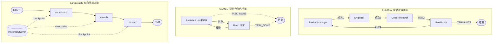
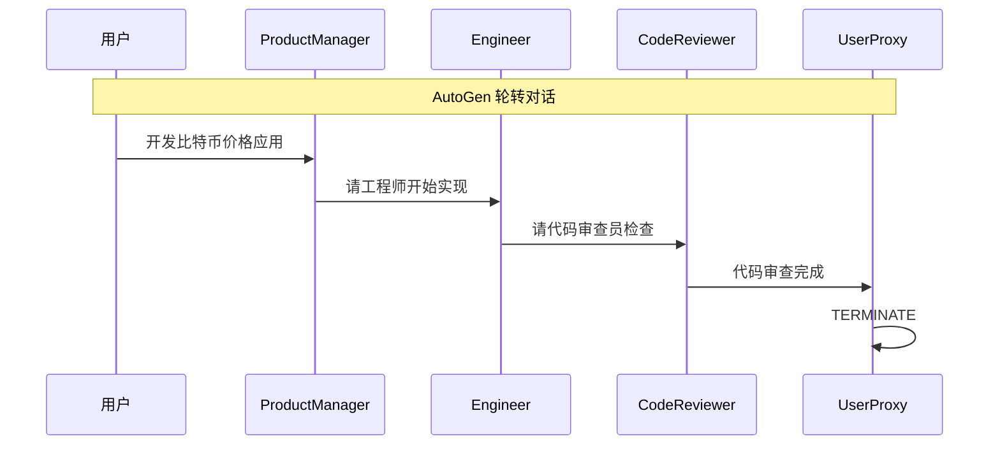
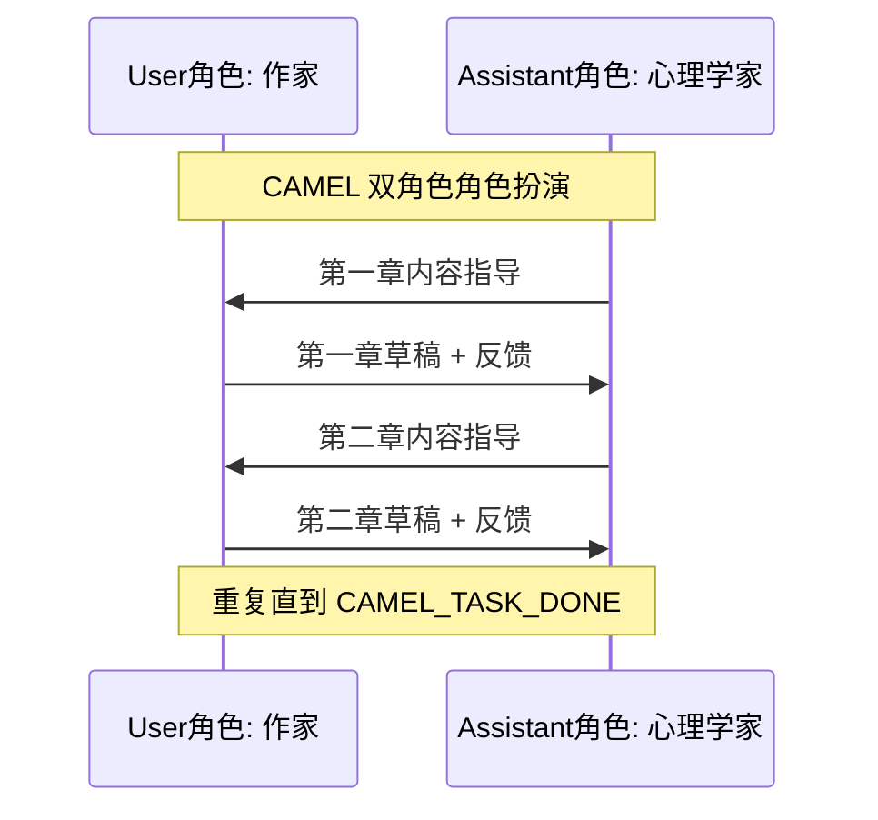
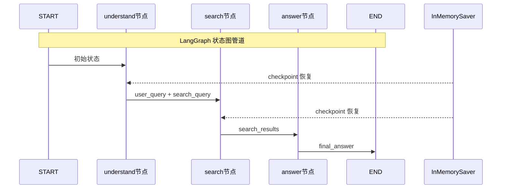

在多智能体系统开发领域，**AutoGen**、**CAMEL** 和 **LangGraph** 代表了三种截然不同的架构哲学：基于角色对话的团队协作、基于角色扮演的双智能体指令跟随、以及基于有向图的状态机工作流。本页通过 chapter6 中的三个完整实战案例——软件开发团队协作、数字图书创作、智能搜索助手——深入剖析各框架的核心抽象、通信机制、状态管理和适用场景，帮助你在面对具体项目时做出精准的技术选型。

---

## 一、三框架架构定位：从会话范式到计算范式

在深入代码之前，我们需要先理解这三个框架在设计哲学上的根本分歧。下图概括了它们各自的架构拓扑：



三者的核心差异可以浓缩为一句话：**AutoGen 是"开会让专家轮流发言"，CAMEL 是"师徒配对反复打磨"，LangGraph 是"流水线加工带状态检查点"**。这种差异决定了它们在代码组织方式、控制流粒度和扩展模型上的截然不同。

Sources: [autogen_software_team.py](chapter6/AutoGenDemo/autogen_software_team.py#L136-L145), [DigitalBookWriting.py](chapter6/Camel/DigitalBookWriting.py#L36-L61), [Dialogue_System.py](chapter6/Langgraph/Dialogue_System.py#L176-L194)

---

## 二、AutoGen：角色分工与轮转对话

### 2.1 核心抽象

AutoGen 的设计围绕三个关键概念展开：**AssistantAgent**（具备 LLM 推理能力的角色智能体）、**UserProxyAgent**（代表人类用户的代理）和 **Team**（协调多个智能体协作的团队容器）。在 chapter6 的案例中，通过定义四个角色各异的 AssistantAgent 模拟了一个完整的软件开发团队。

模型客户端通过工厂函数创建，实现 LLM 配置与智能体逻辑的解耦。每个智能体拥有独立的 `system_message`，精确定义其职责边界和输出格式——产品经理负责需求分析，工程师负责代码实现，审查员负责质量把关，用户代理负责验收反馈。这种"角色即系统提示词"的模式让角色定义高度声明式且可复用。

Sources: [autogen_software_team.py](chapter6/AutoGenDemo/autogen_software_team.py#L20-L26), [autogen_software_team.py](chapter6/AutoGenDemo/autogen_software_team.py#L28-L101)

### 2.2 通信机制：轮转对话

AutoGen 的核心通信模式是 `RoundRobinGroupChat`——一种**严格顺序的轮转调度器**。参与者按列表顺序依次发言，每一轮由当前智能体接收前序所有消息的上下文后生成响应。终止条件通过 `TextMentionTermination` 实现：当任何智能体输出中包含 `TERMINATE` 关键字时，对话循环立即终止。

```python
# 关键配置：轮转调度 + 终止条件
team_chat = RoundRobinGroupChat(
    participants=[product_manager, engineer, code_reviewer, user_proxy],
    termination_condition=TextMentionTermination("TERMINATE"),
    max_turns=20,
)
```

这种调度方式的优势在于**可预测性和结构化**：每一轮谁发言、发言顺序固定，便于调试和监控。但其局限性也显而易见——缺乏动态路由能力，无法根据对话内容智能选择下一个发言者。任务执行通过 `Console(team_chat.run_stream(task=task))` 以异步流式方式启动，输出实时可见。

Sources: [autogen_software_team.py](chapter6/AutoGenDemo/autogen_software_team.py#L136-L167)

### 2.3 实战输出：协作生成的可运行应用

案例的最终产物是一个完整的 Streamlit 比特币价格应用（`output.py`），展示了团队协作的实际产出质量：产品经理进行需求分解、工程师调用 CoinGecko API 实现数据获取与 UI 构建、审查员检验代码健壮性，最终用户代理验证并触发终止。这个"从需求到交付"的闭环演示了 AutoGen 在**自动化软件开发场景**中的实际价值。

Sources: [output.py](chapter6/AutoGenDemo/output.py#L1-L39)

---

## 三、CAMEL：角色扮演与指令跟随

### 3.1 核心抽象

CAMEL（Communicative Agents for "Mind" Exploration of Large Language Model Societies）提出了一个独特的架构：**Inception Prompting（启发性提示）**。整个框架的核心 API 极度精简，仅需一个 `RolePlaying` 对象即可启动完整的双智能体协作。案例中通过"心理学家"（assistant 角色）和"作家"（user 角色）的配对，演示了数字图书创作任务。

模型创建通过 `ModelFactory.create()` 工厂方法完成，支持 `ModelPlatformType.QWEN` 等多种平台类型。值得注意的是，CAMEL 的配置参数最少——仅需角色名、任务提示和模型实例三个参数即可初始化完整的协作会话。

Sources: [DigitalBookWriting.py](chapter6/Camel/DigitalBookWriting.py#L15-L41)

### 3.2 通信机制：步步推进

CAMEL 的协作模式是一对一的双向对话循环。每一轮通过 `role_play_session.step(input_msg)` 同时返回 `assistant_response` 和 `user_response`——assistant 角色提供专业指导，user 角色根据指导推进任务执行。这种设计模拟了"导师-执行者"的协作关系。

```python
while n < chat_turn_limit:
    n += 1
    assistant_response, user_response = role_play_session.step(input_msg)
    # 检查任务完成标志
    if "CAMEL_TASK_DONE" in user_response.msg.content:
        break
    input_msg = assistant_response.msg
```

终止条件由 user 角色自行判断——当任务完成时输出 `CAMEL_TASK_DONE` 字符串。`chat_turn_limit` 参数（设为 30）提供了硬性保护，防止无限循环。CAMEL 的依赖也最为轻量：整个项目仅需 `camel-ai==0.2.75` 一个包。

Sources: [DigitalBookWriting.py](chapter6/Camel/DigitalBookWriting.py#L46-L63), [requirements.txt](chapter6/Camel/requirements.txt#L1)

### 3.3 设计特点：极简但聚焦

CAMEL 的代码量是三者中最少的（仅 63 行），但这并非功能不足，而是设计哲学的体现——它聚焦于**双智能体角色扮演这一特定协作范式**，将其做到极致简洁。通过 `print_text_animated` 提供动画式输出体验，整个交互过程极具沉浸感。适用场景明确：需要两个角色反复迭代的创作类任务（如剧本编写、故事创作、学术探讨）。

Sources: [DigitalBookWriting.py](chapter6/Camel/DigitalBookWriting.py#L1-L7), [DigitalBookWriting.py](chapter6/Camel/DigitalBookWriting.py#L33-L34)

---

## 四、LangGraph：状态图与工作流引擎

### 4.1 核心抽象：TypedDict 状态定义

LangGraph 的架构范式与前面两者截然不同。它将多智能体问题转化为**有向图计算问题**：每个节点是一个处理函数，每条边定义控制流转移，而所有节点共享一个通过 `TypedDict` 定义的**全局状态对象**。

```python
class SearchState(TypedDict):
    messages: Annotated[list, add_messages]  # 消息历史，自动追加
    user_query: str        # 用户查询
    search_query: str      # 优化后的搜索关键词
    search_results: str    # Tavily 搜索结果
    final_answer: str      # 最终答案
    step: str              # 当前步骤标记
```

其中 `messages` 字段使用 `Annotated[list, add_messages]` 标注，这意味着 LangGraph 的 reducer 机制会自动对返回的消息列表进行追加合并而非覆盖——这是实现多轮对话记忆的关键设计。

Sources: [Dialogue_System.py](chapter6/Langgraph/Dialogue_System.py#L23-L30), [Dialogue_System.py](chapter6/Langgraph/Dialogue_System.py#L13)

### 4.2 节点函数：纯函数式处理

每个节点是一个接收状态、返回状态增量的纯函数。三个节点构成"理解→搜索→回答"的线性管道：

| 节点 | 职责 | 关键操作 | 状态更新 |
|------|------|----------|----------|
| `understand_query_node` | 解析用户意图，提取搜索关键词 | LLM 推理 + 文本切分 | `user_query`, `search_query`, `step` |
| `tavily_search_node` | 调用 Tavily API 真实搜索 | HTTP 请求 + 结果格式化 | `search_results`, `step` |
| `generate_answer_node` | 基于搜索结果生成最终回答 | 条件分支（搜索成功/失败） | `final_answer`, `step` |

第三个节点 `generate_answer_node` 内部包含**条件分支逻辑**：当 `state["step"] == "search_failed"` 时走 fallback 路径（基于 LLM 内置知识回答），否则正常整合搜索结果。这种节点内部的决策能力弥补了线性边的局限。

Sources: [Dialogue_System.py](chapter6/Langgraph/Dialogue_System.py#L42-L78), [Dialogue_System.py](chapter6/Langgraph/Dialogue_System.py#L80-L130), [Dialogue_System.py](chapter6/Langgraph/Dialogue_System.py#L132-L173)

### 4.3 图的构建与编译

LangGraph 的工作流构建采用显式声明式 API：先添加节点，再连接边，最后编译。编译时注入 `InMemorySaver` 检查点器，为图执行提供状态持久化能力。

```python
def create_search_assistant():
    workflow = StateGraph(SearchState)
    workflow.add_node("understand", understand_query_node)
    workflow.add_node("search", tavily_search_node)
    workflow.add_node("answer", generate_answer_node)
    
    workflow.add_edge(START, "understand")
    workflow.add_edge("understand", "search")
    workflow.add_edge("search", "answer")
    workflow.add_edge("answer", END)
    
    memory = InMemorySaver()
    app = workflow.compile(checkpointer=memory)
    return app
```

`InMemorySaver` 检查点器的价值在于：每次会话通过 `thread_id` 标识，支持跨会话的状态恢复。这在案例的主循环中通过 `config = {"configurable": {"thread_id": f"search-session-{session_count}"}}` 配置实现，每个用户查询获得独立的检查点追踪。

Sources: [Dialogue_System.py](chapter6/Langgraph/Dialogue_System.py#L176-L194), [Dialogue_System.py](chapter6/Langgraph/Dialogue_System.py#L224)

### 4.4 流式执行与实时输出

LangGraph 通过 `app.astream()` 提供异步流式执行，每个节点完成后立即推送输出，无需等待整个管道完成。主循环中通过遍历 `output.items()` 区分不同阶段的输出，实现了"理解阶段→搜索阶段→回答阶段"的分步实时展示。

Sources: [Dialogue_System.py](chapter6/Langgraph/Dialogue_System.py#L240-L251)

---

## 五、多维对比分析

### 5.1 架构维度对比

| 维度 | AutoGen | CAMEL | LangGraph |
|------|---------|-------|-----------|
| **核心范式** | 多角色轮转对话 | 双角色角色扮演 | 有向状态图 |
| **调度模型** | RoundRobin（顺序轮转） | 双向 step 循环 | 图边遍历（支持条件路由） |
| **状态管理** | 隐式（消息历史上下文） | 隐式（会话内消息传递） | 显式（TypedDict 全局状态） |
| **智能体数量** | 灵活（2~N 个） | 固定 2 个（assistant + user） | 灵活（节点即智能体） |
| **终止条件** | `TextMentionTermination` + `max_turns` | `CAMEL_TASK_DONE` + `chat_turn_limit` | 到达 END 节点 |
| **检查点/持久化** | 不直接支持 | 不直接支持 | `InMemorySaver` 内置支持 |
| **异步执行** | ✅ `run_stream` + `Console` | ❌ 同步 `step` 循环 | ✅ `astream` |
| **流式输出** | ✅ Console 实时显示 | ✅ `print_text_animated` | ✅ `astream` 分阶段推送 |
| **依赖复杂度** | 中（autogen-agentchat + autogen-ext） | 低（camel-ai 单包） | 中（langgraph + langchain_openai + tavily） |
| **外部工具集成** | 通过 model_client 间接集成 | 框架内部封装 | 直接在节点函数中调用任意 API |

### 5.2 编程模型对比

| 特征 | AutoGen | CAMEL | LangGraph |
|------|---------|-------|-----------|
| **角色定义方式** | `system_message` 字符串 | `assistant_role_name` + `user_role_name` | 节点函数的文档与实现 |
| **任务传递** | `task` 参数注入对话 | `task_prompt` 注入初始化 | `initial_state` 注入图执行 |
| **控制流可见性** | 低（黑盒调度） | 低（黑盒 step） | 高（显式边声明） |
| **可调试性** | 中（Console 输出） | 低（动画输出不便于调试） | 高（每节点状态可观测） |
| **代码行数（案例）** | ~194 行 | ~63 行 | ~259 行 |
| **扩展模式** | 添加新 Agent + 加入 Team | 更换角色对 + 调整 prompt | 添加节点 + 连接边 + 条件路由 |

### 5.3 通信模式可视化







Sources: [autogen_software_team.py](chapter6/AutoGenDemo/autogen_software_team.py#L136-L167), [DigitalBookWriting.py](chapter6/Camel/DigitalBookWriting.py#L49-L61), [Dialogue_System.py](chapter6/Langgraph/Dialogue_System.py#L185-L188)

---

## 六、技术选型决策矩阵

面对实际项目时，如何在这三个框架中做出选择？以下基于本教程案例的实证分析，提供决策参考：

| 场景特征 | 推荐框架 | 理由 |
|----------|----------|------|
| **多角色协作开发**（如代码生成、审查流水线） | AutoGen | 角色分工天然适配，RoundRobin 调度保证有序协作 |
| **双角色创作迭代**（如写作、剧本、学术探讨） | CAMEL | 极简 API，"导师-执行者"模式自然适配创作场景 |
| **多步数据处理管道**（如搜索→分析→回答） | LangGraph | 显式状态管理 + 条件路由，每个步骤可观测可调试 |
| **需要状态持久化和恢复** | LangGraph | 唯一内置 `checkpointer` 的框架 |
| **需要复杂条件分支控制流** | LangGraph | `add_conditional_edges` 支持动态路由 |
| **快速原型验证** | CAMEL | 63 行代码即可启动完整协作，最低认知负担 |
| **生产级系统** | LangGraph / AutoGen | 均支持异步流式执行和错误处理，可观测性更好 |
| **工具密集型任务**（大量 API 调用） | LangGraph | 节点函数中可直接集成任意工具调用，灵活度最高 |

Sources: [autogen_software_team.py](chapter6/AutoGenDemo/autogen_software_team.py#L116-L172), [DigitalBookWriting.py](chapter6/Camel/DigitalBookWriting.py#L36-L63), [Dialogue_System.py](chapter6/Langgraph/Dialogue_System.py#L176-L194)

---

## 七、环境配置与依赖管理

三个框架的环境配置策略体现了各自的生态定位：

**AutoGen** 采用模块化依赖策略，核心包 `autogen-agentchat` 负责对话编排，`autogen-ext[openai]` 扩展提供 OpenAI 模型客户端。环境变量通过 `LLM_MODEL_ID`、`LLM_API_KEY`、`LLM_BASE_URL` 三个标准变量配置，兼容 OpenAI API 格式的任意 LLM 服务端。

**CAMEL** 极度精简——整个项目仅需 `camel-ai==0.2.75` 单包依赖。模型创建通过 `ModelFactory.create()` 统一工厂方法，通过 `ModelPlatformType` 枚举支持 Qwen、OpenAI 等多平台。

**LangGraph** 采用分层依赖：`langgraph` 提供图引擎，`langchain_openai` 提供 LLM 集成，`tavily-python` 提供搜索 API。此外需要额外配置 `TAVILY_API_KEY` 环境变量。

Sources: [requirements.txt](chapter6/AutoGenDemo/requirements.txt#L1-L10), [requirements.txt](chapter6/Camel/requirements.txt#L1), [requirements.txt](chapter6/Langgraph/requirements.txt#L1-L4), [autogen_software_team.py](chapter6/AutoGenDemo/autogen_software_team.py#L20-L26), [DigitalBookWriting.py](chapter6/Camel/DigitalBookWriting.py#L15-L20), [Dialogue_System.py](chapter6/Langgraph/Dialogue_System.py#L31-L40)

---

## 八、总结：从范式理解到工程实践

三个框架的对比最终归结为**会话范式**与**计算范式**之间的选择。AutoGen 和 CAMEL 都属于会话范式——智能体的协作通过自然语言对话展开，框架的核心职责是编排"谁在什么时候对谁说什么"。其中 AutoGen 偏向多角色团队协作（N 方对话），CAMEL 聚焦双角色深度互动（1v1 对话）。LangGraph 则属于计算范式——将复杂任务分解为状态图中的确定性计算节点，每一步都有明确的输入、输出和状态转移，协作不再是"对话"而是"数据流"。

从工程成熟度角度看，LangGraph 提供了最完善的生产级特性：显式状态管理、检查点持久化、条件路由和流式输出，使其成为构建生产级 Agent 系统的首选。AutoGen 的角色化团队模型在"模拟人类协作流程"的场景中具有独特优势。CAMEL 的极简设计则是快速验证想法的理想工具——当你不确定是否需要多智能体时，用 63 行代码跑通一个原型是最低成本的试错方式。

---

## 延伸阅读

- **低代码平台方案**：如果你更关注快速落地而非框架级控制，可以对比 [低代码平台对比：Coze、Dify、FastGPT 与 n8n](10-di-dai-ma-ping-tai-dui-bi-coze-dify-fastgpt-yu-n8n)
- **消息驱动架构**：AgentScope 提供了另一种多智能体通信范式，详见 [AgentScope 实战：三国狼人杀多智能体消息驱动架构](11-agentscope-shi-zhan-san-guo-lang-ren-sha-duo-zhi-neng-ti-xiao-xi-qu-dong-jia-gou)
- **自研框架探索**：了解如何从零构建自己的 Agent 框架，推荐 [SimpleAgent 构建：系统提示词、工具注册与多轮对话](13-simpleagent-gou-jian-xi-tong-ti-shi-ci-gong-ju-zhu-ce-yu-duo-lun-dui-hua)