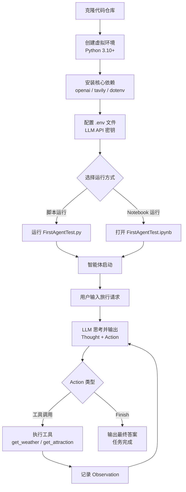
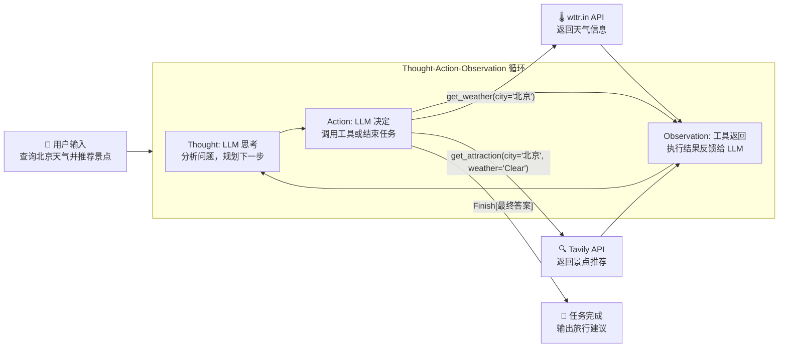

本页将带你从零开始完成环境搭建、API 密钥配置，并运行项目中第一个真正的智能体——一个具备工具调用能力的旅行助手。你将理解智能体的核心运作机制：**思考（Thought）→ 行动（Action）→ 观察（Observation）** 循环。

## 系统要求与先决条件

Hello Agents 教程体系覆盖从基础理论到全栈应用开发的完整路径，不同章节对环境的要求逐层递进。入门阶段只需一台标准开发机器即可开始。

| 要求项 | 最低版本 | 说明 |
|--------|---------|------|
| Python | **3.10+** | 所有 `.env.example` 文件均明确标注此要求 |
| pip | 最新版 | 包管理工具 |
| 网络 | 可访问 LLM API | 需要一个兼容 OpenAI 接口的 API 端点 |
| 操作系统 | macOS / Linux / Windows | 推荐 macOS 或 Linux |

后续章节可能需要额外环境：Chapter 3（大语言模型基础）需要 GPU 和 PyTorch；Chapter 11（模型训练）需要多 GPU 和 DeepSpeed；Chapter 8-9（记忆与上下文）可选配置 Qdrant 和 Neo4j 数据库。但作为快速上手阶段，以上基础配置已经足够。

Sources: [chapter7/.env.example](chapter7/.env.example#L1-L6), [chapter1/FirstAgentTest.ipynb](chapter1/FirstAgentTest.ipynb#L646-L663)

## 核心架构概览

在动手之前，先理解项目的整体结构和你的学习路径。下图展示了从环境配置到第一个智能体运行的完整流程：



整个流程的核心是一个 **Thought-Action-Observation 循环**：智能体每次调用大语言模型获取下一步指令，解析出要执行的动作，调用对应的工具函数，将工具返回的结果作为"观察"反馈给模型，如此反复直到模型决定给出最终答案。

Sources: [chapter1/FirstAgentTest.py](chapter1/FirstAgentTest.py#L162-L209), [chapter1/FirstAgentTest.ipynb](chapter1/FirstAgentTest.ipynb#L406-L465)

## 第一步：获取代码并安装依赖

### 1.1 克隆仓库

```bash
git clone <仓库地址>
cd hello-agents/code
```

项目按章节组织目录，每个 `chapterN` 文件夹对应一个主题：

```
code/
├── chapter1/      # 第一个智能体（旅行助手）
├── chapter2/      # ELIZA 对话系统（纯 Python，零依赖）
├── chapter3/      # LLM 基础（分词、Transformer、Qwen 本地模型）
├── chapter4/      # 推理范式（ReAct / Plan-and-Solve / Reflection）
├── chapter6/      # 多智能体框架（AgentScope / AutoGen / CAMEL / LangGraph）
├── chapter7/      # HelloAgents 框架核心
├── chapter8/      # 记忆系统与 RAG
├── chapter9/      # 上下文工程
├── chapter10/     # Agent 通信协议（MCP / A2A / ANP）
├── chapter11/     # 模型训练与微调（SFT / GRPO）
├── chapter12/     # 评估与优化（BFCL / GAIA）
└── chapter13-15/  # 全栈应用案例
```

### 1.2 创建虚拟环境

```bash
# 创建虚拟环境（推荐使用 conda 或 venv）
python -m venv hello_agents_env

# 激活虚拟环境
# macOS / Linux:
source hello_agents_env/bin/activate
# Windows:
hello_agents_env\Scripts\activate
```

### 1.3 安装核心依赖

第一个智能体（chapter1）所需的核心依赖包如下表所示：

| 依赖包 | 用途 | 安装命令 |
|--------|------|---------|
| `openai` | 调用兼容 OpenAI 接口的 LLM 服务 | `pip install openai` |
| `tavily-python` | Tavily 搜索 API（景点推荐工具） | `pip install tavily-python` |
| `python-dotenv` | 从 `.env` 文件加载环境变量 | `pip install python-dotenv` |
| `requests` | HTTP 请求（天气查询工具） | `pip install requests` |

一键安装：

```bash
pip install openai tavily-python python-dotenv requests
```

> **提示**：如果你只想运行 Chapter 2 的 ELIZA 对话系统，则不需要安装任何第三方包——它仅使用 Python 标准库（`re` 和 `random`）。这是一个绝佳的零配置起点。详见 [从 ELIZA 到现代智能体：对话系统演进史](3-cong-eliza-dao-xian-dai-zhi-neng-ti-dui-hua-xi-tong-yan-jin-shi)。

Sources: [chapter1/FirstAgentTest.py](chapter1/FirstAgentTest.py#L27-L62), [chapter1/FirstAgentTest.py](chapter1/FirstAgentTest.py#L111-L119), [chapter2/ELIZA.py](chapter2/ELIZA.py#L1-L2)

## 第二步：配置 API 密钥

### 2.1 你需要哪些密钥

第一个智能体涉及两个外部 API：一个用于大语言模型推理，一个用于网络搜索。项目的 `.env.example` 文件提供了标准化的配置模板。

| 密钥名称 | 必需性 | 用途 | 获取方式 |
|----------|--------|------|---------|
| `LLM_API_KEY` | **必需** | LLM 推理服务认证 | 取决于你的 LLM 提供商 |
| `LLM_BASE_URL` | **必需** | LLM 服务端点地址 | 提供商文档 |
| `LLM_MODEL_ID` | **必需** | 模型标识符 | 提供商文档 |
| `TAVILY_API_KEY` | 推荐 | 景点搜索工具 | https://tavily.com/ |
| `SERPAPI_API_KEY` | 备选 | SerpApi 搜索（Chapter 4+） | https://serpapi.com/ |

### 2.2 创建 .env 文件

项目中所有章节使用统一的 `.env` 配置格式。以 Chapter 7 的模板为例：

```bash
# 模型名称
LLM_MODEL_ID=your-model-name

# API密钥
LLM_API_KEY=your-api-key-here

# 服务地址
LLM_BASE_URL=your-api-base-url

# 超时时间（可选，默认60秒）
LLM_TIMEOUT=60
```

> **注意**：Chapter 1 的 `FirstAgentTest.py` 脚本版中使用了硬编码占位符（`API_KEY = "YOUR_API_KEY"`），而 `FirstAgentTest.ipynb` 笔记本版则使用了更规范的 `dotenv` 加载方式。推荐使用 Notebook 版本并配合 `.env` 文件，这也是后续所有章节的标准做法。

Sources: [chapter7/.env.example](chapter7/.env.example#L7-L32), [chapter1/FirstAgentTest.py](chapter1/FirstAgentTest.py#L143-L154), [chapter1/FirstAgentTest.ipynb](chapter1/FirstAgentTest.ipynb#L14-L31), [chapter4/.env copy](chapter4/.env%20copy#L1-L4)

### 2.3 兼容的 LLM 服务提供商

Hello Agents 框架采用 OpenAI 兼容接口设计，支持任何符合该规范的 LLM 服务。以下是几种常见配置示例：

| 提供商 | `LLM_BASE_URL` | `LLM_MODEL_ID` 示例 | 说明 |
|--------|----------------|---------------------|------|
| OpenAI | `https://api.openai.com/v1` | `gpt-4o` | 官方服务 |
| 阿里云百炼 | `https://dashscope.aliyuncs.com/compatible-mode/v1` | `qwen-plus` | 国内访问稳定 |
| ModelScope | `https://api-inference.modelscope.cn/v1/` | `Qwen/Qwen2.5-72B-Instruct` | 开源模型平台 |
| 本地部署 | `http://localhost:11434/v1` | `qwen2.5:7b` | Ollama / vLLM |

Chapter 7 中的 `MyLLM` 类展示了如何通过 `provider` 参数自动适配不同服务商，框架会根据环境变量自动识别 LLM 提供商。

Sources: [chapter7/my_llm.py](chapter7/my_llm.py#L7-L41), [chapter4/llm_client.py](chapter4/llm_client.py#L9-L26)

## 第三步：运行第一个智能体

### 3.1 理解智能体的工作原理

在运行代码之前，先理解这个旅行助手的核心设计。智能体接收用户的旅行请求后，进入一个最多 5 次迭代的循环：



智能体拥有两个工具：`get_weather` 通过 wttr.in 免费天气 API 查询实时天气，`get_attraction` 通过 Tavily 搜索 API 获取景点推荐。工具的返回值作为 Observation 追加到对话历史中，供下一轮 LLM 推理使用。

Sources: [chapter1/FirstAgentTest.py](chapter1/FirstAgentTest.py#L29-L109), [chapter1/FirstAgentTest.ipynb](chapter1/FirstAgentTest.ipynb#L309-L388)

### 3.2 方式一：运行 Python 脚本

```bash
cd chapter1
python FirstAgentTest.py
```

脚本版使用硬编码配置，你需要先将文件中的占位符替换为真实值：

```python
# 第 145-148 行的配置区域
API_KEY = "YOUR_API_KEY"        # 替换为你的 LLM API Key
BASE_URL = "YOUR_BASE_URL"      # 替换为你的 LLM 服务地址
MODEL_ID = "YOUR_MODEL_ID"      # 替换为模型名称
os.environ['TAVILY_API_KEY'] = "YOUR_TAVILY_API_KEY"  # 替换为 Tavily Key
```

### 3.3 方式二：运行 Jupyter Notebook（推荐）

Notebook 版本提供了更好的交互体验和可视化输出，且使用 `.env` 文件管理密钥：

```bash
cd chapter1

# 确保已安装 jupyter
pip install jupyter

# 启动 Notebook
jupyter notebook FirstAgentTest.ipynb
```

Notebook 中第一段代码会通过 `load_dotenv()` 加载环境变量，确保你的 `.env` 文件位于 `chapter1/` 目录下：

```python
# 加载环境变量
load_dotenv()

# 配置API密钥
API_KEY = os.getenv("API_KEY")
BASE_URL = os.getenv("BASE_URL")
MODEL_ID = os.getenv("MODEL_ID")
TAVILY_API_KEY = os.getenv("TAVILY_API_KEY")
```

> **注意**：Notebook 中的环境变量名为 `API_KEY`、`BASE_URL`、`MODEL_ID`（无 `LLM_` 前缀），而后续章节的统一格式使用 `LLM_API_KEY`、`LLM_BASE_URL`、`LLM_MODEL_ID`。如果你计划使用统一的 `.env` 文件，请注意这一差异。

Sources: [chapter1/FirstAgentTest.ipynb](chapter1/FirstAgentTest.ipynb#L14-L31), [chapter1/FirstAgentTest.py](chapter1/FirstAgentTest.py#L143-L154)

### 3.4 预期输出

当配置正确并运行后，你将看到类似以下的多轮对话输出。以下是一次真实运行的完整记录：

```
🚀 开始测试北京天气+景点推荐示例
👤 用户输入: 你好，请帮我查询一下今天北京的天气，然后根据天气推荐一个合适的旅游景点。
==================================================

🔄 循环 1/5
正在调用大语言模型...
大语言模型响应成功。
🤖 模型输出:
Thought: 我将先查询今天北京的实时天气，然后根据天气选择合适的景点并给出推荐。
Action: get_weather(city="北京")
🛠️  调用工具: get_weather({'city': '北京'})
📊 观察结果: 北京当前天气：Clear，气温-1摄氏度
==================================================

🔄 循环 2/5
正在调用大语言模型...
大语言模型响应成功。
🤖 模型输出:
Thought: 现在北京天气为晴朗且气温-1°C，适合观光但需保暖。
Action: get_attraction(city="北京", weather="Clear")
🛠️  调用工具: get_attraction({'city': '北京', 'weather': 'Clear'})
📊 观察结果: In clear weather, Beijing's top attractions include...
==================================================

🔄 循环 3/5
...
Action: Finish[今天北京的天气是晴（Clear），气温约-1°C。推荐的景点是颐和园...]
🎉 任务完成!
📋 最终答案: 今天北京的天气是晴（Clear），气温约-1°C。推荐的景点是颐和园...
```

整个过程中，智能体经历了三轮循环：第一轮调用天气工具获取实时数据，第二轮根据天气调用搜索工具获取景点推荐，第三轮整合信息并输出最终答案。

Sources: [chapter1/FirstAgentTest.ipynb](chapter1/FirstAgentTest.ipynb#L406-L465)

## 第四步：理解智能体的代码结构

第一个智能体虽然简洁，但已经包含了智能体系统的所有核心要素。下表将代码各部分与概念对应：

| 代码模块 | 行数范围 | 核心概念 | 说明 |
|----------|---------|----------|------|
| 系统提示词 | L1-L23 | **Prompt Engineering** | 定义智能体角色、可用工具和输出格式规范 |
| `get_weather()` | L29-L57 | **工具函数** | 通过 wttr.in API 获取真实天气数据 |
| `get_attraction()` | L64-L102 | **工具函数** | 通过 Tavily API 搜索景点推荐 |
| `available_tools` | L106-L109 | **工具注册表** | 字典映射工具名到函数引用 |
| `OpenAICompatibleClient` | L113-L139 | **LLM 客户端** | 封装 OpenAI 兼容接口的调用逻辑 |
| 主循环 | L162-L209 | **Thought-Action 循环** | 核心推理引擎：调用 LLM → 解析 Action → 执行工具 → 记录观察 |

其中主循环是整个智能体的心脏。它使用正则表达式从 LLM 的文本输出中提取 `Action` 指令，判断是工具调用还是任务完成（`Finish`），执行对应的操作，并将观察结果追加到对话历史中。

```python
# 主循环核心逻辑（简化版）
for i in range(5):  # 最多循环 5 次
    full_prompt = "\n".join(prompt_history)
    llm_output = llm.generate(full_prompt, system_prompt=AGENT_SYSTEM_PROMPT)
    
    # 解析 Action
    action_match = re.search(r"Action: (.*)", llm_output)
    action_str = action_match.group(1).strip()
    
    if action_str.startswith("Finish"):
        final_answer = re.match(r"Finish\[(.*)\]", action_str).group(1)
        print(f"任务完成：{final_answer}")
        break
    
    # 执行工具调用
    tool_name = re.search(r"(\w+)\(", action_str).group(1)
    kwargs = dict(re.findall(r'(\w+)="([^"]*)"', args_str))
    observation = available_tools[tool_name](**kwargs)
    prompt_history.append(f"Observation: {observation}")
```

Sources: [chapter1/FirstAgentTest.py](chapter1/FirstAgentTest.py#L1-L209)

## 常见问题排查

| 问题 | 原因 | 解决方案 |
|------|------|---------|
| `AuthenticationError` | API Key 无效或未配置 | 检查 `.env` 文件中的 `LLM_API_KEY` 是否正确 |
| `ConnectionError` | LLM 服务地址不可达 | 确认 `LLM_BASE_URL` 正确，检查网络连接 |
| `KeyError: 'current_condition'` | 城市名称不被 wttr.in 识别 | 使用英文城市名或拼音（如 `beijing` 而非 `北京`） |
| `TAVILY_API_KEY` 未配置错误 | 未设置 Tavily 密钥 | 访问 https://tavily.com/ 注册免费 Key |
| 模型不遵循 Thought-Action 格式 | 模型能力不足 | 使用更强的模型（如 `gpt-4o`、`qwen-plus`） |
| 中文输出乱码 | 终端编码问题 | 设置 `PYTHONIOENCODING=utf-8` |

## 下一步学习路径

成功运行第一个智能体后，你可以按照以下路径深入探索：

**1. 体验最简对话系统** — 运行 Chapter 2 的 ELIZA，理解规则匹配对话的原理，无需任何外部 API：
```bash
cd chapter2 && python ELIZA.py
```
详见 [从 ELIZA 到现代智能体：对话系统演进史](3-cong-eliza-dao-xian-dai-zhi-neng-ti-dui-hua-xi-tong-yan-jin-shi)。

**2. 封装 LLM 客户端** — 学习 Chapter 4 中如何使用 `HelloAgentsLLM` 类实现流式响应、统一的 `.env` 配置和错误处理。详见 [LLM 客户端封装：OpenAI 兼容接口与流式响应](6-llm-ke-hu-duan-feng-zhuang-openai-jian-rong-jie-kou-yu-liu-shi-xiang-ying)。

**3. 掌握推理范式** — 深入 ReAct、Plan-and-Solve 和 Reflection 三种推理模式。详见 [ReAct 模式：思考-行动-观察循环的实现与解析](7-react-mo-shi-si-kao-xing-dong-guan-cha-xun-huan-de-shi-xian-yu-jie-xi)。

**4. 使用 HelloAgents 框架** — 从 Chapter 7 开始，安装 `hello-agents` 包体验完整的框架能力：
```bash
pip install hello-agents
```
详见 [SimpleAgent 构建：系统提示词、工具注册与多轮对话](13-simpleagent-gou-jian-xi-tong-ti-shi-ci-gong-ju-zhu-ce-yu-duo-lun-dui-hua)。

**5. 全栈实战** — 参考项目总览了解 16 个章节的完整学习地图。详见 [项目总览：Hello Agents 智能体开发教程体系](1-xiang-mu-zong-lan-hello-agents-zhi-neng-ti-kai-fa-jiao-cheng-ti-xi)。