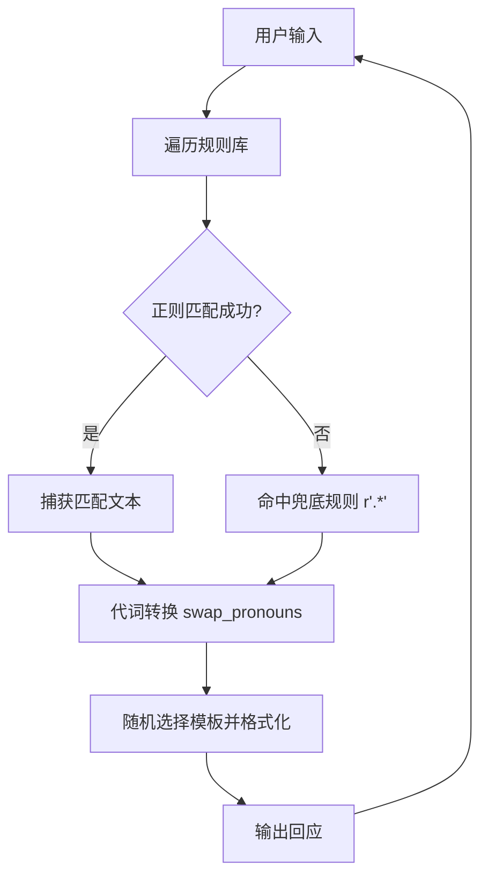
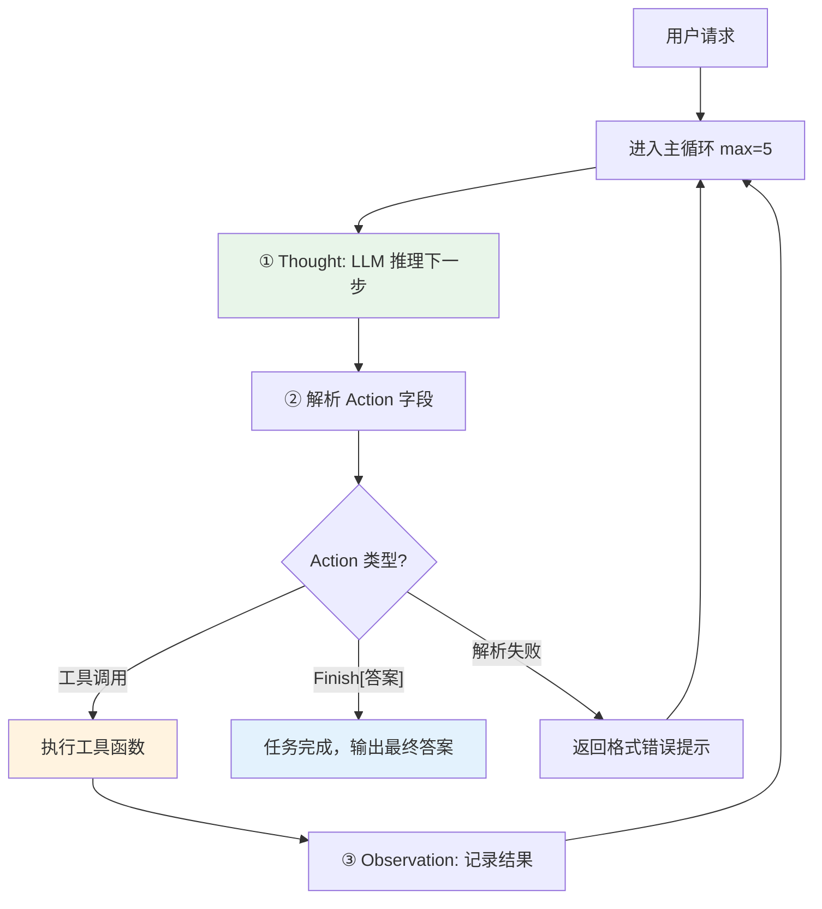
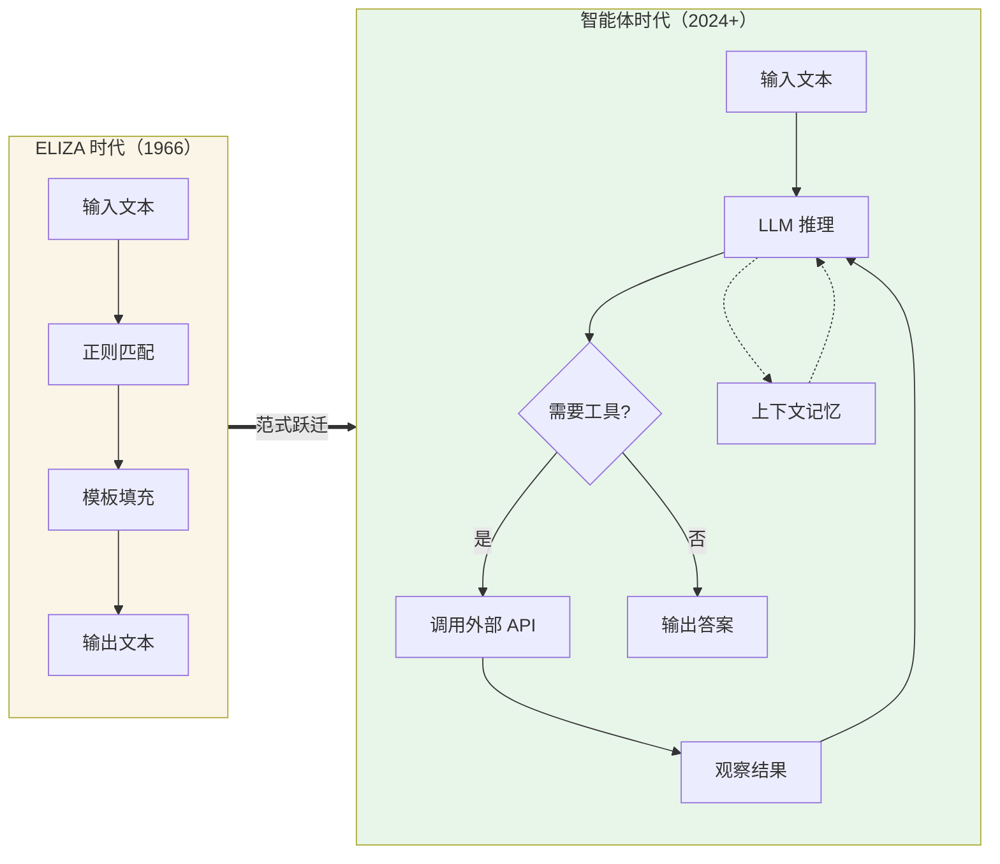

对话系统的历史，是一部从"规则驱动"到"智能涌现"的演进史。本章以本仓库中的两个标志性代码为锚点——1966 年的 ELIZA 模式匹配聊天机器人，以及 2020 年代的 ReAct 智能体——带你在代码层面理解对话系统的两大范式跃迁。这不是泛泛而谈的历史课，而是**通过真实源码对比，让你亲手触摸每一代技术的代码脉搏**。

## 一、一切的开端：ELIZA——基于正则匹配的心理治疗师

1966 年，MIT 的 Joseph Weizenbaum 用仅 200 行左右的代码，创造了一个让人类产生"被理解"错觉的聊天程序 ELIZA。它的核心机制极其朴素：**用正则表达式匹配用户输入的模式，再从预设模板中随机选取一句回应**。本仓库 `chapter2/ELIZA.py` 就是这一经典机制的 Python 复刻版。

### 1.1 规则库：模式到回应的映射

ELIZA 的全部"智能"都凝结在一个字典中——**键是正则表达式模式，值是对应的回应模板列表**。当用户输入命中某个模式时，捕获到的文本片段会被填入模板中的占位符 `{0}`，形成一个看似有针对性的回复。

```python
rules = {
    r'I need (.*)': [
        "Why do you need {0}?",
        "Would it really help you to get {0}?",
        "Are you sure you need {0}?"
    ],
    r'.* mother .*': [
        "Tell me more about your mother.",
        "What was your relationship with your mother like?",
    ],
    # ... 更多规则 ...
    r'.*': [
        "Please tell me more.",
        "Can you elaborate on that?"
    ]
}
```

这段代码体现了 ELIZA 的设计哲学：**不需要真正理解语言，只需要让用户觉得你在倾听**。当你说"I need a friend"时，它捕获" a friend"并反问"Are you sure you need a friend?"——这种反射式对话在心理咨询语境中出奇地有效。值得注意的是最后的通配规则 `r'.*'` 作为兜底：当没有任何特定规则匹配时，程序不会沉默，而是给出引导性的泛问，保持了对话的流畅感。

Sources: [ELIZA.py](chapter2/ELIZA.py#L5-L41)

### 1.2 代词转换：制造"理解"的幻觉

ELIZA 最巧妙的细节是**人称代词的自动转换**。用户说"my"，ELIZA 回复时切换为"your"；用户说"I am"，ELIZA 对应"you are"。这一简单的映射表，让机器的回应看起来像是经过了对用户语句的真正"消化"。

```python
pronoun_swap = {
    "i": "you", "you": "i", "me": "you", "my": "your",
    "am": "are", "are": "am", ...
}
```

代词转换函数 `swap_pronouns` 将用户输入中的捕获片段逐词替换后，再填入回应模板。这是**自然语言处理中最早的"文本改写"技术雏形**——虽然它完全没有语法分析能力，仅靠词级替换工作。

Sources: [ELIZA.py](chapter2/ELIZA.py#L44-L57)

### 1.3 匹配-响应循环：ELIZA 的运行时架构

ELIZA 的运行时极其简单，核心是 `respond` 函数：**遍历规则库，找到第一个匹配的正则模式，捕获内容、转换代词、格式化模板，返回结果**。主循环读取用户输入、调用 `respond`、打印回应，直到用户输入退出指令。整个系统没有状态、没有记忆、没有推理——每次回应都是独立的模式匹配。



这个循环的美感和局限同样鲜明：美感在于**代码极简、逻辑透明**，你可以一眼看穿每一条回应的由来；局限在于它**永远不会学习、不会推理、不会做任何超出规则库范围的事情**。

Sources: [ELIZA.py](chapter2/ELIZA.py#L59-L85)

## 二、范式跃迁：从模式匹配到智能体

ELIZA 之后的数十年里，对话系统经历了基于规则的专家系统、统计机器翻译、序列到序列模型等多次浪潮，但真正的质变发生在 **大语言模型（LLM）与工具调用结合**的那一刻。本仓库的 `chapter1/FirstAgentTest.py` 正是这一新时代的入门示例——一个具备思考能力、能调用外部工具、能在多步循环中解决复杂问题的旅行助手智能体。

### 2.1 核心差异：规则库 vs 推理引擎

下表从代码层面对比 ELIZA 与现代智能体在关键维度上的根本区别：

| 维度 | ELIZA（chapter2） | 现代智能体（chapter1） |
|---|---|---|
| **智能来源** | 预定义的正则规则库 | 大语言模型的推理能力 |
| **回应生成** | 模板填充 + 随机选择 | LLM 逐 token 生成 |
| **外部能力** | 无 | 调用真实 API（天气查询、网络搜索） |
| **状态管理** | 无状态，每次独立 | 维护 `prompt_history`，累积上下文 |
| **任务复杂度** | 单轮回应 | 多轮 Thought-Action-Observation 循环 |
| **可扩展性** | 需手动添加每条规则 | 声明工具，LLM 自主决定调用策略 |
| **代码量** | ~85 行 | ~209 行（但处理的问题复杂度呈指数级提升） |

### 2.2 系统提示词：定义智能体的"人格与协议"

ELIZA 的行为完全由 `rules` 字典决定，而现代智能体的行为由**系统提示词（System Prompt）**定义。在 `chapter1/FirstAgentTest.py` 中，`AGENT_SYSTEM_PROMPT` 告诉 LLM 三件事：你的角色（智能旅行助手）、你可以用什么工具（`get_weather` 和 `get_attraction`）、你必须如何输出（严格遵循 `Thought: ... Action: ...` 格式）。

```python
AGENT_SYSTEM_PROMPT = """
你是一个智能旅行助手。你的任务是分析用户的请求，并使用可用工具一步步地解决问题。

# 可用工具:
- `get_weather(city: str)`: 查询指定城市的实时天气。
- `get_attraction(city: str, weather: str)`: 根据城市和天气搜索推荐的旅游景点。

# 输出格式要求:
Thought: [你的思考过程和下一步计划]
Action: [你要执行的具体行动]
...
"""
```

这就是 **Prompt Engineering 的起点**：我们不再是编写处理语言的代码，而是用自然语言来"编程"一个智能体。系统提示词相当于智能体的操作系统——它定义了行为边界和交互协议。

Sources: [FirstAgentTest.py](chapter1/FirstAgentTest.py#L1-L24)

### 2.3 工具注册：赋予智能体"双手"

ELIZA 只能"说"，不能"做"。现代智能体的革命性在于**它可以调用真实世界的工具**。`chapter1` 中的旅行助手注册了两个工具函数，并将它们放入一个字典供主循环按名称调用：

```python
available_tools = {
    "get_weather": get_weather,
    "get_attraction": get_attraction,
}
```

`get_weather` 函数通过 HTTP 请求调用真实的天气 API（wttr.in），`get_attraction` 则通过 Tavily Search API 执行网络搜索。这意味着智能体不再是封闭的文本生成器，而是**能够获取实时信息、执行真实操作的开放系统**。

Sources: [FirstAgentTest.py](chapter1/FirstAgentTest.py#L29-L109)

### 2.4 ReAct 循环：思考-行动-观察

现代智能体的灵魂是 **ReAct（Reasoning + Acting）循环**。ELIZA 的运行时是"单次匹配即返回"，而智能体的运行时是一个**多轮迭代循环**，在每一轮中执行三个步骤：



这个循环的精妙之处在于：**LLM 每次只做一步决策**，将复杂的"查天气+推荐景点"任务自然分解为先调用 `get_weather`、观察结果、再调用 `get_attraction`、观察结果、最终用 `Finish[...]` 收尾。在 `chapter1/FirstAgentTest.ipynb` 的实际运行输出中，我们可以清楚看到这个三步循环执行了三次：

- **循环 1**：Thought → `get_weather(city="北京")` → Observation: "北京当前天气：Clear，气温-1摄氏度"
- **循环 2**：Thought → `get_attraction(city="北京", weather="Clear")` → Observation: 景点搜索结果
- **循环 3**：Thought → `Finish[今天北京的天气是晴...]` → 任务完成

这就是**从 ELIZA 的单轮反射到智能体的多轮规划**的根本跨越。ELIZA 不可能分解任务，因为它没有"思考下一步"的能力；而 LLM 驱动的智能体天然具备这种推理-决策能力。

Sources: [FirstAgentTest.py](chapter1/FirstAgentTest.py#L162-L209), [FirstAgentTest.ipynb](chapter1/FirstAgentTest.ipynb#L406-L465)

### 2.5 上下文累积：对话记忆的雏形

ELIZA 是无状态的——每次回应都从头开始，不记得你上一句说了什么。现代智能体通过 `prompt_history` 列表**累积完整的对话轨迹**，将历史思考、工具调用和观察结果都拼入下一次 LLM 调用的上下文中。

```python
prompt_history = [f"用户请求: {user_prompt}"]

# 每一轮循环中：
prompt_history.append(llm_output)           # 记录 Thought + Action
prompt_history.append(f"Observation: {observation}")  # 记录观察结果

# 下一轮：
full_prompt = "\n".join(prompt_history)      # 拼接历史
```

这种朴素的"全量拼接"方式虽然简单，但揭示了智能体记忆系统的核心思想：**上下文即记忆**。后续章节中更成熟的记忆系统（工作记忆、长期记忆、RAG 等）都是在这个基础上的精细化演进。

Sources: [FirstAgentTest.py](chapter1/FirstAgentTest.py#L156-L179)

## 三、架构演进全景图

将 ELIZA 和现代智能体放在一起，我们可以清晰地看到对话系统的三层架构演进：



这一演进的核心驱动力可以概括为一个等式：**现代智能体 = 大语言模型 + 工具调用 + 迭代循环**。ELIZA 拥有循环但没有推理；规则系统拥有推理但没有理解；LLM 拥有理解但最初没有行动力——只有当这三者结合，真正的"智能体"才诞生。

## 四、延伸阅读

理解了 ELIZA 到智能体的演进脉络后，你可以沿着以下路径深入本教程的后续内容：

- **深入 ReAct 模式**：本文中的旅行助手已经展示了 ReAct 的雏形，要了解完整的推理-行动-观察模式，请阅读 [ReAct 模式：思考-行动-观察循环的实现与解析](7-react-mo-shi-si-kao-xing-dong-guan-cha-xun-huan-de-shi-xian-yu-jie-xi)。
- **理解 LLM 的底层原理**：智能体依赖的大语言模型究竟是如何工作的？从 [分词与词嵌入](4-fen-ci-yu-ci-qian-ru-bpe-n-gram-yu-word-embedding-yuan-li) 和 [Transformer 实现](5-cong-ling-shi-xian-transformer-duo-tou-zhu-yi-li-wei-zhi-bian-ma-yu-bian-jie-ma-qi) 开始建立底层认知。
- **构建更完整的智能体**：当工具更多、记忆更复杂时，如何系统性地组织代码？[SimpleAgent 构建](13-simpleagent-gou-jian-xi-tong-ti-shi-ci-gong-ju-zhu-ce-yu-duo-lun-dui-hua) 和 [工具系统设计](14-gong-ju-xi-tong-she-ji-ji-suan-qi-gong-ju-sou-suo-gong-ju-yu-gong-ju-zhi-xing-qi) 将带你进入工程化实践。

ELIZA 的 85 行代码证明了"对话体验"不一定需要真正的智能——巧妙的模式设计足以创造令人信服的交互。而现代智能体的 209 行代码则证明了另一种可能：**当推理能力与行动能力结合，机器不再只是模仿对话，而是真正地解决问题**。从模板填充到工具调用，从无状态到有记忆，这段演进史不仅是技术的进步，更是人类对"什么是对话"这一概念本身的理解深化。