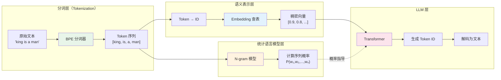
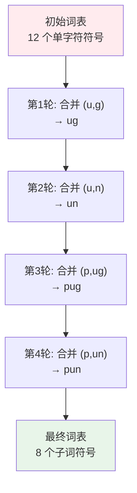
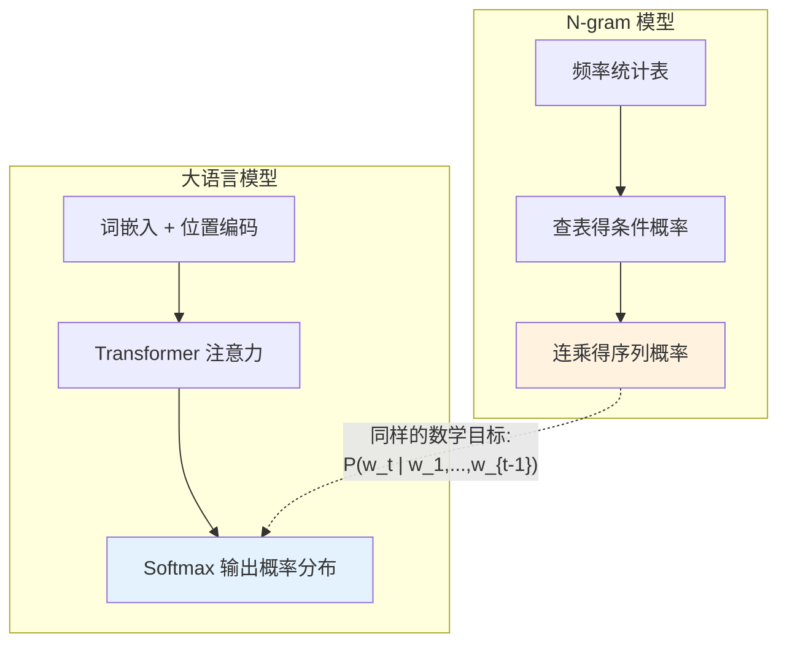
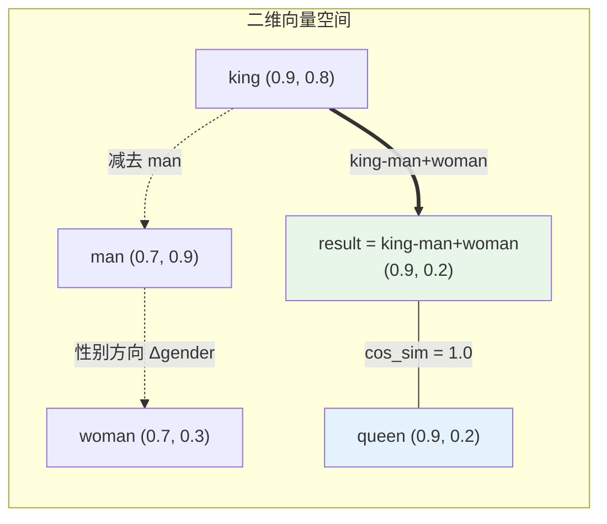

大语言模型不读文字——它读的是数字。从人类可读的自然语言文本，到模型可处理的稠密向量表示，中间横亘着一条精心设计的处理管线：**分词（Tokenization）将文本切成原子单元，词嵌入（Embedding）将原子单元映射为语义向量，语言模型在此基础上建模序列概率**。本章以 `chapter3/` 中的四个源文件为锚点，带你在代码层面拆解这条管线的每一环——从 BPE 子词合并算法，到 N-gram 统计语言模型，再到 Word Embedding 的向量空间语义运算，最后用 Qwen 模型串联整个流程。

## 一、全景视角：文本到向量的处理管线

在深入每个组件之前，先理解它们之间的协作关系。以下流程图展示了从原始文本到 LLM 输出的完整数据流：



本仓库的四个文件恰好覆盖了这条管线的不同位置：`BPE.py` 处在分词层，`N_gram.py` 处在统计建模层，`Word_Embedding.py` 处在语义表示层，`Qwen.py` 则展示了工业级 LLM 如何整合这些组件。下面的章节逐层拆解。

## 二、BPE 分词：从字符到子词的贪心合并

### 2.1 核心问题：为什么不能直接按词切分？

早期 NLP 采用空格分词（whitespace tokenization），但这面临三个根本困境：**词表爆炸**（每个唯一词都需要一个独立 ID）、**OOV 问题**（未见过的词无法处理）、**形态学冗余**（"run"、"running"、"runs"被当作三个无关词）。**Byte Pair Encoding（BPE）**通过子词单元优雅地解决了这些问题——常见词保持完整，罕见词被拆解为可复用的子词片段。

### 2.2 算法原理：贪心式频率合并

BPE 的核心思想极其简洁：**初始化时将每个词拆成单字符序列，然后反复合并出现频率最高的相邻字符对，直到达到预设的合并次数或词表大小**。本仓库的 `BPE.py` 用 35 行代码完整实现了这一过程。

```python
def get_stats(vocab):
    """统计词元对频率"""
    pairs = collections.defaultdict(int)
    for word, freq in vocab.items():
        symbols = word.split()
        for i in range(len(symbols)-1):
            pairs[symbols[i],symbols[i+1]] += freq
    return pairs
```

`get_stats` 函数遍历词表中的每个词，将词按空格切分为字符符号序列，统计所有相邻字符对的共现频率。例如词 `"h u g </w>"` 会产生三个候选对：`(h,u)`、`(u,g)`、`(g,</w>)`。频率统计使用 `defaultdict(int)` 自动处理首次出现的键。`</w>` 标记词的结束边界，使分词器能在解码时正确恢复原始文本。

Sources: [BPE.py](chapter3/BPE.py#L3-L10)

合并阶段则由 `merge_vocab` 函数完成，它将选定的字符对在所有词中合并为一个新符号：

```python
def merge_vocab(pair, v_in):
    """合并词元对"""
    v_out = {}
    bigram = re.escape(' '.join(pair))
    p = re.compile(r'(?<!\S)' + bigram + r'(?!\S)')
    for word in v_in:
        w_out = p.sub(''.join(pair), word)
        v_out[w_out] = v_in[word]
    return v_out
```

这里使用了正则表达式 `(?<!\S)...(?!\S)` 进行**精确的词边界匹配**——前后否定先行断言确保只匹配完整的符号单元，而不会误匹配符号内部的子串。例如合并 `(u, g)` 时，`"h u g </w>"` 中的 `u g` 被替换为 `ug`，结果变为 `"h ug </w>"`。

Sources: [BPE.py](chapter3/BPE.py#L12-L20)

### 2.3 运行时演化：四轮合并的完整推演

`BPE.py` 使用一个精心设计的微型语料库来演示算法：

```python
vocab = {'h u g </w>': 1, 'p u g </w>': 1, 'p u n </w>': 1, 'b u n </w>': 1}
num_merges = 4
```

以下表格展示了四轮合并的完整演化过程，每一轮都选择当前频率最高的字符对：

| 轮次 | 最高频对 | 频次 | 合并后词表（示例） |
|:---:|:---:|:---:|---|
| 1 | `(u, g)` | 2 | `h ug </w>`, `p ug </w>`, `p u n </w>`, `b u n </w>` |
| 2 | `(u, n)` | 2 | `h ug </w>`, `p ug </w>`, `p un </w>`, `b un </w>` |
| 3 | `(p, ug)` | 1 | `h ug </w>`, `pug </w>`, `p un </w>`, `b un </w>` |
| 4 | `(p, un)` | 1 | `h ug </w>`, `pug </w>`, `pun </w>`, `b un </w>` |

注意第一轮选择 `(u, g)` 而非 `(u, n)`——因为尽管两者频率都是 2，但 `defaultdict` 的迭代顺序使得先遇到的键优先。经过四轮合并后，词表从 12 个单字符符号演化为 8 个子词符号（`h`, `ug`, `</w>`, `pug`, `pun`, `p`, `un`, `b`, `n` 的组合），其中 `pug` 和 `pun` 已经形成了完整的子词单元。



Sources: [BPE.py](chapter3/BPE.py#L22-L34)

### 2.4 BPE 的工程意义

这个 35 行的教学实现揭示了 BPE 的三个关键设计决策：**频率驱动**（高频组合优先合并，保证常见子词被提前固化）、**贪心策略**（每轮只做局部最优选择，不回溯）、**增量构建**（词表随合并逐步增长，可控制最终大小）。现代分词器如 GPT-4 的 `tiktoken` 和 Qwen 的 `AutoTokenizer` 都在此基础机制上扩展——增加正则预处理、特殊标记处理、多语言支持等工程层，但核心算法不变。

Sources: [BPE.py](chapter3/BPE.py#L1-L35)

## 三、N-gram 语言模型：统计视角的序列概率

### 3.1 马尔可夫假设与链式分解

**N-gram 模型**是理解语言模型概率本质的最佳起点。它基于一个关键假设——**马尔可夫假设**：当前词的概率只依赖于前 N-1 个词，而非完整的历史。对于一个词序列 $w_1, w_2, ..., w_n$，Bigram（N=2）模型将联合概率分解为条件概率的连乘：

$$P(w_1, w_2, ..., w_n) = \prod_{i=1}^{n} P(w_i | w_{i-1})$$

### 3.2 代码实现：三步概率连乘

`N_gram.py` 以一个 6 词的微型语料库为例，演示了如何用 Bigram 模型计算一个句子片段的概率。代码分为三个计算步骤：

```python
corpus = "datawhale agent learns datawhale agent works"
tokens = corpus.split()
```

**第一步**：计算边缘概率 $P(\text{datawhale})$，即该词在语料中出现的频率：

```python
count_datawhale = tokens.count('datawhale')
p_datawhale = count_datawhale / total_tokens
# 输出: P(datawhale) = 2/6 = 0.333
```

**第二步**：计算条件概率 $P(\text{agent} | \text{datawhale})$，即"在 datawhale 之后出现 agent"的概率。这里使用 `zip(tokens, tokens[1:])` 构造所有 Bigram 对，并用 `collections.Counter` 统计频率：

```python
bigrams = zip(tokens, tokens[1:])
bigram_counts = collections.Counter(bigrams)
count_datawhale_agent = bigram_counts[('datawhale', 'agent')]
p_agent_given_datawhale = count_datawhale_agent / count_datawhale
# 输出: P(agent|datawhale) = 2/2 = 1.000
```

**第三步**：用同样的方法计算 $P(\text{learns} | \text{agent}) = 1/2 = 0.500$，然后将三个概率连乘：

```python
p_sentence = p_datawhale * p_agent_given_datawhale * p_learns_given_agent
# 输出: P('datawhale agent learns') ≈ 0.333 * 1.000 * 0.500 = 0.167
```

Sources: [N_gram.py](chapter3/N_gram.py#L1-L31)

### 3.3 N-gram 与现代 LLM 的本质联系



这张图揭示了贯穿 N-gram 和 Transformer 的**统一数学目标**：两者都在估计 $P(w_t | w_{<t})$。区别在于，N-gram 用离散频率表做硬查表（受限于 N 的大小和数据稀疏），而 Transformer 用可学习的连续函数做软逼近（通过注意力机制捕获任意长度的上下文依赖）。理解这一点，就能理解为什么后续的 [从零实现 Transformer](5-cong-ling-shi-xian-transformer-duo-tou-zhu-yi-li-wei-zhi-bian-ma-yu-bian-jie-ma-qi) 是自然的知识递进。

Sources: [N_gram.py](chapter3/N_gram.py#L28-L31)

### 3.4 N-gram 的固有局限

| 局限 | 表现 | 示例 |
|---|---|---|
| **数据稀疏** | 未观察到的 Bigram 概率为零 | 若语料中无 "datawhale works"，则 $P(\text{works}\|\text{datawhale})=0$ |
| **上下文窗口有限** | 仅捕获 N-1 步依赖 | "The cat... sat on the mat"中 cat 与 sat 的依赖在 Bigram 中丢失 |
| **参数量爆炸** | 词表大小为 $V$ 时，Bigram 表有 $V^2$ 项 | $V=50{,}000$ 时需要 $2.5 \times 10^9$ 个参数 |

## 四、Word Embedding：从离散符号到连续语义空间

### 4.1 One-Hot 编码的死胡同

如果每个 Token 只是一个 ID，模型无法知道"king"和"queen"在语义上相近、"man"和"woman"构成性别维度。**One-Hot 编码**将每个词表示为一个仅有一个维度为 1 的稀疏向量——维度数等于词表大小，向量之间两两正交，**完全丢失了词与词之间的语义关系**。Word Embedding 通过将离散 ID 映射为低维稠密向量，使语义关系在向量空间中以几何距离的形式表达。

### 4.2 向量空间中的语义运算

`Word_Embedding.py` 用仅 23 行代码演示了 Embedding 最经典的实验——**King − Man + Woman ≈ Queen**。该实验验证了一个核心假设：**词向量空间中存在可解释的线性方向**，性别、时态、单复数等语义维度可以作为向量加减运算的轴。

```python
embeddings = {
    "king": np.array([0.9, 0.8]),
    "queen": np.array([0.9, 0.2]),
    "man": np.array([0.7, 0.9]),
    "woman": np.array([0.7, 0.3])
}
```

这里使用简化为二维的向量便于可视化。注意第一个维度（~0.7–0.9）编码了" royalty"（王室身份），第二个维度（0.2–0.3 vs 0.8–0.9）编码了"gender"（性别）。

Sources: [Word_Embedding.py](chapter3/Word_Embedding.py#L1-L9)

核心运算与相似度度量如下：

```python
def cosine_similarity(vec1, vec2):
    dot_product = np.dot(vec1, vec2)
    norm_product = np.linalg.norm(vec1) * np.linalg.norm(vec2)
    return dot_product / norm_product

result_vec = embeddings["king"] - embeddings["man"] + embeddings["woman"]
sim = cosine_similarity(result_vec, embeddings["queen"])
```

`king - man + woman` 的向量运算本质是：从"king"中"减去"男性维度，"加上"女性维度。使用 **余弦相似度**（而非欧氏距离）来度量向量方向的一致性，因为它对向量长度不敏感，更适合衡量语义相似性。运算结果 `result_vec = [0.9, 0.2]` 恰好与 `"queen"` 的向量完全一致，余弦相似度达到 1.0。

Sources: [Word_Embedding.py](chapter3/Word_Embedding.py#L11-L23)

### 4.3 向量运算的几何直觉



图中虚线表示向量减法（沿性别轴的位移），实线箭头表示完整的线性组合路径。**result 向量与 queen 向量的余弦相似度为 1.0**——完美的语义类比，证明了在这个简化空间中，性别维度是一个可以被算术运算操纵的独立轴。

## 五、工业级实践：Qwen 模型的完整管线

### 5.1 从教学代码到真实 LLM

前面三个文件分别展示了分词、统计建模和词嵌入的原理，但它们是割裂的。`Qwen.py` 将这些组件整合为一条真实的工业级管线：加载分词器 → 加载模型 → 格式化输入 → 编码为 Token ID → 模型推理 → 解码输出。

```python
os.environ["HF_ENDPOINT"] = "https://hf-mirror.com"

model_id = "Qwen/Qwen1.5-0.5B-Chat"
device = "cuda" if torch.cuda.is_available() else "cpu"

tokenizer = AutoTokenizer.from_pretrained(model_id)
model = AutoModelForCausalLM.from_pretrained(model_id).to(device)
```

第一行设置 HF 镜像端点以解决网络连接问题。`AutoTokenizer` 内部使用的正是 BPE（或其变体 SentencePiece）分词算法——我们手写的 35 行 BPE 代码被封装为工业级实现，增加了正则预处理、特殊标记、多语言支持等能力。`AutoModelForCausalLM` 加载的 Transformer 模型内部，第一个模块就是 `nn.Embedding` 查表——与 `Word_Embedding.py` 演示的原理完全一致，只是维度从 2 维扩展到数千维。

Sources: [Qwen.py](chapter3/Qwen.py#L1-L21)

### 5.2 分词器与模型的协同工作流

```python
messages = [
    {"role": "system", "content": "You are a helpful assistant."},
    {"role": "user", "content": "你好，请介绍你自己。"}
]

text = tokenizer.apply_chat_template(messages, tokenize=False, add_generation_prompt=True)
model_inputs = tokenizer([text], return_tensors="pt").to(device)
```

`apply_chat_template` 将结构化的消息列表格式化为模型期望的对话模板字符串（包含 `<|im_start|>` 等特殊标记），`tokenize=False` 表示这一步只做文本拼接。随后的 `tokenizer([text], return_tensors="pt")` 才真正执行分词——将文本切分为 Token，查表映射为 ID，并包装为 PyTorch 张量。

Sources: [Qwen.py](chapter3/Qwen.py#L23-L40)

模型生成后的解码过程同样体现了分词器的双向能力：

```python
generated_ids = [
    output_ids[len(input_ids):] for input_ids, output_ids in zip(model_inputs.input_ids, generated_ids)
]
response = tokenizer.batch_decode(generated_ids, skip_special_tokens=True)[0]
```

`skip_special_tokens=True` 在解码时移除 `<|im_end|>` 等控制标记，只保留自然语言文本。`output_ids[len(input_ids):]` 的切片操作确保只解码模型**新生成的** Token，而非重复输出输入部分——这正是 BPE 中 `</w>` 边界标记的工业级对应。

Sources: [Qwen.py](chapter3/Qwen.py#L42-L59)

### 5.3 四个文件的分层映射

| 文件 | 技术层 | 核心概念 | 代码规模 | 工业级对应 |
|---|---|---|:---:|---|
| `BPE.py` | 分词层 | 子词合并、贪心算法 | 35 行 | `tiktoken`、`SentencePiece` |
| `N_gram.py` | 统计建模层 | 条件概率、马尔可夫假设 | 31 行 | N-gram 语言模型（传统 NLP） |
| `Word_Embedding.py` | 语义表示层 | 向量空间、余弦相似度 | 23 行 | Word2Vec、`nn.Embedding` |
| `Qwen.py` | 系统整合层 | 端到端 LLM 管线 | 60 行 | HuggingFace `transformers` |

## 六、知识衔接与延伸阅读

本章拆解了 LLM 文本处理管线的三个基础组件——BPE 分词器将文本切为子词单元，N-gram 模型以统计视角定义了序列概率问题，Word Embedding 将离散符号映射为可做算术运算的连续向量。`Qwen.py` 则展示了这些组件在真实模型中的整合方式。

理解了这些基础之后，接下来的内容自然延伸到两个方向：

- **向上深入模型架构**：Embedding 向量如何进入 Transformer 的注意力机制？位置编码如何为无序的向量序列注入位置信息？这些问题将在 [从零实现 Transformer：多头注意力、位置编码与编解码器](5-cong-ling-shi-xian-transformer-duo-tou-zhu-yi-li-wei-zhi-bian-ma-yu-bian-jie-ma-qi) 中得到完整解答——`Transformer.py` 中的 `Encoder` 类正是从 `nn.Embedding(vocab_size, d_model)` 开始构建的，与本章的 `Word_Embedding.py` 原理一脉相承。

- **向右衔接工程封装**：当你需要在 Agent 中调用 LLM 时，分词器的 `apply_chat_template` 和 Token 截断逻辑会在工程层反复出现。[LLM 客户端封装：OpenAI 兼容接口与流式响应](6-llm-ke-hu-duan-feng-zhuang-openai-jian-rong-jie-kou-yu-liu-shi-xiang-ying) 将展示如何封装这些底层细节为统一的客户端接口。